# 67：离线强化学习 2 🧠

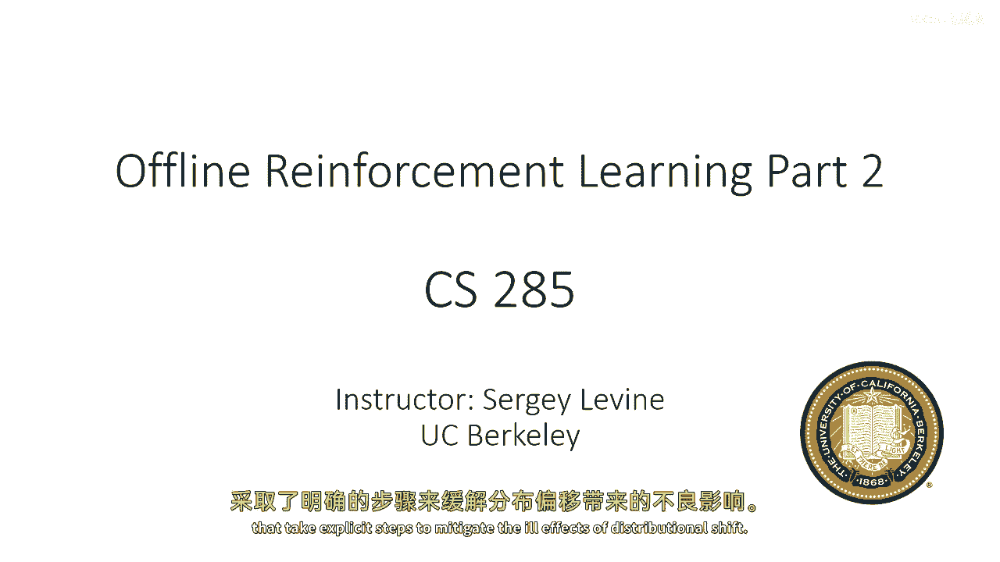

在本节课中，我们将继续探讨离线强化学习，并重点介绍一系列基于价值函数估计的现代离线强化学习算法。这些算法的核心在于，它们明确地采取了措施来缓解“分布漂移”这一核心挑战。

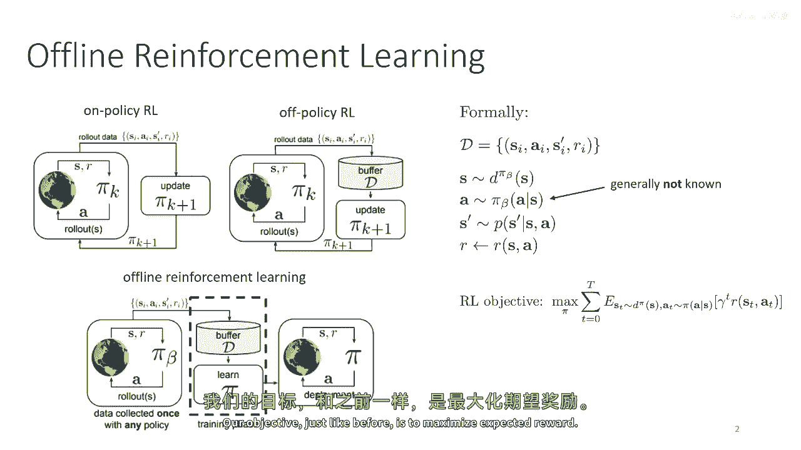

## 回顾：离线强化学习与分布漂移

上一节我们介绍了离线强化学习的基本概念。本节中，我们先简要回顾一下。

基于策略的强化学习算法通常需要与环境交互来收集数据，并用这些数据更新模型。离线强化学习则摒弃了主动数据收集，完全依赖于一个预先给定的离线数据集 `D`。这个数据集由某个未知的“行为策略” `π_β` 收集。

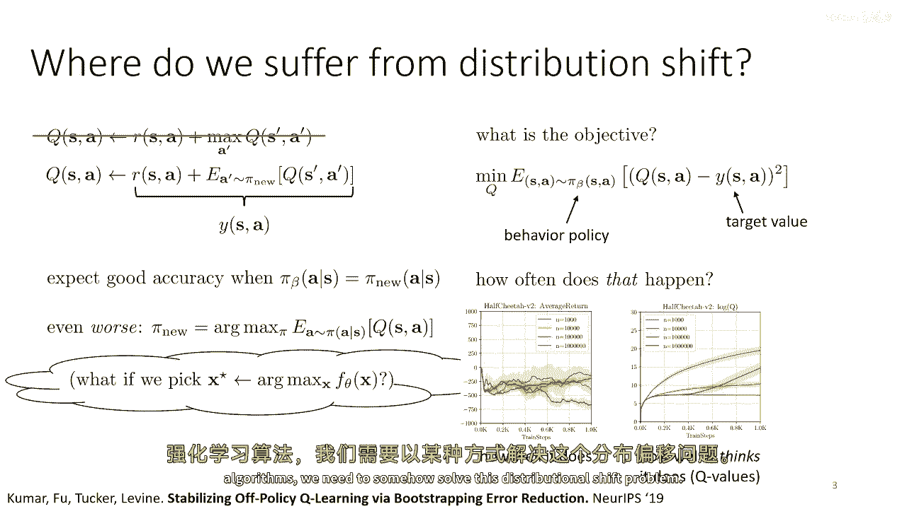

我们的目标依然是最大化期望奖励。然而，在使用基于价值的方法（如Q学习）时，我们会面临**分布漂移**问题。Q函数根据数据集 `D`（即 `π_β` 下的分布）来拟合其目标值。当我们用这个Q函数来评估或优化新策略 `π_θ` 时，由于 `π_θ` 与 `π_β` 的分布不同，Q函数在 `π_θ` 下的估计值会变得非常不准确。更糟糕的是，策略 `π_θ` 本身被训练为最大化Q值，这激励它去寻找那些Q函数可能错误地给出极高估计值的“对抗性”动作，导致实际性能很差但估计值虚高。

因此，要开发实用的深度离线强化学习算法，我们必须设法解决分布漂移问题。

## 策略约束方法：思路与局限

一种被广泛研究的方法是**策略约束方法**。这类方法通常在演员-评论家框架中，修改策略更新步骤，使其在最大化Q值的同时，还受到与行为策略 `π_β` 差异的约束。一个常见的约束是KL散度：

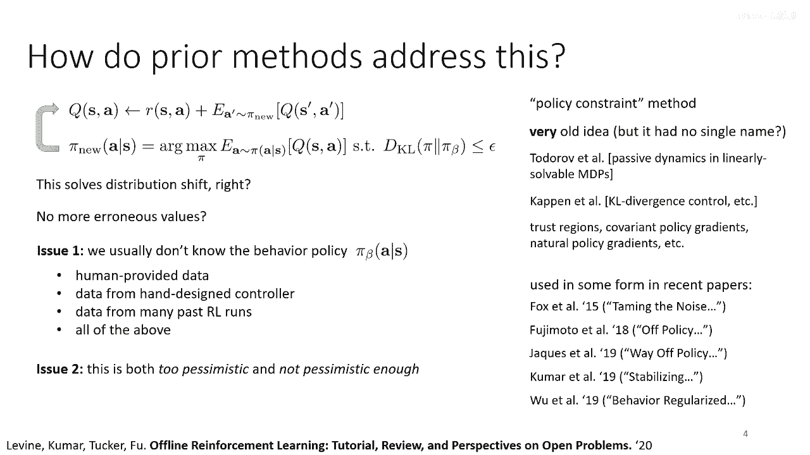

`D_KL(π_θ(·|s) || π_β(·|s)) ≤ ε`

从原理上讲，如果约束 `ε` 足够小，新策略 `π_θ` 就不会偏离 `π_β` 太远，从而减轻分布漂移。

然而，这种方法存在几个问题：
1.  **行为策略未知**：我们通常不知道 `π_β` 的具体形式，需要额外拟合模型来估计它，这增加了复杂性。
2.  **约束可能过于悲观或不足**：KL散度等约束可能无法精确反映我们真正关心的“支持范围”。我们理想的新策略应该只给数据集中出现过的、且Q值高的动作分配高概率。但KL散度约束可能会迫使策略给一些Q值低但 `π_β` 概率高的动作也分配一定概率，限制了性能提升。反之，简单的约束也可能无法有效阻止策略在数据支持范围外进行不可靠的探索。

因此，尽管策略约束方法提供了有用的分析工具，但若不加以精心设计和优化，其实际效果往往有限。

## 实现策略约束：显式方法

以下是几种显式执行策略约束的高层次方法概述。需要注意的是，这些方法通常不是当前最有效的。

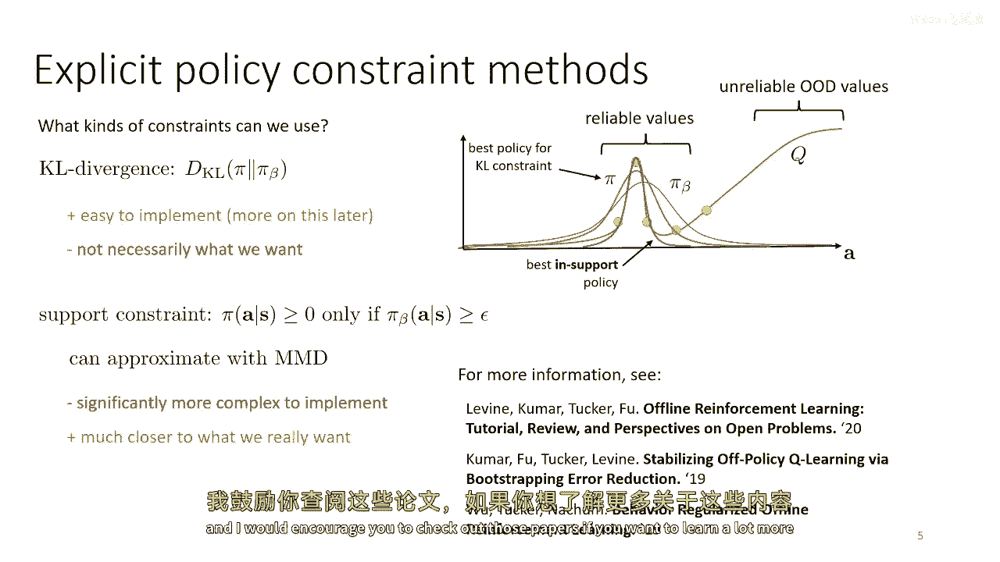

**1. 修改演员目标**
将KL散度约束通过拉格朗日乘子法融入演员的优化目标。演员的损失函数变为：
`L_actor = E_(s~D)[E_(a~π_θ(·|s))[-Q(s, a) + λ * (log π_θ(a|s) - log π_β(a|s))]]`
其中 `λ` 是拉格朗日乘子。这需要我们知道 `log π_β(a|s)`，通常需要通过行为克隆来估计 `π_β`。

**2. 修改奖励函数**
在奖励函数中直接添加一个基于策略差异的惩罚项，例如 `r'(s, a) = r(s, a) - α * D(π_θ(·|s), π_β(·|s))`。这种方法会让策略不仅考虑即时差异，还考虑未来可能产生的差异，具有不同的理论性质。

然而，现代高效的离线强化学习方法通常不采用上述显式约束的方式。

## 隐式策略约束与优势加权回归

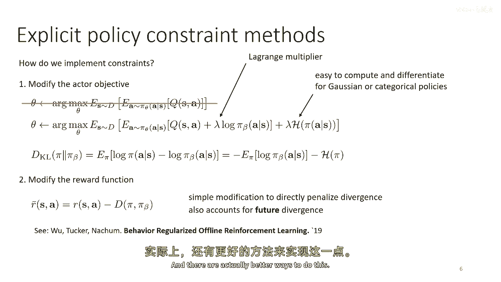

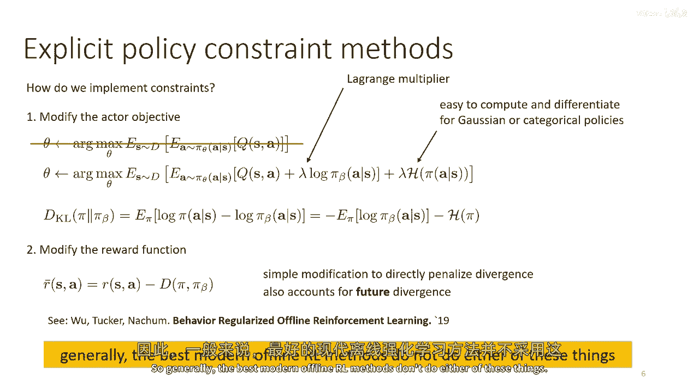

一种更优雅的方法是**隐式策略约束**。我们再次考虑带KL散度约束的策略优化问题。通过拉格朗日对偶性，可以推导出该问题的最优解具有如下形式：

`π*(a|s) ∝ π_β(a|s) * exp(Q(s, a) / λ)`

这个公式非常直观：最优策略正比于行为策略 `π_β` 乘以一个以优势函数（或Q函数）为指数的权重。`λ` 控制着权重分布的“温度”。虽然这个公式仍然包含 `π_β`，但关键点在于，我们可以通过**加权最大似然估计（即加权行为克隆）**来近似这个最优策略，而无需知道 `π_β` 的显式形式。

具体做法是：
1.  从数据集 `D`（即 `π_β`）中采样状态-动作对 `(s, a)`。
2.  使用当前评论家（Q函数）计算该动作的权重 `w(s, a) = exp(Q(s, a) / λ)`。
3.  通过最大化加权对数似然来更新策略 `π_θ`：
    `L_actor = E_((s,a)~D)[ -w(s, a) * log π_θ(a|s) ]`

这被称为**优势加权回归（Advantage-Weighted Regression, AWR）** 或类似变体。算法本质上是模仿数据集中的动作，但更侧重于模仿那些Q值高的好动作。它隐式地实现了策略约束，只需要来自 `π_β` 的样本，而不需要其概率密度。

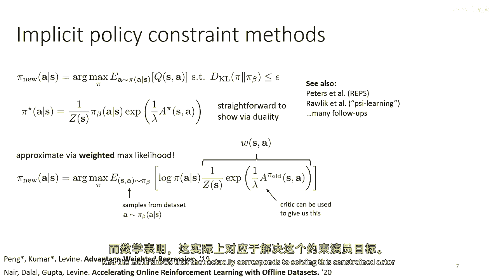

## 隐式Q学习：避免分布外查询

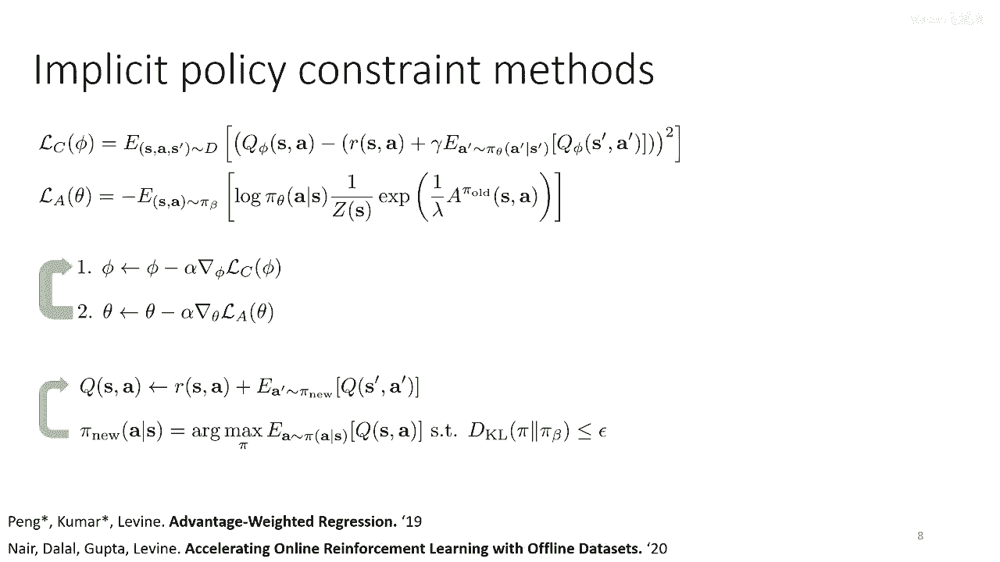

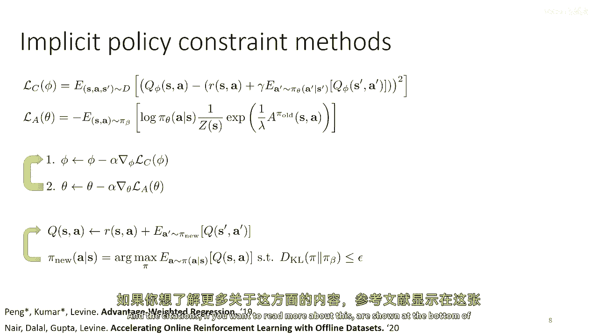

尽管优势加权回归很巧妙，但在训练过程中，为了估计优势函数，我们仍然需要查询策略 `π_θ` 下的动作，这可能会涉及分布外查询并引入误差。

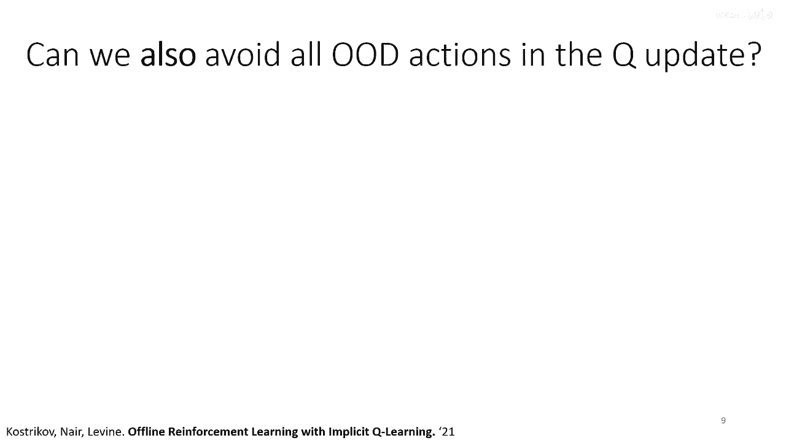

那么，能否设计一种方法，完全避免在训练过程中查询任何分布外动作呢？**隐式Q学习（Implicit Q-Learning, IQL）** 正是基于这一思想。

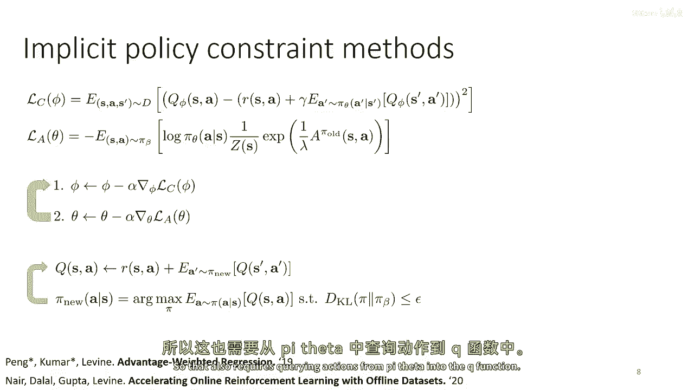

IQL的核心洞察是：我们可以通过修改价值函数 `V(s)` 的损失函数，使其回归到**数据支持范围内动作的Q值上界**，而不是Q值的期望。具体来说，它使用一种称为**期望分位数回归（Expectile Regression）** 的损失函数来代替均方误差损失。

对于分位数参数 `τ ∈ (0, 1)`，期望分位数损失定义为：
`L^τ(x, y) = |τ - 1_{y < x}| * (y - x)^2`
其中 `x` 是预测值，`y` 是目标值。当 `τ` 较大（如0.9）时，该损失函数对预测值低于目标值（负误差）的惩罚远大于对预测值高于目标值（正误差）的惩罚。因此，最小化这个损失会使预测值趋向于目标值分布的上分位数。

在IQL中，我们进行如下交替更新：
1.  **更新Q函数**：使用标准的贝尔曼备份和均方误差损失，以当前价值函数 `V` 为目标。
    `L_Q = E_((s,a,r,s‘)~D)[ (Q(s, a) - (r + γ V(s‘)) )^2 ]`
2.  **更新价值函数V**：使用期望分位数回归损失，让 `V(s)` 回归到数据集动作的Q值上。
    `L_V = E_((s,a)~D)[ L^τ( Q(s, a), V(s) ) ]`

通过选择较大的 `τ`，`V(s)` 将近似等于 `max_(a ∈ support(π_β(·|s))) Q(s, a)`，即数据支持范围内动作的最大Q值。整个训练过程**只使用数据集 `D` 中的状态-动作对**，完全避免了分布外查询。

训练完成后，我们需要从学到的Q函数和V函数中提取策略。这可以通过一步额外的**优势加权回归**来实现，即使用IQL训练好的Q函数来计算权重，然后进行加权行为克隆。

## 总结

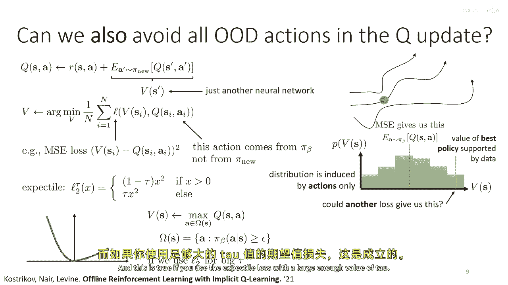

本节课我们一起学习了应对离线强化学习中分布漂移问题的几种高级方法。

*   我们首先分析了**策略约束方法**的直观思路及其在实践中的局限性。
*   接着，我们介绍了**隐式策略约束**的方法，特别是**优势加权回归（AWR）**，它通过加权行为克隆来隐式地逼近带约束的最优策略，无需知道行为策略的具体形式。
*   最后，我们探讨了**隐式Q学习（IQL）** 这一前沿方法。IQL通过**期望分位数回归**，使价值函数学习数据支持范围内动作的Q值上界，从而在训练过程中彻底避免分布外查询，最终通过一步策略提取获得高性能策略。

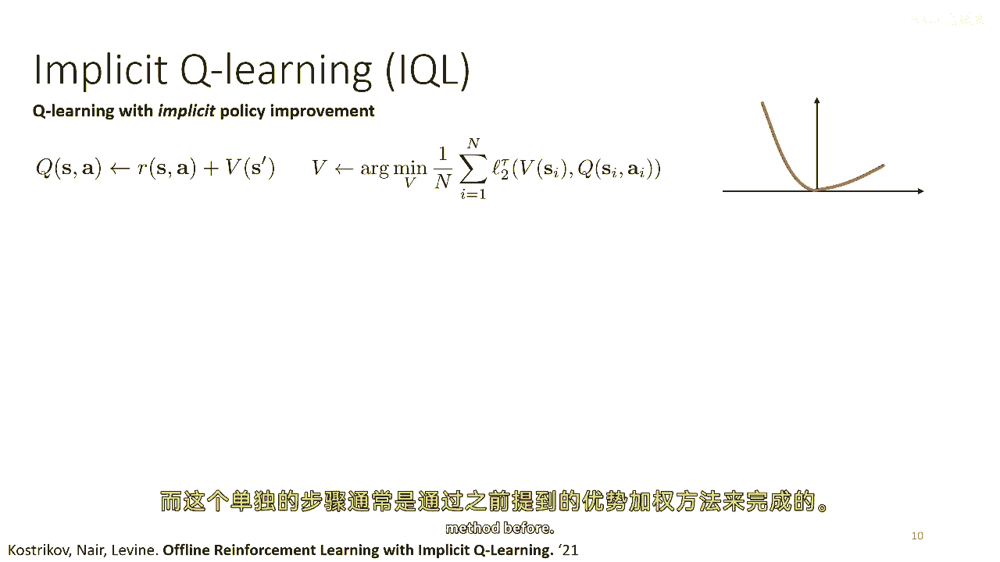

这些方法代表了当前离线强化学习领域为克服分布漂移、实现可靠离线训练的重要进展方向。