# 69：离线强化学习 2 🧠

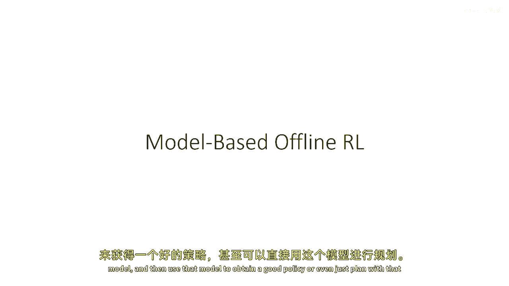

在本节课中，我们将学习基于模型的离线强化学习方法。我们将探讨如何利用离线数据集训练动态模型，并解决因模型在分布外状态和动作上产生错误而导致的策略利用问题。

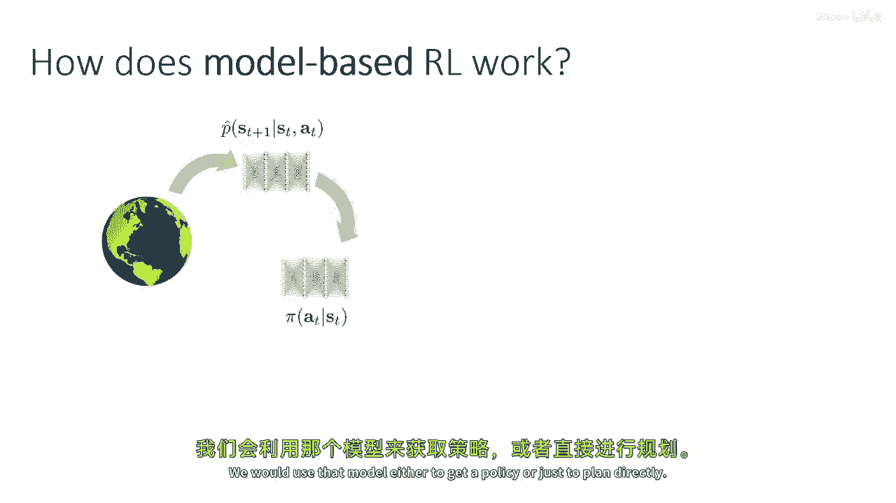

---

## 概述 📋

到目前为止，我们讨论的所有离线强化学习方法都是无模型的。然而，基于模型的方法非常适合离线强化学习，因为我们可以收集所有数据，在其上训练一个模型，然后使用该模型来获取良好策略，甚至直接进行规划。

基于模型的强化学习工作原理是：使用数据训练模型，然后利用该模型来获取策略或进行规划。通常，我们会收集更多数据，但在离线设置中，我们不再收集新数据，这就带来了问题。

## 离线设置中的问题 ⚠️

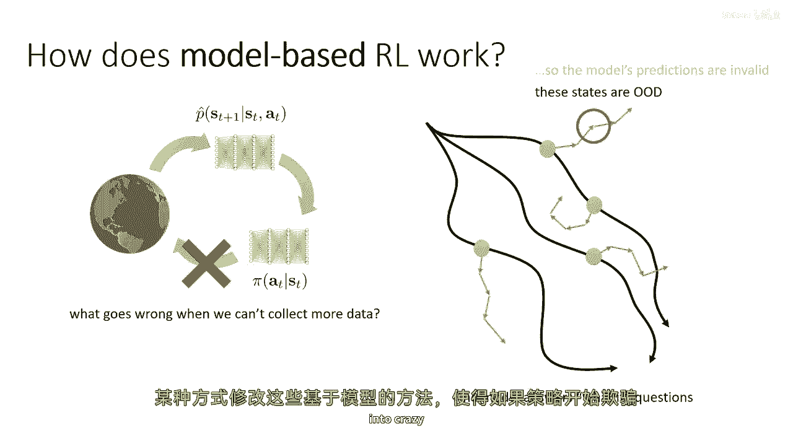

与Q函数类似，模型本质上是在尝试回答：“如果我们在数据集中的某个状态下采取不同的行动，将会进入什么样的状态？” 在讨论基于模型的强化学习时，我们曾介绍过Dyna风格的方法，即使用真实世界中收集的状态和动作作为短模型滚动的起点。

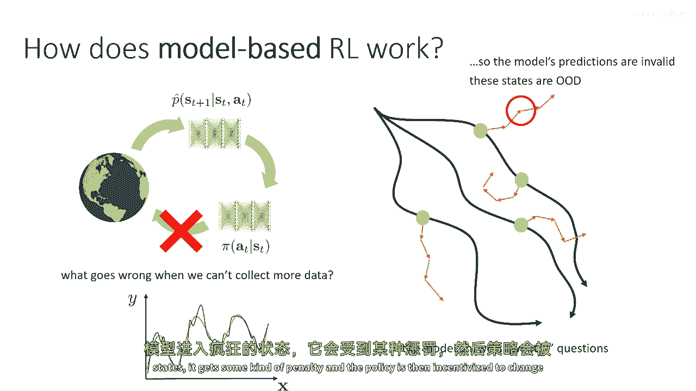

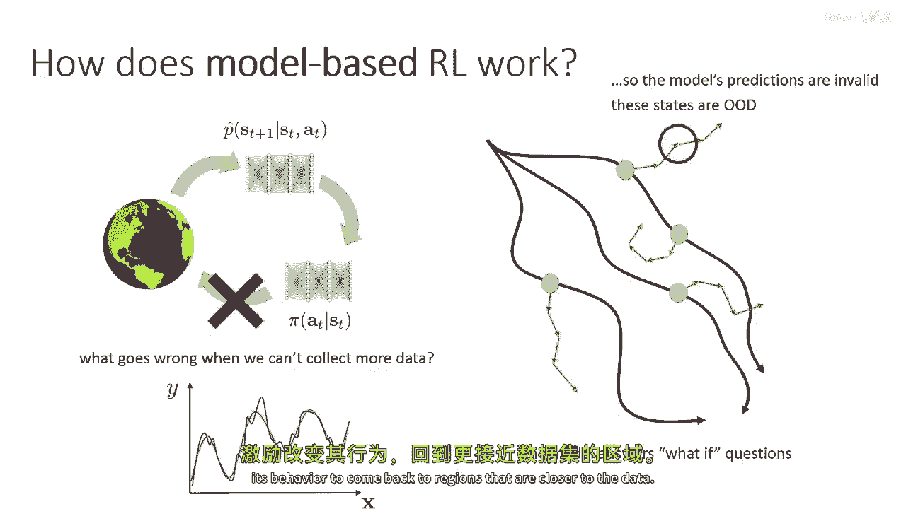

我们将要讨论的前两种基于模型的离线强化学习方法，本质上是将Dyna风格的方法适配到离线设置。在离线设置中，会出现什么问题呢？

当我们不再收集更多数据时，与Q函数类似，策略可能会学习采取一些“欺骗”模型的行动，这些行动会导致模型进入奖励虚高的状态，因为这些状态是分布外的。因此，我们不仅存在分布外动作的问题，还存在模型分布外状态的问题。策略可以采取一些疯狂的行动，欺骗模型进入分布外状态，并从那里进入更疯狂的状态，从而学习利用这一点。

## 解决方案思路 💡

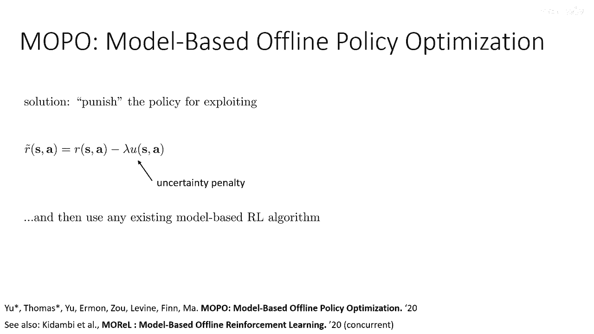

直觉上，为了修复这个问题，我们需要修改这些基于模型的方法，使得如果策略开始欺骗模型进入疯狂的状态，它会受到某种惩罚。这样，模型和策略就有动力改变其行为，回到更接近数据分布的区域。

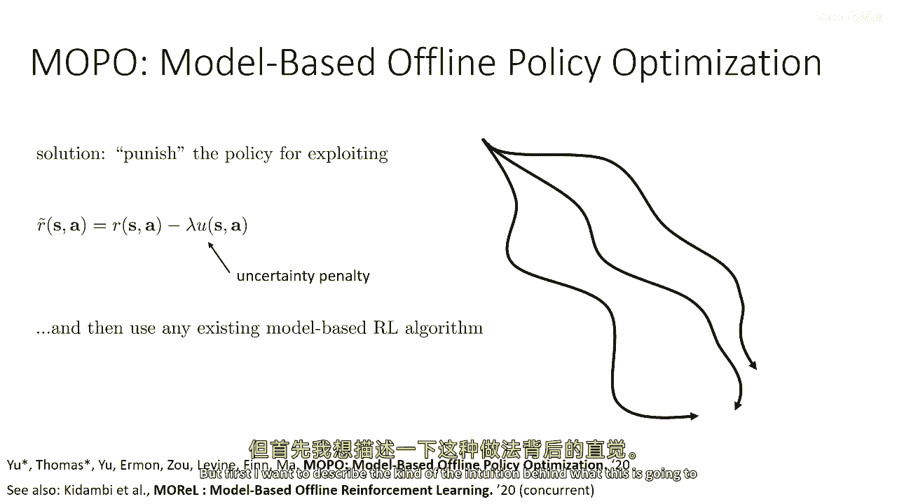

接下来，我们将讨论通过修改奖励函数来施加惩罚的方法。

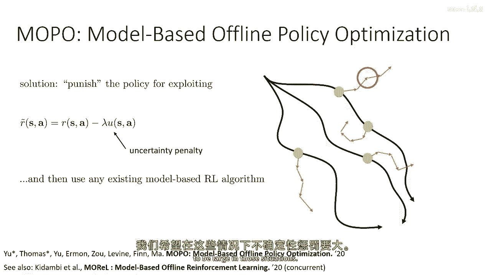

## 方法一：基于不确定性的惩罚 🧪

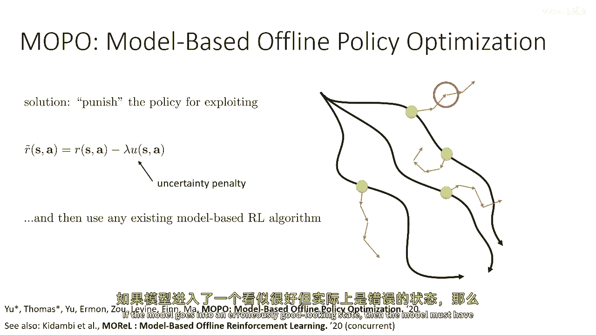

我将介绍一种名为MOPO（Model-Based Offline Policy Optimization）的特定方法。存在两种非常相似的方法：MOPO和MOReL。我将讨论MOPO版本，但它们概念上相当接近。基本思想是通过某种方式惩罚利用模型的策略。

我们惩罚策略的方式，是通过改变奖励函数或一般性地修改MDP模型。一种方法是让奖励函数为进入模型可能出错的状态分配一个小的惩罚。我们用字母 **u** 来表示这种不确定性惩罚。

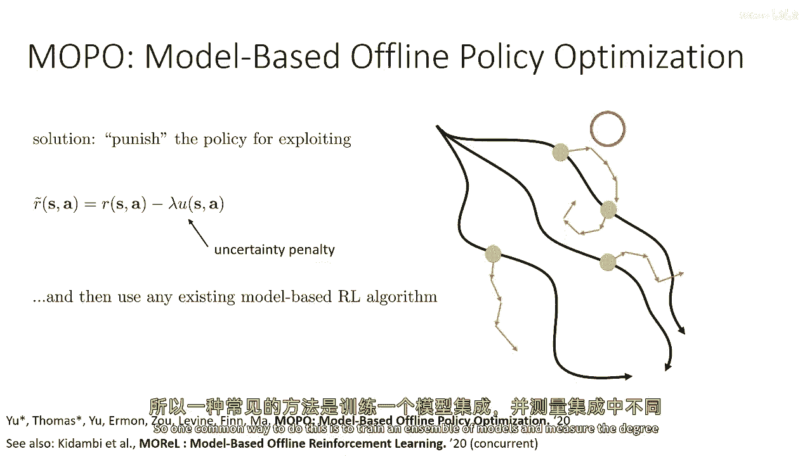

我们将添加这种不确定性惩罚，然后使用任何现有的基于模型的强化学习算法。在第二部分，我会解释我们可以使用的特定不确定性惩罚选择。

### 不确定性惩罚的直觉

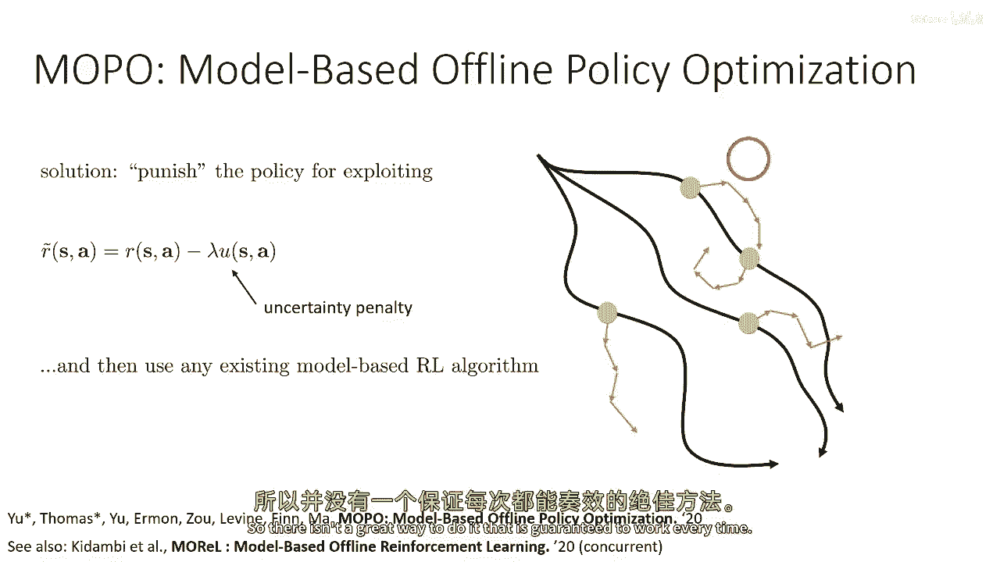

这种想法背后的直觉是：如果你的策略最终选择了一些欺骗模型进入具有更高奖励状态（但状态转移是错误的）的行动，那么在那些情况下，我们要求不确定性惩罚 **u** 要大。因此，不确定性惩罚本质上必须量化模型出错的概率。

如果模型进入了一个错误但看起来很好的状态，那么模型一定做错了什么。如果我们有一个好的不确定性惩罚，它应该能够捕捉到这一点。本质上，不确定性惩罚应该足够严厉地惩罚策略，使得利用模型变得不值得。这就是为什么我们必须精心选择乘数 **λ**。

如果我们精心选择它，使得惩罚总是比策略通过欺骗获得的收益成本更高，那么策略将改变其行为，避免那些疯狂的分布外状态。

### 技术实现

从技术上讲，我们需要满足的条件是：惩罚 **u** 应该至少等于根据某种散度度量（如总变分散度）的模型误差大小。但这并不是一个容易度量的量，因为你通常不知道模型的实际误差有多大。

在实际操作中，我们将使用在基于模型的强化学习讲座中讨论的模型不确定性技术之一，例如**集成模型**。一种常见的方法是训练一个集成模型，并测量不同模型之间的分歧程度，作为模型误差度量的代理。

然而，一般来说，获得一个好的误差度量，即获得一个至少等于或等于真实模型误差的估计，是一个开放性问题。没有保证每次都有效的方法，但集成分歧是一个常见的选择。

### 理论背景

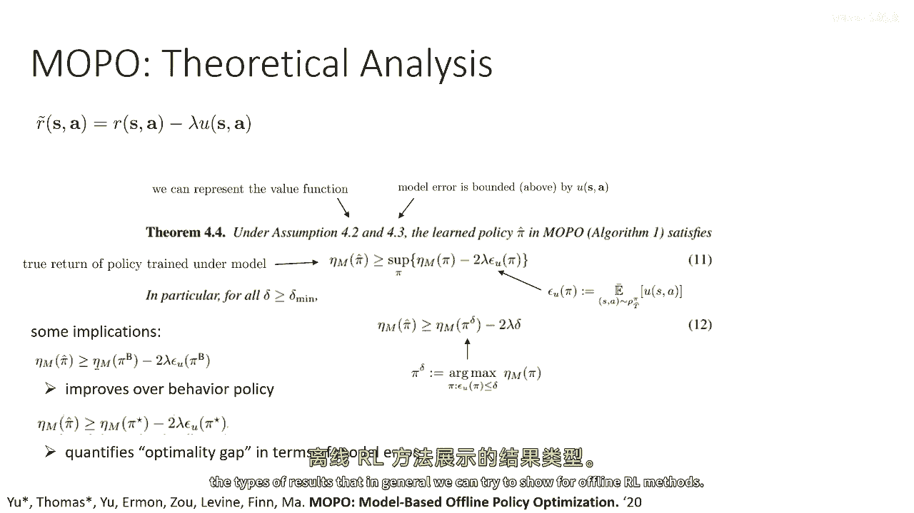

假设我们可以找到一个方法，它实际上能提供一个始终至少等于模型真实误差的误差度量。这里有一个有趣的结果可以证明。

我们有两个假设：
1.  价值函数足够具有表达性，我们可以准确地表示价值（使用大型神经网络时，可以假设为真）。
2.  关于惩罚 **u** 的假设：这是一个非常强的假设，它说模型误差（真实模型的误差）由 **u** 上界，意味着 **u** 至少等于模型的真实误差（按照某种散度度量）。

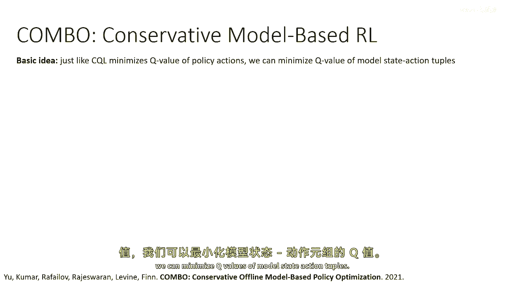

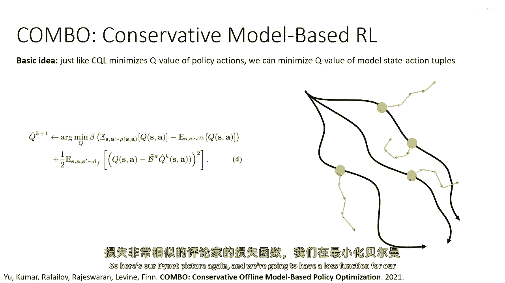

在上述假设下，可以证明：如果我们使用我们的模型来训练策略 **π̂**，那么该策略的真实回报将至少等于我们能找到的最佳策略（在修改后的奖励函数 `r - λu` 下）减去其预期误差。

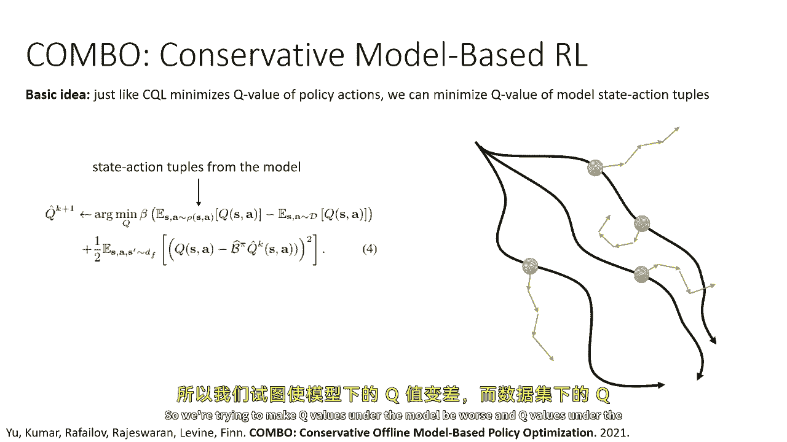

这个定理有几个有趣的启示：
*   如果我们将行为策略 **π_β** 代入，我们预期在行为策略访问的状态下，模型的误差将非常低（接近零）。如果 **u** 对于那个策略非常低，那么这个定理基本上保证我们学习的策略至少与行为策略一样好，这意味着我们很可能改进行为策略，或者至少不会偏离太多。
*   如果我们插入最优策略 **π***，那么我们学习的策略至少与 **π*** 一样好，减去模型在 **π*** 访问的状态上的错误惩罚。如果模型对于最优策略访问的状态和动作非常准确，这将保证我们将恢复接近最优的策略。

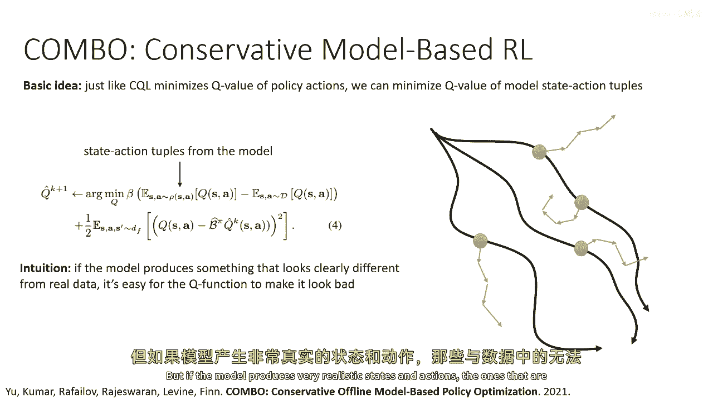

这些结果表明，这种方法可以改进行为策略，并且如果模型对最优策略访问的状态和动作准确，则可以接近最优策略。其准确性取决于你的数据。

## 方法二：COMBO 算法 🔄

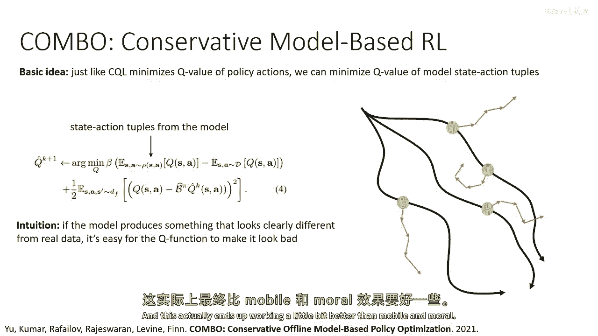

这是上述想法的一个更进化的版本，我们实际上可以应用类似SQL（Soft Q-Learning）的原则来建模基于离线强化学习的策略。这就是一种名为COMBO的新算法。

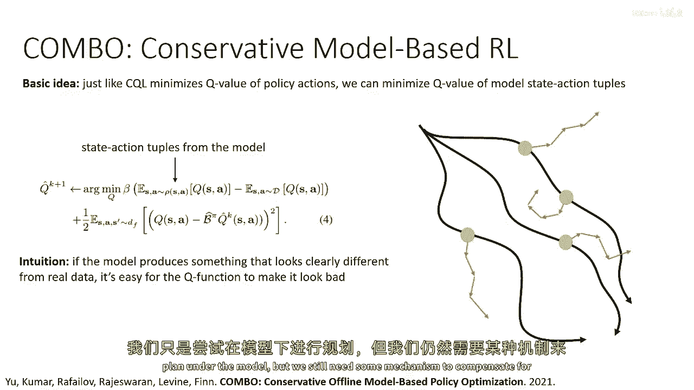

COMBO的基本思想是：就像SQL最小化策略下动作的Q值一样，我们可以最小化模型下状态-动作元组的Q值。

我们将有一个评论家损失函数，它看起来与之前的SQL损失非常相似，我们在最小化贝尔曼误差。但现在，我们将使用模型生成的数据来做到这一点。这是一种Dyna式方法：我们将在数据集中最大化Q值，然后，我们将“推低”模型生成的状态和动作的Q值。我们试图使模型下的Q值变得更差，而数据集中的Q值变得更好。

这里的直觉是：如果模型产生的状态和动作明显不同于真实数据，Q函数很容易使其看起来不好。但如果模型产生的状态和动作与数据集中的那些无法区分，那么这两个项应该真正达到平衡。这在某种意义上是一种GAN（生成对抗网络）的想法。

这种方法很好，因为我们实际上没有改变奖励函数，我们只是在对Q函数施加一个额外的正则化，即Q函数尝试使模型生成的状态和动作看起来更差。如果你不能使它们看起来比数据差，这意味着它们与数据无法区分，这意味着模型实际上是正确的。这种方法实际上比MOPO和MOReL工作得稍微好一点。

## 方法三：轨迹变换器（非Dyna式）🤖

我之前描述的所有算法都是Dyna式算法。我们实际上可以以非Dyna式方式进行离线强化学习，即不学习任何显式策略，而只是尝试在模型下进行规划。但我们仍然需要一些机制来补偿分布外动作。

我想介绍的一篇最近发表的论文叫做**轨迹变换器**。基本思想是训练一个**联合状态-动作模型**。我们不仅训练一个模型来基于当前状态和动作预测未来状态，我们将训练一个模型来预测整个轨迹的概率。这个模型通过在数据集中的轨迹上进行密度估计来提供状态-动作序列的概率。

直觉上，我们将使用这个分布来优化一个计划：我们会倾向于选择在这个分布下概率较高的动作序列。这意味着我们将避免在数据中非常不可能的动作，从而避免分布外动作。

此外，在进行离线模型强化学习时，我们可以使用一个非常大且表达能力强的模型，例如**Transformer**。因为不需要进行主动的数据收集，也不需要在试验之间更新模型，所以模型可以非常大且计算昂贵。Transformer是目前非常强大的序列密度估计模型。

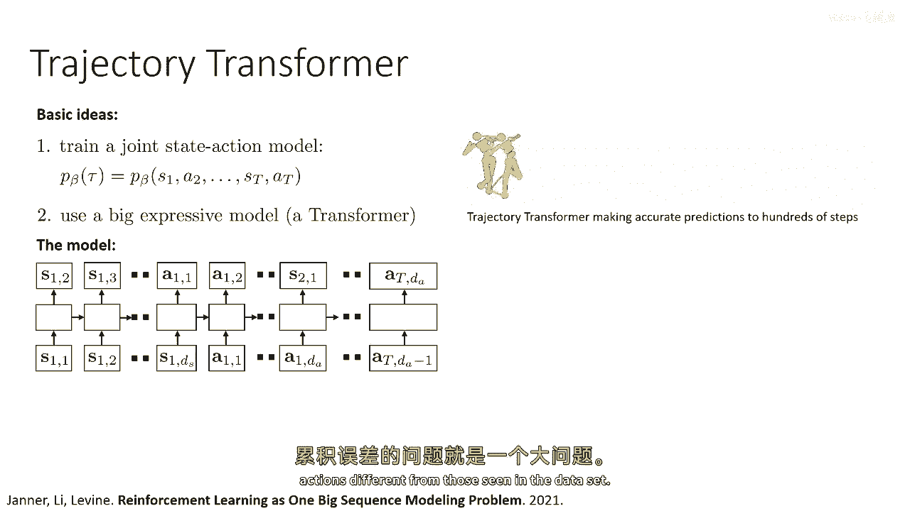

在实际操作中，轨迹变换器对每个时间步的状态和动作的每个维度进行离散化，并将其建模为一个自回归序列模型（例如使用带有因果掩码的Transformer）。然后，可以使用此模型进行规划。

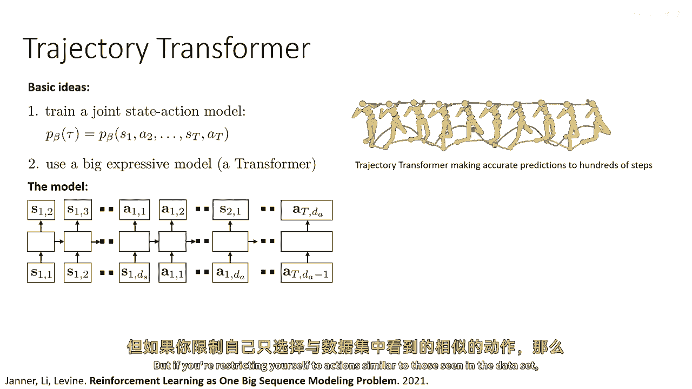

### 规划与束搜索

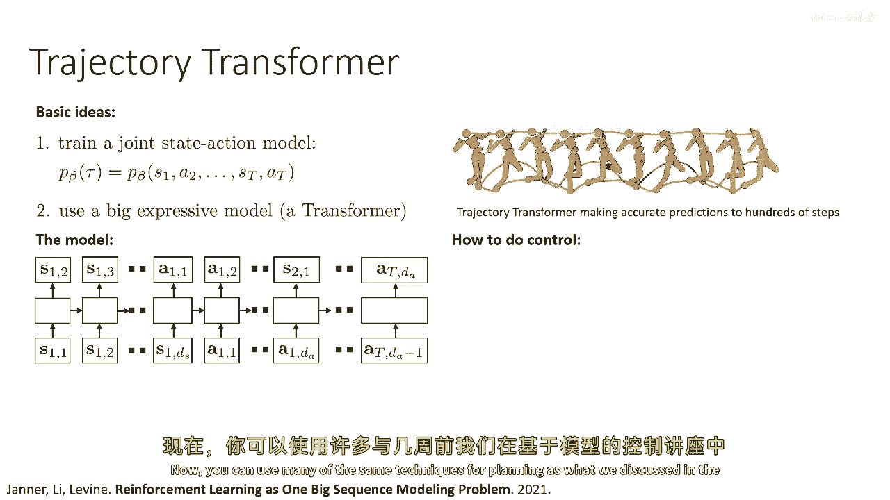

你可以使用许多相同的技术进行规划，就像我们在基于模型控制的讲座中讨论的那样。但重要的是要考虑动作的概率，因为你不想计划产生在数据下概率低的动作。

一种处理这个问题的方法是使用**束搜索**。但不同于使用束搜索来最大化序列概率，我们使用束搜索来最大化累积奖励。

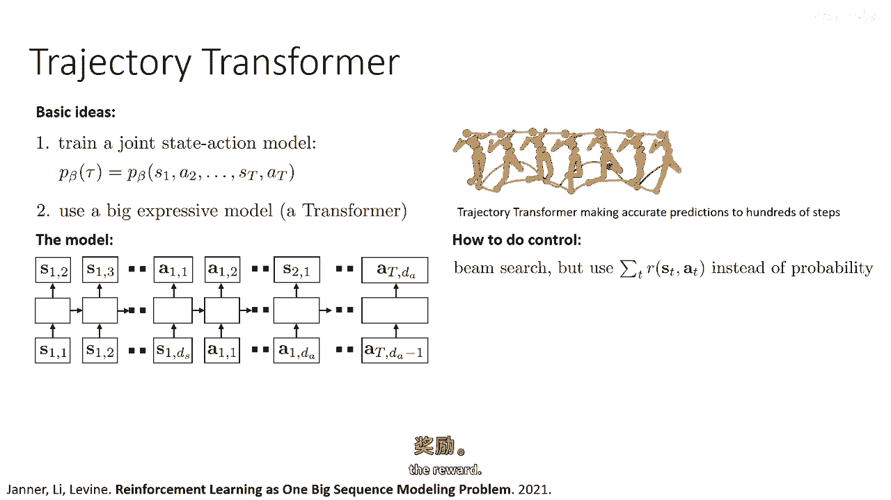

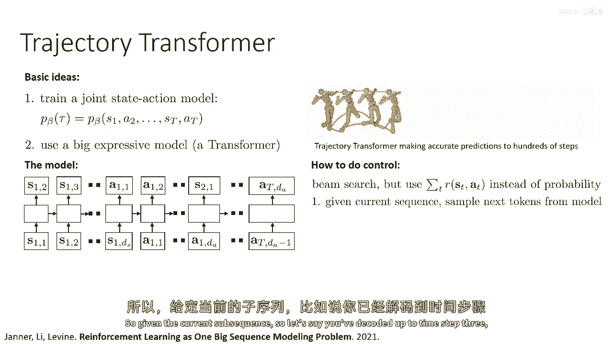

基本的高层思想是：
1.  给定当前解码出的子序列（前缀），从模型预测的下一个标记的概率分布中采样多个（例如k个）候选标记。
2.  对于每个候选标记，将其附加到前缀后，通过模型计算（或估计）完整序列的累积奖励。
3.  保留累积奖励最高的前k个序列作为新的前缀集。
4.  重复此过程，一步步生成完整的轨迹。

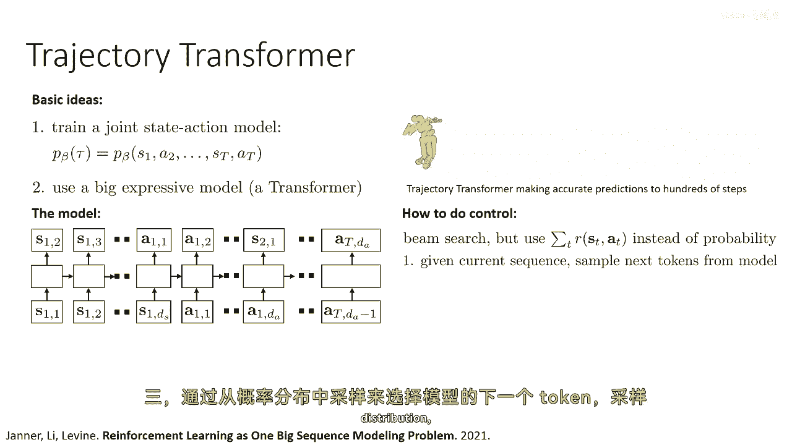

束搜索方法考虑了概率，因为它从 `p_β`（数据分布）中采样那些k个标记。它从数据集中概率高的标记中采样，然后从中选出能带来最高奖励的一个。

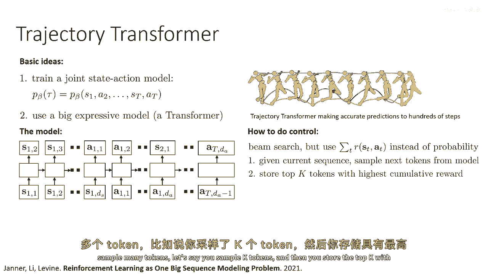

### 为何有效？

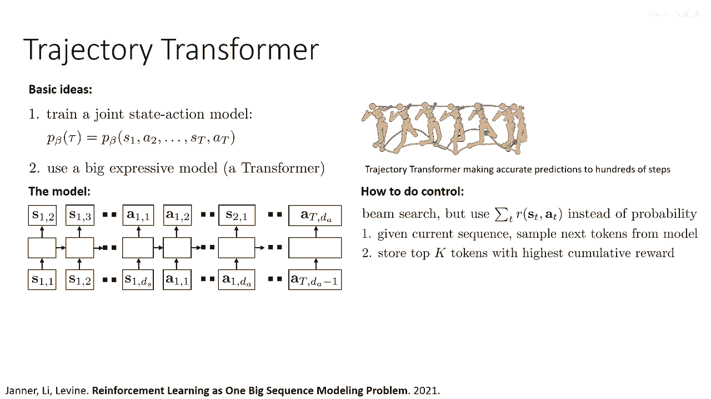

*   **生成高概率轨迹**：避免分布外状态和动作，因为你实际上在使用 `p_β` 的分布来选择状态和动作。
*   **使用大型模型**：在离线强化学习中效果很好，因为你可以使用大量的计算资源，并捕获复杂的行为策略和动态。
*   **准确的长时程预测**：如果你限制自己只选择与数据集中动作相似的动作，那么模型可以对未来很长一段时间做出非常准确的预测。

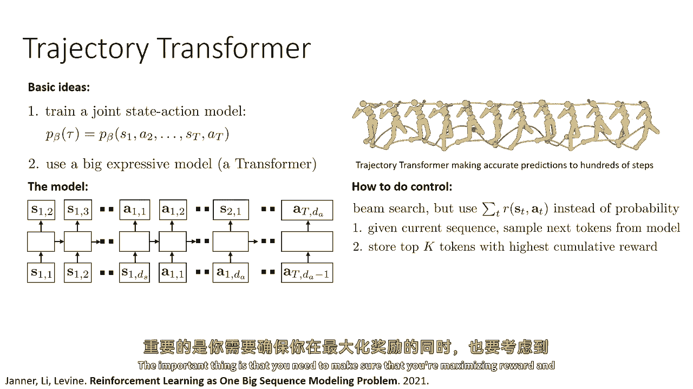

---

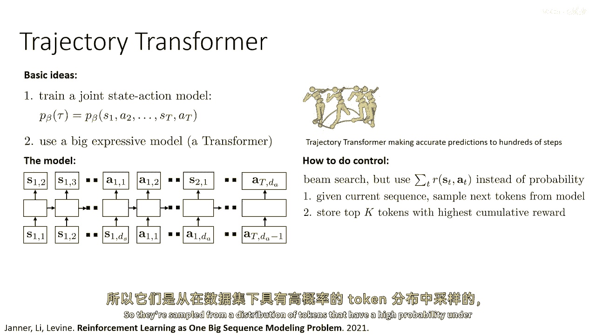

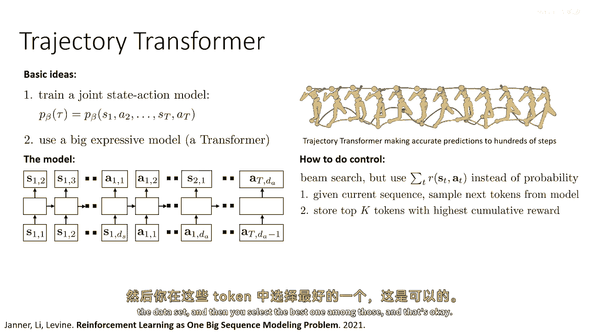

## 总结 🎯

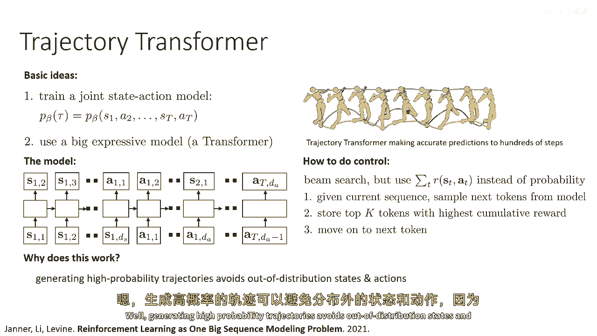

在本节课中，我们一起学习了基于模型的离线强化学习方法。我们首先了解了在离线设置中，基于模型的方法面临分布外状态和动作导致模型被欺骗的核心问题。

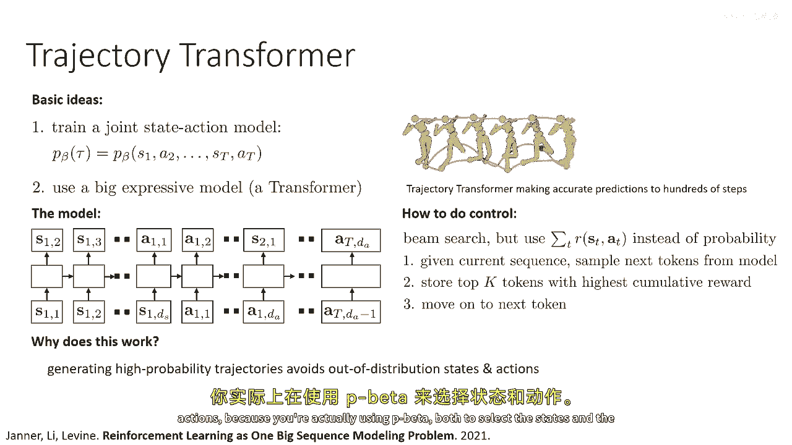

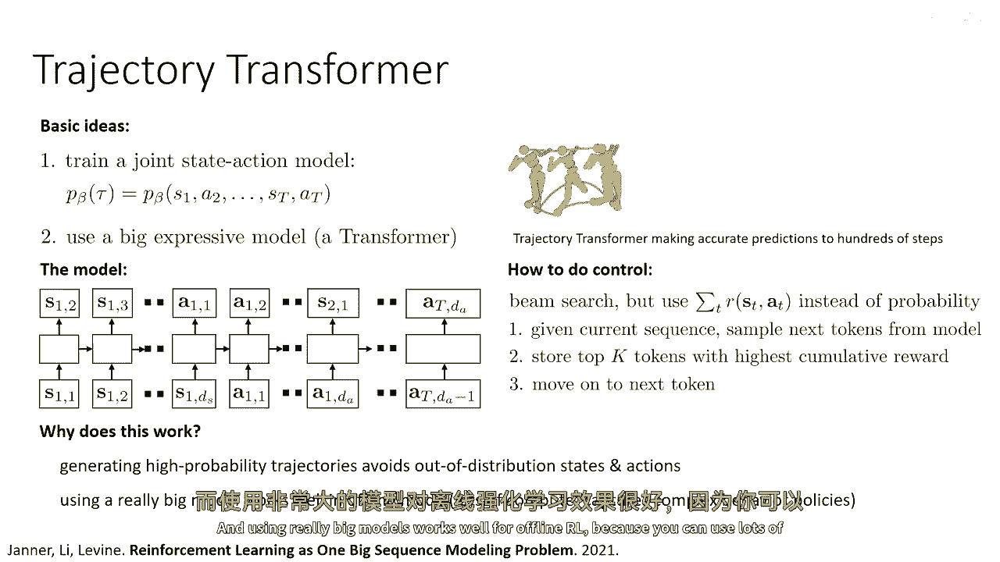

接着，我们探讨了三种主要的解决方案：
1.  **MOPO方法**：通过在奖励函数中引入基于模型不确定性的惩罚 **u**，来抑制策略访问模型可能出错的区域，从而保证策略性能的下界。
2.  **COMBO算法**：将类似SQL的正则化思想应用于模型生成的数据，通过让Q函数“贬低”模型生成的状态-动作对，间接促使模型生成更接近真实数据分布的轨迹。
3.  **轨迹变换器**：这是一种非Dyna式的规划方法。它通过训练一个强大的序列模型（如Transformer）来对整个轨迹进行密度估计，并利用束搜索等规划技术在保持高概率（接近数据分布）的同时最大化累积奖励。

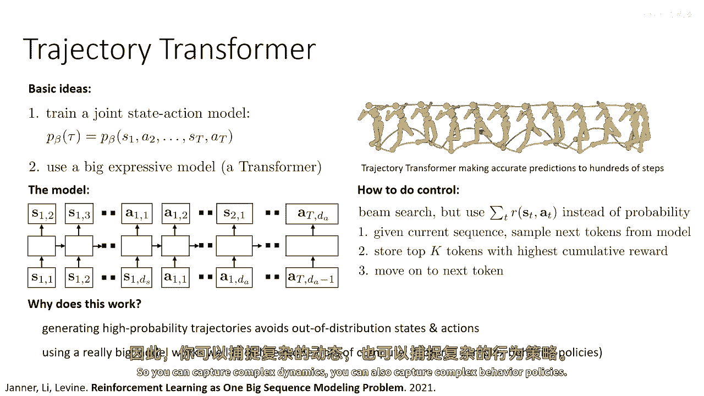

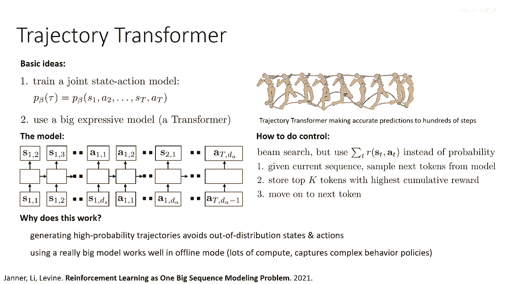

这些方法各有特点，但共同的核心思想都是通过某种形式的约束或正则化，将学习过程或规划过程限制在离线数据集支持的分布内，从而避免因模型在分布外区域的错误而导致的性能下降。基于模型的离线强化学习因其能利用强大模型进行长程规划，并在离线阶段投入大量计算，已成为一个非常活跃且有前景的研究方向。