# 70：离线强化学习应用与总结 🧠

在本节课中，我们将总结离线强化学习的关键内容，并探讨其实际应用场景与面临的开放性问题。我们将了解如何根据具体需求选择合适的算法，并理解离线强化学习在现实世界部署中的工作流程与优势。

## 算法选择指南 📋

上一节我们介绍了多种离线强化学习算法，本节中我们来看看如何根据具体场景选择合适的算法。以下是一个决策树式的选择指南，请注意，这是一个基于当前（约2021年）研究现状的大致准则，未来可能会有变化。

*   **仅进行离线训练（不进行在线微调）**：
    *   **保守Q学习（Conservative Q-Learning, CQL）** 是一个不错的选择。它只有一个超参数，被广泛理解和测试，并且在许多论文中被验证在纯离线模式下工作良好。
    *   **隐式Q学习（Implicit Q-Learning, IQL）** 也是一个好选择。它同样适用于纯离线模式，并且更灵活（也支持在线模式），但拥有更多的超参数。

*   **先离线训练，后进行在线微调**：
    *   **优势加权演员-评论家（Advantage-Weighted Actor-Critic, AWAC）** 是一个好选择。它在该领域被广泛使用并经过良好测试。
    *   **保守Q学习（CQL）** 在离线模式下表现出色，但因其倾向于过于保守，在线微调效果不佳。
    *   **隐式Q学习（IQL）** 是离线训练后在线微调的好选择。实验表明其性能似乎优于AWAC，尽管它出现时间不长，验证范围不如前者广泛。

*   **基于模型的离线强化学习方法**：
    *   如果你有信心在特定领域训练出高质量的动态模型，**COMBO** 是一个不错的选择。它可以看作是结合了模型的SQL，是当前性能最佳的基于模型的离线强化学习方法之一。
    *   如果训练高质量模型很困难，**轨迹变换器（Trajectory Transformer）** 可能是一个选择。它使用强大有效的模型，但缺点是训练和评估计算量极大，且因不直接学习策略，在长时程任务上可能存在限制。

## 离线强化学习的应用优势 🚀

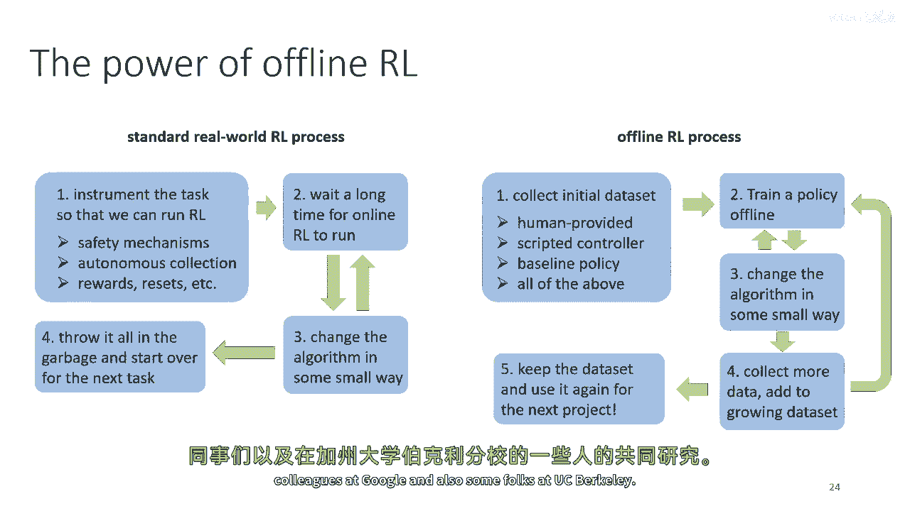

了解了算法选择后，我们来看看离线强化学习为何能成为现实世界应用的强大框架。通常，在线强化学习严重依赖模拟器。如果没有模拟器，直接在现实世界中部署在线强化学习流程繁琐且迭代缓慢。

相比之下，离线强化学习的工作流程更具实用性：

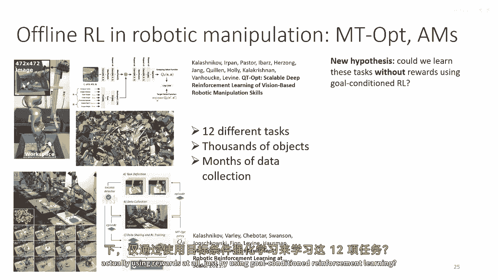

1.  **收集原始数据集**：数据可来自人类演示、脚本控制器、已有策略或其组合。
2.  **设计奖励函数**：可以手动标注数据集的奖励，无需完全自动化的奖励函数。
3.  **使用离线RL训练策略**：在数据集上训练策略。
4.  **轻量级迭代与评估**：修改算法后，无需重新收集数据，只需重用或扩增现有数据集。虽然仍需在线运行策略以评估性能，但这比完整的在线训练轻量得多。
5.  **数据集复用**：未来在类似领域的新项目可以直接复用已有的数据集。

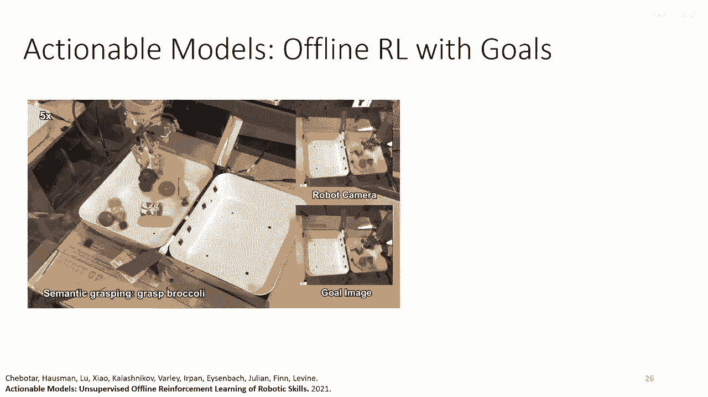

这种流程使得在现实世界（如机器人、医疗、金融等领域）中快速测试新算法思想成为可能，而无需承担在线探索的风险和高昂成本。

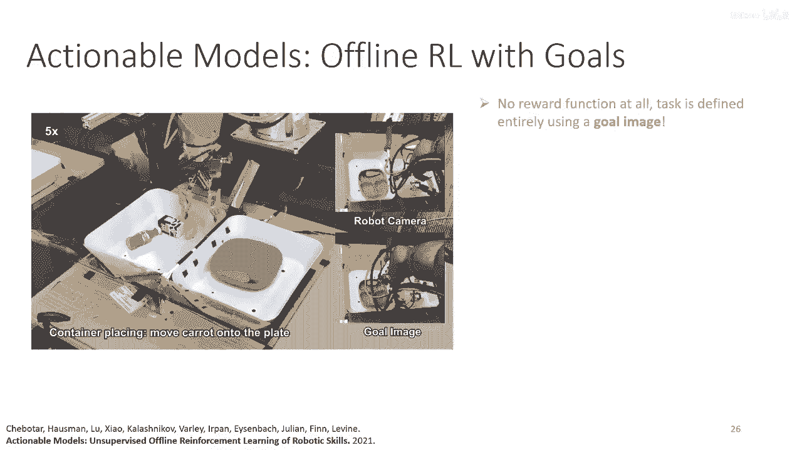

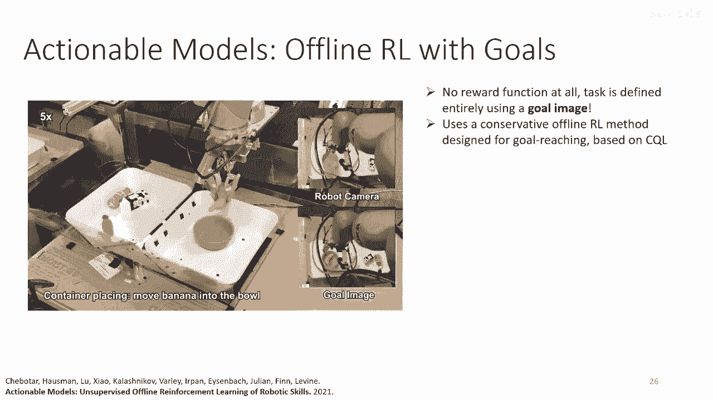

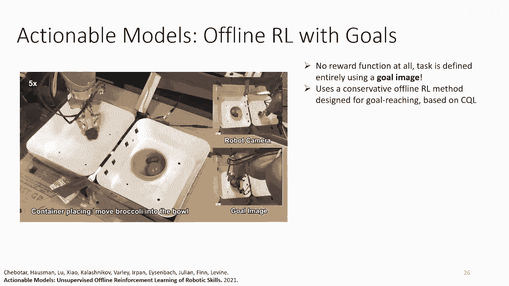

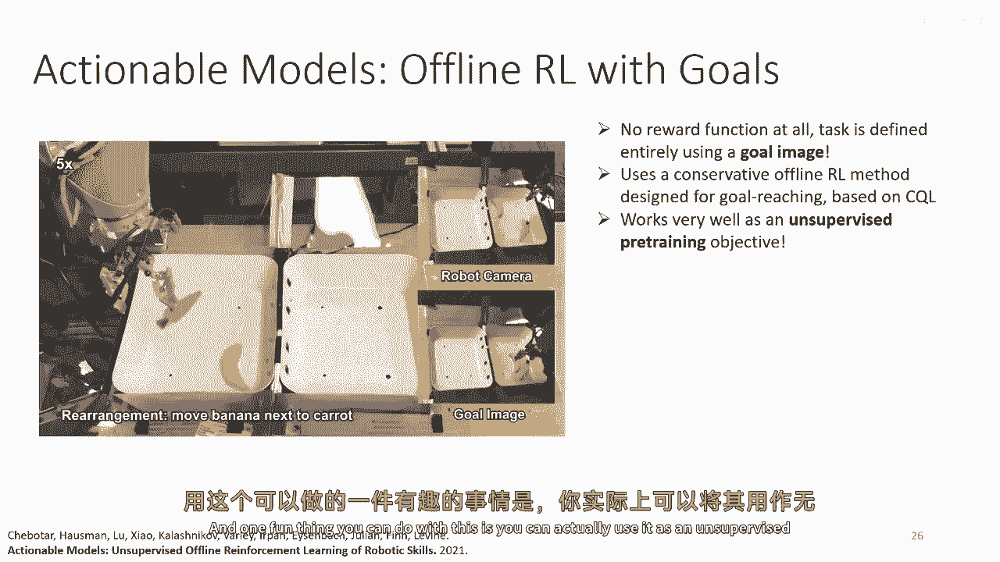

## 研究实例与未来方向 🔬

接下来，我们通过一些研究实例来具体感受离线强化学习的应用，并探讨其未来的发展方向。

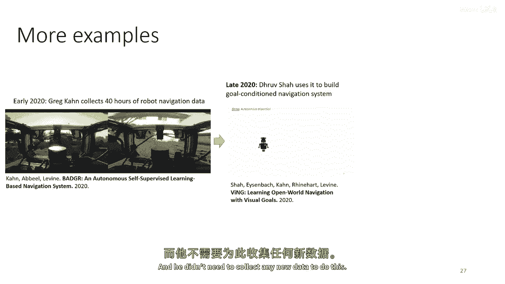

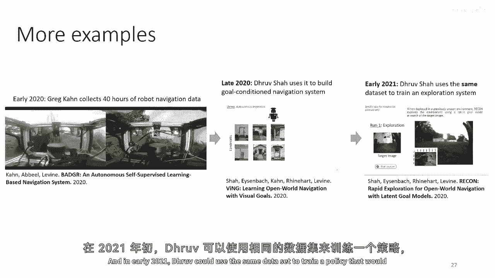

**实例一：机器人多任务学习**
一项大规模现实世界机器人项目收集了涵盖12项任务、涉及数千物体、耗时数月的数据。研究者提出假设：能否在不使用真实奖励函数的情况下，仅通过**目标条件强化学习**（即给定目标图像，自动计算奖励）来学习这些任务？他们直接复用已有的庞大离线数据集训练策略，成功验证了这一假设，使机器人能够完成抓取和重新排列等任务。这展示了离线RL如何允许研究者在不收集新数据的情况下，快速验证新算法思想。

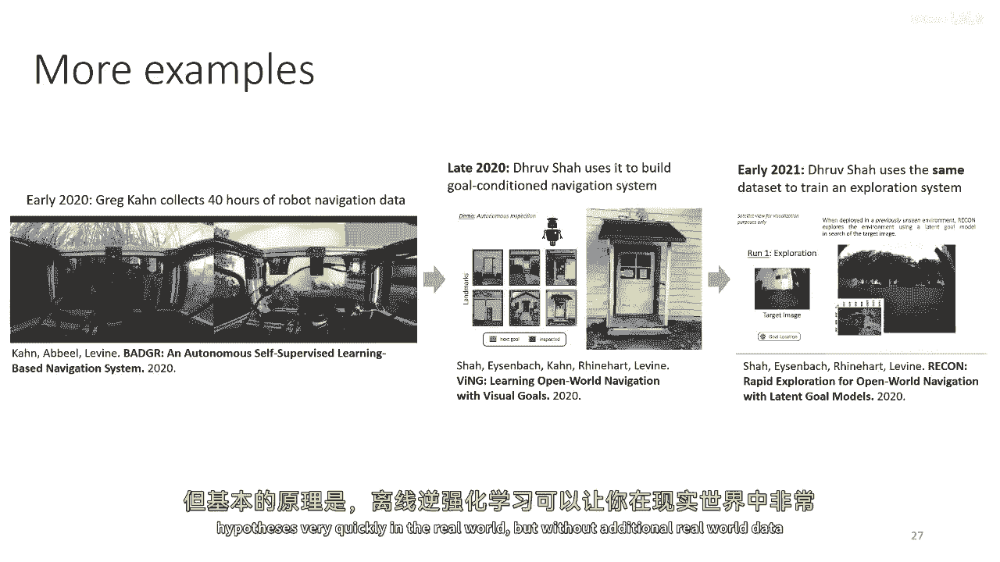

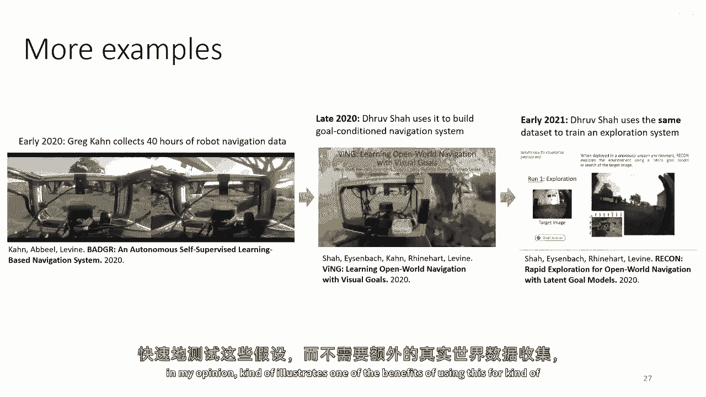

**实例二：机器人导航**
另一个研究利用约40小时的机器人驾驶离线数据集，训练了一个**目标条件导航系统**，可以实现送信、送披萨等功能。研究者无需为这个新系统收集任何额外数据，直接通过离线强化学习在原有数据集上训练出新策略，再次体现了其高效复用数据、快速测试新想法的优势。

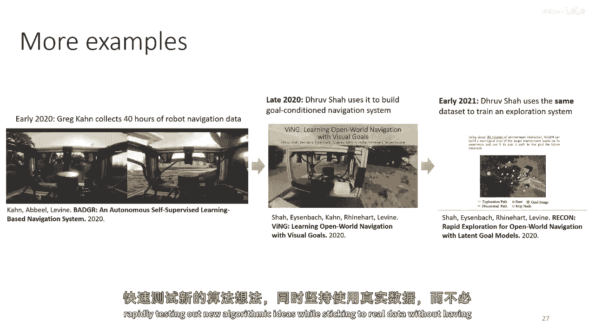

**开放性问题与未来方向**
尽管前景广阔，离线强化学习仍面临诸多挑战：

*   **工作流程与评估**：在监督学习中，我们有清晰的训练-验证-测试分割来评估模型。在离线RL中，等效的、无需在线部署的可靠评估工作流程仍不成熟。这是一个重要的开放问题。
*   **统计保证**：虽然存在一些关于分布漂移的理论界限和结果，但它们通常较为宽松且不完整，需要更坚实的理论保障。
*   **大规模应用的可扩展性**：从原理上讲，离线RL可应用于众多领域，但在实践中尚未广泛普及。需要更深入地理解其在真实世界应用中的具体限制和约束，以推动其发展。

## 总结 📝

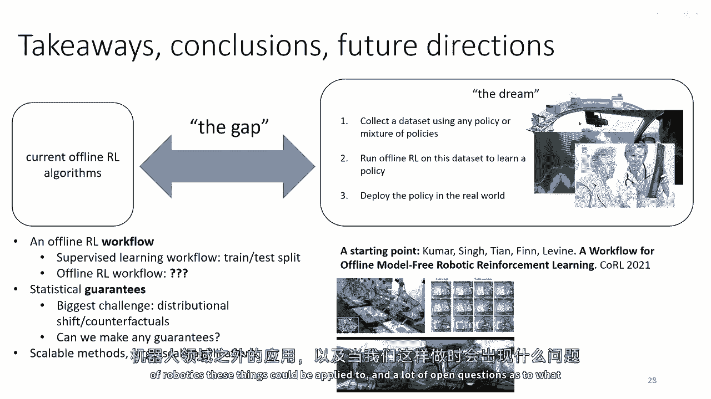

本节课我们一起学习了离线强化学习的算法选择指南，理解了其相较于在线强化学习在现实世界应用中的流程优势，并通过研究实例看到了其实际应用潜力。最后，我们探讨了该领域在评估流程、理论保证和可扩展性方面面临的开放性问题。离线强化学习为实现安全、高效的现实世界智能系统提供了一条充满希望的道路。