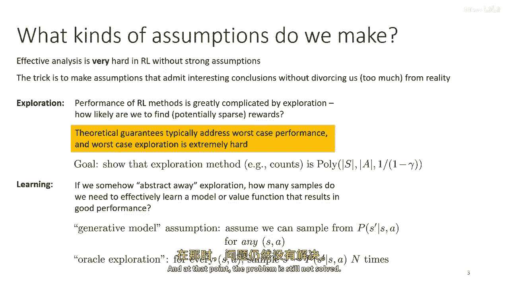
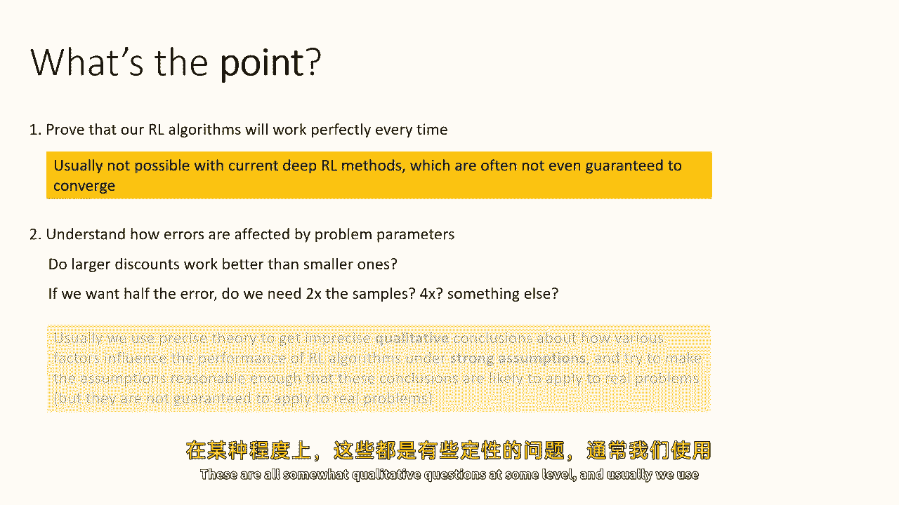
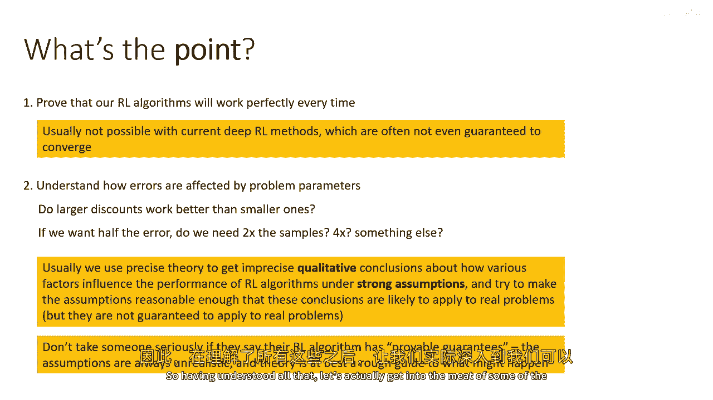
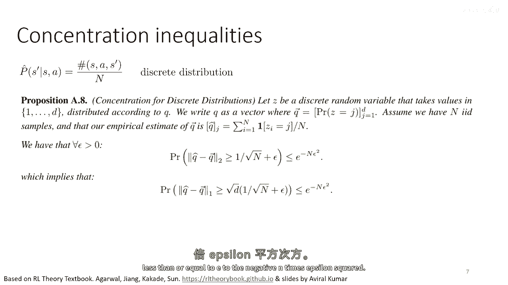
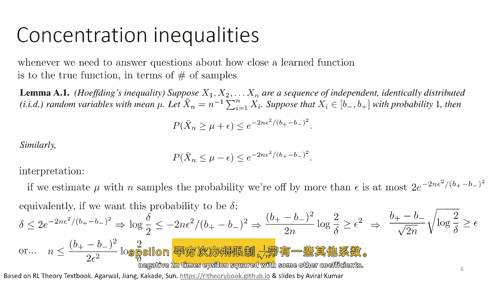
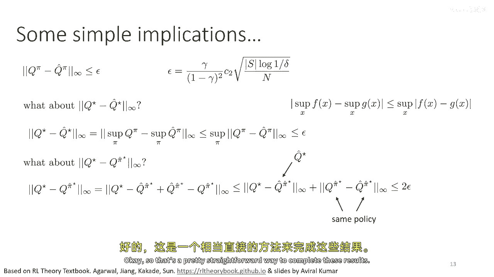

# 71：强化学习理论入门 🧠

在本节课中，我们将简要探讨强化学习理论。这是本课程中唯一的理论讲座，因此不会深入细节。我们的主要目标是让你了解在强化学习算法中可以进行的理论分析类型，以及从这类分析中可能得出的结论。

## 理论分析的核心问题 ❓

上一节我们介绍了课程目标，本节中我们来看看理论分析通常会问哪些问题。当我们进行强化学习理论分析时，会提出多种问题，以下是几个常见的例子：

*   **样本复杂性与性能**：给定一个算法，在提供 N 个样本并经过 K 次迭代后，其性能如何？“好”意味着什么？例如，在 Q 学习中，我们可能问：经过 K 次迭代后，学习到的 Q 函数 `q_hat_k` 与真实最优 Q 函数 `q_star` 的差距有多大？我们能否证明，在某种范数下，`q_hat_k` 与 `q_star` 的差距不超过 ε？
*   **策略性能与遗憾**：在迭代 K 时，由 Q 函数诱导出的策略 `π_k` 表现如何？具体来说，策略 `π_k` 的真实 Q 值 `q_π_k` 与最优 Q 值 `q_star` 的差距是多少？这实际上衡量了策略 `π_k` 的预期奖励与最佳可能奖励之间的差距，是一种“遗憾”的度量。
*   **探索算法的遗憾**：如果使用特定的探索算法，其“遗憾”（即累积的性能损失）会有多高？例如，某些探索方法可能保证遗憾的增长与时间 T 的对数成正比。

我们将主要关注**样本复杂性**这类问题。

## 理论分析的假设与目的 🎯

在深入分析之前，我们需要理解理论分析通常建立在较强的假设之上，并且有其特定目的。

### 常见的理论假设

在最一般的设置下分析完整的深度强化学习方法通常非常困难。因此，理论分析需要做出一些简化但能引出有趣结论的假设。

*   **分离探索与学习**：探索的难度通常会主导样本复杂性的分析。为了单独研究学习的样本复杂性，我们有时会**抽象掉探索问题**。
*   **生成模型假设**：一种常见的简化是假设存在一个“生成模型”或“神谕”，允许我们根据需要从马尔可夫决策过程（MDP）的任意状态-动作对中采样任意数量的转移样本。这当然不现实，但它允许我们专注于研究“学习”本身有多难，而不被“探索”的复杂性所困扰。

### 理论分析的目的

理论分析的目的并非证明某个算法在实际中每次都完美工作（这对于深度强化学习方法目前是不可能的），而是：

*   **理解错误如何受问题参数影响**：例如，更大的折扣因子 γ 会让问题更容易还是更难解决？状态空间变大时，需要多少样本？如果我们想将误差减半，需要将样本数量增加两倍还是四倍？
*   **提供定性指导**：理论分析为我们提供了关于各种因素如何影响算法性能的**定性结论**。这些结论可以指导我们选择参数和进行算法设计。例如，理论可以告诉我们错误如何随“有效地平线” `1/(1-γ)` 增长。

重要的是要明白，理论结果基于简化的假设，它们为算法在理想化情况下的潜力和局限提供指导，而非实际性能的保证。

## 基础分析工具：集中不等式 📉

为了将监督学习中的误差分析工具引入强化学习，我们首先需要回顾一些基础数学工具。

当我们研究样本数量 N 如何影响对某个量的估计误差时，需要使用**集中不等式**。它们量化了随机变量的估计值以多快的速度集中在真实值（期望值）附近。

以下是两个核心的不等式：

*   **霍夫丁不等式**：适用于估计有界实值随机变量的均值。假设我们有 N 个独立同分布的样本 `X1, X2, ..., XN`，其均值 μ 未知，且每个样本的取值范围在 `[b-, b+]` 之间。样本均值 `X_bar_N` 与真实均值 μ 的绝对差超过 ε 的概率有一个上界：`P(|X_bar_N - μ| ≥ ε) ≤ 2 * exp(-2Nε² / (b+ - b-)²)`。由此可以推导出，要达到误差 ε 和置信度 1-δ，所需样本数 N 大致按 `1/ε² * log(1/δ)` 缩放。
*   **类别分布估计的集中不等式**：适用于估计离散（类别）随机变量的概率分布。假设一个随机变量 Z 有 D 个可能取值，其真实分布为向量 q。我们用 N 个样本得到的经验分布为 `q_hat`。那么，经验分布与真实分布之间的 **1-范数误差**（即总变分距离）超过 `√(D/N) + ε` 的概率有一个上界：`P(||q_hat - q||₁ ≥ √(D/N) + ε) ≤ exp(-Nε²)`。同样，我们可以推导出样本复杂度与 `D/ε² * log(1/δ)` 相关。

在强化学习中，当我们用计数法估计状态转移概率 `P(s'|s,a)` 时，D 就是状态空间的大小 |S|。因此，对于每个状态-动作对 (s,a)，使用 N 个样本估计的转移模型 `P_hat` 与真实模型 P 的总变分距离，将以高概率被 `O(√(|S|/N))` 所界定。

## 从模型误差到值函数误差 🔗

现在，我们进入强化学习理论的核心部分：理解模型 `P_hat` 的估计误差如何影响 Q 函数 `Q_hat^π` 的误差。

我们考虑一个简化的场景：在**神谕探索假设**下，我们拥有一个固定的策略 π。我们通过采样估计出模型 `P_hat`，然后**精确地**求解在模型 `P_hat` 下策略 π 的 Q 函数 `Q_hat^π`（例如，通过解析求解或迭代法）。我们的目标是分析 `Q_hat^π` 与真实 MDP 中策略 π 的 Q 函数 `Q^π` 之间的差距。

首先，我们利用贝尔曼方程建立 Q 函数与模型 P 的关系。对于固定策略 π，其 Q 函数满足：
`Q^π = R + γ * P * V^π`，其中 V^π = Π * Q^π（Π 是策略矩阵）。
整理后可得：`Q^π = (I - γ P Π)^{-1} R`。
同理，对于学习到的模型，有：`Q_hat^π = (I - γ P_hat Π)^{-1} R`。

接下来，我们使用一个关键引理——**模拟引理**，来连接模型误差与 Q 函数误差。

**模拟引理**：
`Q^π - Q_hat^π = γ * (I - γ P_hat Π)^{-1} * (P - P_hat) * V^π`

这个引理通过代数推导证明，它表明 Q 函数的误差可以表示为模型误差 `(P - P_hat)` 经过一个“评估算子” `γ(I - γ P_hat Π)^{-1}` 变换后的结果。

为了从模拟引理得到误差上界，我们需要另一个引理来界定这个“评估算子”对向量的放大效应。

**评估算子范数引理**：
对于任何向量 v，有 `|| (I - γ P_hat Π)^{-1} v ||_∞ ≤ ||v||_∞ / (1 - γ)`。

直观理解：这个算子对应于在折扣因子 γ 下计算无限累积奖励，其最大放大倍数就是有效地平线 `1/(1-γ)`。

将模拟引理与评估算子范数引理结合，我们可以得到：
`||Q^π - Q_hat^π||_∞ ≤ (γ / (1-γ)) * || (P - P_hat) V^π ||_∞`
进一步，假设奖励值在 [0, R_max] 之间（为简化常设 R_max=1），则 `||V^π||_∞ ≤ R_max/(1-γ)`。同时，`|| (P - P_hat) V^π ||_∞` 可以被 `||P - P_hat||_1 * ||V^π||_∞` 所界定（这里 `||·||_1` 是矩阵的行和范数，对应最坏情况的总变分距离）。

最终，我们得到核心结论：
`||Q^π - Q_hat^π||_∞ ≤ (γ / (1-γ)²) * max_{s,a} ||P(·|s,a) - P_hat(·|s,a)||₁`

这个不等式非常重要，它告诉我们：
1.  **Q 函数误差与模型误差成正比**。
2.  **误差被有效地平线 `1/(1-γ)` 的平方所放大**。这意味着在长视界问题中（γ 接近 1），模型的不准确性会对值函数估计产生更严重的影响。

结合之前集中不等式给出的模型误差界 `max_{s,a} ||P - P_hat||₁ ≤ O(√(|S|/N))`，我们可以定量地写出，为了达到 Q 函数的 ε-精度，每个状态-动作对所需的样本数 N 大致需要满足 `N ≥ O( |S| / (ε² (1-γ)⁴) )`。这展示了样本复杂度与状态空间大小、精度要求以及折扣因子的定性关系。

## 从策略评估到最优策略性能 🏆

上一节我们分析了固定策略下的评估误差，本节中我们来看看如何将这些结论推广到最优策略的学习上。

我们关心三个相关问题：
1.  学习模型下的最优 Q 函数 `Q_hat_star` 与真实最优 Q 函数 `Q_star` 的差距。
2.  由 `Q_hat_star` 导出的策略 `π_hat_star`（即 `argmax` 策略）在真实 MDP 中的性能 `Q^{π_hat_star}` 与最优性能 `Q_star` 的差距。

利用我们已有的工具，可以相对简洁地回答这些问题。

**问题 1：最优 Q 函数的误差**
由于 `Q_star = max_π Q^π`，`Q_hat_star = max_π Q_hat^π`，并且对于所有策略 π，都有 `||Q^π - Q_hat^π||_∞ ≤ ε`。那么，两个最大值的差的无穷范数，不会超过它们差的无穷范数的最大值：
`||Q_star - Q_hat_star||_∞ = || max_π Q^π - max_π Q_hat^π ||_∞ ≤ max_π ||Q^π - Q_hat^π||_∞ ≤ ε`
因此，最优 Q 函数的误差也被同样的 ε 所界定。

**问题 2：学习策略的性能遗憾**
我们想知道策略 `π_hat_star` 的真实性能 `Q^{π_hat_star}` 离最优性能 `Q_star` 有多远。我们可以将其误差分解：
`Q_star - Q^{π_hat_star} = (Q_star - Q_hat_star) + (Q_hat_star - Q^{π_hat_star})`
其中，`Q_hat_star` 是在学习模型下 `π_hat_star` 的 Q 值。根据三角不等式：
`||Q_star - Q^{π_hat_star}||_∞ ≤ ||Q_star - Q_hat_star||_∞ + ||Q_hat_star - Q^{π_hat_star}||_∞`
*   第一项 `||Q_star - Q_hat_star||_∞` 由问题 1 可知 ≤ ε。
*   第二项 `||Q_hat_star - Q^{π_hat_star}||_∞` 是**相同策略** `π_hat_star` 在两个不同模型（真实模型和学习模型）下的 Q 值差异。这正是我们最初分析的策略评估误差，因此也 ≤ ε。

所以，最终策略的性能遗憾被 **2ε** 所界定：`||Q_star - Q^{π_hat_star}||_∞ ≤ 2ε`。这意味着，如果我们能准确评估策略（误差 ε），那么通过在该评估下选择最优动作得到的策略，其在真实世界中的性能，至多比最优策略差 2ε。

## 总结 📝

本节课中，我们一起学习了强化学习理论分析的基本思路和工具。

*   **我们首先明确了理论分析的目的**：不是提供实际算法的绝对保证，而是理解问题参数（如状态空间大小 |S|、折扣因子 γ、样本数 N）如何定性影响算法的样本复杂性和性能界限。
*   **我们介绍了常见的理论假设**，如生成模型假设，它允许我们将探索的困难分离出去，专注于分析学习本身的样本复杂性。
*   **我们回顾了关键的分析工具——集中不等式**，如霍夫丁不等式，它用于量化从有限样本中估计量的误差。
*   **我们深入探讨了强化学习特有的分析**：如何将模型 `P` 的估计误差传递到值函数 `Q^π` 的误差。通过**贝尔曼方程**、**模拟引理**和**评估算子范数引理**，我们推导出核心关系：`||Q^π - Q_hat^π||_∞ ≤ O( (1/(1-γ)²) * ||P - P_hat|| )`。这表明误差随有效地平线 `1/(1-γ)` 平方增长。
*   **最后，我们将策略评估的结论推广到最优策略的学习**，证明了学习到的策略的性能遗憾最多是最优策略评估误差的两倍。

这些分析为我们提供了宝贵的直觉：在强化学习中，**长视界会显著放大模型误差**，而**准确的策略评估是获得高性能策略的基础**。尽管这些结论建立在简化假设之上，但它们为算法设计和参数选择提供了重要的定性指导方向。