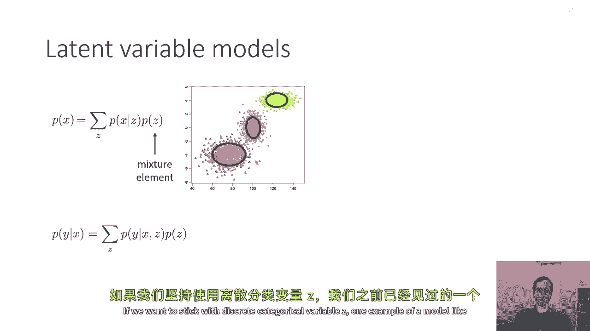
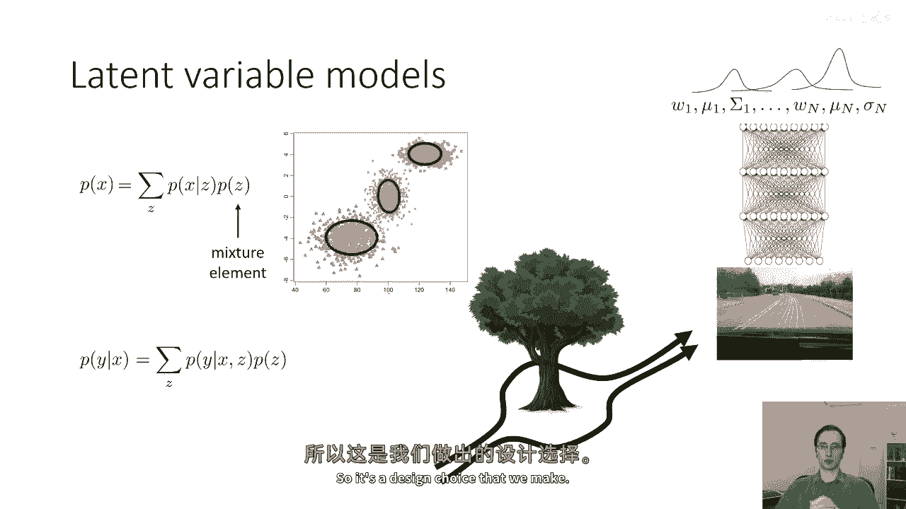
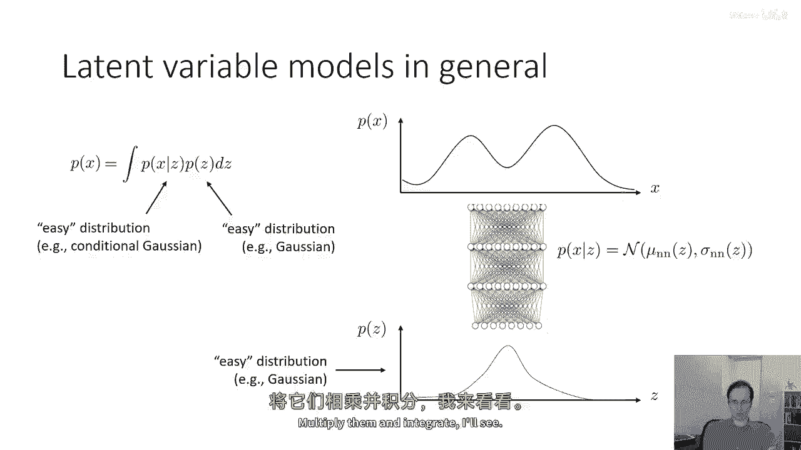
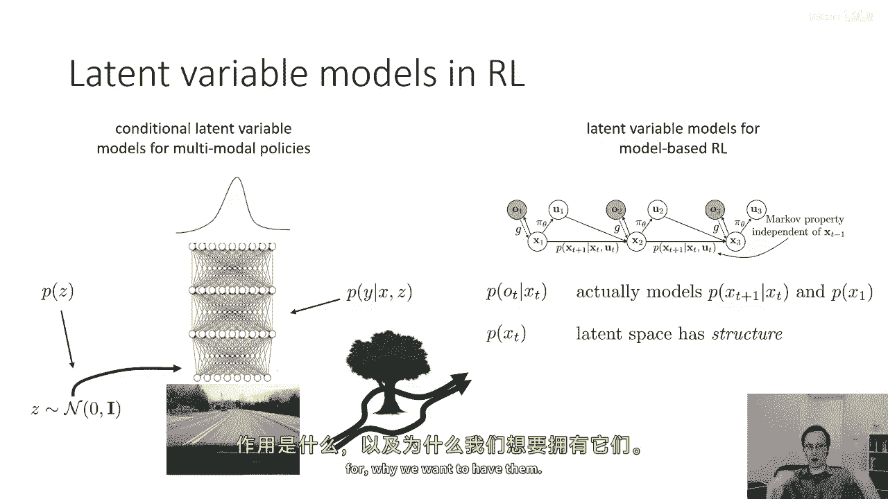
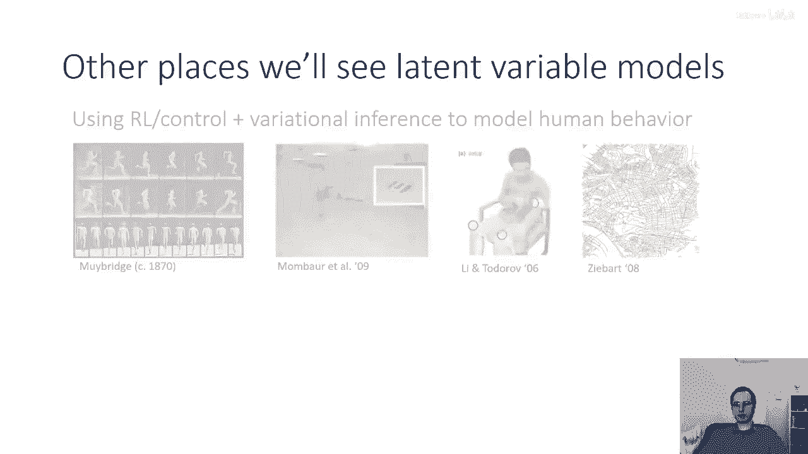
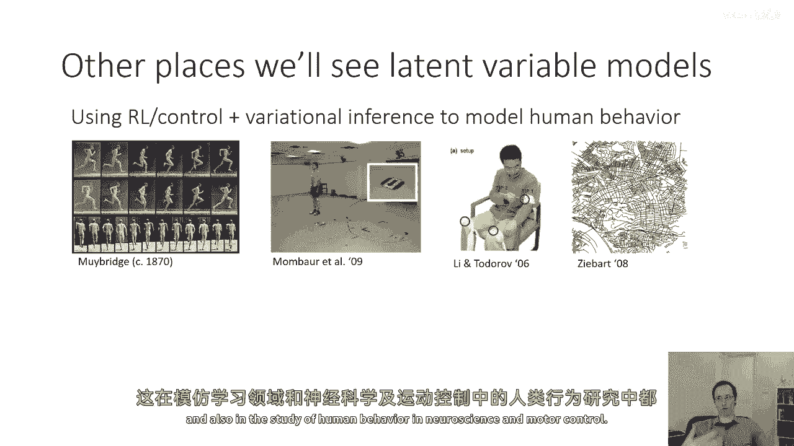
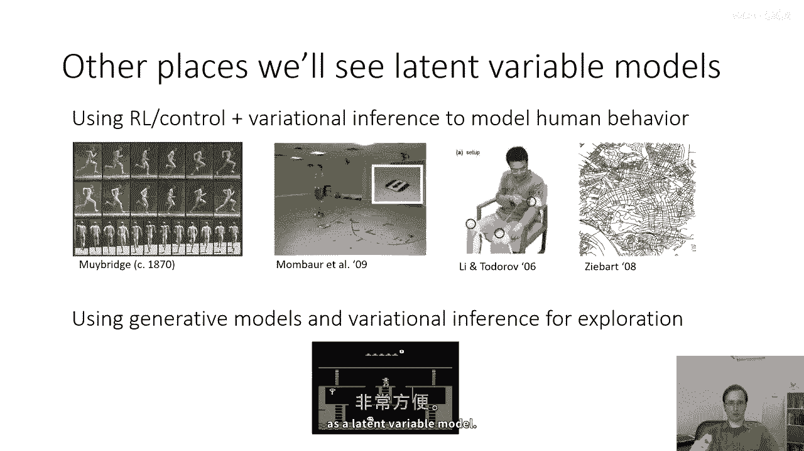

# 73：变分推断（第一部分） 🧠

在本节课中，我们将学习概率潜在变量模型的基本概念，以及如何使用变分推断来训练这些模型。我们将从概率模型的定义开始，逐步深入到变分推断的核心思想及其在深度学习中的应用。

## 概述 📋

概率模型是描述概率分布的模型。它可以是对随机变量 `x` 的分布 `p(x)` 进行建模，也可以是对条件分布 `p(y|x)` 进行建模。在本课程中，我们已经遇到过条件概率模型的例子，例如策略（policy），它给出了给定状态 `s` 时动作 `a` 的条件分布。

## 潜在变量模型 🔍

潜在变量模型是一种特殊的概率模型，其中除了作为证据或查询的变量外，还存在一些其他变量（潜在变量）。这些变量在评估所需概率时需要被积分或求和掉。

一个经典的潜在变量模型例子是混合模型。例如，数据点可能形成三个清晰的簇，但我们事先并不知道这些簇的身份。我们可以用一个由三个多元正态分布组成的混合模型来表示数据的分布。这里的潜在变量 `z` 是一个离散变量，可以取三个值，对应于簇的身份。

潜在变量模型可以表示为：
\[
p(x) = \sum_z p(x|z) p(z)
\]
对于条件模型，可以表示为：
\[
p(y|x) = \sum_z p(y|x, z) p(z|x)
\]

潜在变量模型允许我们将复杂的分布表示为简单分布的乘积。例如，`p(z)` 可能是一个简单的分布（如高斯分布），`p(x|z)` 也可能是一个简单的分布（如高斯分布），但其参数可能由复杂的函数（如神经网络）给出。当我们将 `z` 积分掉时，得到的 `p(x)` 可能是一个非常复杂的分布。

## 潜在变量模型的应用 🛠️

潜在变量模型和生成模型在强化学习中经常出现。例如：

1.  **基于模型的强化学习**：我们可能观察图像 `o`，并希望学习依赖于动作 `u` 的潜在状态 `x`。这涉及到观察分布 `p(o|x)` 和先验 `p(x)`。
2.  **逆强化学习**：我们可以使用潜在变量模型来推断人类行为的目标函数或思考过程。
3.  **探索**：生成模型和密度模型可以用于计算信息增益或分配伪计数奖励。

尽管生成模型不一定是潜在变量模型，但将复杂的生成模型表示为潜在变量模型通常更为方便。

## 训练潜在变量模型的挑战 ⚙️

假设我们有模型 `p_θ(x)` 和数据点 `x_1, x_2, ..., x_n`。我们通常希望通过最大似然估计来拟合模型：
\[
\max_\theta \sum_{i=1}^n \log p_\theta(x_i)
\]
其中 `p_\theta(x_i)` 通过对潜在变量 `z` 的积分得到：
\[
p_\theta(x_i) = \int p_\theta(x_i|z) p_\theta(z) dz
\]
直接计算这个积分和对数似然的梯度通常非常困难，尤其是当 `z` 是连续变量时。

## 期望对数似然作为替代目标 🎯

一种替代方法是使用期望对数似然作为目标函数：
\[
\sum_{i=1}^n \mathbb{E}_{z \sim p_\theta(z|x_i)} [\log p_\theta(x_i, z)]
\]
直觉上，这相当于对每个数据点 `x_i`，猜测其对应的潜在变量 `z` 的分布，然后在这个分布下计算 `x_i` 和 `z` 的联合对数概率的期望。

这个目标函数更容易处理，因为期望可以通过采样来估计。例如，我们可以从后验分布 `p_\theta(z|x_i)` 中采样 `z`，然后计算样本的对数概率的平均值。

然而，关键挑战在于如何计算后验分布 `p_\theta(z|x_i)`。如果我们能计算这个分布，就可以以可处理的方式估计期望对数似然及其梯度。

## 总结 📝

本节课我们介绍了概率潜在变量模型的基本概念及其在强化学习中的应用。我们讨论了训练这些模型时面临的挑战，并引入了期望对数似然作为更易处理的目标函数。在接下来的部分中，我们将深入探讨如何计算后验分布 `p_\theta(z|x_i)`，以及如何使用变分推断来近似这个分布，从而训练复杂的潜在变量模型。