# 76：变分推断在深度学习中的应用 🧠

在本节课中，我们将学习如何将变分推断的原则实例化为实用的深度学习模型，并探讨这些模型在深度强化学习中的应用。我们将从基础的变分自编码器开始，逐步深入到条件模型和序列模型，了解它们如何用于表示学习和处理复杂数据。

---

## 变分自编码器 🖼️

上一节我们介绍了变分推断的核心思想，本节中我们来看看其最基础的应用实例——变分自编码器。

在变分自编码器中，我们建模某种输入 **x**（通常是图像），并使用潜在变量 **z** 来表示它。模型包含一个编码器和一个解码器。

编码器是一个深度神经网络，它接受输入 **x**，并输出定义 **z** 的高斯分布的参数（均值 **μ** 和方差 **σ**）。这定义了给定 **x** 时 **z** 的近似后验分布 **q(z|x)**。

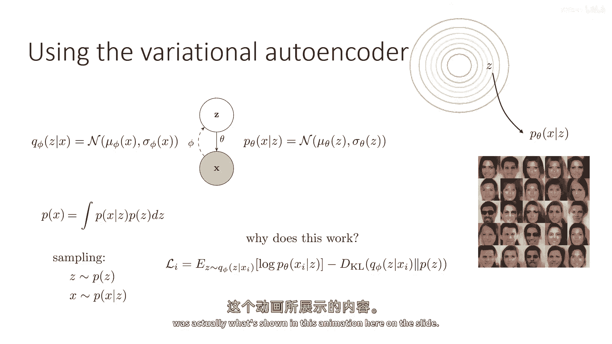

解码器是另一个神经网络，它接受潜在变量 **z**，并输出定义观测变量 **x** 的分布参数。如果我们想生成样本，就从先验分布 **p(z)**（通常为标准正态分布）中采样一个 **z**，然后通过解码器 **p(x|z)** 生成 **x**。

以下是变分自编码器的训练过程：
1.  编码器网络输出 **μ_φ** 和 **σ_φ**。
2.  从标准正态分布采样噪声 **ε**，通过重参数化技巧得到 **z = μ_φ + ε * σ_φ**。
3.  **z** 被送入解码器网络，生成图像。
4.  整个模型通过最大化证据下界来训练，目标函数为：
    `ELBO = E_{q(z|x)}[log p(x|z)] - KL(q(z|x) || p(z))`
    其中，KL散度项可以解析计算。

变分自编码器允许我们训练一个潜在变量模型来表示图像等复杂输入。通过训练，编码器被激励产生接近先验分布 **p(z)** 的 **z**，同时解码器能有效地将 **z** 映射回有意义的 **x**。这使得模型既能编码图像得到其潜在表示，也能从先验中采样并解码出合理的图像。

---

## 在深度强化学习中的应用 🤖

上一节我们介绍了变分自编码器，本节中我们来看看它如何应用于深度强化学习中的表示学习。

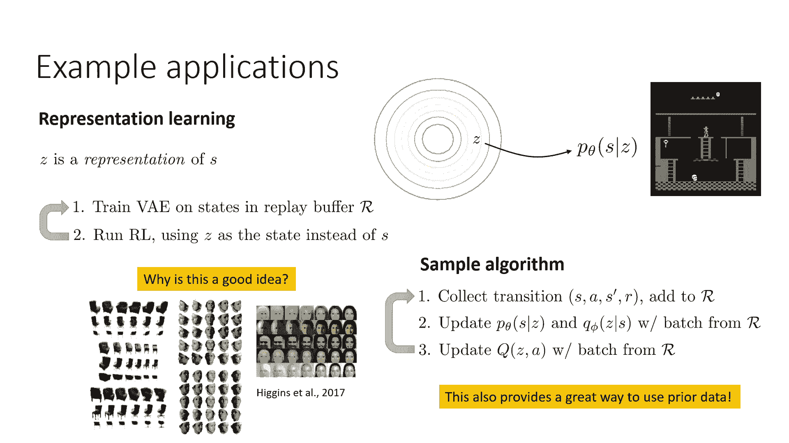

这里，我们并非处理部分可观测性问题，而是假设状态被完全观测，但观测本身（如Atari游戏中的图像）非常复杂。变分自编码器可以用来学习这些状态的更好表示。

其核心思想是：变分自编码器学习到的潜在表示 **z** 的各个维度趋向于独立（得益于先验），这有助于解耦数据中的变化因素。例如，在游戏图像中，玩家角色的位置、速度等因素是相互关联的变化源，而VAE试图将这些因素解耦到 **z** 的不同维度中，形成一个比原始像素更简洁、更有用的状态表示。

在实践中，可以按以下流程进行：
1.  在经验回放缓冲区中的所有状态上训练一个VAE。
2.  运行强化学习算法时，使用编码器产生的潜在表示 **z** 作为状态输入，而非原始图像。
3.  使用这个更好的表示来更新Q函数或策略。

这个过程也可以利用先验数据（例如通用的游戏图像）来预训练VAE，从而为RL提供一个良好的初始表示。

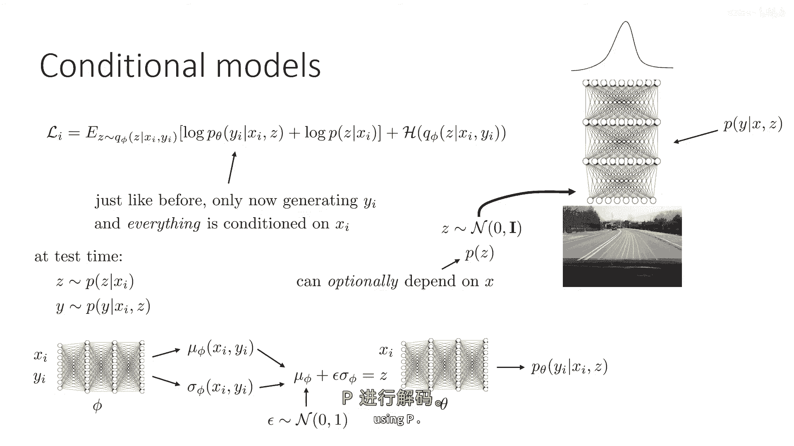

---

## 条件变分自编码器 🔀

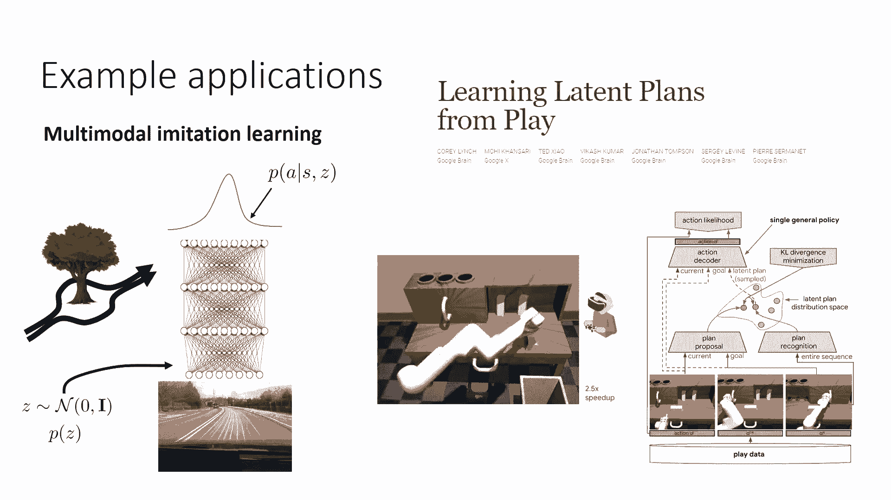

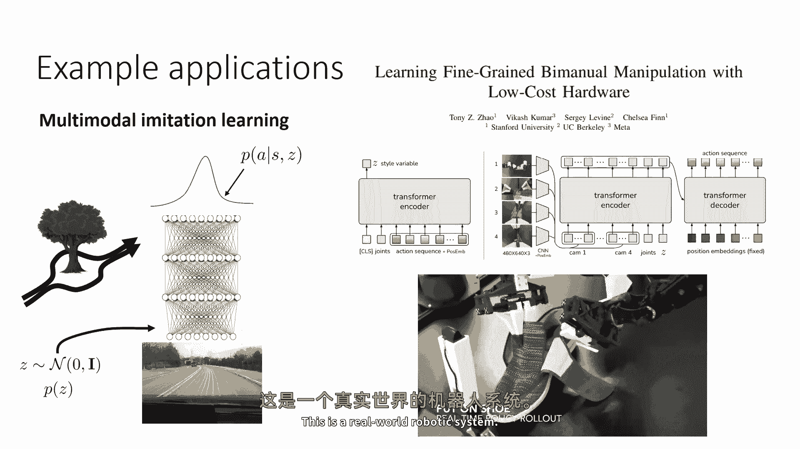

之前我们讨论了建模观测本身的分布，本节中我们转向条件分布建模，即条件变分自编码器。

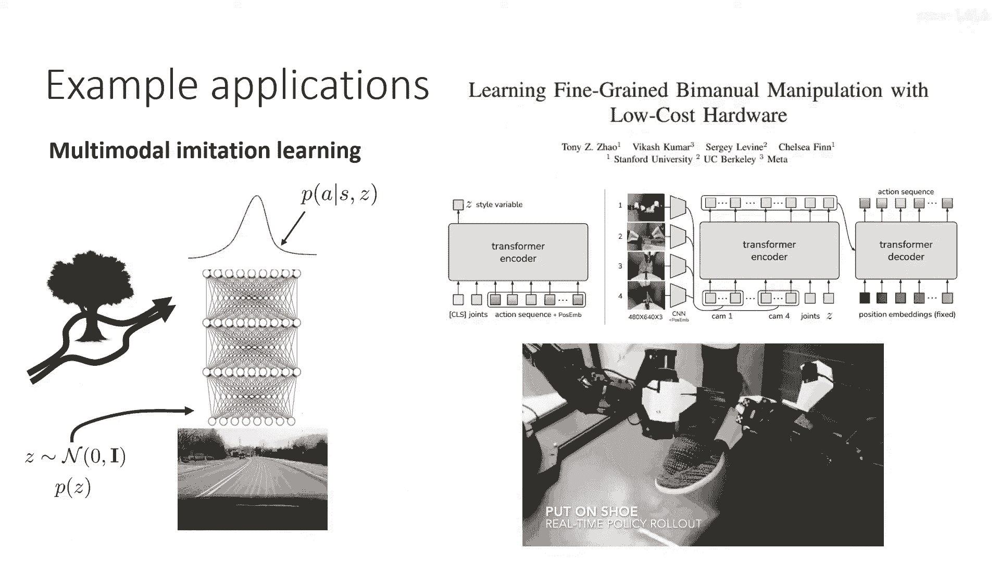

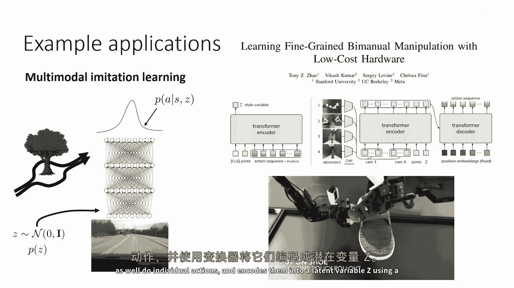

条件变分自编码器的目标是建模给定条件信息 **x** 时，目标变量 **y** 的复杂条件分布 **p(y|x)**。**y** 的分布可能是多模态的。模型的变化在于，编码器和解码器网络都额外接受条件信息 **x** 作为输入。

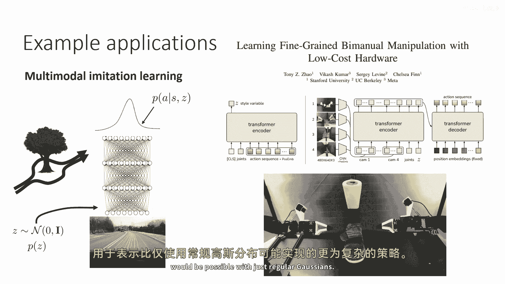

架构如下：
*   编码器 **q_φ(z|x, y)** 接受 **x** 和 **y**，输出 **z** 的分布参数。
*   解码器 **p_θ(y|x, z)** 接受 **x** 和 **z**，输出 **y** 的分布。
*   先验 **p(z)** 通常仍为标准正态分布，也可以选择依赖于 **x**。

训练目标仍然是证据下界，与标准VAE类似。在测试时，可以从先验中采样 **z**，然后通过解码器 **p_θ(y|x, z)** 生成 **y**。

在深度强化学习中，条件变分自编码器最常用于表示多模态策略，特别是在模仿学习中。当人类行为具有多模态特性（例如，绕过障碍物时可以选择左或右）时，我们希望策略能捕捉这种分布，而不是取平均（走向障碍物）。条件VAE能够表示比简单高斯分布更复杂的策略分布。

---

## 序列变分自编码器与部分可观测性 ⏳

最后，我们将讨论用于处理部分可观测性问题的序列变分自编码器。

在部分可观测设置中，我们有一系列观测 **o** 而非完整状态 **s**。目标是学习一个基于潜在状态 **z** 的序列模型。此时，潜在变量本身是一个序列 **z1, z2, ..., zT**，观测 **x** 是整个观测序列 **o1:T**。

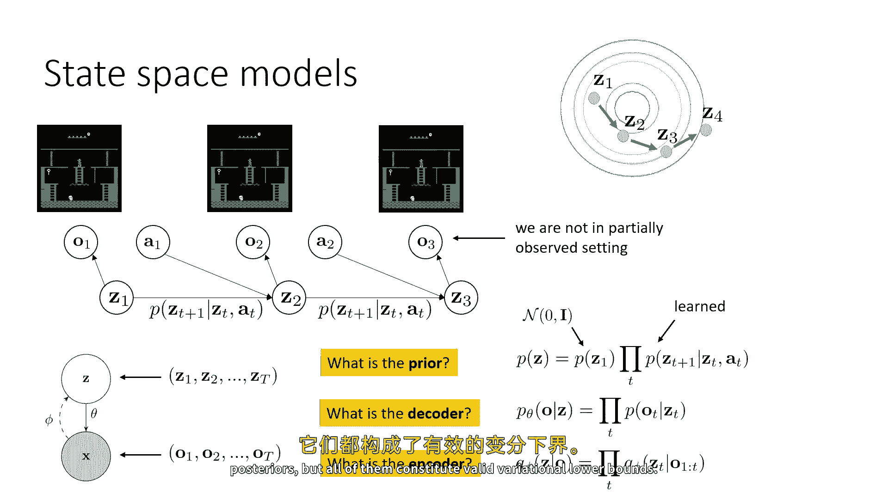

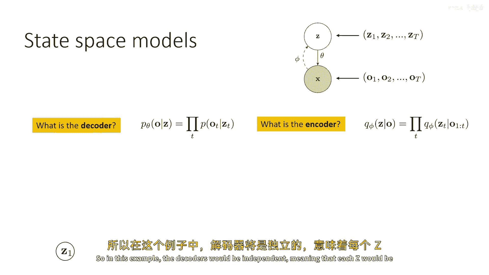

模型变得更为复杂：
*   **先验 p(z)**：由于存在动态性，先验是结构化的。例如，**p(z) = p(z1) * ∏ p(z_{t+1} | z_t, a_t)**，其中包含了状态转移动态。
*   **解码器 p(o|z)**：通常假设给定每个时间步的 **z_t** 后，观测 **o_t** 是独立的，即 **p(o|z) = ∏ p(o_t | z_t)**。这意味着 **z_t** 应包含该时刻的所有必要信息，构成一个马尔可夫状态空间。
*   **编码器 q(z|o)**：这是最复杂的部分。在部分可观测环境下，单个时刻的观测 **o_t** 不足以推断状态 **z_t**。因此，编码器需要给出 **z_t** 基于所有历史观测（可能还包括历史动作）的分布。编码器可以用RNN、LSTM或Transformer等序列模型来实现。

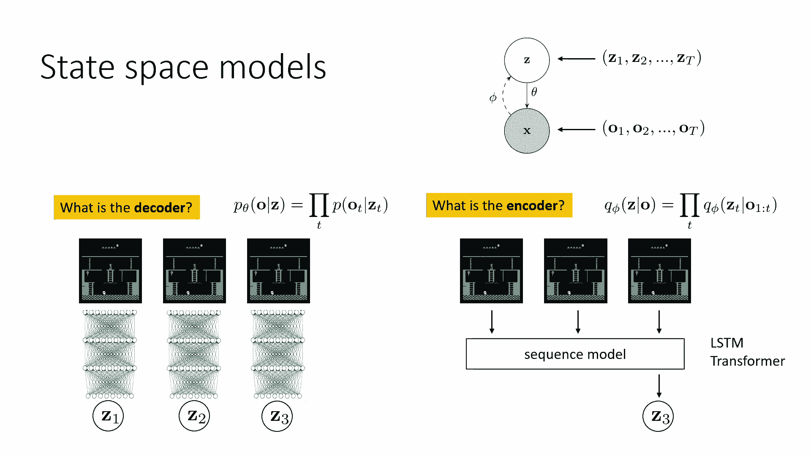

训练依然通过最大化序列证据下界进行。这类序列VAE在深度RL中的应用主要包括：
1.  **学习潜在状态空间模型并规划**：在潜在空间学习动态模型，然后在该空间中进行规划（如使用LQR或轨迹优化）。
2.  **为RL算法提供状态表示**：使用序列VAE从图像观测中提取潜在状态表示，然后在该表示上运行标准的演员-评论家等RL算法。

---

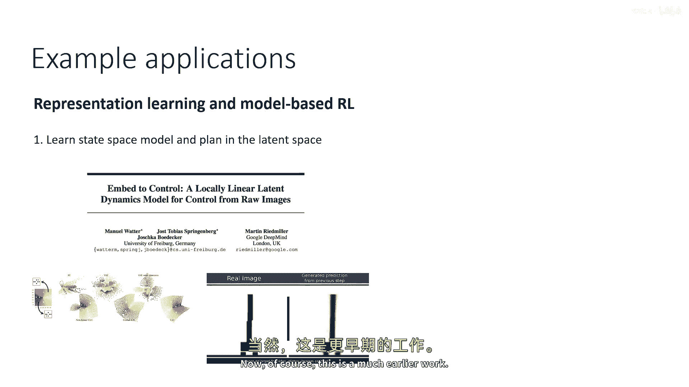

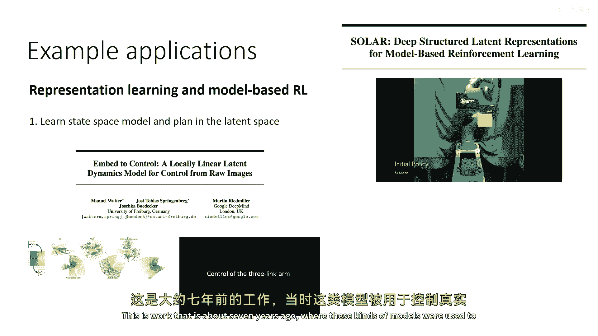

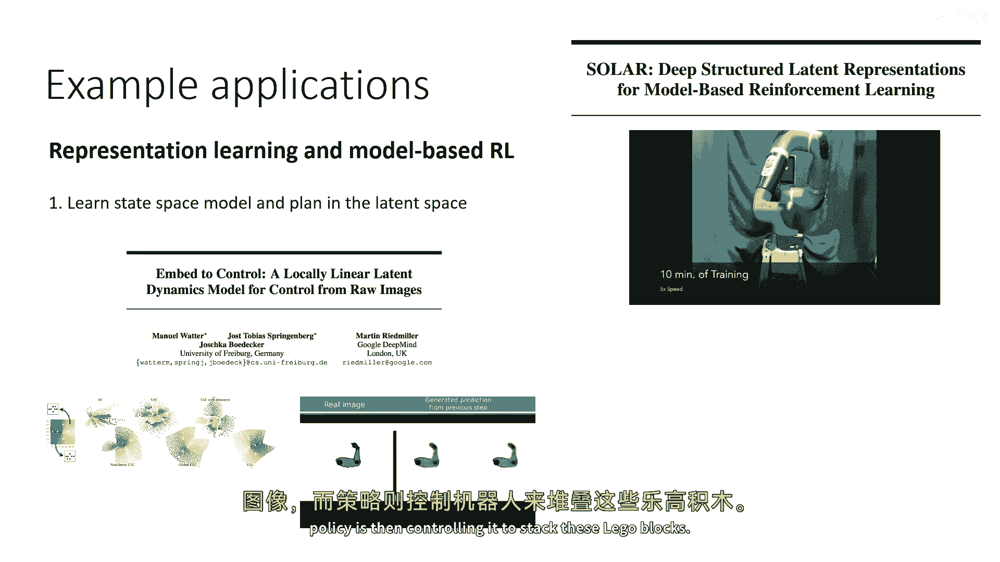

## 总结 📚

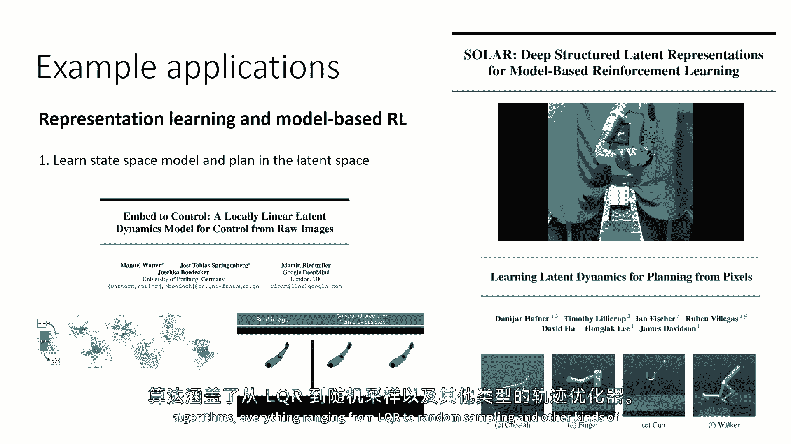

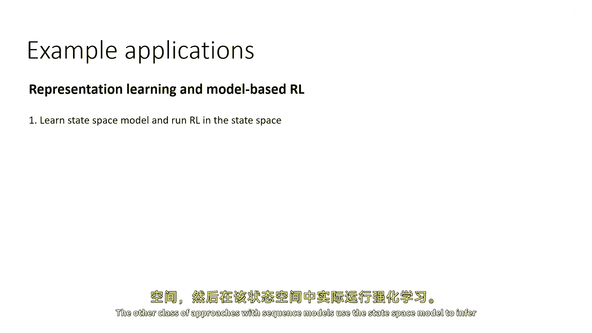

本节课中我们一起学习了变分推断在深度学习中的几种具体应用模型。
*   我们从**变分自编码器**开始，了解了它如何作为基础生成模型进行训练和应用。
*   接着，探讨了VAE在**深度强化学习**中用于学习状态表示的价值。
*   然后，介绍了**条件变分自编码器**，它能够建模复杂的条件分布，常用于表示多模态策略。
*   最后，我们讨论了**序列变分自编码器**，它通过结构化先验和序列编码器来处理部分可观测性问题，并可用于在潜在空间进行规划或强化学习。

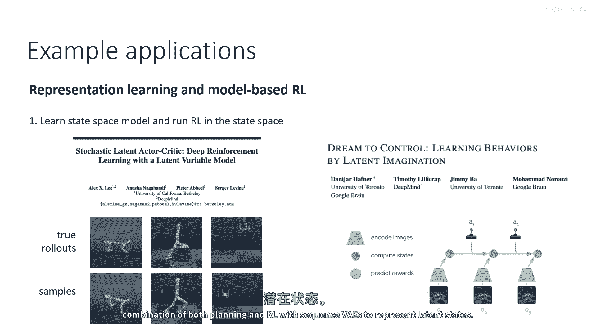

这些模型展示了如何将变分推断的灵活框架与深度神经网络相结合，以解决表示学习、生成建模和序列决策等复杂任务。