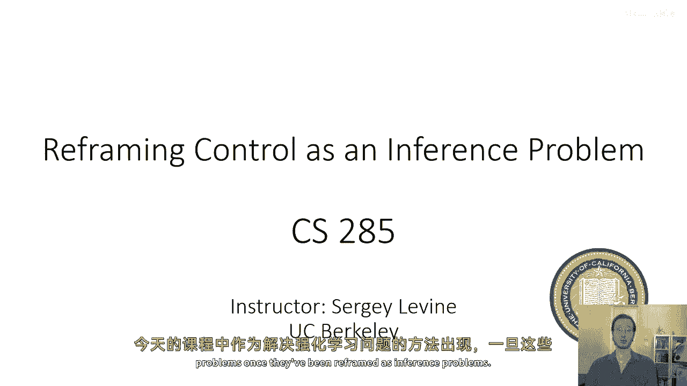
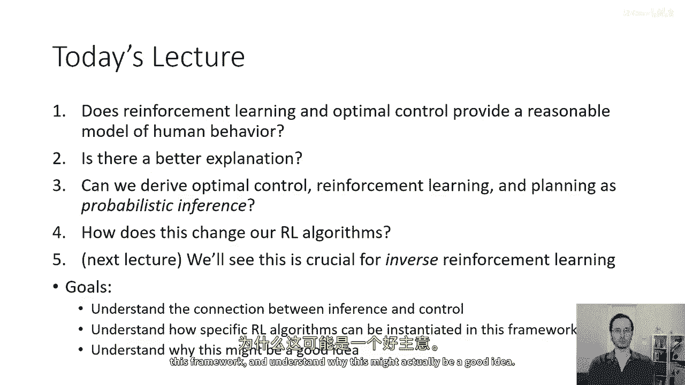
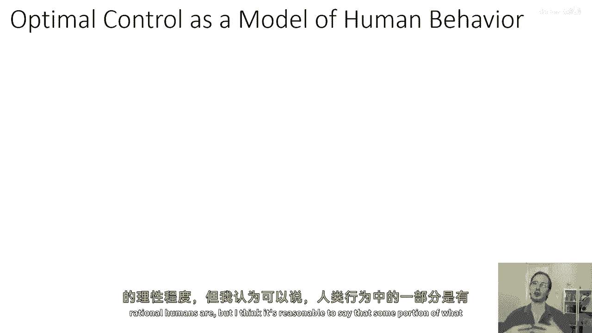
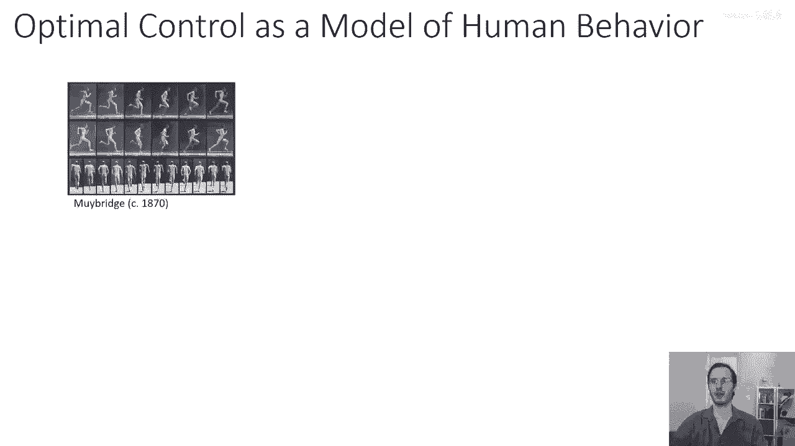
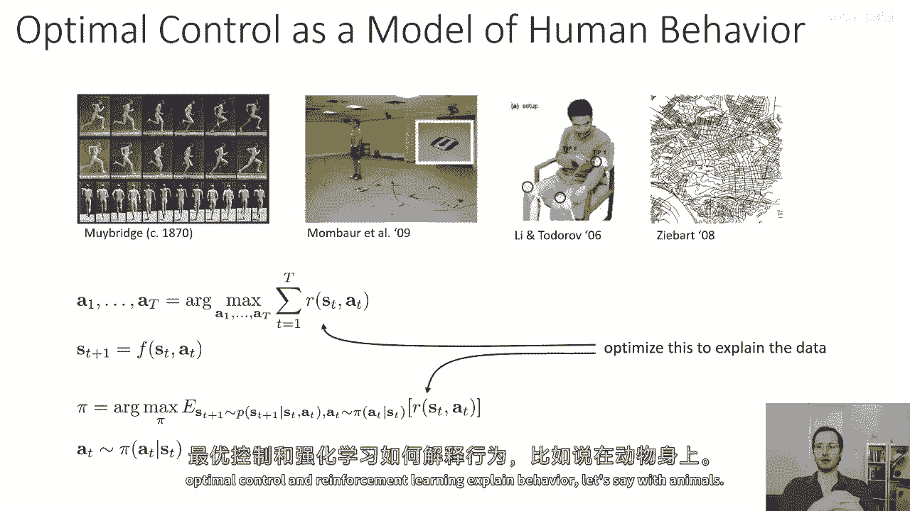
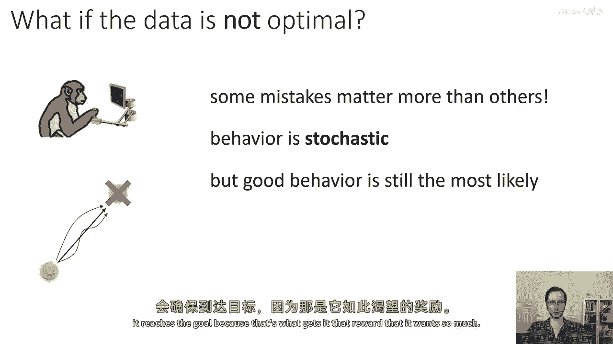
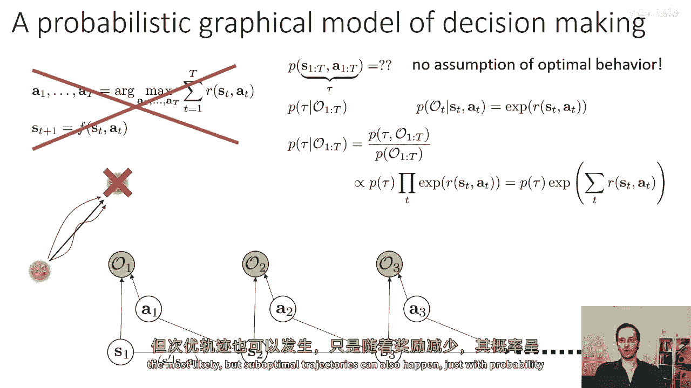
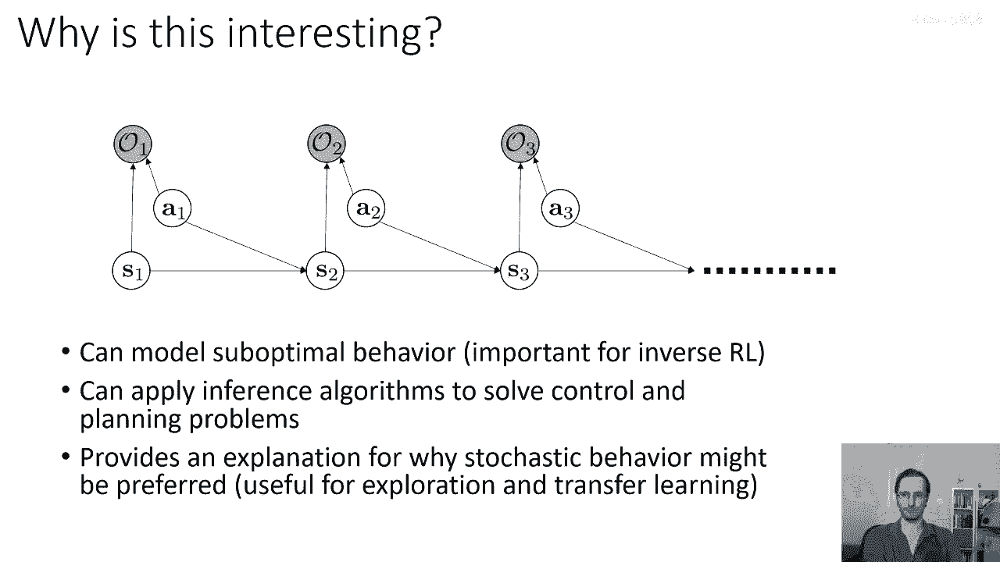
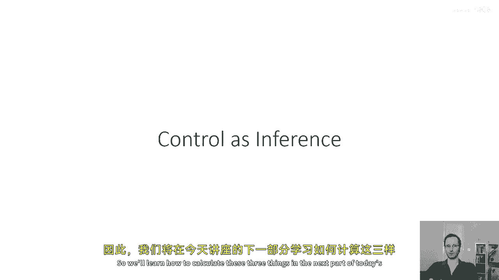

# 77：控制即推断（第一部分） 🧠



在本节课中，我们将学习如何将强化学习与控制问题重新定义为概率推断问题。我们将看到，通过构建一个特定的概率图模型，最优行为可以被视为在该模型中进行推断的最可能结果。这种方法不仅能更好地解释人类和动物的“接近最优”行为，还能为我们推导出新的算法提供框架。



---





## 人类行为建模与最优控制 🤔

上一节我们介绍了课程的主题。本节中，我们来看看如何将最优控制作为人类行为的模型。

强化学习和最优控制提供了一个思考目标导向行为的强大框架。一个诱人的想法是：如果我们假设人或动物以最优方式行动，那么我们就可以用一个紧凑的奖励函数来解释其行为。这有助于预测他们在新情况下的行动。

然而，观察表明，人类和动物的行为并非完全确定性的最优。例如，一只猴子在完成屏幕上的任务时，虽然总能到达目标，但路径却多种多样，并非总是直线。这种行为暗示了某种“随机性”和“容错性”：对于不影响最终奖励的方面（如具体路径），行为可以更随意；而对于关键方面（如是否到达目标），行为则必须可靠。



我们已有的确定性或随机性最优控制框架无法自然地解释这种“接近最优”的随机行为。因此，我们需要一个不同的、基于概率的“理性”概念。

---

## 构建决策的概率图模型 📊

上一节我们讨论了现有模型的局限。本节中，我们将构建一个新的概率模型来形式化“接近最优”行为。



为了对包含随机性的决策过程建模，我们使用概率图模型。模型需要包含标准马尔可夫决策过程中的变量：状态 `s` 和动作 `a`。此外，我们引入一组新的二元随机变量 `O_t`，称为“最优性变量”。`O_t = 1` 表示在时间步 `t`，智能体“意图是最优的”。

我们做出一个关键建模选择：定义 `O_t` 为真的概率是当前状态-动作对奖励的指数函数：
```
P(O_t = 1 | s_t, a_t) = exp(r(s_t, a_t))
```
> **注意**：为确保概率值 ≤ 1，我们需要奖励 `r(s, a)` 总是非正的。这可以通过减去一个足够大的常数（如最大可能奖励）来实现，且不改变最优策略。

在这个模型中，轨迹 `τ = (s_1, a_1, ..., s_T, a_T)` 的联合概率分布为：
```
p(τ) ∝ [p(s_1) ∏_{t=1}^{T} p(s_{t+1}|s_t, a_t)] * exp(∑_{t=1}^{T} r(s_t, a_t))
```
这个公式非常直观：轨迹的概率正比于其累积奖励的指数。奖励越高的轨迹，其概率越大。但奖励较低的轨迹也有非零概率，只是其概率随奖励减少而指数级下降。这正好模拟了“接近最优”的行为：智能体最可能选择最优路径，但也可能以较低概率选择次优路径。

---

## 控制即推断框架的意义 ✨

上一节我们建立了核心的概率模型。本节中，我们来探讨这个框架带来的好处。

将控制问题重新定义为推断问题，具有以下几个重要意义：
1.  **建模接近最优行为**：为理解人类、动物或不完美智能体的行为提供了更合理的概率模型。
2.  **启发性算法设计**：由于推断对应于求解控制问题，我们可以将各种概率推断算法（如消息传递、变分推断）应用于控制和规划。
3.  **解释随机策略的合理性**：即使存在确定性最优解，该框架也自然地偏好具有一定随机性的策略，这对探索和技能迁移非常有用。
4.  **逆强化学习的基础**：要从不完美的专家示范中推断奖励函数，必须考虑示范者是“接近最优”而非“完全最优”的。本框架是逆强化学习的核心。

---

## 模型中的推断操作 🔍

上一节我们了解了框架的宏观意义。本节中，我们具体看看在这个概率图模型中需要进行哪些推断计算。

该模型是一个链式动态贝叶斯网络，可以通过消息传递算法进行高效推断。我们需要计算三种关键信息：

以下是三种核心的推断操作：

1.  **后向消息 (Backward Messages) `β_t(s_t, a_t)`**：表示从当前时间步 `t` 到任务结束 `T`，整个轨迹都是最优的概率，给定当前状态和动作。计算后向消息是恢复最优策略的关键。
2.  **最优随机策略 `π(a_t | s_t)`**：在给定所有最优性变量 `O_{1:T}=1` 的证据下，当前状态 `s_t` 下选择动作 `a_t` 的概率。可以通过归一化的后向消息来计算：
    ```
    π(a_t | s_t) ∝ β_t(s_t, a_t)
    ```
3.  **前向消息 (Forward Messages) `α_t(s_t)`**：表示在截止到时间 `t-1` 轨迹都是最优的条件下，在时间 `t` 处于状态 `s_t` 的概率。前向消息对于计算状态占用分布至关重要，而状态占用分布是逆强化学习的核心。



结合前向和后向消息，我们可以计算出在最优性证据下，访问每个状态的概率（状态占用率），这对于理解和分析策略行为非常重要。

---



## 总结 📝

本节课中，我们一起学习了“控制即推断”的核心思想。

我们首先探讨了用传统最优控制解释人类行为的不足，即无法解释“接近最优”的随机行为。接着，我们构建了一个新的概率图模型，通过引入“最优性变量”并将奖励函数与条件概率关联，将最优轨迹定义为该模型中概率最高的轨迹。这个框架自然地赋予了高奖励轨迹高概率，低奖励轨迹低概率，从而优雅地建模了接近最优行为。最后，我们介绍了在该模型中进行推断所需的三种核心操作：计算后向消息以得到策略、计算前向消息以得到状态占用率。



在下一讲中，我们将看到如何利用这个框架推导出具体的强化学习算法，并深入探讨它如何成为逆强化学习的基石。