# 78：控制即推理（第二部分） 🧠

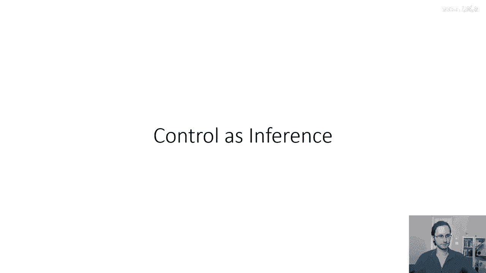

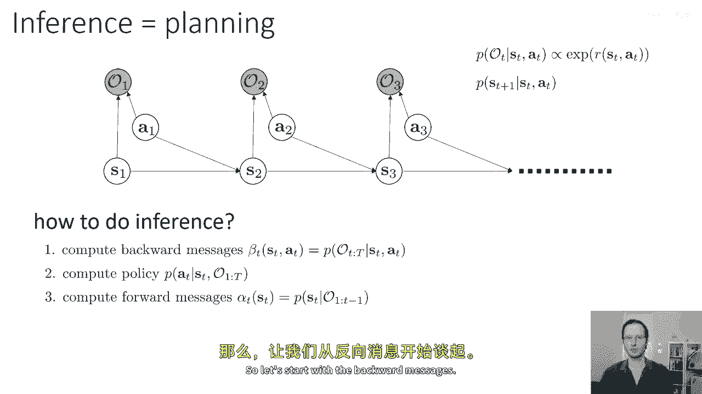

在本节课中，我们将学习如何将最优控制问题形式化为一个概率图模型中的推理问题。我们将推导出计算后向消息、策略和前向消息的具体算法，并理解它们与经典强化学习概念（如价值函数和Q函数）之间的联系。

---

## 🔙 计算后向消息

上一节我们介绍了将控制问题建模为推理问题的框架。本节中，我们来看看如何实际计算后向消息。

后向消息定义为：在给定当前状态 `s_t` 和动作 `a_t` 的条件下，从当前时刻 `t` 到最终时刻 `T` 的轨迹是最优轨迹的概率。其数学表达式为：

**β_t(s_t, a_t) = p(o_{t:T} | s_t, a_t)**

以下是计算后向消息的递归步骤：

1.  **递归基础**：在最终时刻 `T`，后向消息就是最终奖励的概率：**β_T(s_T, a_T) = p(o_T | s_T, a_T)**。
2.  **递归步骤**：对于更早的时刻 `t`，我们可以通过积分掉下一个状态 `s_{t+1}` 来递归计算：
    **β_t(s_t, a_t) = ∫ p(o_t | s_t, a_t) * p(s_{t+1} | s_t, a_t) * β_{t+1}(s_{t+1}) ds_{t+1}**
    其中，**β_{t+1}(s_{t+1})** 是状态后向消息，定义为在给定状态 `s_{t+1}` 下，未来轨迹最优的概率。
3.  **状态后向消息**：状态后向消息可以通过对动作的期望得到。我们通常假设动作先验 `p(a_t | s_t)` 是均匀分布（即所有动作等可能），因此：
    **β_t(s_t) = ∫ p(a_t | s_t) * β_t(s_t, a_t) da_t ∝ ∫ β_t(s_t, a_t) da_t**

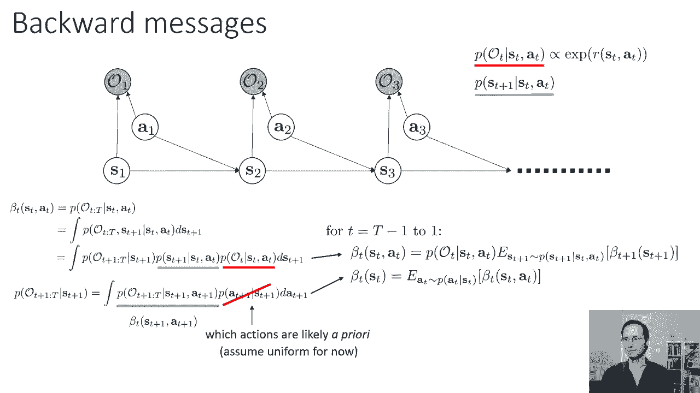

通过从最终时刻 `T` 开始，逐步向后迭代计算，我们可以得到所有时刻的后向消息。

---

## 🔄 后向传播与价值函数

现在，我们通过取对数将后向消息与更熟悉的价值函数联系起来。

定义：
*   **V_t(s_t) = log β_t(s_t)** （软价值函数）
*   **Q_t(s_t, a_t) = log β_t(s_t, a_t)** （软Q函数）

将之前的递归方程转换到对数空间，我们得到：

1.  **软贝尔曼方程（对于Q函数）**：
    **Q_t(s_t, a_t) = r(s_t, a_t) + log E_{s_{t+1}~p(·|s_t,a_t)}[exp(V_{t+1}(s_{t+1}))]**
    这个方程与标准贝尔曼方程类似，但期望外多了一个 `log` 和 `exp` 操作。

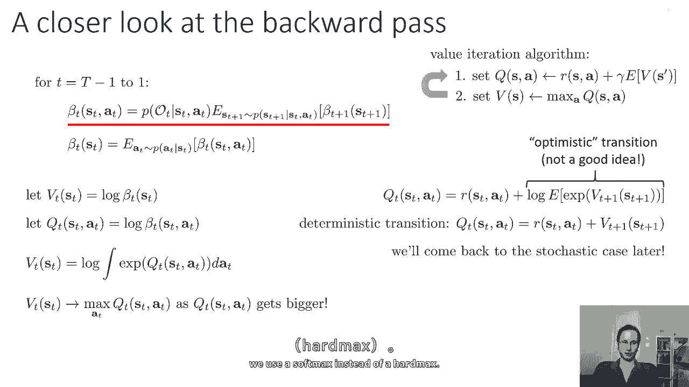

2.  **软价值函数更新**：
    **V_t(s_t) = log ∫ exp(Q_t(s_t, a_t)) da_t**
    这个操作被称为 **Log-Sum-Exp**，它是 **max** 操作的一个平滑（软）版本。当 `Q_t` 的值差异很大时，`V_t` 会接近 `Q_t` 的最大值。

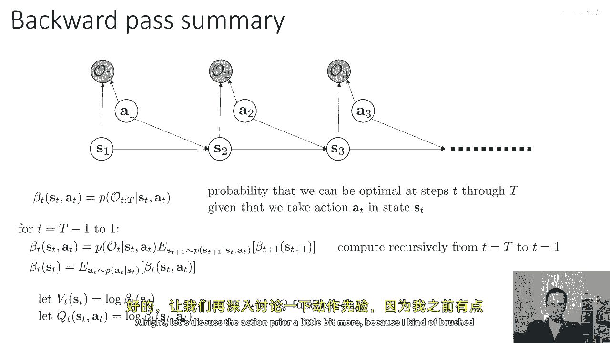

**关键洞察**：在确定性环境中（即下一个状态是当前状态和动作的确定函数），`log` 和 `exp` 会相互抵消，上述软贝尔曼方程会退化为标准的贝尔曼最优方程。因此，这个推理框架是经典动态规划的一种泛化。

---

## 🎯 从后向消息恢复策略

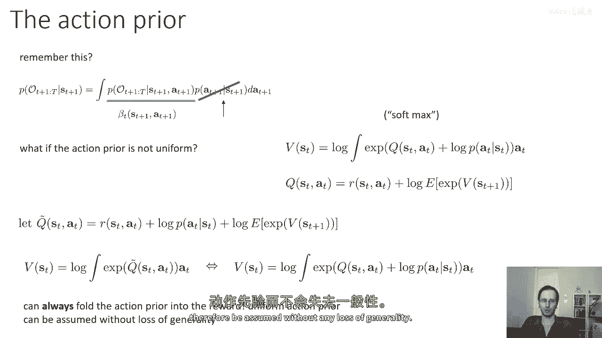

计算出后向消息后，我们如何得到我们最终想要的策略——即在给定当前状态且整个轨迹最优的条件下，选择某个动作的概率？

策略定义为：**π(a_t | s_t) = p(a_t | s_t, o_{1:T})**。

通过应用贝叶斯规则和一些条件独立性推导，我们可以得到一个简洁的表达式：

**π(a_t | s_t) ∝ β_t(s_t, a_t) / β_t(s_t)**

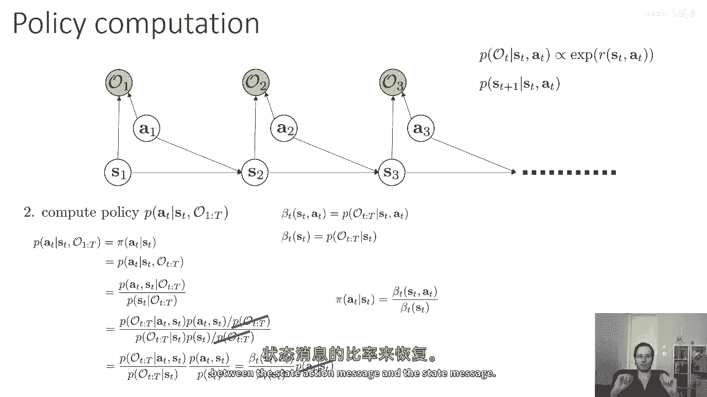

将对数形式的定义代入，我们得到：

**π(a_t | s_t) ∝ exp(Q_t(s_t, a_t) - V_t(s_t)) = exp(A_t(s_t, a_t))**

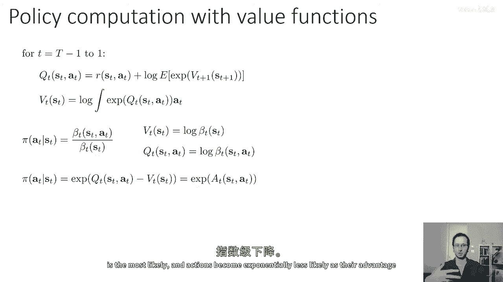

其中，**A_t(s_t, a_t) = Q_t(s_t, a_t) - V_t(s_t)** 可以被视为一种 **软优势函数**。

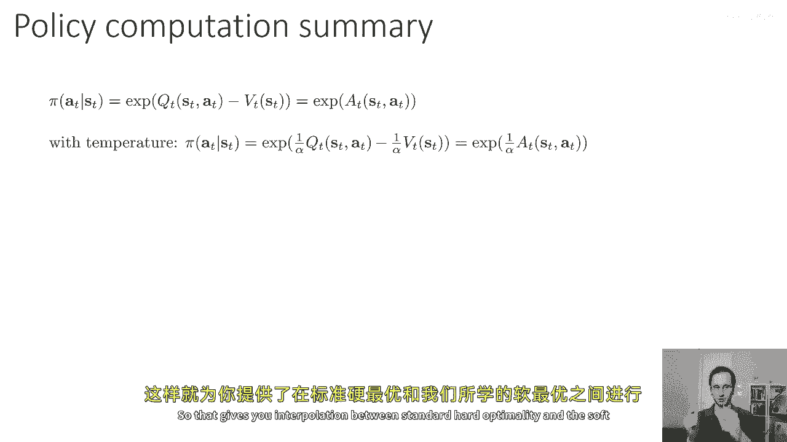

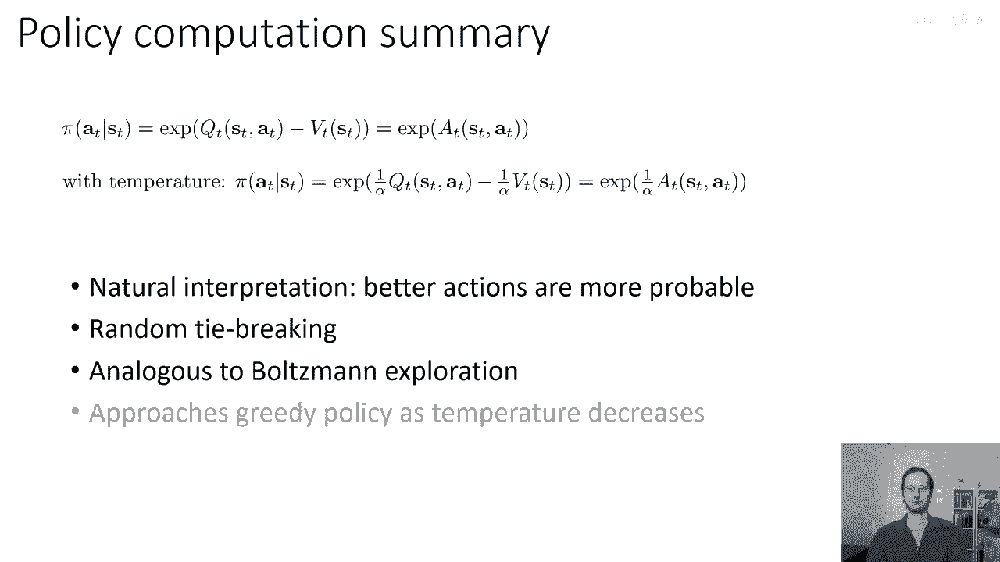

**策略的直观解释**：最优策略是一个玻尔兹曼分布（或Softmax分布），其能量函数是优势函数。优势越高的动作被选中的概率越大。这提供了一种在探索（尝试次优动作）和利用（选择最优动作）之间自然权衡的随机策略。

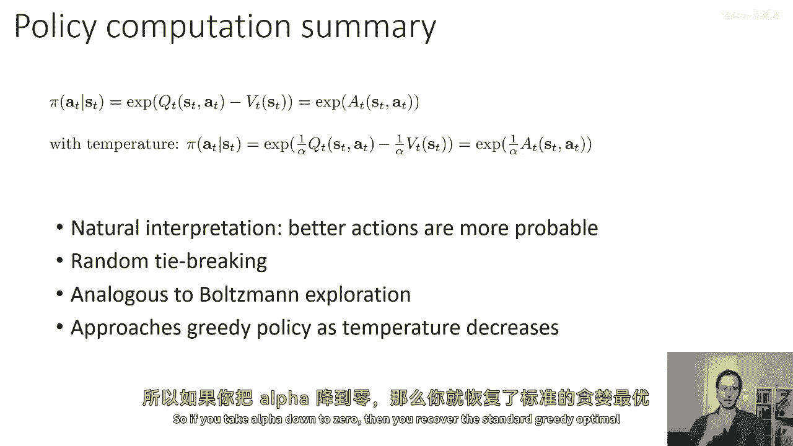

我们可以引入一个温度参数 `α` 来控制策略的随机性：**π(a_t | s_t) ∝ exp(A_t(s_t, a_t) / α)**。当 `α → 0` 时，策略趋近于确定性最优策略；当 `α = 1` 时，就是我们上面推导出的标准形式。

---

## 📈 计算前向消息与状态边缘分布

最后，我们讨论前向消息，它表示在已知过去轨迹最优的条件下，当前状态的概率。

前向消息定义为：**α_t(s_t) = p(s_t | o_{1:t-1})**。

计算前向消息也需要一个递归过程，类似于后向传播，但是从前向后进行。其递归公式涉及转移概率、动作先验和奖励（最优性）概率。推导过程同样使用了贝叶斯规则和条件独立性。

前向消息的一个重要应用是计算 **状态边缘分布**，即在已知整个轨迹最优的条件下，每个时刻状态的概率分布：

**p(s_t | o_{1:T}) ∝ α_t(s_t) * β_t(s_t)**

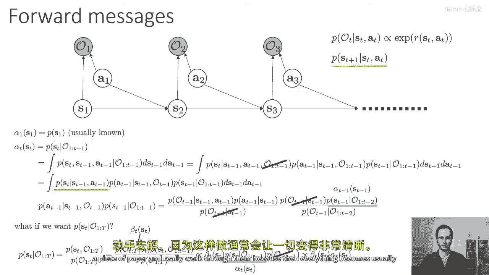

**直观理解**：你可以将 `α_t(s_t)` 想象成一个从初始状态向前传播的“锥体”，代表从起点出发能以高奖励到达的状态。将 `β_t(s_t)` 想象成一个从目标状态向后传播的“锥体”，代表能够到达目标的状态。最优轨迹的状态分布就大致位于这两个锥体的交集区域。这与人类在完成目标导向任务（如伸手触摸）时观察到的运动轨迹不确定性分布是吻合的。

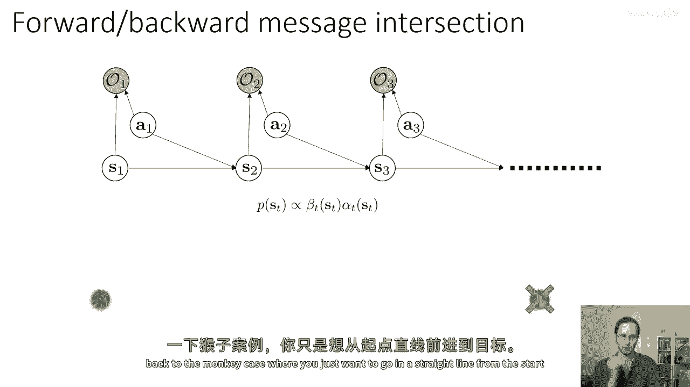

---

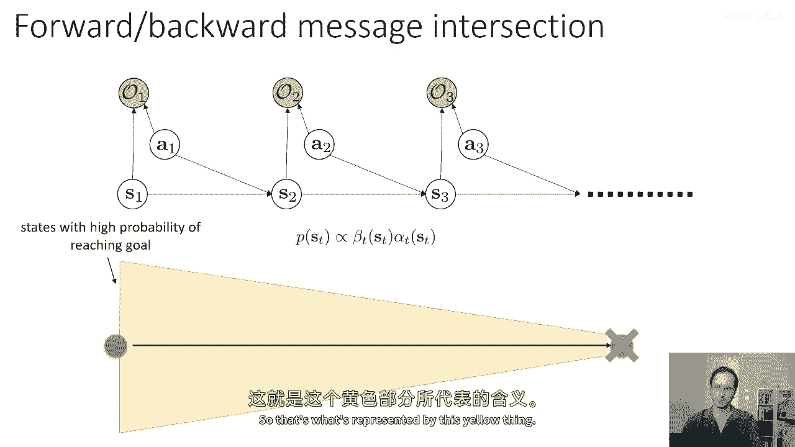

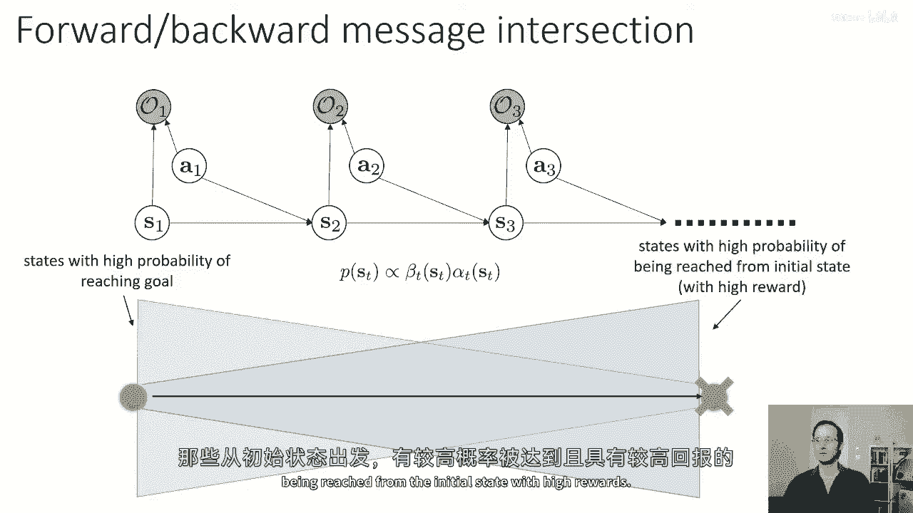

## 📝 总结

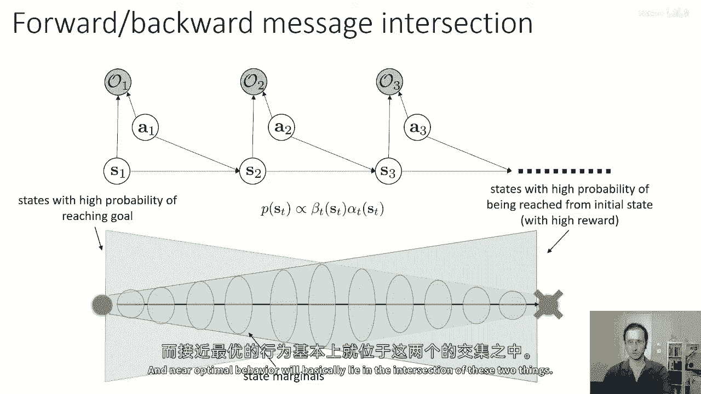

本节课中我们一起学习了控制即推理框架的核心计算部分：

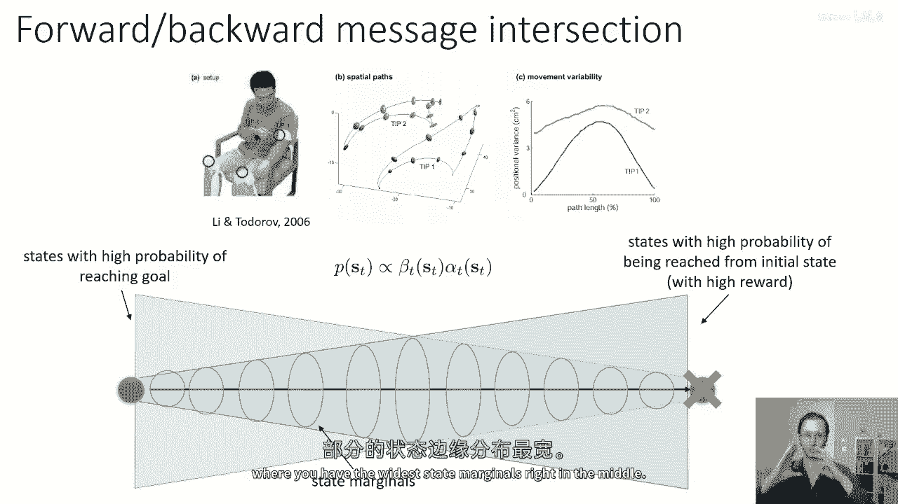

1.  **后向消息**：通过递归计算，得到未来最优的概率，其对数形式对应软Q函数和软价值函数。
2.  **策略恢复**：最优策略表现为基于（软）优势函数的玻尔兹曼分布，连接了推理与随机策略优化。
3.  **前向消息与状态边缘**：通过前向递归计算，并结合后向消息，可以得到在最优性条件下状态的概率分布。

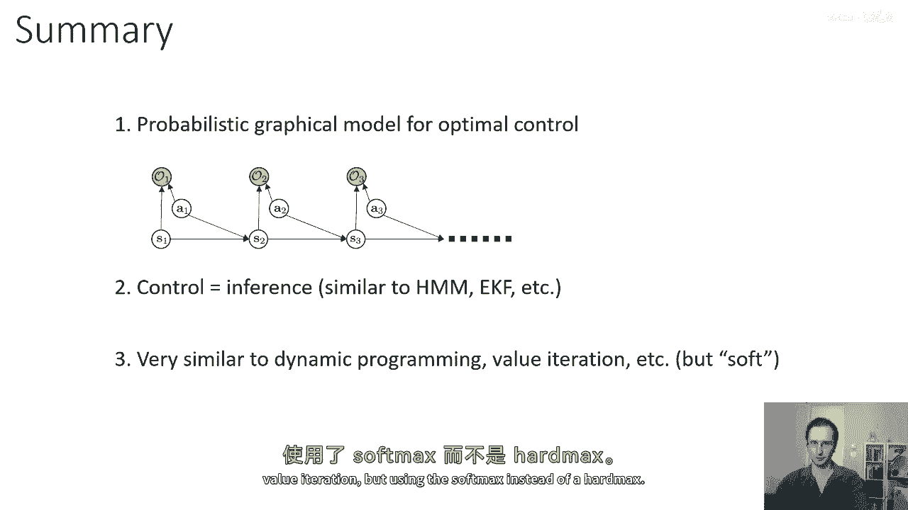

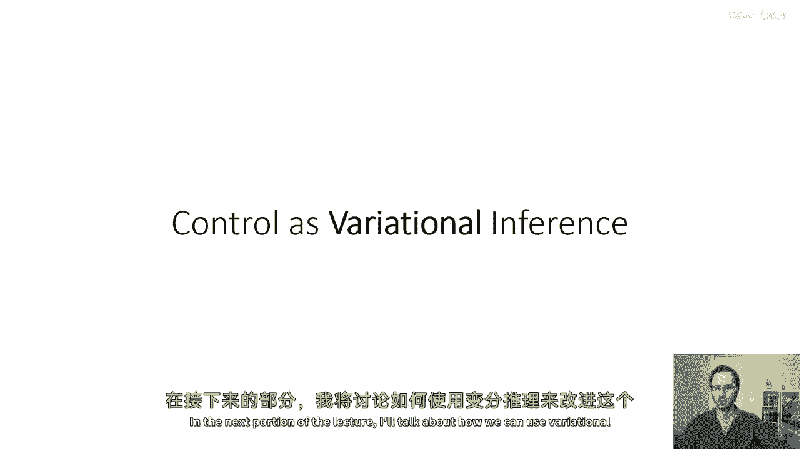

这个框架优雅地将最优控制问题转化为概率图模型中的推理问题，并揭示了经典强化学习算法（如价值迭代）是该框架在特定假设下的特例。在接下来的部分，我们将探讨如何利用变分推断来改进这个框架，并处理更复杂的随机环境。