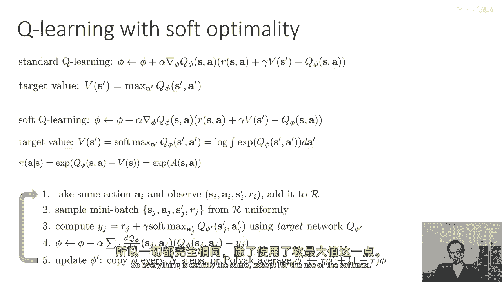
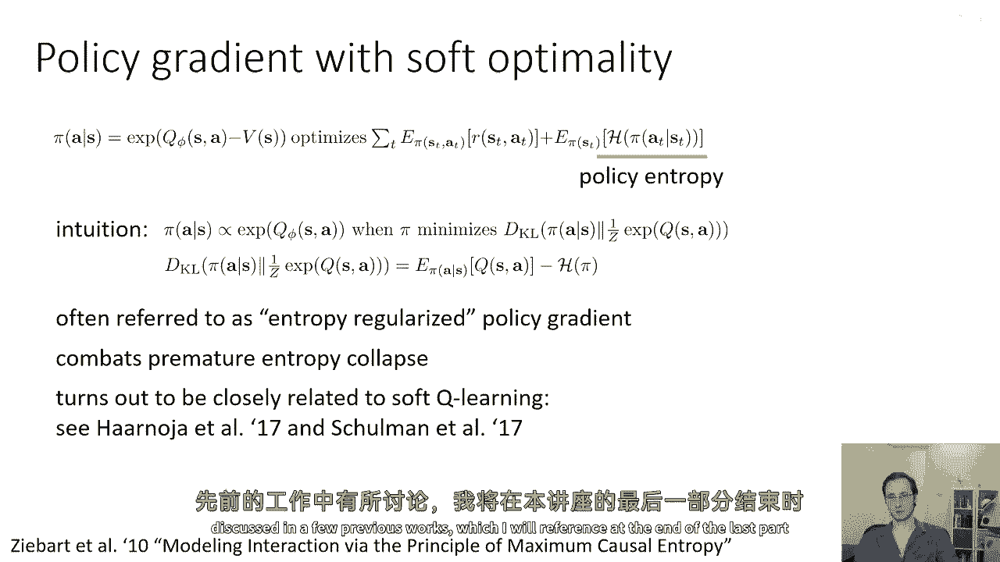
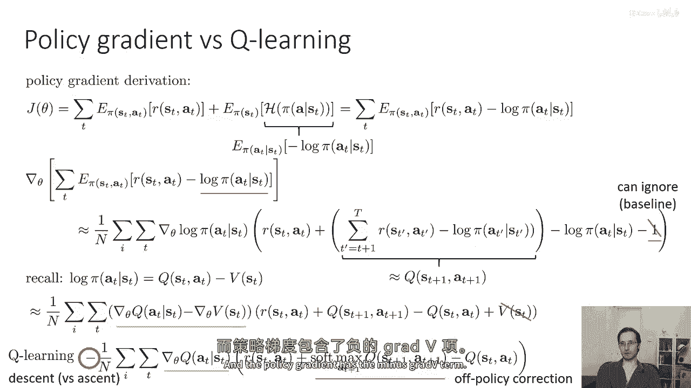
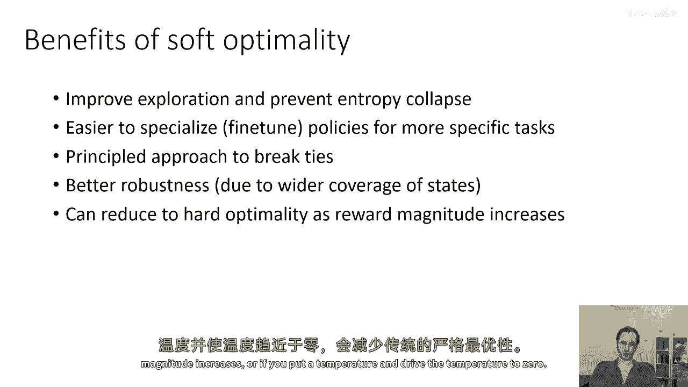
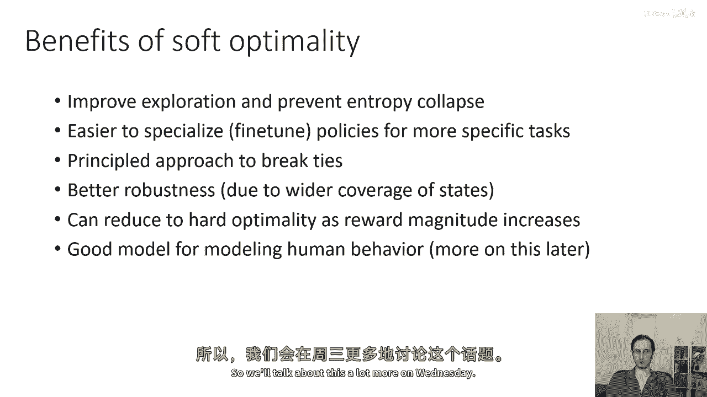
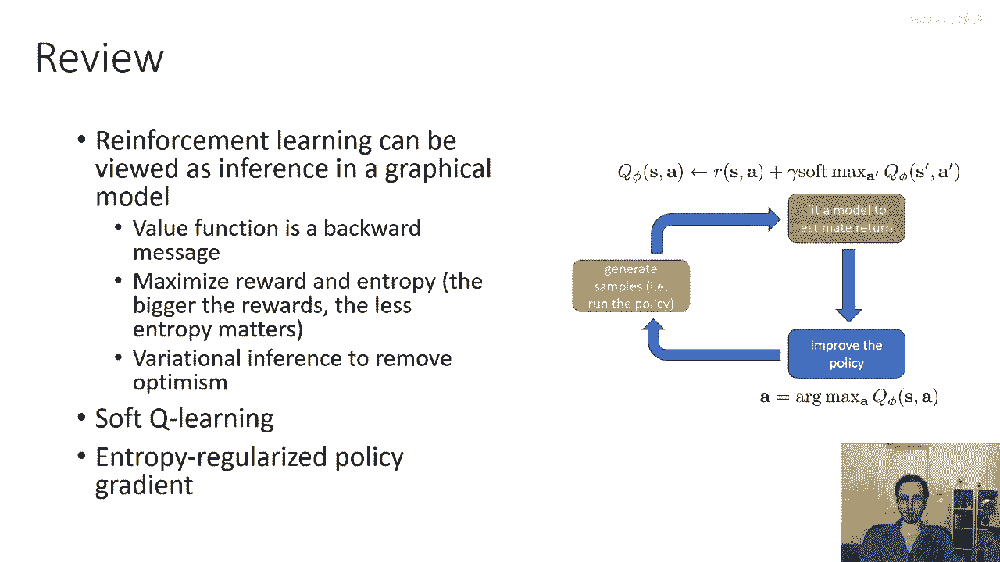

# 80：强化学习中的推断与控制（第四部分） 🧠

在本节课中，我们将学习如何将之前讨论的“控制即推断”思想转化为具体的强化学习算法。我们将重点介绍软Q学习和熵正则化策略梯度这两种方法，并探讨它们之间的联系与优势。

---

## 软Q学习算法 🤖

上一节我们介绍了软最优性标准。本节中，我们来看看如何基于此标准实现Q学习。

标准的Q学习使用以下更新公式：
`Q(s, a) ← Q(s, a) + α * (r + γ * max_{a'} Q(s', a') - Q(s, a))`

在软Q学习中，更新公式的结构是相同的。唯一的区别在于计算目标值时，我们不再对下一个状态的动作值取“硬最大值”（`max`），而是取“软最大值”（`softmax`）。对于离散动作，软最大值是对指数化Q值的对数求和（Log-Sum-Exp）。

因此，软Q学习的目标值计算为：
`目标值 = r + γ * log(∑_{a'} exp(Q(s', a')))`

从软Q学习中恢复的策略不是贪婪策略，而是与指数化的优势函数成正比。可以证明，该策略是相应变分推断问题的解。

以下是软Q学习算法的步骤：

1.  采取动作并观察：执行动作 `a_i`，从环境中获得新状态 `s'_i` 和奖励 `r_i`，并将样本 `(s_i, a_i, s'_i, r_i)` 存入经验回放缓冲区。
2.  从缓冲区中采样一个小批量的数据。
3.  计算目标值：使用目标网络计算 `r + γ * softmax_{a'} Q_{target}(s', a')`。
4.  更新Q函数：通过回归步骤，最小化当前Q网络输出与目标值之间的误差，来更新Q网络的参数。
5.  延迟更新目标网络：定期或缓慢地将在线Q网络的参数同步到目标网络。

整个流程与传统的深度Q网络（DQN）非常相似，核心区别仅在于将 `max` 操作替换为 `softmax` 操作。

---

## 熵正则化策略梯度 📈

我们也可以不依赖动态规划，而是直接优化从变分推断中得到的原始目标函数，即期望奖励之和加上策略的熵。

这个目标函数可以写为：
`J(θ) = E_{τ∼π_θ}[∑_{t} r(s_t, a_t) + α * H(π_θ(·|s_t))]`
其中 `H(π) = -E_{a∼π}[log π(a|s)]` 是策略的熵，`α` 是温度参数。

推导一个策略梯度算法来优化此目标非常直接。目标函数中的期望奖励部分，其梯度就是标准的策略梯度。新增的部分是熵的梯度。

直觉上，最优策略 `π*` 应与指数化的优势函数成正比。最小化策略 `π` 与这个最优分布之间的KL散度，等价于最大化在策略 `π` 下的期望Q值加上策略的熵。因此，这种方法常被称为**熵正则化的策略梯度**。

在策略梯度算法中引入熵正则化非常有益，因为它可以防止策略过早地收敛到一个确定性策略（即熵坍缩），从而鼓励更好的探索。

---

## 策略梯度与软Q学习的联系 🔗

现在，让我们看看在这个推断框架下，策略梯度与Q学习是如何联系起来的。

如果我们写出熵正则化策略梯度的目标函数并计算其梯度，经过推导（利用策略梯度的基线性质），我们可以得到梯度表达式的一个形式。

有趣的是，这个表达式与软Q学习中的目标函数非常相似。主要区别在于：
*   策略梯度包含一个 `-∇V`（值函数梯度）项。
*   软Q学习的目标函数则包含一个 `softmax` 项。

如果我们在一个同策略（on-policy）的Q学习方法中，可以省略某些修正项，那么两者会显得更为接近。这揭示了在软最优性框架下，基于值的Q学习和基于策略的策略梯度方法之间深刻的理论联系。

---

## 软最优性框架的优势 ✨

那么，采用这种变分推断和软最优性的框架，在实际中有什么好处呢？

以下是该方法的一些主要优势：

*   **改进探索**：通过熵正则化，防止策略过早确定化，从而在策略梯度算法中实现更有效的探索。
*   **易于微调**：学得的策略通常更具随机性，当任务需求发生细微变化时，这种策略更容易进行专业化调整或微调。
*   **打破平局的原则性方法**：当多个动作具有完全相同的优势时，软最优策略会给它们分配相同的概率，而不是需要人为处理 `max` 操作的不确定性。
*   **增强鲁棒性**：策略学会了以多种方式完成任务，对环境变化有更好的覆盖。如果某种方式因环境变动而失效，其他方式仍可能成功。
*   **包含硬最优性**：通过调整温度参数，可以控制熵的重要性。当温度趋近于零时，软最优性会恢复为传统的硬最优性。
*   **更符合人类行为建模**：人类行为并非完全确定，也会以一定概率“犯错”，且犯错的可能性随预期收益的降低呈指数衰减。软最优性模型能很好地刻画这一点。

---

## 总结 🎯

本节课中，我们一起学习了如何将“控制即推断”的框架实例化为具体的算法。

1.  我们介绍了**软Q学习**，它通过将 `max` 操作替换为 `softmax` 操作，在Q学习中实现了软最优性。
2.  我们探讨了**熵正则化策略梯度**，它通过在目标函数中直接增加熵项来鼓励探索并防止过早收敛。
3.  我们分析了两者在软最优性框架下的内在**联系**，揭示了值函数方法与策略函数方法之间的统一视角。
4.  最后，我们总结了采用软最优性框架的多种**实践优势**，包括更好的探索性、鲁棒性以及对人类行为的拟合能力。

总而言之，将强化学习视为一个概率推断问题，为我们设计更鲁棒、更高效且更符合直觉的学习算法提供了强大的理论基础和实用工具。