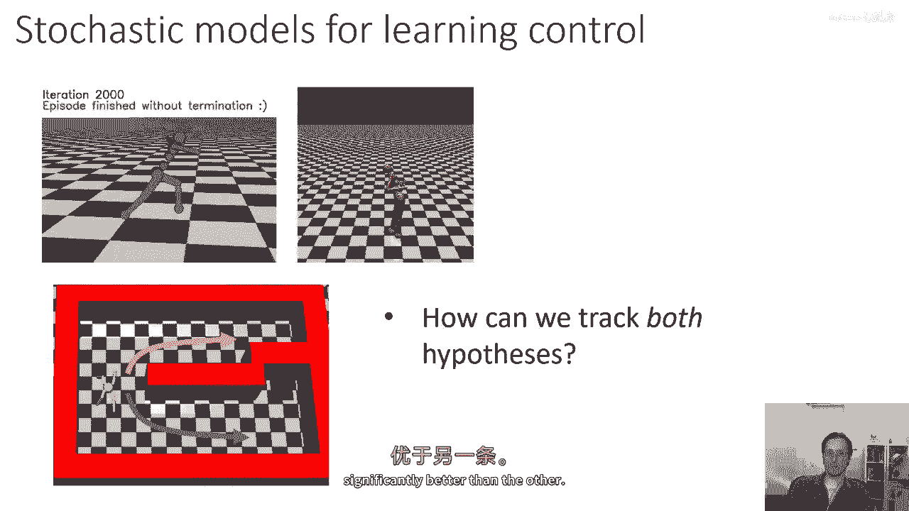
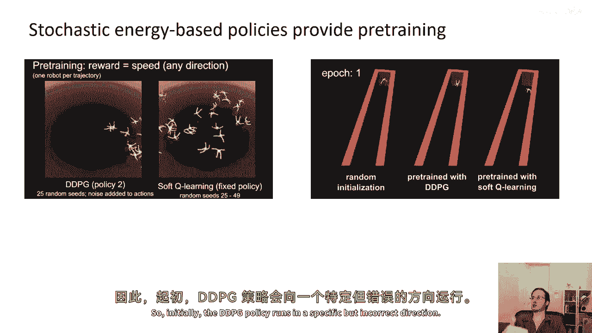
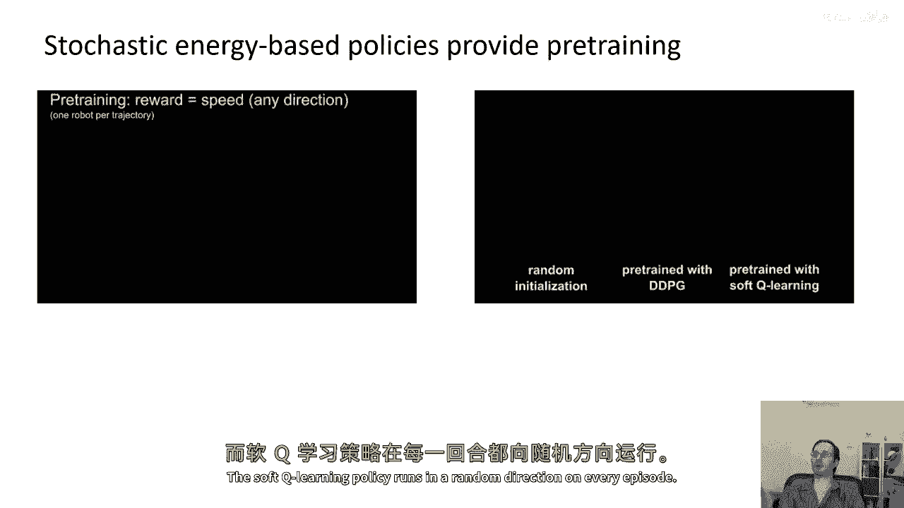
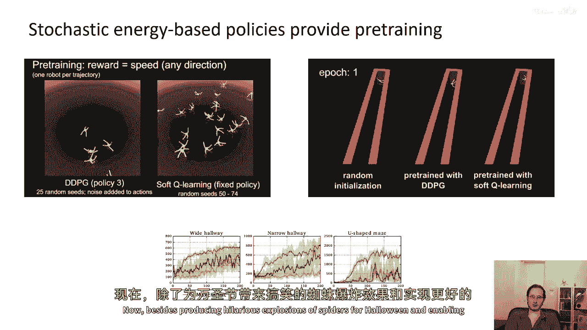
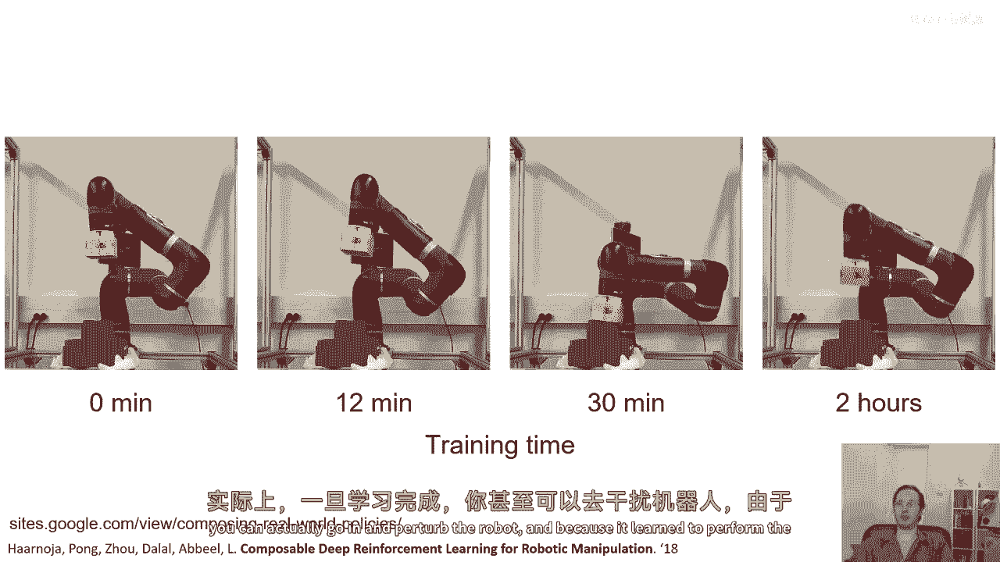
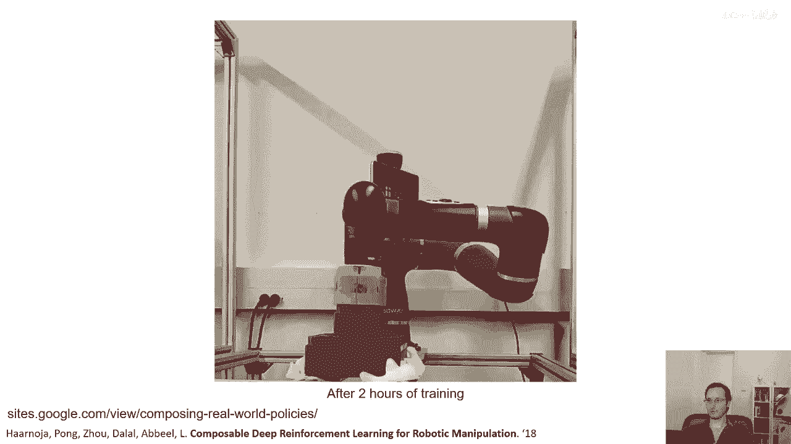
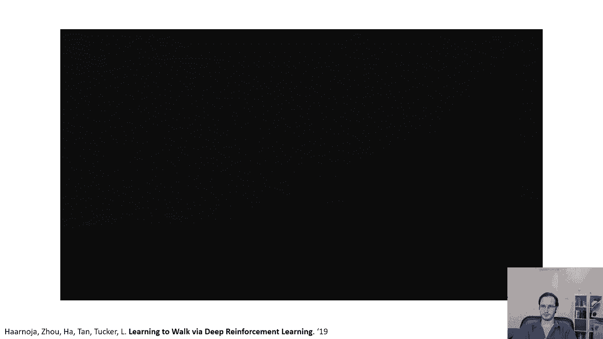
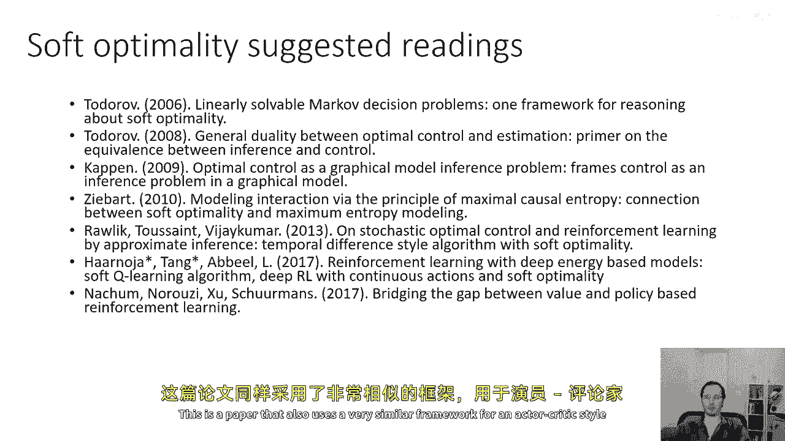

# 81：控制即推断（第五部分）🚀

在本节课中，我们将学习如何将变分推断或软最优性框架应用于实际算法，以实现微调、探索和鲁棒性等有趣特性。我们将通过分析相关研究论文来理解这些概念。

---

上一节我们介绍了软最优性的理论基础，本节中我们来看看如何将其应用于实际算法，以解决强化学习中的探索与微调问题。

在强化学习中，例如训练人形机器人行走时，运行同一算法两次可能得到截然不同的策略。这类似于一个更复杂的局部最优问题。

以下是一个简单的例子来说明这个问题：
假设有一个环境，小机器人需要走到蓝色目标位置。它可以选择探索上部或下部通道，两者都能到达目标。传统强化学习算法可能会过早地“承诺”于其中一个通道。如果选择了错误的通道，就可能无法达到最优解。要解决此问题，代理需要同时跟踪两种假设，探索两个通道，直到明确哪个更优。

软Q学习在此类问题上非常有效。该方法基于Q函数，它将状态和动作映射到连续值。在训练初期，代理对于上下通道的Q值都会增加。在初始状态，Q函数可能有两个峰值，分别对应两个通道。哪个峰值更高具有一定随机性。

如果我们根据变分推断框架制定策略，使其与指数Q值成比例，我们就会将概率质量分配给两个峰值，从而同时探索两个通道。这个归一化值就是价值函数，可以解释为优势的指数，这直接引出了软Q学习算法。该方法具有探索多种假设直到找到最优解的吸引人特性。

这种方法对于预训练非常有用。在任务未明确指定的情况下进行预训练，可以学习以多种方式解决任务。当环境变化需要专精时，只需剔除错误方法，而无需重新学习。

举例说明，在一个奖励向任意方向快速移动的任务中：
*   标准DDPG算法会学习朝一个（可能是错误的）特定方向移动。
*   软Q学习方法则会尽可能多地尝试不同方向，以增加熵，产生多样化的行为。

这种“乱跑”的行为之所以有用，是因为以此预训练的策略在后续微调时（例如需要在特定走廊方向移动）能更快适应。原始的DDPG策略需要先“忘记”错误方向，再学习正确方向；而软Q学习策略只需专注于保留正确方向，因此微调效率更高。

实验结果表明，蓝色曲线（软Q学习微调）的性能提升速度远快于绿色曲线（DDPG微调）。

---

除了改善微调，软最优性框架还能直接催生更高效、性能更强的强化学习算法。目前最广泛使用的离线连续控制算法之一——**软演员-评论家**（SAC）——便基于此原则。

软演员-评论家是软Q学习的演员-评论家版本。其更新规则如下：

1.  **Q函数更新**：学习给定策略下的Q函数，可视为在变分族内进行消息传递。
    *   公式与常规演员-评论家相似，但增加了熵项 `-log π`。
    *   **代码/公式描述**：`Q更新目标 = 奖励 + γ * (下一状态Q值 - α * log π(下一动作|下一状态))`，其中α是温度参数。
2.  **策略更新**：使用更新后的Q函数，通过最大化期望回报与熵的和来更新策略。
    *   **代码/公式描述**：`策略更新目标 = E[ Q(s,a) - α * log π(a|s) ]`

该算法可以离线学习，并与环境交互收集新数据。在变分推断视角下，Q函数更新对应于在图形模型中进行推断（消息传递），而策略更新则是调整变分分布以更好地近似后验。

SAC算法被证明非常有效。例如，它能让机器人学习堆叠乐高积木。有趣的是，由于熵项鼓励了行为多样性，学习后的策略对干扰非常鲁棒。即使被人为干扰，机器人也能调整并恢复任务。

另一个实验是让米诺陶洛斯机器人使用SAC在真实世界中学习行走。经过训练，它能发展出可靠的步态，并且对未训练过的地形（如斜坡、楼梯）展现出一定的适应能力。

---

本节课中我们一起学习了如何将控制即推断的框架应用于实际算法。我们看到了软Q学习如何通过维持多模态策略来促进探索和改善微调。接着，我们介绍了基于相同原理的软演员-评论家算法，它通过显式地最大化熵来学习鲁棒且高效的控制策略，并在真实机器人任务中取得了成功。

**延伸阅读与参考文献**：
*   本讲内容与“线性可解马尔可夫决策过程”工作密切相关。
*   Emmanuel Todorov 在软最优性和解释人类运动控制方面做了开创性工作。
*   Bert Kappen 在该领域做了大量基础研究。
*   Brian Ziebart 是将此原理应用于逆强化学习的先驱。
*   “Reinforcement Learning with Deep Energy-Based Policies” 是软Q学习的相关论文。
*   “Soft Actor-Critic: Off-Policy Maximum Entropy Deep Reinforcement Learning with a Stochastic Actor” 描述了目前广泛使用的SAC算法。

