# 82：逆强化学习（第一部分） 🧠

在本节课中，我们将要学习**逆强化学习**。我们将了解其问题定义，探讨如何利用行为概率模型来推导逆强化学习算法，并认识几种可用于高维问题的实用方法。

---

## 概述

到目前为止，我们处理强化学习问题时，总是假设奖励函数是已知的。通常，你需要手动设计这个奖励函数。然而，如果任务本身难以手动指定奖励函数，但你拥有专家成功完成任务的行为数据，情况会如何？你能否从观察到的行为中推断出奖励函数，然后利用强化学习算法重新优化它？这就是逆强化学习要解决的问题。

上一讲我们介绍了将最优性近似建模为推断问题的方法。今天，我们将学习如何应用这个模型来学习奖励函数，而不是直接从已知奖励中学习策略。

---

## 为何需要学习奖励函数？🤔

### 从模仿学习的视角看

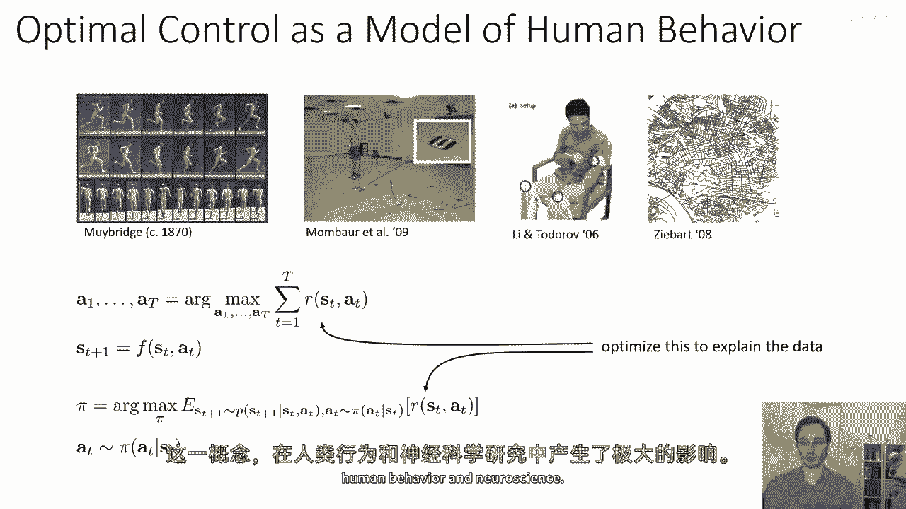

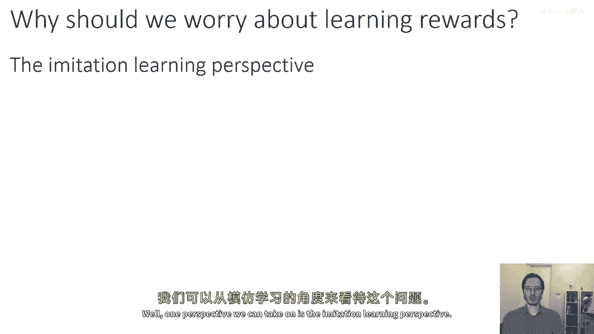

标准的模仿学习方法，如课程初期讨论的行为克隆，是让智能体直接模仿专家的动作。然而，人类在模仿时并非如此。我们不会让别人操控我们的身体去精确复现动作。相反，我们会观察他人，理解他们的意图，然后尝试去实现这个意图，而非机械地复制动作。这可能导致我们采取与专家完全不同的动作，但最终达成相同的结果。

因此，我们希望强化学习智能体也能做到这一点：理解专家的意图，而不仅仅是模仿动作。

### 从强化学习的视角看

在许多强化学习任务中，目标函数是显而易见的。例如，在游戏中，得分自然就是奖励函数。但在许多其他场景中，奖励函数远没有那么明确。

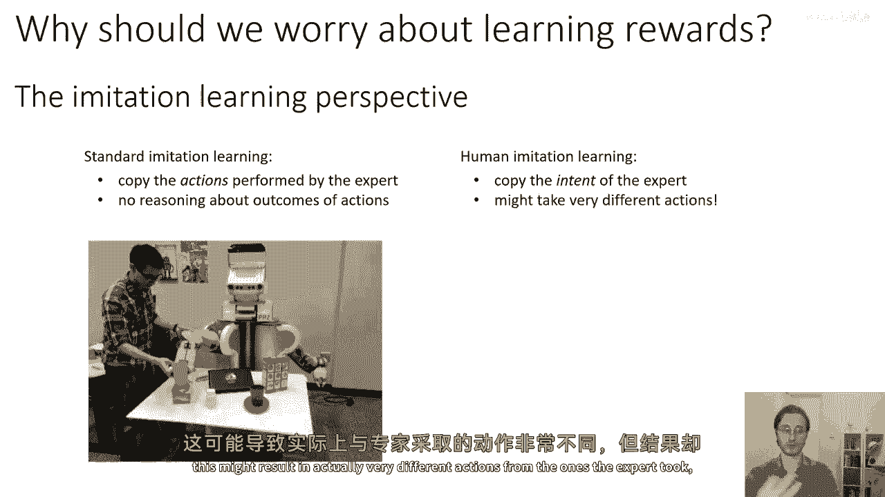

以自动驾驶汽车为例，它需要平衡多种相互竞争的因素：到达目的地、保持特定速度、遵守交通法规、不干扰其他车辆、保证乘客舒适等。编写一个单一的方程来描述所有这些因素非常困难，但请专业驾驶员演示则相对容易得多。因此，在这些场景中，学习奖励函数极具吸引力。

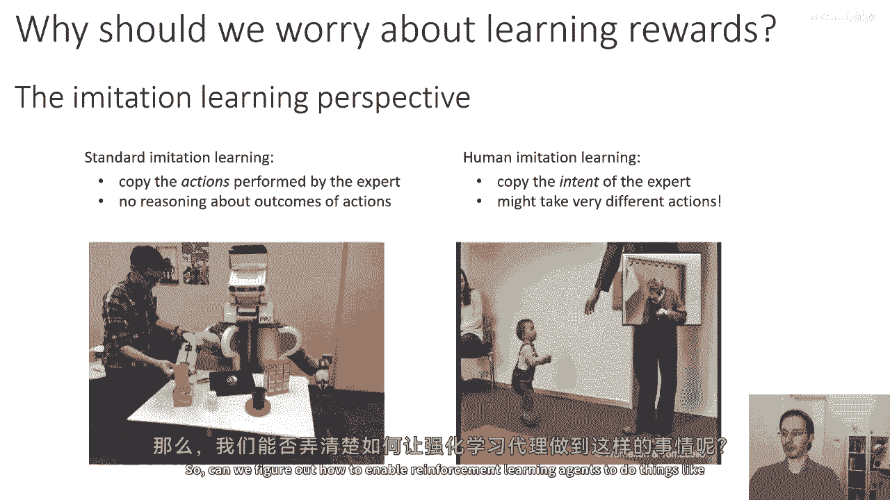

---

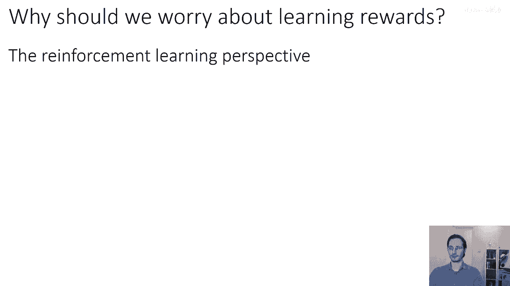

## 逆强化学习问题定义 📝

**逆强化学习**指的是从演示中推断奖励函数的问题。例如，在驾驶场景中，你拥有专业驾驶员演示的良好策略，你希望从中提取出一个好的奖励函数，供你的强化学习智能体使用。

然而，逆强化学习本身是一个定义不明确的问题。原因在于，对于任何给定的行为模式，实际上存在无限多个不同的奖励函数可以解释该行为。

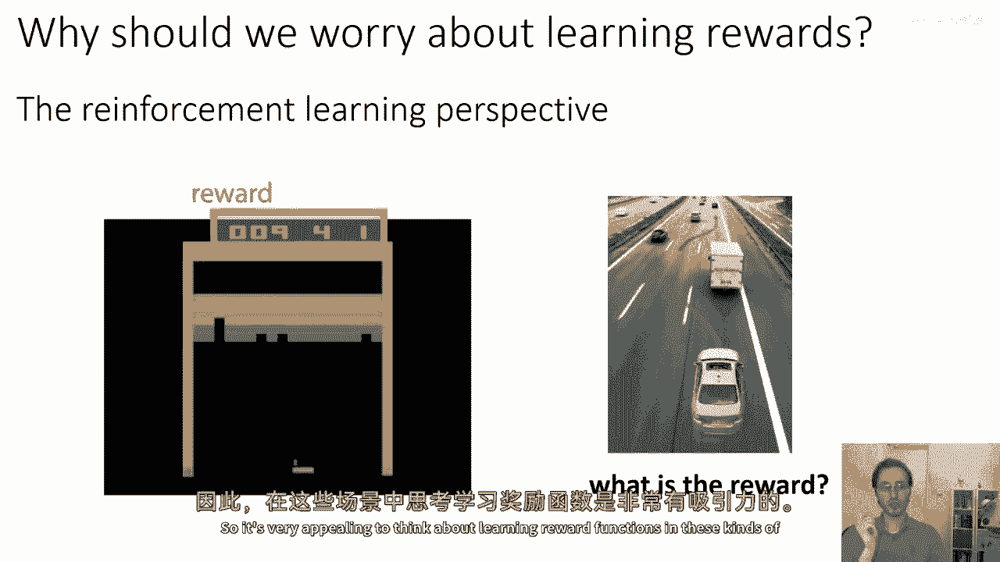

考虑一个简单的16状态网格世界示例。如果给你一条演示轨迹，并问你执行该演示的智能体的奖励函数是什么，答案可能有很多种。例如：
*   奖励函数可能是在某个特定方格获得高奖励。
*   也可能是在下半部分区域获得高奖励，同时穿过某些方格会受到惩罚。
*   甚至可以是，除了演示中采取的动作外，执行任何其他动作的奖励都是负无穷。

所有这些奖励函数都能使观察到的行为在传统意义上达到最优。因此，我们需要方法来消除这种歧义。

---

## 形式化定义

为了更正式地定义逆强化学习，我们可以将其与正向强化学习进行对比：

| 要素 | 正向强化学习 | 逆强化学习 |
| :--- | :--- | :--- |
| **给定条件** | 状态空间 `S`，动作空间 `A`，**奖励函数 `R`** | 状态空间 `S`，动作空间 `A`，**来自最优策略 `π*` 的轨迹样本 `τ`** |
| **目标** | 学习最优策略 `π*` | 学习奖励函数 `R_ψ`（参数为 `ψ`），使得 `π*` 为优化该奖励函数的最优策略 |
| **后续步骤** | - | 使用学到的 `R_ψ`，通过强化学习算法学习对应的最优策略 |

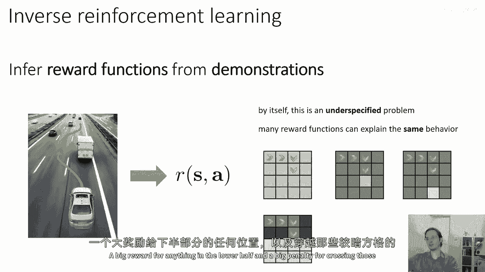

对于奖励函数的参数化，经典逆强化学习文献中常用的是**线性奖励函数**：`R(s, a) = ψ^T * f(s, a)`，其中 `f` 是特征向量。而在深度强化学习中，我们可能希望使用**神经网络**来表示非线性奖励函数。

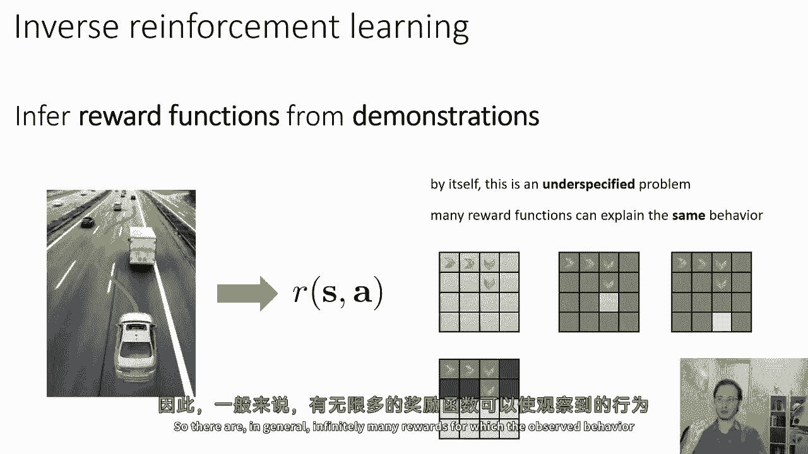

---

## 经典方法：特征匹配

在讨论基于概率模型的现代方法之前，我们先了解一些经典的逆强化学习思路，它们主要围绕**特征匹配**展开。

其核心思想是：假设我们有一些特征 `f(s, a)`，并学习这些特征上的线性奖励函数。为了消除歧义，我们可以要求学到的奖励函数所对应的最优策略，其特征期望值与专家策略的特征期望值相匹配。

**公式**：选择参数 `ψ`，使得 `E_{π_R_ψ}[f] ≈ E_{π*}[f]`

其中，右侧可以通过对演示轨迹中的特征向量取平均来近似。

然而，这仍然存在歧义，因为多个不同的 `ψ` 仍可能导致相同的特征期望。

---

### 最大间隔原则

为了进一步消除歧义，人们引入了**最大间隔原则**（类似于支持向量机）。该原则要求选择 `ψ`，以最大化专家策略 `π*` 与所有其他策略 `π` 之间的“间隔”。

**公式**：`E_{π*}[ψ^T f] ≥ E_{π}[ψ^T f] + margin(π*, π)`

其启发式思想是：在众多能解释专家行为的奖励函数中，选择那个让专家策略明显优于所有其他策略的奖励函数。

为了处理策略空间巨大且连续的问题，并考虑策略间的相似性，可以对间隔进行加权，例如使用特征期望的差异或策略间的KL散度作为权重。

尽管这种方法可以推导出一些实用的算法，但它存在几个缺点：
1.  **最大化间隔具有一定随意性**，并未明确基于对专家行为的假设。
2.  难以清晰地对专家的**次优性**进行建模。
3.  最终会形成一个复杂的约束优化问题，这对于使用神经网络表示奖励函数的深度学习场景来说尤其棘手。

---

## 基于概率模型的方法 🎲

本节课讨论的重点将建立在**专家行为的概率模型**之上。上一讲我们介绍了一个图模型，它将次优行为建模为包含状态、动作和**最优性变量**的推断问题。

在该模型中，我们定义了：
*   初始状态分布 `p(s1)`
*   状态转移概率 `p(s_{t+1} | s_t, a_t)`
*   **最优性概率**：`p(O_t=1 | s_t, a_t) = exp(r(s_t, a_t))`

上一讲我们关心的问题是：**在给定奖励函数 `R` 的条件下，专家行为最优时，轨迹的概率是多少？** 这是一个推断问题。

**公式**：`p(τ | O_{1:T}) ∝ p(τ) * exp(∑_{t=1}^{T} r(s_t, a_t))`

这个模型有一个很好的性质：最优的轨迹具有最高的概率，次优轨迹的概率呈指数级下降，这可以很好地模拟专家或动物的次优行为。

---

### 逆强化学习作为模型学习

现在，我们将利用这个模型来学习奖励函数。我们将问题转变为：**给定观察到的专家轨迹，我们能否学习奖励函数 `R` 的参数 `ψ`，以最大化这些轨迹在该图模型下的似然？**

**公式**：`max_ψ log p(τ | O_{1:T}, ψ)`

这不再是一个推断问题，而是一个**模型参数学习**问题。通过最大化专家轨迹的似然，我们可以推断出最可能产生这些行为的奖励函数。

这种方法自然地提供了对专家次优性的概率解释，并且其优化目标（最大似然）比最大间隔原则更为直接。在下一部分中，我们将深入探讨基于此原理的具体算法。

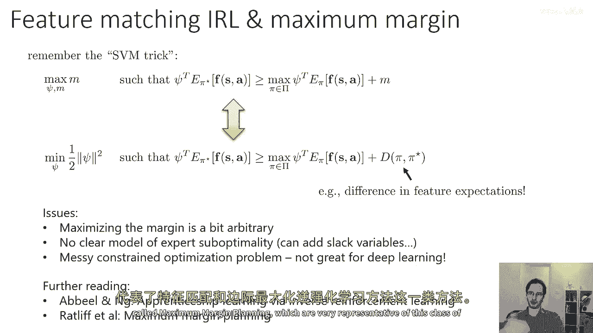

---

## 总结

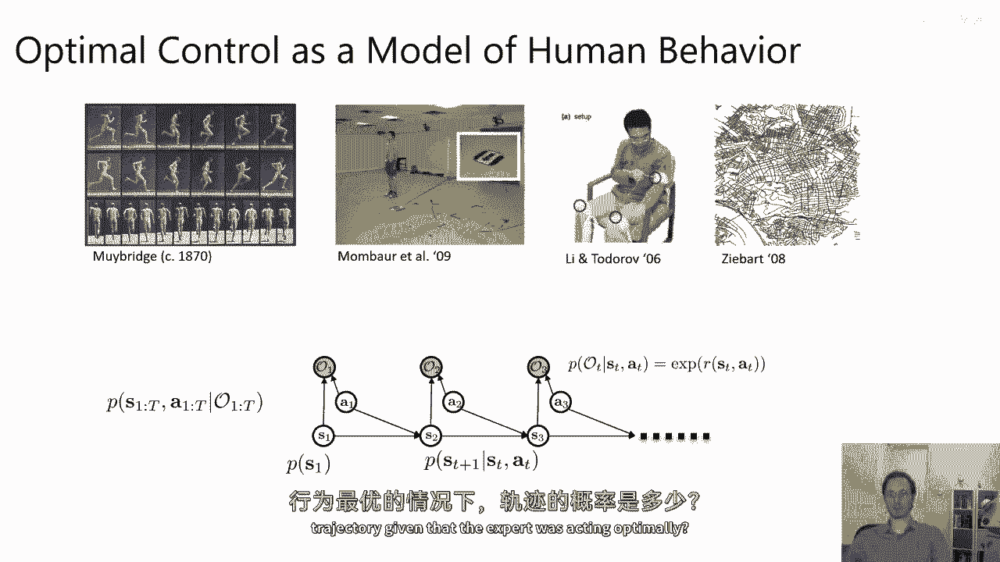

本节课我们一起学习了逆强化学习的基础知识。我们首先探讨了为何需要从演示中学习奖励函数，无论是为了进行更接近人类理解的模仿学习，还是为了解决复杂场景中奖励函数难以手动设计的问题。

我们明确了逆强化学习的问题定义及其固有的歧义性。接着，我们回顾了基于特征匹配和最大间隔原则的经典方法，并指出了它们的局限性。

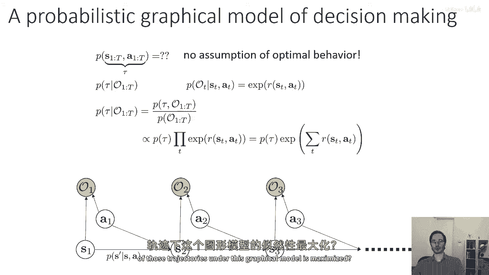

最后，我们引入了基于概率模型的现代方法框架。通过将最优行为建模为图模型中的推断问题，我们可以将逆强化学习转化为一个最大似然估计问题，从而为学习奖励函数提供了一个更坚实、更灵活的基础。在接下来的课程中，我们将基于此框架推导具体的算法。