# 83：逆向强化学习（第二部分）🚀

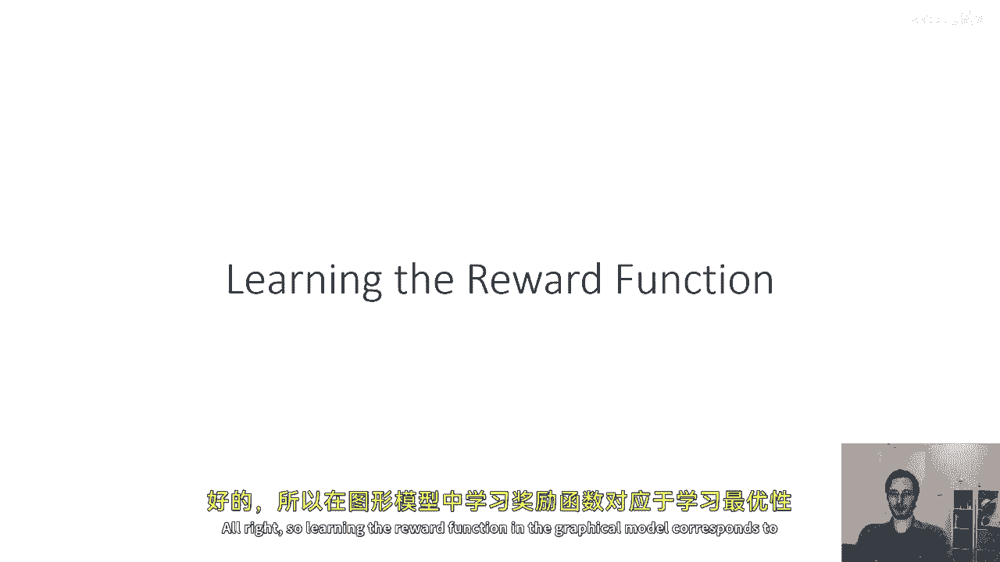

在本节课中，我们将学习如何通过最大似然方法，从专家演示中学习奖励函数。我们将深入探讨最大熵逆向强化学习算法的原理与实现，并理解其如何解决奖励函数的不确定性问题。

---

## 学习奖励函数等同于学习最优性变量 🔍

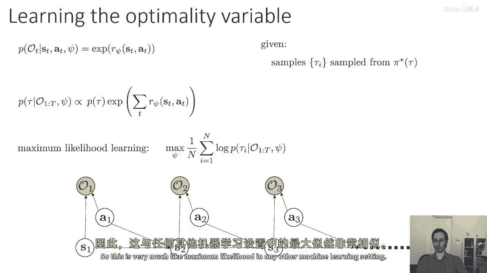

在图形模型中，学习奖励函数等价于学习最优性变量。给定状态和动作，最优性变量的概率由参数化的奖励函数决定。

**公式**：`p(o_t | s_t, a_t, ψ) ∝ exp(r_ψ(s_t, a_t))`

我们的目标是找到参数 ψ，使得观察到的轨迹概率最大化。在逆向强化学习设置中，我们从未知的最优策略中获取样本，并通过最大似然估计来学习奖励函数。

---

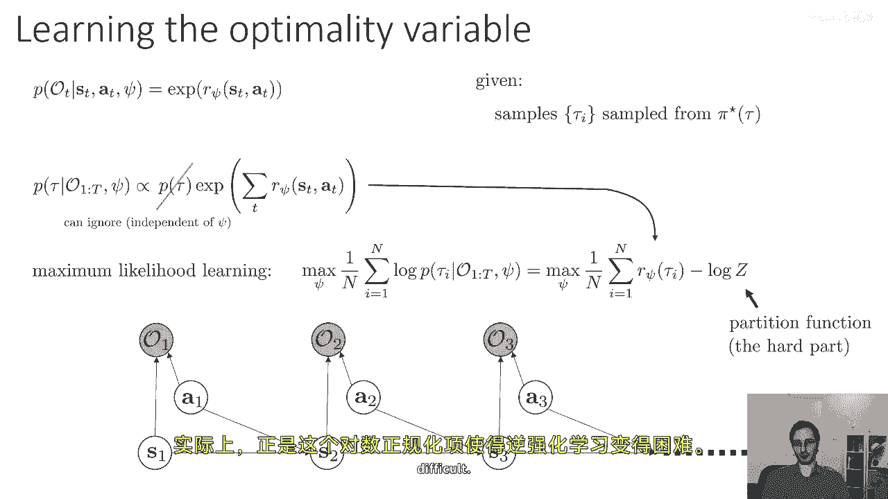

## 最大似然优化与挑战 ⚙️

最大似然优化与其他机器学习设置类似。轨迹的对数概率表达式直观地表明，我们希望最大化专家轨迹的平均奖励，同时减去一个对数归一化项。

**公式**：`log p(τ | o_{1:T}, ψ) = Σ_t r_ψ(s_t, a_t) - log Z`

如果忽略对数归一化项，优化将变得简单但错误，因为它可能为所有轨迹分配高奖励。对数归一化项确保学习到的奖励函数使专家轨迹比其他未观察到的轨迹更可能。

---

## 处理对数归一化项（配分函数）📊

对数归一化项 Z（也称为配分函数）涉及对所有可能轨迹的积分，这通常是不可解的。然而，我们可以通过计算其梯度来优化。

**公式**：`∇_ψ log Z = E_{p(τ | o_{1:T}, ψ)}[∇_ψ Σ_t r_ψ(s_t, a_t)]`

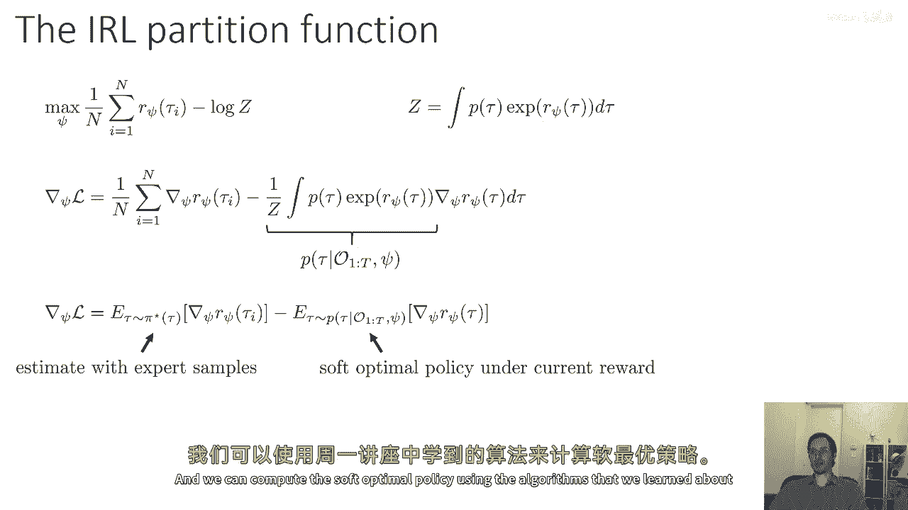

梯度的计算可以分解为两个期望的差值：在专家策略下的期望与在当前奖励函数下的期望。这启发了一种对比性算法：增加专家轨迹的奖励，减少从当前奖励函数中采样轨迹的奖励。

---

## 估计期望与状态动作边缘 🧮

为了估计第二个期望项，我们可以利用状态动作边缘分布。通过计算前向和后向消息，我们可以得到状态动作边缘分布 μ_t(s_t, a_t)。

**公式**：`μ_t(s_t, a_t) ∝ α_t(s_t) * β_t(s_t, a_t)`

其中，α_t(s_t) 是前向消息，β_t(s_t, a_t) 是后向消息。然后，期望可以表示为 μ 与奖励函数梯度的内积。

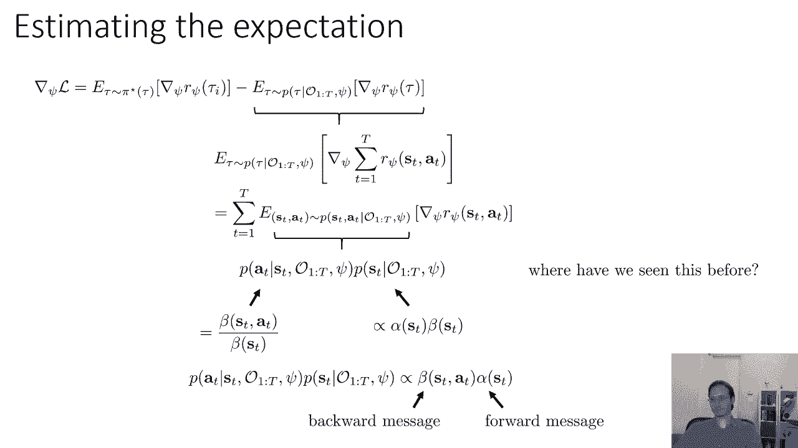

**代码**：
```python
# 计算状态动作边缘分布 μ
mu = normalize(alpha * beta)
# 计算期望
expectation = np.sum(mu * grad_r)
```

这种方法适用于小且离散的状态空间，但需要已知的状态转移概率。

---

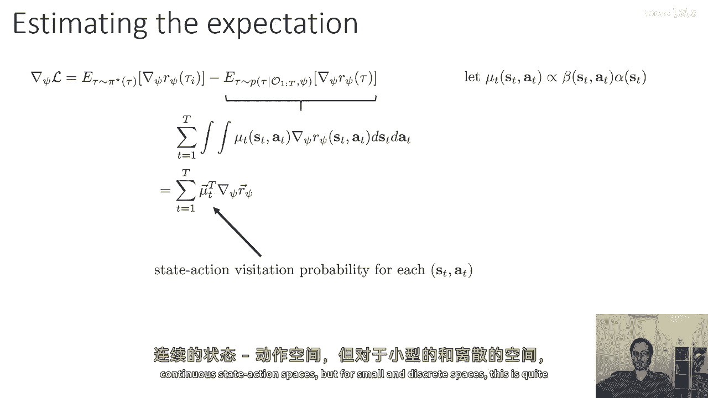

## 最大熵逆向强化学习算法 🧠

最大熵逆向强化学习算法由 Brian Ziebart 在 2008 年提出。该算法通过迭代以下步骤来优化奖励参数 ψ：

1.  计算当前奖励函数下的后向消息 β 和前向消息 α。
2.  计算状态动作边缘分布 μ。
3.  评估轨迹似然度的梯度：专家轨迹平均奖励梯度与 μ 和奖励梯度内积的差值。
4.  沿梯度方向更新参数 ψ。
5.  重复直到收敛。

该算法最大化专家轨迹的似然度，同时通过最大熵原则避免对专家行为做出不必要的假设，从而有效消除奖励函数的不确定性。

---

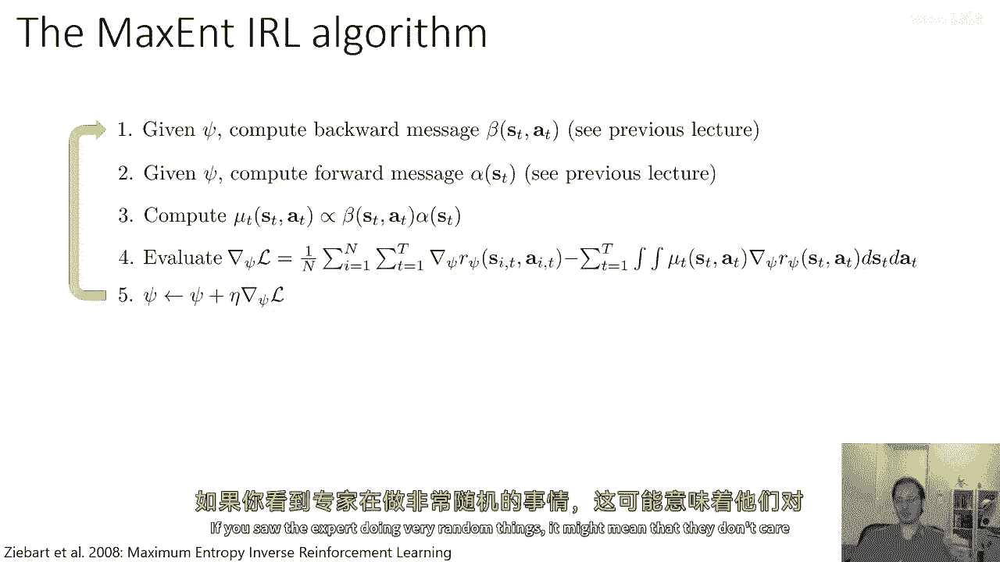

## 最大熵原则与特征匹配 🔗


当奖励函数是参数的线性函数时，该算法等价于解决一个约束优化问题：在匹配专家期望特征的前提下，最大化学习策略的熵。

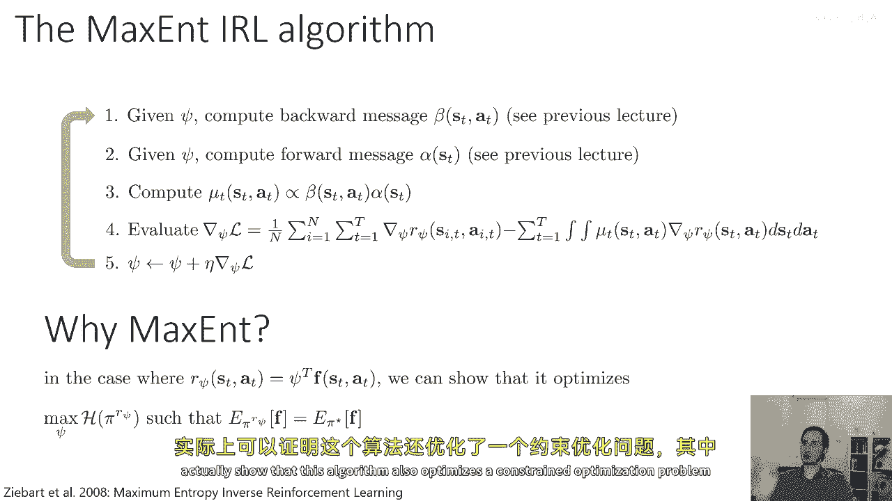

**公式**：`max_π H(π) s.t. E_π[φ(s,a)] = E_{π_E}[φ(s,a)]`

这体现了最大熵原则——一种统计上的奥卡姆剃刀，即只做数据支持的推断。这使得算法在解释专家可能非最优的行为时更加鲁棒。

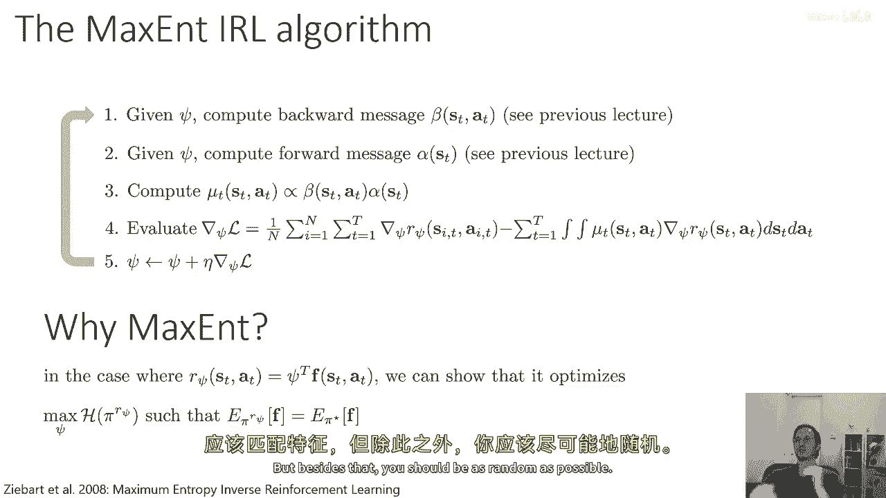

---

## 应用与局限 🗺️

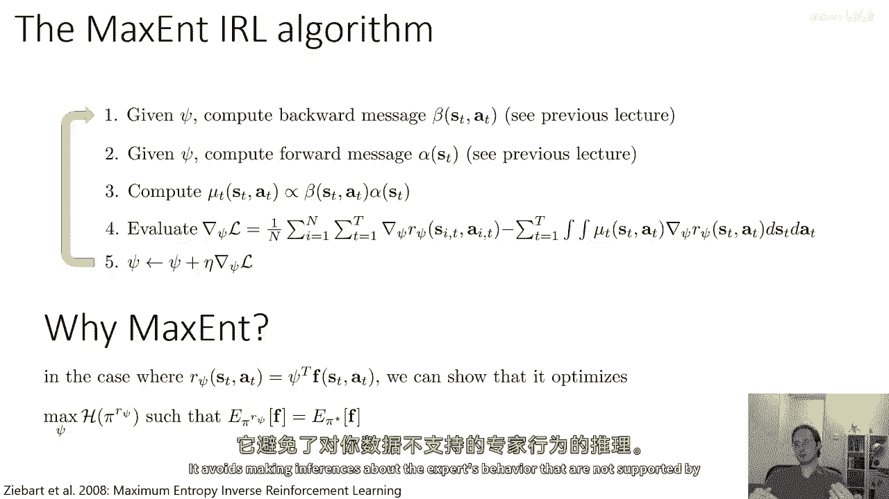

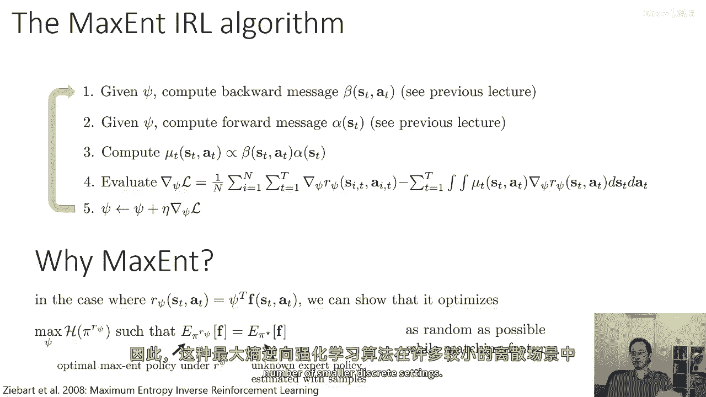

最大熵逆向强化学习已在许多小规模离散问题中成功应用，例如从出租车司机的轨迹数据中推断其路线偏好（如选择城市道路还是高速公路）。

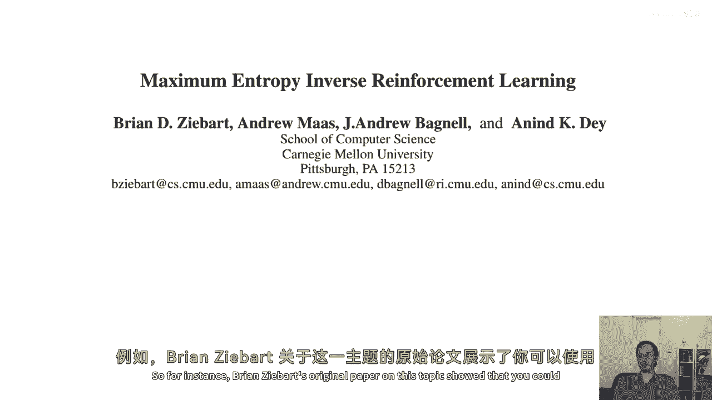

然而，该方法的主要局限在于需要相对较小且离散的状态空间，并且需要已知的状态转移动力学模型。

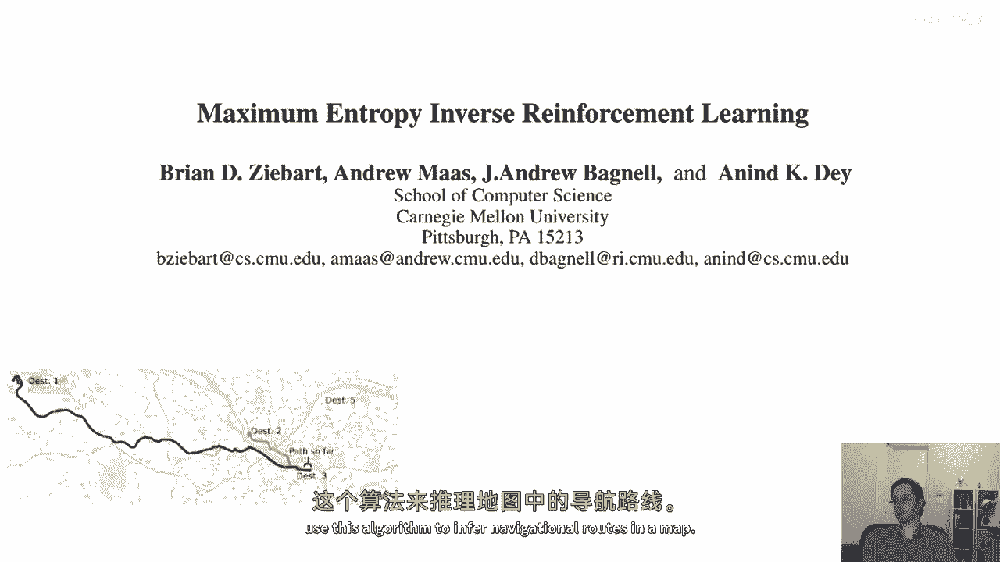

---

## 总结 📝

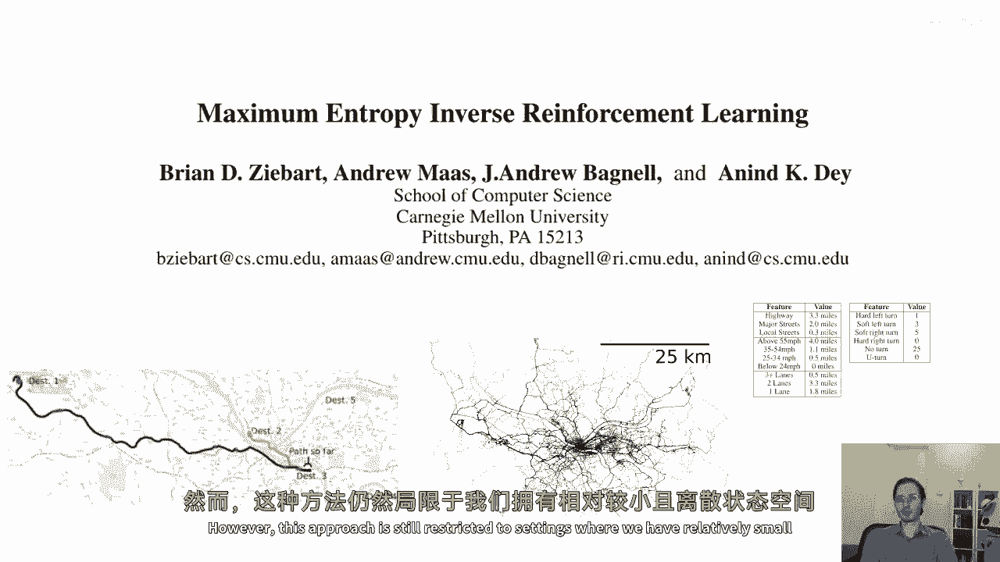

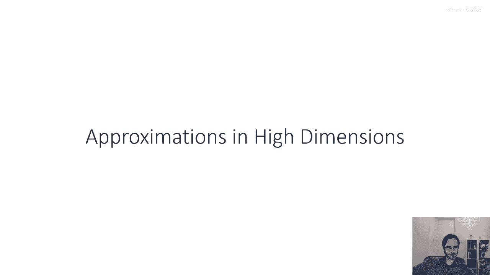

本节课我们一起学习了最大熵逆向强化学习。我们从最大似然估计出发，探讨了如何通过处理配分函数来优化奖励参数。我们详细介绍了通过前向后向消息计算状态动作边缘分布的方法，并最终阐述了最大熵逆向强化学习算法的步骤及其背后的最大熵原理。该算法通过匹配专家特征并最大化策略熵，有效地从演示中推断出奖励函数，尽管其应用受限于对已知动力学和小状态空间的假设。