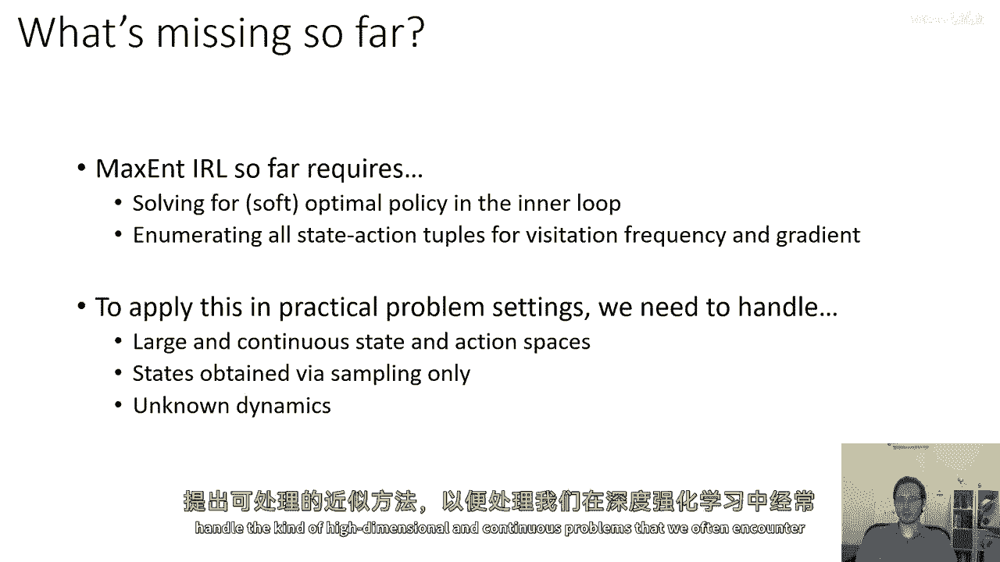
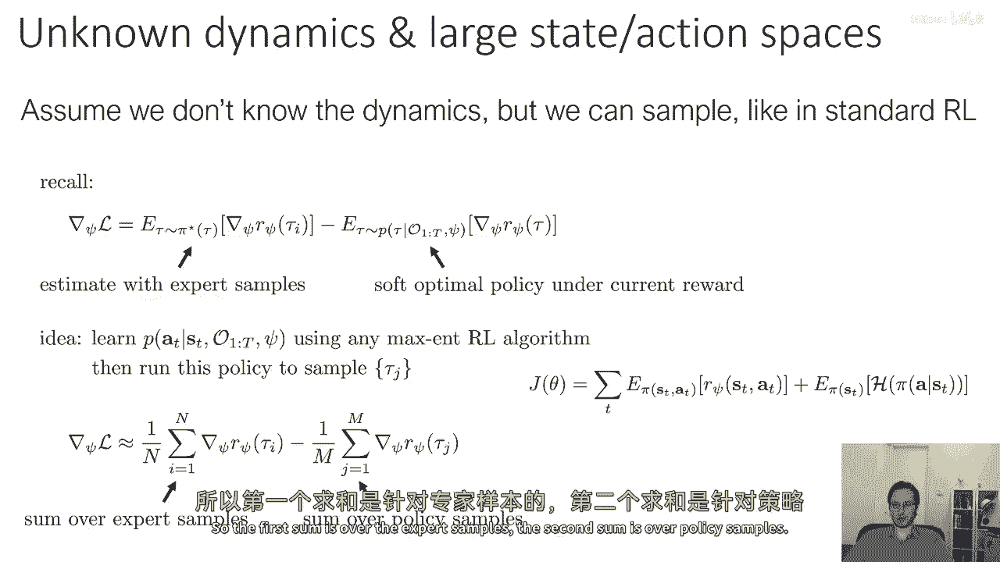
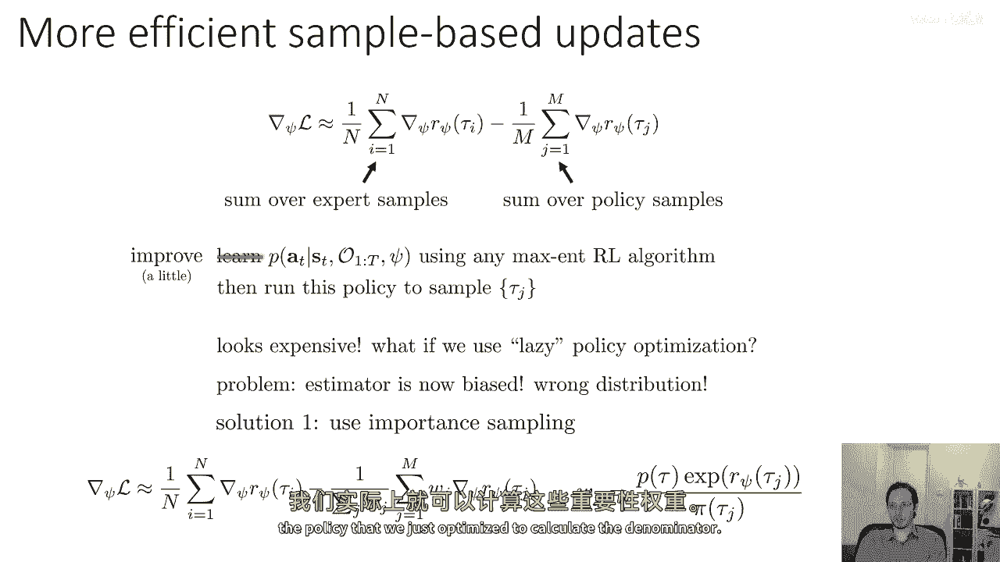
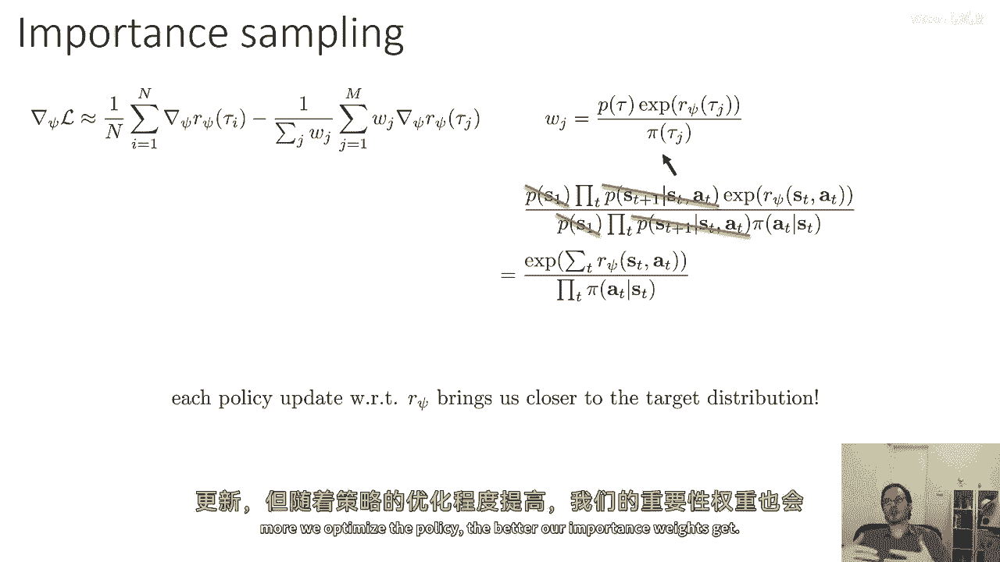
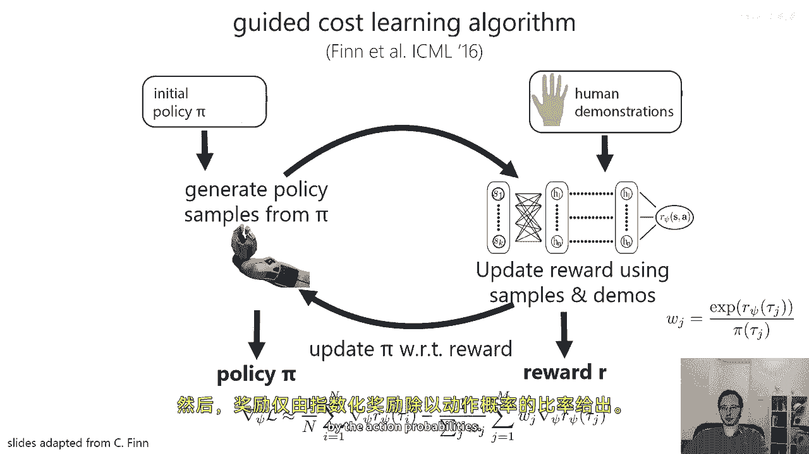
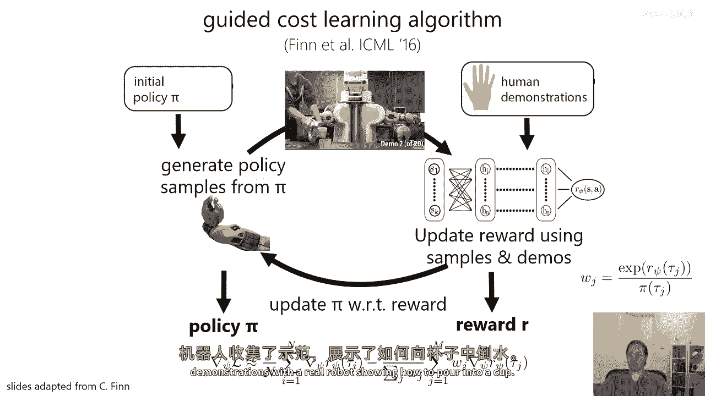
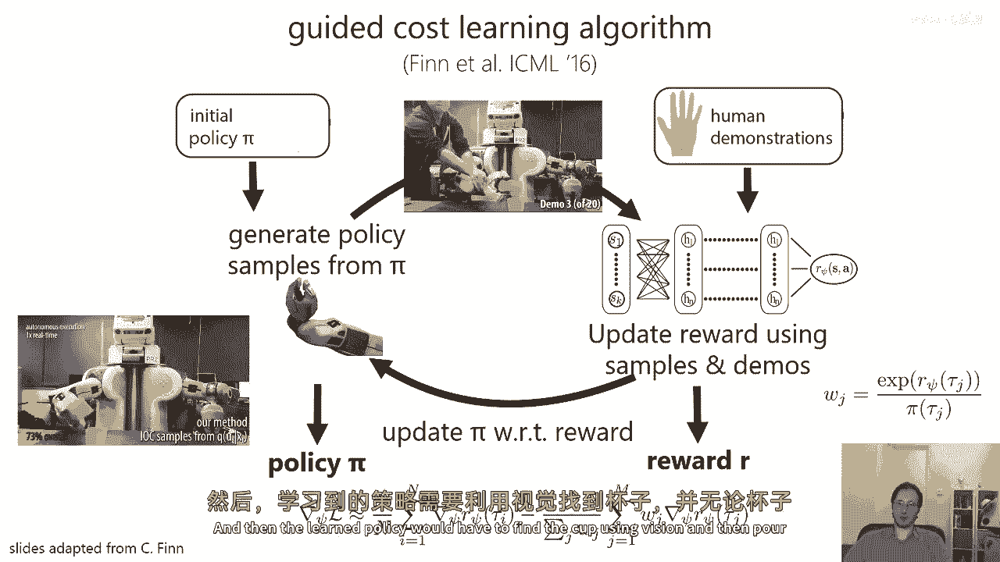
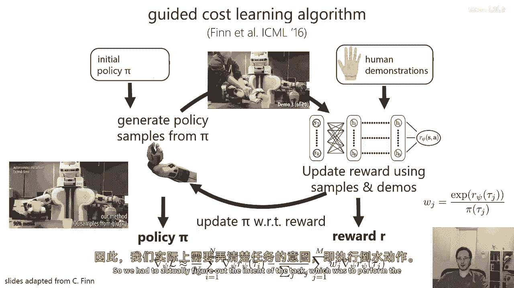
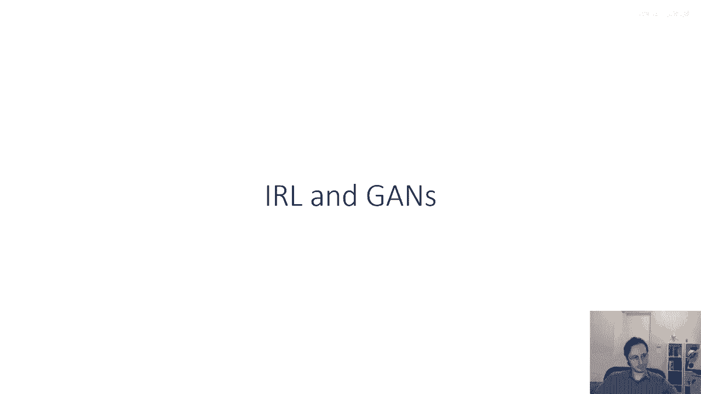

# 84：逆强化学习（第三部分） 🧠

在本节课中，我们将要学习如何将最大熵逆强化学习（MaxEnt IRL）扩展到具有高维或连续状态/动作空间的实际问题中。我们将探讨传统方法面临的挑战，并介绍一种名为“引导成本学习”的实用近似算法。

上一节我们介绍了最大熵逆强化学习的基本原理。本节中我们来看看如何将其应用于更实际、更复杂的场景。

## 实际应用中的挑战 🚧

到目前为止，我们讨论的最大熵逆强化学习方法需要一些在大规模数据中难以获得的东西。实际的问题设置带来了以下主要挑战：

1.  **需要在内部循环中求解软最优策略**：为了计算前向和后向消息，算法需要枚举所有可能的状态-动作对，这在连续或高维空间中是不可能的。
2.  **难以处理的状态和动作空间**：实际场景中，状态和动作空间可能非常大且连续，状态可能仅通过采样获得，这使得枚举所有可能的状态-动作对变得不可能。
3.  **未知的动态模型**：我们可能不知道环境的动态模型，这使得计算前向和后向消息的简单方法变得无效。

因此，之前讨论的算法并非完全适用于实际场景。我们需要想出可操作的近似值，以处理在深度强化学习中经常遇到的高维度和连续性问题。

## 可操作的近似方法：引导成本学习 💡

为了实现逆强化学习，我们可以做些什么呢？特别是在具有不确定的动力学和大的状态或动作空间的情况下。

首先，我们将假设我们不知道动态模型，但我们能够像标准模型无关的强化学习那样进行采样。

记住，最大熵IRL中似然函数的梯度是两个期望值的差：
`∇L(θ) = E_τ~p_expert[∇r_θ(τ)] - E_τ~p_π(θ)[∇r_θ(τ)]`

*   **第一项**：专家轨迹样本的奖励梯度期望值。
*   **第二项**：来自当前奖励函数下最优策略的轨迹奖励梯度期望值。

你可以很容易地使用专家的轨迹样本来估计第一项。所以，最大的挑战实际上是第二项，它需要当前奖励下的软最优策略。

以下是我们可以探索的一个想法：

1.  **学习近似策略**：尝试学习给定状态 `s` 和时间 `t` 的软最优策略 `π(a|s)`，使用任何最大熵强化学习算法（如软Q学习或熵正则化策略梯度）。
2.  **采样与估计**：运行该策略来采样轨迹 `τ_j`。然后，我们将从专家那里获取轨迹 `τ_i` 来估计第一个期望值，并从当前策略 `π` 中获取轨迹 `τ_j` 来估计第二个期望值。

然而，这需要为奖励函数的每个梯度步都运行最大熵RL直到收敛，这在实际中非常困难。

## 重要性采样校正 🔄

为了解决策略未完全优化的问题，我们可以采用一个更实用的方法：不要求策略在每次梯度更新时都完全收敛，而是只对其进行少量改进。

但这样做会导致我们的估计器有偏差，因为我们从次优策略中采样，而非最优策略。解决方案是使用重要性采样进行校正。

我们可以引入重要性权重 `w_j` 来校正第二个期望项的偏差：
`E_τ~p_π(θ)[∇r_θ(τ)] ≈ (Σ_j w_j * ∇r_θ(τ_j)) / (Σ_j w_j)`

其中，重要性权重 `w_j` 有一个非常吸引人的形式。我们知道，最优策略的轨迹概率与奖励的指数成正比：
`p_π*(τ) ∝ p(τ) * exp(r_θ(τ))`

因此，重要性权重可以计算为：
`w_j = exp(r_θ(τ_j)) / Π_t π(a_t|s_t)`

所有未知的动态模型项 `p(s_{t+1}|s_t, a_t)` 和初始状态分布 `p(s_1)` 都会在比值中抵消。我们只需要知道当前奖励 `r_θ` 和当前策略 `π` 的动作概率（例如，在连续空间中可能是高斯概率）。

关键在于，与我们的参数 `θ` 相关的每次策略更新都使我们越来越接近目标分布。我们预期优化策略越充分，这些重要性权重就越接近1。因此，我们可以在 `θ` 上取梯度步，即使策略没有完全优化，但优化得越充分，我们的重要性权重估计就越好。

## 引导成本学习算法 🚀

这个想法构成了**引导成本学习算法**的基础。该算法由 Finn 等人提出，是第一种能够扩展到高维状态和动作空间的深度逆强化学习算法。

以下是该算法的设计流程：

1.  **初始化**：有一个对策略 `π` 的初始猜测（可能是随机策略）和一些人类演示数据。
2.  **采样**：从当前策略 `π` 中采样，生成策略样本轨迹。
3.  **更新奖励函数**：使用人类演示样本和加权的策略样本（通过重要性采样），根据梯度公式更新奖励函数参数 `θ`。
4.  **更新策略**：使用更新后的奖励函数，在最大熵学习框架下更新策略 `π`（例如，使用策略梯度加上熵正则项）。
5.  **循环**：重复步骤2-4。

最终，这将产生一个奖励函数和一个实际有效的策略。如果策略被优化到收敛，它将是该奖励函数下的最优策略；而奖励函数则有望是对专家行为的良好解释。

## 实际应用示例 🤖

在原始论文中，Chelsea Finn 等人用真实机器人进行了实验。他们收集了演示数据，展示如何将水倒入杯中。

然后，学习到的策略必须仅使用视觉找到杯子。

并将水倒入那个杯中，无论它位于何处。这意味着算法必须推断出任务的真实意图。

## 总结 📝

本节课中我们一起学习了如何将最大熵逆强化学习应用于实际的高维连续控制问题。我们认识到直接应用原算法的困难在于需要精确计算策略和枚举状态。为此，我们引入了**引导成本学习算法**，它通过**重要性采样**来校正从未完全收敛的策略中采样的偏差，从而允许奖励函数和策略交替进行近似优化。这种方法使得逆强化学习能够处理复杂的真实世界任务，例如从视觉输入中学习机器人操作技能。