# 85：逆向强化学习 第四部分 🧠🤖

在本节课中，我们将学习逆向强化学习（IRL）与生成对抗网络（GAN）之间的深刻联系。我们将看到，这种联系不仅能帮助我们更清晰地理解算法，还能启发我们设计新的模仿学习算法。

---

## 概述

在讲座的最后一部分，我们将讨论逆向强化学习方法与另一类学习数据分布的算法——生成对抗网络（GAN）之间的深层关系。探索这种联系能带来很多启发，并帮助我们设计新的虚拟现实和模仿算法。

---

## 逆向强化学习与对抗游戏 🎮

上一节我们介绍了逆向强化学习的基本框架。本节中，我们来看看它如何可以被视为一种对抗游戏。

可能有人已经注意到，之前描述的算法结构看起来像一个游戏。我们有一个初始策略，从该策略生成样本，同时拥有人类演示样本。我们将这些样本结合起来，训练一个奖励函数，使其给人类演示高分，给策略样本低分。然后，我们更新策略去优化这个奖励函数，使其样本更难与演示区分。

你可以这样理解：奖励函数试图根据当前奖励，将策略样本的奖励压得很低，将人类演示的奖励提得很高。而策略则试图做相反的事情，它希望自己的样本根据奖励函数看起来和人类样本一样好。这几乎可以看作策略与奖励函数之间的一场游戏：策略试图欺骗奖励函数，让其认为自己与人类一样好；而奖励函数则试图找到一个能区分人类和策略的奖励。

---

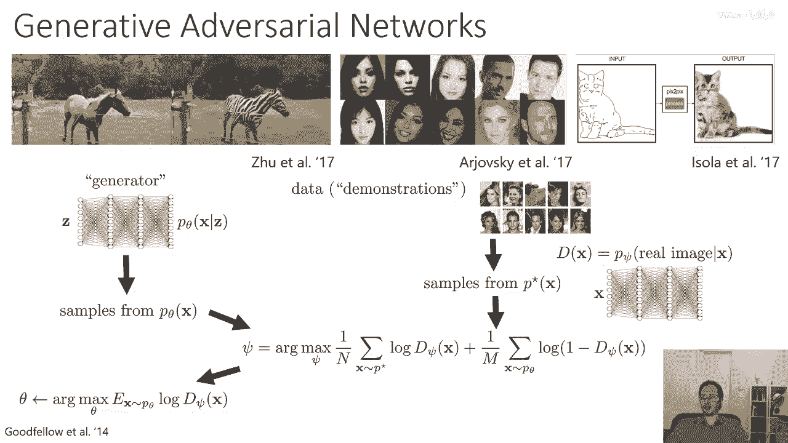

## 与生成对抗网络（GAN）的正式联系 🔗

这种联系不仅仅是表面的。逆向强化学习与游戏的关联可以正式建立，并且与被称为生成对抗网络（GAN）的算法密切相关。

生成对抗网络是一种生成模型的方法，用于学习一个能捕获特定给定数据分布（如真实人脸、猫或斑马图像）的神经网络。它由两个网络组成：
*   **生成器网络**：接收随机噪声 `z`，并将其转换为样本 `x`。理想情况下，这些样本应看起来像来自真实数据分布。
*   **判别器网络**：一个二分类器，试图将所有来自真实分布 `p*` 的样本标记为“真”，将所有来自生成器分布 `p_θ` 的样本标记为“假”。

判别器 `D_ψ(x)` 的输出代表样本 `x` 是真实样本的概率。其目标是最大化真实样本的 `log D_ψ(x)`，并最小化生成样本的 `log(1 - D_ψ(x))`。生成器则被训练来“欺骗”判别器，使其生成的样本被判别器判定为真实样本的概率更高。

---

## 将逆向强化学习视为一种GAN 🧩

现在，这与我之前概述的逆向强化学习程序非常相似。实际上，你可以将逆向强化学习视为生成对抗网络的一种特殊形式。

以下是需要做出的关键选择：应该使用哪种判别器？在GAN中，可以证明最优判别器在收敛时，代表了真实分布 `p*` 与生成器分布 `p_θ` 之间的密度比。

对于逆向强化学习，最优策略分布 `p_θ(τ)` 正比于轨迹概率 `p(τ)` 乘以指数化的奖励 `exp(R(τ))`。我们可以利用最优判别器的公式，将真实分布 `p*` 替换为 `p(τ) exp(R(τ))`，从而定义一个特殊的判别器：

`D(τ) = p(τ) exp(R(τ)) / (p(τ) exp(R(τ)) + p_θ(τ))`

当我们展开 `p_θ(τ)` 和 `p(τ)` 的公式时，与初始状态和动态相关的轨迹概率项会相互抵消，最终判别器简化为一个只依赖于奖励函数和策略概率的形式。值得注意的是，只有当策略概率分布与指数化奖励分布相匹配时，这个判别器才会输出0.5，这意味着策略已经收敛。

接下来，我们优化这个判别器（即优化奖励函数参数 `ψ`），使得该比值对于人类演示样本最大，对于策略样本最小。训练判别器的目标与标准GAN完全相同：最大化在人类数据分布下 `log D_ψ(τ)` 的期望，并最大化在当前策略样本下 `log(1 - D_ψ(τ))` 的期望。有趣的是，我们不需要显式计算配分函数 `Z`，可以将其作为优化 `R_ψ` 的一部分同时优化。

这种推导的一个好处是，我们不再需要重要性采样权重，它们被自然地纳入到配分函数 `Z` 的优化中。然后，策略（扮演生成器的角色）被优化以最大化预期奖励（和熵），使其样本更难以与演示区分。

---

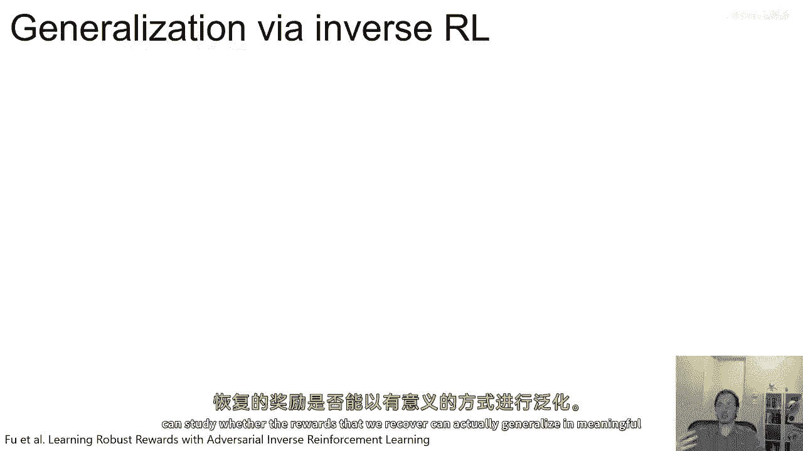

## 实践优势与泛化能力 🚀

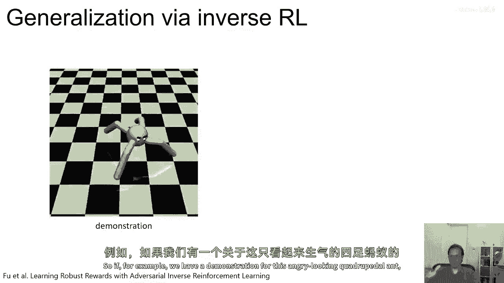

如果我们在实践中实现这种基于GAN的逆向强化学习思想（相关论文链接在文末），可以研究恢复的奖励函数是否能以有意义的方式泛化。

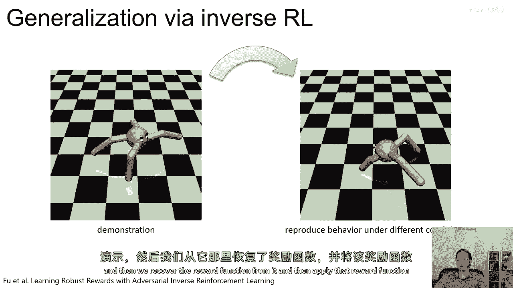

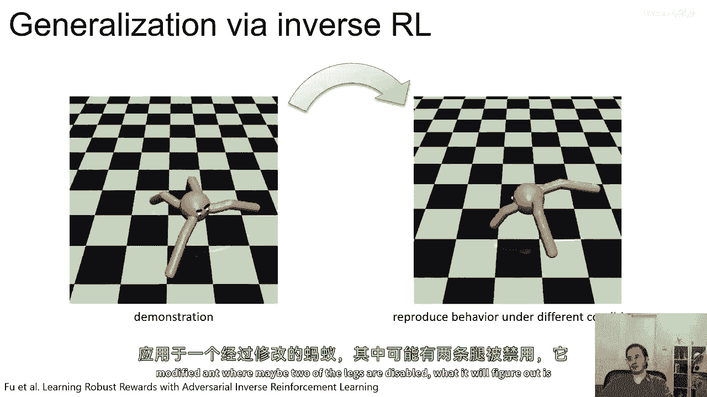

例如，假设我们有某个四足机器人的演示，并从中恢复了一个奖励函数。当我们将这个奖励函数应用到一个被修改（例如禁用两条腿）的机器人时，机器人仍然可以最大化该奖励函数，但会采用与专家演示完全不同的步态。这正是逆向强化学习的优点：如果你恢复了专家的奖励函数，你可以在新的条件下重新优化这个奖励函数，从而得到有意义的行为。而在某些情况下，仅仅复制专家的动作可能无法产生有意义的行为。

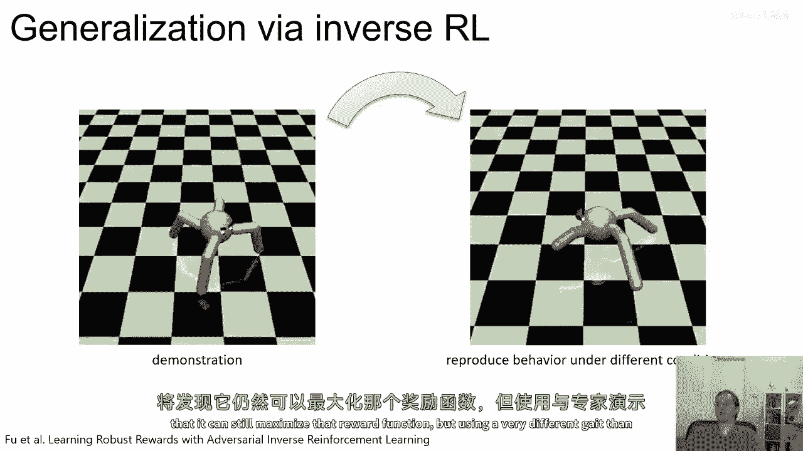

为了获得更好的迁移能力，我们需要将目标（奖励函数）与动力学分离开来，而这正是逆向强化学习所做的。

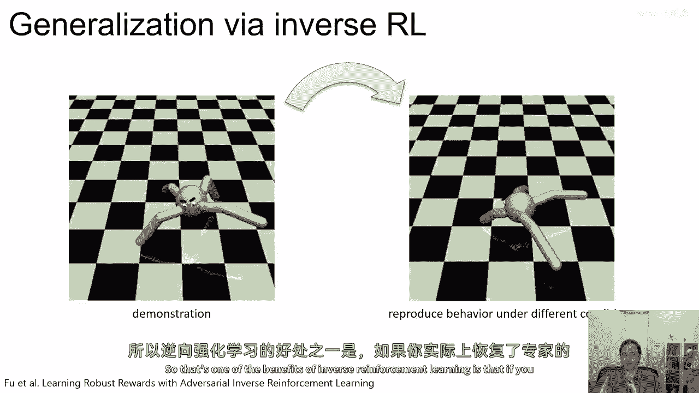

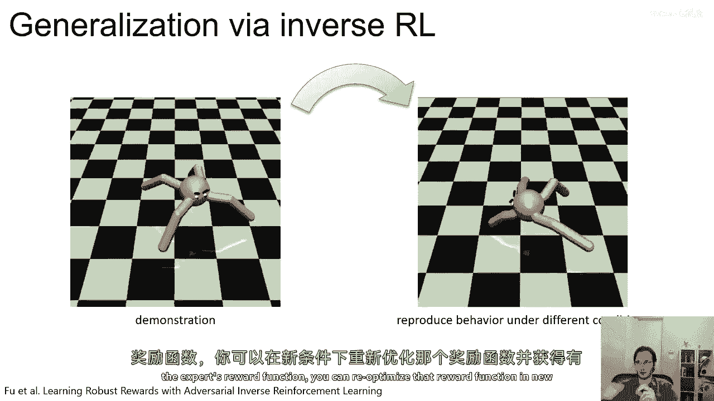

---

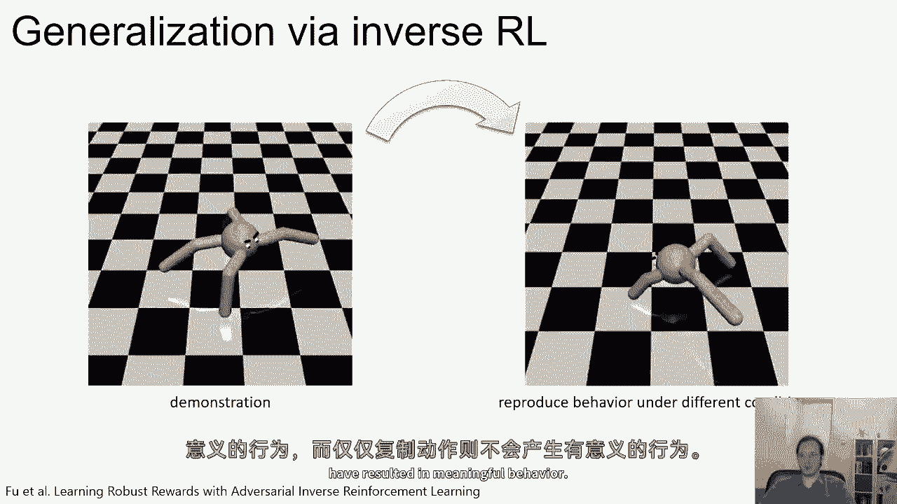

## 从逆向强化学习到对抗模仿学习 🤖

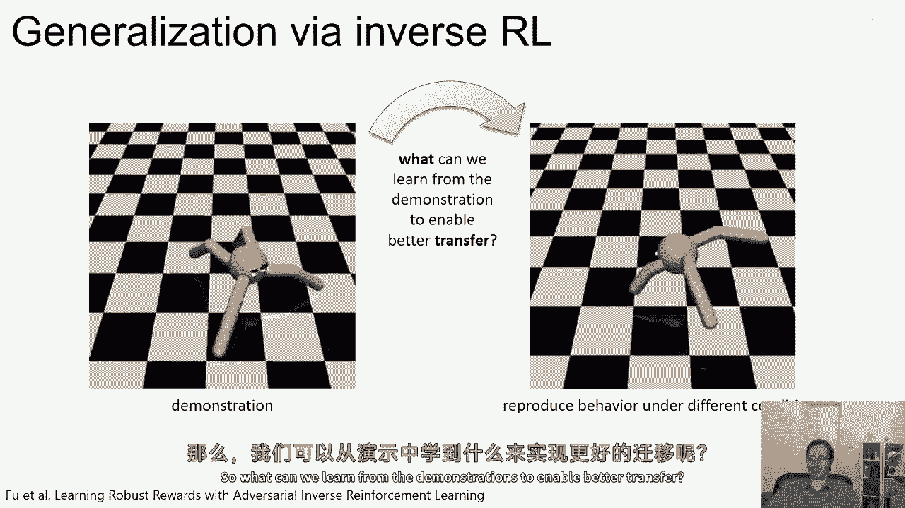

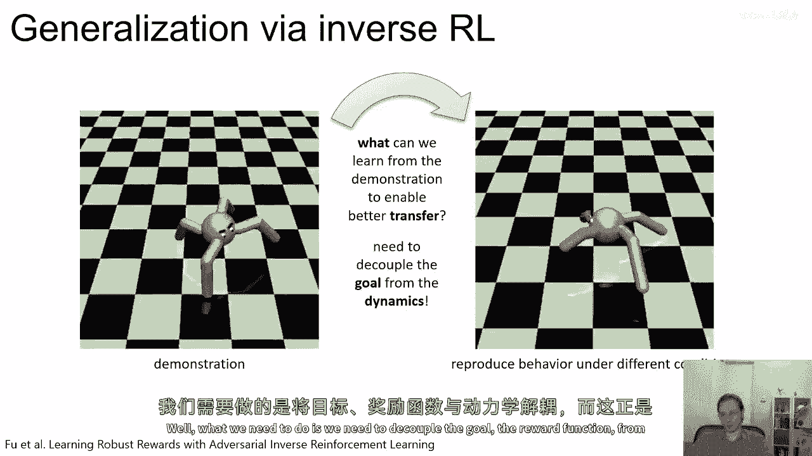

此时，我们可以提出一个问题：为了连接GAN和逆向强化学习，我们使用了那种特殊的判别器。这有利于我们恢复可泛化的奖励函数。但如果我们不需要奖励函数，只想复制专家的策略呢？我们能否只使用一个普通的判别器？

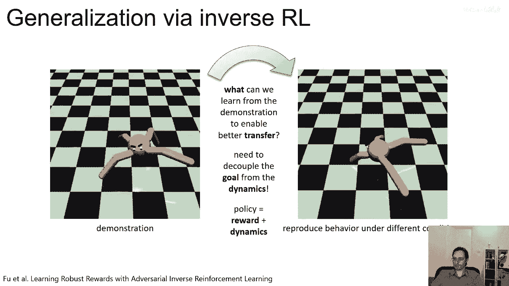

答案是肯定的。我们可以让判别器 `D` 只是一个普通的二分类神经网络（就像常规GAN一样），然后让策略最大化 `log D(τ)` 的期望，使其样本更难与演示区分。这个想法在一篇名为《对抗模仿学习》的论文中被提出。这个算法不再是一个逆向强化学习算法，因为它不恢复奖励函数，但它确实能恢复专家的策略，因此它是一种明确的模仿学习方法。

这种方法存在许多权衡：
*   **优点**：优化设置通常更简单，因为移除了复杂的部分。
*   **缺点**：收敛时的判别器本身不包含奖励信息，因此你无法在新的设置中重新优化奖励，但可以保证（如果一切正常）恢复专家的策略。

---

## 总结 📝

本节课我们一起学习了逆向强化学习与生成对抗网络之间的深刻联系。

我们可以将经典的逆向强化学习方法（如最大熵逆向强化学习）视为一种对抗性框架：策略试图最大化其样本的奖励，而奖励函数则试图最小化策略样本的奖励并最大化人类演示的奖励，同时学习一个使演示具有最大似然的轨迹分布 `p(τ)`。

生成对抗性模仿学习方法则使用一个分类器作为判别器，它试图给所有策略样本打上“假”的标签，给所有人类演示打上“真”的标签。然后策略使用 `log D(τ)` 作为其奖励进行优化。这两种方法本质相似，关键区别在于：
*   **逆向强化学习** 使用特殊形式的判别器，可以恢复一个可泛化的奖励函数。
*   **对抗模仿学习** 使用标准二分类器作为判别器，只能恢复策略，不能恢复奖励函数。

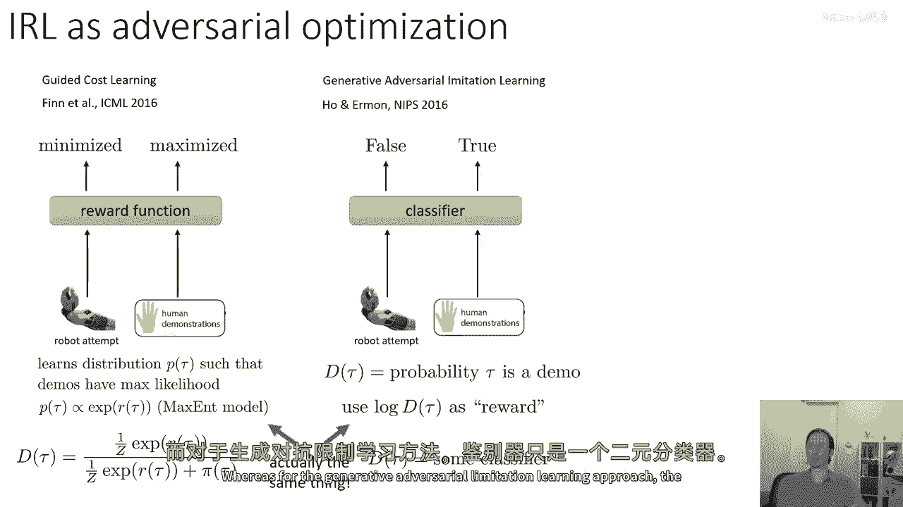

这些方法已被应用于多种环境，例如与聚类方法结合从异构演示中恢复多种行为模式，甚至从图像中进行模仿学习。

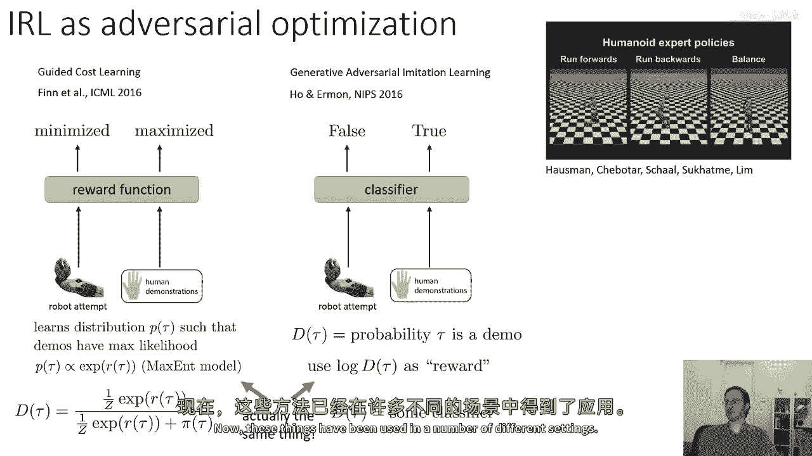

---

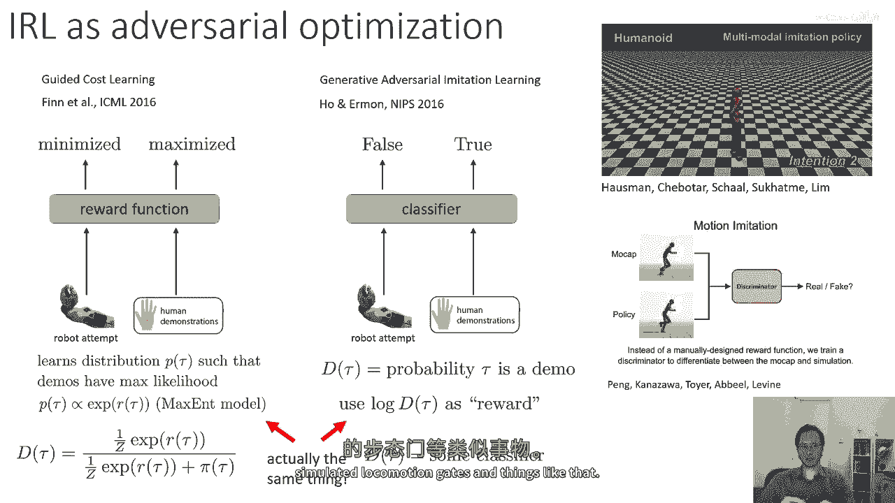

## 延伸阅读 📚

以下是一些关于逆向强化学习的重要论文：

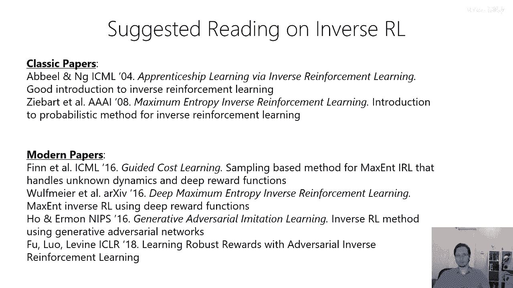

*   **经典论文**：奠定了逆向强化学习的基础。
*   **引导成本学习**：提出了将最大熵逆向强化学习扩展到高维深度学习设置的方法。
*   **深度最大熵逆向强化学习**：在小型表格领域使用深度网络执行逆向强化学习。
*   **生成对抗式模仿学习**：不执行逆向强化学习，但能恢复策略。
*   **使用对抗式逆向强化学习学习稳健的奖励**：专注于学习能够泛化的稳健奖励函数。