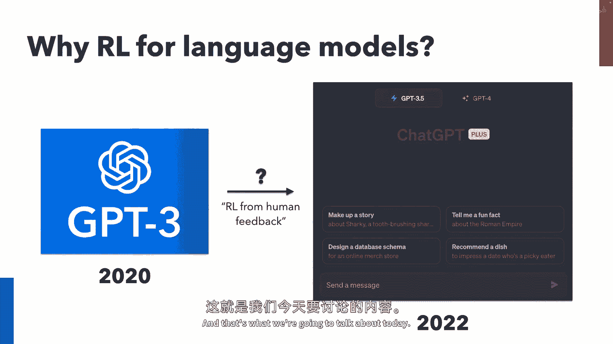
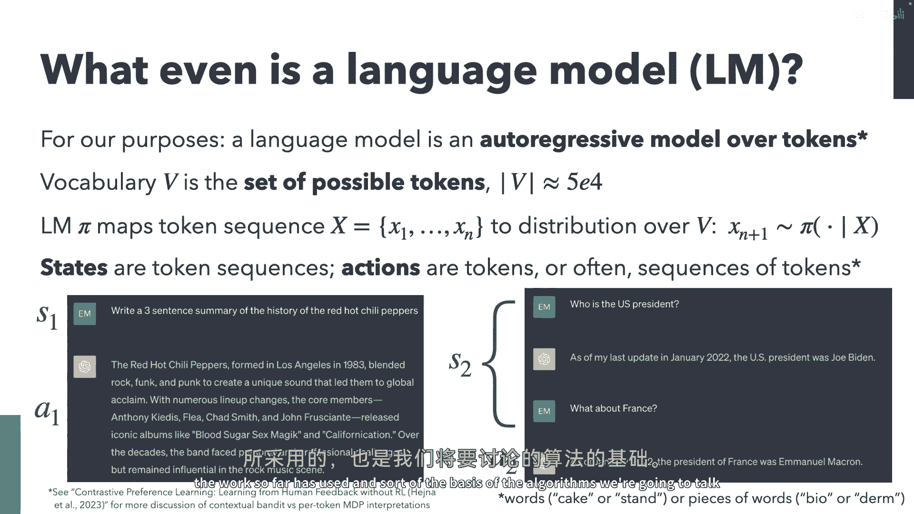
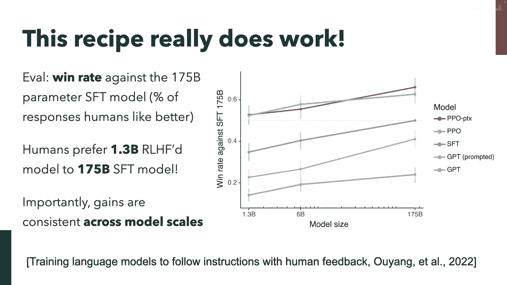
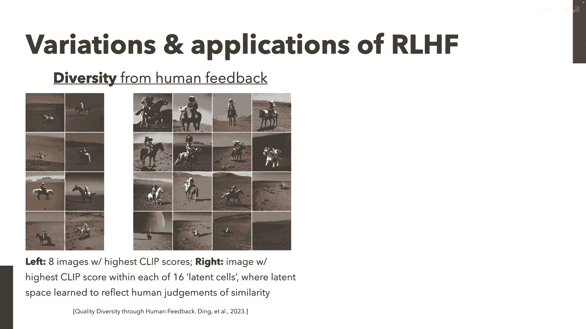
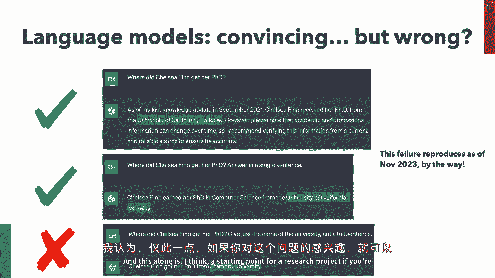
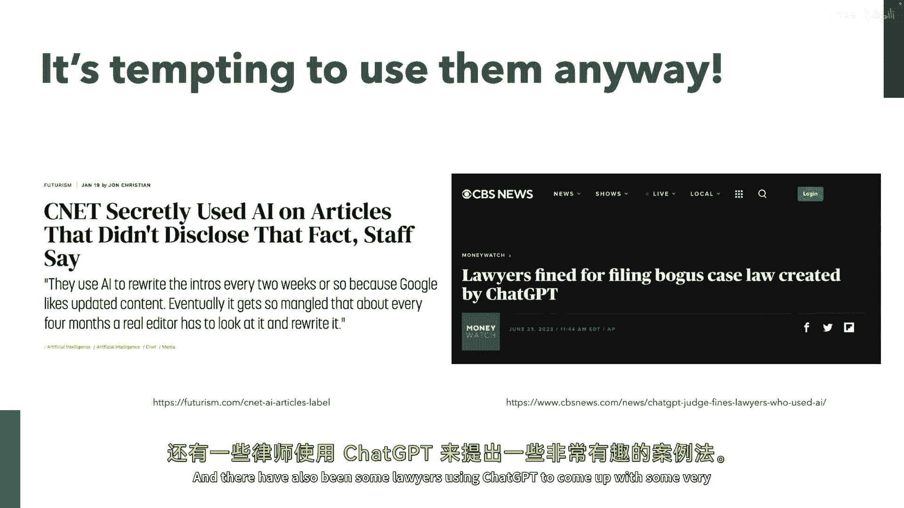
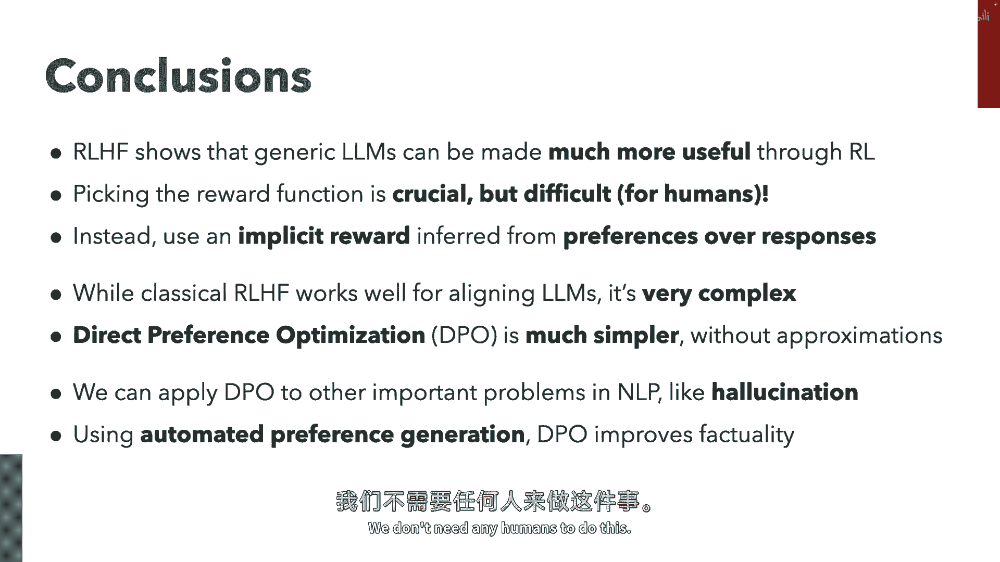
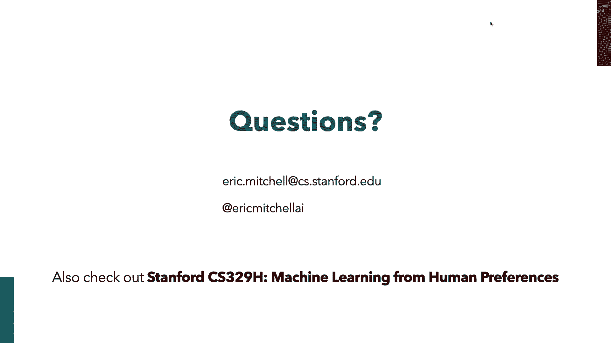

# 86：从人类反馈中强化学习 (RLHF) 与直接偏好优化 (DPO) 🧠🤖

在本节课中，我们将学习如何利用人类反馈来训练更强大、更符合人类价值观的语言模型。我们将从经典的“从人类反馈中强化学习”方法开始，然后深入探讨一种更简单、更高效的替代方案——“直接偏好优化”。

## 概述

大型语言模型，如GPT-3，通过海量文本的无监督预训练获得了强大的生成能力。然而，如何让它们生成更安全、更有帮助、更符合人类偏好的内容，是一个关键挑战。本节课将介绍两种核心方法：基于人类反馈的强化学习和直接偏好优化，它们构成了像ChatGPT这类模型训练流程的核心部分。

## 第一部分：从人类反馈中强化学习 (RLHF) 🛠️

上一节我们概述了课程目标，本节中我们来看看如何通过强化学习框架来利用人类反馈。

### 语言模型作为策略

对于我们的目的，可以将语言模型视为一个**自回归模型**，它根据已有的标记序列（状态）来预测下一个标记（动作）的概率分布。在RLHF的许多工作中，通常采用一种“上下文赌博机”的设定：给定一个提示（上下文），模型生成一个完整的回应序列（动作）。

### RLHF 标准流程

以下是实现RLHF的四个主要步骤：

1.  **无监督预训练**：在互联网级别的海量文本数据上训练一个基础语言模型（如GPT-3），目标是最简单的下一个词预测。这赋予了模型关于世界的知识。
2.  **有监督微调**：收集人类针对特定任务（如问答、对话）编写的优质回应示例，并用这些数据对预训练模型进行微调。这教会了模型“如何回应”的格式和行为。
3.  **奖励模型训练**：这是RLHF的核心。我们不再直接让人工编写完美答案，而是让人工进行更简单的**偏好判断**。
    *   从SFT模型生成的大量回应中，为每个提示采样两个回应。
    *   展示给人类标注者，让他们选择哪个回应“更好”。
    *   使用这些偏好数据训练一个**奖励模型**。该模型学习预测人类会偏好哪个回应。
4.  **强化学习微调**：使用上一步训练好的奖励模型作为优化目标，对SFT模型进行强化学习微调（通常使用PPO算法）。同时，需要添加一个约束，防止新策略偏离SFT模型太远，以避免过度优化到奖励模型不可靠的区域。

### 为什么需要RLHF？

你可能会问，既然有监督微调已经有效，为什么还需要复杂的RLHF？主要有两个原因：
*   **可扩展性**：让人工编写高质量的示例回应非常耗时。而让人工进行“A/B比较”则快速、简单得多，更容易扩大数据规模。
*   **超越人类**：如果目标是让模型在某些任务上超越人类水平，仅仅模仿人类行为（有监督学习）可能不够。通过偏好学习和强化学习，模型有可能探索并发现比人类演示更好的策略。

### 奖励模型与偏好建模

我们如何从简单的“偏好选择”中学习到一个连续的奖励函数呢？这里使用了经济学中的**布拉德利-特里模型**。该模型假设存在一个潜在的得分函数 `s`，人类选择回应 `y_w` 而非 `y_l` 的概率与两者得分之差相关：

`P(y_w > y_l) = σ(s(y_w) - s(y_l))`

其中 `σ` 是sigmoid函数。我们将得分函数 `s` 替换为带参数的奖励模型 `r_φ`，然后通过最大化人类偏好数据的似然来训练它。

### RLHF的挑战

直接优化学习到的奖励模型可能会出现问题，主要是**分布偏移**：奖励模型只在SFT模型产生的数据分布附近是准确的。如果策略优化得太远，进入奖励模型未曾见过或训练不佳的区域，奖励信号可能失效，导致模型生成无意义但奖励虚高的内容。因此，在RL优化中必须加入**KL散度约束**，以保持新策略与SFT模型的接近。

## 第二部分：直接偏好优化 (DPO) 🎯

上一节我们介绍了RLHF的完整流程，它虽然强大但非常复杂。本节中我们来看看一种能极大简化此流程的方法——直接偏好优化。

DPO的核心思想是：如果我们以一种特定的方式将奖励函数参数化，就可以绕过显式训练奖励模型和运行强化学习循环的步骤，直接从偏好数据中优化策略。

### 从RLHF目标出发

RLHF的优化目标可以表述为：

`max_π E_{x~D, y~π(·|x)} [r_φ(y|x)] - β * KL(π(·|x) || π_ref(·|x))`

即在最大化奖励的同时，最小化新策略 `π` 与参考策略 `π_ref`（通常是SFT模型）之间的KL散度。

### 关键洞见：奖励与策略的对应关系

对于上述约束优化问题，其最优解 `π*` 具有一个封闭形式：

`π*(y|x) = (1/Z(x)) * π_ref(y|x) * exp( (1/β) * r(x, y) )`

其中 `Z(x)` 是归一化常数。这个公式直观地告诉我们，最优策略会在参考策略概率高且奖励也高的回应上分配更高的概率。

我们可以对这个等式进行变换，将奖励函数 `r(x, y)` 用最优策略 `π*` 和参考策略 `π_ref` 表示出来：

`r(x, y) = β * log( π*(y|x) / π_ref(y|x) ) + β * log Z(x)`

### 构建DPO损失函数

现在，我们不再将奖励模型 `r_φ` 视为一个独立的神经网络，而是将其**参数化**为策略 `π_θ` 和参考策略 `π_ref` 的对数概率比：

`r_φ(x, y) = β * log( π_θ(y|x) / π_ref(y|x) )`

将这个参数化形式代入之前用于训练奖励模型的布拉德利-特里损失函数中，神奇的事情发生了：难以处理的归一化常数 `Z(x)` 被消去。我们得到了一个可以直接在策略参数 `θ` 上优化的损失函数——**DPO损失**：

`L_DPO(π_θ; π_ref) = -E_{(x, y_w, y_l)~D} [ log σ( β * log( π_θ(y_w|x) / π_ref(y_w|x) ) - β * log( π_θ(y_l|x) / π_ref(y_l|x) ) ) ]`

### DPO的优势

*   **简单性**：只需一个损失函数，一次前向/反向传播，无需复杂的RL训练循环（如PPO中的价值函数、多轮采样等）。
*   **稳定性**：训练过程更稳定，超参数（如 `β` ）与最终策略的KL散度有更可预测的关系。
*   **高效性**：计算成本显著低于RLHF。
*   **理论保证**：在给定的偏好数据下，DPO优化得到的最优策略与通过奖励模型进行RL优化得到的最优策略是**完全一致**的。

### DPO的梯度解读

DPO损失的梯度揭示了其工作原理：

`∇_θ L_DPO = -β * E_{(x, y_w, y_l)~D} [ σ( r_φ(x, y_l) - r_φ(x, y_w) ) * ( ∇_θ log π_θ(y_w|x) - ∇_θ log π_θ(y_l|x) ) ]`

这可以理解为：
1.  **增加偏好回应的概率**：梯度会推动策略增加人类偏好的回应 `y_w` 的概率。
2.  **降低非偏好回应的概率**：梯度会推动策略降低人类不偏好的回应 `y_l` 的概率。
3.  **自适应加权**：权重项 `σ( r_φ(x, y_l) - r_φ(x, y_w) )` 是模型当前对偏好判断的“不确定度”。当奖励模型已经能很好地区分好坏回应时（即 `r_φ(x, y_w) >> r_φ(x, y_l)`），该权重趋近于0，训练会自动减弱对该样本的关注，防止过拟合。

## 第三部分：应用实例——提升模型事实性 📈

上一节我们学习了DPO这一强大工具，本节中我们来看看它的一个实际应用：改善语言模型的事实准确性（减少幻觉）。

### 问题：模型的事实性缺陷

现有的语言模型，即使经过RLHF训练，也经常会产生与已知事实不符的“幻觉”内容。这是因为：
*   **预训练数据混杂**：模型从互联网上学到的知识本身包含大量不准确或矛盾的信息。
*   **人类反馈的局限**：在RLHF中，人类标注者更擅长判断回应的“有用性”、“无害性”，但很难快速、准确地判断复杂陈述的“事实性”。人们更倾向于偏好与自己观点相符或听起来令人信服的回应。

### 解决方案：基于AI反馈的DPO

既然人类不擅长提供事实性偏好，我们可以利用**AI本身**来生成这些偏好数据：
1.  对于一个提示，让模型生成多个候选回应。
2.  使用一个**事实性核查工具**（例如，基于检索的验证器，检查回应中的陈述是否与维基百科等可靠来源一致）为每个回应打分。
3.  根据分数高低，构建“更事实” vs “更不事实”的回应对，形成一个**自动生成的偏好数据集**。
4.  使用这个数据集和DPO方法，对模型进行微调，优化其事实性。

实验表明，这种方法能有效减少模型回应的错误事实数量，同时增加正确事实的数量。而标准的RLHF流程在此任务上提升并不明显，因为它依赖的人类偏好并未强烈指向事实性。

## 总结 🎓

本节课中我们一起学习了如何利用人类（或AI）偏好来对齐和提升大型语言模型：

1.  **RLHF** 提供了一个强大的框架，通过人类偏好比较来学习奖励模型，进而用强化学习优化策略。它使模型行为更符合人类价值观，但流程复杂。
2.  **DPO** 是对RLHF的优雅简化。它通过奖励与策略的数学对应关系，绕过了显式的奖励模型训练和RL循环，能直接从偏好数据中优化策略，更简单、稳定、高效。
3.  **应用**：我们可以将DPO与自动生成的偏好数据（如基于事实核查的偏好）结合，针对性地改进模型的特定能力，例如提升其生成内容的事实准确性。

核心的启示是：**偏好比较是一种强大且可扩展的监督信号**。无论是来自人类还是AI，它都为我们训练更安全、更可靠、更强大的AI系统提供了关键路径。DPO等新方法正在让这一过程变得更加易于实施和迭代。