# 88：序列模型与语言模型在强化学习中的应用 🧠

在本节课中，我们将要学习如何处理部分可观察的强化学习问题。我们将探讨当环境状态无法被完全观测时，传统的强化学习方法会遇到哪些挑战，并介绍如何使用序列模型（如RNN、LSTM、Transformer）来构建能够处理观察历史的智能体策略。

---

## 部分可观察性：从MDP到POMDP

上一节我们介绍了标准的马尔可夫决策过程。本节中我们来看看当环境无法被完全观测时会发生什么。

在课程开始时我们看到，除了完全可观察的MDPs，我们还可以考虑部分可观察的MDPs。在环境中我们只能获取有限的观察数据。这就是我们开始思考序列模型在强化学习中应用的起点。

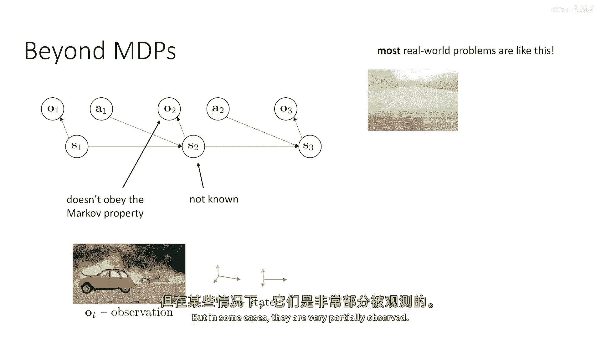

观察的问题在于，与我们一直使用的马尔可夫状态不同，观察值不遵守马尔可夫性质。这意味着仅从当前观察，你不一定拥有足够的信息来推断环境的完整状态。这意味着过去的观察实际上可以为你提供更多信息。这与马尔可夫状态的情况相反，在马尔可夫状态中，如果你观察当前状态，那么过去的状态无法为你提供更多信息来预测未来，因为当前状态将未来与过去分离。

当你处理部分观察时，状态是未知的。在大多数情况下，你甚至没有状态的表示。所以你不知道当前的状态是什么，你甚至不知道状态的数据类型是什么。

总结一下我们在课程开始时讨论的关于部分可观察性的内容：假设环境是猎豹追逐羚羊，但你的观察是场景的图像。那个观察基于某种真实的状态，例如动物的位置、动量和身体配置。那个状态完全描述了系统的配置。如果你知道当前状态，它就告诉你一切，这意味着你可以预测未来。这不意味着未来是确定的，它可能仍然是随机的。它只意味着过去的状态不能有助于你预测那个未来，如果你已经有一个当前状态。

但如果你只有观察，那么观察可能不全面。也许有一辆车在猎豹前面行驶，所以你看不到它。状态实际上并没有改变，但现在的观察并不包含足够的信息来推断当前状态。如果你看之前的观察，你现在可能会获得更多的信息。

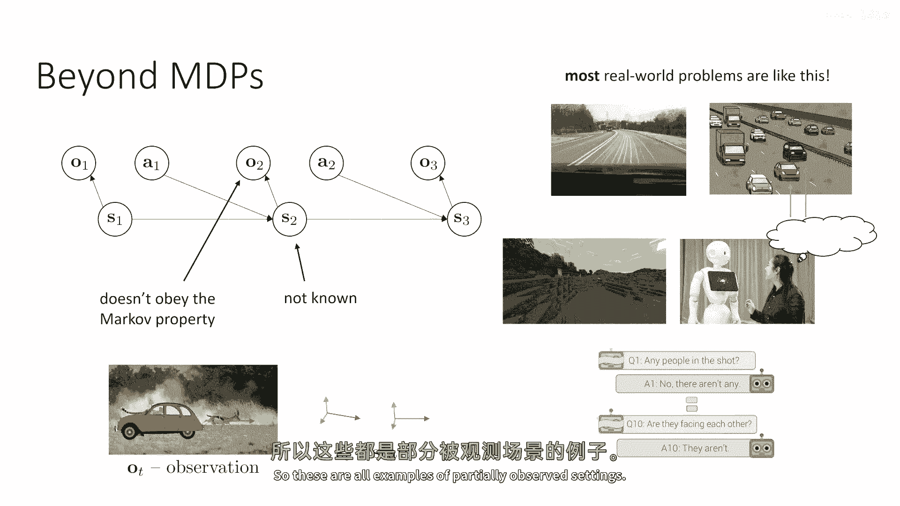

问题是大多数现实世界问题都像这样。很多我们讨论的算法都假设你有一个完整的状态。并不是所有的算法都这样，我们会在下一秒讨论这个问题。但是，大多数现实世界的问题实际上并没有给你一个完整的状态。在现实世界中，实际上存在一种程度的部分可观察性。所有问题都是部分可观察的。你永远不会真正得到系统完整的配置。

但是，有时部分可观察性是如此之小，以至于实际上你可以假装观察是一个状态，一切都会顺利进行。例如，雅达利游戏就是这样的。在许多雅达利游戏中，即使它们从技术上是被部分观察的，因为系统的状态就像雅达利模拟器的RAM，实际上，图像几乎包含了所有必要的信息。但在某些情况下，它们被观察得非常部分。

例如，如果你正在驾驶汽车，你可能在你的盲点中有另一辆车辆。对于这辆红色汽车，你可能看不到蓝色汽车或卡车，但它们对它的未来状态非常相关。所以这些是真正意义上的部分可观察性情况。

如果你正在玩一款以第一人称视角的视频游戏，游戏中可能会有很多与你过去所见的事物密切相关的事情。为了有效地玩这个游戏，你需要记住的事情非常重要，但在当前的观察中你不能看到。

另一个部分可观察性极其重要的设置例子，是与其他代理互动。如果你有一个应该与人类互动的机器人，人类的心理状态实际上是状态的未观察部分。所以你可能会观察到他们说或做什么，但你不一定能观察到他们在心中想的是什么，他们的欲望是什么，他们的偏好是什么，他们从交互中想要得到什么。这是一个非常复杂的部分可观察性实例。

部分可观察性的另一个例子是对话。如果你的观察是文本字符串，这可能是用于人类交互的。它也可能是你在与一个基于文本的游戏或类似的东西交互，或者是甚至像Linux日志这样的工具。在这种情况下，交互的历史真的很重要，而且只是当前的短语，像你最后看到的词，它本身并不能传达出所有的信息。所以现在这些都是部分观察的设置示例。

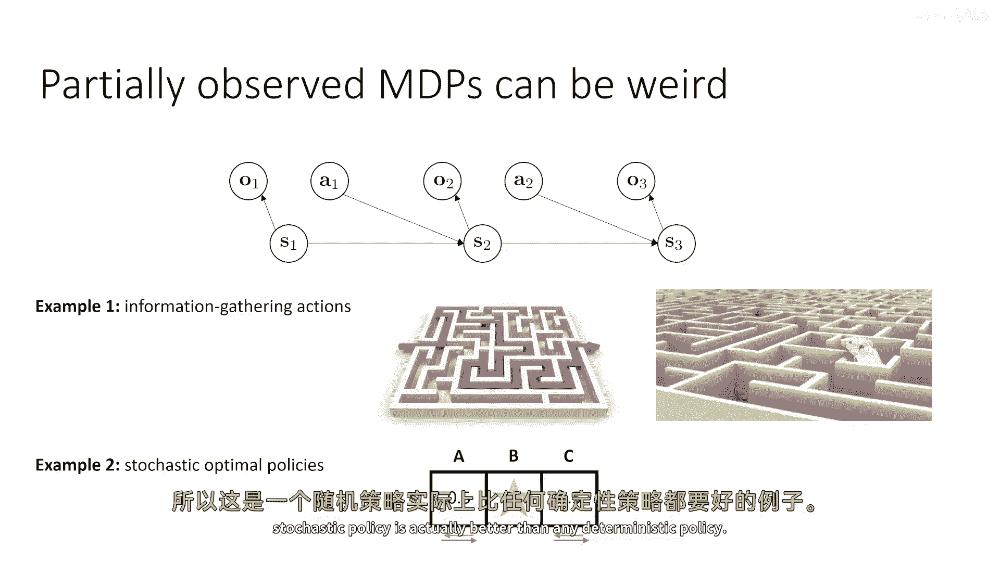

---

## POMDP的独特挑战

上一节我们了解了什么是部分可观察性。本节中我们来看看部分可观察的MDPs会带来哪些独特的挑战。

部分观察的MDPs可以真的很奇怪。我们可以通过简化使它们不那么奇怪，但如果我们简单地对待它们，在部分观察的MDPs中，有很多事情发生，在完全观察的MDPs中这些事情根本不能发生。

以下是部分可观察MDP中可能出现的两种独特现象：

*   **信息收集动作**：在部分可观察性下，可能最优的是做一些本身不会导致更高奖励的事情，但会给你更多的信息关于奖励可能所在的地方。例如，如果你正在穿越迷宫，如果你只是把它当作一个完全可观察的任务，也许你的状态是迷宫中的位置，然后你只需要在这个迷宫上运行RL，直到你解决这个迷宫。最优的行动总是朝着出口移动。但如果你想解决一个迷宫的分布，所以你在试图得到一个可以解决任何迷宫的策略，现在是一个部分可观察的问题。如果你看不到整个迷宫从开始，如果你只是得到一个第一人称视图，因为现在未观察到的状态是你所在的迷宫配置。在这种情况下，实际上，可能最优的是像窥视迷宫的顶部一样，并尝试观察所有的交叉点，尽管这个信息收集行动本身并没有使你更接近出口。所以，信息收集行动是在有效策略中涌现出来的，而在完全观察到的MDP中，永远不会涌现出来。
*   **随机最优策略**：部分观察到的MDP可能会导致随机的、最优的策略，而在完全观察到的MDP中，总是存在一个确定的策略是最优的。这不意味着所有有效的策略都是确定的，可能会有一个同样好的策略是随机的。但在完全观察到的MDP中，你永远不会陷入只有随机策略最优的情况。而在部分观察的MDP中，这实际上是可能的。

这里是一个非常简单的例子：假设你有一个三状态MDP，你可以处于状态A，B或C。奖励只在状态B为+1。你在每个状态开始的概率是0.5在状态A，和在状态C。所以你有50%的可能性从左边开始，从右边开始。让我们假设你现在进行了部分观察，你观察中不含有任何信息。所以基本上在这种部分可观察的MDP中，因为你没有任何观察，你基本上只能承诺采取行动，要么是左边，要么是右边。

一个确定性的策略必须选择，要么是现在总是去左边，要么是总是去右边。如果它选择总是去左边，然后，如果它从状态C开始，它最终会到达好状态B；如果它从状态A开始，它永远不会到达状态B。如果它承诺总是向右走，然后，如果它从状态A开始，它会得到奖励，但如果它从状态C开始，它不会。由于这里的确定性策略必须依赖于观察，而且观察没有任何信息，唯一确定政策的选择是始终向左走，或者始终向右走。但如果你有一种左转或右转概率为五十五十的政策，那么无论它从A还是C开始，它最终都会到达B。所以这是一个例子，在这种情况下，随机政策实际上比任何确定政策都要好。

---

## 传统RL方法在POMDP中的表现

上一节我们看到了POMDP的独特之处。本节中我们来看看之前学到的RL算法中，哪些实际上能够正确处理部分可观察性。

现在我们必须对“正确处理”这个问题非常小心，因为它的含义是什么？我们会在一会儿讨论这个问题。但现在首先让我们回顾不同的方法。我会讨论三种方法，三种类方法：

1.  **策略梯度方法**：我们讨论的第一个方法，它构建了策略梯度的估计器，使用某种优势估计，使用我们之前见过的熟悉公式 `∇ log π`。
2.  **基于价值的方法**：例如Q学习。
3.  **基于模型的RL方法**：例如训练一个模型来预测下一个状态，给定当前状态和动作，然后通过该模型规划。

对于每种方法，一个天真的想法是：我们能否简单地取状态`s`，并将其替换为观察`o`？这是一个有效的事情可以做吗？

在我们开始回答这个问题之前，对于每种方法，我们都必须理解“处理部分可观察性”意味着什么，正确地处理意味着什么。花一点时间来思考这个问题：对于这种方法，你想要什么？假设它确实可以简单地替换状态为观察，你希望从这种工作正确的方法中得到什么？

在所有这些情况下，我们将试图获得一个政策，该政策考虑观察，而不是状态，并产生一个动作。如果我们的方法正在正确工作，我们期望得到的是可能的最佳政策，考虑到我们只能看到现在的观察。例如，在三个状态的例子中，最佳政策应该是左转或右转，概率各一半。这是现在最佳的无记忆反应性政策。当然，如果你得到一个有记忆的政策，你可以做得更好。但是现在我们只是提出问题：我们能在不改变策略类别（即限制策略只能查看当前观察）的约束下，得到最佳政策吗？所以“处理”意味着在无记忆政策类中找到最佳政策。

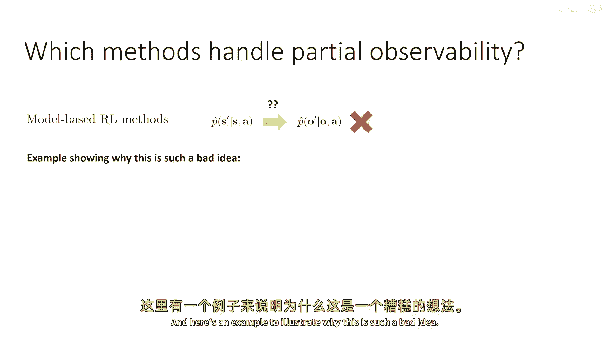

好的，所以对于这个“处理”概念，花一点时间思考我们是否能在无记忆政策类中得到最佳政策，使用观察替换状态来计算策略梯度时，是否正确？基于价值的方法和基于模型的强化学习呢？

让我们从讨论**策略梯度**开始。所以非常诱人地说，如果我们想要一个接受观察并输出行动的政策，让我们使用相同的 `∇ log π` 方程，并只是简单地替换 `s` 为 `o`，是否正确？

有趣的是，我们从课程开始对政策梯度的推导，从未实际上假设马尔科夫性质。它假设分布因子化，这意味着概率链规则的应用是可能的，但这总是真的。实际上并没有假设即将传递给政策的状态，分离过去和未来。所以使用 `∇ log π` 方程是完全可以的。

然而，优势估计器需要一些小心。因为有多种方式可以估计政策梯度的优势，其中一些可能会让我们陷入麻烦，而其他的一些是完全可以使用的。所以关键点是：优势是一个状态 `s_t` 的函数。优势并不一定是观察 `o_t` 的函数。优势不依赖于 `s_{t-1}`，但如果你没有状态，你可能会遇到麻烦。

*   使用 `r_t + V(s_{t+1}) - V(s_t)` 作为你的优势估计器，使用 `V` 的函数逼近器，是完全可以的，因为当你训练 `V` 作为状态的函数逼近器时，你基本上是利用每个看到状态 `s` 时，我们预期会得到相同值的属性，无论你是如何到达状态 `s` 的。所以 `V` 只需要是当前状态的函数。它不需要考虑过去的状态，因为马尔科夫性质告诉我们，值只取决于当前状态。
*   当然，这对观察来说并不成立。所以你不能简单地替换 `V` 的参数并替换 `s_t` 为 `o_t`。因此，训练 `o_t` 的 `V` 是不被允许的，因为值可能取决于过去的观察。因为当前的状态可能取决于过去的观察。这意味着，如果你打算使用政策梯度，如果你使用常规蒙特卡罗估计（如果你只是简单地插入奖励的总和），这是可以的，因为那个推导实际上没有使用马尔科夫性质。但如果你试图插入一个值函数估计器，这不再被允许，因为那个值函数估计器对于优势函数的值函数，是一个状态和状态的函数，状态依赖于过去的观察，因此这种估计器是不被允许的。

现在，作为一个小测验：在我们开始谈论值函数估计器和基线之前，我们学习了什么？我们所学到的所有东西，我们都可以简单地取那些乘以 `∇ log π` 的奖励，并使用因果关系技巧来乘以 `∇ log π`，与从 `t` 到结束的总奖励相乘，而不是从 `1` 到结束。所以，当你有部分可观察性时，使用因果关系技巧是否被允许？

答案是这实际上是完全可以的，因为因果关系技巧也没有使用马尔科夫性质。它只是使用了未来不会影响过去的属性。未来不会影响过去，即使你在部分可观察性下行动。所以这实际上是可以做的。而且，实际上，它可以通过证明 `∇ log π` 的预期值，乘以过去的时间步奖励实际上平均为零，就像它对待状态一样。

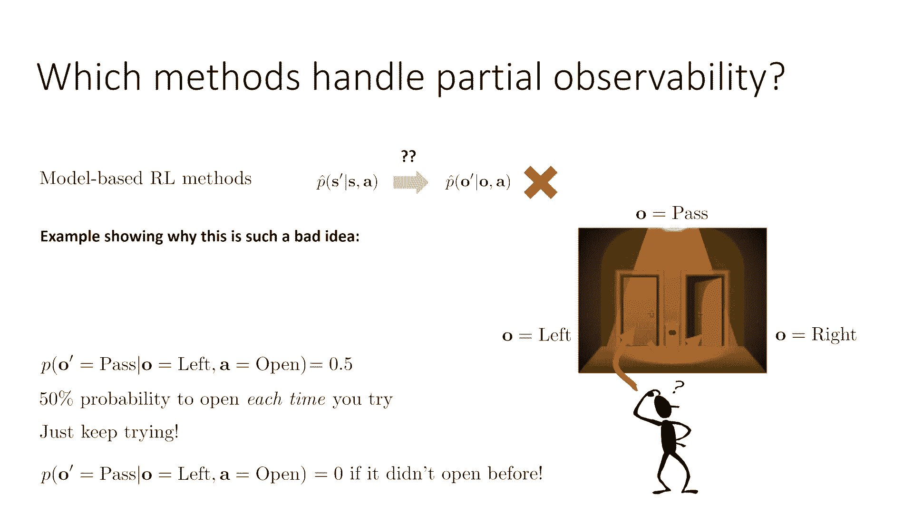

不能做的是使用 `V̂` 作为优势估计器。你可能也会考虑是否允许使用 `V̂` 作为观察值的函数，作为基线。结果发现，这也实际上是可以的，出于简单的原因：我们可以使用任何我们想要作为基线，并且估计器仍然是无偏的。这可能是因为使用只依赖于观察作为基线的价值函数，可能不会减少我们想要的方差，但它总是无偏的，仅仅因为所有基线都是无偏的，无论它们是什么。

所以**策略梯度**的简短版本是：它们可以使用，但你必须小心那个优势估计。

关于**基于价值的方法**：我们可以简单地取，例如，Q学习更新规则，天真地替换状态为观察，那样实际上会给你最佳的无记忆策略吗？

这里的答案遵循与前一张幻灯片相同的逻辑，因为同样的原因，它不能被接受。使价值函数仅依赖于观察，同样的事情使得使 `Q` 函数仅依赖于观察不被接受。基本上，Q学习依赖于假设：每次你访问状态 `s`，无论你怎么到达那里，你的价值对于所有不同的行动都是一样的。这在你有马尔科夫状态时绝对是真的，但这对于观察并不成立。因为如果你观察到一个给定的观察值 `o`，你为不同行动的价值可能会依赖于之前的观察值。所以它可能会依赖于你怎么到达那里，而且实际上这使得Q学习规则无效。所以基于价值的方法在没有马尔科夫属性的情况下不工作。你根本不能天真地用观察替换状态。

当然，如果观察本质上是一个马尔科夫状态，就像大多数雅达利游戏一样，这可以足够接近，结果可能会很好。但在一般情况下，你有越多的部分可观察性，这最多会工作得越差。一个非常明显的方式来看这一点是，要注意从 `Q` 函数中提取策略的方式是取行动，与总是确定的策略值最大的行动。但我们之前看到，POMDPs有时可以有随机最优策略。因为Q学习从未产生随机策略，存在一个没有任何可能它产生最优策略的情况。例如，在那个包含三个状态的MDP中，随机策略更优。

关于**基于模型的强化学习方法**：我们能否简单地将 `o` 替换为 `s` 在我们的预测模型中，然后得到正确的答案？结果是非常否定的。

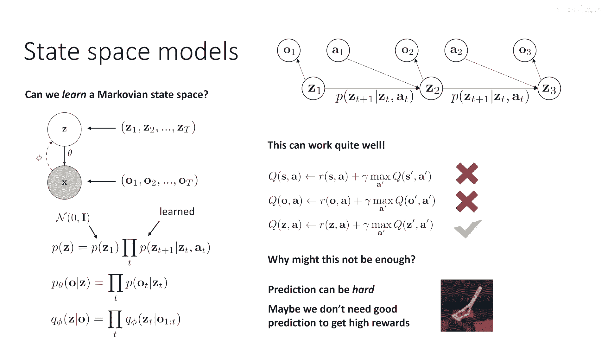

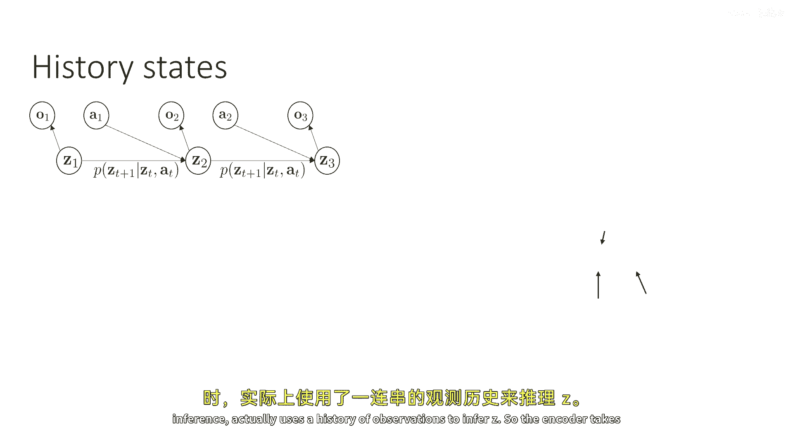

这就是为什么这个想法如此糟糕的一个例子：

假设我们有以下环境：我们有两扇门。我们开始在一个我们将要接近这两扇门的状态中。我们将尝试那扇门。如果它是锁的，我们应该尝试另一道门。哪扇门是锁的还是开的，将是随机的。所以状态的一部分是哪扇门是锁的还是开的。你不能观察那个状态，你只看到你站在左边的门前，站在右边的门前。所以它是一个部分观察的问题。你不知道你现在尝试它时才能观察哪扇门是锁的还是开的。

这里有一个最佳策略，甚至是一个无记忆的策略。如果你站在门前，你应该首先尝试它，然后继续下一个。或者如果你必须无记忆，并且你不允许记住，如果你尝试了门，随机决定是否切换到不同的门，或尝试块。就像在三个状态示例中一样。

所以有实际解决这个问题的方法，即使你不能记住你以前做了什么，也不能观察门是否锁住。假设你有在左边门的观察，从在右边门的观察，当你通过门的观察。然后你想要训练模型。所以模型将预测：你到达过去观察的概率是多少？你通过门的观察，给定你当前的观察是左边门，你的行动是打开。

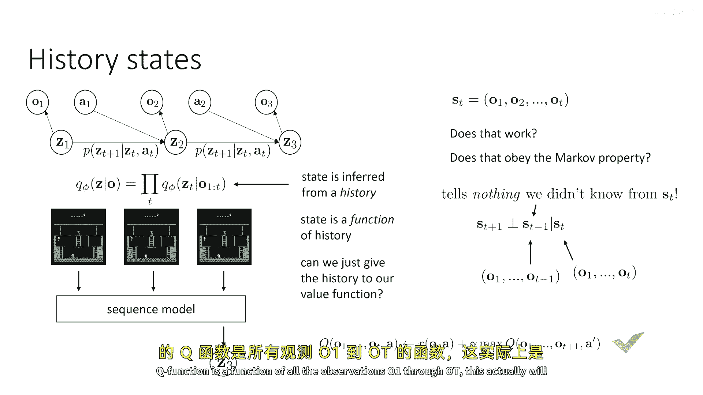

假设在每个episode中每扇门有50%的机会解锁。所以百分之五十的机会左边是解锁的，百分之五十的机会右边是解锁的。它们是互斥的，所以你总是翻一个硬币并解锁左边或右边的门。所以有一半的episode你将通过。如果你没有通过半数的集数，这就意味着如果你试图实际估计这些概率，如果你试图训练模型，你会得到一个概率为0.5。

但是，什么是，什么是一个好的策略？如果开门的概率是0.5，如果你每次尝试都有50%的概率打开门，这就是这个模型实际上试图要代表的。那么你只需要反复尝试就能通过门。如果每次独立尝试的成功率都是50%，如果你只是继续尝试门，最终你会通过它。

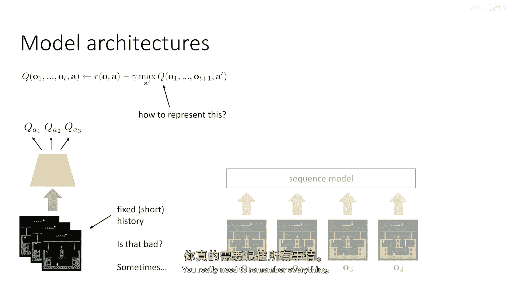

但是，当然这不是世界工作的方式。如果你尝试了左边的门但它没有解锁，这是因为门被锁了。无论你尝试多少次，它都会保持锁定。但是，这个马尔科夫模型仅仅无法代表这一点。它无法代表如果你之前尝试过门，那么它就不会解锁，如果你再次尝试，因为它的概率只与当前观察有关。而且你当前正在采取的行动并不依赖于这个模型中之前的行动。所以，这个马尔科夫模型根本不能直接用于非马尔科夫观察，因为它会导致这些荒谬的结论：如果你一直试图锁门，最终它会解锁。

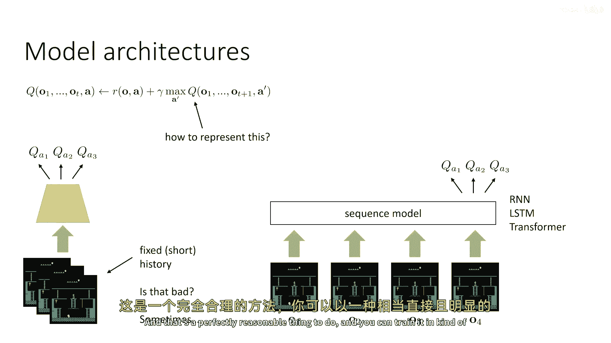

问题是模型的结构，仅仅不匹配环境的结构。在现实中，如果你在门打开之前没有尝试过，那么通过的概率实际上是零。但是，你不能用这个模型来表示它，因为模型不输入过去的观察和行动。

---

## 超越无记忆策略：使用序列模型

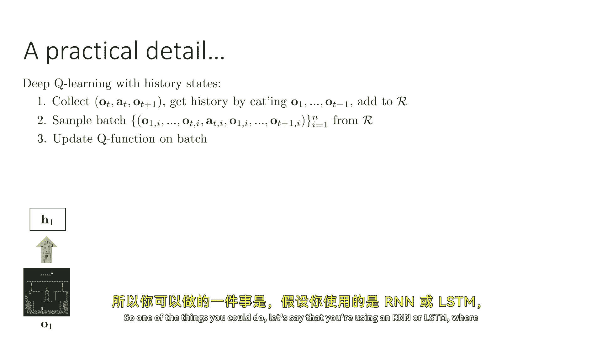

上一节我们看到，天真地将观察替换状态在很多方法中行不通。本节中我们来看看如何通过使用记忆来构建更好的策略。

到现在为止，我们谈论了无记忆策略。但是，当然，这是一个相当人为的限制，尤其是门例子，希望在现实中展示了这一点。如果你尝试门，你会记得你以前尝试过它，而且它没有锁定。所以你知道在未来要做些不同的事情。所以，当然，在实际应用中，如果我们想要解决部分可观察的马尔科夫决策过程，我们确实应该采用非马尔科夫策略，这些策略以观察历史作为输入。

我们可能有几种方法来处理这个问题。处理这个问题的一种简单方法是使用被称为**状态空间模型**的方法。所以，使用状态空间模型，我们实际上在做的是学习一个马尔科夫状态空间，仅给定观察。我们之前在讨论变分推断时看到过这种情况。

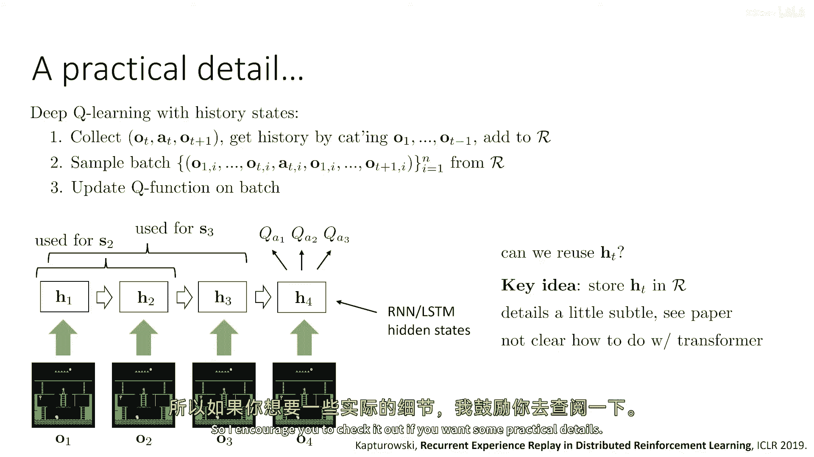

所以如果我们训练一个序列VAE，其中可观察的序列是观察序列的序列，并且隐藏状态是潜在状态的序列。其中我们可能有潜在空间的动态，初始状态的均值方差先验，并且有一些学习到的马尔可夫转移概率，以及一个观察概率，它模型观察分布的分布，给定当前隐藏状态。然后有一个编码器，将观察历史的序列编码为当前隐藏状态。这些实际上代表环境的马尔可夫状态。这可以实际上工作得很好。

所以如果你可以学习序列模型，就像我们在变分推断讲座中讨论的那样，如果你能学习这个，然后你可以实际上直接将潜在变量 `z` 替换为状态 `s`。所以你不能做 `s` 的事情因为你没有状态，你不能做观察的事情因为这是错误的，但你可以做它以 `z` 作为 `Q` 函数的状态输入。这实际上是有效的，因为我们训练模型以遵守马尔可夫性质，因为它们有马尔可夫动态。

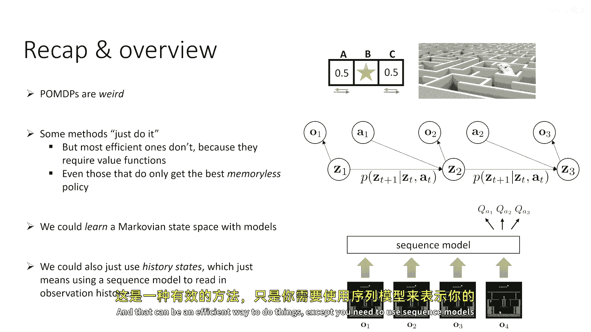

现在，为什么这可能本身不是一个解决所有问题的好方法？这是正确的，它是有效的，但是为什么可能不够好？原因在于在某些情况下，实际上训练这个预测模型是非常困难的。而且，在许多情况下，它并不必要能够完全预测所有有关观察才能使用RL。如果你能预测所有有关观察，例如，生成