# 89：使用序列模型与语言模型的强化学习 🧠

在本节课中，我们将学习如何将强化学习（RL）应用于语言模型。我们将从理解语言模型的基础开始，探讨如何将其形式化为一个RL问题，并介绍使用策略梯度训练语言模型的核心方法。课程将涵盖从人类偏好中学习奖励函数的技术，并讨论实际应用中的关键挑战与解决方案。

---

## 什么是语言模型？🤔

上一节我们讨论了如何使用序列模型处理部分可观察的RL问题。本节中，我们将转向另一个方向：探讨RL如何帮助我们更好地训练序列模型，特别是语言模型。

基础的语言模型是一种预测下一个标记（token）的模型。你可以大致将标记视为单词，尽管实际上它们更像是字符的组合。标记是自然语言的一种细粒度表示。

我们通常使用变换器（Transformer）来构建语言模型。其工作方式如下：

我们有一个标记序列 `S = [x0, x1, x2, x3, ...]`。在每个位置，我们有一个小型编码器将离散标记编码到连续空间，并加上位置编码（即标记在序列中的整数位置，如0, 1, 2, 3...）。这些表示被传递给掩码自注意力层（masked self-attention layer），这是一个可以基于之前时间步的表示来生成每个位置表示的变换器模块。然后，这些表示会经过一些位置上的非线性变换。这个自注意力块会被重复多次。最后，在每个位置，我们读取一个关于下一个标记的预测分布（通常是一个softmax输出）。

在第一步，我们输入 `x0` 并预测 `p(x1)`。如果我们正在进行解码生成，例如，我们从标记“我”开始，模型可能会预测下一个词“喜欢”，依此类推，最终生成一个完整的句子，如“我喜欢用MDP解决策略问题”。模型会输出一个特殊的序列结束标记来指示生成完成。

所以，这基本上就是一个Transformer语言模型。为了本课程的目的，你可以将Transformer简化为一个“黑盒”：它顺序读取标记，并预测下一个标记。在每一步 `t`，它都在建模给定之前所有标记 `x1` 到 `x(t-1)` 的条件下，`x_t` 的分布 `p`。通过从这个分布中重复采样，你最终会得到一个句子。

**注意**：这个模型不是马尔科夫的，每个标记都依赖于所有之前的标记。像GPT、Bard、Claude等众所周知的系统都是语言模型的例子。它们本质上都是在生成语言标记：你提供提示（prompt）标记，它生成响应标记。

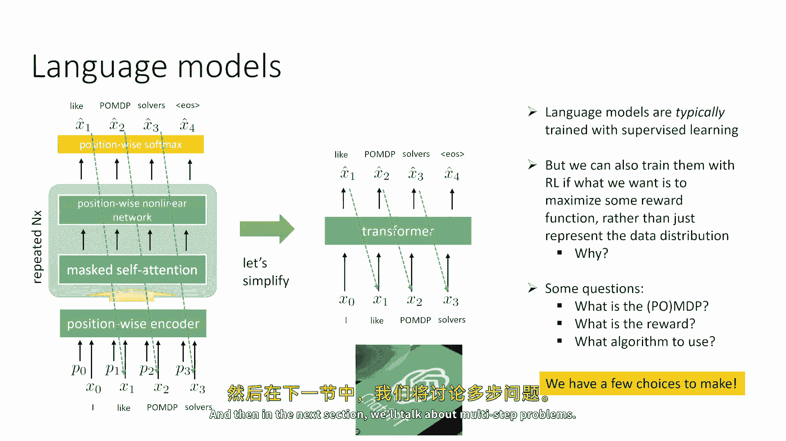

---

## 为什么用RL训练语言模型？🎯

我们可以使用RL进行训练，如果我们想要的不仅仅是匹配训练数据的分布。也就是说，我们不仅希望模型输出在训练数据中看到的同类文本，还希望它能最大化某个奖励函数。这在许多场景中都是非常理想的。

例如：
*   你可以使用RL让语言模型满足人类偏好，生成人们喜欢的文本类型。
*   你可以使用RL让语言模型学习如何使用工具，例如调用数据库或计算器。
*   你可以使用它来训练能够更好地与人类对话并实现对话目标的模型。

这些目标都超越了单纯的监督学习，需要RL的介入。

---

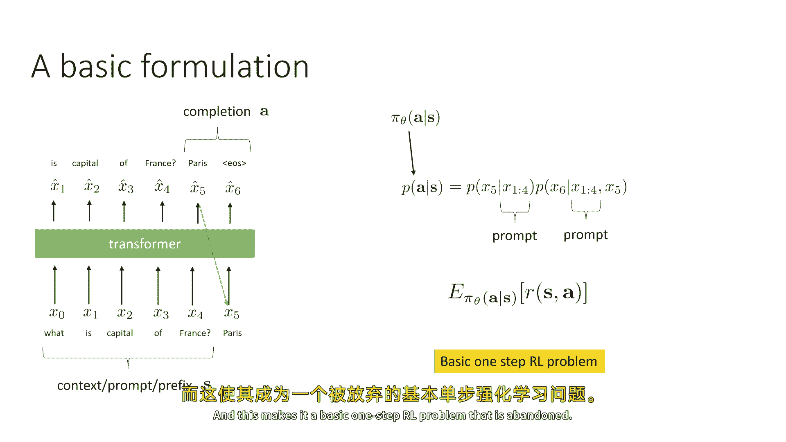

## 将RL应用于语言模型：核心问题 ❓

要将RL应用于语言模型，我们需要回答几个问题：与语言生成任务对应的MDP（或POMDP）是什么？MDP由状态、动作、奖励和转移概率定义，我们需要为语言生成任务选择这些元素。

有一些直观的对应关系：生成语言标记可能对应“动作”；最大化用户偏好可能对应“奖励”。但具体实现需要一些有趣的设计决策。我们需要决定奖励是什么，以及应该使用哪些算法。我们在之前的课程中学习过一些可以处理部分可观察性的算法，有些适用于离线策略，有些适用于在线策略，我们必须做出选择。

---

## 单步（Bandit）RL问题 🎲

让我们从RL训练语言模型中最常见的应用开始，有时被称为“单步问题”。例如，ChatGPT的早期训练就采用了这种方法。下一节我们再讨论多步问题。

基本形式如下：我们有一个提示（prompt），例如“法国的首都是什么？”。Transformer模型会预测一个“完成”（completion）。它不预测提示本身的标记，而是预测其后的内容。例如，它可能预测“巴黎”，然后在下一个时间步预测序列结束标记。在大多数应用中，语言模型是完成句子，而不是从头生成。

因此，我们可以说：
*   **动作 `a`**：由完成部分的标记序列表示（例如，“巴黎”和“序列结束标记”）。通常，这可能是可变数量的标记。
*   **状态 `s`**：由提示或上下文表示。
*   **策略 `π_θ`**：我们的语言模型，它表示给定状态 `s` 下动作 `a` 的概率 `p(a|s)`。由于动作包含多个标记，这个概率是各个标记生成概率的乘积。

这里有一个需要注意的关键点：现在存在两种“时间步”概念，这可能会造成混淆。
1.  **语言生成时间步**：标记 `x1, x2, x3...` 的生成顺序。
2.  **RL时间步**：对于RL算法而言，这实际上是一个**单步**（one-step）或**老虎机**（bandit）问题：智能体观察一个状态（提示），然后产生一个动作（完整的回答）。

对于RL目的，这里实际上只有一个时间步。我们定义了状态、动作和策略，现在可以定义目标：最大化策略的期望奖励，就像在常规RL中一样。这就构成了一个基本的单步RL问题。

---

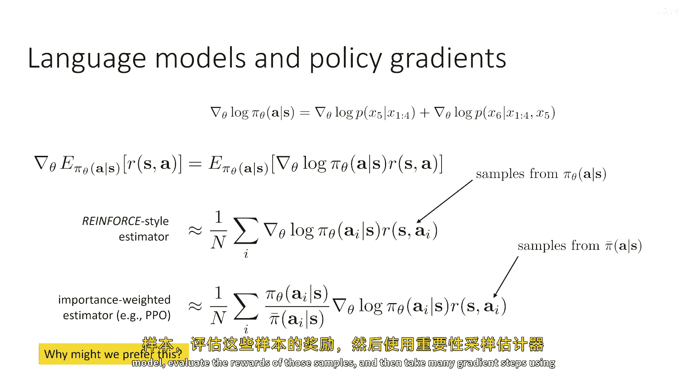

## 使用策略梯度训练 🚀

让我们从最简单的RL算法——策略梯度开始。

我们的目标是最大化期望奖励 `J(θ) = E_(a∼π_θ(·|s)) [R(s, a)]`。

我们知道其梯度公式为（来自策略梯度课程）：
`∇_θ J(θ) = E_(a∼π_θ) [∇_θ log π_θ(a|s) * R(s, a)]`

由于 `π_θ(a|s)` 是各个完成标记概率的乘积，`log π_θ(a|s)` 的梯度就是各个标记对数概率梯度之和。这与使用交叉熵损失进行反向传播时计算的梯度类型完全相同。

我们可以用样本来估计这个梯度：
*   **标准强化学习估计器**：从当前策略 `π_θ` 中采样一个完成 `a`，评估其奖励 `R(s, a)`，然后使用评分函数估计器。
*   **重要性采样估计器**：从另一个策略 `π_bar`（例如，旧的策略或监督训练得到的策略）中采样完成，然后使用重要性权重来为当前策略 `π_θ` 计算梯度估计。

以下是两种估计器的对比：
*   第一种是强化学习风格的估计器。
*   第二种是重要性加权估计器。

对于语言模型，**重要性加权估计器要流行得多**。你可以思考一下原因。

重要性加权估计器在语言模型中更受欢迎的原因是：从语言模型中采样需要相当长的时间，并且评估这些样本的奖励可能非常昂贵（例如需要人类反馈）。因此，我们非常不希望每次执行梯度更新时都生成新样本。

所以实际上，更常见的做法是：从语言模型中生成一批样本，评估这些样本的奖励，然后使用重要性采样估计器进行**多次**梯度更新，然后重复这个过程。

---

## 具体算法与循环 🔄

让我们具体化这个重要性采样估计。我们将其简写为 `grad_hat`。注意，它是关于参数 `θ`、旧策略 `π_bar` 和一组样本的函数。

一种可行的做法是：
1.  为特定状态 `s`（实际上你会对许多状态进行此操作）采样一批完成（例如1000个）。
2.  评估每个完成的奖励。
3.  将 `π_bar` 设置为生成这些样本的策略（即旧策略）。
4.  进行一个内部循环（例如K次）：
    *   从这批样本中采样一个迷你批次（例如64个）。
    *   在该迷你批次上，使用 `grad_hat` 计算梯度并更新参数 `θ`。
5.  每隔一段时间，跳出内部循环，从更新后的模型 `π_θ` 中生成新的样本，用新策略更新 `π_bar`，然后重复整个过程。

这非常类似于经典的重要性采样策略梯度或PPO（近端策略优化）风格的循环。这是使用RL训练语言模型的一种非常流行的方法。

---

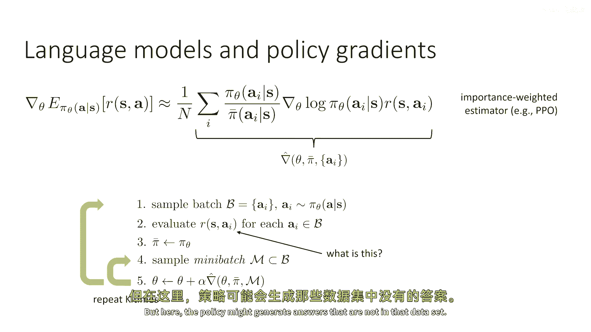

## 奖励从何而来？🏆

但这个循环中有一个大问题：**奖励 `R(s, a)` 从哪里来？**

例如，如果我们训练模型回答“法国的首都是什么？”这类问题，我们可能有一个包含标准答案的数据集。但我们的策略可能会生成不在数据集中的答案。我们需要一个奖励函数，能够评估**任何**可能答案的质量。

我们不仅需要知道“巴黎”是正确的（奖励+1），还需要能够评估“这是一个叫巴黎的城市”（基本正确但冗余，奖励+0.9）、“我不知道”（未提供信息，奖励-0.1）、“伦敦”（错误，奖励-1）甚至“你为什么问这么蠢的问题”（有害，奖励-10）。这是一个开放词汇的问题，因此我们需要一个非常强大的奖励模型。

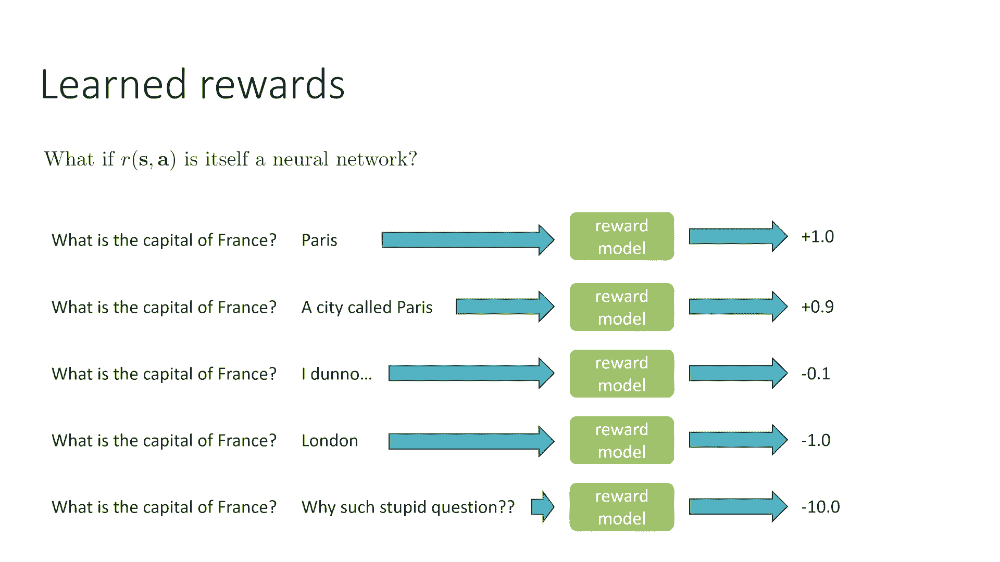

我们通常将奖励模型 `R_ψ` 表示为一个神经网络（参数为 `ψ`）。

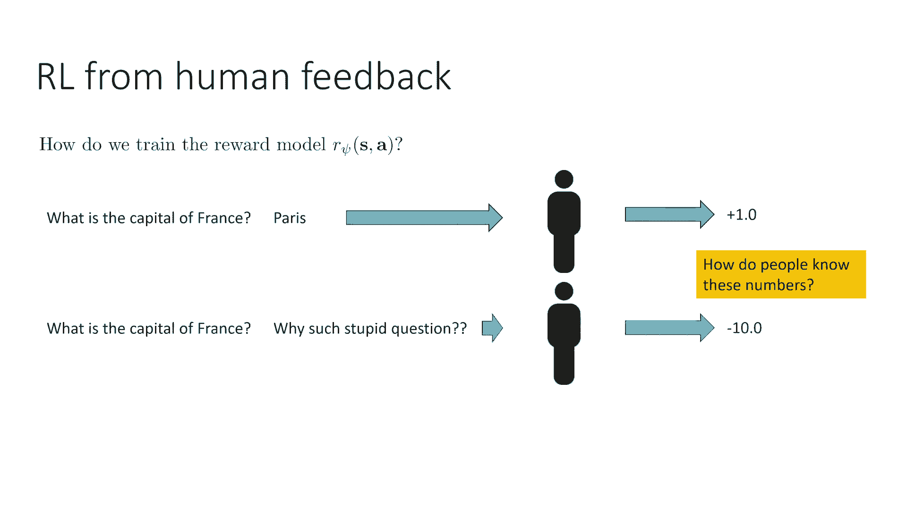

---

## 从人类偏好学习奖励函数 👥

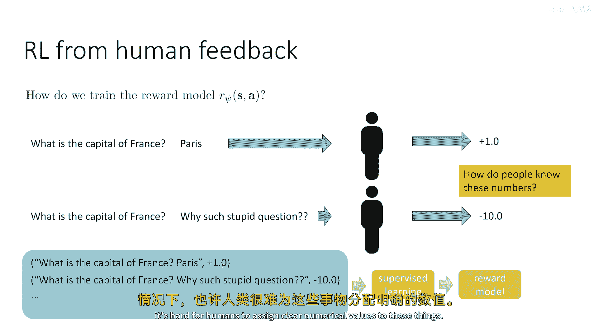

我们如何训练这个奖励模型 `R_ψ`？

1.  **直接标注数值**：收集可能的答案，让人类为每个答案分配一个数值分数，然后通过监督学习训练 `R_ψ` 来预测这个分数。但为高度主观的答案分配精确数值对人类来说可能很困难。
2.  **学习人类偏好**：对人类来说，**比较**两个答案通常更容易。例如，给定问题“法国的首都是什么？”，答案A是“巴黎”，答案B是“你为什么问这么蠢的问题”，人类可以轻松地说出更偏好A。

因此，我们可以利用这种**偏好比较**来训练奖励函数。我们不是训练网络直接预测数值，而是建模人类偏好一个答案胜过另一个的概率。

一个非常流行的选择是使用 **Bradley-Terry 模型**：
`P(a1 ≻ a2 | s) = exp(R_ψ(s, a1)) / [exp(R_ψ(s, a1)) + exp(R_ψ(s, a2))]`

其中，`P(a1 ≻ a2 | s)` 表示在状态 `s` 下，人类偏好答案 `a1` 胜过 `a2` 的概率。这个公式的直觉是：一个答案的奖励越高，它被偏好的概率就越大（按指数比例）。

现在，我们可以通过最大化人类表达偏好的对数似然来训练 `R_ψ`。这是一个明确的监督学习问题。这种方法可以扩展到两项以上的比较。

---

## 整体训练流程 📈

结合以上所有内容，一个完整的、从人类反馈中进行强化学习（RLHF）的流程如下：

1.  **监督微调**：在高质量指令-回答对数据集上对预训练的语言模型进行监督微调，得到初始策略 `π_θ`。
2.  **收集偏好数据**：对于数据集中的每个提示 `s`，从当前策略 `π_θ` 中采样 `K` 个可能的答案。让人类标注者对这些答案进行两两比较，指出他们更偏好哪一个。构建一个偏好数据集 `D`。
3.  **训练奖励模型**：使用偏好数据集 `D` 和 Bradley-Terry 模型训练奖励模型 `R_ψ`。
4.  **RL策略优化**：将奖励模型 `R_ψ` 作为固定奖励函数，使用前面提到的**重要性采样策略梯度方法**（如PPO）来优化语言模型策略 `π_θ`，以最大化期望奖励。这一步会进行多次梯度更新。
5.  **迭代**：可选地，回到第2步，使用优化后的策略生成新的答案，收集更多人类偏好数据，并重复整个过程。

在实际中，由于人类标注成本高昂，第2步（收集偏好数据）通常只进行一次或少数几次。大部分RL优化（第4步）都基于最初收集的偏好数据训练得到的奖励模型。

---

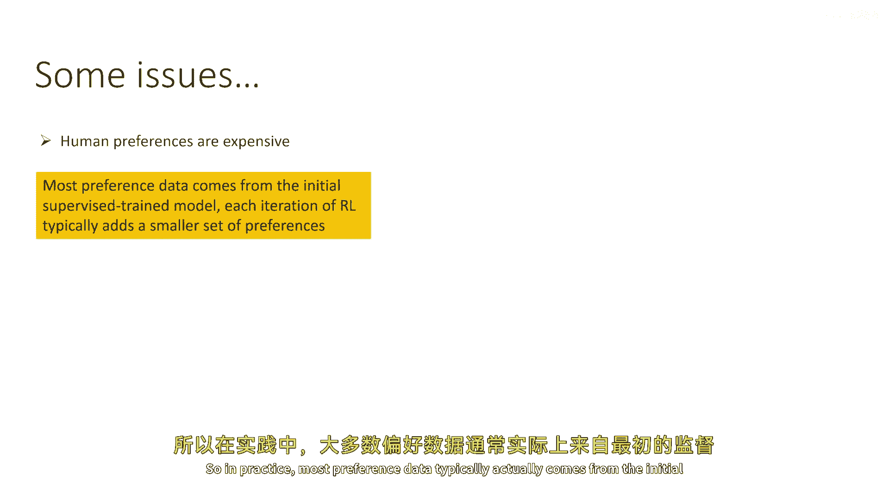

## 关键挑战与解决方案 🛡️

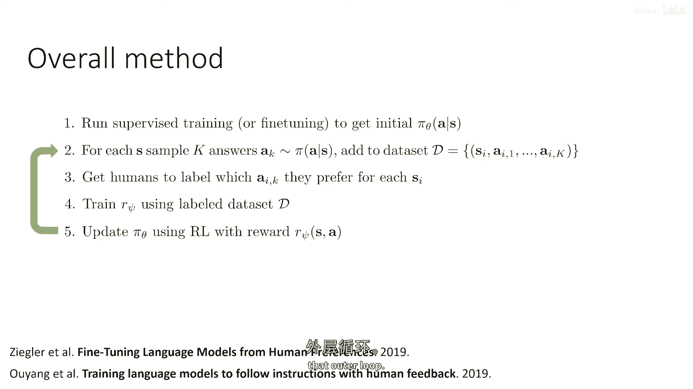

这种流程面临几个主要挑战：

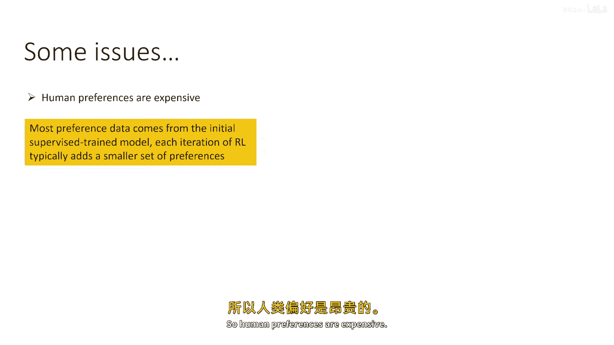

1.  **分布偏移与过度优化**：当我们基于一个固定的奖励模型 `R_ψ` 进行大量RL优化时，策略 `π_θ` 可能会逐渐偏离生成奖励模型训练时所看到的数据分布。这可能导致策略“利用”奖励模型的弱点，生成一些在 `R_ψ` 看来得分很高、但人类实际不喜欢的怪异答案。这种现象被称为**过度优化**。

    **解决方案**：在奖励函数中添加一个**KL散度惩罚项**，鼓励当前策略 `π_θ` 不要过度偏离初始的监督微调模型 `π_ref`。修改后的奖励变为：
    `R'(s, a) = R_ψ(s, a) - β * log(π_θ(a|s) / π_ref(a|s))`
    其中 `β` 是一个系数。这等价于在原始奖励上增加了 `β * KL(π_θ || π_ref)` 的惩罚。这能有效防止策略变得太“奇怪”。

2.  **奖励模型的能力**：奖励模型 `R_ψ` 本身需要非常强大和鲁棒，才能承受住RL策略的探索和优化压力。通常，奖励模型本身也是一个大型的、经过预训练的语言模型，并在顶部添加一个标量输出头进行微调。

---

## 总结 📚

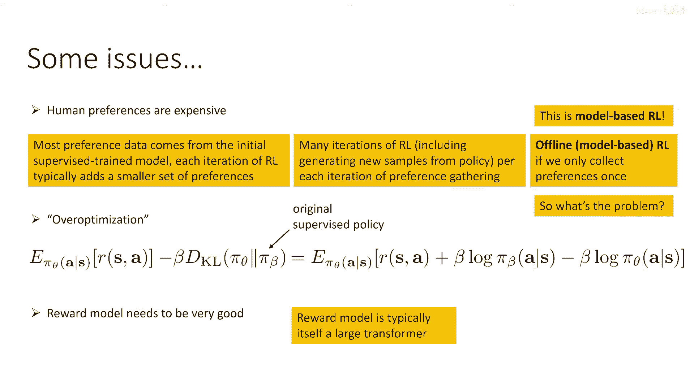

本节课中，我们一起学习了如何将强化学习应用于语言模型：

*   我们将语言生成任务形式化为一个**单步RL（Bandit）问题**，其中状态是提示，动作是生成的文本完成。
*   我们可以使用**策略梯度方法**进行训练，并通常采用**重要性采样估计器**以提高样本效率。
*   奖励函数可以通过一个**奖励模型** `R_ψ` 来提供，该模型通常从**人类偏好数据**中学习得到，使用如 Bradley-Terry 模型来将偏好转化为数值奖励。
*   整个训练流程（RLHF）结合了监督微调、奖励模型训练和RL策略优化。
*   我们讨论了关键挑战：**过度优化**和**奖励模型能力**。通过**在奖励中添加KL散度惩罚**和使用**强大、预训练的模型作为奖励模型基础**，可以有效应对这些挑战。

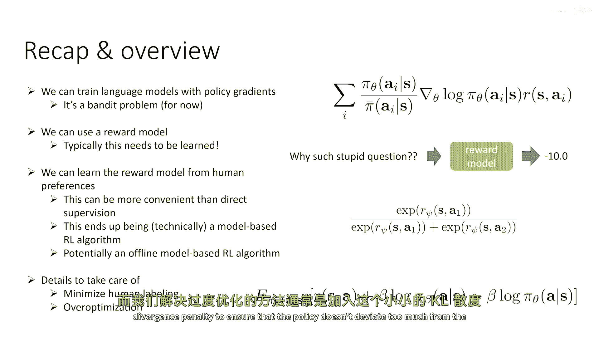

这种方法构成了当今许多先进对话AI系统（如InstructGPT、ChatGPT）的核心训练范式。下一节，我们将探讨如何将这个问题扩展到多步决策场景。