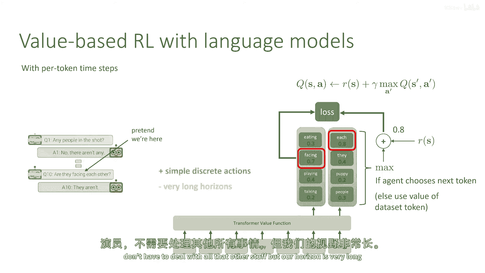
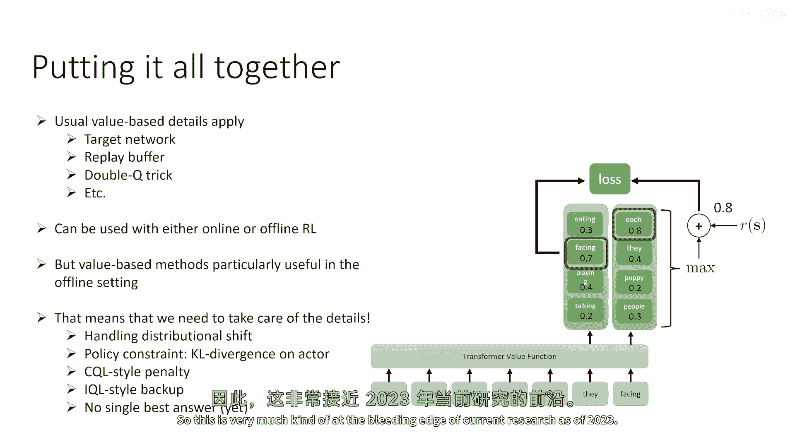
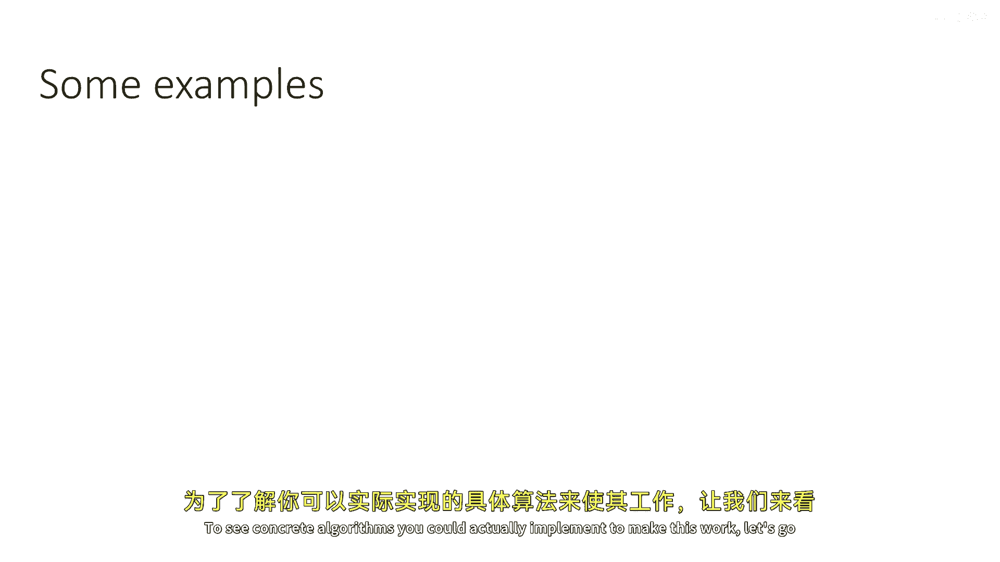
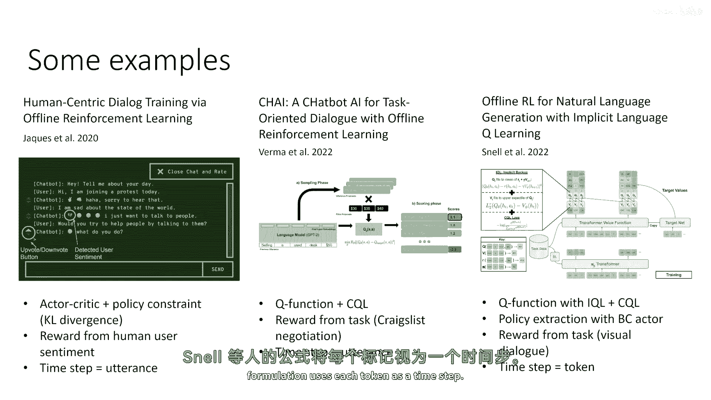
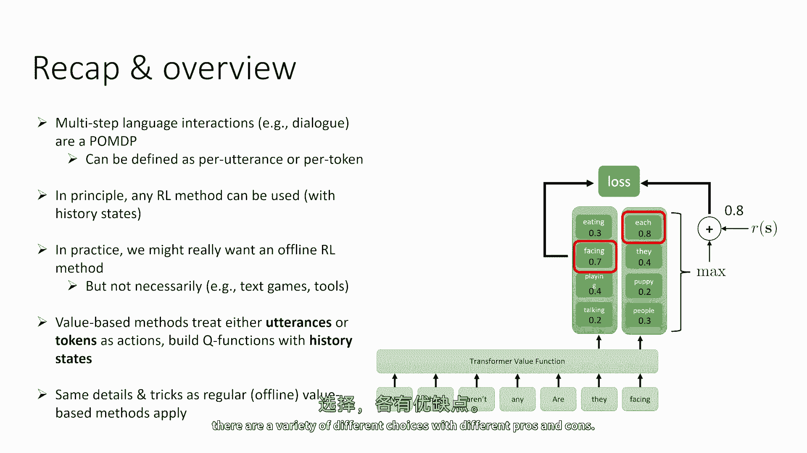

# 90：序列模型与语言模型的强化学习 🧠🤖

在本节课中，我们将要学习如何将语言模型与多步强化学习相结合。我们将结合之前讨论过的部分可观察马尔可夫决策过程（POMDP）和语言模型的概念，探讨在多轮交互场景（如对话）中训练智能体的方法。

---

## 概述

我们将讨论一个被称为“视觉对话”的任务示例。这个任务涉及一个提问者（机器人）和一个回答者（环境的一部分）。回答者心中有一个特定的图像，提问者必须通过一系列问题来收集信息，最终猜出正确的图像。这是一个纯粹的语言任务，其多步骤性质使得它成为一个完整的强化学习问题。

---

## 多步交互与POMDP建模

上一节我们介绍了基于人类反馈的强化学习，但那通常只涉及单轮交互。在本节中，我们来看看多轮交互问题。

在这个视觉对话任务中：
*   **动作**是提问者选择的问题（即机器人说出的句子）。
*   **观察**是回答者给出的答案（即环境或模拟人类的回应）。
*   **状态**是过去所有观察和动作的历史序列。
*   **奖励**在对话结束时给出，取决于提问者是否猜对了答案。

这种设置回归到了完整的RL框架，因为智能体（提问者）需要策略性地提问以收集信息，而不是仅仅贪婪地寻求即时答案。这种多轮问题出现在许多场景中，例如对话系统、工具使用（如操作数据库或终端）以及文本冒险游戏。

---

## 训练方法的选择：策略梯度与基于价值的方法

我们如何训练策略来处理这种多步、部分可观察的问题呢？

**策略梯度**是训练多轮策略的有效方法，并且能够处理部分可观察性（通过将观察历史作为策略输入）。然而，一个主要挑战是：如果智能体需要与真人交互来收集样本，那么每次策略更新都需要进行新的对话，成本非常高昂。

**基于价值的方法**（如Q-learning）则提供了一个有吸引力的替代方案。它允许我们使用离线强化学习技术，利用现有的人类对话数据或过去的机器人部署数据进行训练，而无需持续与环境（人类）交互。因此，在本讲座的这部分，我们将重点讨论基于价值的方法。

---

## 关键设计选择：时间步的定义

对于基于价值的方法，一个关键的设计选择是如何定义时间步。这主要分为两种方向：

以下是两种主要的时间步定义方式及其特点：

1.  **语句级时间步**
    *   **定义**：将每一句完整的对话（一次发言）视为一个时间步。
    *   **动作空间**：所有可能句子的集合，空间极大。
    *   **视界**：相对较短（例如，10轮对话对应10个时间步）。
    *   **优点**：最直观，类似于传统的RL环境设置。
    *   **挑战**：动作空间巨大，难以直接进行最大化操作。

2.  **标记级时间步**
    *   **定义**：将生成或接收的每一个标记（token）视为一个时间步。
    *   **动作空间**：词汇表中所有可能标记的集合，虽然大但是离散且可枚举。
    *   **视界**：非常长（即使短对话也可能有数百或数千个标记）。
    *   **优点**：动作空间简单，Q学习更新规则更接近监督式语言建模。
    *   **挑战**：视界很长，需要处理更长的序列依赖。

文献中两种方法都有探索，目前没有单一的最佳标准。

---

## 基于价值的方法实现

### 语句级时间步的Q函数

假设我们处于对话的某个中间状态。我们需要为当前状态（即整个对话历史）和候选动作（即机器人可能说的下一句话）计算Q值。

一种常见的架构是：
1.  使用一个序列模型（如预训练的语言模型）对状态历史 `s_t` 进行编码，得到一个嵌入表示。
2.  使用另一个（或同一个）序列模型对候选动作 `a_t` 进行编码。
3.  将这些嵌入输入一个学习到的函数，输出标量Q值。

这构成了**评论家（Critic）**。我们可以采用演员-评论家架构，训练一个单独的**演员（Actor）** 网络来最大化这个Q值。要找到最优动作，我们可以使用束搜索（Beam Search）或在监督训练的策略中采样，然后选择Q值最高的样本作为对 `max` 操作的近似。

### 标记级时间步的Q学习

在标记级设置中，过程更接近标准的语言模型。在每个时间步，模型为词汇表中的每个可能标记输出一个Q值，表示选择该标记作为下一个动作的长期价值。

训练时，对于数据集中出现的标记，其Q值目标可以通过贝尔曼方程计算：
`Q_target = r + γ * max_{a'} Q(s', a')`
其中，`max` 操作可以近似为对下一个时间步所有可能标记的Q值取最大值，或者使用数据集中实际出现的下一个标记的Q值。这本质上实现了标记级别的Q学习。

---

## 实践细节与算法示例

无论选择哪种时间步定义，标准的深度Q学习技巧都适用，例如使用目标网络、经验回放缓冲区和双Q学习。在离线RL设置中，还需要处理分布偏移问题，常用方法包括策略约束（在演员上使用KL散度惩罚）或对Q函数施加惩罚（如SQL或IQL风格）。

为了更具体地理解，以下是文献中的一些算法实例：

*   **论文1**：采用演员-评论家架构与策略约束（KL散度），使用情感分析作为奖励，时间步为语句级。
*   **论文2**：使用SQL风格的Q函数惩罚，通过从监督训练的语言模型中采样来近似 `max` 操作，时间步为语句级。
*   **论文3**：结合IQL和CQL方法训练Q函数，通过采样并选取Q值最高的样本来决定动作，在视觉对话任务上评估，时间步为标记级。

这些论文展示了实现的具体选择，建议深入阅读以了解细节。

---

## 总结

本节课中，我们一起学习了如何将强化学习应用于多步语言交互任务（如对话）。

1.  我们将此类任务建模为**部分可观察马尔可夫决策过程（POMDP）**，使用对话历史作为状态表示。
2.  关键设计选择在于定义**时间步**（语句级 vs. 标记级），两者各有优劣。
3.  虽然任何RL方法原则上都适用，但**基于价值的离线RL方法**在实践中尤其具有吸引力，因为它能利用现有数据，减少与真实环境（如人类）的交互成本。
4.  实现基于价值的方法时，需要构建以历史状态为输入的Q函数，并应用标准技巧（如目标网络）和离线正则化方法（如策略约束、SQL、IQL）。

目前，对于多步语言RL，尚未形成单一的最佳实践标准，这是一个活跃的研究领域。