# 91：迁移学习与元学习（第一部分）🚀

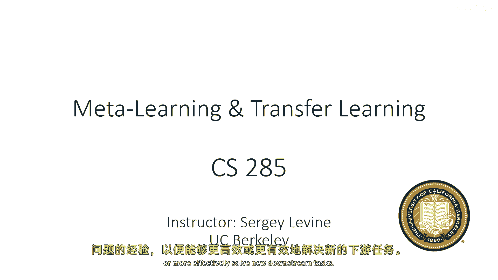

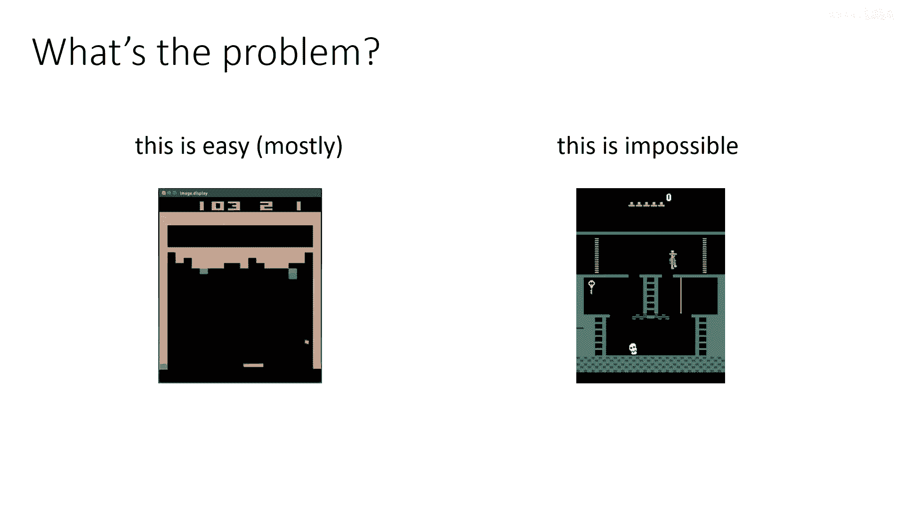

在本节课中，我们将要学习迁移学习和元学习的基本概念。我们将探讨如何利用从一个或多个源任务中获得的经验，来更高效地解决新的目标任务。这对于解决那些奖励信号稀疏或探索困难的任务（如《蒙特祖玛的复仇》）尤其重要。

## 动机：为什么需要迁移学习？🎮

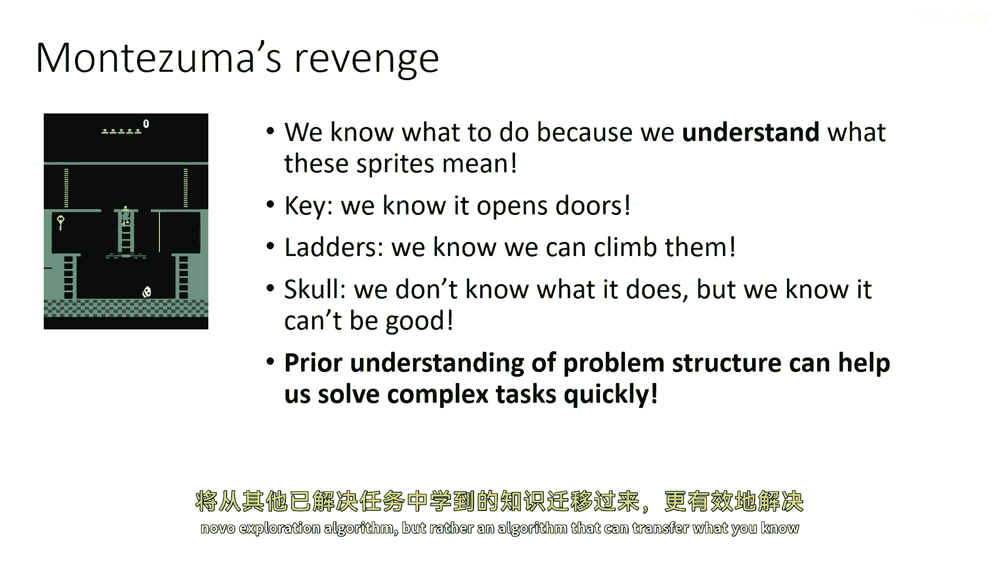

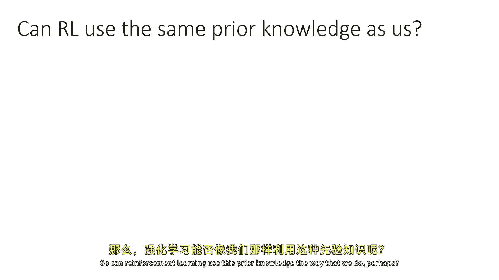

上一节我们介绍了强化学习的基本框架，本节中我们来看看一个具体挑战：某些任务对人类来说很简单，但对算法却异常困难。

以《蒙特祖玛的复仇》游戏为例。对于人类玩家，我们凭借对世界的基本认知（如钥匙开门、骷髅危险）可以快速上手。然而，对于强化学习智能体，其奖励结构（捡钥匙、开门获得少量正奖励）并未提供明确的进步指导，导致学习效率极低。

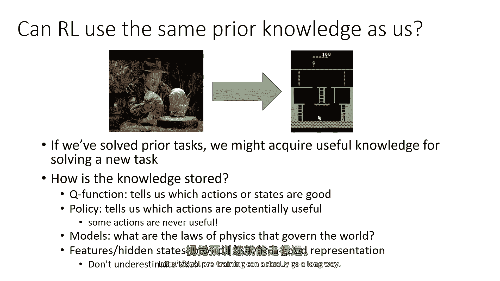

迁移学习的目标，就是让智能体能够像人类一样，利用从其他任务（源域）中学到的“先验知识”，来加速在新任务（目标域）上的学习过程。

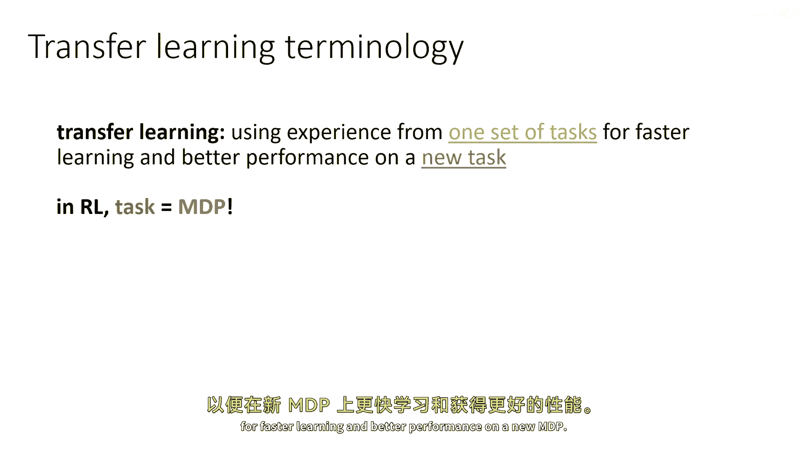

## 迁移学习基础定义 📚

在深入技术细节前，让我们先明确一些核心定义。

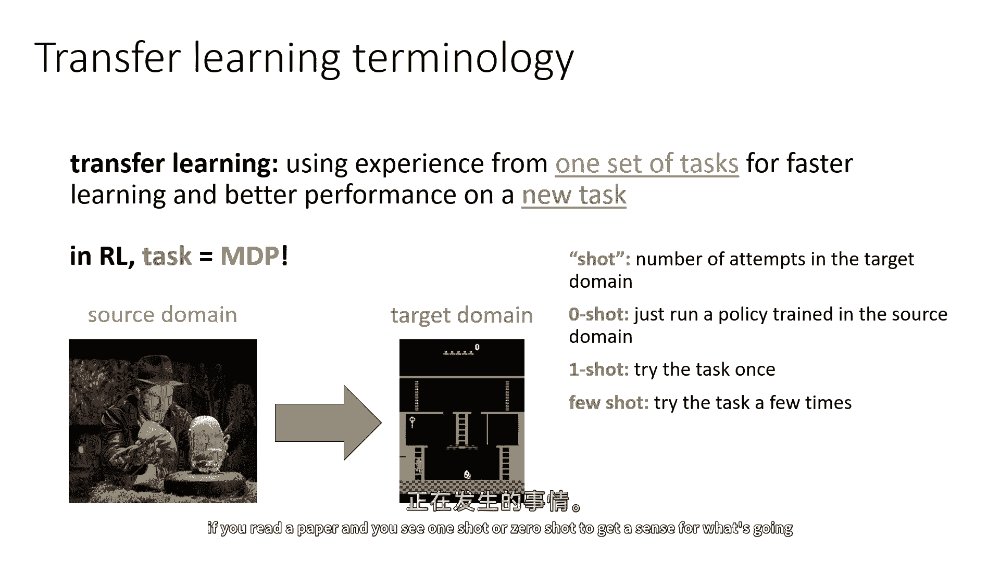

*   **任务/马尔可夫决策过程**：在强化学习语境下，一个任务通常指一个特定的MDP。
*   **源域**：用于获取初始经验、训练模型的MDP或MDP集合。
*   **目标域**：我们希望获得良好性能的新MDP。
*   **迁移性能描述**：
    *   **零样本迁移**：在源域训练后，无需在目标域进行任何额外交互即可获得良好性能。
    *   **单样本/少样本迁移**：在目标域进行极少次数的尝试（如一个回合）后获得良好性能。
    *   **多样本迁移**：需要在目标域进行较多尝试。

迁移学习的核心目标是**在目标域上获得高性能**，无论其在源域上的表现如何。

## 迁移学习的主要框架 🧩

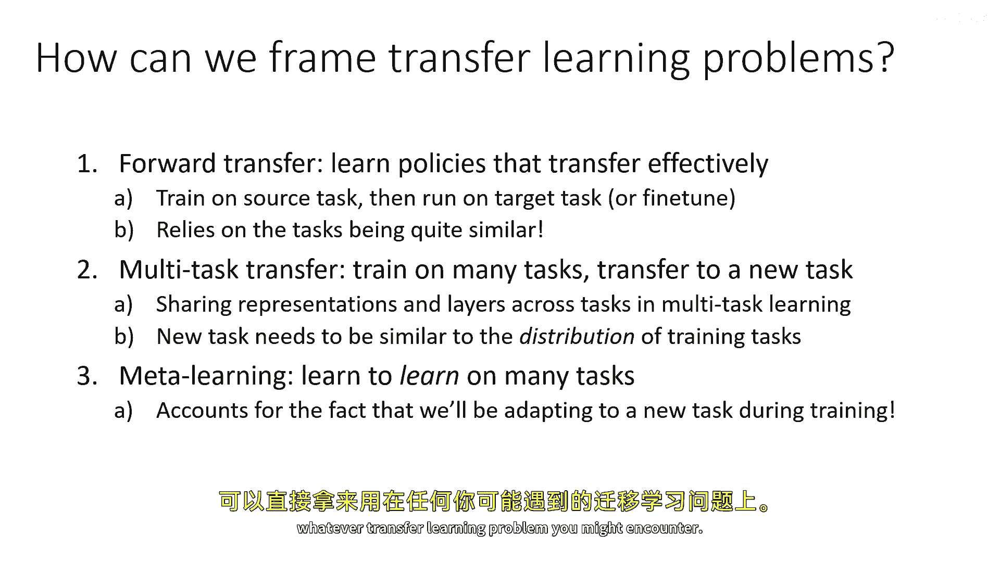

迁移学习问题没有单一的表述方式，它高度依赖于源域和目标域的特性。以下是几种常见的框架思路：

1.  **前向迁移**：在源任务上训练策略或模型，然后直接应用于目标任务，或进行少量微调。这要求源域和目标域高度相似。
2.  **多任务迁移**：在多个不同的源任务上同时训练，然后迁移到新的目标任务。由于目标域可能落在多个源域构成的“凸包”内，这种方法通常更鲁棒。
3.  **元学习**：可以看作是迁移学习的逻辑延伸。其核心思想是“学会学习”，即在源域上以“能够快速适应新任务”为目标进行特殊训练，而不仅仅是追求在源任务上的最优性能。

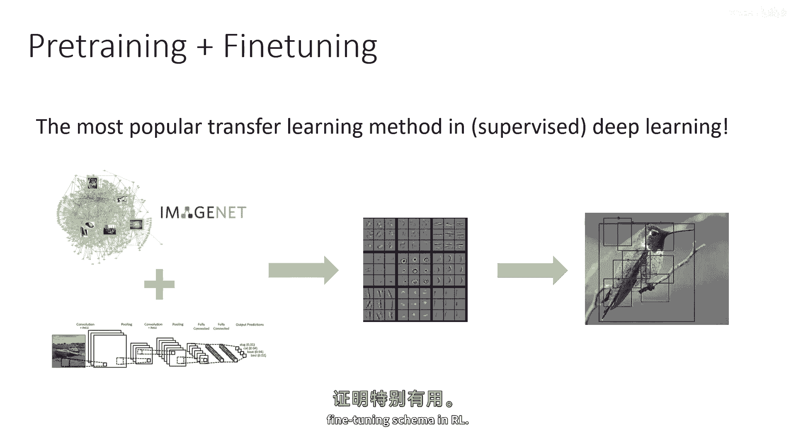

本节课我们将主要探讨前向迁移和多任务迁移的基本思想，并将大部分时间留给更系统的元学习方法。

## 预训练与微调：挑战与技巧 🔧

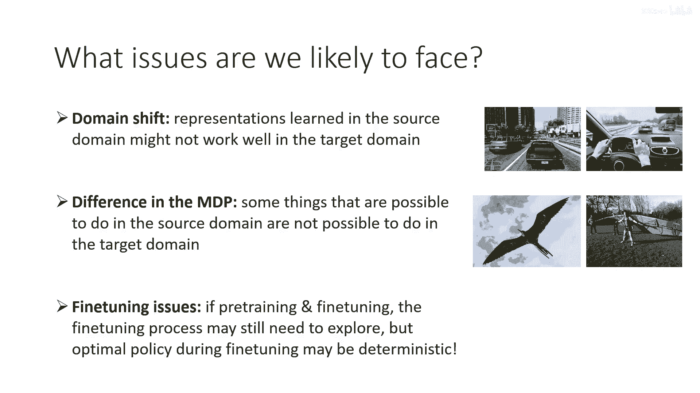

在计算机视觉等领域，预训练-微调是标准流程。在RL中，我们也可以先在源域（如模拟器）预训练一个策略或价值函数，然后在目标域（如真实世界）微调。但这面临独特挑战：

*   **领域漂移**：源域和目标域的观测或动态不同。
*   **探索不足**：在源域训练出的确定性策略在目标域可能停止探索，导致微调缓慢。

### 应对领域漂移：不变性表示

一个常见假设是**不变性假设**：两个领域间的差异对于决策是无关的。例如，模拟驾驶和真实驾驶的图像风格不同，但道路结构、车辆位置等关键信息是相关的。

**目标**：找到一个特征表示 `z = f(x)`，使得：
1.  `p(z)` 在源域和目标域中相同。
2.  给定 `z` 预测动作或价值的分布 `p(y|z)` 与给定原始输入 `x` 的分布 `p(y|x)` 一致。

**实现方法（领域对抗训练）**：
*   在神经网络中间层引入一个领域判别器 `D_φ`，试图区分特征 `z` 来自源域还是目标域。
*   同时训练特征提取器 `f` 来“欺骗”判别器，使其无法区分，从而迫使 `z` 的分布变得域不变。
*   这通常通过梯度反转层来实现。

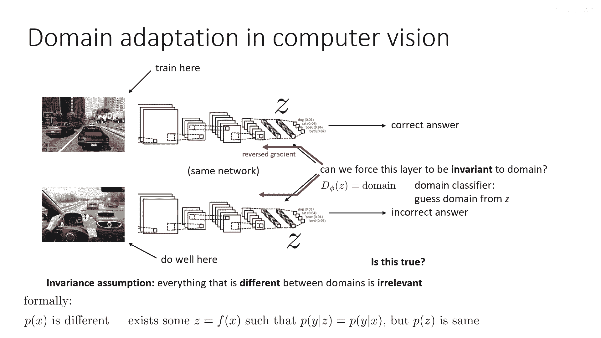

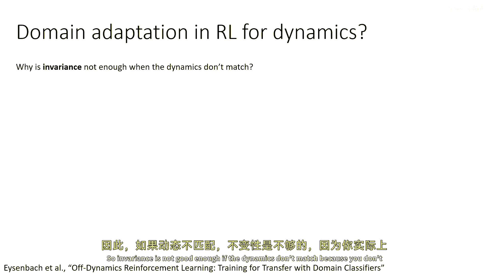

```python
# 概念性代码：领域对抗损失
z = feature_extractor(x)
domain_pred = domain_classifier(z)
# 特征提取器的目标是最大化判别器的误差（即混淆域）
feature_loss = -log(domain_pred)  # 假设标签为“目标域”
# 判别器的目标是正确分类域
classifier_loss = cross_entropy(domain_pred, true_domain_label)
```

> **注意**：此方法需要一些目标域的样本（无需奖励或动作），且需警惕目标域数据质量（如坏数据）可能导致学到的表示忽略重要信息。

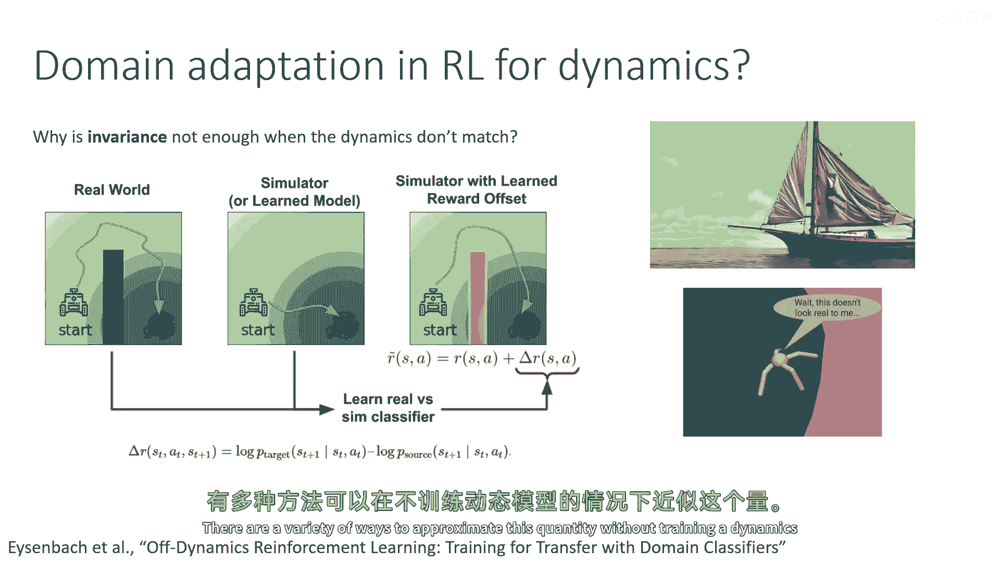

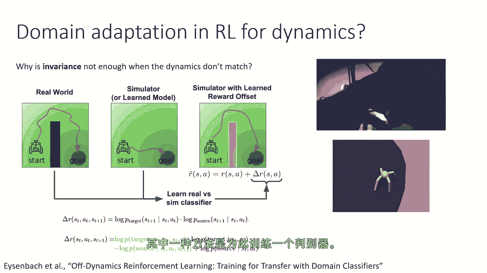

### 应对动态差异：行为不变性

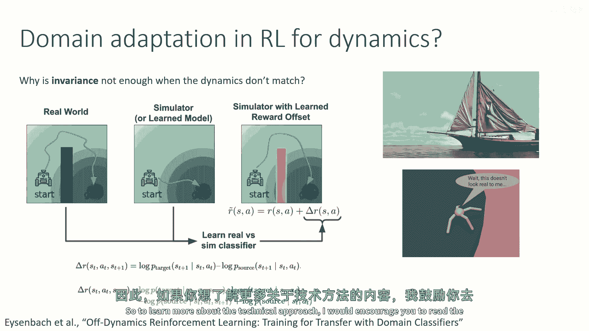

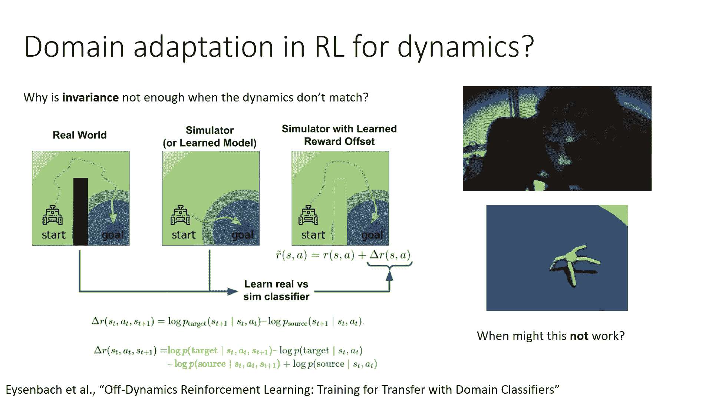

当领域间的动态（物理规律）不同时，强行对齐表示可能不够。另一种思路是修改源域的奖励函数，惩罚那些在目标域中不可能发生的行为。

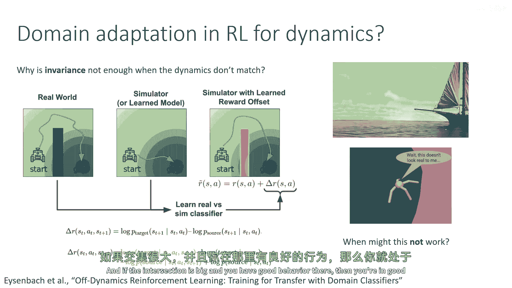

**核心思想**：在奖励函数中添加一项，鼓励智能体在源域中的行为看起来“像”在目标域中可能发生的行为。

**实现方法**：可以通过训练判别器来估计状态-动作对 `(s, a)` 或状态转移 `(s, a, s‘)` 在目标域中发生的概率，并将其与源域中的概率对比，差值作为额外的奖励信号。

### 促进有效微调：增加多样性

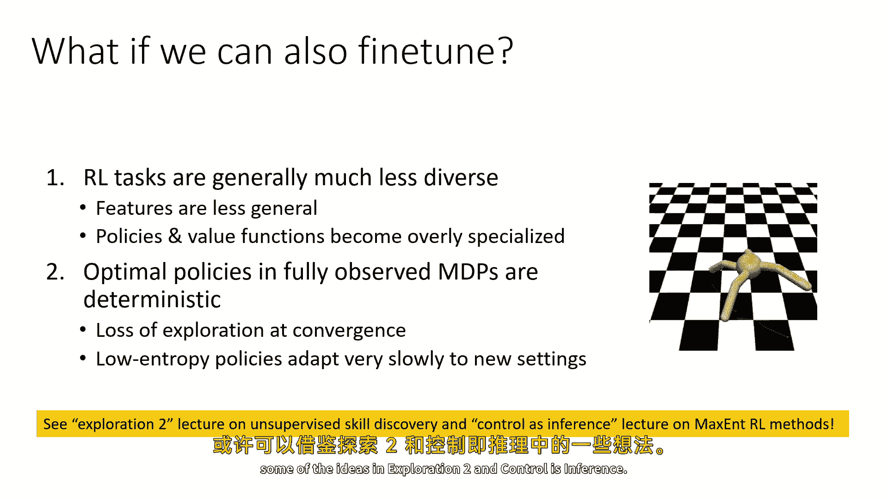

为避免预训练策略过于专一和缺乏探索性，可以在源域训练时采用鼓励多样性的技术：
*   **无监督技能发现**（如探索讲座中的方法）：学习多样化的基本技能。
*   **最大熵强化学习**（如控制推断讲座中的方法）：学习更随机、探索性更强的策略。

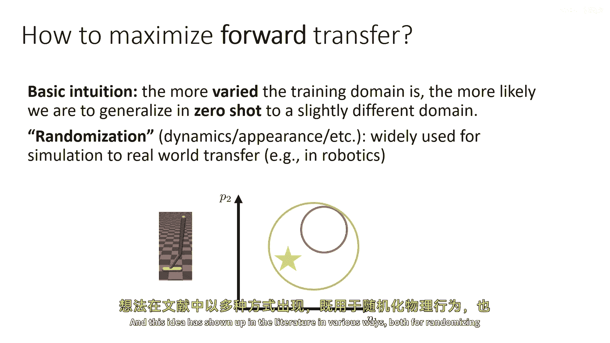

## 领域随机化：一种强大的前向迁移工具 🎲

如果可以对源域（如模拟器）进行控制，**领域随机化**是一种极其有效的前向迁移策略。

**核心直觉**：在训练期间，主动且大量地随机化源域的各种参数（如视觉纹理、物理属性、光照等）。这样训练出的策略会对这些变化变得鲁棒，从而更可能直接（零样本）迁移到未曾见过的真实目标域。

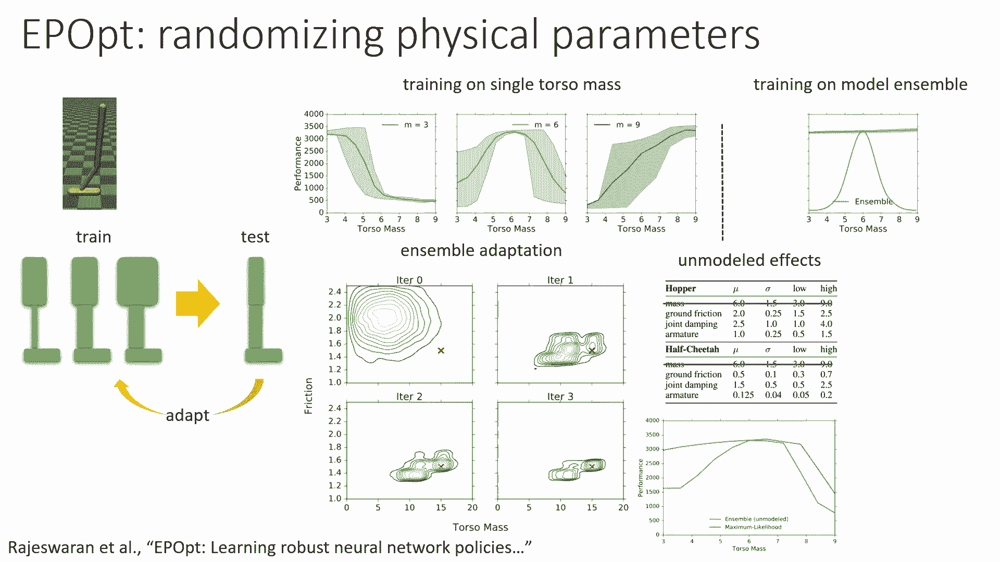

**关键发现**：
1.  随机化通常不会显著牺牲在训练分布上的最优性能。
2.  随机化一部分参数，常常能带来对**未随机化参数**的鲁棒性。这是因为不同物理效应之间存在耦合关系。

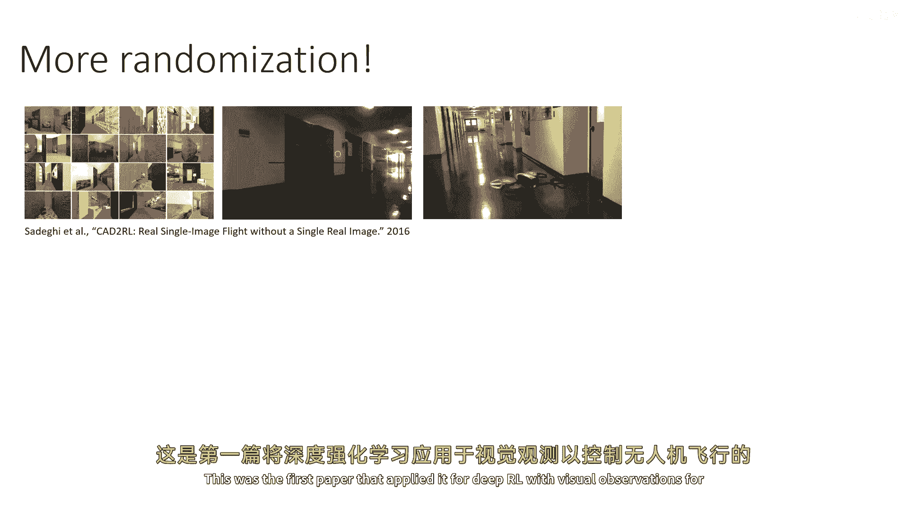

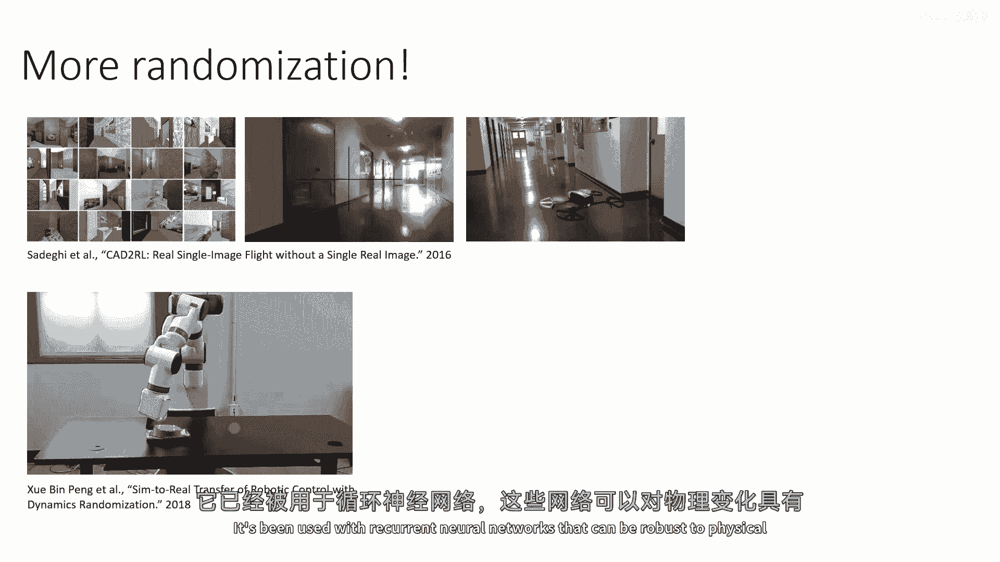

**公式**：在模拟器中，我们不是用一组固定参数 `θ` 训练，而是从一个分布 `p(θ)` 中采样参数进行训练。
```python
for each episode:
    env_params = sample_from_distribution(p(θ))  # 例如，随机质量、摩擦、纹理
    agent.interact(env_with_params)
```
这种方法在机器人学中尤为盛行，用于将模拟中训练的策略迁移到真实硬件上。

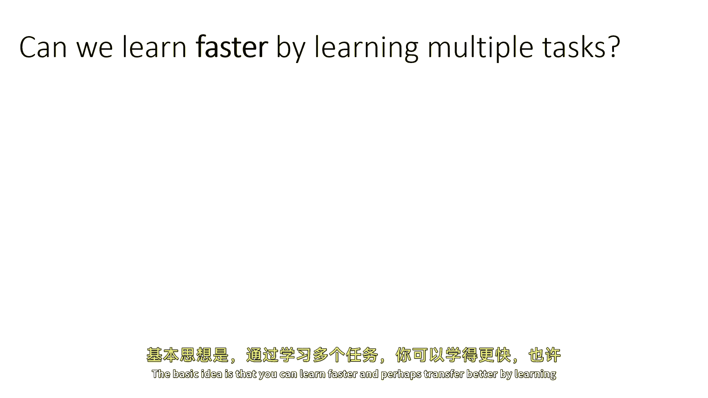

## 多任务迁移学习 🤖

多任务迁移的基本思想直观而强大：通过同时学习多个相关任务，智能体可以学习到更通用、更可迁移的表示和技能。

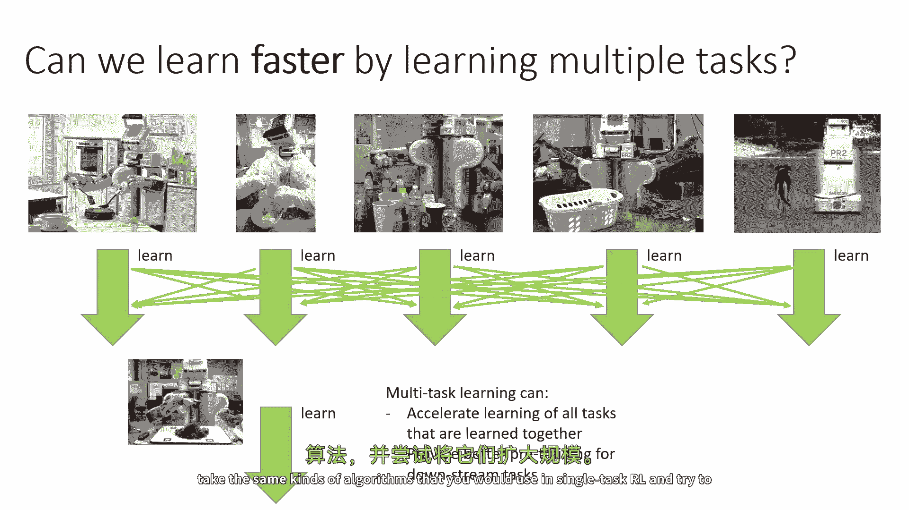

**实现方式**：通常通过训练一个**上下文策略** 来实现。
*   **策略形式**：`π(a | s, ω)`，其中 `ω` 是任务上下文（如one-hot编码、目标状态、文本描述）。
*   **MDP框架**：这等价于定义一个更大的MDP，其初始状态分布 `p(s0, ω)` 会共同采样初始状态和任务标识 `ω`，之后在该回合中 `ω` 保持不变。

**一种特例：目标条件策略**
*   上下文 `ω` 是一个目标状态 `g`。
*   奖励函数鼓励接近或达到 `g`。
*   **优势**：可以零样本迁移到新的目标状态。
*   **挑战**：训练稳定性和效率，且并非所有任务都适合用目标达成来定义。

## 总结与下节预告 📝

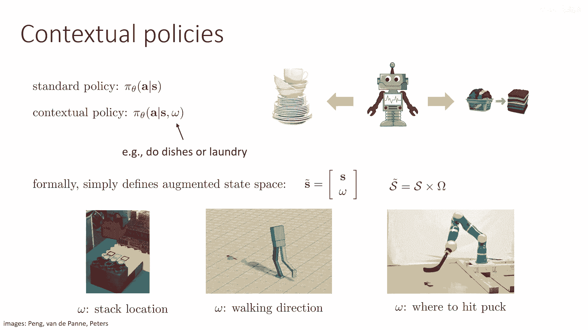

本节课我们一起学习了迁移学习与元学习的动机和基础框架。我们探讨了：
*   迁移学习的核心定义与分类（前向、多任务、元学习）。
*   预训练-微调范式中面临的挑战（领域漂移、探索不足）及应对技巧（领域对抗训练、奖励塑形）。
*   领域随机化作为一种强大的零样本迁移技术。
*   多任务学习及上下文策略（特别是目标条件策略）的基本思想。

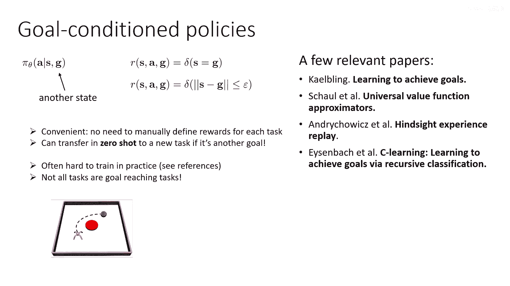

这些方法为利用先验知识解决新任务提供了工具箱。然而，许多前向迁移方法依赖于源域和目标域的相似性。在下节课中，我们将深入探讨**元学习**，这是一种更系统、旨在“学会学习”的范式，它将适应新任务的过程本身作为优化目标，从而能够实现更快速、更高效的少样本迁移。敬请期待！