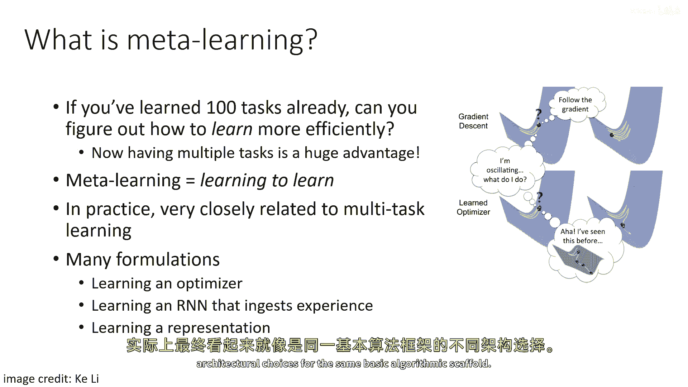
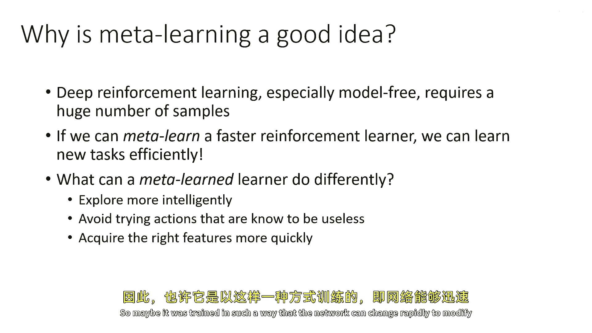
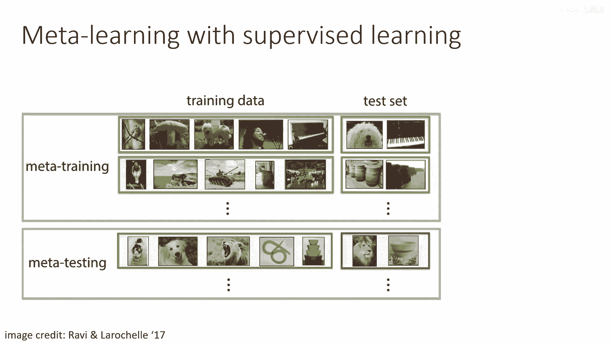
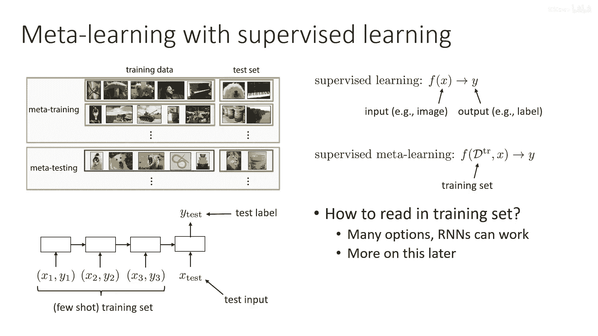
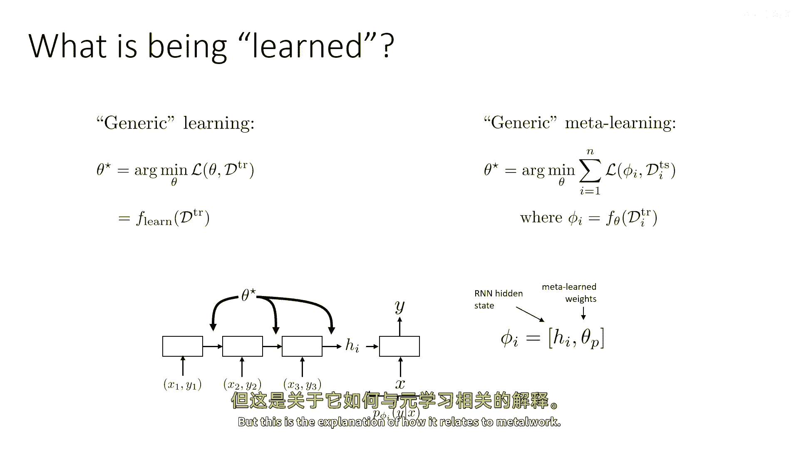

# 92：元学习基础 🧠

在本节课中，我们将学习元学习的基本概念。元学习是多任务学习的一种扩展，其核心目标是“学会如何学习”，即利用从多个任务中获取的经验，来加速学习新任务的过程。这对于样本效率较低的领域（如深度强化学习）尤为重要。

---

## 什么是元学习？🤔

上一节我们介绍了多任务学习，本节中我们来看看它的逻辑扩展——元学习。元学习不是简单地学习解决多个任务，而是旨在利用多个任务来学习一个更高效的学习过程本身。

**核心思想**：如果你已经学习过一百个任务，你是否能更有效地学习第一百零一个任务？元学习正是基于这个想法，它试图从多个任务中归纳出学习过程本身的规律，从而极大地加速对新任务的掌握。

在实际应用中，元学习与多任务学习关系密切，但形式多样。这些不同的形式化方法可以归纳在同一个框架下。

以下是元学习可能涉及的几种不同形式：
*   学习一个优化器。
*   在循环神经网络（RNN）中学习，使其能读取大量经验后解决新任务。
*   学习一种能快速适应新任务的表示或初始化方式。

尽管这些看起来是非常不同的事情，但它们实际上可以在同一个基本算法框架下实例化。许多不同的元学习技术，在深入细节后，会发现它们只是对相同基本框架的不同架构设计选择。

---

## 为什么需要元学习？🚀

深度强化学习，尤其是无模型方法，通常需要巨大的样本数量。因此，如果能学会一个更快的“强化学习者”，就能高效地学习新任务。

那么，一个元学习后的强化学习方法可能会有何不同呢？

以下是它可能具备的优势：
*   **更智能的探索**：解决先前任务的经验可以告诉它如何结构化其探索策略，以快速获取新任务。它可能会避免尝试那些它“知道”是无用的动作。
*   **更快地获取所需特征**：网络可以被训练成能够快速修改其特征表示，以适应新的任务。

---

## 监督学习中的元学习设置 📚

为了帮助理解，我们先从一个更简单的监督学习场景来描述元学习的基本“配方”。这个配方能解开很多关于元学习的疑问。

下图来自Ravi和Larochelle在2017年的论文，解释了元学习如何用于图像识别。虽然图像识别与强化学习不同，但我们将看到相似的原则在强化学习中同样适用。

在常规监督学习中，我们有一个训练集和一个测试集。在元学习中，我们有一个**元训练集**和一个**元测试集**。
*   **元训练**：用于元学习过程的数据集，相当于“源领域”。
*   **元测试**：当我们得到新任务时将看到的情况，相当于“目标领域”。

在元训练期间，每个任务（或称为一个“情节”）都包含自己的训练集和测试集。例如，在每个任务中，我们可能有五个类别，但这些类别在不同任务中代表不同事物。

**任务1示例**：
*   训练集：类别0（鸟）、类别1（蘑菇）、类别2（狗）、类别3（人）、类别4（钢琴）的图片。
*   测试集：包含狗和钢琴的图片。

**任务2示例**：
*   训练集：类别0（体操运动员）、类别1（风景）、类别2（坦克）、类别3（炮筒）等的图片。
*   测试集：包含对应类别的测试图片。

这些任务可以手动设计或随机生成。核心思想是：模型将查看许多这样的不同训练集，并利用其对应的测试集进行“元训练”。训练出的模型应该能够接收一个包含**全新类别**的训练集（在元测试时给出），并在其对应的测试集上表现良好。

---

## 形式化描述：从函数视角看 🔧

上一节我们看了具体设置，本节中我们从函数视角进行形式化描述。

常规监督学习可以看作一个函数 $f$，它接受输入 $x$（如图片）并产生预测 $y$（如标签）：
`y = f(x)`

监督式元学习则可以看作一个函数 $F$，它接受**整个训练集** $D_{train}$ 和一个测试输入 $x$，并预测该测试输入的标签 $y$：
`y = F(D_train, x)`

两者区别并不大，只是元学习的函数需要具备“读取”整个训练集的能力。要实例化这个函数 $F$，需要解决如何读取训练集的问题。像循环神经网络（RNN）或Transformer这样的架构在此问题上效果很好。

你可以想象一个RNN：
1.  按顺序读取训练集中的样本对 $(x_1, y_1), (x_2, y_2), ..., (x_N, y_N)$。
2.  然后读取测试输入 $x_{test}$。
3.  最后预测测试标签 $y_{test}$。

这就是所谓的“少样本”学习设置：模型基于一个小的训练集（N个样本），对一个测试输入做出预测。

---

## 元学习究竟在学什么？🎯

既然元学习是“学习如何学习”，那么它学习的对象到底是什么？学到的这个“东西”又如何在目标领域部署？

让我们尝试理解这个过程。想象一个通用的学习示意图：

1.  **通用学习**：你有一些模型参数 $\theta$。你通过最小化训练集 $D$ 上的损失函数 $L$ 来找到最优参数 $\phi$。我们将这个过程称为学习算法 $f_{learn}$：
    `φ = f_learn(D; θ)`
    这里，$\theta$ 是学习算法本身的（可能固定的）参数或结构。

2.  **通用元学习**：元学习的目标是找到一个更好的学习算法 $f_{learn}$。我们引入元参数 $\Theta$ 来参数化这个学习算法，记作 $f_\Theta$。元学习的过程就是优化 $\Theta$，使得由 $f_\Theta$ 在训练集 $D_{train}$ 上产生的参数 $\phi$，在测试集 $D_{test}$ 上表现良好（损失 $L$ 最小）：
    `Θ* = argmin_Θ L_test( φ ) where φ = f_Θ(D_train)`
    这是一种“二次”优化：我们训练 $f_\Theta$（元学习器），使得它的输出（学习到的任务参数 $\phi$）在测试时效果好。此时，$f_{\Theta^*}$ 就成了我们学到的、更优的学习过程。

**以RNN元学习器为例**：
*   $f_\Theta$ 是RNN中读取训练集的部分。元参数 $\Theta$ 就是这个RNN的参数。
*   当RNN读取任务 $i$ 的训练集时，会产生隐藏状态 $h_i$。
*   这个隐藏状态 $h_i$ 被传递给一个小的分类器（有自己的参数 $\theta_p$）。该分类器以 $h_i$ 和测试图像 $x$ 为输入，产生预测 $y$。
*   因此，对于这个任务，学到的任务特定参数 $\phi_i$ 实际上是 **隐藏状态 $h_i$ 和分类器参数 $\theta_p$ 的组合**。

在这种设计下，学习新任务（在元测试时）的过程非常简单：只需将新任务的训练集输入训练好的RNN编码器，运行前向传播得到隐藏状态 $h_{new}$，然后将其输入顶部分类器即可得到预测。分类器参数 $\theta_p$ 在元训练后是固定的，不会针对新任务调整。

**回顾RNN元学习器的工作流程**：
1.  **元训练**：训练RNN编码器和顶部分类器的所有参数。RNN学习如何从训练序列中编码有用信息到隐藏状态 $h$。
2.  **元测试（适应新任务）**：
    *   获得新任务的训练集 $D_{train}^{new}$。
    *   用训练好的RNN编码器处理 $D_{train}^{new}$，得到新的隐藏状态 $h_{new}$。
    *   将 $h_{new}$ 与固定的顶部分类器参数结合。
    *   对测试图像进行预测。

这实际上用一种复杂的方式解释了一个简单的操作：在实践中，你通常只需要对新的训练集和测试输入运行一次RNN前向传播，就能得到答案。

---

## 总结 📝

本节课中，我们一起学习了元学习的基础知识：
1.  **定义**：元学习是“学会如何学习”，旨在利用多任务经验来加速新任务的学习。
2.  **动机**：特别是在样本效率低的领域（如强化学习），元学习能实现更智能的探索和更快的特征适应。
3.  **设置**：通过监督学习中的“少样本”分类任务，我们了解了元训练与元测试的区别，以及任务（情节）的构造方式。
4.  **形式化**：元学习可以看作学习一个能读取整个训练集并做出预测的函数 $F(D_{train}, x)$。其核心是优化一个元学习器 $f_\Theta$，使得它产生的任务参数 $\phi$ 在测试集上表现优异。
5.  **实例**：以RNN为基础的元学习器为例，我们剖析了元参数 $\Theta$、任务参数 $\phi$ 的具体含义，以及元训练和元测试的全过程。

理解这个基础框架是后续探索更复杂的元学习算法（包括在强化学习中的应用）的关键。