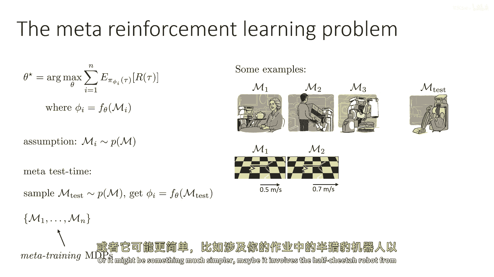
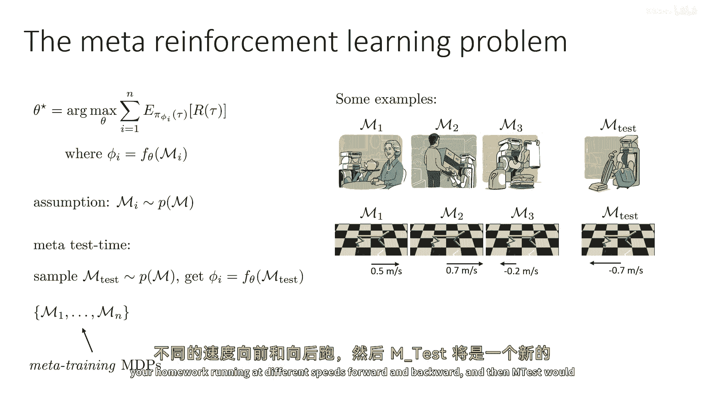
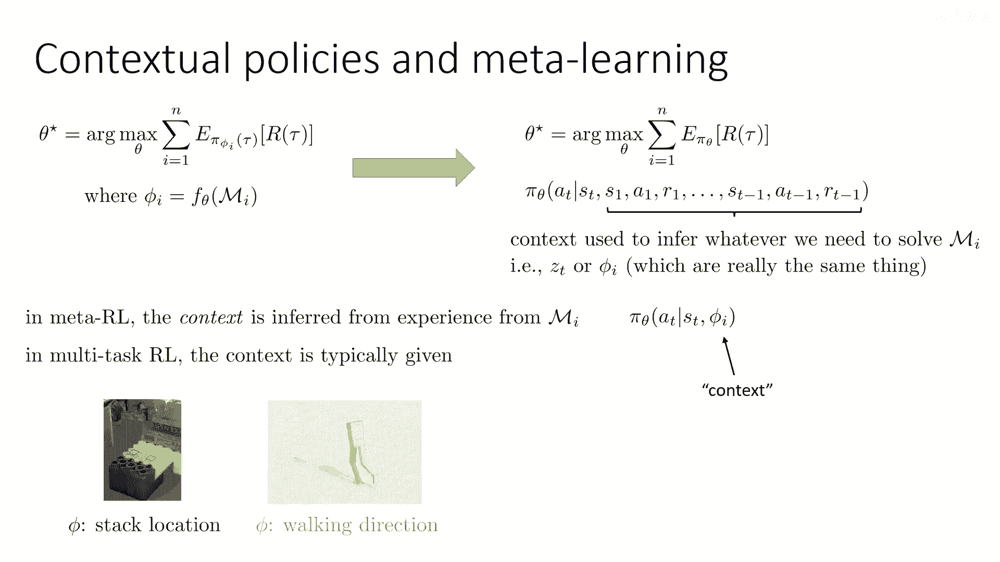
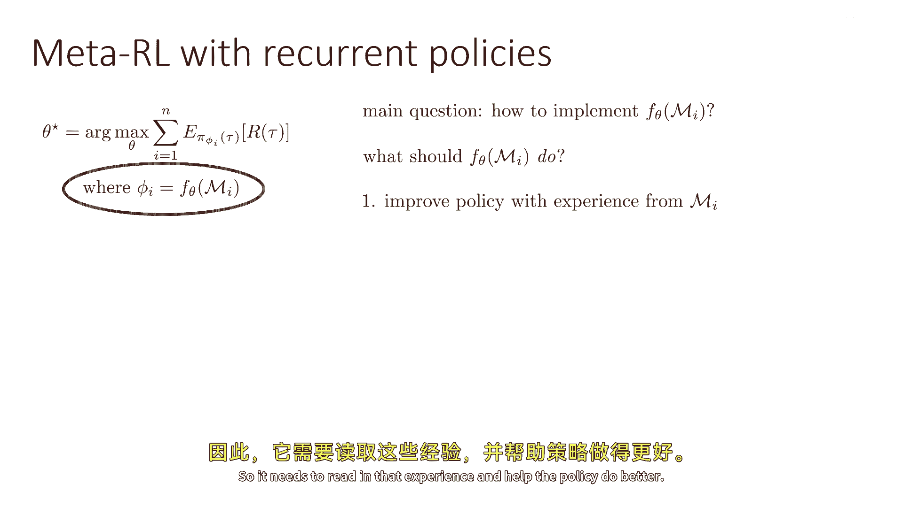
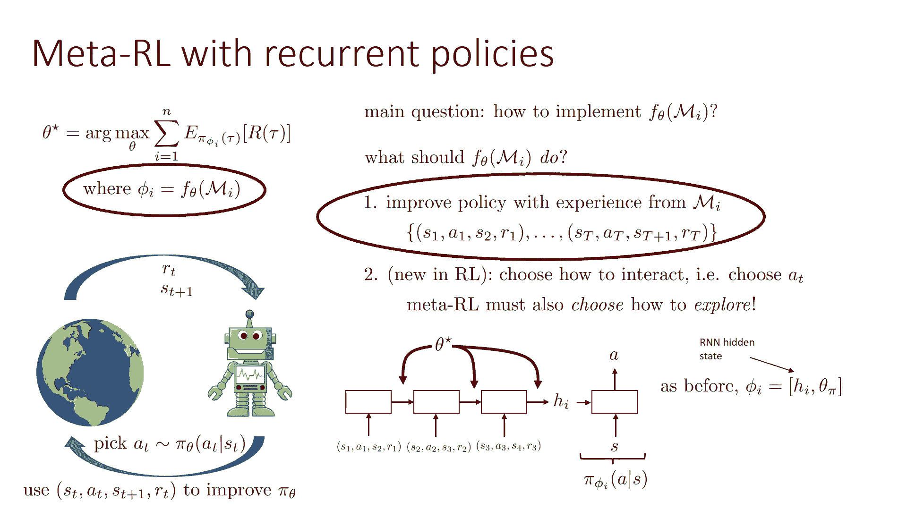
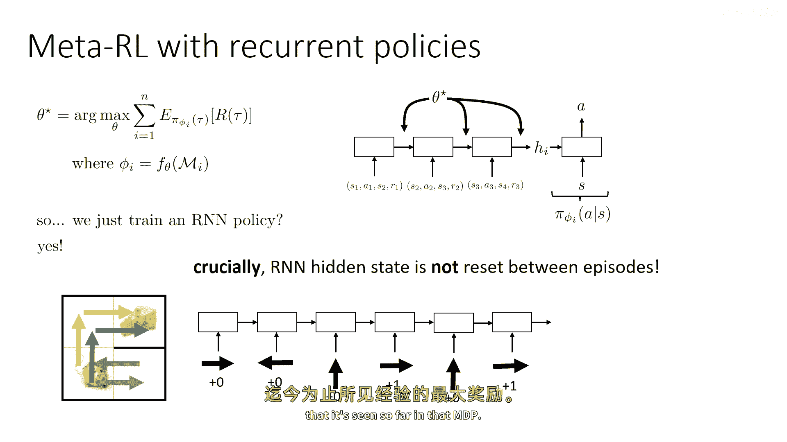
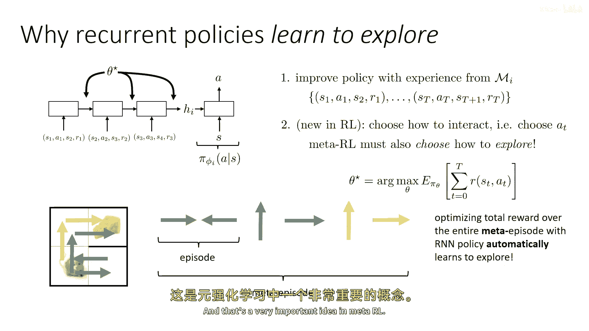
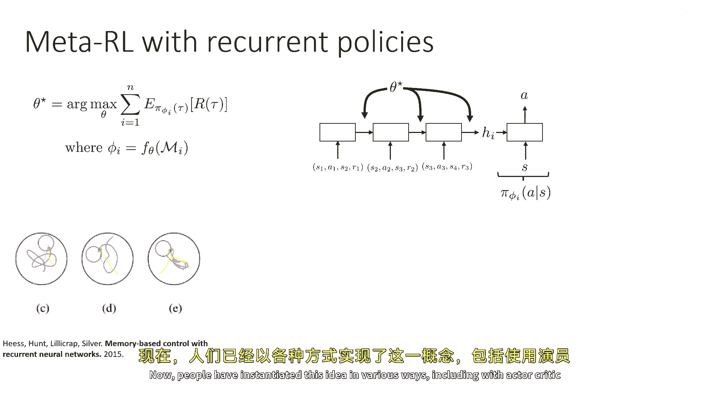
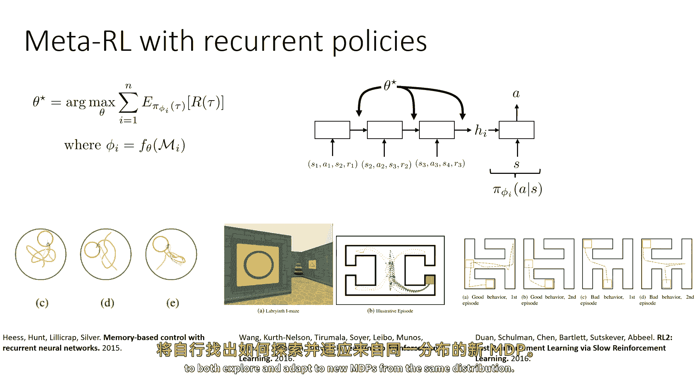
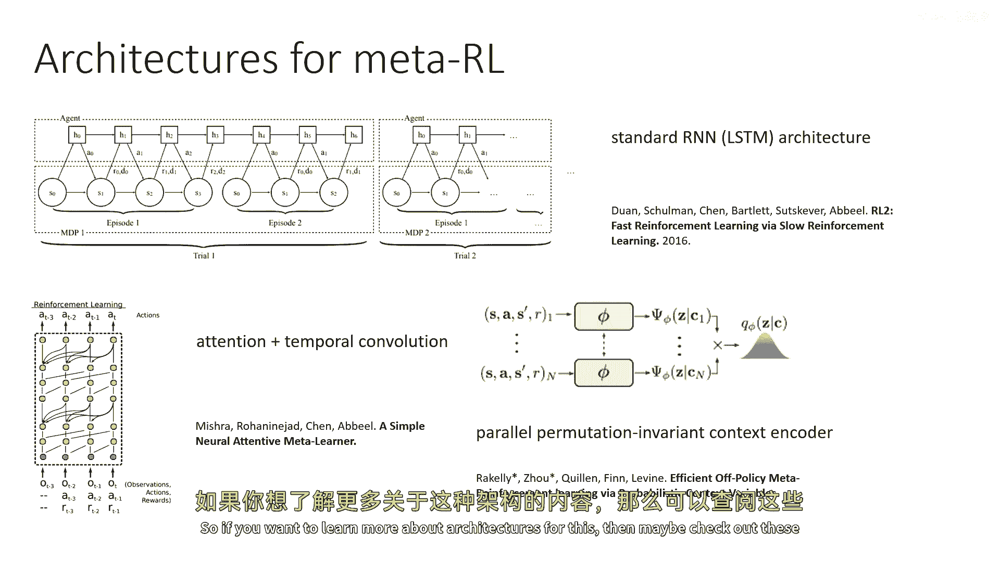

# 93：元强化学习 🧠

在本节课中，我们将学习如何将元学习的核心思想应用到强化学习领域，即元强化学习。我们将从常规强化学习与元强化学习的对比开始，逐步理解其定义、实现方式以及如何通过循环神经网络等架构来实现它。

---

## 常规强化学习 vs. 元强化学习

上一节我们介绍了元学习的通用框架，本节中我们来看看如何将其迁移到强化学习中。

常规强化学习是在一个给定的马尔可夫决策过程（MDP）上，通过优化策略参数 **πθ** 来最大化期望奖励。这可以看作是一个学习函数，它作用于 MDP。

元强化学习则可以被视为最大化策略的期望奖励，但策略的参数 **φi** 是由一个更高级别的学习函数 **Fθ** 生成的。这个函数 **Fθ** 会读取一个 MDP（或在该 MDP 上收集的经验），并输出适用于该 MDP 的策略参数。

**公式化表示**：
*   常规强化学习：`max E[R | πθ, MDP]`
*   元强化学习：`max E[R | πφi, MDP_test]`，其中 `φi = Fθ(MDP_train_i)`





为了使元学习有效，我们假设用于元训练的所有 MDPs 都来自同一个分布 **p(M)**。在测试时，我们会遇到一个来自同一分布的新 MDP（`M_test`），并将学习到的函数 **Fθ** 应用于它，以获得适应新任务的最优策略。

---

## 元强化学习与上下文策略的关系

元强化学习与上下文策略密切相关。理解这种关系是掌握元强化学习的关键。

元强化学习本质上是在训练一个策略，该策略的决策依赖于智能体在测试 MDP 中收集到的**全部经验历史**。函数 **Fθ** 所做的工作，就是读取这些经验，将其总结为一些统计量（即上下文 **z** 或 **φi**），然后用这些信息来决定策略的行为。

因此，一个依赖于整个经验历史的策略，就等同于一个元学习器。主要的区别在于，在元学习中，任务上下文不是直接给定的（例如“洗碗”或“擦桌子”），而是需要智能体通过与环境交互来自行推断的。



---

## 实现元强化学习：一个简单的架构



那么，如何具体实现函数 **Fθ** 呢？让我们来看一个最直观的方法。

实现 **Fθ** 的核心是构建一个编码器，它能读取在 MDP `Mi` 中的所有经验，并据此改进策略。一个最简单的版本是使用**循环神经网络**。

以下是该架构的工作流程：

1.  **经验编码**：RNN 按顺序读取在 MDP 中收集到的所有转移数据 `(s1, a1, r1, s2), (s2, a2, r2, s3), ...`。这些数据可以跨越多个回合（episode）。
2.  **上下文生成**：RNN 的隐藏状态 `hi` 逐步累积，最终形成一个汇总了所有历史经验的上下文向量。
3.  **策略决策**：这个隐藏状态 `hi` 会和当前状态 `st` 一起，输入到一个策略网络（或称“策略头”）中，共同决定当前应采取的动作 `at`。

**代码概念描述**：
```python
# 伪代码示意
hidden_state = rnn_encoder.initial_state()
for (s, a, r, s_next) in experience_history:
    hidden_state = rnn_encoder(hidden_state, (s, a, r, s_next))

context = hidden_state
action = policy_head(context, current_state)
```
在这里，需要训练的参数 **θ** 包括 RNN 编码器和策略头的所有权重。在元测试时，我们只需在新的 MDP 上运行这个已训练好的网络，它就会自动通过积累的经验来适应新任务。



---

## 探索是如何被学习的？

你可能会问，这种架构如何学会在新任务中有效地探索？关键在于我们将多个任务回合（episode）串联成了一个长的“元回合”（meta-episode）。

考虑一个老鼠找奶酪的例子：
*   在第一个回合中，老鼠向右走，没找到奶酪（奖励为0）。
*   RNN 记住了这个结果。
*   在第二个回合开始时，RNN 的隐藏状态没有被重置，它仍然记得“向右走没有奖励”。
*   因此，在第二个回合中，策略可能会尝试不同的方向（例如向上或向左），从而学会了探索。

通过优化在整个元回合（包含多个子回合）上获得的总奖励，标准的强化学习算法（如策略梯度）会自动学会在早期回合中进行探索，以获取信息，从而在后续回合中获得更高奖励。探索问题被转化为了一个更高级别的序列决策问题。



---

## 架构变体与发展

基本的 RNN 架构通过拼接历史来工作，但研究者们已经提出了多种更强大的架构。

以下是几种主要的架构变体：



*   **注意力机制与时间卷积**：可以更灵活地权衡不同时间步经验的重要性。
*   **并行编码器**：同时处理多个回合的经验。
*   **Transformer**：近年来，基于自注意力机制的 Transformer 模型因其强大的序列建模能力，已成为实现元强化学习编码器的前沿选择。



如果你想深入了解这些架构，可以查阅相关的研究论文。



---

## 总结



本节课中我们一起学习了元强化学习。我们从定义出发，理解了它是常规强化学习在“学习如何学习”层面上的扩展。我们探讨了其与上下文策略的等价关系，并介绍了一个通过循环神经网络实现的基础架构。这个架构能够通过读取完整的历史经验来自动适应新任务并学习探索策略。最后，我们简要了解了该领域更先进的架构变体。掌握元强化学习，为你设计能快速适应新环境的智能体提供了强大的工具。