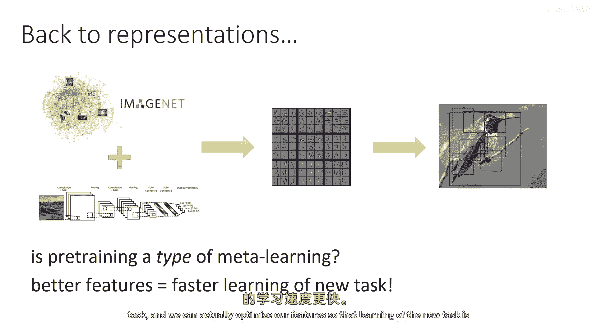
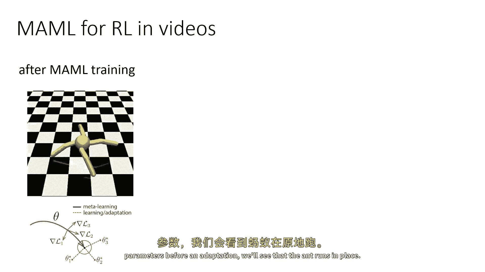
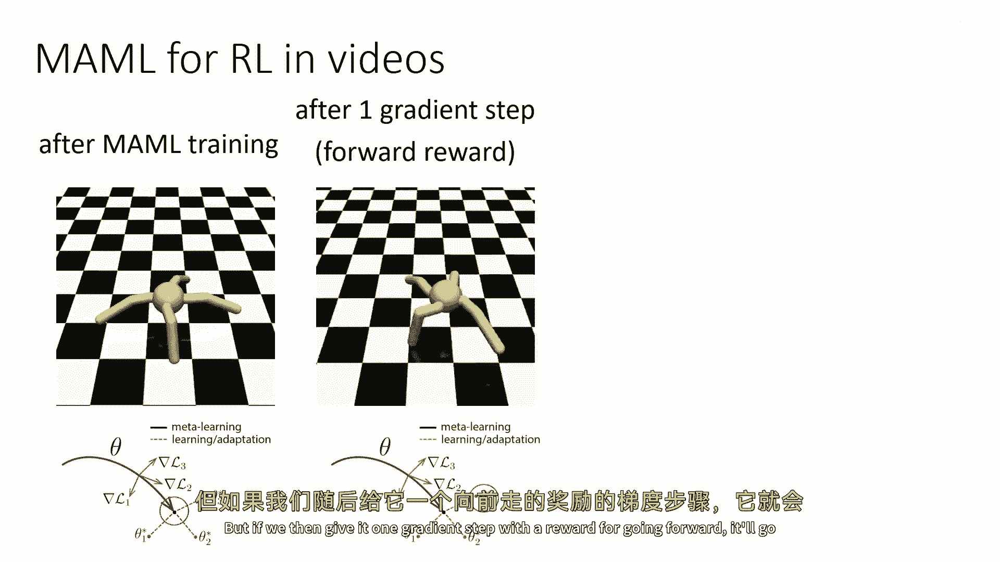
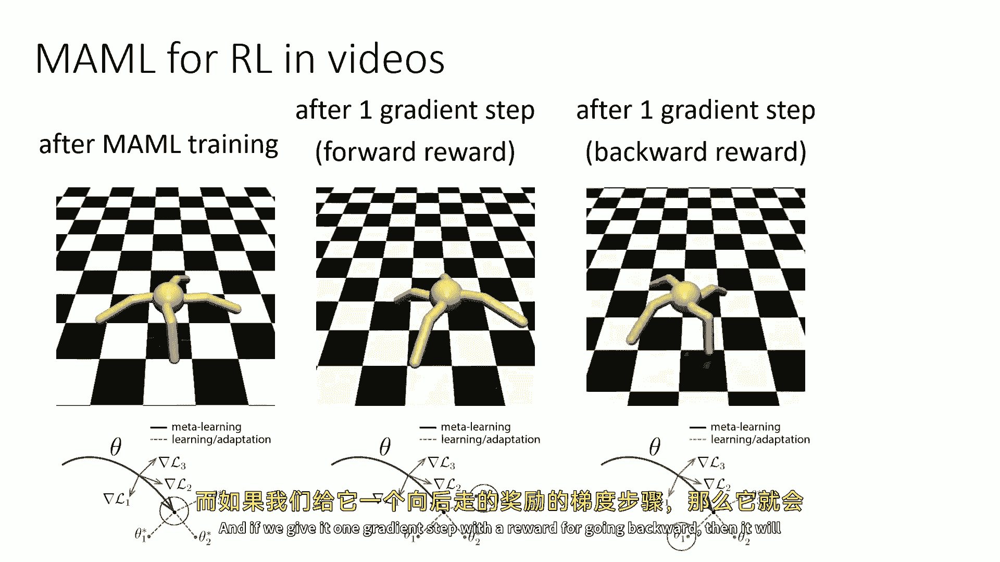
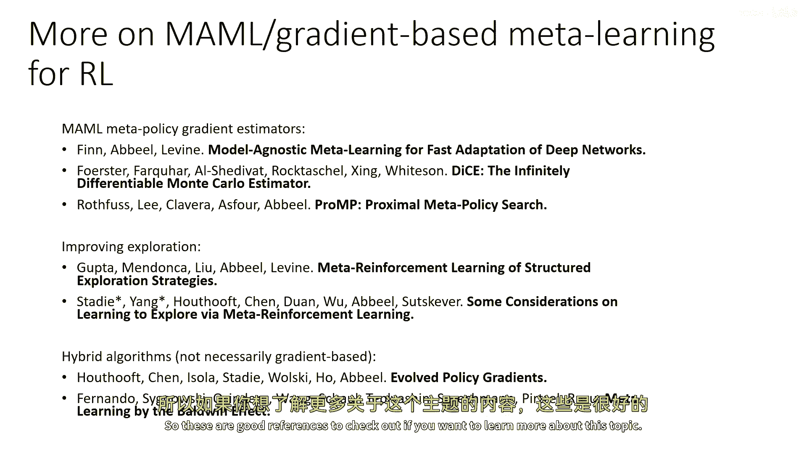

# 94：迁移学习与元学习 🚀

在本节课中，我们将要学习基于梯度的元学习在强化学习中的应用。我们将探讨如何通过优化初始参数，使得模型能够通过少量梯度步骤快速适应新任务。

---

上一节我们介绍了元学习的基本框架。本节中，我们来看看如何将梯度下降过程本身融入到元学习的架构中。

基于梯度的元学习核心思想是：如果我们能学习到更好的特征或初始参数，那么在新任务上进行学习（微调）的速度就会更快。我们可以通过元训练来优化这些初始参数，使得后续的梯度更新能更有效地提升新任务的性能。

这可以形式化地表达为：我们寻找一组初始参数 `θ`，使得在每个新任务 `i` 上执行一次（或多次）梯度更新后，得到的参数 `θ'` 能在该任务上获得高奖励。对于单步梯度更新，其公式为：

`θ' = θ + α * ∇_θ J_i(θ)`

其中，`J_i(θ)` 是任务 `i` 的目标函数（如期望奖励），`α` 是学习率。

---

以下是模型无关元学习（Model-Agnostic Meta-Learning, MAML）的基本思路：

MAML 是一种元学习方法，其学习器 `f_θ` 的结构模仿了基础学习算法（如策略梯度）的更新过程。在监督学习中，这非常直接，可以视为一个包含内部梯度计算的计算图。在强化学习中，虽然计算涉及策略梯度的二阶导数，实现起来更复杂，但原理是相通的。

---

为了更直观地理解，我们可以通过一个参数空间的可视化来思考：

假设参数空间中存在每个任务的最优解 `θ*_i`。MAML 的目标是找到一个初始参数 `θ`，使得从这个点出发，朝任意任务 `i` 的最优方向仅需一个（或少数几个）梯度步就能到达其附近区域。这要求 `θ` 位于所有任务最优解分布的“中心”位置。

---

在实际应用中，MAML 展现出一个优势：在元测试阶段，你可以执行比元训练时更多的梯度步骤，模型依然能良好泛化。这是因为学习过程被编码在了梯度更新的架构中，而不像某些基于 RNN 的元学习器，其“学习”仅发生在单次前向传播中。

例如，在一个训练蚂蚁向不同方向奔跑的任务分布上，经过 MAML 元训练的策略，其初始参数可能使蚂蚁原地跑动。但当给予一个“向前跑”任务的梯度信号并更新一次后，策略就能让蚂蚁向前跑；同理，给予“向后跑”的梯度信号更新后，蚂蚁就能向后跑。

---

如果你想深入了解基于梯度的元学习，特别是其在策略梯度中的实现，可以参考以下方向的论文：
*   描述各种策略梯度二阶导数估计器的论文。
*   讨论如何利用 MAML 改进探索的论文。
*   描述混合优化算法（不一定完全基于梯度，但优化初始化参数的思想类似）的论文。

---

本节课中，我们一起学习了基于梯度的元学习，特别是模型无关元学习（MAML）的核心思想。其关键是将基础学习算法（如梯度下降）的更新步骤作为元学习器的一部分进行优化，从而获得能快速适应新任务的、泛化性良好的初始参数。