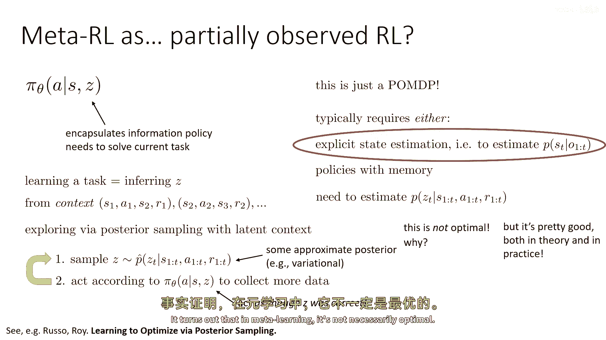
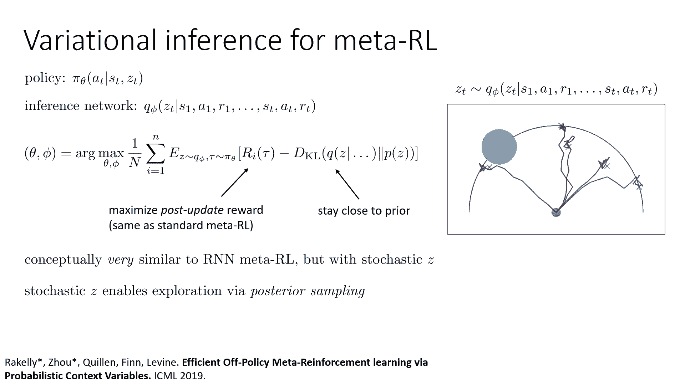
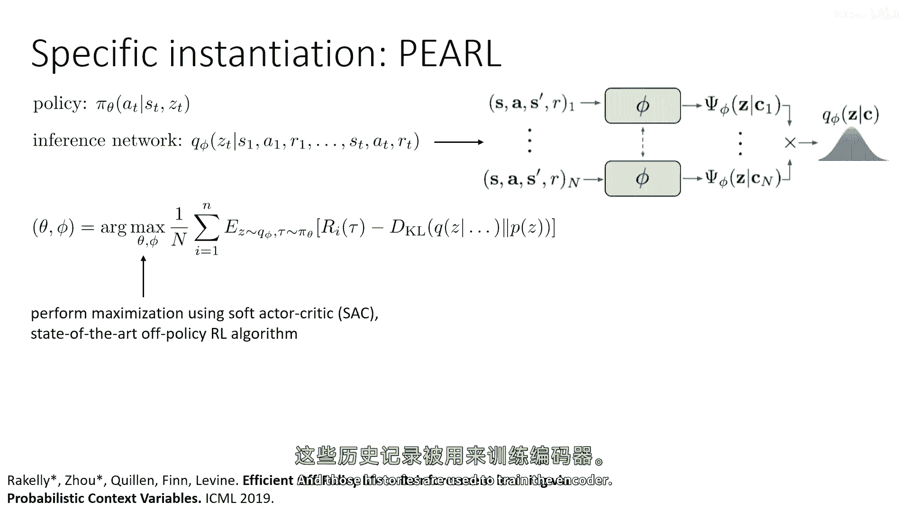
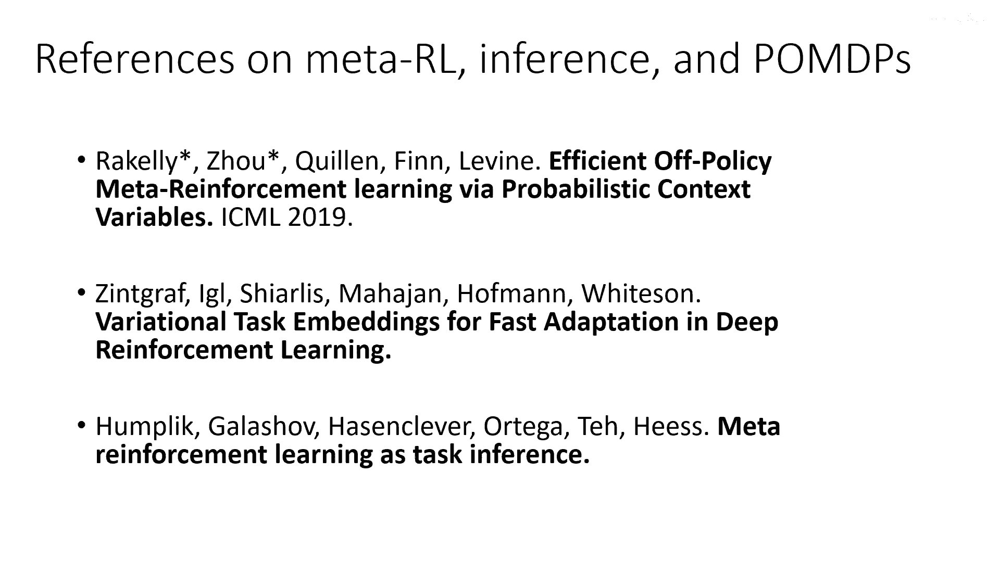
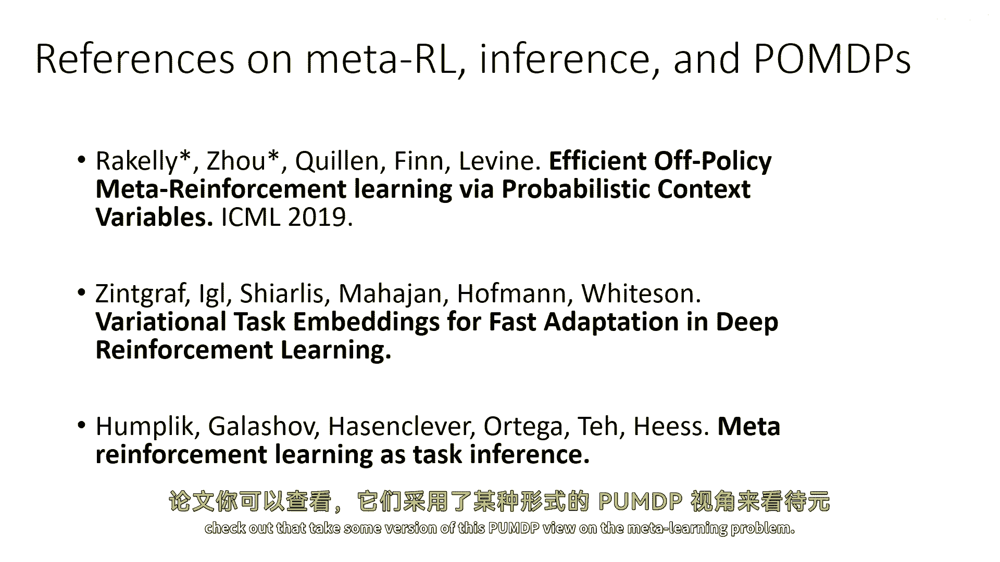
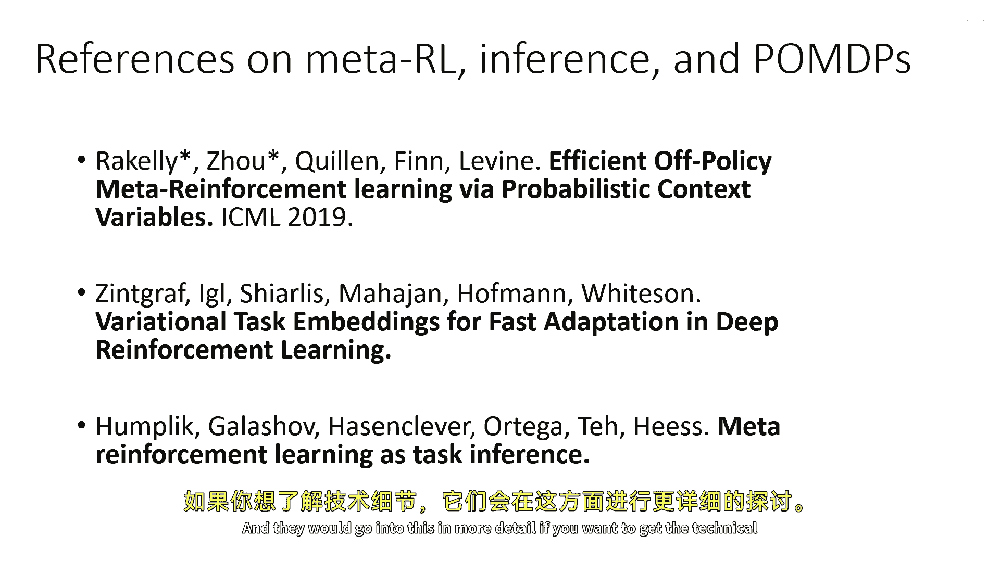
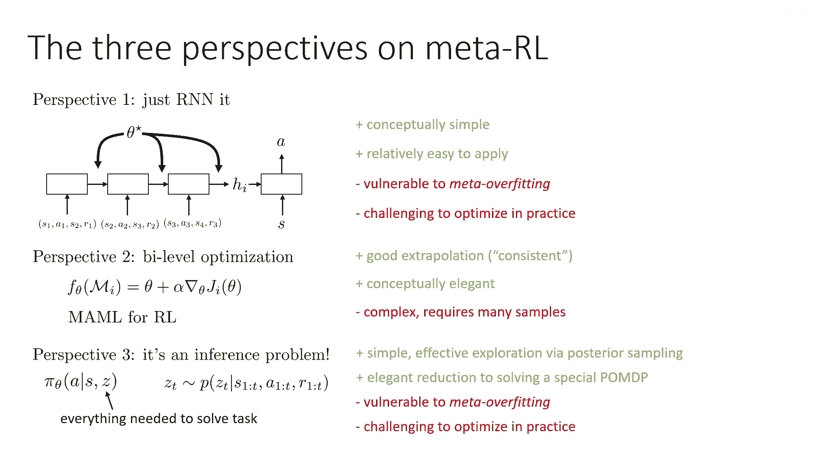
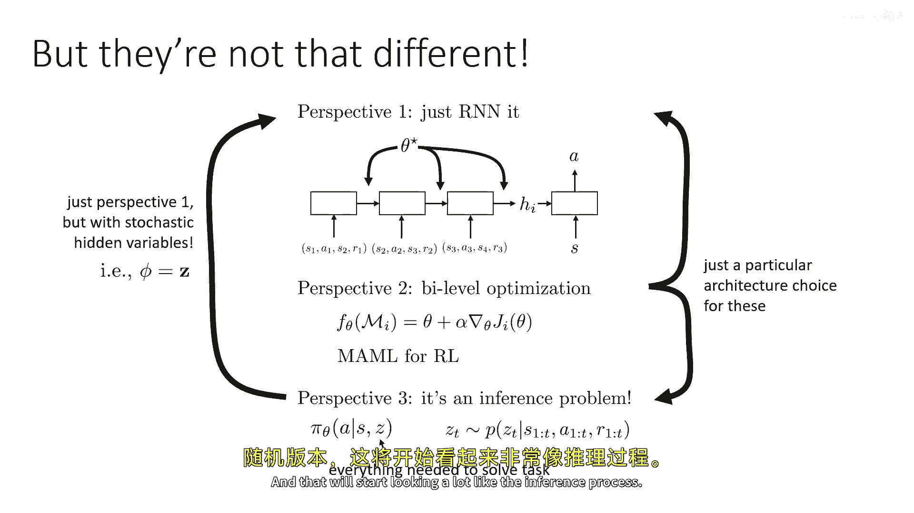
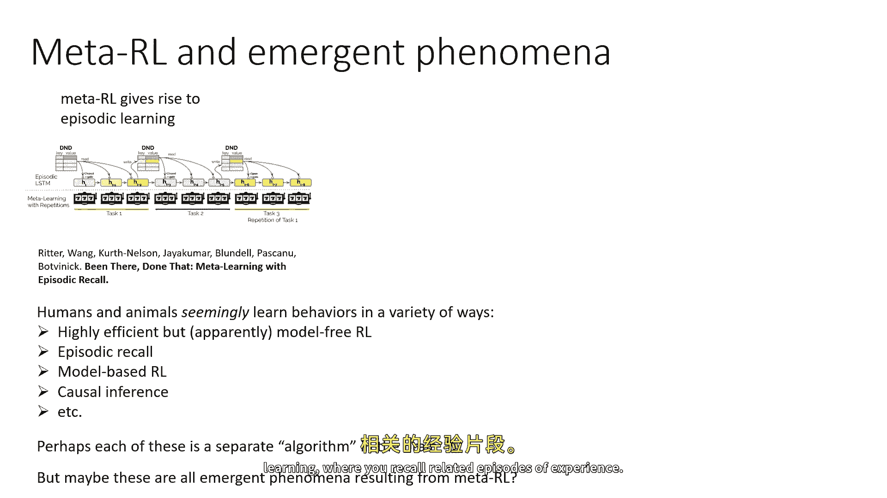
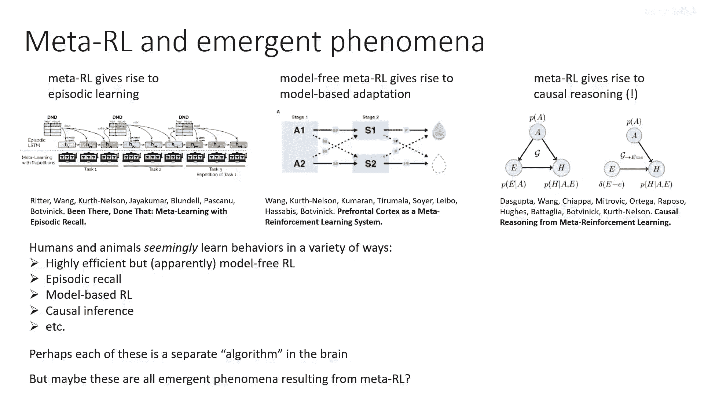

# 95：元强化学习与部分可观测马尔可夫决策过程 🔄

在本节课中，我们将探讨元强化学习（Meta-RL）与部分可观测马尔可夫决策过程（POMDP）之间的深刻联系。我们将看到，元强化学习问题可以被重新表述为一个特殊的POMDP，这为我们提供了一种统一不同元学习方法的视角，并引出了新的算法设计思路。

## 元强化学习作为POMDP 🧩

上一节我们讨论了元学习的基本概念。本节中我们来看看元强化学习如何被形式化为一个部分可观测的马尔可夫决策过程。

一个部分可观测的马尔可夫决策过程（POMDP）是一个具有观察空间和观察概率的MDP。除了状态和动作，它还有一个观察空间 **O** 和观察概率 **P(o|s)**，即在给定状态下观察到特定观察的概率。

在POMDP中，策略必须基于观察来行动。这通常需要显式的状态估计（即一个函数来估计给定观察历史的 **p(s_t)**），或者需要一个具有记忆的策略。

## 任务推断与隐变量Z 🔍

在元强化学习的背景下，我们假设有一个策略 **π_θ(a|s, z)**，其中 **z** 是一个代表策略解决当前任务所需信息的变量。学习任务就相当于推断出 **z** 是什么。

例如，在上下文策略中，**z** 可能代表“是时候洗衣服了”或“是时候洗碗了”。弄清楚该做什么就相当于推断出 **z**。在元学习中，你需要从“语境”（即在新MDP中积累的一系列经验转移）中推断出这个 **z**。

这实际上定义了一个特殊的POMDP。其中，**z** 是你不知道但需要从一系列观察中找出的隐变量。一旦你弄清楚了 **z**，你就可以在已知MDP状态的情况下完成任务。

我们可以定义一个修改后的POMDP **M'**，其状态空间为 **S' = (s, z)**，观察空间为 **O' = s**（通常奖励 **r** 也可以被拼接进观察中）。解决这个POMDP **M'** 就等价于进行元学习，因为如果你能在这个POMDP中获得高奖励（你观察状态 **s**，但任务 **z** 未知），那么你就能解决一个新任务。

## 解决POMDP的两种策略类别 ⚙️

解决任务未知的POMDP通常有两种方法：使用具有记忆的策略（如RNN元学习器）或进行显式的状态估计。接下来，我们将重点讨论后一种方法，它直接导致了一类具有有趣特性的元学习算法。

这类算法旨在直接估计给定状态、动作和奖励历史时，隐变量 **z** 的后验概率 **p(z_t | history)**。由于 **z** 是隐变量，我们将使用变分推断进行训练，以获得任务的学习表示。然后，我们可以通过后验采样（从后验信念中采样 **z**，并根据该 **z** 采取行动）来进行探索。

以下是该过程的基本步骤：
1.  从基于历史的近似后验中采样 **z**。
2.  根据策略 **π_θ(a|s, z)** 行动，仿佛 **z** 是正确的。
3.  收集更多数据，并重复此过程。

元训练将包括训练策略 **π_θ** 和训练对 **z** 的变分近似估计器。虽然基于后验采样的探索在理论上和实践上都相当有效，但它并非最优策略。原因在于，它可能不会主动地、系统性地探索以快速缩小任务的不确定性。

## 实例：PEARL 算法示例 🧪

为了使讨论更具体，我们来看一个基于上述思想的算法实例：PEARL（Probabilistic Embeddings for Actor-Critic RL）。

PEARL 训练一个依赖于状态 **s** 和隐变量 **z** 的策略 **π_θ(a|s, z)**。同时，它训练一个推断网络（编码器）来基于状态、动作和奖励的历史预测 **z** 的后验分布。整个系统通过变分推断进行训练。

其目标是最大化在轨迹分布和编码器推断出的 **z** 分布下的期望奖励，同时最小化 **z** 的后验分布 **q(z)** 与一个简单先验分布（如标准正态分布）之间的KL散度。这鼓励 **z** 仅包含完成任务所需的最少信息。

**概念上，这非常类似于基于RNN的元RL**：读取历史，预测某种统计量（此处是随机变量 **z**），将该统计量传递给策略，并最大化策略的奖励。不同之处在于，编码器是随机的，并且推断的是隐变量 **z**，通过从编码器中采样可以实现探索。

一个简单的编码器设计是：将每个转移 **(s, a, r, s')** 通过一个神经网络映射为特征向量，然后对所有历史转移的特征向量取平均。这个平均后的特征向量再通过一个网络来输出后验分布 **q(z)** 的均值和方差。这种方法非常有效，因为对于许多任务，转换的顺序可能并不重要。

元训练可以使用离线策略的演员-评论家算法（如SAC）进行。唯一的区别是，每次更新时，还需要从经验回放缓冲区中加载一段历史数据来更新编码器。

## 三种视角的统一与比较 🤝

我们已经讨论了元强化学习的三种主要视角，它们都能很好地统一在同一个框架下。

在所有方法中，核心都是一个函数 **f(θ)**，它接受一个MDP **M_i**（或其经验）作为输入，需要从这些经验中改进，并能够选择有效探索的行动。

以下是三种视角的比较：

*   **黑箱模型视角（如RNN）**：
    *   **优点**：概念简单，易于应用。
    *   **缺点**：容易“元过拟合”，即训练后难以在测试任务上进一步改进；优化可能具有挑战性。

*   **基于梯度的元学习视角**：
    *   **优点**：具有良好的外推性，只需在测试时运行更多梯度步骤即可持续改进；概念优雅。
    *   **缺点**：实现可能复杂，需要大量元训练样本；将其扩展到时间差分学习类方法（如演员-评论家）较为困难。

*   **推断视角（如PEARL）**：
    *   **优点**：简单，提供了一种有效的后验采样探索方法，可优雅地归结为求解POMDP。
    *   **缺点**：可能对元过拟合敏感；优化实践可能有一定挑战性。

实际上，这些视角是紧密相关的。推断过程类似于带有随机隐变量的RNN过程。基于梯度的方法也可以通过特定的架构选择（例如，在梯度中添加噪声）来实例化，使其开始类似于推断过程。

## 元学习引发的涌现现象 🌟

最后，一个有趣的观察是，元强化学习可以导致一些“涌现”的学习过程，这些过程与最初用于元学习的基础算法不同。这发生在强化学习与认知科学的交叉点。

研究表明，元学习可以引发出类似于“情景记忆”的学习（快速回忆过去成功的经验）、从模型无关学习中涌现出基于模型的行为，甚至是类似因果推理的能力。这表明，一个通用的“学习如何学习”的框架，可能会在内部衍生出多种多样的、适应特定情况的学习策略。

## 总结 📚

本节课我们一起学习了元强化学习与部分可观测马尔可夫决策过程之间的深刻联系。我们了解到，将元RL问题视为一个POMDP，其中隐变量 **z** 代表任务，为我们提供了一种强大的形式化方法。基于此，我们探讨了通过显式状态估计（变分推断）来解决此类POMDP的方法，并以PEARL算法为例进行了具体说明。最后，我们比较了元RL的三种主要视角（黑箱、梯度、推断），并看到了它们内在的统一性，以及元学习如何可能催生复杂的涌现学习行为。理解这些联系有助于我们更深入地把握元学习的本质，并设计出更强大的算法。