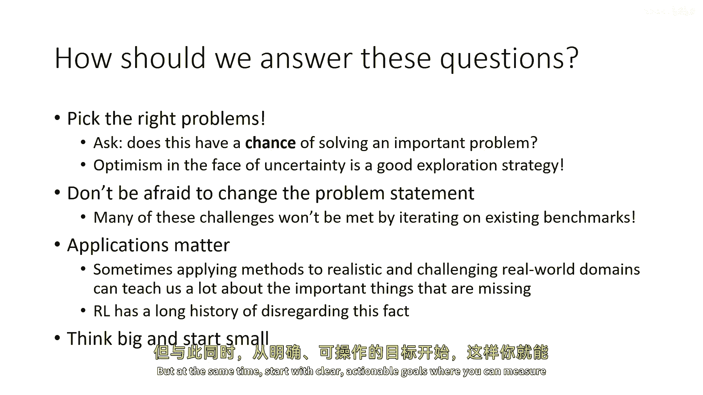

# 97：深度强化学习的挑战与开放问题 🧠

在本节课中，我们将提升视角，探讨深度强化学习（RL）的本质及其不同的哲学观点。我们将讨论RL作为工程工具、作为现实世界学习模型以及作为最普遍学习框架的三种视角，并分析每种视角带来的挑战与机遇。课程最后，我们将思考如何将这些宏观视角应用于具体的研究和实践。

## 强化学习的三种哲学视角

在之前的课程中，我们隐含地探讨了强化学习的各种应用。现在，让我们明确指出，强化学习可以被视为几种非常不同的事物，具体取决于你的视角。以下我们将讨论三种主要视角，但请记住，可能还有更多。

### 视角一：强化学习作为工程工具 🔧

上一节我们介绍了强化学习的多种可能性，本节中我们来看看它最实际的应用之一：作为解决工程问题的工具。

在这个视角下，我们暂时搁置关于通用智能的崇高理想，将强化学习视为一个强大的优化引擎。传统上，解决如火箭轨迹优化等控制问题，需要写下复杂的物理方程并进行求解。强化学习提供了一种替代方法：我们实现描述系统的模拟器代码，然后使用RL来找出控制策略。

**核心过程可以概括为：**
1.  用代码实现物理系统的模拟器。
2.  在模拟器中运行强化学习算法。
3.  RL算法输出控制策略，取代了传统手动推导的过程。

从这个角度看，RL主要是一个将模拟器转化为控制法的“反馈引擎”。它的优势在于能处理非常复杂的系统，其弱点则是仍然需要有人精确地描述和模拟该系统。这甚至算不上严格意义上的“学习”，更像是一种强大的**优化工具**。

这种工具视角已催生了许多进展，例如让四足机器人在崎岖地形上高效行走。未来，RL很可能成为为我们能模拟的任何系统（飞机、车辆、机器人）构建控制器的标准工具。

### 视角二：强化学习作为现实世界学习模型 🌍

从工程工具视角转换过来，我们进入一个更贴近生物学习的视角：RL作为智能体在现实世界中通过试错发现行为的方式。

这个视角的核心挑战由“莫拉维克悖论”提出。该悖论指出：对人类而言困难的事情（如下象棋、抽象思考）对计算机来说可能相对容易；而人类觉得不费吹灰之力的事情（如移动身体、感知世界）对计算机来说却极其困难。这是因为进化压力迫使我们在感知和运动控制上变得极其出色。

**这意味着什么？**
现实世界之所以困难，在于其巨大的多样性和不可预测的意外情况。一个AI系统可能精通围棋，但若被置于荒岛，它无法像人类一样即兴利用资源求生。RL原则上可以解决这类问题，因为它是**通过与环境交互、从反馈中学习并适应**的框架。

然而，我们当前的RL研究很少涉及这类“困难宇宙”的挑战。在“困难宇宙”中，成功等同于生存，世界是开放和变化的，主要问题在于智能体能否**泛化、适应和处理训练数据之外的情况**。

以下是现实世界RL面临的一些具体挑战：
*   **反馈稀疏且延迟**：现实世界没有明确的得分，“生存与否”的反馈来得太晚，需要更直接的监督形式。
*   **持续学习与非片段化**：世界不会重置，智能体需要在环境持续变化中保持坚韧。
*   **利用先验知识与经验**：如何利用过去的经验来引导在新环境中的探索和学习。

为了解决这些挑战，研究者们正在探索各种方法，例如从人类偏好中学习、设计能自动重置的多任务学习系统，以及从先前经验中构建用于引导探索的行为先验。这些方法的核心在于，现实世界学习并非从零开始，而是需要**利用适当类型的先验知识**。

### 视角三：强化学习作为通用学习框架 🧩

最后，让我们探讨一个更宏大、也可能有些激进的视角：强化学习是最基础、最普遍的学习框架，能够包含其他所有学习范式。

为什么这么认为？我们可以从一个根本问题出发：我们为什么需要机器学习（或大脑）？一个有力的观点是：**计算系统的价值由其输出决定，而最终输出就是决策和行动**。无论是控制机器人、驾驶汽车，还是语言模型生成文本，本质上都是在做出一系列决策，这些决策会引发现实世界的后果。

如果机器学习的核心是做出好的决策，那么RL就提供了一个天然框架。与监督学习（模仿数据分布）或无监督学习（建模数据分布）不同，RL直接**优化决策以实现目标**。

由此，我们可以构想一个更强大的学习“配方”：
1.  **无监督RL预训练**：利用大量、多样但质量较低的数据（如互联网文本、视频），训练系统掌握“如何实现各种可能的结果”（即掌握技能），而不指定具体任务。这类似于语言模型的预训练，但是为决策而定制的。
2.  **有监督微调**：使用相对少量的高质量监督（如人类反馈、任务奖励），引导预训练系统专注于完成我们**真正想要**的任务。

这种视角认为，将RL作为核心框架，比单纯建模数据分布更能有效地利用海量数据来做出优质决策。一些实验已经展示了这种思路的潜力，例如在机器人上先进行无目标（目标条件化）的RL预训练，再快速微调以适应新任务；或者利用大型语言模型作为模拟器，再用RL优化出更高效的对话策略。

## 总结与展望 🚀

本节课我们一起探讨了深度强化学习的三种不同哲学视角：作为工程工具、作为现实世界学习模型以及作为通用学习框架。每种视角都揭示了RL的不同潜力和面临的独特挑战。

*   作为**工程工具**，RL是强大的优化器，能将模拟转化为控制。
*   作为**现实世界学习模型**，RL是应对莫拉维克悖论、处理开放世界泛化和适应的关键。
*   作为**通用学习框架**，RL为利用海量数据做出最优决策提供了统一范式。

这些宏观视角提醒我们，在选择研究或应用方向时，需要考虑一些重要原则：
*   **关注上限高的问题**：思考你的工作是否可能解决真正重要的问题。
*   **保持战略乐观**：在不确定性中，乐观是探索和研究的最佳策略之一。
*   **勇于改变基准**：经典RL的假设可能不足以解决新挑战，改进问题定义本身是必要的。
*   **重视实际应用**：将方法应用于真实、复杂的领域能揭示哪些问题真正关键。
*   **胸怀大志，从小处着手**：思考宏大图景，但从具体、可验证的假设开始实践。

最终，深度强化学习的未来很可能融合上述多种视角，结合模仿学习、模型预测等元素，朝着构建能做出复杂决策、适应真实世界的智能系统迈进。