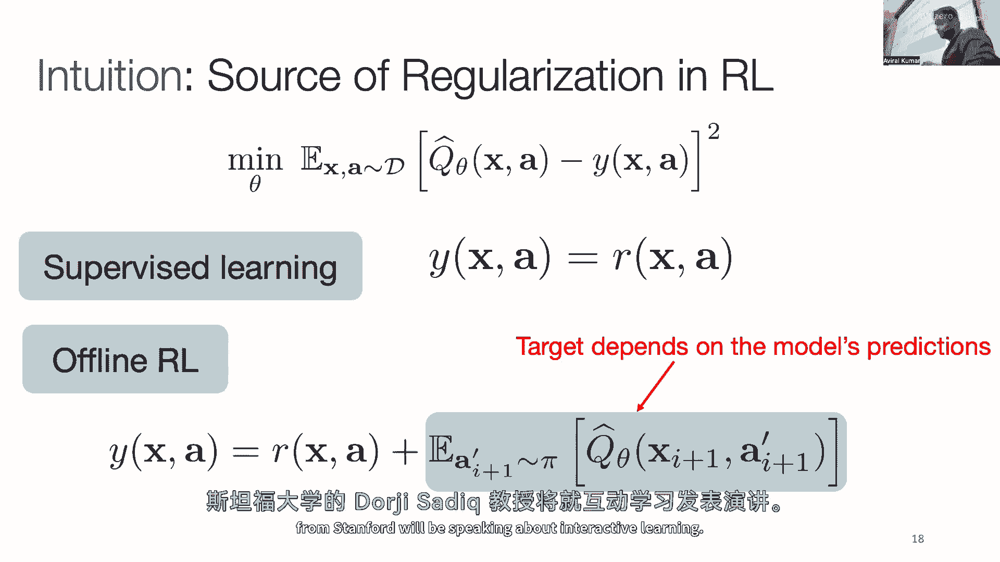

# 98：离线强化学习与大型模型预训练 🧠

在本节课中，我们将学习如何将离线强化学习（Offline RL）与大型模型预训练范式相结合。我们将探讨如何利用海量数据（包括非结构化数据，如人类视频）来预训练模型，如何解决训练大型模型时的扩展性问题，以及如何有效地对预训练模型进行下游任务微调。

---

## 第一部分：扩展离线强化学习模型 📈

上一节我们介绍了离线强化学习的基本范式。本节中我们来看看，当我们试图使用更大的模型和更多的数据时，会遇到哪些挑战，以及如何解决。

离线强化学习的标准范式是利用已有的交互数据，学习一个能最大化奖励的策略。这类似于标准的机器学习流程：数据 -> 模型 -> 部署。

然而，当我们尝试使用更大的模型（例如更深的神经网络）来处理更复杂的问题（如同时玩多个Atari游戏）时，一个反直觉的现象出现了：某些离线RL算法的性能随着模型容量的增加而**下降**，而简单的模仿学习方法却能从中受益。

为了理解这一差异，我们需要引入“隐式正则化”的概念。在监督学习中，当使用随机梯度下降（SGD）等优化器训练一个参数极多的过参数化模型时，优化过程会隐式地倾向于找到“更简单”的解决方案（例如参数范数较小的解），这有助于模型泛化。其目标可以形式化地表示为找到参数θ，最小化以下损失：
`L(θ) + λ * R(θ)`
其中 `R(θ)` 就是隐式正则化项。

在离线Q学习中，由于目标值`y`依赖于正在训练的Q函数本身（`y = r + γ * max_a‘ Q(s‘, a‘)`），这形成了一个循环依赖。经过推导发现，其隐式正则化项与监督学习不同，它包含一个相互冲突的项：
`R_RL(θ) ≈ ||φ_θ(s)||^2 - φ_θ(s) · φ_θ(s‘)`
第一项惩罚特征向量的范数（是好的），第二项却鼓励增大连续状态特征向量的点积（可能导致不稳定）。

**解决方案**是显式地在离线RL算法的损失函数中添加一个正则化项，以抵消这个有害的第二项。例如，在训练Q函数时，添加一个损失项来最小化 `φ_θ(s) · φ_θ(s‘)`。实验表明，这样简单的修改就能使离线RL算法像监督学习一样，从模型容量的增加中稳定获益。

---

## 第二部分：利用任意数据源进行预训练 🎥

上一节我们讨论了如何让算法适应更大的模型。本节中我们来看看如何利用形式不匹配的任意数据（例如人类视频）进行预训练。

一个理想的预训练范式是：使用**所有相关数据**（不仅仅是当前任务的数据）训练一个通用模型，然后针对特定的下游任务进行微调。对于机器人控制，我们不仅可以使用机器人数据集，还可以利用海量的互联网人类视频数据。

挑战在于，人类视频数据不包含机器人的动作标签，且 embodiment（身体形态）完全不同。我们的解决方案是：**不直接从视频学策略，而是学习有用的状态特征表示**。

具体流程如下：
1.  **预训练价值函数**：在人类视频数据上，训练一个目标条件化的价值函数 `V(s, g)`。这个函数评估从状态`s`到达目标状态`g`的难易程度。我们选择对“最优到达策略”建模，以平衡通用性和实用性。
2.  **提取视觉编码器**：这个价值网络的编码器部分学会了提取与任务和动态相关的有用特征。
3.  **下游策略学习**：将预训练好的编码器固定，作为机器人策略网络的视觉输入端。然后，在相对少量的机器人交互数据上，使用离线RL算法（如保守Q学习）来训练策略和Q函数。

**为什么有效？** 通过贝尔曼方程训练的价值函数，被迫理解视频中的状态转移动态和时序结构，这促使编码器学习到对于规划和控制至关重要的特征表示。

实验证明，通过这种方式预训练的特征，在机器人数据集上能产生更准确、更单调的价值估计，并且最终训练出的策略在抓取、操作等任务中表现更鲁棒、泛化能力更强。

以下是几种预训练方法的对比：
*   **无视频预训练**：仅使用机器人数据。
*   **自监督学习（如掩码重建）**：在视频上学习通用视觉特征。
*   **对比学习**：在视频上学习区分不同帧。
*   **我们的方法（价值函数预训练）**：在视频上学习与动态和目标相关的特征。

结果表明，我们的方法在最终任务成功率上显著优于其他对比方法。

---

## 第三部分：从预训练模型到高效微调 ⚙️

上一节我们学习了如何获得一个预训练好的模型初始化。本节中我们来看看如何在下游任务上，用有限的在线交互数据对这个初始化进行高效微调。

设定：我们已有一个通过海量离线数据预训练好的策略。现在，我们希望在一个新任务上，通过有限的在线试错来快速改进这个策略。

一个朴素的方法是直接继续运行离线RL算法（如保守Q学习 CQL），将新收集的在线数据不断加入回放缓冲区。但这通常会导致两个问题：
1.  **性能骤降**：在微调初期，策略性能可能会突然大幅下降。
2.  **改进缓慢**：即使恢复后，性能提升的速度也很慢。

通过分析发现，**性能骤降与学习到的Q值剧烈膨胀高度相关**。在CQL中，算法会悲观地压低数据分布外动作的Q值。当在线探索执行一个新动作并收到奖励时，这个动作的Q值会从被压低的水平急剧上升，形成一个“尖峰”。策略优化会立即利用这个尖峰，导致策略追逐这个可能并非真正最优的“幻觉”高值动作，从而造成性能崩溃。

**解决方案：校准Q值尺度**。我们修改算法，约束学习到的Q函数不能低于一个参考Q函数，例如数据集中行为策略的Q值（可以通过简单的蒙特卡洛回报来估计）。这个约束防止了Q值在预训练阶段被压得过低，从而避免了在线微调时因Q值剧烈膨胀而产生的“尖峰”。

采用这种“校准”后的算法进行微调，可以得到更稳定、更快速的性能提升曲线：它既没有初期的严重性能下降，其上升斜率也远高于朴素的在线微调方法。这使得我们能够以最小的“后悔”累积，高效地将一个通用的预训练策略适配到具体的下游任务。

---

## 总结 📝

本节课中我们一起学习了离线强化学习与大型模型预训练的前沿结合。
*   我们首先看到，通过分析并修正离线RL中的隐式正则化项，可以解决大模型训练不稳定的问题，使其能够有效扩展。
*   接着，我们探索了如何利用人类视频等任意数据源，通过预训练目标条件化价值函数来学习对下游控制任务有用的特征表示，从而突破机器人数据稀缺的瓶颈。
*   最后，我们探讨了如何通过校准Q值尺度的方法，实现从预训练模型到下游任务的高效、稳定微调，避免性能崩溃并加速在线学习。

这三个部分共同构成了一套完整的“预训练-微调”范式，为将大规模基础模型的思想应用于决策与控制领域提供了可行的技术路径。