# 99：交互式学习与大型模型在机器人学中的应用 🧠🤖

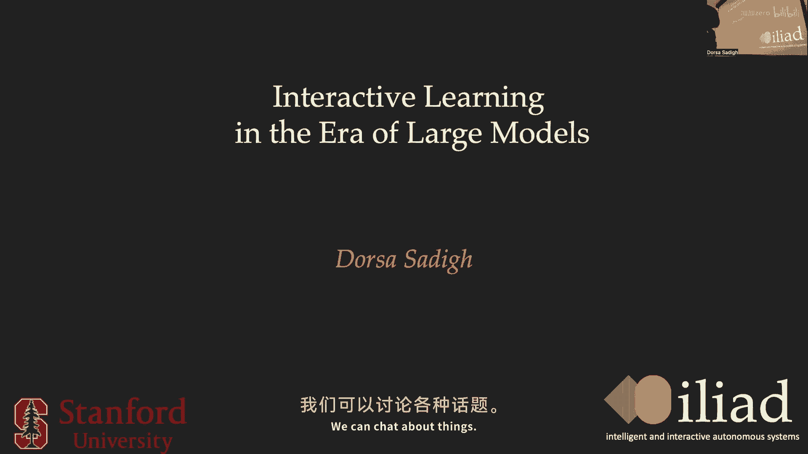

在本节课中，我们将学习交互式学习的概念，探讨如何从人类反馈中学习，并了解大型语言模型和视觉语言模型如何改变我们构建和训练机器人系统的方式。

---

## 概述：什么是交互式学习？ 🤔

交互式学习是指从各种人类数据源中学习的想法。你可以学习一个机器人策略，可以学习一个奖励函数，也可以学习一种表示。核心思想是，有一个人类正在提供数据。你可以与那个人类交互，或者你可以从那个人类那里收集离线数据，然后尝试从中学习。

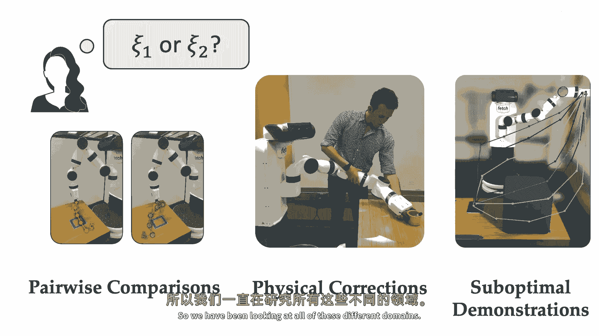

上一节我们介绍了交互式学习的基本概念，本节中我们来看看其具体应用和挑战。

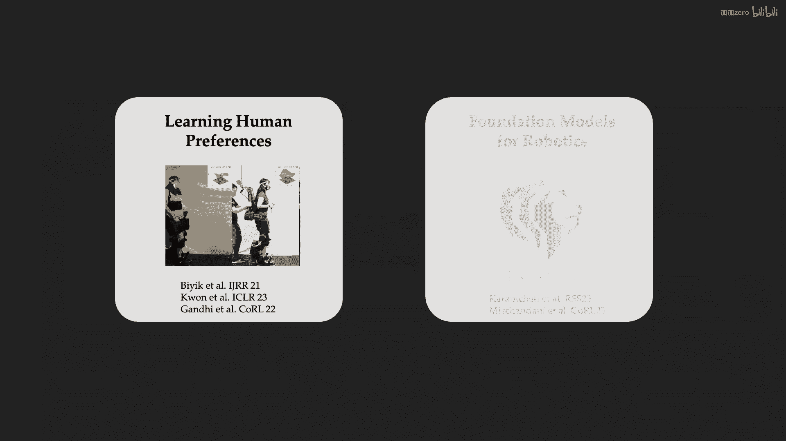

---

## 从人类偏好中学习奖励函数 📊

当我们向人们提问时，例如展示两条不同的路径并询问他们更喜欢哪一条，我们可以尝试构建一个人的行为模型，或者找出人们希望机器人如何行动。奖励函数是一种可以从这些比较中学习的紧凑表示。

### 理论基础：线性奖励模型

假设奖励函数是一组非线性特征的线性组合。公式可以表示为：
`R(τ) = w^T φ(τ)`
其中 `w` 是权重向量，`φ(τ)` 是轨迹 `τ` 的特征向量。

每一个来自人类的偏好比较（例如，轨迹 A 优于轨迹 B）都对应于权重空间 `w` 中的一个分隔超平面。人类的回答（偏好 A 或偏好 B）告诉我们真实的 `w` 位于超平面的哪一侧。

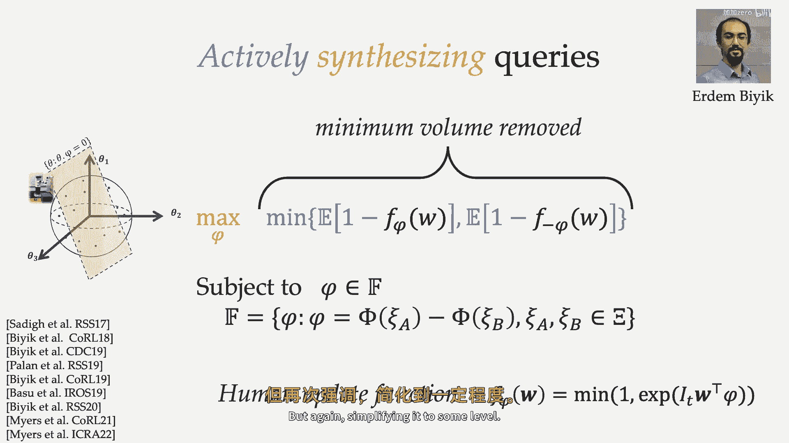

### 主动学习与信息收集

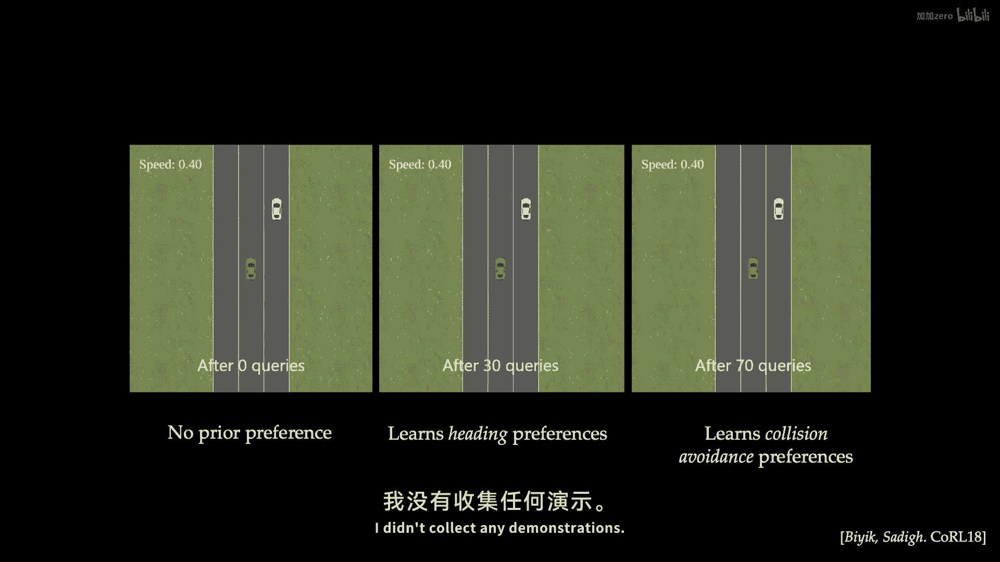

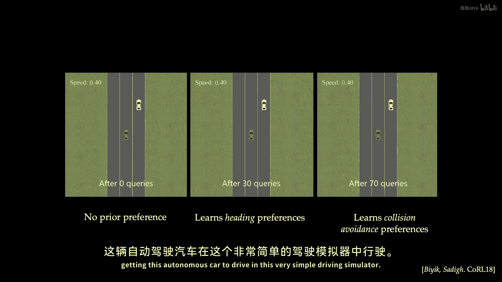

以下是我们如何通过主动提问来高效学习奖励函数：

*   **目标**：找到一组信息丰富且多样化的问题（即轨迹对），以快速缩小对真实奖励函数 `w` 的搜索范围。
*   **方法**：优化一个信息论度量，例如最大化从假设空间中移除的预期体积。我们寻找能最大程度减少假设空间不确定性的问题。
*   **挑战**：在机器人设置中，我们需要在连续空间中合成满足动力学约束的轨迹，而不仅仅是从一个有限的库中选择。

### 实际应用与价值

在简单的驾驶模拟器中，仅通过询问约70个二进制偏好问题，就能学习到避免碰撞和驾驶等复杂行为。这表明从偏好中学习可以是一种高效的数据获取方式。

在机器人学和人机交互领域，主动学习带来的样本效率提升（例如，半小时对比三小时）比在许多传统机器学习设置中更为重要。

---

## 超越人类：利用大型语言模型作为奖励源 💬

除了直接询问人类，我们还可以利用大型语言模型（LLMs）和视觉语言模型（VLMs）作为人类偏好的代理或奖励函数。

### 案例研究：谈判代理

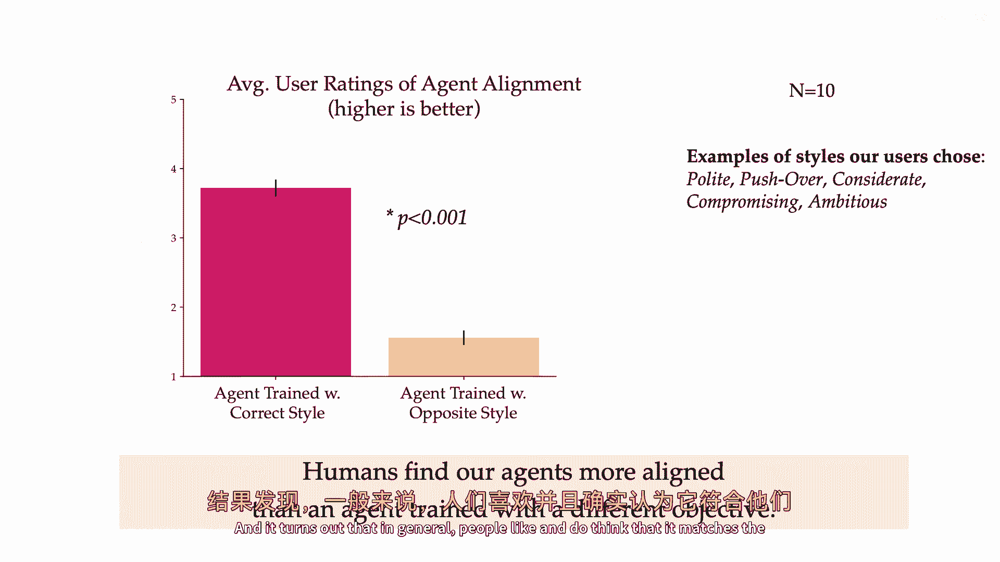

在一个谈判游戏中，目标是训练一个AI代理（Alice）与人类（Bob）进行谈判。传统的强化学习代理可能过于激进，而纯粹的模仿学习代理可能过于顺从。

**解决方案**：使用LLM作为奖励信号的来源。
1.  我们提示LLM评估Alice在谈判中的行为（例如，“这次谈判是否灵活？”）。
2.  从LLM的输出（如“是/否”或对数概率）中获取信号。
3.  将此信号用作奖励函数或正则化器，来训练强化学习代理。

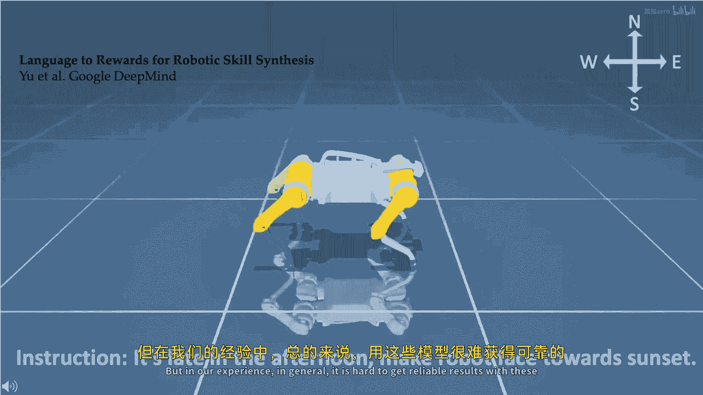

结果发现，使用LLM作为代理奖励的谈判代理，其行为风格（如灵活性）与人类评估的真实奖励高度匹配，且优于基线方法。

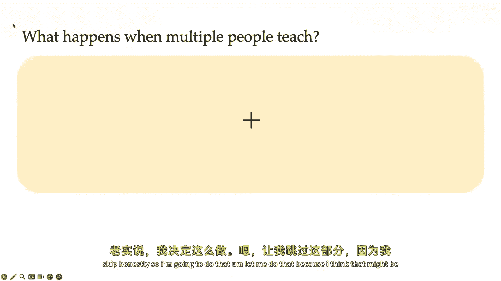

### 在机器人学中的应用与挑战

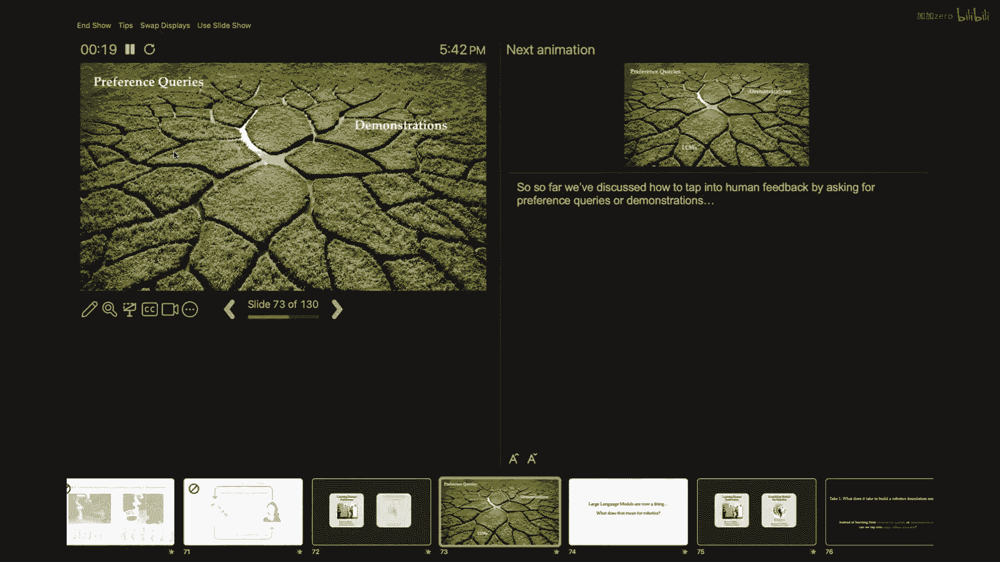

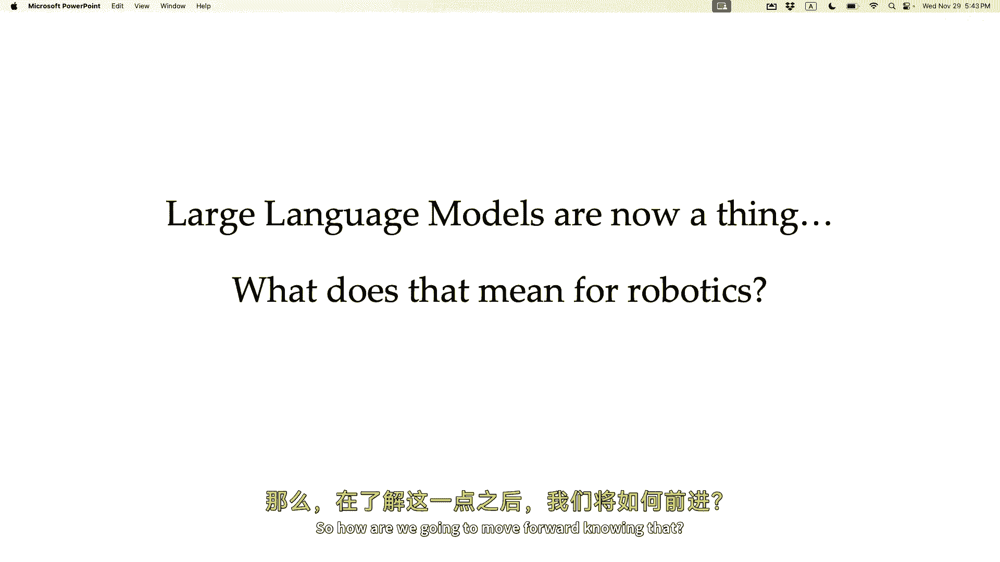

LLMs和VLMs也可用于为机器人任务提供高级语义指导。例如，根据“面向日落”或“像狗一样坐下”等语言指令，让LLM输出奖励函数的权重，然后通过模型预测控制来优化行为。

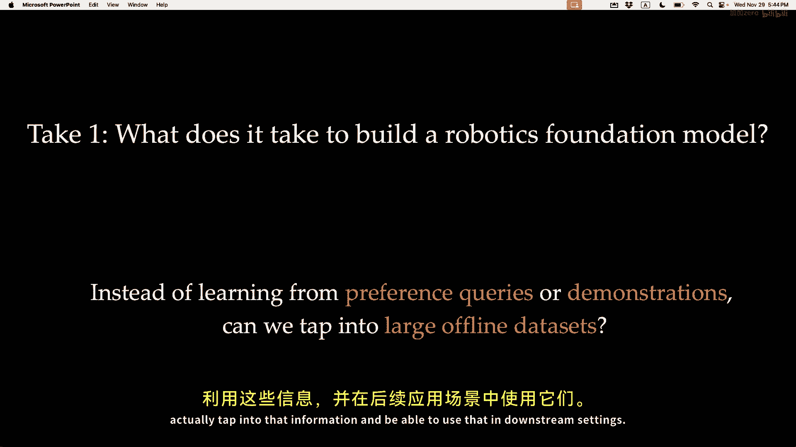

**主要挑战**：
*   **接地问题**：LLMs/VLMs生成的知识如何与物理世界和具体的机器人状态估计可靠地关联。
*   **结果可靠性**：目前从这些模型中获取可靠、一致的奖励信号仍具挑战性，尽管它们在快速改进。

---

## 构建机器人基础模型：大规模预训练 🏗️

另一个宏伟的愿景是像训练LLM一样，利用海量离线数据为机器人训练一个“基础模型”。

### 关键问题：学习有用的视觉表示

我们希望学习的视觉表示既能捕捉**语法**（局部、空间细节，利于抓取），也能捕捉**语义**（高级概念，利于理解任务）。现有方法各有利弊：
*   **掩码自编码**：擅长重建像素细节（语法），但可能丢失高级语义。
*   **对比学习（如CLIP）**：擅长对齐图像与文本语义，但破坏了局部空间特征。

### Voltron模型：连接语法与语义

Voltron模型的核心思想是使用**语言作为连接语法和语义的桥梁**。
*   **训练目标**：结合基于语言的掩码图像重建和语言生成，同时以多帧为条件来捕捉动态信息。
*   **优势**：在人类视频上预训练的Voltron模型学到的表示，更能同时捕捉语义、语法和任务动态。在下游的机器人模仿学习任务中，仅用少量演示微调即可取得良好效果。
*   **零样本能力**：该模型甚至能在未见过的机器人视频上进行零样本的意图推断。

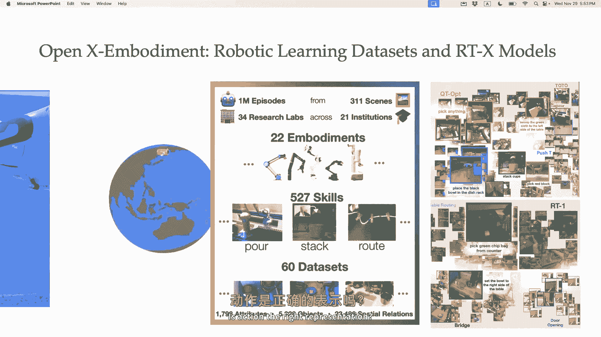

### 未来的方向：RT-X与大规模机器人数据

业界正在努力收集大规模、多样化的机器人交互数据集（如RT-X项目），旨在跨不同机器人平台和技能训练真正通用的机器人基础模型。这涉及到应该预训练何种表示（视觉、动作、或视觉-语言-动作）以及如何适应下游任务等重要问题。

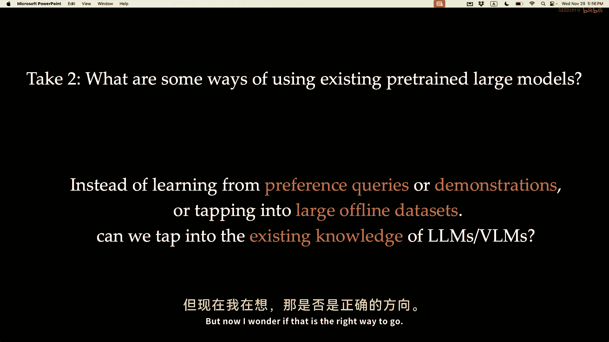

---

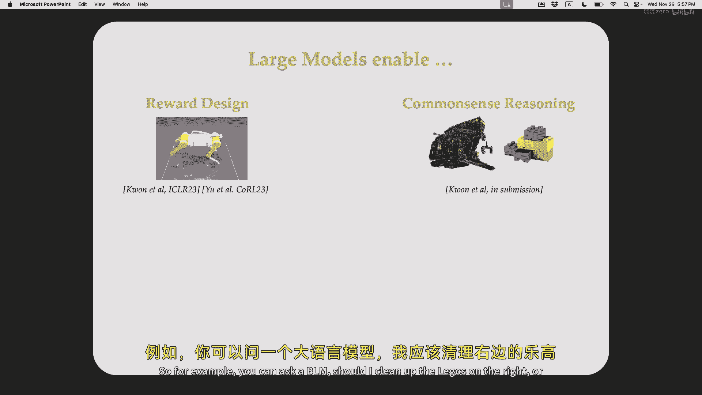

## 创造性使用现有大模型：超越语义的模式机器 🧩

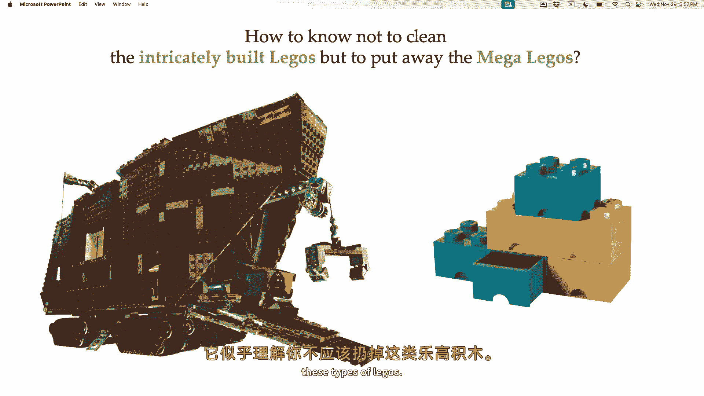

除了利用LLMs/VLMs的丰富语义知识，我们还发现它们可以作为强大的**模式识别机器**，即使输入是没有语义意义的抽象模式。

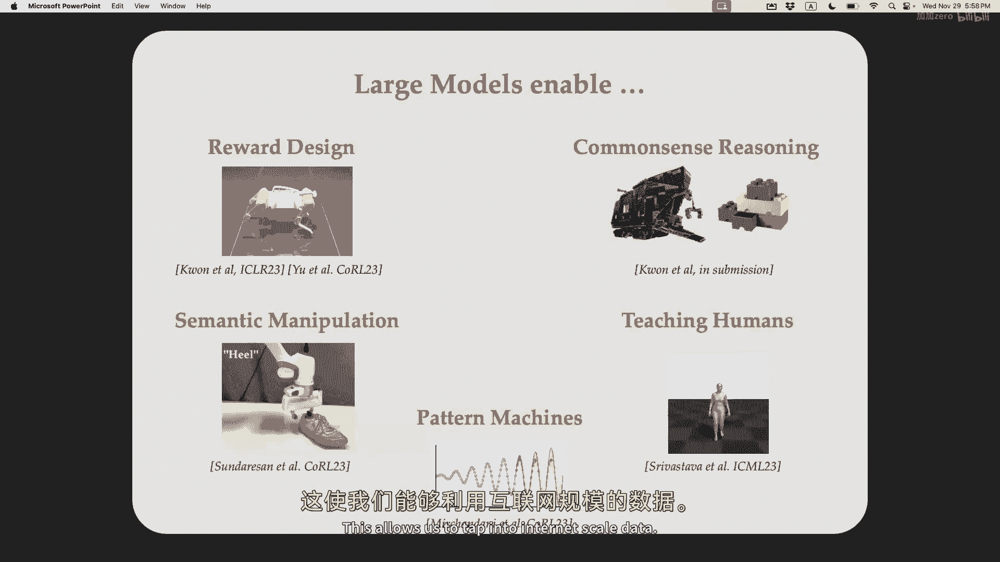

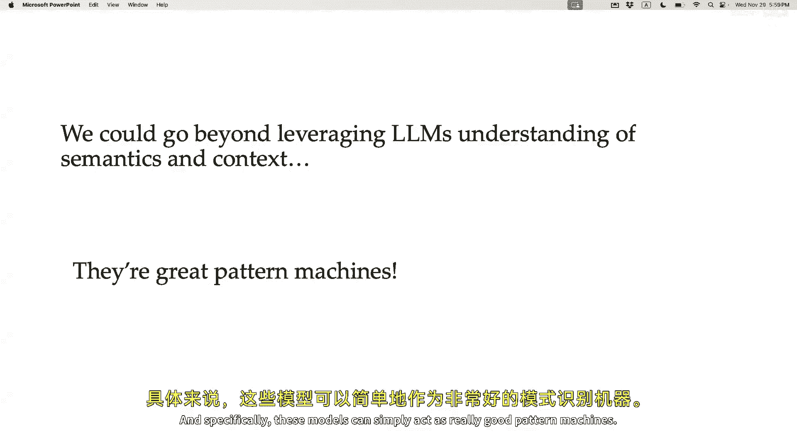

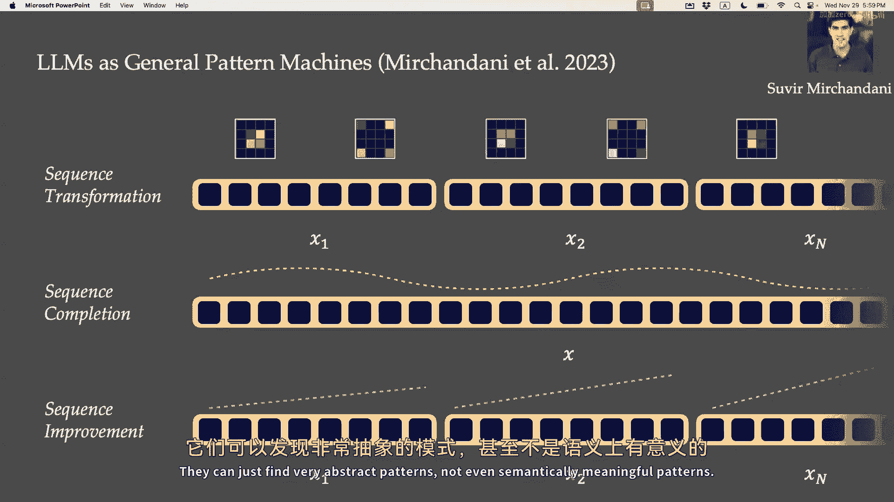

### 令人惊讶的能力

1.  **序列转换与延续**：将图像或机器人末端执行器的轨迹离散化为数字序列输入LLM，它可以识别并延续这些空间或时间模式。
2.  **隐式优化**：在上下文示例中提供（状态，奖励）对，LLM能够输出高奖励的轨迹，表现出类似基于奖励的优化能力。

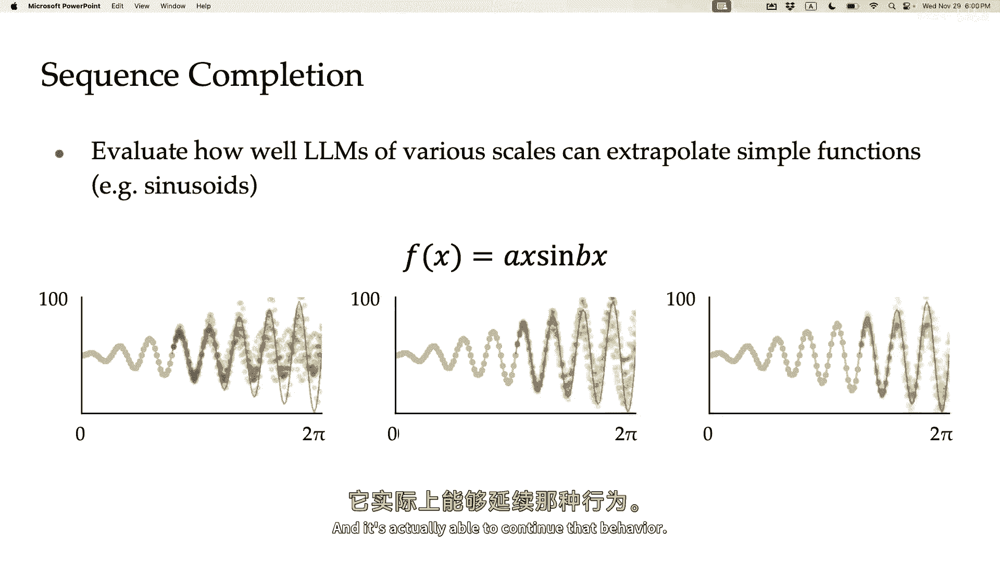

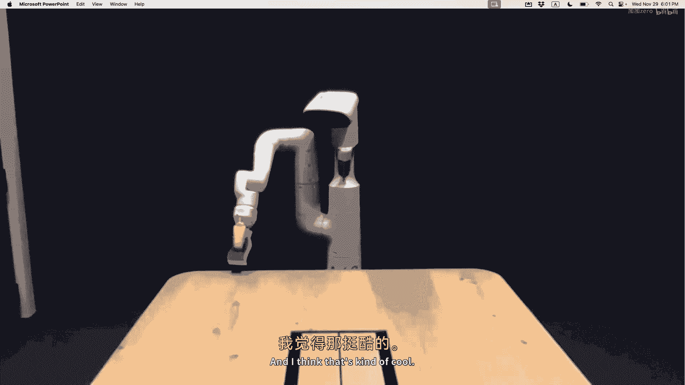

### 启示

这表明LLMs的能力可能远超我们的预期。它们不仅是知识的容器，也是强大的模式提取和延续引擎。这为机器人学开辟了新的可能性，例如用于轨迹生成、数据增强或提供新颖的学习信号。

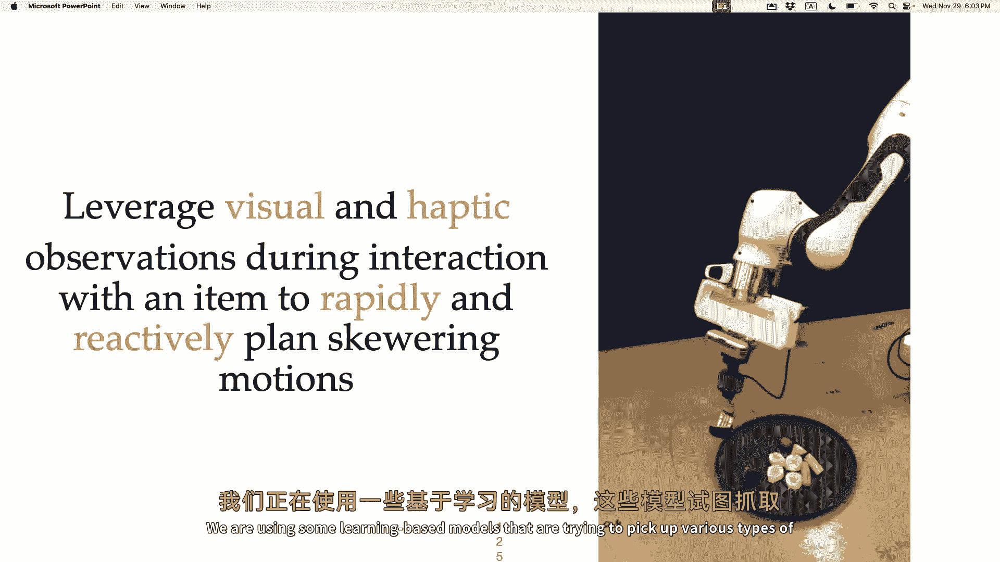

---

## 总结与展望 🎯

本节课中我们一起学习了交互式学习的核心思想及其演变：

1.  **从人类反馈中学习**：我们可以通过主动询问偏好等高效方式，学习代表人类意图的奖励函数。
2.  **利用大型预训练模型**：LLMs和VLMs可以作为人类偏好的强大代理（用于奖励设计、常识推理等），也可作为模式识别引擎。
3.  **构建机器人基础模型**：通过精心设计的目标在大规模数据（人类视频或机器人数据）上预训练模型，是获得通用、可迁移机器人能力的重要途径。

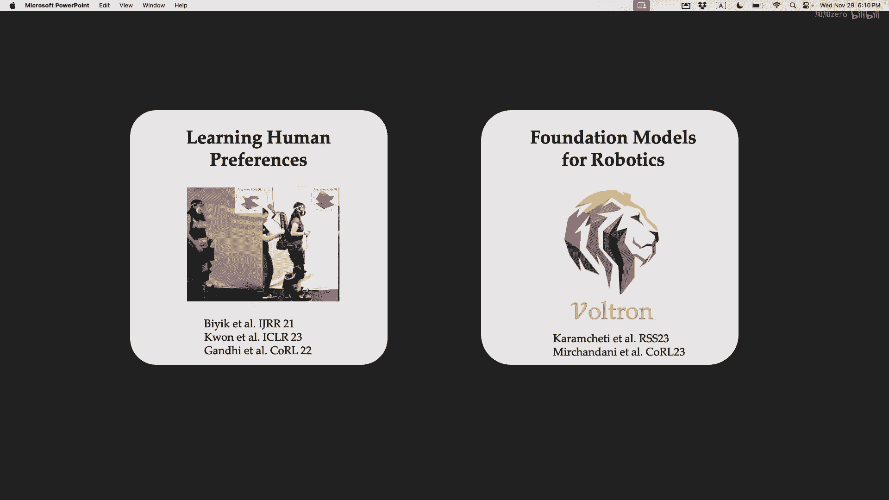

当前，我们正处在一个激动人心的交叉点：如何最有效地结合**人类反馈**、**大规模离线数据**以及**大模型的现有知识**，来构建更智能、更适应、更符合人类价值的机器人系统，是未来研究的关键方向。