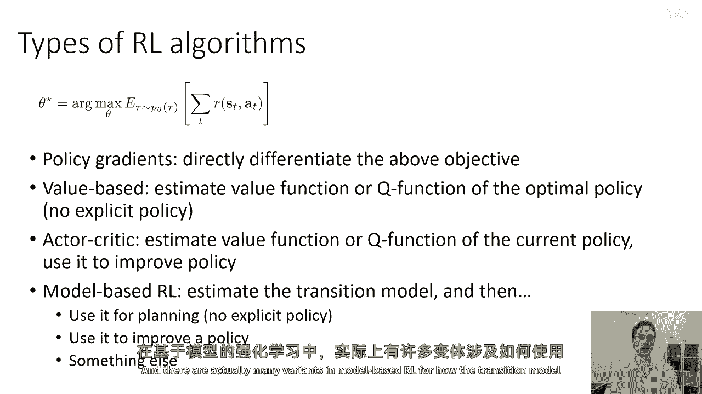
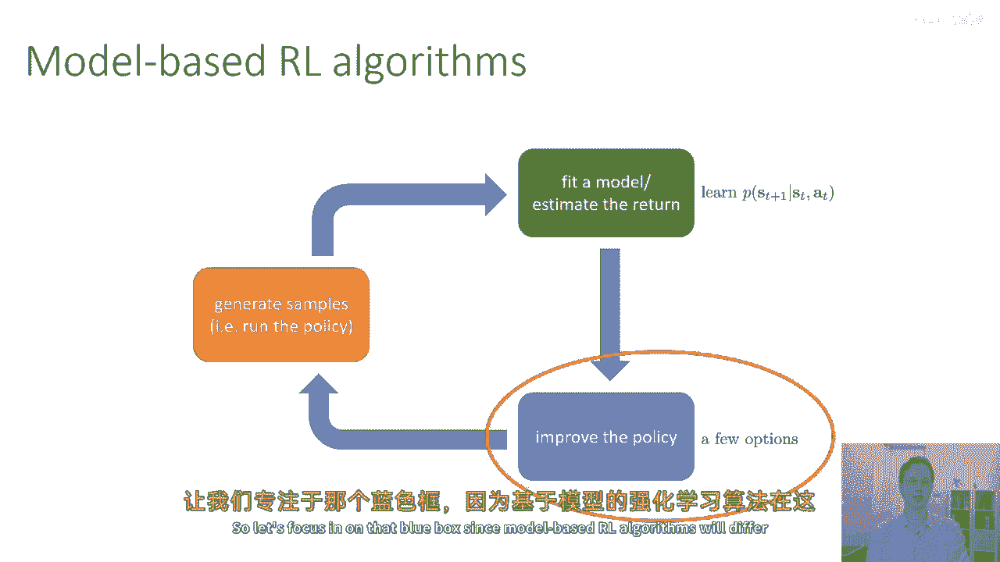
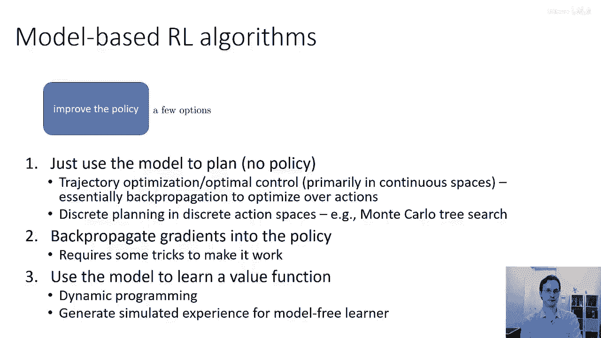
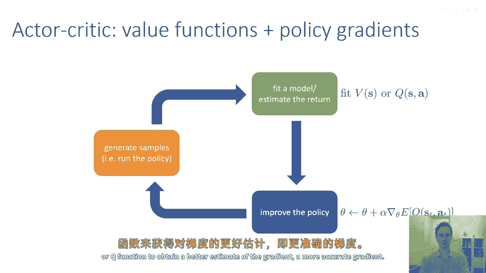
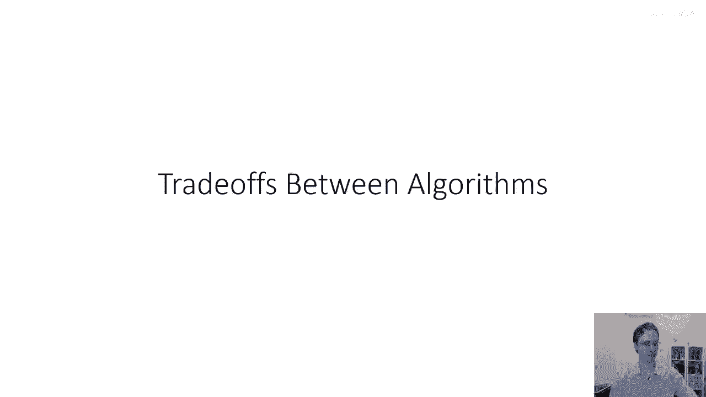

# 【深度强化学习 CS285 2023】伯克利—中英字幕 - P12：p12 CS 285： Lecture 4, Part 4 - 加加zero - BV1NjH4eYEyZ

在接下来的讲座部分，我将给你们进行一个快速的概览，通过不同种类的强化学习算法，在接下来的几堂讲座中，我们将对这些类型进行更详细的讨论，但现在，我们将只讨论这些类型的是什么。

以便它们 later 不会作为惊喜出现，所以，rl 算法将覆盖，通常将优化我之前定义的 rl 目标，即策略，梯度算法试图直接计算这个目标的导数与 respect to theta，然后。

使用那个导数值进行基于方法的梯度下降过程，估计最优策略的价值函数或q函数，然后使用这些价值函数或q函数，这些价值函数或q函数通常由像神经网络这样的函数近似器表示，以改进策略，常常。

纯价值函数甚至不直接代表策略，而是隐式地代表像q函数的arg max一样东西，演员批评方法是两种演员批评方法的一种混合体，学习一个q函数或价值函数，然后使用它来改进策略。

通常通过使用它们来计算更好的政策梯度，然后，基于模型的强化学习算法将估计过渡模型，它们会，它们会估计过渡概率模型的一些模型t，然后，它们将使用过渡模型直接进行规划，而不需要任何明确的政策。

或使用过渡模型来改进政策，嗯，实际上，基于模型的强化学习有许多变体，关于如何使用过渡模型。

好的，让我们从我们的对话开始，基于模型的强化学习算法，所以，对于基于模型的强化学习算法来说，绿色框通常包含学习一些关于状态t+1给定状态t的p模型，逗号at，所以，这可能是一个神经网络。

它接受st逗号at作为输入，并要么输出对t+1的概率分布，或者如果是确定性模型，只是尝试直接预测sd+1，然后，蓝色框有许多不同的选择，所以，让我们专注于那个蓝色框。

因为基于模型的强化学习算法在实现这一部分上会有很大的差异。

所以，基于模型的强化学习算法的一种选择是直接使用学习到的模式进行规划，所以你可以，例如，学习如何下国际象棋的游戏规则，然后使用你最喜欢的离散规划算法，如蒙特卡洛树搜索，来下国际象棋。

或者你可以学习机器人连续环境的物理原理，然后使用通过学习到物理模型进行的最优控制或轨迹优化程序，来控制机器人，另一种选择是使用学习到的模式来计算奖励函数的导数，实质上是通过反向传播来计算与策略相关的。

这是一个非常简单的想法，但实际上，使它正常工作需要相当多的技巧，通常，为了考虑数值稳定性，所以例如，二次方法通常比一次方法在反向传播政策时工作得更好。

模型另一个常见的用途是使用模型来实际学习一个单独的价值函数，或q函数，然后使用那个价值函数或q函数来改进政策，所以价值函数或q函数将使用某种类型的动态规划方法进行学习，而且这也是相当常见的，嗯。

将数字三扩展到基本上使用模型生成额外数据，对于无模型的强化学习算法，这通常可以工作得很好。

好的值函数基于算法，所以对于值函数基于的算法，绿色框涉及拟合对s或s，a的v或q的估计，通常使用神经网络来表示v或s，a，其中网络输入s或s，a，并输出实数值，然后蓝色框，如果它是一种基于纯价值的方法。

将简单地选择q s a的arg max作为策略，因此，在基于纯价值的方法中，我们不会实际上将策略明确表示为一个神经网络，我们只会隐式地表示它作为神经网络上的arg max，表示q usa。

直接政策梯度方法将通过取梯度步来实现蓝色框，在theta上的梯度上升步，使用奖励期望值的梯度，我们将在下一节课讨论如何估计这个梯度，但是，政策梯度算法的绿色框非常，非常简单。

它仅仅涉及到计算沿着每个轨迹的总奖励，仅仅通过将在部署期间获得的奖励相加，顺便说一句，当我使用术语'部署'时，那仅仅意味着你的政策样本，它意味着一步一步运行你的政策，我们为什么称它为部署。

是因为你在一步一步地展开你的政策，演员-批评者算法是一种介于基于价值的方法和策略梯度方法之间的混合体，演员-批评者算法还将一个价值函数或q函数拟合在绿色框中，就像基于价值的方法，但在蓝色框中。

它们实际上在策略上执行梯度上升步骤，就像策略梯度方法，利用价值函数或q函数来获得更准确的梯度估计。

