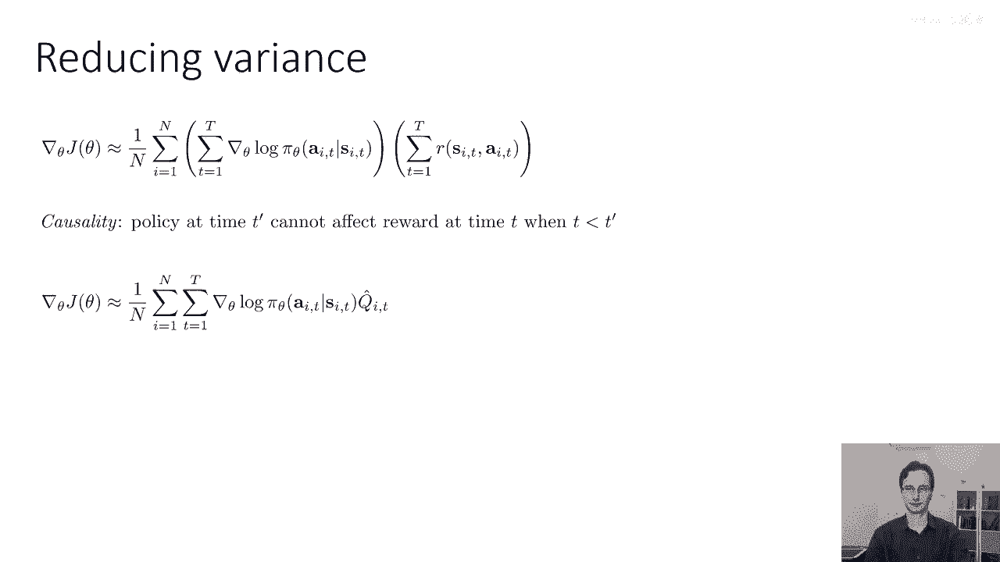
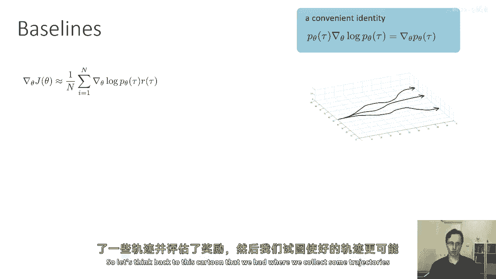
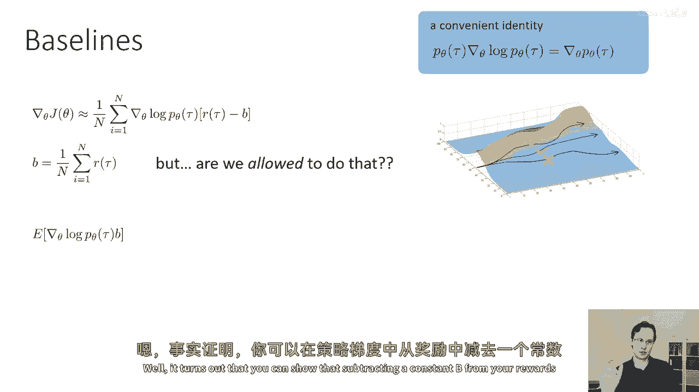
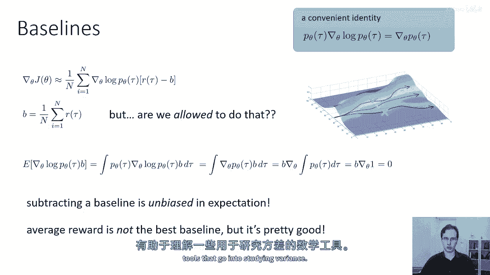
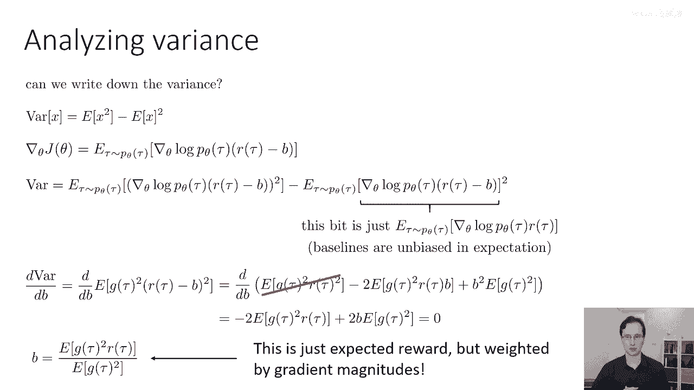
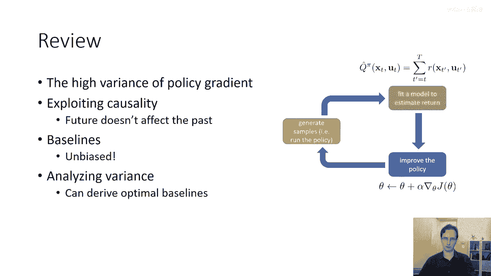

# 【深度强化学习 CS285 2023】伯克利—中英字幕 - P17：p17 CS 285： Lecture 5, Part 3 - 加加zero - BV1NjH4eYEyZ

所以，在接下来的讲座部分中，我们将讨论如何修改政策梯度计算，以减少其方差，这样，实际上可以获得一种可以被用作实际强化学习算法的政策梯度版本，我们将从第一个技巧开始，是利用我们宇宙中总是真实的一个属性。

那就是因果关系，因果关系说，时间t'的政策不能影响另一个时间点的奖励，如果t小于t'，则步骤t，这是说你现在做的事情不会影响到你过去的奖励，你过去得到的奖励，在这里需要注意的是，这并不是马尔科夫性质。

马尔科夫性质说未来的状态与过去状态无关，给定现在，马尔科夫性质有时是真实的，有时不真实，取决于你的特定时间过程，因果关系总是真实的，因果关系只是说过去的奖励与现在的决定无关，所以这并不是真正的假设。

对于任何时间向前流动的过程，这总是真实的，除非你有时间旅行，否则这否则不会是真实的，并且你可以采取行动或回到过去，改变你的行动，但我们不允许这样做，对吗，所以我要声称我所得的政策梯度。

实际上并没有使用这假设，并且它可以被修改以利用这假设，从而减少方差，你可以花一点时间来思考这假设可能在哪里，嗯，引入，我们即将看到的方式是，我们，我们将重新编写政策评分方程，嗯，实际上我也没有改变它。

我只是简单地重新写了它，我在这里做的，是我用分配律将奖励的总和分配到对log pi的梯度总和中，进入对log pi的梯度总和，所以你可以把它看作是去掉第一个括号，嗯，"对log p的梯度之和"。

"并取外括号，将其包裹在奖励周围"，"所以这给了我所有样本的和"，"从i等于一至n次"，"从时间步长1到资本t的log pi梯度之和"，在那个时候，一个步骤乘以另一个包含变量t'的大于另一个和的数。

从奖励的第一个字母到大写的T，所以这就意味着在每个时间步长i，我都乘以动作的伟大对数概率，在那个时间步t，由所有时间步的奖励总和决定，在过去、现在和未来，现在，你可能开始想象因果关系如何融入这个。

我们将改变每个时间步的动作对数概率，基于那个行动是否在现在和未来对应更大的奖励，但也在过去，但我们知道，时间步t的行动不能影响过去的奖励，这意味着那些其他奖励必然要有所抵消。

意味着如果我们生成足够的样本，最终我们应该看到所有时间步的奖励，当t'小于t时，t'的质数将平均为零的乘数，它们不会影响这一步骤的日志概率，实际上，我们可以证明这一点，证明有些复杂。

所以我在这里不会去详细解释，一旦我们证明这一点，然后我们可以简单地改变奖励的求和，而不是从t'等于1到资本t求和，简单地从t'等于t到资本t求和，基本上丢弃过去的所有奖励。

因为我们知道当前的政策无法影响他们，现在我们知道他们都会取消一个期望，但对于有限的样本大小，他们实际上不会取消，所以对于有限的样本大小，从过去删除所有奖励实际上会改变你的估计器，但它仍然将是无偏的。

所以这是我们所做的唯一改变，现在做出了那个改变，我们实际上得到了一个方差较低的估计器，它方差较低的原因非常简单，我们已经从总和中删除了一些术语，这意味着总和是一个较小的数字。

对小数字的期望具有较小的方差，在这里我想提到的一个 aside，是这个量有时被称为未来奖励，你可以猜出为什么，那就是从现在到世界的尽头的奖励，这意味着它指的是你还没有收集的奖励，基本上所有的奖励。

除了过去的奖励，其中未来奖励，我们有时使用符号 q hat，我用逗号'，'来表示下一步的奖励，现在，花一点时间来回顾上一堂课，在那里我们也使用了符号'q_i'，下一步的奖励，Q^hat，这里。

实际上指的是与前一堂课中我们看到的q函数相同的量的估计，在下一堂课当我们讨论实际批评算法时，我们将深入探讨这个问题，但现在我们将仅使用与前一堂课中看到的q函数类似的符号，上面有一个帽子。

表示这是一个单个样本估计。

现在好了，我之前描述的因果技巧你可以总是使用它，你将在作业二中使用它，它减少了你的方差，我们还可以使用另一个稍微更复杂的技巧，这也证明使政策梯度实践是非常重要的，它是被称为基线的东西。

让我们回到这个卡通，我们在其中收集了一些轨迹。

我们评估了奖励，然后，我们试图使好的路径更可能，使坏的路径更不可能，这看起来像是一个非常直接的，优雅的方式来正式化试错学习作为梯度上升过程，但这实际上是政策梯度做得好的吗，直觉上，嗯，如果奖励是中心的。

政策梯度就会这样做，意味着好的路径有积极的奖励，而坏的路径有负面的奖励，但这可能不一定是真的，如果所有的奖励都是积极的，绿色检查标记会增加，它的概率会增加，黄色检查标记会增加一点，红色叉也会增加。

但只是一点点，直觉上，它似乎看起来是我们想要干的，我们是想要中心我们的奖励，所以比平均值好的东西会增加，比平均值差的东西会减少，例如，也许我们想要从我们的奖励中减去一个量，这是平均奖励。

所以不是乘以grad log p乘以tau的奖励，我们乘以tau的奖励减去b，其中b是平均奖励，这将使政策梯度与我们的直觉对齐，这将使政策梯度增加比平均值好的路径的概率，并减少比平均值差的路径的概率。

然后这将是真的，无论奖励函数实际上是什么，即使奖励总是积极的，这看起来很直观，我们是否允许这样做，它似乎我们只是任意地从所有奖励中减去一个常数，这还是正确的吗，事实证明。

你可以证明从你的奖励中减去一个常数b。

并政策梯度实际上不会改变梯度的期望值，尽管它会改变其方差，这意味着对于任何使用此技巧的蜜蜂，都将保持你的梯度估计器无偏，这里是如何推导的，所以我们将使用之前相同的方便身份。

那个等于tau乘以tau对数p的梯度乘以tau对数p的梯度的梯度的p是多少？现在我们要替换这个，反向的等式，所以我们要做的是，我们将分析tau对数p乘以b的梯度，所以如果我取tau减去b的差r。

并且我将grad log p分配给它，然后我得到一个grad log p乘以r的项，这是我原始的政策梯度减去一个grad log p乘以b的项，这是我正在添加的新项，那么让我们分析一下这个术语。

它是grad log p乘以b的预期值，这意味着它是p对tau的积分，乘以tau对log p的grad，乘以b，现在，我将把我的身份替换回来，所以，使用蓝色框中的方便身份。

我知道这等于tau对p的grad，乘以b的积分，现在，由于梯度运算符的线性性，我可以将梯度运算符和b从积分中取出，所以，这等于b乘以对tau的p积分的梯度，但p of tau是概率分布。

我们知道概率分布积分为1，这就意味着这个等于b乘以关于theta的梯度的一次方，但是，关于theta的梯度是一，因为一不依赖于theta，因此我们知道，这个期望值在期望值上等于零，但对于有限的样本数。

它不等于零，所以这意味着减去b会保持不变，会保持我们的策略梯度无偏，但它实际上会改变其方差，所以减去一个基线会无偏在期望值，平均奖励，在这里我使用的东西实际上并不是最好的基线，但它实际上相当好。

而且在许多情况下，当我们只需要一个快速而粗糙的基线时，我们会使用平均奖励，然而，我们可以实际上推导出最佳基线，最佳基线在实践中的梯度政策算法中并不常用，但它或许有助于推导出它。

只是为了理解一些研究方差时使用的数学工具。

所以这就是我们在下一部分要干的事情，在下一部分，我们将进行一次数学计算，在那里，我们将实际推导出最优基线的表达式，以最优最小化方差，所以首先，我们将写下方差，所以，如果你有随机变量x的方差。

它等于x的平方期望值减去x的平方期望值，所以我们可以使用同样的方程来写下我们的政策梯度，所以，这是我们的政策梯度，政策的梯度方差等于该量度的预期值，在括号内平方减去整个预期值平方，现在。

这里的第二项就是政策梯度本身，对吧，因为我们知道，tau的r减去uh，B在期望中最终不会产生影响，所以基本上，grad log p乘以r的实际预期值，减去b与grad log p乘以r的预期值相同。

所以我们可以忘记关于，改变r的第二项不会在期望中改变其值，所以，我们只关心第一个术语，好的，我将稍微改变我的记号，只是为了清理它，所以我只会使用tau的g代替tau的log p的梯度。

如果你看到g在下面，那就是log p的梯度，我只是想要写一个简短的，一个更短的值，所以我知道方差中的第二个术语不依赖于b，但第一个术语依赖于它，然后，为了找到最佳的b。

我将写下偏导数dvar db并解出最佳的b，所以我将写下第二部分的偏导数dvar db并解出最佳的b，所以第二部分的偏导数为零，因为它不依赖于b，所以只剩下第一部分。

dvar db of the expected value of g squared times r minus b squared，现在我可以展开二次形式。

并得到dvar db of the expected value of g squared，R squared minus two times the expected value of g squared。

Rb plus b squared times the expected value of g squared，所以我在这里做的一切就是，我只是扩展了二次形式r减去b的平方，将g的平方分配给它。

然后从期望中提取常数，现在来看这个方程，我们可以看到第一个术语不依赖于b，嗯，但后两个术语依赖于b，我们可以消除这一部分，如果以b为变量对后两个术语求导，负二项是b的线性函数，而正项是它的二次函数。

所以我们得到导数等于负，g的平方期望值的两倍，R加上二倍b乘以g的平方期望值，现在我们可以将常数项移到右边并解出b，我们得到这个方程，b等于g的平方期望值，R除以g的平方期望值右边。

所以我刚刚解出了当导数等于零时b的值，所以这就是b的最优值，现在来看这个东西，你可以试着直观地理解，真正的最优基准是什么，也许有一些东西可能会跳出来吸引你，是现在基准实际上依赖于梯度。

这意味着如果梯度是一个具有多个维度的向量，如果你有多个参数，实际上，你会为每个梯度的条目有一个不同的基准，所以如果你有一百个不同的政策参数，对于参数一，你会有一个基准值，对于参数二。

会有一个不同的基准值，直观地看这个数学方程，每个参数值的基准基本上就是奖励的预期值，由该参数值的梯度大小加权，所以它是一种加权版本的预期奖励，它不是平均奖励了，它是它的加权版本，它被重新加权以梯度大小。

所以这是现在再次最小化方差的基准，在实际应用中，我们通常不使用最优方差，很抱歉，我们通常不使用最优基准，我们通常只是使用预期奖励。

但如果你想要最优基准，这就是你得到所有正确的方式，所以，让我们回顾一下我们已经覆盖的内容，我们讨论了政策梯度的高方差，算法，我们讨论了，如何降低这个方差，通过利用事实，即当前行动不会影响过去的奖励。

我们讨论了如何使用无偏的基准。

