# 【深度强化学习 CS285 2023】伯克利—中英字幕 - P19：p19 CS 285： Lecture 5, Part 5 - 加加zero - BV1NjH4eYEyZ

"在接下来的讲座部分中"，"我们将讨论如何在深度强化学习算法中实际实现政策梯度。"。

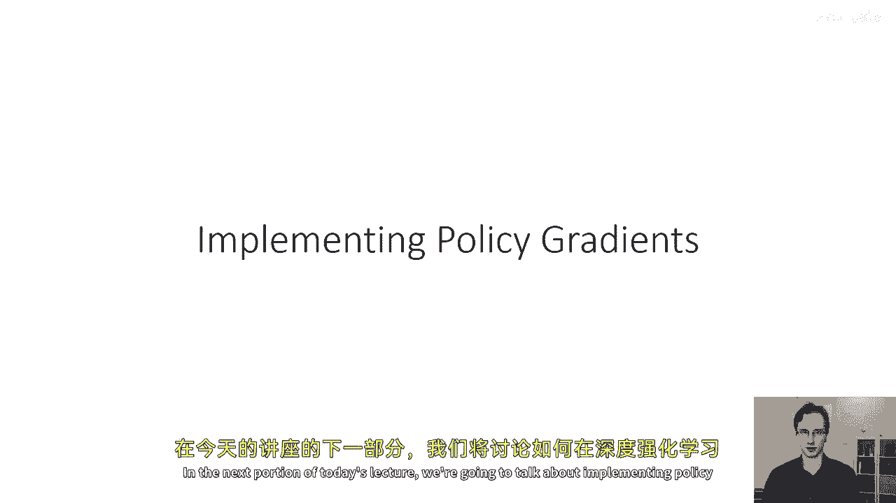

"实施政策梯度面临的主要挑战之一是我们想要实现它们"，"以这种方式，自动微分工具如tensorflow或pytorch"，"可以为我们计算出政策梯度，且满足合理的计算和内存需求。"。

"如果我们想要 naively 实施政策梯度"，"我们只需要计算对数自然常数的梯度a_i"，"对于我们采样的每一个状态动作元组，都给予t"，然而，通常来说，这种方法非常低效。

因为神经网络可以有一个非常大的数量的参数。实际上，参数的数量通常远远大于我们产生的样本数量。那么假设我们有n个参数，其中n可能在百万级别，我们有一百条轨迹，每条轨迹有一百个时间步。

所以我们有十万个总状态动作对，这意味着我们需要计算十万个这些，长度为一百万的向量，这在内存存储上非常昂贵，而且在计算上通常，当我们想要高效地计算神经网络的导数时，我们想要利用反向传播算法，所以。

而不是计算神经网络输出对其输入的导数，然后乘以损失的导数，我们做相反的事情，我们首先计算损失的导数，然后使用反向传播算法通过神经网络进行反向传播，这就是我们的自动化微分工具将为我们做的，为了做这件事。

我们需要设置一个图，使得该图的导数给我们政策梯度，好的，那么，我们如何使用自动微分计算政策梯度呢，嗯，我们需要一个图，使得其梯度就是政策梯度，我们找到答案的方法是从梯度开始。

我们已经知道如何计算哪些是最大似然梯度，如果我们想要计算最大似然梯度，那么我们会做，我们会使用像交叉熵损失这样的东西来实现最大似然目标。

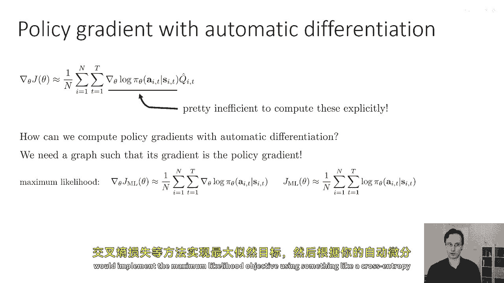

然后，根据你的自动微分包，你会调用dot backward或dot gradients，并获取你的梯度，所以，我们计划通过政策梯度来获取我们的听觉包，以高效地计算它们。

是通过实现一种伪损失作为加权最大似然来实现的，所以而不是实现j个最大似然，我们将实现这个被称为j tilde的东西，它只是所有有采样动作的日志概率之和，乘以现在q hat的奖励去。

这个方程不是强化学习的目标，实际上，这个数学方程没有任何意义，它只是一个被选择的量，使得其导数等于策略梯度，当然，这关键的一部分是，我们的自动微分包没有认识到那些q，值本身受到我们的策略影响，所以只是。

嗯，处理我们提供的图，所以，在某种意义上，我们几乎在试图欺骗我们的听觉包，给我们想要的梯度，好的，所以这里，对数π是，嗯，你知道，将会是，例如，如果我们有离散动作，我们的交叉熵损失。

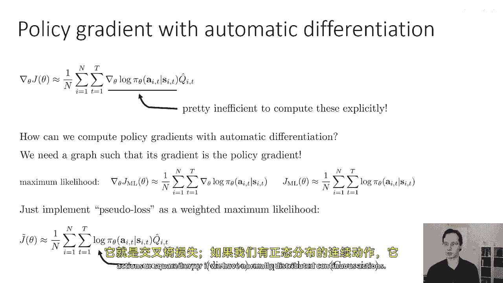

或者如果我们有正态分布的连续动作，我们的平方误差，好的，所以我这里有一些伪代码，这个伪代码实际上是在tensorflow中，因为我在过去几年中在tensorflow中教过这门课，你将要做的，政策梯度。

作业和pi torch a，基本思想非常相似，因为特定的术语可能会有所不同，但希望伪代码对于所有人来说仍然清晰易懂，所以我在这里的伪代码是最大似然估计的伪代码，学习，这是监督学习，在这里学习。

动作是一个张量，沿第一个维度的维度为n乘以t，所以样本数量乘以，时间步数，以及沿第二个维度的动作维度，并且状态是一个n乘以t乘以的tensor，状态的维度数量，所以第一行logits等于策略预测。

仅仅要求策略网络对这些状态进行预测的状态，基本上输出logits对动作的作为离散动作的例子，然后第二行负似然度，基本上使用softmax交叉熵函数来产生对所有动作的似然度，然后我们做一个平均。

在这些上进行减少并计算他们的梯度，所以这将给你似然的梯度，这是你在监督学习中要做的。

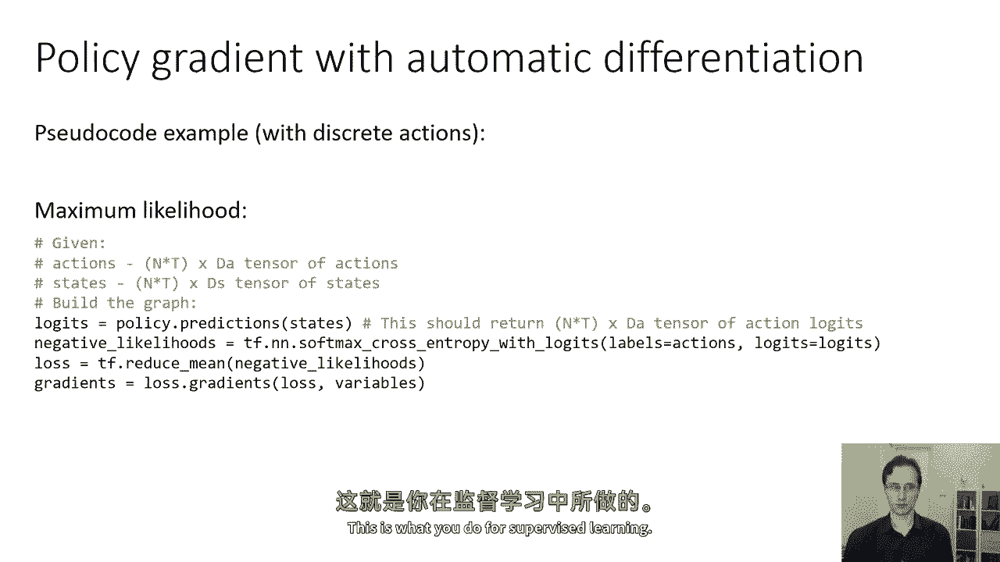

要实现策略梯度，你需要，只需要输入权重来获取加权似然度，并且这些权重对应于那些去奖励值，所以，我将假设奖励，去奖励值都被打包在一个称为q_values的tensor中。

这是一个n乘以t乘以1的tensor，然后，在我计算完我的似然度后，我会将它们转换为加权似然度，通过点wise。

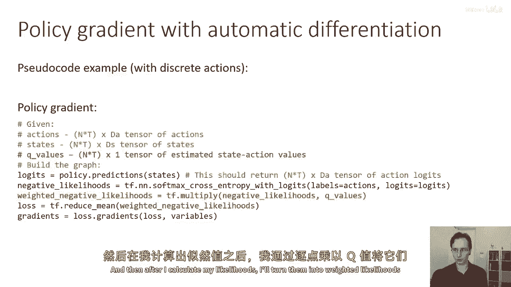

乘以q_values，这就是我唯一做的改变，那么我的意思是，减少这些，然后，我会调用它们的梯度，所以，这基本上会欺骗你的听觉包来计算策略梯度，所以在数学上，我们实现的是这，我们基本上将我们的最大似然度。

嗯，损失，转化为这个修改后的伪损失j_tilde，我们将我们的似然度加权为q_hats，当然，它取决于你实际上去实现那些q_values的代码。

你可以这样做，嗯，简单地在numpy中，你实际上不需要使用你的听觉包来计算这些。

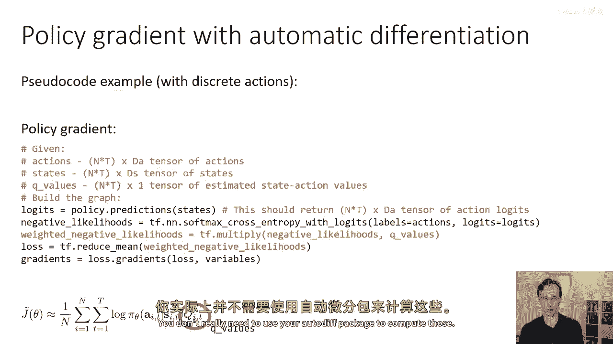

好的，关于在实际中使用策略梯度的一些一般提示，首先记住，策略梯度的方差很高，尽管实现看起来像监督学习，但它的行为将与监督学习大相径庭，策略梯度的高方差会使一些事情变得相当困难。

它意味着你的梯度将非常嘈杂，这意味着你可能需要使用更大的批量，可能比您用于监督学习的批量大得多，所以，批量大小在数千或数十万是非常典型的，调整学习率将更加困难。

使用像adam这样的适应性步长规则可能是好的，Ish，但使用常规SGD加上动量可能非常难以使用。

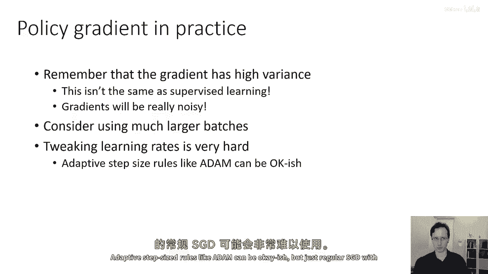

我们将学习关于策略梯度的特定学习率调整方法，稍后当我们谈论像自然梯度这样的东西时，但现在。

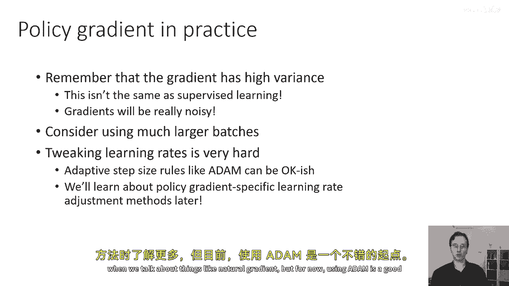

使用adam是一个良好的起点，总的来说，就预期你需要进行比通常在监督学习中更多的超参数调整。

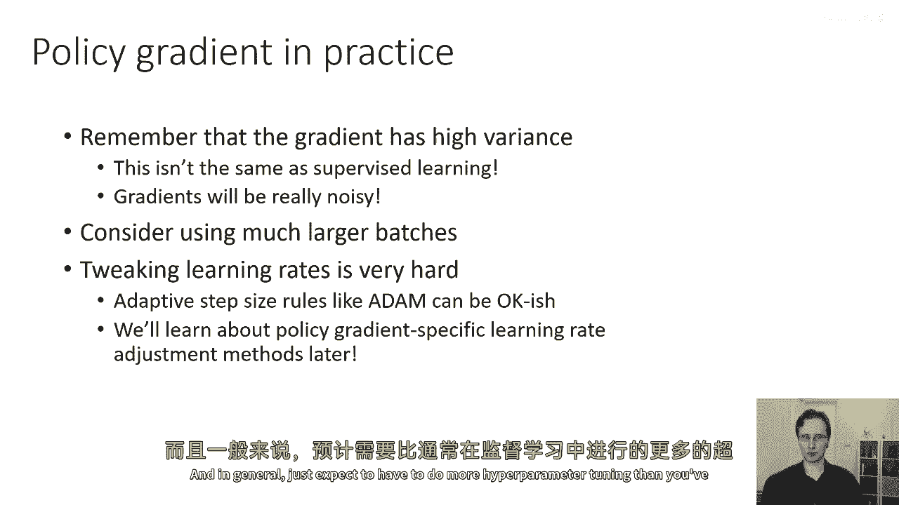

所以，仅仅回顾一下，我们讨论了策略梯度如何基于策略，如何我们可以通过重要采样衍生出一个离策略的变体，所以，不幸的是，它在时间维度上具有指数级别的缩放。

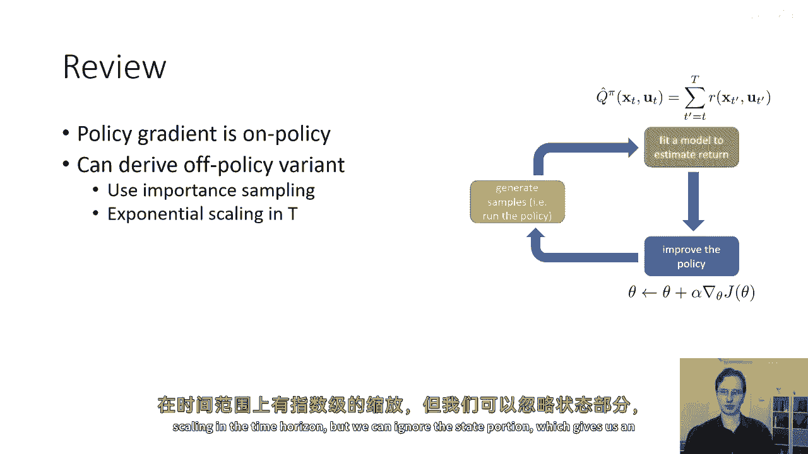

但我们可以忽略状态部分，这给我们提供了一个近似值，我们讨论了如何使用自动微分实现政策梯度，并关键在于设置它。

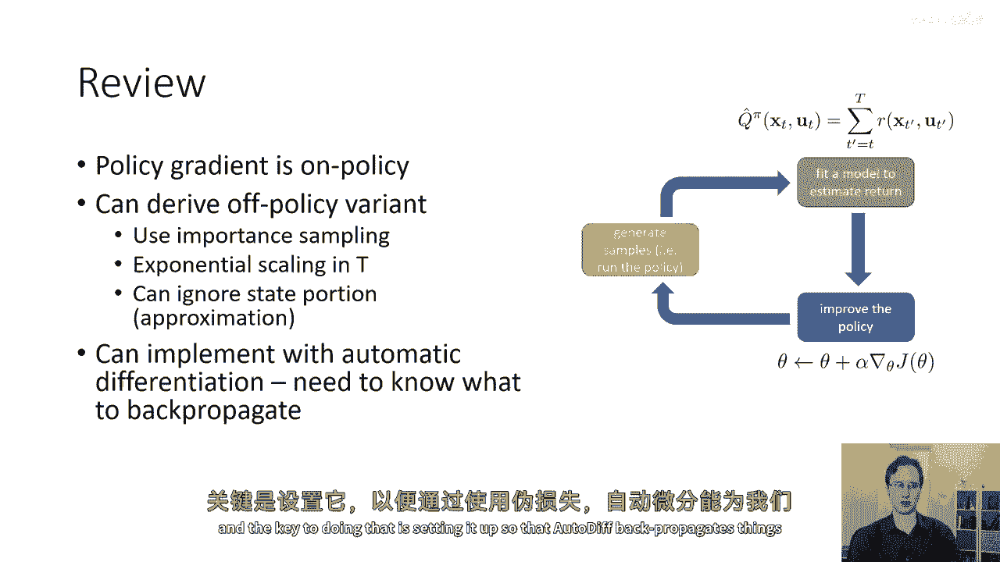

这样，通过使用伪损失，我们可以正确地让审计后传播东西，我们讨论了一些实际考虑因素，批量大小。

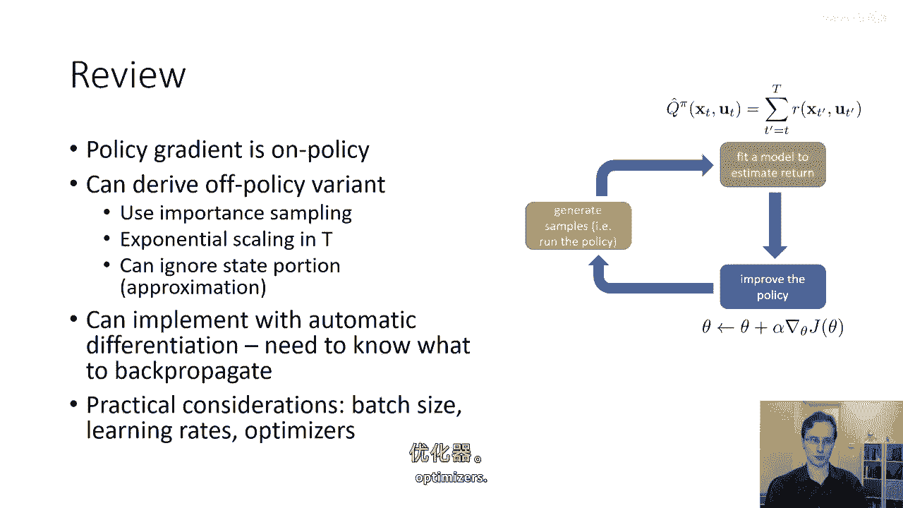