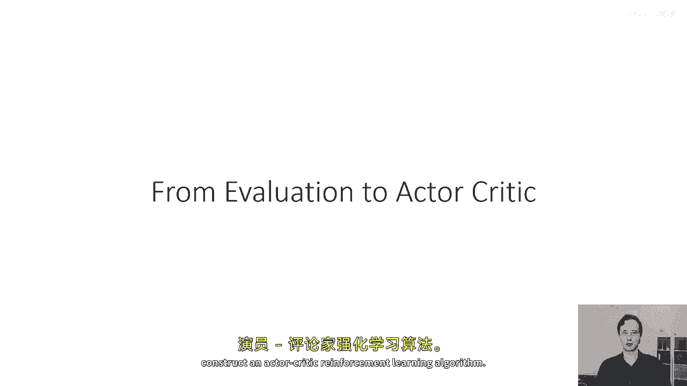
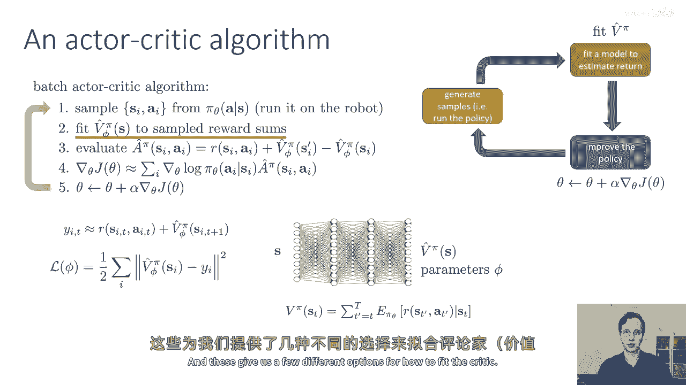
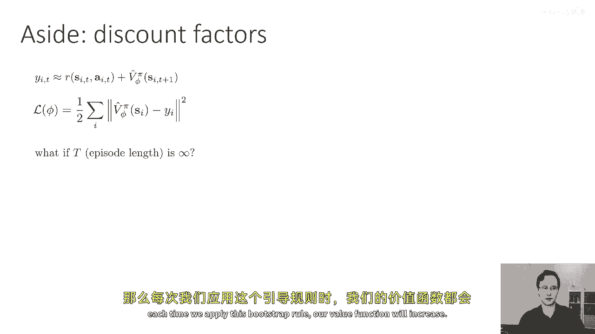
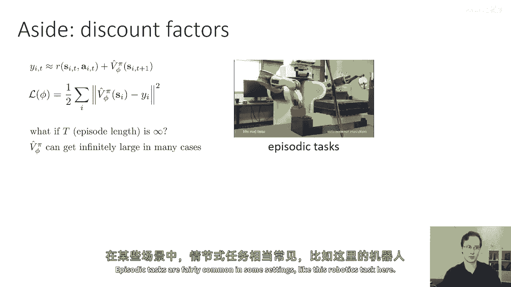
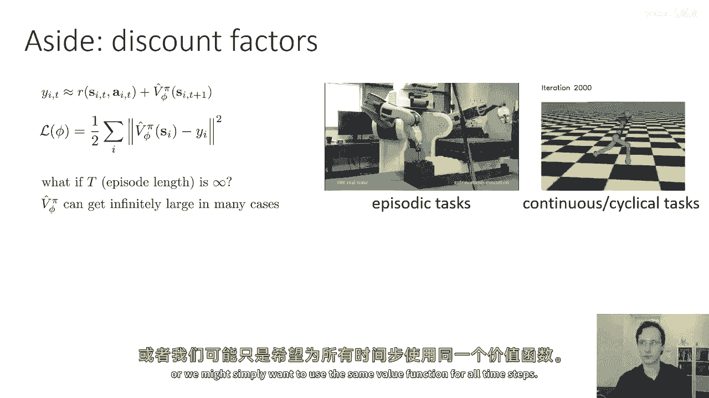
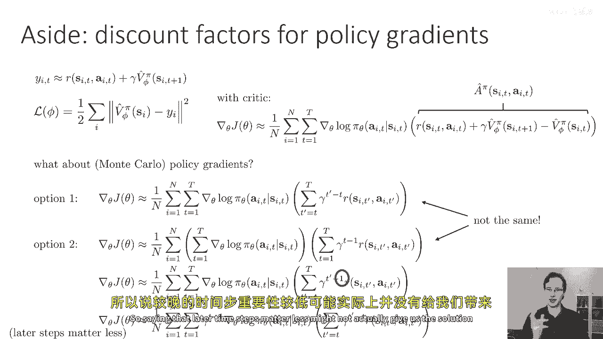
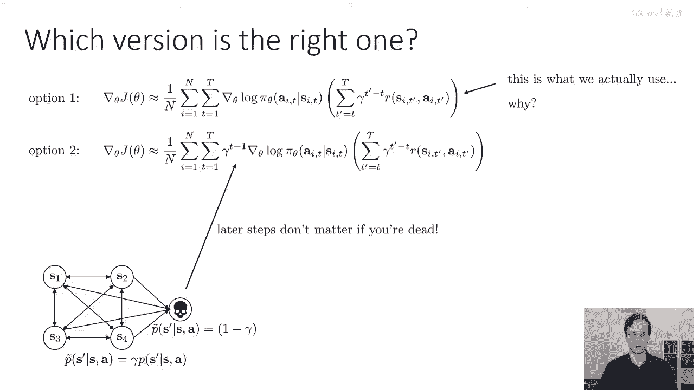
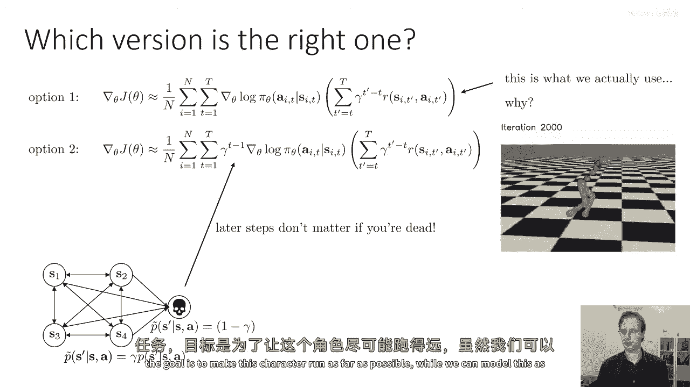
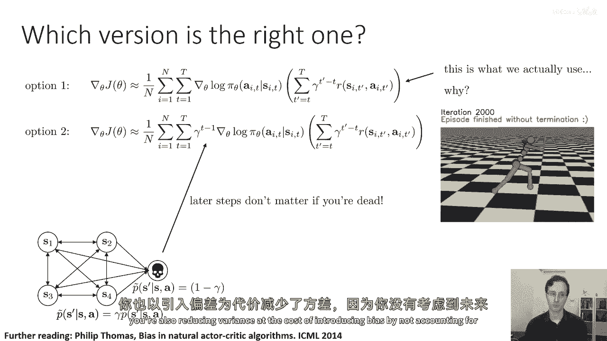

# 【深度强化学习 CS285 2023】伯克利—中英字幕 - P22：p22 CS 285： Lecture 6, Part 2 - 加加zero - BV1NjH4eYEyZ

"现在，既然我们已经讨论了政策评估"，"并且如何将价值函数融入到政策梯度中"，"让我们将这些部分结合起来，构建一个演员-批评家强化学习算法。"。

"所以，一个基本的批处理演员-批评家算法可能看起来像这样"，这是嗯，"基于之前的强化程序"，"加上一些额外的步骤"，"所以，第一步就像以前那样"，"即将通过在政策下运行模拟来生成样本"。

"那就是基本橙色的盒子，那个基本上没有改变"，第二步是将我们的近似价值函数拟合到采样到的回报中，这就是要取代绿色框的部分，所以，我们不再只是简单地将所有奖励相加，我们现在将拟合一个神经网络。

正如我们在前一节讨论的，对于我们采样的每个状态动作元组，评估近似优势为奖励，加上下一个状态的近似价值减去当前状态的价值，第四步，使用这些优势值来构建政策梯度估计器，在每个时间步骤中取对π的自然对数。

并乘以估计的优势，然后像以前那样，步骤五是取梯度下降步，所以那个我们讨论过在讨论策略评估的部分，主要是步骤二，我们如何实际上拟合价值函数，我们讨论了我们如何可以做出许多不同的选择。

我们可以将其拟合到单个样本蒙特卡洛估计中，这意味着我们实际上沿轨迹累积了我们获得的奖励，这给我们提供了我们的目标值，我们还讨论了我们如何可以使用Bootstrap估计，我们在哪里使用实际观察到的奖励。

加上使用我们之前的价值函数估计器估计的下一个状态的估计值，这给我们提供了几种不同的选项来拟合批评者。

到这个时候，我想做一个小插曲，来讨论当我们使用此样本规则拟合价值函数时发生的事情，嗯，在无限期设置中，所以我们可能会遇到的问题是如果episode长度是无限的，那么每次我们应用此样本规则时。

我们的价值函数会增加。

所以如果我们有，例如，一个在固定时间结束的期任务，也许这不是一个大问题，也许我们可以为每个时间步有一个不同的价值函数，并且一切都是有限期限，期任务在一些设置中相当常见。

比如这里的机器人任务，但我们可以有无限期限，一个连续或循环的任务，就像这个运行任务，或者我们可能只是想在所有时间步中使用相同的值函数。

在这些情况下使用一个启动规则，我讨论的方式可能会导致一些问题，例如，如果你每次用这种方式启动时奖励总是积极的，你的价值函数增加，最终你的价值函数可能会变得无穷大。

所以如何修改这个规则以确保我们总是可以有有限的值，并且我们能够处理无限期设置，一个非常简单的技巧是假设我们想要更大的奖励，而不是稍后，这是非常自然的，如果你想象如果我告诉你我将给你一百美元。

你可能会对此感到相当满意，如果我告诉你我将在下一年给你一百美元，你可能仍然会对此感到有些满意，但会少一些，如果我告诉你我将在一百万年后给你一百美元，你可能不会太认真对待我，为什么这么好，因为嗯。

对你来说，这不那么重要，一年后会发生什么，在一百万年后会发生的事情会少得多，仅仅是因为对于每个人未来会发生什么有很多不确定性，包括你在那个时间内，那些延迟的奖励就没有那么有价值，另一种思考方式是。

你会更喜欢早点得到奖励而不是晚点，出于一个非常基本的生物原因，那就是有一天你会死，你想要在死亡前获得奖励，如果我告诉你在一百万年后获得奖励，那么你在死亡前获得奖励的可能性非常小，这可能听起来有点悲观。

但我们可以使用这个可爱的隐喻，来实际解决这个无限奖励问题，我们可以偏向于尽快获得奖励而不是稍后，通过实际建模代理可能会所谓的死亡这个事实，所以我们这样做的方式是，我们将在a值的前面引入一个小乘数，所以。

我们不会将目标值设置为r加上下一个v，我们将其设置为r加上下一个v乘以gamma，其中，gamma是我们所称的折扣因子，它是一个介于零和一点九九之间的数字，工作得非常好，如果你想要折扣因子的一个例子。

一般来说，我们将它们选择在像零点九和零点九九九之间，一种你可以解释gamma角色的方式，是gamma改变了你的mdp，所以，假设你有这个mdp，其中，你有四个状态，并且你可以在这些四个状态之间转换。

这些转换由一些概率分布来控制，在添加gamma后，s'给定s的概率为P(s'|s)，我们可以这样思考：我们正在添加一个第五个状态，一个死亡状态，我们每次时间步都有概率1-gamma过渡到那个死亡状态。

一旦我们进入死亡状态，我们永远不会离开，所以，这个mdp中没有复活，我们的奖励总是为零，这意味着下一次时间步的预期值总是可以表达为gamma乘以，在原始MDP中，其期望值是，加上一减去伽马乘以的零。

这就是我们得到的伽马因子的地方，所以进入死亡状态的概率是一减去伽马，这意味着修改后的动态现在只是伽马乘以，原始的概率，并且一减去伽马剩余的部分负责进入死亡状态，所以从机械上讲。

我们与折扣因子的修改只是将我们的值乘以伽马，每次时间步，我们后退一步，这做的是它使我们更喜欢奖励，发生在较早而不是较晚的奖励，从数学的角度来看，我们可以这样解释这个问题。

实际上是我们修改我们的mdp来引入死亡的概率。

以概率一减去gamma，好的，嗯，让我们先更深入地研究折扣因子一些，"很好"，答案是我们肯定可以，嗯，所以例如，"这个可以做的方式有一个是"，"我们可以只考虑那个单一的样本奖励进行计算"。

"我们可以将它放入伽马"，所以，我有这个方程，"这就是去奖赏的计算方法"，曾经有过，除了现在我已经将这个伽马提升到幂次方之外，T'减去t在我的奖励前面，所以这意味着第一个奖励。

发生在时间步t的那个有乘数一，下一个在t加一的得到乘数伽马，下一个在t加二的得到乘数伽马平方，依此类推，所以我们对发生在我们时间附近更近的奖励影响更大，这种估计器本质上是您将得到的单一样本版本的。

如果您使用带有折扣的样本值函数，我们还有其他方式可以引入折扣到蒙特卡洛策略梯度中，这似乎非常相似，但是有一个微妙且重要的差异，如果我们嗯，取原始的，嗯，我们之前有过的蒙特卡洛策略评估。

我们做了那个因果关系的伎俩，我们只是简单地将grad log pies相加，然后乘以它们以将它们与奖励的总和结合，然后我们将在其中添加一个折扣，我们将一个gamma到t减去一前的乘数放在奖励前面。

所以第一步的奖励被乘以一，第二步的奖励被乘以gamma，第三步的奖励被乘以gamma的平方，等等，花一点时间思考这些两个选项如何比较，考虑这些两个选项是否实际上在数学上是相同的。

如果我们将因果关系的伎俩应用于选项二，意味着我们删除了所有的过去奖励，我们会不会以选项一结束，所以我们会稍后回来回答这个问题，但是为了帮助我们思考这些选项如何比较，让我们为了完整性而写下。

如果我们有一个批评家，那么与批评家一起，我们将得到这样的梯度，我们有当前奖励加上gamma乘以下一个值减去当前值，这就是我们的近似优势，所以选项一和选项二不是相同的，实际上，选项一匹配批评家版本。

除了我们有一个样本估计器之外，选项二不，实际上，如果我们重新写选项二，使用因果关系的伎俩，在哪里我们将奖励分配在grad log pies的总和内部，然后消除所有发生在当前时间步之前的奖励。

我们将得到这个表达式，我们将得到grad log pi乘以，时间步t次，从t'等于t到大写字母T的sum的gamma到t'减去一，而之前我们有gamma到t'减去t，所以这里发生了什么。

为什么我们有这个差异呢，一种我们可以理解这个差异的方式是，如果我们将gamma到t减去一因子，并分配它出sum，所以这里最后的一行正好等于前面的一行，我只是将gamma到t减去一因子分配出去了。

所以现在的奖励计算方式与选项一相同，但我有一个额外的gamma到t减去一因子，在grad log pi前面，那么那在做什么很好，那实际上在做的事情相当自然，它说的是因为你有这个折扣。

你不仅对将来的奖励更不关心，你也对将来的决定更不关心，所以如果你从时间开始，第一步的未来奖励并不重要，但也是你的决定不重要，因为你将来的决定只会影响未来的奖励，所以结果你实际上在每个时间都折扣你的梯度。

一步一步通过伽马到达t减一，本质上，这意味着在第一步做出正确的决定，比在第二步做出正确的决定更重要，因为第二个时间步不会影响第一个时间步的奖励，这就是那个在前面的伽马到t减一因素所代表的。

实际上代表这是正确的事情要做，如果你想真正解决一个折扣问题，如果你真的在一个设有折扣因子的环境中，并且这个折扣因子代表你对近期奖励的偏好，或者等价于进入死亡状态的概率，那么实际上。

你的政策梯度应该折扣未来的梯度，因为在真正的折扣设置中，现在做出正确的决定比将来做出正确的决定更重要，回到我的嗯，关于一百美元的比喻，如果我告诉你我会给你一百美元，如果你通过我的数学考试。

我告诉同样的事情，我可以在今天给你考试，或者我可以明年给你考试，或者我可以在一百万年后给你考试，嗯，可能性是，如果你知道我要在一百万年后给你考试，你可能不会为它学习，所以对于那个数学考试的政策梯度。

会有一个非常小的乘数，因为你更愿意处理能给你带来更接近现在未来奖励的事情，所以将gamma乘以t减一项放在前面是有意义的，如果我们真的在解决一个折现问题，但在实际中，这并不是我们总是想要的，嗯。

如果认为后来的时间步骤不重要，这可能并不能给我们提供我们想要的解决方案。

我们正在寻找的，所以这就是死亡版本，后来的步骤不重要，如果你死了，这从数学上是一致的，我们通常实际使用的版本是选项一，为什么那样，那么花一点时间来思考那个，我们为什么更倾向于使用选项一而不是选项二。

如果我们考虑我之前提出的循环连续RL任务，目标是让这个角色跑尽可能远。

我们可以将这个建模为一个带有折扣奖励的任务，实际上我们真的很想让这个人跑尽可能远，理想情况下是无限远，所以我们实际上不想折扣它，嗯，问题，我们想做的是，我们想使用折扣来帮助我们得到有限的值。

这样我们就可以实际上做RL，但我们真正想要的是得到一个工作，嗯，对于，你知道，对于一个可以运行任意长时期的时间，在某种程度上，选项一更接近我们想要，也许我们真正想要的更像是平均奖励。

所以我们想要除以大T并完全消除折扣，平均奖励在计算和算法上非常非常困难使用，所以我们在实际中会使用折扣，因为它在数学上非常方便，但省略出现在选项二中的t减去一乘积的gamma。

因为我们确实想要一个在每个时间步都能做正确事情的策略，不仅仅是在早期时间步，另一种思考折扣因子的角色的方式，它提供了一个看待死亡状态的替代视角，嗯，你可以阅读关于这个的，嗯。

在菲利普·托马斯的这篇论文中，叫做偏差和自然演员批评算法，是折扣因子用于减少你的政策梯度的方差，如果你有无限的奖励，你也有无限的方差，因为无限的值有无限的方差，通过确保你的总奖励是有限的。

通过在前面放置折扣，你也在减少方差以引入偏差。

没有考虑到未来的所有奖励，好的，所以嗯，当我们将折扣引入我们的演员批评算法时，嗯，只有第三步发生了变化，所以在第三步，你可以看到我们在v pi phi s prime前面添加了一个gamma。

其他所有东西都保持不变，我们可以实际做批评算法中的一些事情，一旦我们将它们带入无限时间范围，我们可以实际上导出一个完全在线演员批评方法，到目前为止，当我们谈论政策梯度时。

我们总是使用政策梯度在一个种集的批处理模式设置中，我们收集一个轨迹的批，每个轨迹运行到结束，然后使用该批来评估我们的梯度以更新策略，但是，当我们使用演员批评时，我们也可以有一个在线版本。

每次时间步都会更新，每次我们步进模拟器，或者我们步进真实世界，我们也会更新我们的策略，这就是在线演员批评算法的看起来样子，我们将采取一个动作，从pi phi theta中采样，给定s并获取一个过渡。

s逗号，逗号s'逗号r，所以我们将取一步时间，在这个点上，我并不在任何事情上添加下标t，因为这可以在一个单一的，无限长的，非连续过程中进行，第二步，我们更新我们的价值函数。

使用奖励加上下一个状态的价值作为目标，因为我们正在使用自顶向下的更新，我们实际上不需要知道我们将在下一个时间步中得到什么状态，在下一个时间步，或者是下一个，或者是下一个的，我们只需要下一次步的s'。

所以我们不需要s''，s'''，等等，因为我们在使用bootstrap，所以这就足够我们更新我们的价值函数，步骤三我们评估优势作为奖励，加上下一个状态的价值函数，减去当前状态的价值函数再次。

这仅使用我们已经知道的东西，它使用一个s prime r和我们学习的价值函数，然后使用这，我们可以构造一个策略梯度的估计，仅仅通过取这个动作的grad log pi。

我们刚刚计算的优势乘以我们刚刚计算的优势，然后我们可以更新策略参数以策略梯度，然后我们重复这个过程，我们每次时间步都这样做，现在，当我们尝试在深度rl中做这道菜时，存在一些问题。

也许每个人可以花一点时间来思考这个算法可能会出什么问题，如果我们在实际中实现它，这基本上是在线教科书中的行动批评算法，但对于深度rl，它有些问题，好的。

让我们，嗯，嗯。