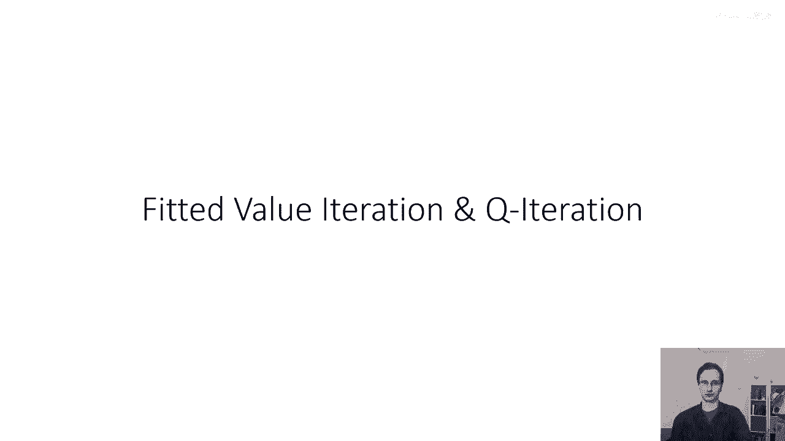
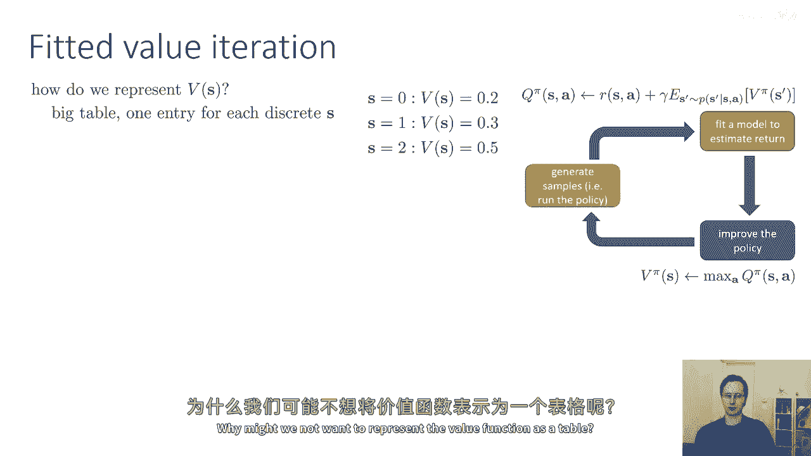
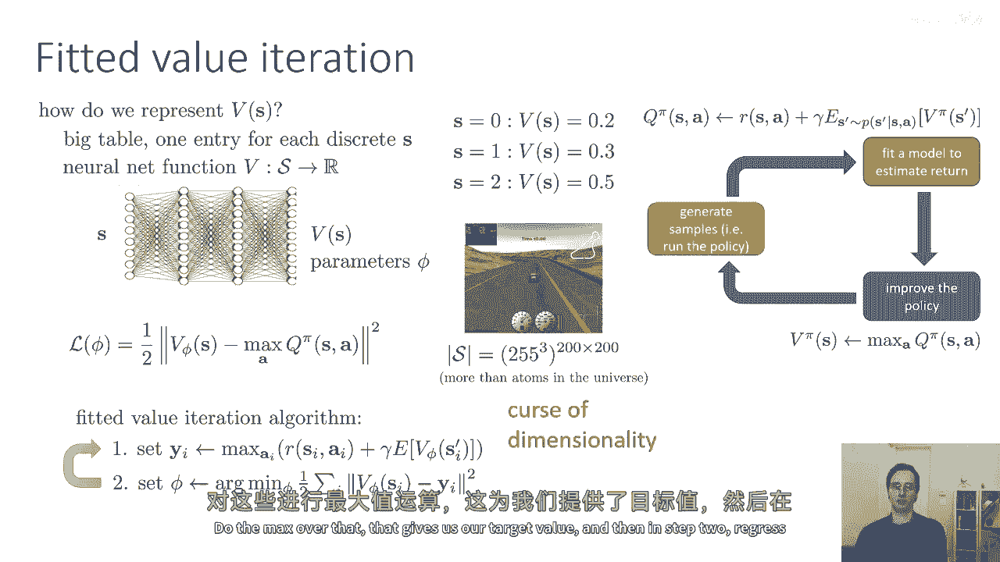
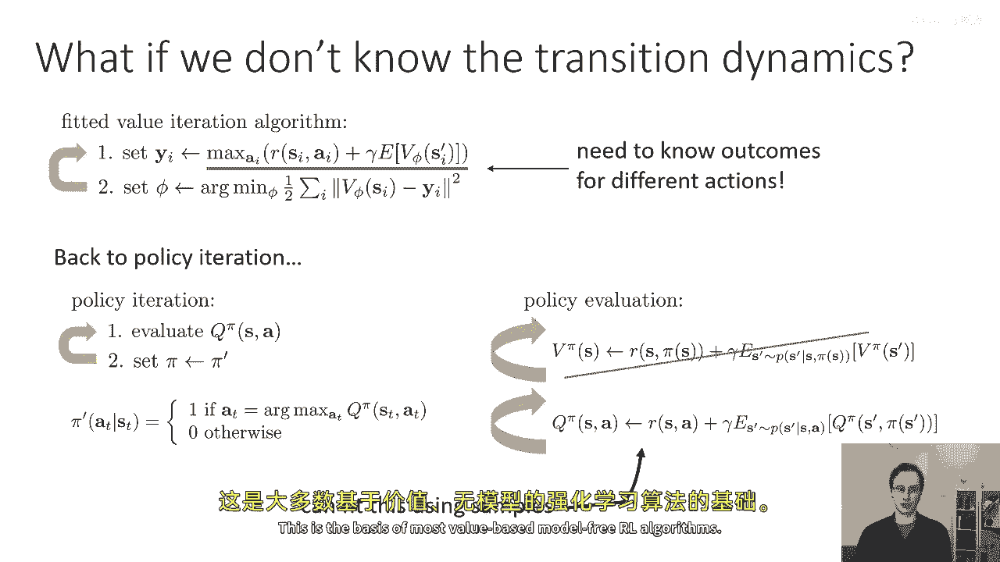
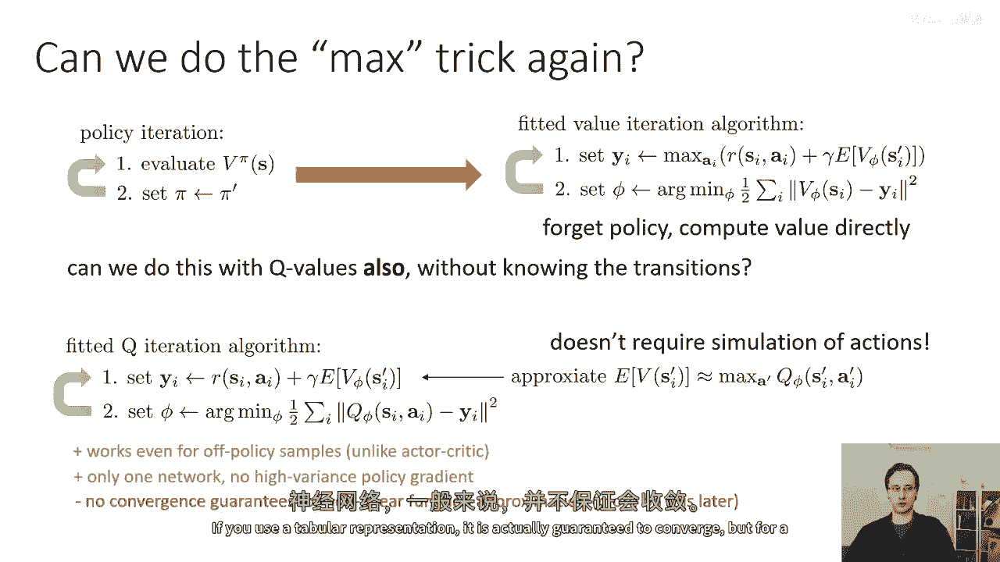
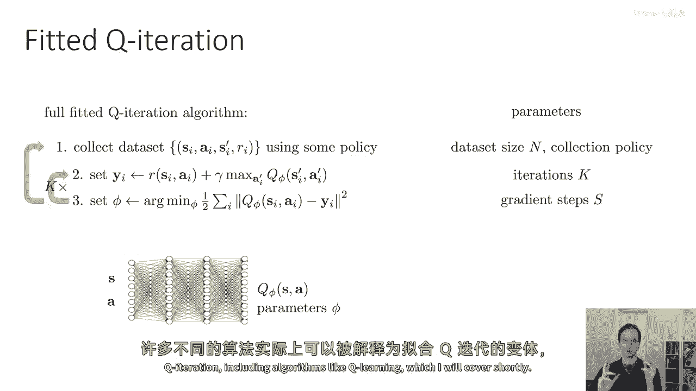
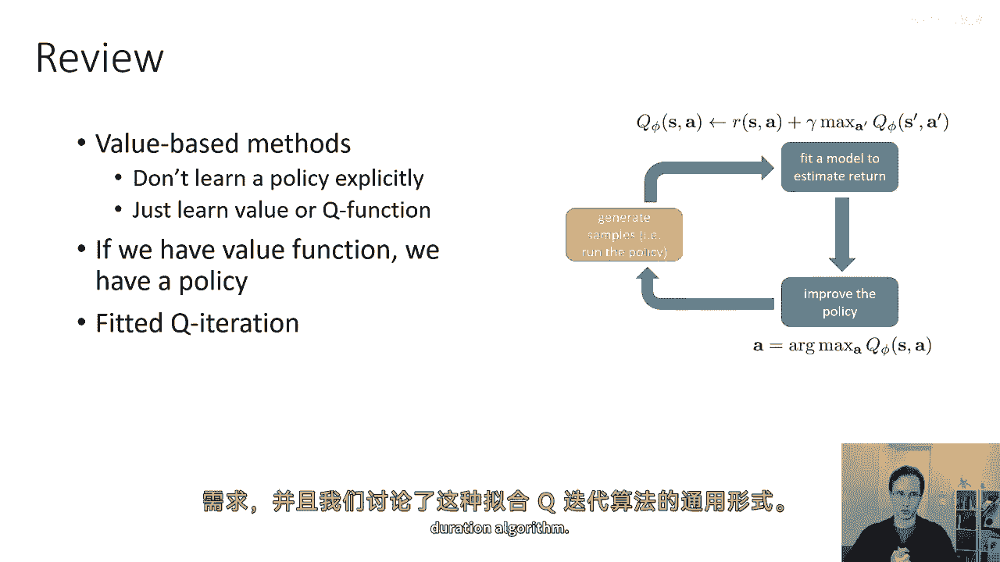

# 【深度强化学习 CS285 2023】伯克利—中英字幕 - P27：p27 CS 285： Lecture 7, Part 2 - 加加zero - BV1NjH4eYEyZ

到目前为止，我们讨论了如何学习表示为表格形式的价值函数，所以没有神经网络，没有d bar l 没有函数逼近，只是一个小的离散状态空间，我们现在可以在所有可能的状态中枚举价值。

让我们谈谈如何引入神经网络和函数逼近。

所以首先我们如何代表v(s)呢，到目前为止，我们讨论了如何将其表示为大表，对于每个离散状态有一个条目，所以在状态零，你说s的v值为0。2，并声明s等于1和0。3等，为什么这不够，嗯。

花一点时间来思考这个问题，为什么我们可能不想将价值函数表示为表格。

假设你现在正在玩一个从图像中获取信息的视频游戏，在这个视频游戏中，可能的状态数量，如果你有一个200x200像素的图像是255，每个像素可以取值的数量到第三维的幂是多少，因为有三种颜色通道被提高到幂。

两千乘以两千，所以这些是，这是你能看到的可能图像的数量，在这个数量上保持表格是不可能的，这超过了宇宙中的原子数量，而且这是为离散状态空间，对于连续状态空间，实际上就是无限的，而且这永远不可能，这也是。

顺便说一句，有时被称为维度诅咒，那指的是一个简单的事实，如果你有一个有多个维度的状态空间，在表格式强化学习中，你需要的条目数量，与维度的数量成正比，所以我们会使用函数逼近器，让我们说。

就像在讲座六中一样，我们将有一个神经网络价值函数，它将从状态映射到标量值，所以我们将有一个看起来像这样的神经网络，它具有某些参数，所以我们可以做的是。

我们可以将我们的神经网络价值函数拟合得与讲座六中相同，通过在目标值上进行最小二乘回归，如果我们使用前一节中的价值迭代程序，那么我们的目标值就是q pi s a的最大值。

所以然后我们的拟合价值迭代算法将看起来像这样，我们将使用每个样本状态的状态和动作集，我们将评估在该状态下你可以采取的所有可能动作，然后我们将对这些动作的q值取最大值，所以，我在括号中。

这里是我简单地将q值替换为，所以，q值的奖励加上gamma乘以下一个状态的预期值，所以我将那个代入参数，我们不明确表示q函数，在这里我们只是计算，随着我们去评估最大值，这就是我们的目标值y，然后。

我们通过最小二乘回归来解决phi，嗯，所以，si的vi应该接近yi，所以，这就是拟合值迭代的第一步，计算你的目标值，通过为每个采样状态下的所有可能动作构建q函数，所以你有一个有限的状态采样。

我们仍然假设我们有一个离散的动作空间，所以我们可以对这个枚举进行精确的计算，对所有动作，我们评估其奖励加上gamma乘以下一个状态的价值，对那个进行最大值，这就是我们的目标值。

然后在第二步回归到那些目标值。

好的，所以，这是一个我们可以使用的合理算法，但它仍然需要我们知道过渡动态，我们需要知道过渡动态在哪里，哪个部分这个算法需要知道过渡动态，嗯，它是，基本上这部分，所以，这个需要过渡动态的两个方式是。

它需要能够计算那个预期值，而且更重要的是，它需要我们能够从同一个状态尝试多个不同的行动，我们通常不能这样做，如果我们只能在环境中运行策略，而不是多次传送到状态并尝试从同一个确切的状态尝试多个行动，所以。

如果我们不知道过渡动态，通常，我们不能这样做，所以让我们回到策略迭代和策略迭代，嗯，我们交替评估q pi或a pi，但如果你有pi或你有q pi，你可以恢复pi。

然后第二步将我们的策略设置为这个贪婪弧最大策略，那就是策略迭代，策略迭代的第一步涉及策略评估，这涉及到反复应用我们之前看到的价值函数递归，那么，如果我们不是将价值函数递归应用于学习价值函数。

我们反而直接构造了一个与类似方式相似的q函数递归，所以如果我想要构造在某个状态动作元组的q函数，我可以写同样的递归，除了现在由于q函数是一个状态和动作的函数，我不需要评估给定s和pi(s)的下一个状态。

我只需要评估下一个状态，给定我正在训练q函数上的a元组，这可能最初看起来像是一个非常微妙的差异，但它是一个非常非常重要的一个，因为现在随着我的政策pi改变，我需要采样s'的动作，基本上。

条件栏右边的那个a，"如果给定一个素数s，p(s)实际上并没有改变"，这意思是如果我有一些样本s，逗号，s'。"我可以使用那些样本来拟合我的q函数"，"无论什么政策"。

"我在的地方是政策只作为q函数的一个论据出现"，"在国家的首都，超出了人们的预期"，"并且，结果发现这正是"，似乎，"非常简单的变化使我们能够无需实际知道转移动态就执行策略迭代式算法"。

仅仅通过采样一些素数元组，我们可以通过运行任何我们想要的策略来获取，所以这第二个，嗯，我在这里写的重复性并不需要知道转移概率，它只需要样本的形式为s逗号，逗号s'，所以如果我们这样做一步一在策略迭代中。

我们将不再需要知道转移概率，这是非常重要的，这是大多数基于价值的方法的基础，无模型强化学习算法。

现在我们似乎倒退了一步，因为在我们推导出策略迭代之前，然后我们简化它来获取价值迭代，我们获取价值迭代的方式是通过在价值迭代中使用这个最大技巧，我们看到当我们构建策略时，我们取arg max。

然后我们简单地取那个arg max动作的价值，所以评估arg max的值就像取最大，因此我们可以放弃政策构建，我们可以在第二步放弃修复并直接进行价值迭代，我们可以用q函数做同样的最大技巧吗。

所以我们实际上可以做一些像价值迭代的事情，但并不知道转移概率，所以我们以前做的是政策迭代，它交替在第二步评估价值函数，并在第二步将政策设置为贪婪政策，评估价值函数第一步，并在第二步将政策设置为贪婪政策。

然后我们转化为这个其他算法，第一步通过取q值的最大值来构建目标值，第二步将新的价值函数拟合到这些目标值上，所以这里我们计算，忘了策略，我们直接计算值，所以能否用q值也这样做。

但仍然保留不需要知道转移的好处，我们构建拟合q迭代算法的方式非常相似，与拟合值迭代，我们构建我们的目标值，Y i，作为采样状态动作元组的奖励s i ai加上gamma乘以。

状态s prime的价值函数期望值，然后在第二步我们简单地将我们的q函数q phi回归到那些目标值上，技巧，当然，是我们必须在没有知道转移概率的情况下评估第一步，所以可能，所以我们首先要做两件事。

我们将将si prime中的v替换为在q phi上的max值，S i prime a i prime，因为我们只是大约近似q phi，我们不近似v phi和第二个，而不是对所有可能的下一个状态取全期望。

我们将使用我们在生成该样本时得到的样本si prime，现在，我们只需要运行这个q持续时间算法的拟合只需要样本s i a，I s i prime，这可以通过展开我们的策略来构建，所以这是拟合的q迭代。

它交替执行两个步骤，步骤一，估计你可以使用样本和你之前的q函数q phi来完成的目标值，步骤二，使用回归拟合一个新的phi到你的目标值，使用与你计算目标值时相同的确切样本，而且这不需要模拟不同的行动。

它只需要你上次运行政策时实际采样的行动，所以这适用于离线样本，所以这个算法不假设任何，那些动作实际上来自最新的策略，那些动作可能来自任何地方，所以你可以存储你到目前为止收集的所有数据。

它不需要来自你的最新策略，与演员批评不同，我们在那里有一个非策略算法，只有一个网络，没有任何策略评估，没有演员，只有q函数的估计器，"这是一个接受状态和动作的神经网络"，并输出标量值q，不幸的是。

"结果发现，这个程序对于非收敛的情况没有任何保证。"，"线性函数逼近"，所以，如果你用这种方式使用神经网络，"它可能不收敛到真实解"，"我们稍后在课堂上会详细讨论这个问题"，"如果你使用表格表示"。

实际上，它确实会收敛，但是，对于神经网络来说。

一般来说，无法保证会收敛，好的，所以，就让我们把碎片拼接起来，这里是完整的拟合q迭代算法，对于算法的每一步，有一些自由参数我将要提及，步骤一，收集一个数据集，其中包含元组，S i，A，I，S，I。

Prime，And ri，Using some policy，The algorithm works for a wide range of different policies。

Not not all policy choices are equally good，The principles will apply to any policy。

And it certainly doesn't have to be the latest policy。

And one of the parameters you have to choose is the number of such transitions you want to collect。

所以通常你会为你的政策绘制一些步骤或轨迹，但你可以选择有多少，当然，你也会选择要推出的政策，你使用哪种政策来收集这些数据，实际上，一个非常常见的选择是使用最新的政策。

但那个选择的几个微妙之处我会稍后讨论，对于每个你采样的过渡，第二步，计算一个目标值，所以你计算目标值，Y i，通过从转换中获取奖励，再加上伽马乘以下一个动作的最大值，AI对q值的初始化。

Q phi s i prime a i prime，使用你之前的q函数估计器，Q phi，第三步训练一个新的q函数，这意味着找到新的参数向量phi，通过最小化q phi s i的值，A。

我和对应的目标值y_i，所以你有一个q函数，它接受输入s和一个，它输出一个标量值，并且它有参数phi，顺便说一句，对于一个神经架构的设计来说，对于具有离散动作的q函数神经网络架构，实际上有将动作。

作为输出而不是输入的设计，所以另一种设计是输入状态s，然后输出对于可能动作a的每个不同q值，你可以把它看作是这个设计的一个特殊案例，"而且，我在课堂上会稍微讨论一下这些如何相关"，但是，从概念上讲。

"这可能最容易理解为一个神经网络，它接受s和a作为输入。"，作为输入和输出的值，"但你也可以把它看作是一个接受s作为输入并输出结果的网络。"，"对于所有可能的a，都有一个不同的值"，"所以。

在第三步中"，我们需要选择的一个基本参数是梯度步长的数量，"你在进行此优化时将获得的资本"，"你可以将这个优化一直运行到收敛"，或者你可以仅仅运行几步梯度。

"现在只做第三步实际上并不能得到你想要的结果"，"嗯，最好的可能q函数"，"你可以交替执行步骤二和步骤三"，"若干次"，"让我们在出门收集更多数据之前先说k次"，"并且你交替执行第二步和第三步的次数"。

我们将其称为"k"，"那就是拟合q迭代的次数"，"请你进入内环"，然后，一旦你完成了那些k次迭代，也许你可以使用你最新的策略，修改它并添加一些探索规则，稍后我会讨论这个问题，并用它来收集更多的数据。

所以，这是拟合q迭代的一般设计，实际上，许多不同算法都可以被解释为拟合q迭代的变体，包括像q学习这样的算法。

稍后我会讨论这个问题，好的，所以，让我们回顾这个讲座的部分，我们讨论了基于价值的方法，基于价值的方法不 explicit 地学习策略，它们只是学习价值函数或 q 函数，以表格或神经网络表示。

如果我们有一个价值函数，我们可以通过使用 arg max 策略来恢复策略，我们讨论了如何适合队列迭代删除，我们无需知道转移概率的需要。

