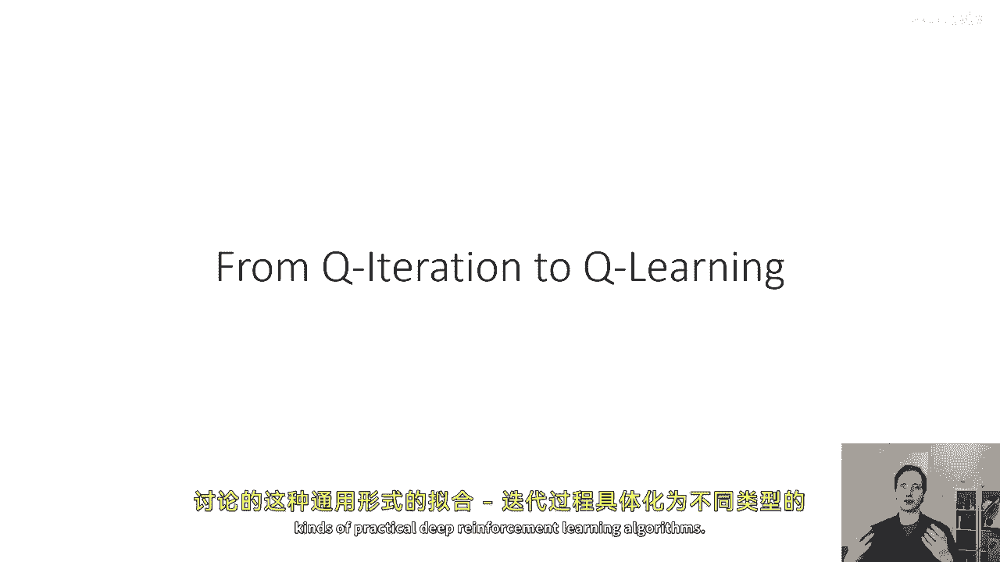
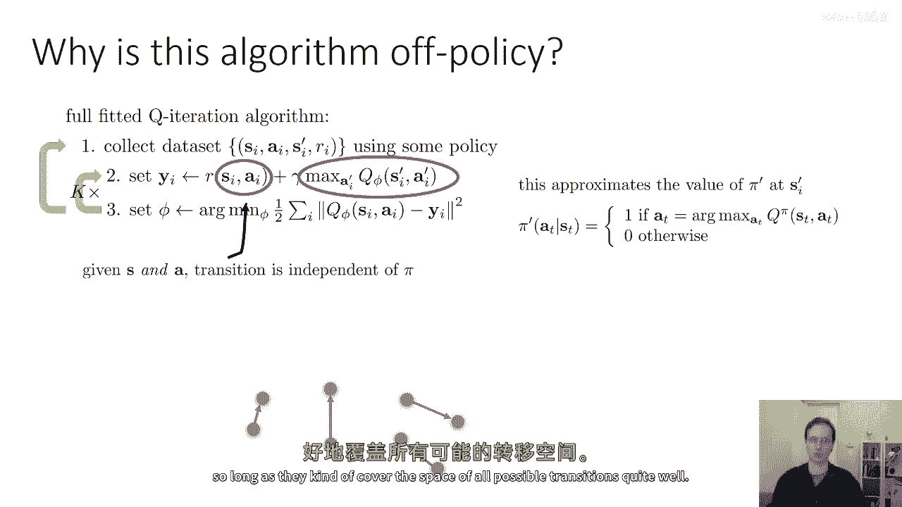
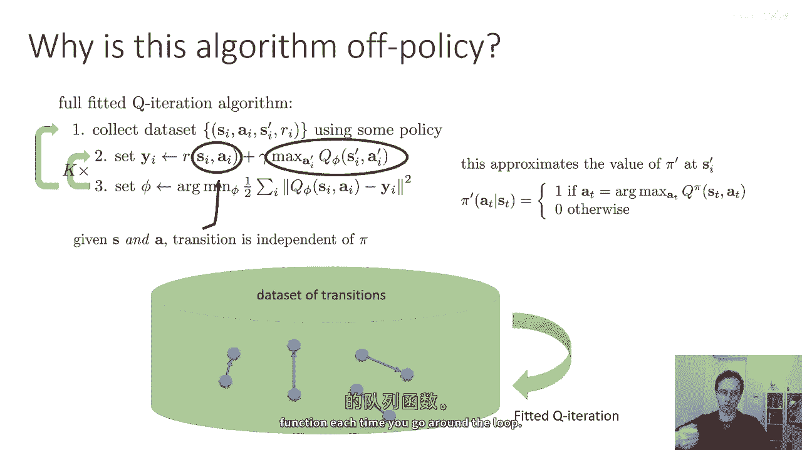
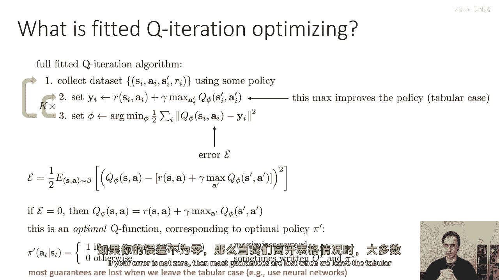
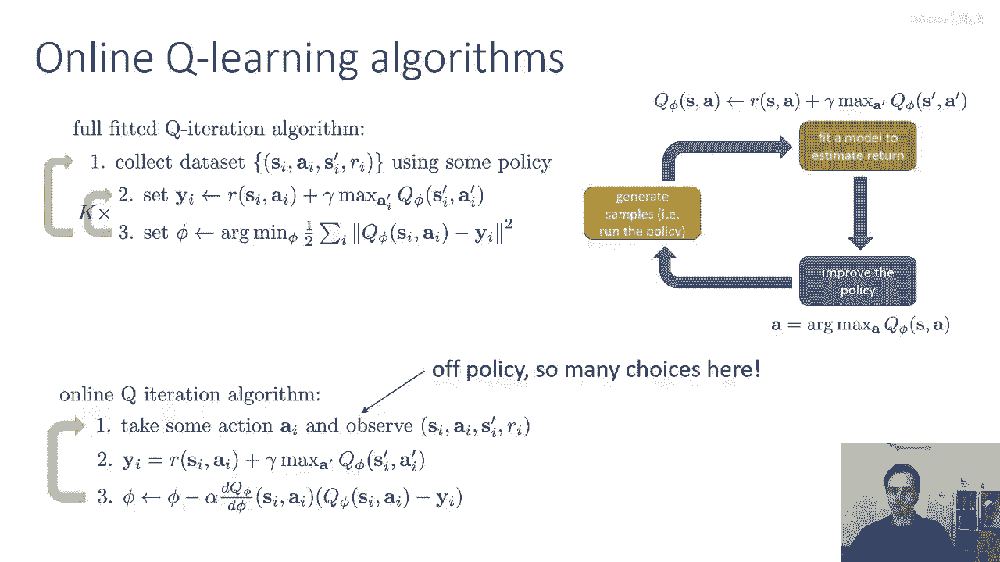
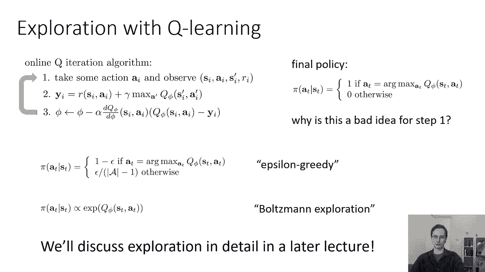
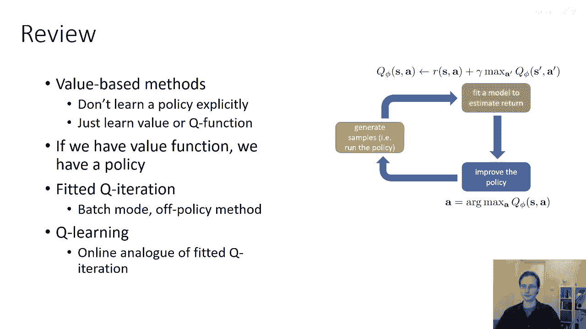

# 【深度强化学习 CS285 2023】伯克利—中英字幕 - P28：p28 CS 285： Lecture 7, Part 3 - 加加zero - BV1NjH4eYEyZ

好的，在接下来的讲座部分中，我们将讨论我们之前覆盖的这种通用形式的拟合q迭代，如何被实例化为不同类型的实际深度强化学习算法。

所以首先，让我们稍微谈谈拟合q迭代意味着什么，成为一个离线策略算法，所以只是提醒一下，政策的每个人都意味着你不需要最新的政策样本，以便能够运行你的rl算法，通常。

这意味着你可以在同一组样本上取许多梯度步骤，或者重用之前的迭代样本，所以你不必扔掉你的旧样本，你可以继续使用它们，这在实践中给你提供了更多的数据来训练，直觉上，拟合q迭代使我们能够使用离策略数据是因为。

政策实际上被使用的地方是利用q函数，而不是通过模拟器步进，所以当我们的政策发生变化时，真正改变的是这个最大值，记住我们如何得到这个最大值是通过取arg max，这就是我们的政策。

政策是arg max政策，然后，将政策插回q值中，以获取政策的实际值，所以，在那个最大值内部，你可以把它解包，并假装它是实际上的q phi of s i prime，逗号。

arg max of a q phi，并且argmax基本上就是我们的政策，所以这就是政策出现的唯一地方，而且很方便地，它以q函数的参数出现，这意味着随着我们的政策随着行动ai prime的变化。

我们不需要生成新的滚动，你可以几乎认为这是一种模型，q函数允许你模拟如果你采取不同的行动，你将得到哪种值，然后，当然，如果你想要最大程度地改善你的行为，那么你将采取最佳的行动，所以。

这个最大值近似于π的质数值，在我们的si质数策略中，我们的贪婪政策，这就是为什么我们不需要新的样本，我们基本上使用我们的q函数来模拟新动作的值，所以，给定一个状态和一个动作，过渡实际上与π无关。

如果si和ai是固定的，无论我们如何改变π，si的质数值都不会改变，因为π只影响ai，在这里ai是固定的，所以，你可以这样思考如何适应q迭代，从结构上看，你有一个大的桶，包含不同的状态转换。

你将在每个状态转换上备份值，每个备份都将提高你的q值，但你实际上并不那么关心它们是哪些特定的状态转换，只要它们大致覆盖所有可能的状态转换的空间。

所以你可以想象你有一个状态转换的数据集，你只是在这个数据集上运行fit a queue iteration，不断地改进，每次你围绕循环走一圈，你的q函数都会得到改进。

fit a queue iteration优化得很好的步骤是什么，在你取最大值这一步骤中，它可以改进你的策略，所以，在表格的情况下，嗯，这个，这将实际上是你的政策改进，而你的第三步是最小化拟合误差。

所以，如果你有一个表格更新，你将直接将这些y值写入你的表格，但由于你有一个神经网络，你需要实际上进行一些优化来最小化对这些y值的误差，你可能不能将误差完全驱动到零。

所以你可以把一个q迭代看作是优化一个误差，这个误差是被尔曼误差，q phi s a和目标值y之间的差异，这就是离实际优化目标最接近的，但是当然，这个误差本身并不完全反映你政策的好坏。

它只是您能够复制目标值有多准确的度量，如果误差为零，那么你知道q phi s a等于rsa加上gamma max a prime，Q phi s prime a prime。

这是针对最优策略pi prime的最优q函数，当政策由argmax规则恢复时，所以这就是你可以显示的最大化奖励，但如果误差不为零，嗯然后嗯，你不能真正地说太多关于这个政策的性能，所以我们知道关于，嗯。

拟合q迭代在表格情况下，你的错误将会为零，这意味着你将恢复q星，如果你的错误不是零，那么在我们离开表格情况时，大多数保证都会丢失。

现在好了，让我们讨论一些拟合q迭代的特定情况，这些情况对应于文献中非常流行的算法，到目前为止，我们讨论的拟合q学习通用形式有这三步，收集一个数据集，评估你的目标值，训练你的神经网络参数以适应这些目标值。

然后交替执行这两步k次，然后经过k次，出去收集更多的数据，你可以用特定的超参数选择来实例化这个算法的特定情况，实际上对应于在线算法，所以在在线算法的第一步中，你采取精确的行动ai并观察一个过渡。

S i a i s i prime ri，然后在第二步中，你计算对你刚刚采取的过渡的一个目标值，非常，类似于你在在线演员批评者中计算优势值的方式，对于你刚刚进行的一次转换，然后在第三步中。

你进行一次梯度下降，在你的q值和刚刚计算的目标值之间的误差上踩一脚，所以我在这里的方程，看起来有点复杂，但我基本上只是应用了概率链规则到那个目标函数内部，第三步的Min，所以应用链规则。

你得到dqi/dphi在i，我乘以错误qi phi si ai a i减去yi，并且括号内的错误，q s i a i 减去 y i 有时被称为时间差误差，所以这就是基本的在线队列q学习算法。

有时也称为watkins q学习，这是一种我们在教科书中学习的经典q学习算法，并且它是一种非策略算法，所以您不需要采取行动，Ai使用您最新的贪婪策略。

那么您应该使用哪种策略，所以您的最终策略将是贪婪策略，如果Q学习收敛且误差为零，那么我们知道贪婪策略是最优策略，但在学习过程中，使用贪婪策略可能不是这么好的想法，这里有一个问题供你思考。

我们为什么不想使用贪婪策略，第一步中的argmax策略，在运行在线队列学习或在线队列持续时间时，花一点时间来思考这个问题，所以，我们可能不想这样做的一部分原因是因为这个弧线，最大策略是确定性的。

如果我们的初始q函数非常差，它就不会是随机的，但它将是任意的，那么它将基本上将我们的argmax策略承诺为采取相同的行动，每次它进入一个特定的状态，如果那个行动不是一个很好的行动。

我们可能会被困在基本上永远采取那个坏行动中，我们可能永远不会发现更好的行动存在，因此，在实际应用中，当我们运行拟合q迭代或q学习算法时，强烈希望修改我们在第一步中使用的策略，不仅仅是最大值策略。

而是要注入一些额外的随机性以产生更好的探索，在实际应用中，我们有许多选择可以帮助我们实现这一点，所以一种常见的选择被称为epsilon-greedy，这是最简单的探索规则之一。

我们可以与离散动作一起使用，并且这将是你们在作业中实现的，三epsilon-greedy简单地说，以一减去epsilon的概率，你将采取贪婪的行动，然后以一减去epsilon的概率。

你将随机选择其他行动，因此，每个行动的概率是一减去epsilon的max值，然后epsilon除以动作数量减去一，否则，这叫做epsilon阅读，为什么这可能是一个好主意，嗯。

如果我们选择epsilon为某个小数，这意味着大多数时候我们采取我们认为最好的行动，这通常是一个好主意，因为如果我们有，如果我们有，如果我们有它正确，那么我们将去一些好的区域并收集一些好的数据。

但我们总是有一个小但非零的概率采取其他行动，这将确保如果我们的q函数不好，最终我们将随机做一些更好的事情，这是一个非常简单的探索规则，并且在实践中被广泛使用。

一个非常常见的实际选择是实际上在整个训练过程中变化epsilon的值，这使很多 sense 因为你期待你的q函数在开始时会很差，在那时你可能想要使用更大的epsilon，然后随着学习的进展。

你的q函数变得更好，然后你可以减少epsilon，另一个探索规则是你可以选择你的行动，按比例于你q值的一些正变换，特别是指数变换特别受欢迎，所以如果你按你q值的指数采取行动，会发生的是。

最佳的行动将是最频繁的行动，几乎与最佳行动同样好的行动也会被频繁地采取，因为它们将有相似的概率，但如果某个行动的q值非常低，那么它几乎永远不会被采取，在某些情况下。

这种探索规则可能优于epsilon-greedy，因为与epsilon-greedy相比，恰好是最大值的行动发生的概率更高，如果存在两个行动大致相同，第二个最佳行动的概率要低得多。

而使用这种指数变换的规则，如果你真的有两个同样好的行动，你将会执行它们大约相同的次数，第二个原因它可能更好是如果你有一个真的很坏的行动，并且你已经学习到它只是一个真的很坏的行动。

你可能不想浪费你的时间去探索它，而epsilon greedy不会，嗯，利用这一点，所以这也有时被称为boltzmann探索规则，也是softmax探索规则，我们将在另一堂课中详细讨论更复杂的探索方式。

在课程的后半部分，但这些简单的规则希望足够实现基本的q迭代版本，和q学习算法。

好的，所以，让我们回顾一下我们已经覆盖的内容，我们讨论了基于价值的方法，它们不学习策略明确，但只是学习价值函数或q函数，我们讨论了如果你有一个价值函数，你可以通过使用arc max来恢复策略。

并如何我们可以设计这个拟合q迭代方法，它不需要知道过渡动态，所以它是真正的模型免费方法，我们可以以各种方式实例化它，作为批处理离线策略方法，或在线队列学习方法，嗯，取决于对这些超参数的选择。

我们收集数据的步数，梯度更新的次数。

