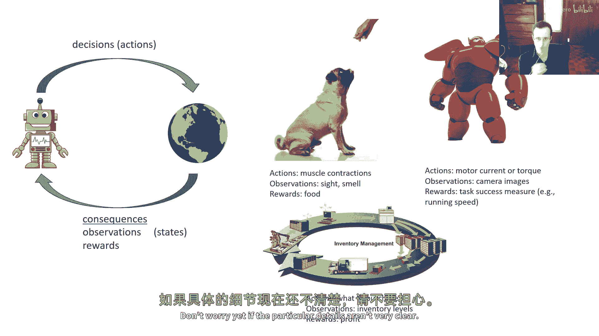
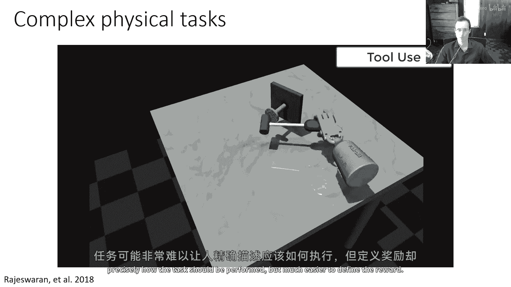
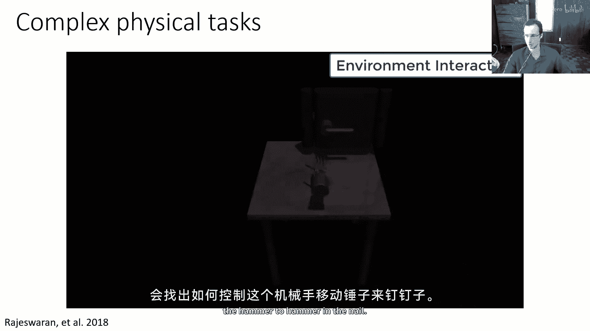
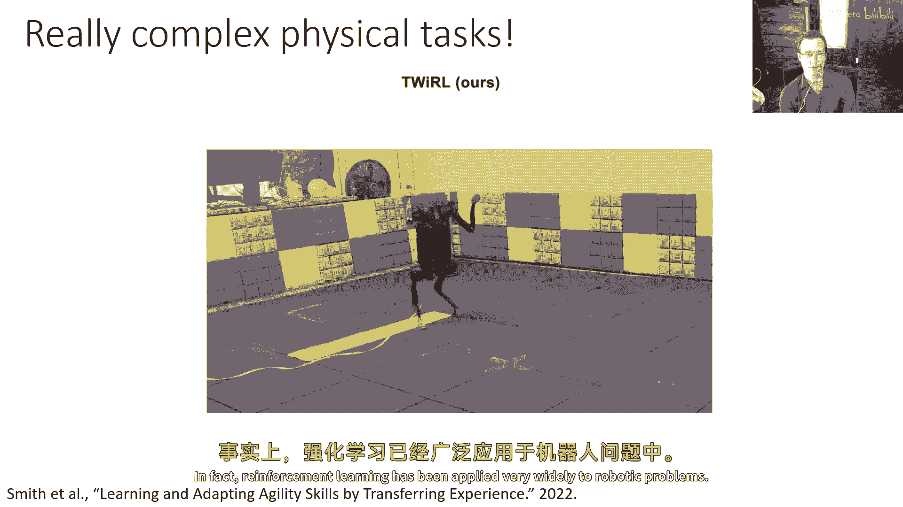
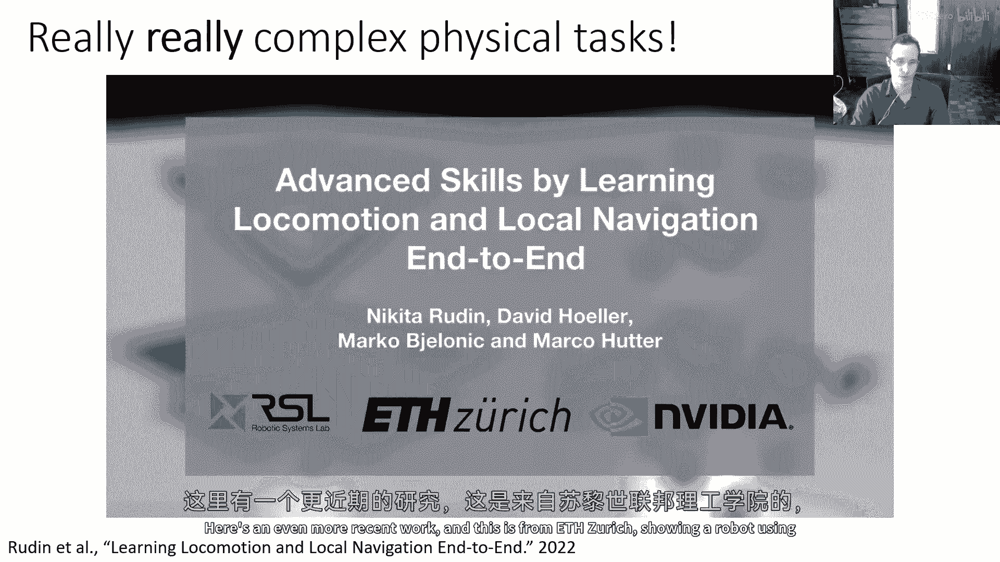
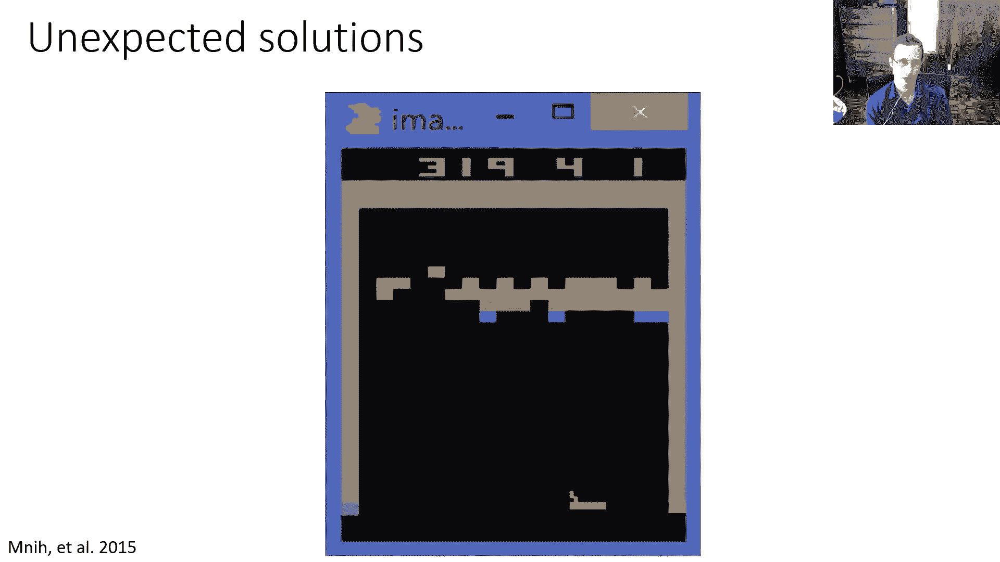
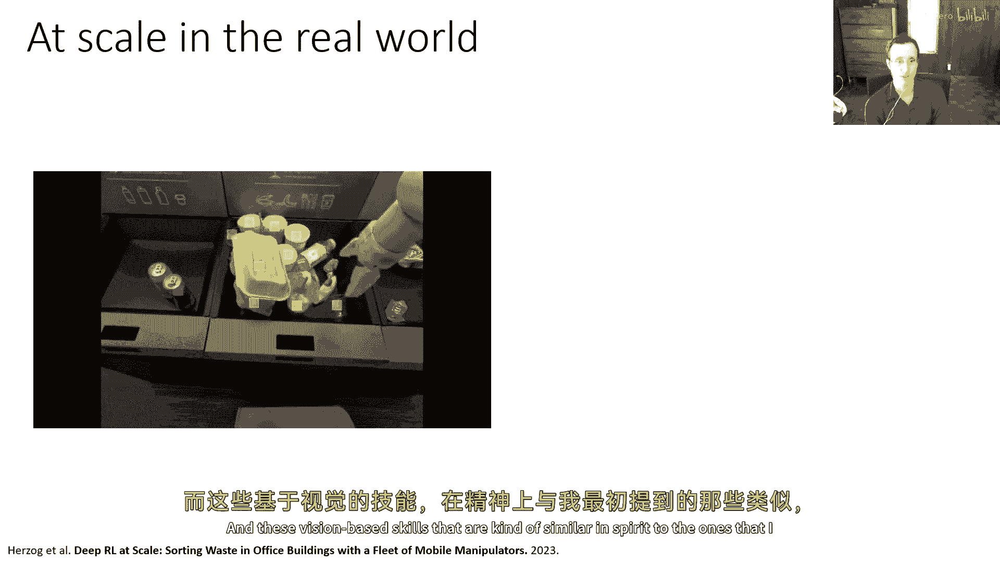
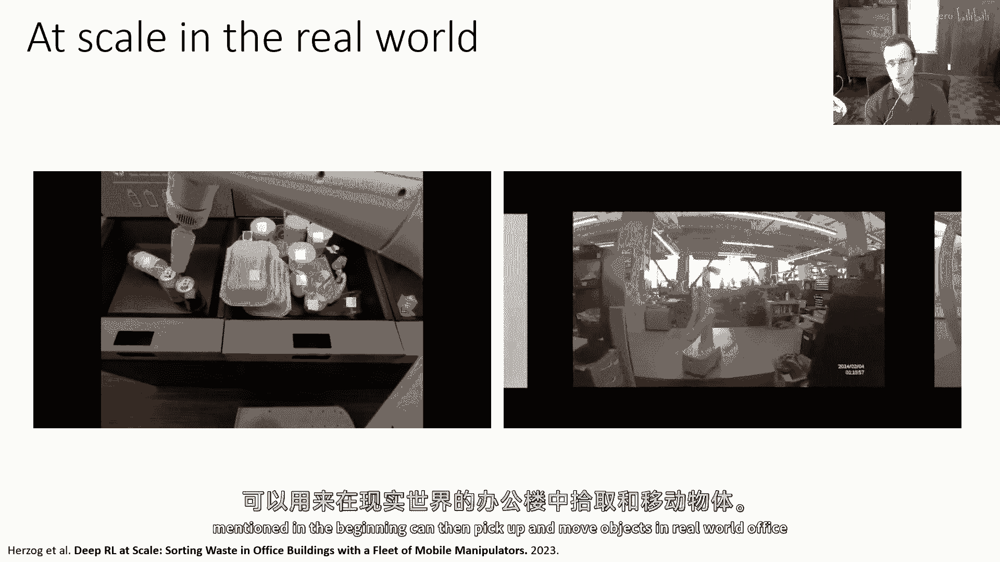
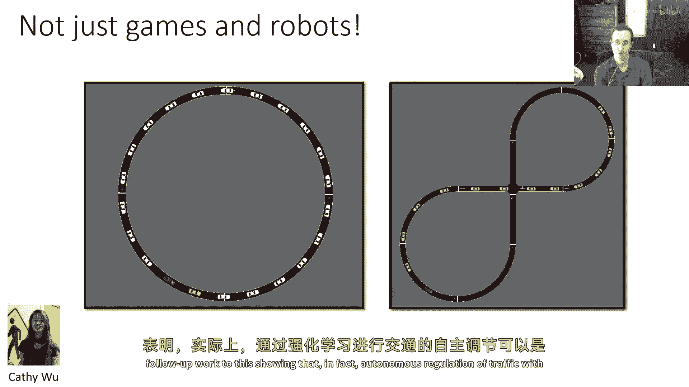
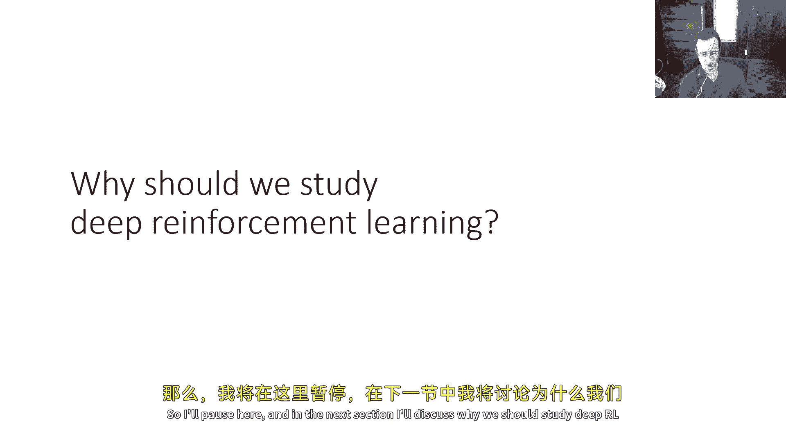

# 【深度强化学习 CS285 2023】伯克利—中英字幕 - P2：p2 CS 285： Lecture 1, Introduction. Part 2 - 加加zero - BV1NjH4eYEyZ

让我们谈谈我们在课堂上要覆盖的内容，所以这门课程将广泛介绍各种深度强化学习方法，我们将从一些基础开始，我们将从讨论如何从监督学习开始，嗯，决策方法到决策方法，提供一些定义，并一般性地理解强化学习问题。

然后，我们将有一个关于无模型强化学习算法的单元，我们将覆盖Q学习，策略梯度和演员-批评者方法，你将有一些作业，你需要实现这些，然后，我们将有一个关于基于模型的算法的单元，我们将谈论最优控制规划。

序列模型，图像和类似的东西，然后，我们将有一系列更先进的主题，我们将覆盖探索算法，我们将覆盖离线强化学习算法，这是方法，可以使用数据和强化学习方法，我们将谈论逆强化学习，这是关于从行为中推断目标函数的。

并且，嗯，我们将在那里讨论强化学习方法与概率推断之间的关系，然后，我们将有一些高级主题，如元学习和迁移学习，可能包括层次强化学习，以及一系列的研究演讲和邀请讲座，这就是课程的总体概述，你将有五个作业。

将有一个关于模仿学习的作业，策略梯度，Q学习、演员-批评者算法、基于模型的强化学习、离线强化学习，最后一个将是离线强化学习，并将有一个最终项目，最终项目是你选择的研究级别项目。

你可以组成一个由2到3名学生组成的小组，你非常欢迎提前开始这个项目，每年，学生都会有关于我们对这个项目期望范围的问题，大致来说，你应该把它想作为大约是你可能会提交到研讨会的论文水平。

如果你不确定你项目的范围，绝对来办公室时间与我或TAs谈谈，我们将为您的项目提供多轮反馈，所以，我们将有一个项目提案截止日期和一个项目里程碑报告，这些主要是为你们设计的，我们强烈鼓励你编写你的计划。

我们将为您的项目提供多次反馈，所以，我们将有一个项目提案截止日期和一个项目里程碑报告，这些主要是为你们设计的，我们强烈鼓励你编写你的计划，描述潜在的关注点，你对你的计划等有疑虑，我们将对这些提供反馈。

所以提案和里程碑并没有被严格评分，他们实际上意味着更多的是一种让你对你的项目计划获取反馈的方式，在学期末的最后报告中，你对作业的评分将占50%，项目占40%，测验占10%，嗯，每堂课后。

你有五个作业的迟到日，你不超过这五个迟到日，总共五个迟到日，如果你超过了它们，那么我们，嗯，不幸的是我们不能为你的作业给予信用，嗯，你今天也有一些作业，嗯，确保你已经注册了ed，嗯，uc，伯克利，cs。

285，所有已经正式注册了世界课程的人，无论收到了这个邀请的谁，我们强烈建议你开始形成项目组，除非你想要单独工作，这是可以的，并且参加第一节课的测验。

所以第一节课的测验已经发布在great scope上，第一节课的测验，嗯，非常，一个练习测验，它不是，那里没有真正的测验，嗯，它主要是为了让你熟悉great scope的界面，然而。

我今天的主要讨论焦点是讨论，我们为什么应该学习强化学习，它是什么，以及我为什么自己喜欢教这门课的一些背景，让我们从一些基本开始，什么是强化学习呢，强化学习实际上是两件事，它是基于决策学习的数学公式。

它也是一种通过实验学习决策和控制的方法，重要的是要记住，这些有些分离，因为我们可以想象应用形式化，然后对它应用各种各样的方法，所以不要将强化学习与它们混淆是很重要的，强化学习的问题，解决方案，好的，嗯。

你们可能最熟悉的机器学习类型是监督学习，监督学习定义相当直接，你有一个数据集，包括输入和输出，我们通常将它们称为x和y，你想要学习如何从x预测y，所以你想要学习一种关于x的函数f，这种函数输出值y。

这些值接近数据集中的y标签，所以，例如，f可能由一个深度神经网络表示，你将通过分类或回归来训练它，以匹配标签y，"并且，虽然监督式机器学习的基本公式非常直接"，"监督式机器学习方法做出了一系列假设"。

"因为我们往往甚至没有想过，因为它们如此自然"，"但是，这些都是值得提及的"，"如果我们要讨论这与强化学习的不同之处"，"监督学习通常假设被称为独立同分布的数据"，在某些方面，这种假设是如此的显而易见。

"尤其是对于学习机器学习的人来说"，"我们往往没有明确表达出来"，"但是，它的意思是所有这些x"，你的数据集中，X和Y对是相互独立的，在含义上，一个X的标签不会影响另一个X的标签，并且它们分布相同。

在含义上，产生Y标签的真实函数，从X的函数对于所有样本都是相同的，这基本上是一个显而易见的陈述，嗯，但是，这是一个我们需要记住的事情，监督学习，也假设我们的数据集是标记的，从意义上说。

我们在d中看到的每个x都有一个伴随的y，并且y是x的真实标签，如果你在做像图像分类这样的任务，标签来自人类，那么这是非常自然的，但是记住我们在抓握例子中讨论的，如果你想让机器人学习如何抓握物体。

这可能实际上并不自然，假设你被给予一组图像，这实际上是一个非常强的假设，带有最佳抓握位置的地面真实，强化学习不假设数据是独立且同分布的，从意义上说，之前的输出影响未来的输入，事物被安排在时间序列中。

并且过去影响未来，通常真实答案并不清楚，只知道一个特定结果的好坏，它是否成功或失败，或者更一般地说，它的奖励价值是多少，所以在强化学习中，你可能收集数据，但你不能简单地复制那些实际上不导致成功的数据。

数据可能告诉你哪些事情成功了，哪些事情失败了，尽管甚至那些标签也很难正确解释，因为如果你有一个导致失败的事件序列，你不知道是哪个事件，哪个序列中的特定选择是，导致失败的那个，这与人类决策类似。

也许你在课程的末尾得到了一个糟糕的成绩，嗯，不是你在cal central查看你的成绩，导致了你的成绩不及格，而是你在课堂上早期的某个行为，也许你在考试时的表现不好，也许你没有意识到这会导致你失败课程。

所以这是非常我们在强化学习中面临的问题，被称为信用分配，导致好结果或坏结果的决策，可能本身不会被标记为更高的或更低的奖励，奖励可能只会在后来发生，所以我们需要处理这种数据，它可能没有标记为最佳输出。

可能涉及到这些延迟的奖励，在数据上运行强化学习，并希望得到比之前看到的行为更好的行为，所以这真的是强化学习中的一个挑战，所以让我们尝试使这个更精确一些在监督学习中，你有一个输入x和一个输出y。

你的数据集由xy对组成，目标是学习一个函数，该函数接受x并近似y，并且通常这个函数有一些参数，这些参数被称为theta，这些可能包括，例如，在强化学习中神经网络的权重，我们有一种循环的在线学习过程。

其中代理与世界交互，代理在每个时间点选择动作a_t，世界以结果状态s_t+1和奖励信号响应，奖励信号仅指示该状态的好坏，但它并不总是告诉你，你刚刚采取的行动是好是坏，也许你运气好，落在了一个好状态。

或者你可能很早就做了一些很好的事情，导致你现在进入了一个好状态，我们的输入，嗯，每个时间步，代理将处于一个状态，所以，这是一种x的类似物，输出是a，但是，每次时间步。

代理自身收集的数据经典上包括状态序列，动作和奖励，奖励是数字，标量值，而在监督学习中，数据被提供给你，你不必担心，嗯，"谁给你"，"数据仅以强化学习中的x y元组的形式提供给你。"。

"你必须选择自己的行动并收集自己的数据"，所以，"你不仅要担心这个事实"，"您的数据集中的行动可能不是最优的行动"，"你也需要实际决定那个数据如何收集"，"你的目标是学习政策π/θ"。

这映射状态到动作a，就像f pi有参数theta一样，所以那些可能再次是神经网络的权重，一个好的策略是使累积总奖励最大化的，所以不仅仅是时间点的奖励，而是代理收到的总奖励，所以这涉及到战略推理。

你可能现在会做一些看似无奖励的事情，为了获得更高的奖励，所以让我们谈谈一些问题如何被 cast 的例子，在强化学习的术语中，假设你想要训练一只狗执行一些技巧，所以，在这种情况下。

动作可能包括狗肌肉的收缩，观察可能包括狗通过视觉和嗅觉感知的事物，奖励可能它是得到的奖励，然后，狗会学习做任何事情，以最大化那个奖励，这可能是你想要执行的技巧，因为你用食物奖励它，当狗执行技巧时。

技巧成功，好的，嗯，这是另一个例子，也许你有一个机器人，它的动作可能是电机电流或扭矩，向其电机发送的某种激活命令，它的观察可能是来自其传感器的读数，如相机图像，并且其奖励可能是任务成功的某种度量。

也许这个机器人需要尽可能快地运行以到达目的地，所以其奖励函数可能是运行速度，或者可能是它到达目的地与否，也许当它成功到达目的地时，它可能会获得一个加1的奖励，否则会得到一个减1的奖励。

否则这里有另一个问题，假设你想要管理不同仓库之间的库存路线，为了保持库存水平，可能动作是购买哪些库存，观察是当前库存水平，奖励可能是你赚取的利润，也许如果你想长期存储库存，就需要支付。

所以你的利润会降低，所以你可以看到，这种表述非常一般，许多不同的问题都可以被归类为强化学习的框架，当然，稍后我们会使所有这些都更加精确，所以这是一次非常高级别的介绍，不要害怕，如果特定的细节不是很清楚。

稍后我们会使这些更加精确，但现在，让我给你一些强化学习方法可能能做的事情的例子，强化学习在处理物理复杂任务方面非常擅长，任务可能很难让人精确描述应该怎么做，但定义奖励却更容易。

例如，在这种情况下，钉子应该被敲入的奖励，强化学习算法会找出如何控制这个机器人手来移动锤子，敲入钉子。

这里有另一个复杂的物理任务，四足机器人需要能够跳跃，嗯，越过不同障碍，手动编写代码，跳跃的技能，像这样是非常困难的，但强化学习可以学习出允许机器人在不同位置跳跃的动作，到不同的距离。

甚至可以执行更复杂的物理任务，所以这里，嗯，在下一个视频中，四足机器人，这是一个基础方法，所以不要害怕这个，这里，这个四足机器人需要找出如何站在后腿上保持平衡，这也是非常困难的手动完成。

但使用适当的强化学习方法，这是可能的，实际上，强化学习已经被广泛应用于机器人问题中。

这里有一个更近的工作。

这是来自苏黎世的工作，展示了一个使用强化学习的机器人，结合了模拟优化来学习各种敏捷技能，你可以看到，它可以像攀爬障碍物和这样的东西，强化学习另一个擅长的地方是产生意想不到的解决方案，我之前提到过这一点。

以AlphaGo为例，这里有另一个例子，你将在实际作业中实现它，在何处，并发现如果将球弹过砖块，那么我们就会弹来弹去并获得很多分数。

强化学习也可以在现实世界中应用于更大规模，这是一个项目，嗯，那是在嗯时候做的，嗯，一家叫做日常机器人的公司，这是一家字母公司，在这里，机器人学习如何分类垃圾，所以，想法是如果人们将垃圾放入可回收物。

那应该实际上进入堆肥，然后，机器人可以来分类它，这里的机器人在这里学习现实世界，"无论是在这些教室环境中"，"他们那里可以练习"，"并且在类似的实际办公大楼中"，"并且这些基于视觉的技能。

在某种程度上具有相似的精神。"，"嗯，对于那些我在开始提到的人"。

"然后，你可以在真实的办公室大楼中拿起和移动物体。"。

"所以，你能够实际练习这些事情真的很棒"，"你可以在工作中练习它们"，"你可以在现实生活中练习它们"。

嗯，当然，这不仅仅是为了游戏和机器人，嗯，我真的很喜欢下一个例子，这是kathy wu完成的工作，她现在是麻省理工学院的教授，之前在这里的加州大学伯克利分校是博士生，kathy正在研究的是。

用于控制交通的强化学习算法，嗯，这是一个种玩具例子，这些车在圆圈中驾驶，那么通常会发生什么，即使在像这样简单的圆形环境中，如果你有一个非常合理的，一个非常准确的人类驾驶员行为的模型。

你实际上会看到交通拥堵自发形成，所以汽车会 kind of 聚集起来，当它们聚集成这样时，它们实际上会自发形成交通拥堵，即使它们驾驶在圆形中，所以凯瑟琳然后做的就是优化了强化学习的策略。

下一个将为红色显示的汽车展示什么，不优化其自身的速度，但优化整个圆形的速度，你可以看到，红色汽车将要做的实际上是减速，等待所有人解决交通拥堵，通过稍微慢一些，实际上可以避免整个圆形的交通拥堵形成。

我们还在其他设置中尝试过这个，这是一种八字形交叉口，正如你可能预期，汽车会在这个交叉口聚集，造成延误，所以，如果有一辆自动驾驶汽车，试图优化所有汽车的驾驶速度，自动驾驶汽车实际上会稍微减速并调节交通。

以便每个人都能在精确的时间通过交叉口，现在，这个例子可能稍微有些合成，但对这个有相当多的后续工作，表明，实际上，使用强化学习的自动驾驶交通调节可以是一种非常有力的工具。

强化学习也被广泛应用于语言模型，嗯，你们中许多人可能对最近的语言模型进步有所了解，比如聊天的，Gpt，和其他许多，嗯，系统如人类学，Quad或谷歌的bard，这些系统使用大量的数据来训练模型。

以满足用户的请求，这是右边的一个例子，有人问Gpt如何使用人类反馈的强化学习工作于语言模型，它现在产生了一种自己的解释，大型语言模型训练于大量的互联网数据，可以解决非常复杂的问题。

但说服他们这样做相当困难，因为这些模型基本上试图根据他们从互联网数据中学到的内容完成文本，所以你必须以一种方式提示他们，以便他们可以索引到正确的上下文，强化学习可以使这更容易。

通过基本上根据人类评分来训练这些模型，而不是只是问他们提供最有可能来自互联网数据的完成，他们可以实际上被训练来回应查询，以人类用户认为可取的方式，强化学习实际上是这非常重要的一部分。

强化学习也被用于图像生成，这里是一个与Stable Diffusion 1。4的示例，如果你要求它生成一张海豚骑自行车的图片，它实际上生成的图片对于这一点并不好，你可以做，你取这张图片。

并将其交给一个标题模型，在这种情况下，熔岩会产生对图像的描述，然后使用rl，在哪里奖励函数被给出，由熔岩和原始提示之间的相似度决定，所以当熔岩看这张照片时，它可能会说，哦。

这是一张在水面上方游泳的鲸鱼照片，这与骑自行车的鲸鱼并不相似，所以因此它为此收到一个坏的奖励，如果我们然后使用rl优化图像生成模型以最大化这个奖励，它会逐渐使图像更符合提示，所以现在有鲸鱼和自行车。

尽管鲸鱼还没有骑自行车，只需要几轮迭代，现在有一个实际上骑自行车的鲸鱼样生物，并且随着更多的迭代，生物变得明显地更像鲸鱼，在背景中添加一些波浪似乎使它更加像鲸鱼，然后最终有一幅完整的鲸鱼骑自行车的照片。

因此，强化学习可以用于优化图像生成模型，强化学习也可以用于其他事情，这是一个关于嗯，芯片设计的例子，其中动作对应于布局中的芯片部件放置，奖励与各种芯片设计参数有关，如成本或拥堵或芯片的延迟，嗯，因此。

强化学习实际上可以应用于相当广泛的领域，所以我在这里暂停一下，在下一个部分。

