# 【深度强化学习 CS285 2023】伯克利—中英字幕 - P31：p31 CS 285： Lecture 8, Part 2 - 加加zero - BV1NjH4eYEyZ

好的，到现在为止，我们已经几乎开发出了一种实用的深度Q学习算法，我们可以实际使用，但是，我们还需要讨论另一个组件，才能使程序稳定可靠。

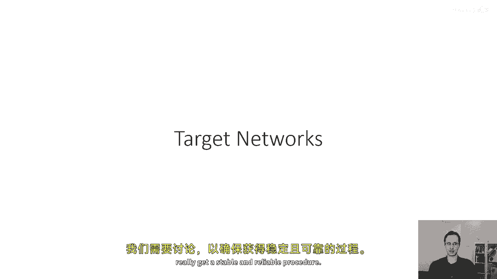

所以，我们还没有解决另一个问题，所以到目前为止，我们解决了样本相关的问题，通过引入回放缓冲器，我们在这里存储我们所收集的所有数据，每次我们需要更新Q函数的参数时，我们实际上进行这一步骤。

使用从缓冲器中采样的独立同分布过渡的批次，但我们仍然面临着这个问题，那就是Q学习不是梯度下降，特别是Q学习面临的问题是目标在移动，所以你可以想象它是平方误差回归，除了回归目标本身一直在变化。

而且总是在我们下面变化，这使得学习过程很难收敛，我们将通过使用回放缓冲器来解决相关性。

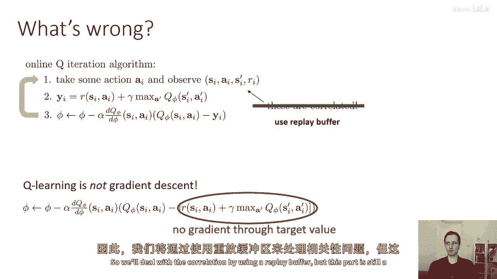

但这仍然是一个问题，那么，Q学习与回归有什么关系。

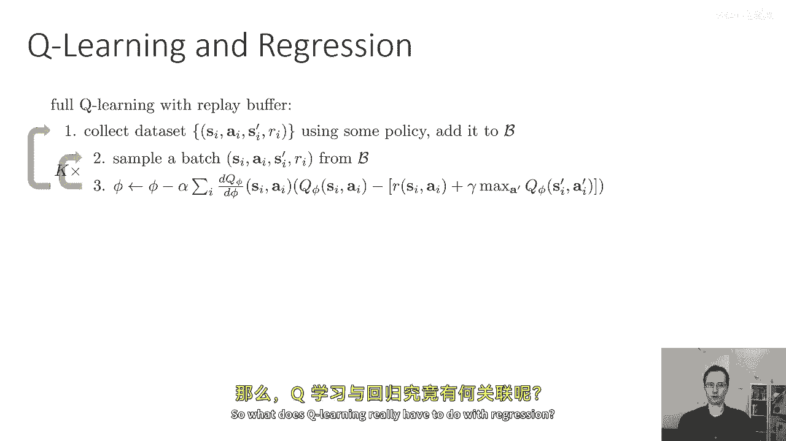

在我之前描述的全部拟合Q迭代算法中，步骤三执行，看起来像监督学习。

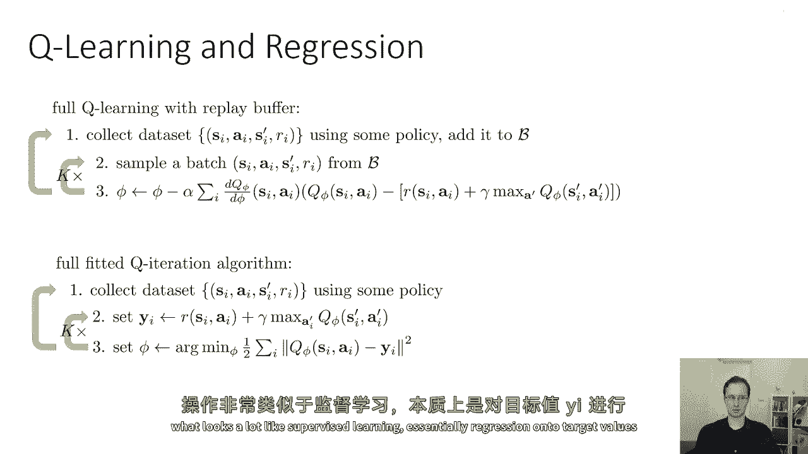

本质上是回归到目标值，Y i 和实际上，一般来说，步骤三在全部拟合Q迭代算法中会收敛，如果你遇到收敛，但然后你的目标会从我们下面变化，所以也许你不想让它们收敛，本质上。

在不正确的目标上收敛并不是一件好事，这就是为什么在实际中我们经常使用比梯度步数更少的数量，甚至只有一步梯度，我们有这个移动目标问题，每次梯度步，我们的目标都在变化，我们的梯度却不变，考虑到目标的变化。

所以直观上，我们想要解决的问题是介于两者之间的一些东西，我们可以有一些全拟合Q迭代算法的稳定性，在步骤三中，我们训练一个收敛，但同时不实际训练到收敛。

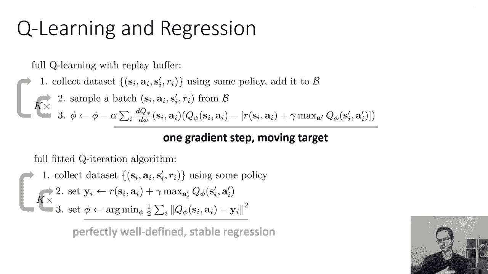

这就是我们如何使用回放缓冲器和目标网络进行Q学习的，这将看起来像一个混合，在线Q学习算法和全批拟合Q学习算法之间的一种，我们将使用一些策略来收集我们的数据集，并将该策略添加到缓冲器中，这是第二步。

第一步稍后会揭示，我们将在内部循环中采样一个批次，S i a i s i prime ri从这个缓冲器中，然后，我们将更新Q函数的参数，这个更新看起来像以前使用回放缓冲器的更新，但是。

我进行了一个非常小的更改，现在，max参数中的参数向量是不同的参数向量，以前，我会在一个质数qphi上取最大值，现在是qphi'，其中phi'是另一个参数向量，然后，当然。

在我进行这些前后更新的k次之后，这可能只是k等于1，我会出去收集更多的数据，然后，我有一个大的外部循环，在每个收集n步数据后，我会实际更新phi'，并将其设置为phi。

这看起来与我以前有过的拟合q持续时间程序非常相似，因为基本上我正在做多次更新，目标值相同，因为如果phi'保持不变，那么整个目标值保持不变，除非我在那个内部循环中可能还在收集更多的数据，步骤二。

数据收集现在处于phi'更新的内部，我们做这个的原因是因为在实际应用中，你通常想要尽可能多地收集数据，而对于稳定性，你通常不想太频繁地更新你的目标值参数网络，所以你知道一些一些粗略的估计。

k可能介于1和4之间，所以我们可能在每次收集更多数据时更新1到4步，n可能大约是10，000，所以它可能需要10，000步才更改我们的目标值，这是因为我们要确保我们不是在试图击中一个移动的目标。

因为用监督回归击中移动的目标非常困难，最初，我们初始化phi和phi'，基本上作为一个随机初始化，然后，在第一个n步，这可能是10，000步，我们将更新phi'，将其设置为等于phi，但是。

phi'将在接下来的10，000步中保持静止，这意味着步骤四开始看起来更像监督回归，因此，步骤四更容易做，它更稳定，你更有可能得到一个学习有意义q函数的算法。

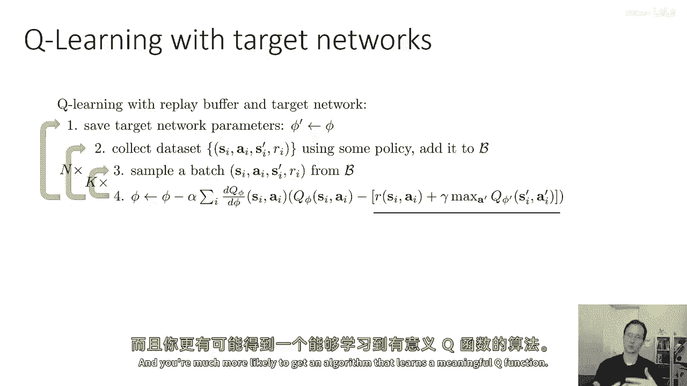

你的目标在内部循环中不变，这意味着基本上步骤二，三和四看起来像监督回归，唯一的真正区别是你可能收集更多的数据，这个数据可以使用你最新的。

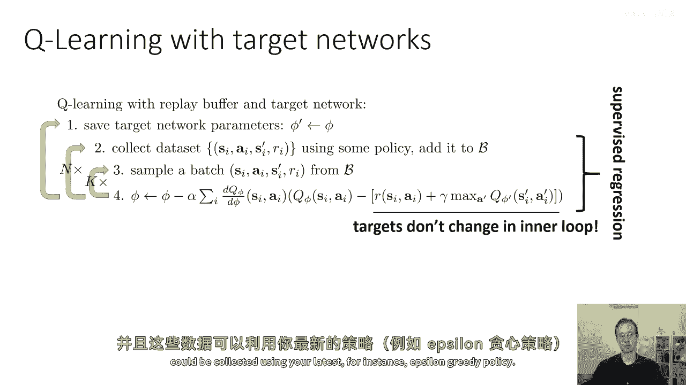

例如，epsilon-greedy策略，基于这个一般配方，我们可以得出一种经典的深度q学习算法，有时被称为dqn，不要被名字混淆，dqn本质上就是q学习与深度神经网络，这是这种一般配方的特定情况。

我概述了，这个特定情况看起来像这样，步骤一，采取一个动作，AI观察并观察结果转换，然后将其添加到缓冲区，所以这看起来像在线Q学习步骤二，从缓冲区中随机均匀地采样一个小批量。

所以这个小批量可能甚至不包含你在真实世界中刚刚采取的转换，步骤三。

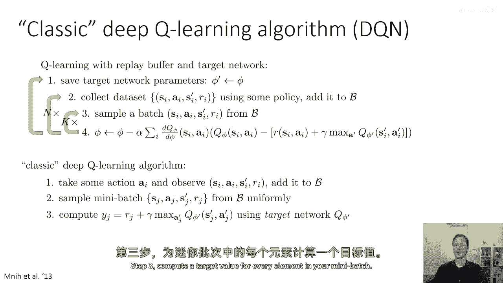

为每个元素在你的小批量中计算一个目标值，你现在使用目标网络来计算这些目标值，Q phi prime，步骤四，更新当前的网络参数phi，基本上通过在目标值上进行回归的梯度来更新，现在请注意，到目前为止。

phi还没有在任何其他地方被使用，除非你可能在步骤一中使用epsilon greedy策略。

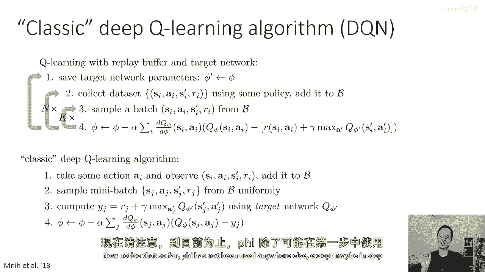

因为那么在步骤一中，你根据epsilon greedy采样规则来选择你的行动，对于由arg max over q phi隐式诱导的政策，所以那是q phi可能被使用的另一个地方，然后步骤五。

哪个只在每个结束步骤才做，是为了更新五个prime，通过替换phi prime或phi，正如我所说，n可能大约是一万，然后您重复这个过程，需要注意的是，这个程序基本上是更一般程序的特例，在幻灯片的顶部。

花一点时间来思考这个问题，花一点时间来思考什么，在顶部，算法参数的特定设置，将产生底部的经典深度Q学习算法，所以您基本上会得到这个算法，如果您选择k等于一，这基本上是您唯一需要完成的事情。

如果选择k等于一，嗯，那么你将精确恢复底部的程序，花一点时间来思考这个问题，这并不是显而易见的，因为步骤的编号已经被，嗯，稍微重新排列了一下，但他们基本上是同一种方法，好的，嗯，而且。

对这个程序有一个深入的理解是非常好的建议，因为所有的你们实际上都将为作业三实施它，所以，如果你使用k等于一，那么你将得到顶部的程序。

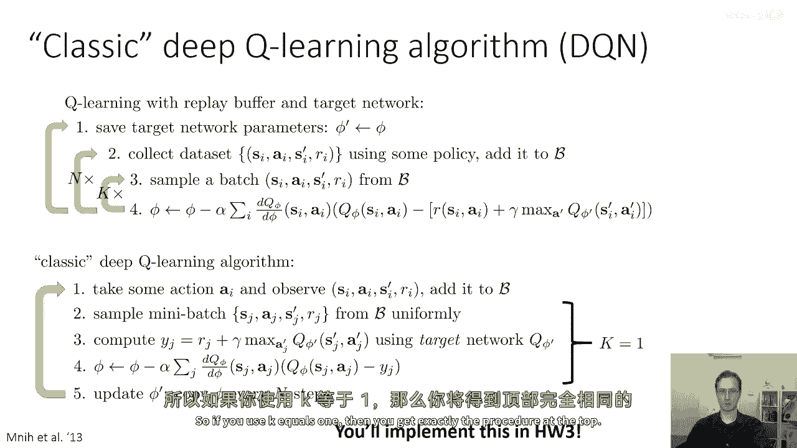

现在，有一些在其他文献中被用于处理目标网络的其他方法，这可能值得尝试，这种更新目标网络的方式有一些奇怪的地方，这里有一些直觉来说明一些奇怪的地方，这种奇怪并不一定真的很坏，它只是稍微有点奇怪。

所以让我们假设我采样了我的转换，然后我更新了我的phi，然后我采样了另一个转换，我更新了我的phi再次，所以蓝色盒子是样本，这基本上是第一步，绿色盒子是，嗯，这是第一步，第二步，第三步和第四步。

然后我像这样继续下去。

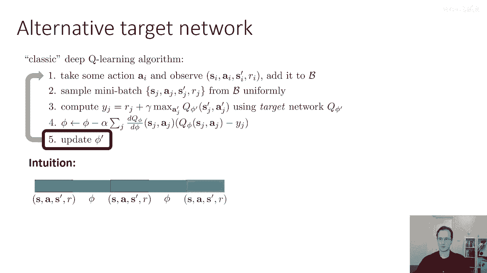

然后在这一步，也许我的目标网络是从第一步获得的，所以可能在第一步开始时，Phi'等于phi，所以第三步我从第一步返回目标值，在第二步我从第一步获取它们，在第四步我从第一步获取它们。

然后如果第四步是我更新phi'使它等于phi的地方，所以基本上如果我的n等于四在实际中，N将大大增加，但让我们假设它等于四，那么在第五步我从前一步获取我的phi'，所以似乎不同的阶段。

目标值被滞后了很大的量，如果你在步骤之后，如果你在n加1步，你的目标网络只有一步旧，如果你在翻之前。

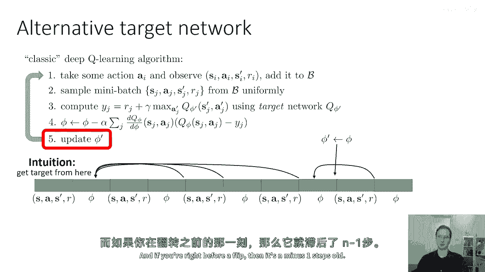

那么它是n-1步旧，所以似乎在不同的时间点，你的目标值看起来更像移动目标而不是别人，如果你像设置五'等于五的那个点之后，如果你在这些翻转中的一个之后，然后它，你的目标真的看着像移动目标。

如果已经很长时间，那么它真的不像移动目标，所以这感觉有点不对劲，这并不是一个真正的问题，但如果感觉有点不对劲，那么一种常见的选择是你可以做的是你可以使用一种不同的方式来更新。

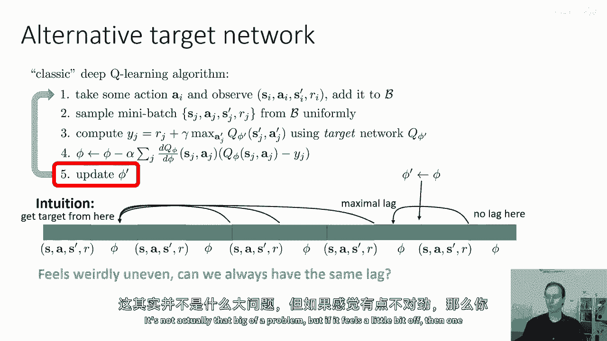

这是一种类似于多平均的方法，对于那些熟悉凸优化的人，可能会认出这实际上是多平均的一种变体，所以一种流行的替代方法是设置phi'在每个步骤，设置为tau乘以旧的phi'。

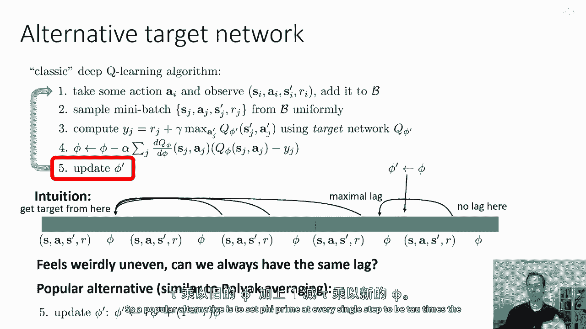

加上1减去tau乘以新的phi，所以你可以想到这个，作为phi'逐渐插值于其旧值和新值由phi定义的值。

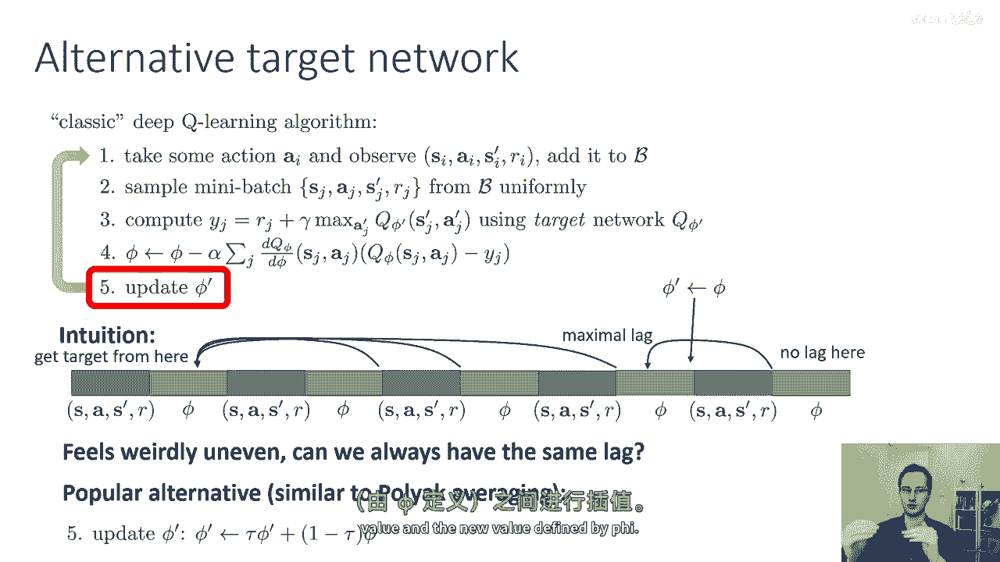

你会选择tau是一个很大的数字，例如你可能选择它等于0。9999，这意味着，嗯，千分之一的部分本质上来自phi，其余的部分来自phi的倍数。

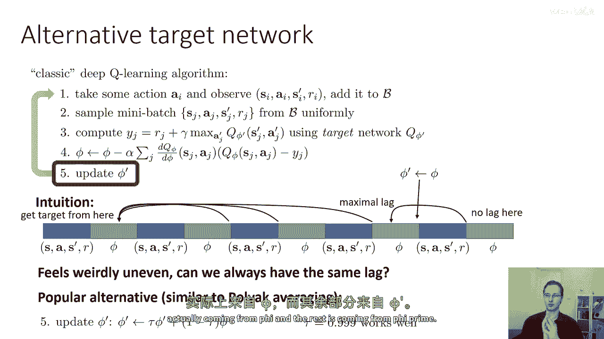

现在将神经网络参数这样混合可能会显得有些奇怪。

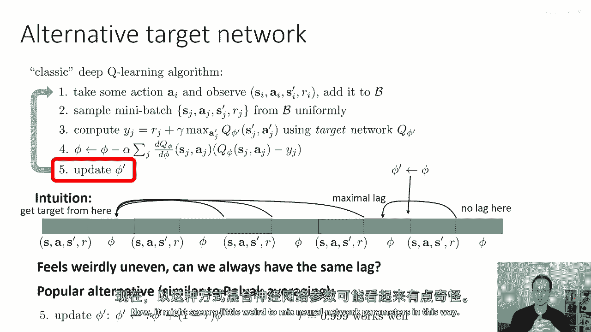

所以人们可能会假设，如果你这样混合神经网络参数。

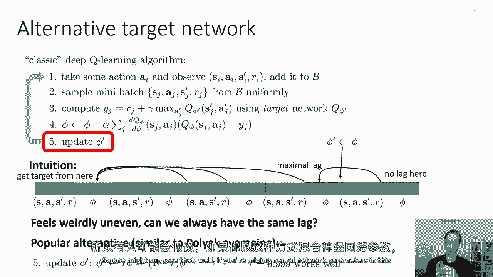

你知道网络参数不是线性的，所以线性插值它们的参数可能会产生完全垃圾，实际上，如果phi的倍数之前被设置为phi。

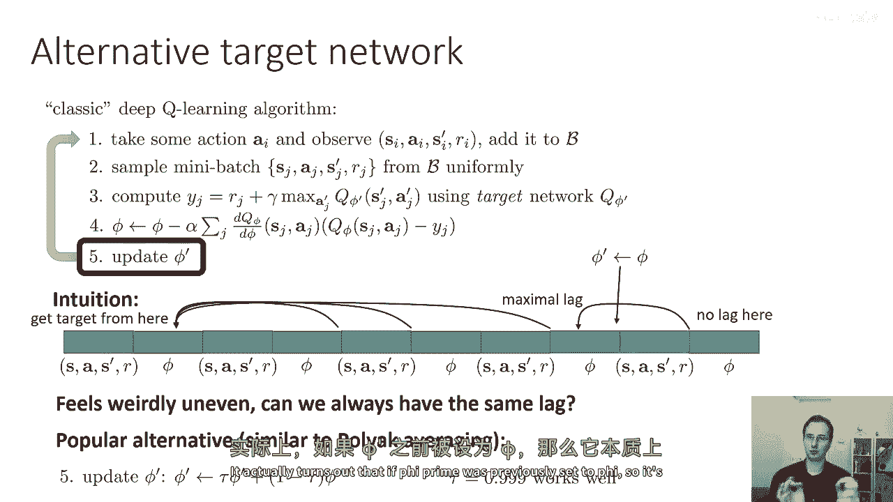

那么它实际上就是phi的滞后版本。

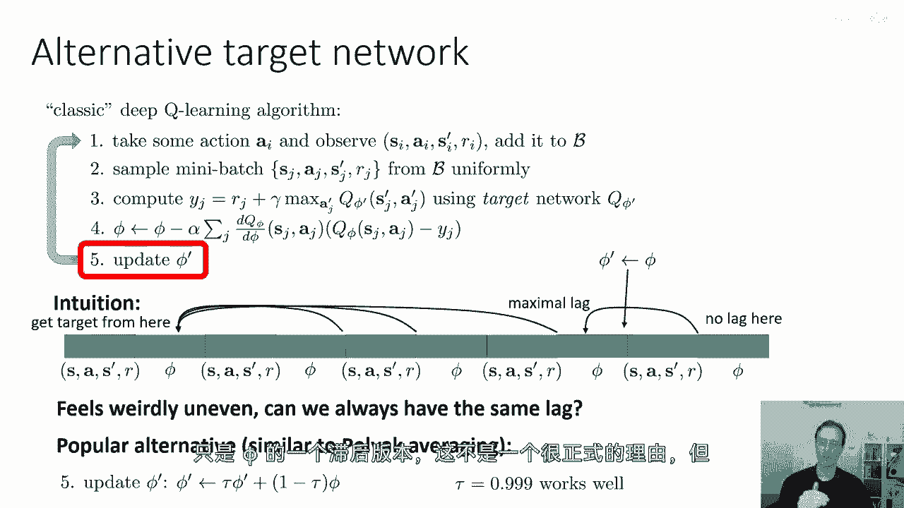

这种程序有一些理论上的依据，不是正式的依据，但是有一些，来自与多平均数的联系，我在这次讲座中不会深入讨论它。

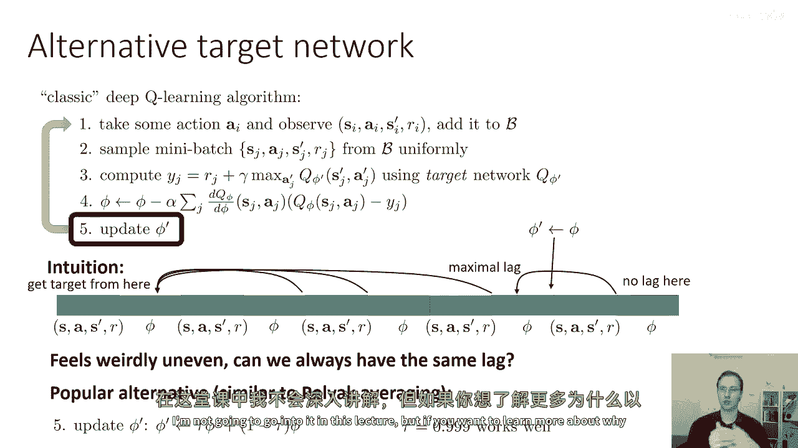

但如果你想了解更多为什么，线性插值参数是允许的，非线性函数用这种方式可以查找多平均数，当然，前提是phi的倍数与phi相似。

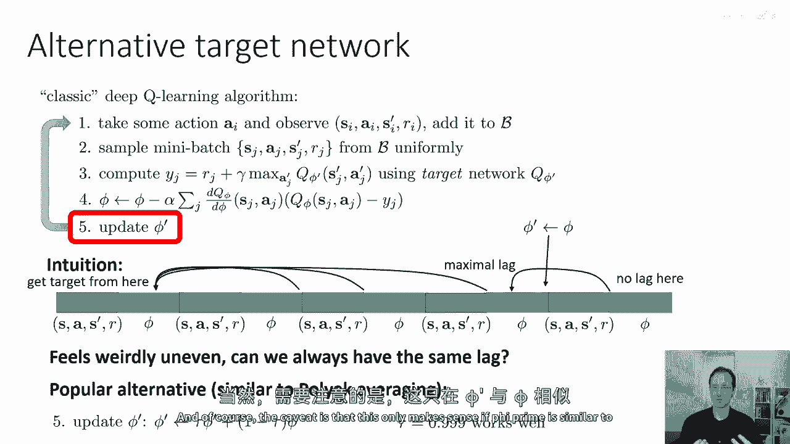

如果phi的倍数是完全不同的、在完全不同的方式中训练的神经网络。

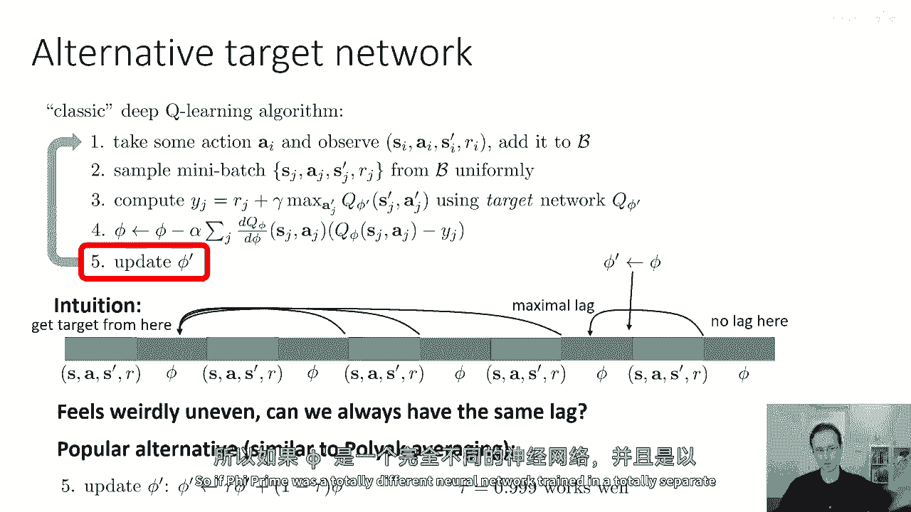

这可能会有些奇怪，但是因为你正在逐渐使phi的倍数越来越接近phi，这种程序实际上是可以的，当然，好的一面是现在i prime被更新得与phi相同，每一步。

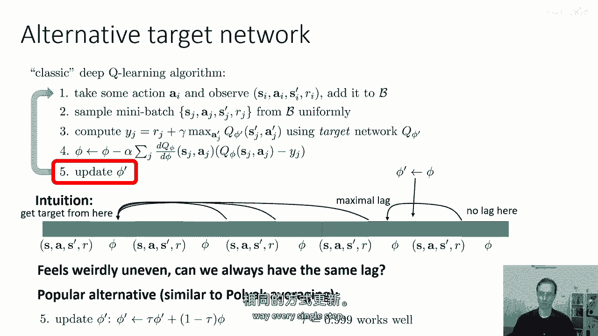

