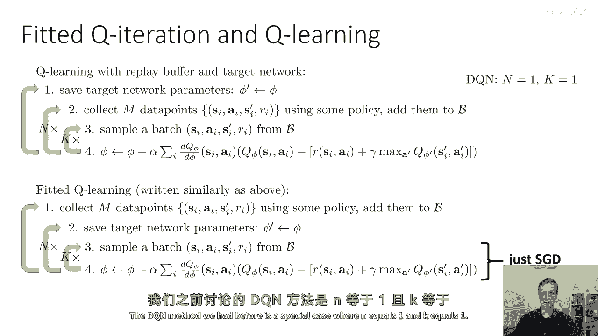
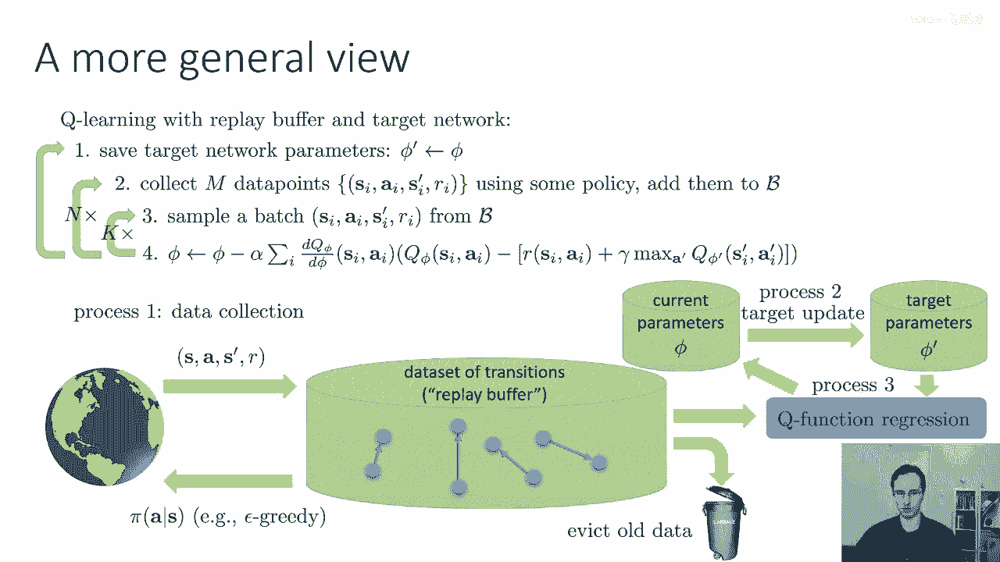
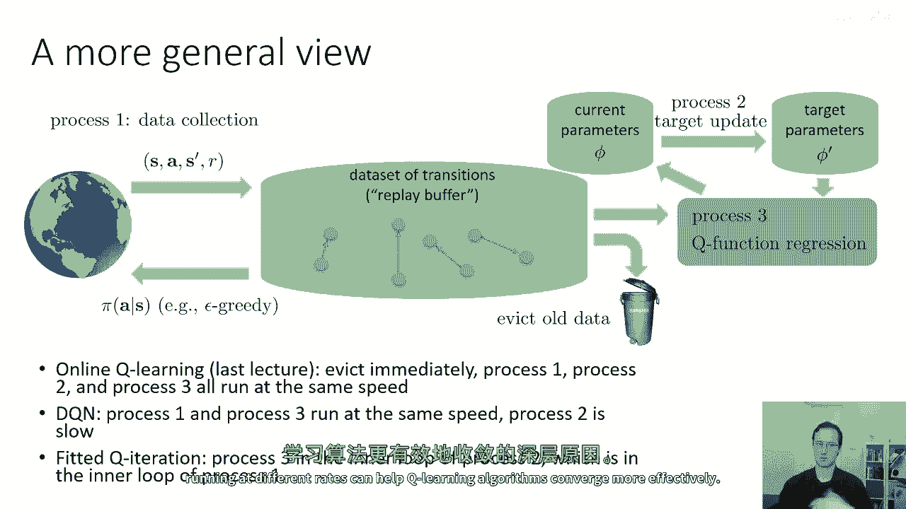

# 【深度强化学习 CS285 2023】伯克利—中英字幕 - P32：p32 CS 285： Lecture 8, Part 3 - 加加zero - BV1NjH4eYEyZ

好的，在下一节，我想简要讨论一种我们可以对Q学习算法采取的另一种视角，这可能提供一种稍微更统一的视角，因为我们已经覆盖了许多不同的变体。

我们覆盖了拟合Q迭代的在线队列学习、深度Q学习以及带有回放缓冲区的Q学习，我们可以将这些所有内容统一在一个种概念框架中，我只是想在下一部分中强调这一点，并且许多你们可能已经猜到那个更一般的框架是什么。

但是让我们让它变得真的很明确，所以这里是我之前讨论过的带有回放缓冲器和目标网络的一般Q学习，所以这里我们有这个外部外部循环，我们在这里保存目标网络的参数，Y prime变得好，我们可以使用多臂平均技巧。

或者只是标准翻转，每一步的结束都在第二步，我们在第三步使用某种策略收集一些数据点并将其添加到缓冲区，我们在第四步采样一个批次，我们执行梯度步，然后，我们交替执行步骤三和四，现在重复几次。

这里把它写成一种内部循环风格的算法，但实际上不是，实际上它是一种，并行过程，之前我们有的拟合q迭代算法看起来有点不同，我在这里把它写成一种方式，以便更好地类似于上面的版本，但你也可以用监督回归来写它。

所以我们在外层外层的循环中收集数据，然后在中间循环中更新网络，但实际上它们是一样的，如果你将它们视为在不同的速率下并行运行相同的基本过程，那么所有这些方法都可以统一到一个种类的并行框架中，所以嗯。

在拟合q迭代算法中，内层内层循环只是sgd，我们之前有过的dqn方法是一个特殊案例。

其中n等于一，k等于一，但是所有这些实际上都是这种更一般观点的特例，所以我们有我们的过渡数据集，我们的回放缓冲区，这是所有这些的中心基本对象，我们定期与世界交互，当我们与世界交互时。

我们通常做的事情是取我们的最新向量phi，我们从phi中构造一些策略，例如，使用epsilon，贪婪探索或玻尔兹曼探索，我们将其发送到世界中，并带回一个或多个转换，你可以这么想，嗯。

不是作为一个我们定期做出的离散决策，而是作为一个始终运行的连续过程，所以让我们叫它过程一，数据收集过程，数据收集过程在环境中采取步骤，并且每一步它都会将其发送回我们的重放缓冲区，现在。

我们的重放缓冲区是有限大小的，我们不能永远将其添加到其中，所以我们还有其他一个过程，删除过程，哪个定期从缓冲区中删除东西，当它变得太大时，有很多关于何时何地删除东西的决策。

但一个非常简单和合理的选择是简单地将重放缓冲区结构化为环形，缓冲区，其中缓冲区中最旧的东西将被删除，当新的东西被添加时，所以如果你的缓冲区有一百万次转换，那么一旦添加了一百万零一次转换。

最旧的转换就会被丢弃，这确保了你的缓冲区不会无限增长，然后，你有你的目标参数phi prime，你的目标参数用于计算那些目标值，你有你当前的参数phi，你当前的参数是你将要给过程一的参数。

以便构建那个epsilon贪婪的政策来收集更多的数据，你有过程二，更新目标值，抱歉，目标参数，所以过程二将定期将phi复制到phi prime或执行那个多平均，过程二通常是一个非常慢的过程。

所以它通常运行得非常 infrequently，然后，你有过程三，这是主要的学习过程，什么过程三做的，它从重放缓冲区加载一批转换，这就是步骤三在上述伪代码中，它加载目标参数phi prime。

它使用目标参数计算每个转换的目标值，在样本的批中，使用这些来更新当前的参数phi，那是步骤四以上，然后保存它们出来，嗯，到当前的参数那里，所以这是一个关于一般Q学习食谱的图形表示。

它涵盖了我们所讨论的所有算法，所有这些都可以基本上被实例化为这个一般三过程或过程三的特殊情况，如果你还包括驱逐和并行架构，实际上你可以将这个实现为一个并行架构，你实际上将这些作为不同线程中的不同过程。

或者你可以将其实现为一个序列的顺序过程，但是，有一种思维模型，即真的有三个不同的事情可以以不同的速度发生，对于思考这个问题仍然有用，所以，尽管看起来有许多不同的Q学习算法，实际上。

学者们涉及为过程一、过程二和过程三的运行速度做出不同的决定，过程二，和过程三。

所以，在线Q学习基本基本Watkins，我们在上一堂课中学习的在线队列学习是一个特殊情况，你在被驱逐时立即进行，这意味着你缓冲区的大小是1，它是一个大小为1的环缓冲区，然后处理1。

处理2和处理3都以相同的速度运行，它们依次取一步，所以，处理1取一步，这意味着收集一步过渡，处理2取一步，这意思是说你的目标值总是使用最新的参数来计算，然后处理三个步骤需要一个步骤。

这意思是说你做一次梯度更新，我们之前提到的dqn算法也相当相似，处理一个步骤和处理三个步骤以相同的速度运行，从某种程度上来说，这是一个稍微任意的选择，因为处理一个步骤和处理三个步骤实际上是相当解耦的。

但它们以相同的速度运行，所以你总是需要收集一步数据和更新一步梯度，然后处理二很慢，回放缓冲区相当大，所以你可能会存储多达一百万的转换，这个看起来如此奇怪的一部分原因是当你的回放缓冲器足够大时。

过程一和过程三相当程度上解耦，因为当它足够大时，你采样你刚刚收集的转换的概率变得相当低，实际上，快速收集数据是非常重要的，所以，你的Q学习算法的性能可能会迅速下降，如果你收集数据不够快，但是，无论如何。

过程一和过程三有，你知道，与字面意思之间有很大的缓冲空间，然后，我使用的θq迭代算法是，嗯，为了解释这些概念，这种算法也可以被视为这个的特例，并且，过程三的拟合q迭代实际上是过程二的内循环。

它本身是过程一的内循环，所以在θq迭代算法中，你会进行回归直到收敛，然后，更新你的目标网络参数，你可能交替这些几次，然后，在外部的外部循环中，你弹出所有方式并收集更多的数据，但这些真的不是那么不同。

它们只是针对我们运行所有这些不同过程的速率的特定选择，而且有一件事，当然，关于这一点有一些更深入的，因为对于每个这些过程，它们为每个其他过程创建非平稳性，所以如果过程二和过程一完全停止。

然后过程三只是面临着一个标准的收敛监督学习问题，通过改变这些不同过程的速率，通过使它们都以不同的速度运行，我们实际上是在减轻非平稳性的影响，因为如果过程二的速率，例如，与过程三有很大的不同，然后过程三。

它以比过程三快得多的速度运行，它会看起来好像一切都几乎处于静止状态，这就是为什么这些三个不同的过程以不同的速度运行。

