# 【深度强化学习 CS285 2023】伯克利—中英字幕 - P39：p39 CS 285： Lecture 9, Part 4 - 加加zero - BV1NjH4eYEyZ

好的，在今天讲座的最后一部分，我们将讨论另一种施加约束的方法，这种方法稍微更近似，但它导致了一个被称为自然梯度的简单算法框架。

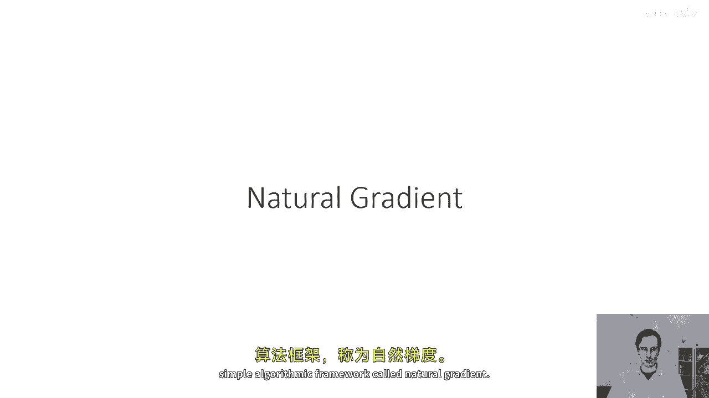

好的，到目前为止，我们讨论了这个问题，最大化在旧策略状态分布下的旧策略动作的预期值，重要采样估计分布的分布。

 subject to 约束 pi theta 和 pi theta 之间的KL散度被限制为epsilon，并我们看到，如果你可以为一个小的epsilon强制执行这个。

那么这确保了j theta prime - j theta 的改进，在上一节中，我们看到我们如何施加这个约束，通过使用像双梯度下降方法这样的某种东西来选择拉格朗日乘子。

然后基本上优化拉格朗日作为某种惩罚的目标，来找到新的策略参数，现在，我们将讨论一种更近似的方法来做这件事，这在开始时可能会看起来稍微差一些，因为我们将做很多近似，但实际上是非常理想的。

因为它允许我们恢复一个非常简单的方法，不需要任何额外的惩罚，并简单地将标准策略梯度应用于我们在第三讲中看到的方法，好的，所以，像以前一样。

我将使用bar theta prime来denote这个整个目标，当我们计算某个目标的梯度时，并使用梯度上升或梯度下降，这可以解释为优化该目标的一阶泰勒展开，这可能看起来像一个稍微愚蠢的陈述。

因为第一阶泰勒展开只是一个梯度，但当有约束时，它实际上有一些意义，所以，实际上，如果我们想要优化像这样的复杂函数，如这里的蓝色曲线，一种方法我们可以做是，我们可以选择一个区域，计算一个非常简单的近似。

一个蓝色曲线的线性近似，如这里所示的绿色线，这是通过取梯度获得的，而不是优化蓝色曲线， which 真的很复杂，我们优化绿色线， which 真的很简单，当然，如果我们不施加任何约束。

绿色线延伸到正负无穷大，所以这只有在我们施加约束时才有意义，这实际上是我们信任的区域，绿色线如何近似蓝色线的程度，一个信任区域，如果我们不施加任何约束，绿色线延伸到正负无穷大。

所以这只有在我们施加约束时才有意义，这实际上是我们信任的区域，这就是这个红色盒子代表的，所以如果你在红色盒子中找到绿色线的最佳值，如果红色盒子被选择足够小，你可能希望在那个点蓝色曲线也会改善。

这就是你真正想要的，所以如果我们在最小化，那么我们会选择这个点，我们选择在红色区域的边缘，绿色函数值最低的点，这将希望也是蓝色函数值较低的点，如果我们在最大化，这将反过来走，这意味着。

如果你用一阶泰勒展开近似你的复杂的非线性函数，本质上是一个线性函数，你可以优化这个线性函数，只要你施加一个信任区域，只要你的限制优化仅限于这个区域，在哪里这个线性近似是真非线性函数的好近似。

所以我们可以用我们的优化问题来做这个，我们可以把它更改为取grad的arg max，一个转置的theta prime减去theta， subject to this constraint。

并且约束是施加信任区域的因素，现在，这将非常容易做到，当然，在目标方面，因为目标仅在theta prime上线性，这是我们的优化变量，约束仍然有点复杂，因此，这使得事情稍微更复杂，好的，所以。

我对接下来要描述的基本直觉，那是否我们将在某种非常可处理的方式中近似这个约束，这将实际上给我们一个关于theta prime的封闭形式解，在那里我们实际上不需要做任何复杂的非，线性优化程序。

有多个梯度步骤，但实际上，政策梯度的单个步骤实际上将处理整个，受限优化问题，直觉之所以可能，是因为一旦我们的目标，线性优化变得容易，好的，所以，我们的目标变成了一种第一等式的泰勒近似，顺便说一句。

我们为什么要做好这一切，我们做这一切的原因是因为我们将得到一个非常，非常简单的算法，所以我们将引入这些额外的近似步骤，但我们将获得的回报是一个仍然工作得很好的简单算法。

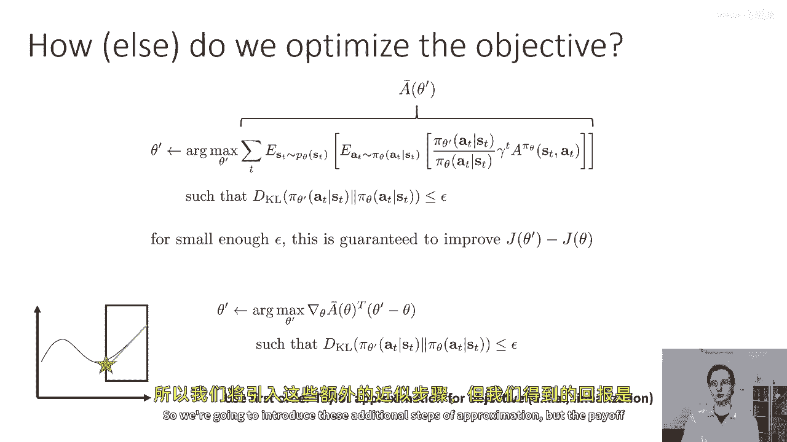

好的，所以嗯，这就是我们的新简化约束问题，这种简化方式的一个真正吸引人的地方是，它可以使我们的梯度，"梯度θaθ将基本上变为精确的正常政策梯度"，"所以，这是梯度θ'的方程式：dθ'/dθ"，"并且。

因为只有重要性权重依赖于theta prime"，"我们只获取重要的采样政策梯度"，"但是如果我们从这个角度看待它"，"Theta'等于Theta"，"然后，重要性权重实际上会相互抵消"。

"因为分子和分母得到的是一样的东西"，"所以这里我就把它写出来了，关于格莱德西塔和横杠西塔的"，当它们相互抵消时，你只剩下标准政策梯度方程，这是我们在前一节课中看到的，这非常简单。

这基本上就是我们在reinforce中的政策梯度，除了，你知道对于pi theta有一些优势估计器的选择，我们可以在那里使用任何东西，好的，所以这很好，嗯，这就是我们要插入到我们的目标中的事情。

这就是常规的政策梯度。

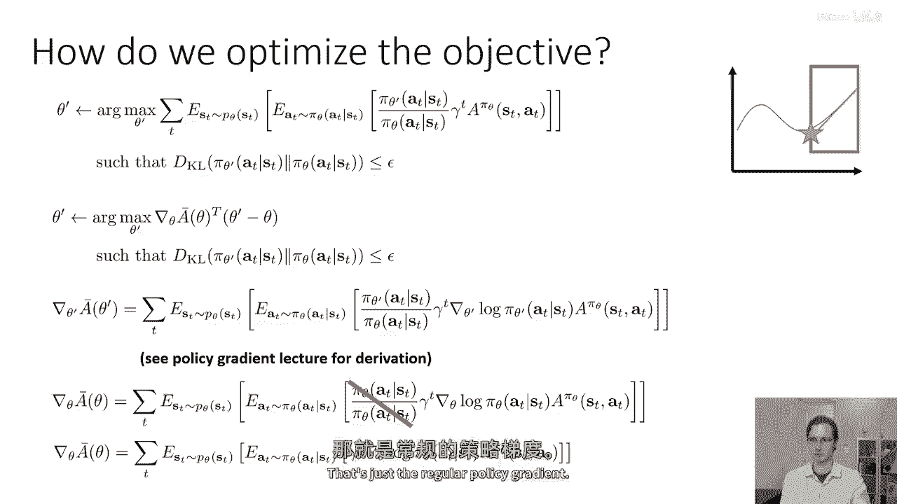

嗯，我们现在能否只是使用梯度下降，梯度下降，然后如果我们只是在计算政策梯度，我们的目标是grad theta j theta transpose theta prime是否梯度上升。

做类似的约束优化问题，所以梯度下降只会取theta，并将其设置为旧的theta加上alpha乘以grad theta j theta，这样做的一个问题是，当我们改变theta时，新政策的概率。

给定s的pi theta会以不同的数量改变，因为某些参数，theta中的一些项对概率的影响比其他项大，所以总的来说，像这样的一步通常不尊重KL散度约束，因为你可能在某些参数的变化上非常小。

但是那个参数可能对概率有着非常非常大的影响，但是梯度下降在哪方面做得好，我声称梯度下降实际上解决了这个受限优化问题，这与我们的原始问题非常相似，所以区别在于，我们的原始受限优化问题有grad j。

Theta prime减去theta作为它的目标，但约束是pi，Theta prime和pi theta在梯度上升中的kl散度，约束是theta prime和theta的平方欧几里得距离。

所以原始问题要求theta prime产生一个分布，其与政策pi theta的距离接近，相反，pi theta梯度上升产生的参数接近参数theta。

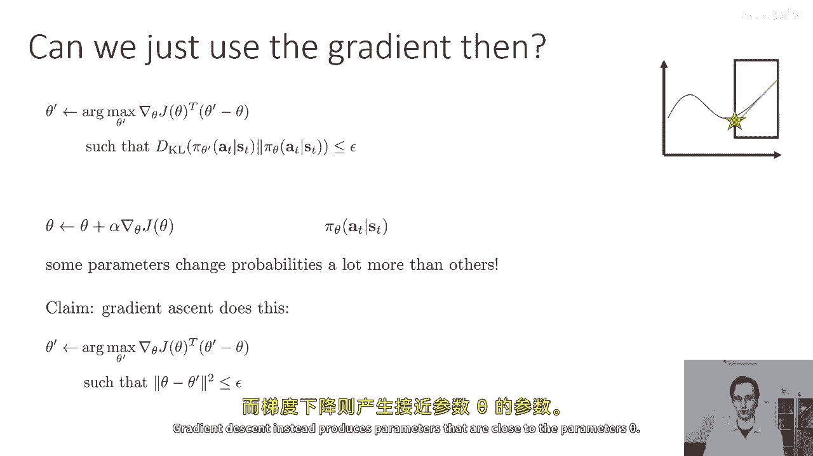

几何上，你可以这样想，梯度下降就像是在，嗯，我们有一个参数空间，在这里由这个两个d的区域表示，其中包含两个，所以有两个轴对应于两个策略参数，当我们线性化我们的目标。

我们可以将我们的目标可视化为这种梯度场，在这个空间上的颜色梯度，所以右下角的值更好，左上角的值更差，并且这个约束在这个空间中对应于一个圆，所以所有离中心点的点，距离为epsilon的点，都满足这个约束。

所以因为你的目标是线性的，你的约束是圆，那么解决方案总是位于那个圆的表面上，朝着目标的方向，所以在grad j theta的方向上，所以这意味着当你做梯度上升时。

你会朝着grad j theta的方向走一步，并且那个步骤的长度由epsilon确定，实际上，学习率和梯度下降实际上可以作为拉格朗日乘数获得，对于这个约束，并且你也可以为它推导出一个封闭形式的方程。

所以如果你像这样进行梯度下降，其中你的学习率由epsilon的平方根给出，除以grad j的平方长度，你可以实际上证明你将精确满足那个约束，你证明这个方式的是，你取theta prime的方程。

将其代入约束，那么theta将会取消，你将剩下epsilon除以grad j的平方再开方的结果，然后那个整个东西再平方，所以然后平方根就消失了，然后你剩下grad j的平方在顶部。

grad j的平方在底部，那些相互抵消，然后你只剩下epsilon，而且epsilon小于等于epsilon，如果你对这个不清楚，那么我建议你做的是拿一张纸，请看我为θ写的这个方程。

将这个方程代入约束条件，然后进行代数运算，这样你就可以证明，结果是ε小于等于ε，好的，那么所有这些都带我们到哪里去，所有这些的结论是，梯度下降实际上确实解决了一个受限优化问题，但它是错误的约束。

约束应该在θ空间，而不是分布空间，因为θ中的各个条目可能对分布产生不同程度的影响，一般来说，在θ空间中的约束不会在受限的KL散度空间中强制执行，因为某些参数θ可能会改变一点点。

但会产生在相应分布上产生非常巨大的变化，所以直觉上，梯度下降的约束形状是一个圆，但我们想要它成为一个椭圆，我们想要椭圆沿着敏感度极高的方向压缩，所以我们想在θ的方向上设置更紧的约束，那导致概率的大变化。

"我们想要椭圆在方向上被拉长"，"当θ的变化较大时，概率的变化较小"。

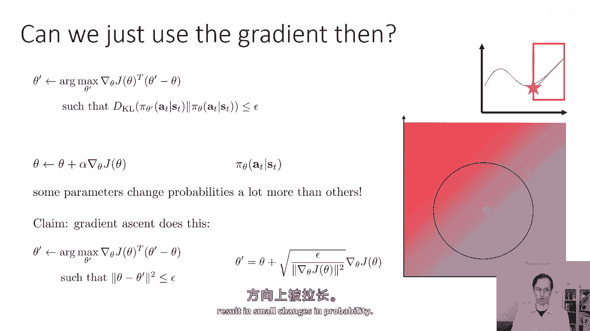

这就是我们接下来要尝试得到的，所以我们接下来要做什么，我们将认识到这些并不相同，"我们将构建一个可处理的近似值来逼近KL"，"分歧约束"，"哪一个是我们真正想要的"，"我们打算这样做的方式"。

这是通过对约束做与对目标相同的事情来实现的，所以对于目标，我们计算了泰勒展开，具体来说，对约束的第一阶泰勒展开，我们实际上将使用在点周围的二阶泰勒展开，Theta'等于Theta。

我们不想使用一阶泰勒展开，因为KL散度在Theta'等于Theta处有导数的零，它实际上是平的，但是，它的二阶导数不为零，二阶泰勒展开是一个二次形式，其中包含一些矩阵f，而且。

放进去的矩阵被称为费舍尔信息矩阵，对于这个的计算有些复杂，但你基本上从KL散度的公式开始，如果你取二阶导数，你可以证明对于那个矩阵来说，应该使用的正确东西是费舍尔信息矩阵，这是它的定义方程，所以。

费舍尔信息矩阵是在pi theta下预期的外积的grad log pi，的，并且，鱼类信息矩阵的一个非常方便的地方是，你可以使用样本来近似它，因为它是某些量的期望值。

你可以简单地使用你从πθ中抽取的样本来估计你的政策梯度，也要估计鱼类信息矩阵，现在如果我们要使用这 uh，二次泰勒展开作为对我们KL散度约束的近似，我们可以注意到，梯度下降实际上也有一个二次约束。

θ减去θ'的平方也可以被解释为θ'减去θ，转置乘法，身份乘法乘以theta的导数减去theta，现在，我们有相同的东西，只是身份的集合被设置为不同的，我们有f，因此，我们可以估计样本的费舍尔信息矩阵。

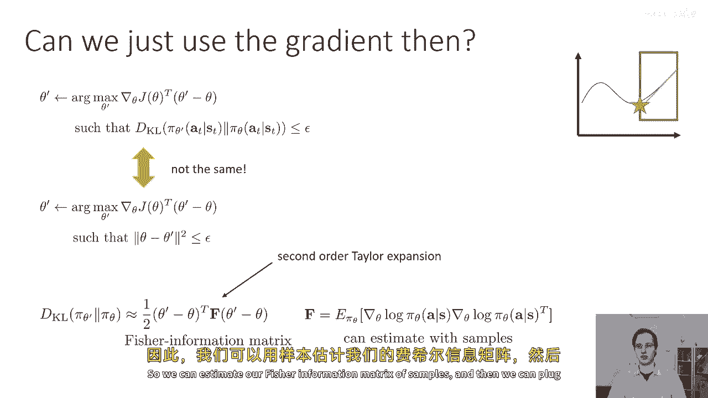

然后，我们可以将这个作为二次约束插入，只是使用矩阵f而不是身份，从视觉上看，你可以把它想成把那个圆转化为一些椭圆，椭圆的形状由矩阵f决定，矩阵f基本上描述在theta空间中哪些方向，从点theta出发。

导致概率变化的方向大，导致概率变化小的方向，你可以实际上证明如果你的约束是这样的，并且你写出拉格朗日函数，如果你知道拉格朗日乘子，那么解决方案将由这个方程给出，原因，当然。

是因为拉格朗日函数将有一个线性项grad j的转置乘以theta的导数，和一个二次项，由二次KL散度展开给出，并且一个二次多项式函数像这样有一个封闭形式的解，使用二次项的逆乘以线性项。

所以这是封闭形式的解，当约束由一半theta的导数减去theta给出时，转置乘以f乘以theta的导数减去theta，此外，如果我们想要强制执行约束，那么这个二次展开应该小于或等于epsilon。

我们可以使用与梯度下降相同的一般想法，并找出满足那个约束的步长，再次，你可以检查这个步长是否正确通过插入这个方程为alpha，然后，将结果方程为theta的导数插入到我们的KL散度近似中，然后。

你可以证明你最终会满足约束，所以这个表达式被称为自然梯度，所以你取常规梯度，并乘以鱼者信息矩阵的逆。

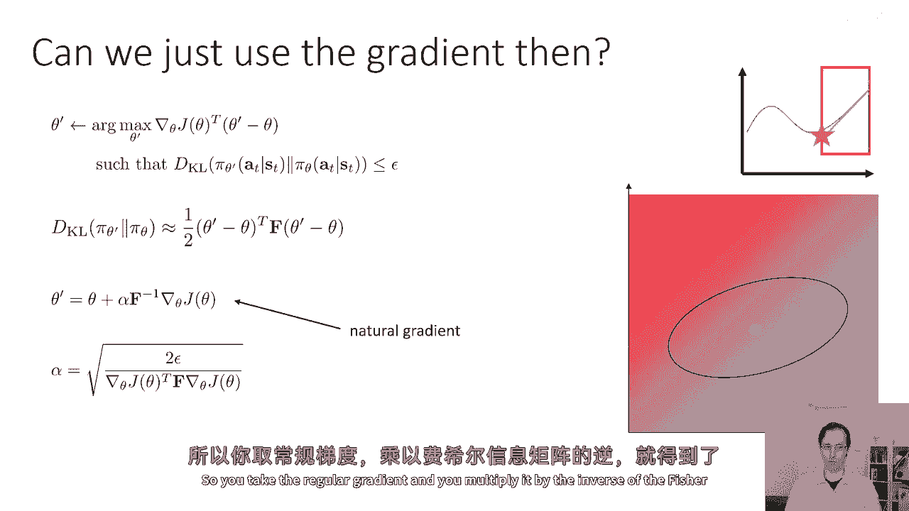

你得到自然梯度。

好的，所以嗯，花一点时间看看幻灯片，如果这里有不清楚的地方，请确保在评论中写下问题。

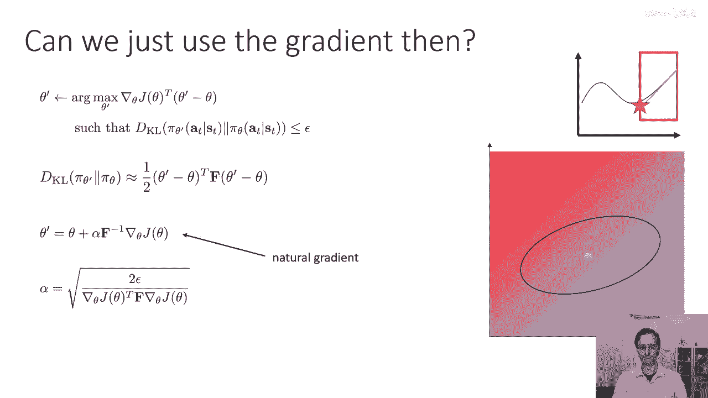

现在，我们来看这里，我想要回退一步，并问，这在实践中是否是一个问题，就像它似乎像常规梯度上升，常规 vanilla 政策梯度已经强制执行了某种约束，也许那个约束就足够了，我意思是。

它确实将theta的导数保持在theta附近，我的意思是，它确实将theta的导数保持在theta附近，也许不是太正确的方式，但或许那是一个合理的近似，嗯，让我们回到我们在政策梯度讲座中的那个例子。

那里我们有一个一维的状态空间和一个一维的动作空间，你可以选择去左或右，你的回报由负s的平方减去a的平方给出，你有两个策略参数，K和sigma，其中行动的概率是正态分布的，均值为k乘以s。

方差为sigma，所以，你的参数是k和sigma，在那个设置中，你基本上添加了一些高斯噪声，向左和向右走，在那个设置中，我们看到常规政策梯度实际上看起来非常不幸运，常规政策梯度确实必须指向正确的方向。

它总是这样，但它极其不稳定，本质上，当sigma减小时，与sigma相关的梯度比与k相关的梯度大得多，所以，尽管最优解是k等于负一，你可能永远无法达到那个解决方案，因为你只会忙于直觉地减少sigma。

这发生的原因在于k和sigma对概率的影响程度不同，并且因为sigma影响概率，嗯，太多了，当它很小时，然后相应的梯度组件就大大增大，简单地说，在theta空间中保持固定的球形。

即使在这个非常简单的二维空间中，也不是数学，所以，本质上它与一个非常糟糕的条件有关。

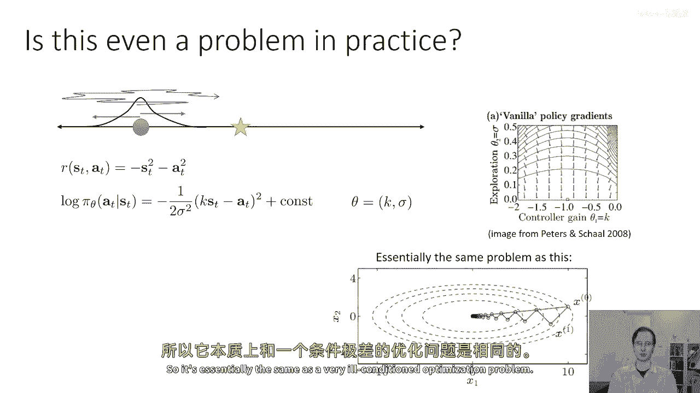

嗯，优化问题，自然政策梯度主要解决了这个问题，所以，如果你只是乘以梯度的逆，然后，那正确地考虑到sigma对参数的影响很大，而且，它实际上优先考虑k大，它实际上增加了与k相关的评分部分。

并将你引导到正确的方向，所以，这在实践中确实是一个问题，尤其是对于连续分布如高斯分布，所以实际上，自然梯度确实给你提供了一个更良好的梯度方向，并且使它调整学习率更容易。

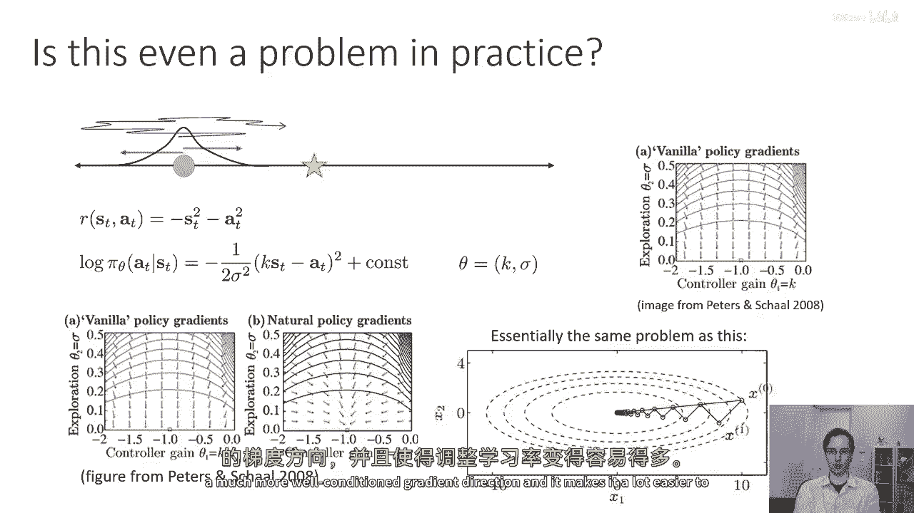

好的，一些实际注意，所以自然政策梯度，按照文献中的经典描述，是一种算法，你在其中计算出使用样本近似的费舍尔信息矩阵f，然后手动选择步长alpha，通常选择稳定政策梯度训练是一个良好的选择。

如果还想了解更多关于这个的，查看彼得斯和肖尔的这篇论文《强化学习》，基于策略梯度的运动技能学习。

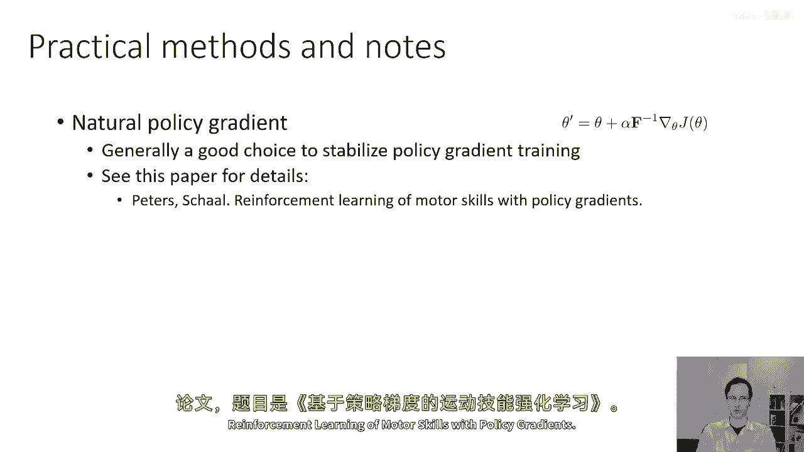

实际实现需要计算这个，嗯，逆函数f和梯度j的乘积，这稍微有点非 trivial 不做满矩阵计算很难做，但如果想在实践中实现这个，查看这篇论文《信任区域策略优化》，有一些非常有用的技巧。

所以其中一个技巧是你实际上可以解出步长alpha，这实际上尊重一个特定的epsilon值，所以如果你不选择alpha，你想要选择epsilon，这里有公式，但更重要的是，嗯，你可以做一件事。

使得这个计算效率大大提高，你可以使用共轭梯度方法计算f逆，grad j，并在运行共轭梯度过程中，实际上会得到由这个方程自动给出的步长alpha，作为副产品，我不打算深入讨论这个。

我建议你去查看《信任区域策略优化》论文以获取详细信息，但这是共轭梯度（cg）的直接应用，现在相当简单，当然，你也可以直接使用重要采样的目标函数。

例如使用像great dual gradient descent这样的东西，甚至使用拉格朗日乘数的启发式选择，这工作相当好，这可以被视为一种正则化，以便保持在旧策略附近，这就是我在上一节讨论的。

如果你想了解更多关于这个，查看《近端策略优化》。

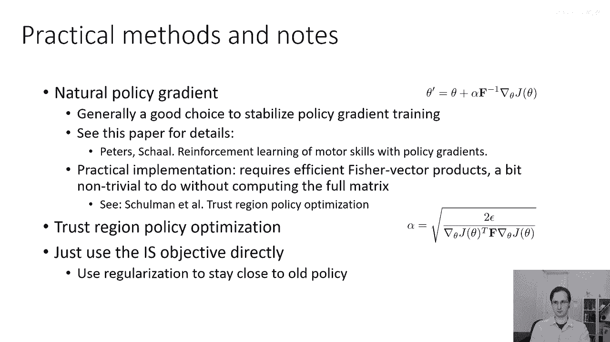

好的，所以，总的来说，我们讨论了如何将策略梯度解释为策略迭代，如何优化旧策略在新策略状态分布下的优势，这就是策略迭代，此外，如果你使用旧策略的状态分布，那么你是在优化一个界限，如果策略足够接近。

并且这导致一个约束优化问题，你可以强制执行这个约束，嗯，明确地，嗯，或你可以近似地施加约束，通过对目标的第一阶近似，这给你梯度上升，但常规梯度上升有错误的约束，所以你使用自然梯度。

但自然梯度有错误的约束，所以你使用自然梯度，这给你提供了一个对KL散度约束的近似值，因此，总结起来，常规政策梯度是一个约束程序，但它有一个错误的约束，自然政策梯度用它来替换一个KL散度的近似值。

或者你可以实际上优化许多梯度步骤的原始重要采样目标，加上一个正则化项，以保持接近政策，之前的政策乘以拉格朗日乘数，使用此自然政策梯度的实际算法。

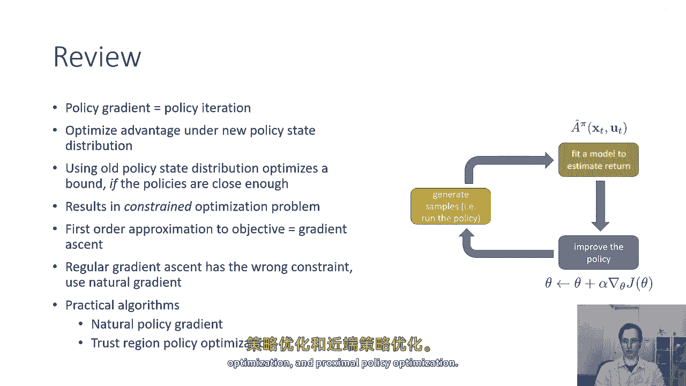