# 【深度强化学习 CS285 2023】伯克利—中英字幕 - P43：p43 CS 285： Lecture 10, Part 4 - 加加zero - BV1NjH4eYEyZ

好的，那么，在今天讲座的下一部分中，我们将扩展我们之前讨论的lqr，到随机动力学，并且到非线性系统。

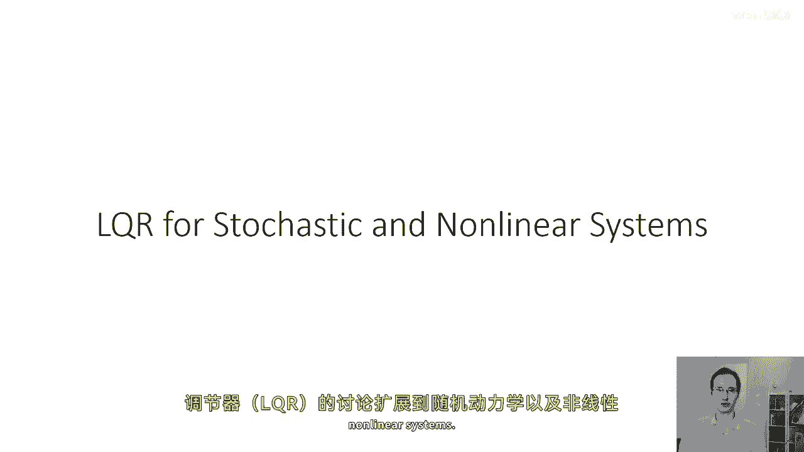

所以让我们从随机动力学开始，因为这是实际上一个相当容易的，在我们有确定性的线性动力学之前，如果我们有随机动力学，在随机动力学的特殊情况下，如果随机动力学是正态的，意味着给定x_t和u_t。

p(x_t+1|x_t，u_t)是多元正态分布，具有由线性动力学给出的均值和常数协方差，那么，我们发现我们之前有过的控制法则实际上仍然最优，我不打算推导这个，嗯，尽管你可以自己作为作业练习来推导它。

但是为什么那个是真的直觉，是因为高斯分布是对称的，这意味着如果你的均值在xt的特定值，如果你向左移动一点，向右移动一点，那些差异实际上会在你的二次成本中取消，所以你最终会得到相同的值。

所以添加高斯噪声最终不会影响ut的解决方案，然而，这个问题有一些微妙之处，那就是添加高斯噪声确实改变了你最终访问的状态，所以记住在lqr中我们有这个向后递归，而向前递归计算你现在访问的状态。

你访问的状态实际上是随机的，这意味着你不能产生一个单一的开环动作序列，但你可以处理那个表示最佳行动的表达式，Kx加上一个小的k作为控制器作为策略，结果发现，如果你使用那个策略。

结果证明它是最优的闭环策略，在线性二次高斯情况下，这是一个非常有趣的结果，所以算法没有改变，你可以忽略sigma由于对称性，嗯，如果你想自己检查这个，提示是，在高斯下，二次函数的期望。

实际上有一个解析解，你可以查看这个，一旦你能够在这些高斯分布下表达你二次函数的预期值，你可以计算导数，将导数设置为零，那么你会发现控制律是相同的，但是，这里的重要区别是。

你现在不再得到一个状态的序列和动作的序列，你从lqr中真正得到了一个封闭形式的控制律，所以这有点有趣，因为事实证明，lqr实际上确实产生了闭环计划，不仅仅是开放环路计划，好的。

所以xt现在从某种分布中被采样，而且它不再确定，结果发现它实际上仍然还是正态分布的。

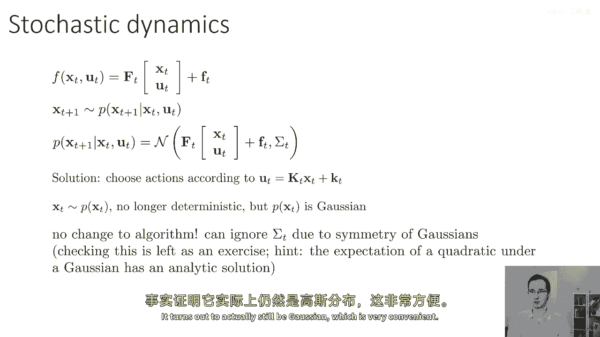

这对我们来说非常方便，好的，所以嗯，这基本上就是随机闭合环的情况，我们最终得到的pi的特定形式，使用lqr后，是一个时间变化的线性控制器，所以，我们的行动现在以状态资本k乘以状态加上小k的形式线性化。

但是，在每个时间步，可能涉及到不同的资本和小写字母k，所以，这可能给我们提供了一个全球神经网络政策的替代方案。

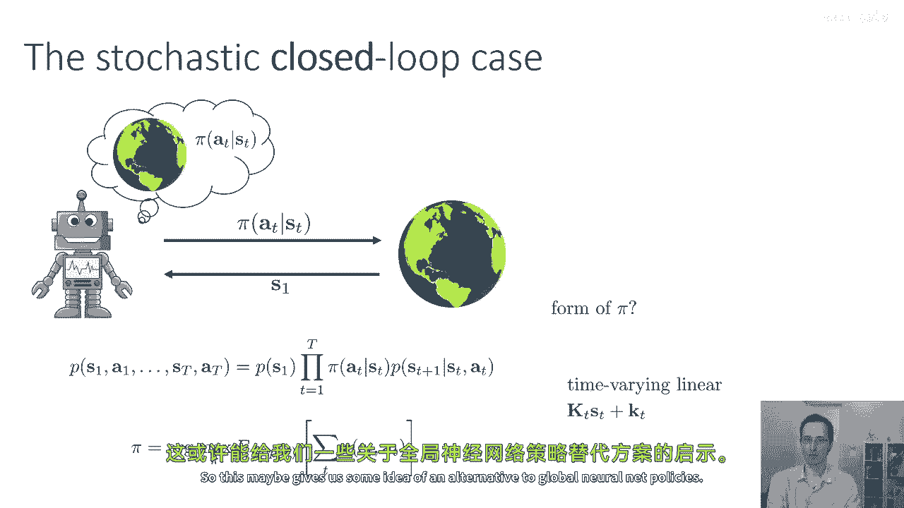

好的，所以，这是相对容易的部分，现在，我在这个讲座的部分要谈论的主要事情，实际上是非线性情况下发生的事情，在非线性情况下，我们可以将lqr扩展为得到有时被称为差分动态规划或gdp的东西。

有时也被称为迭代lqr或ilqr，有时也被称为ilpg，如果你有线性高斯设置，所以在我们有了这些线性二次假设之前，这些是假设我们的动态是一个关于x和u的线性函数。

并且我们的成本是一个关于x和u的二次函数，所以能否将一些非线性系统近似为一个局部的线性二次系统，花一点时间来思考这个问题，你知道的一些数学工具是什么，可以使我们做到这一点，我们可以做的一件事是。

我们我们可以使用泰勒展开，所以如果你有一些非线性函数，你想要得到，让我们假设是一个一阶函数或二阶函数，它们近似于它，在某个邻域，你可以做的一件事是计算它的一阶和二阶导数，然后使用泰勒展开。

所以如果我们有一些当前的状态和动作序列，也许迄今为止找到的最好状态，我表示为x hat，所以您有x hat one，X x hat two，X hat three，你有一个，你有两个，你有三个。

然后你可以近似地表达动态为嗯，F在x hat和u hat处的值，这就是x hat t加上一，加上动态对状态的梯度在动作中，同样，你可以用线性项来表达成本，取决于梯度和一个与海森矩阵相关的二次项。

所以现在我们已经近似了我们的动态和成本，作为线性和二次的，在由x hat和u hat表示的一些状态序列和动作的邻域中。

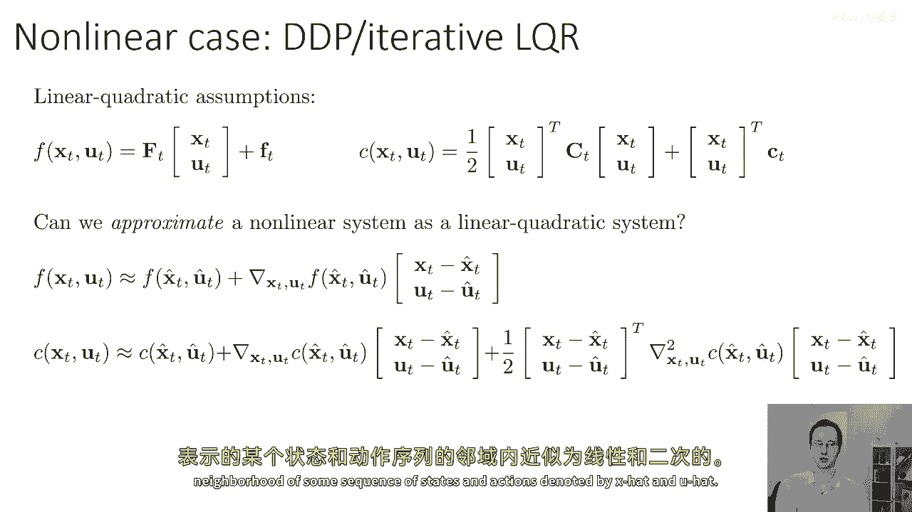

并且如果你这样做，那么你知道你可以表达这个线性二次系统，我将其称为f bar和c bar，以x偏离x hat的偏差来表示，所以这个delta x和delta u代表x减去x hat和u减去u hat。

所以这些是偏差，这些是相对于x hat和u hat的差异，现在我们回到了线性二次的范畴，这意味着我们可以简单地将这个东西插入到常规的lqr算法中，并解决为最优的delta x和delta u。

所以delta x和delta u是相对于x hat和u hat的偏差，你可以使用lqr来解决最优的delta x和delta u，然后将它们添加到旧的x hat和新的x hat中。

来找到新的x is并使用。

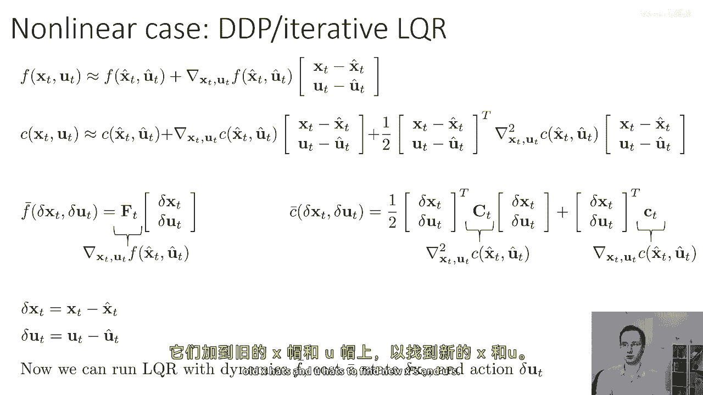

所以这里是迭代的lqr算法，基于这个想法，我们将重复以下过程，直到收敛，对于所有时间步，我们将计算动态矩阵作为动态的绿色，在x hat和u hat周围，我们将计算线性二次项的成本。

然后我们将运行lqr的向后传递，使用delta x和delta u作为状态，然后我们将运行向前传递，但对于向前传递，我们实际上将使用原始的非线性动态。

所以我们不会实际上使用线性化的动态来获取x t plus one，我们将使用原始的非线性动态，我们之所以这样做是因为我们想要获取x t plus one，那将实际上从取那个实际的ut结果。

而不是那个的近似，所以我们将做向前传递与线性动态，并使用由大K乘以delta x加上小k加上u hat的u，这是我们直接从delta x和delta u方程中得出的。

然后我们将更新x hat和u hat仅将它们设置为我们从向前传递中获得的x's，然后重复这个过程，所以本质上，向后传递计算出以delta x和delta u表示的控制器，它将给您比我们有的更好的成本。

到目前为止，向前传递检查该控制器的实际效果，并检查从运行它时你将得到的状态，然后更新x hat和u hat为这些新的州和动作，好的。

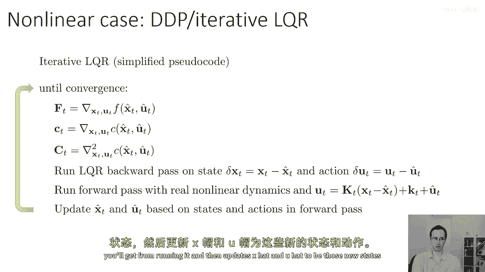

嗯，所以为什么这工作得好，让我们比较这个程序与一个已知的优化算法，这个迭代的lqr算法通过交替执行向后传递和向前传递，有效地解决了非线性系统的最优控制问题，牛顿法是什么。

所以牛顿法是一种你可能使用的过程，在牛顿法中，为了最小化函数g(x)，你会重复以下过程，直到收敛，计算在某个初始估计值x hat处的梯度，计算海森矩阵，然后设置x hat，为函数的二次逼近的参数。

由该梯度和海森矩阵形成，然后重复，这非常类似于迭代lqr所做的，所以，迭代lqr本质上是同一个想法，你通过泰勒展开本地近似一个复杂的非线性函数，这导致在lqr中一个非常简单的优化问题，一个线性二次问题。

然后您重复这个过程多次，直到您到达一个局部最优。

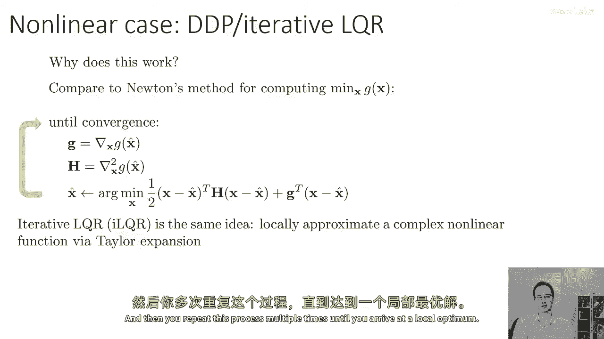

实际上，lqr可以被视为牛顿方法的近似，用于解决那个原始的优化问题，我们提出了，"主要的方法"，"它与牛顿的方法在哪些方面不同"，"那是否没有考虑动力的第二阶导数"，"得到lqr的一个版本并不难"。

"那考虑了二次动力学"，"如果你那样做"，你获得牛顿的方法，"而且你还有一个优雅的递归公式来表示它"，"这就是差分动态规划或ddp在做的事情"。

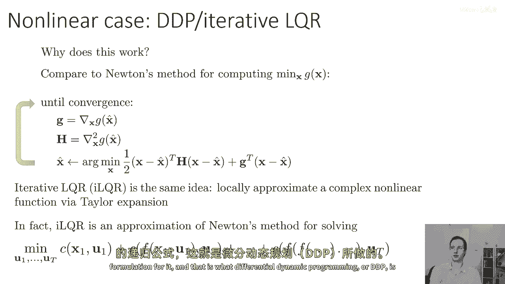

所以牛顿的方法需要使用二次动态近似。

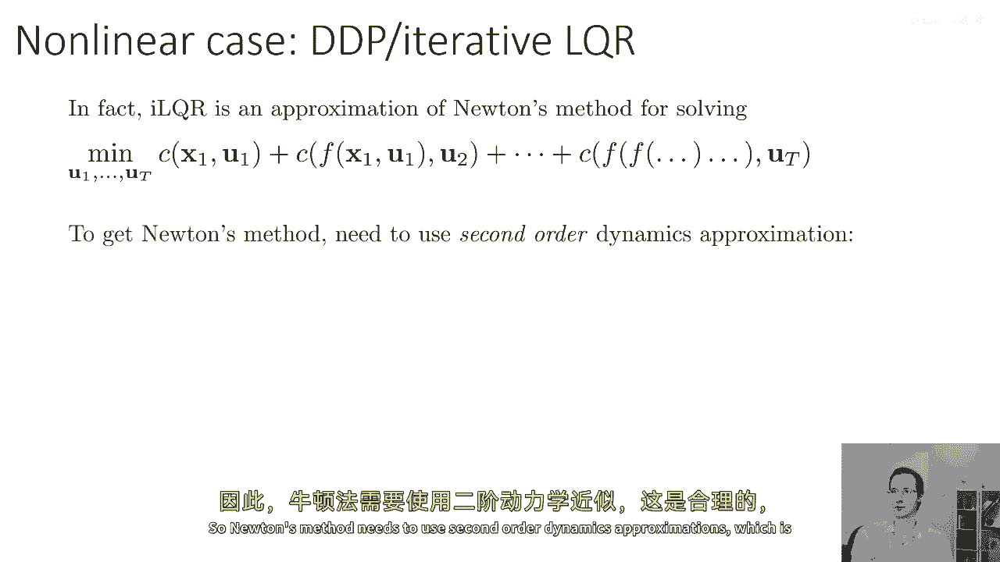

这是很合理的，尽管它需要张量积，因为动态的第二行现在是，它是一个三维张量，这就是差分动态规划所做的，如果你想真正考虑完整的牛顿方法，去看看gdp，尽管在实际应用中仅线性化动态往往就足够了。

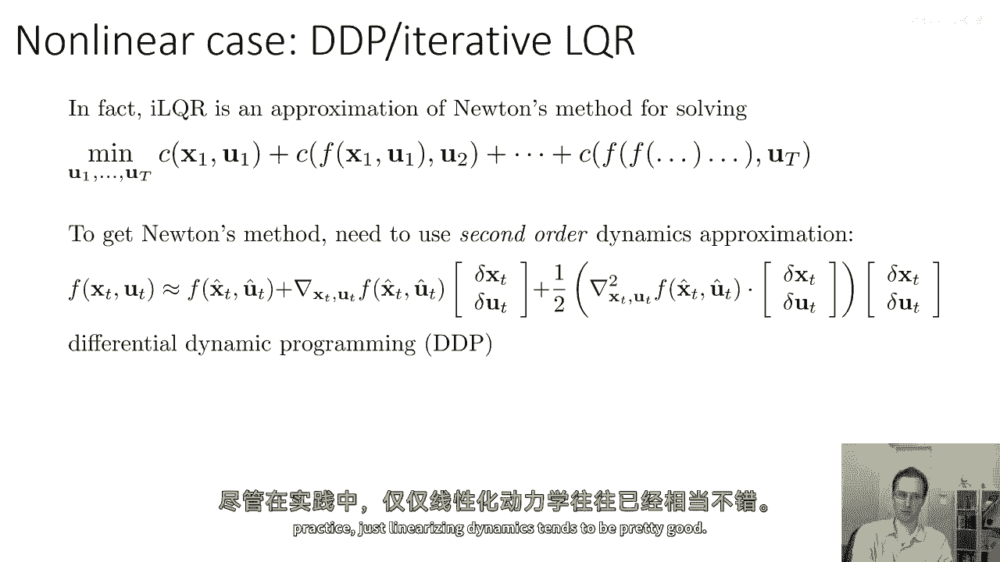

好的，现在，对新顿法的连接使我们能够推导出一些改进，我对此为止所提出的迭代LQR程序，最终对于良好的实际性能来说非常重要，所以让我们回到常规的新顿法，以获得一些直觉，这里是新顿法在内部循环中进行的优化。

我们可以问为什么这是一个真的很坏的主意，想一想这个问题，如果你实际上这样做多次，我推测对于许多真实函数来说，你将很难找到局部最优解，思考一下这可能是为什么，所以这里有一张图来说明这一点。

假设蓝色线代表你的功能，你现在位于这个点，牛顿的方法近似你的复杂函数为一个二次函数，让我们假设你蓝色函数的一阶和二阶导数结果在这个二次近似中，如果你实际上去这个二次的最优解，你最终会到达这个点。

而这个点实际上比你开始的点差，所以你想要的是你想要回溯，并找到接近你起始点的点，在哪里这个二次近似仍然可信任，这个信任的概念与上次讨论的信任区域密切相关，在先进的政策梯度讲座中，所以使用这一概念。

让我们回到迭代lqr算法，在迭代lqr算法中我们可以在哪里进行回溯，所以本质上我们想要要做的是，我们想要计算我们的解决方案，然后我们要检查解决方案是否实际上比我们有过的更好，如果它不是更好。

那么我们想要某种方式移动得更接近我们以前在哪里，它 turns out that the forward pass 是一个非常方便的地方来做这个，并且一个简单的方法来修改 forward pass。

来进行这条搜索是修改常数项，这个小 k 乘以一个介于零和一之间的常数 alpha，所以这是我们做的唯一改变，这个常数 alpha 允许我们控制我们偏离起始点的程度，想象一下如果我设置 alpha 为零。

如果我设置 alpha 为零，那么在第一个时间步，我的行动将是 x one 减去 x one hat，但是 x one 总是相同的，所以那就是零，Alpha 是零。

所以这意味着我的第一个行动就是 u hat one，因为第一个行动是 u hat one，我的第二个状态是 x hat two。

这意味着 x two 减去 x hat two 也是零 alpha zero，这意味着我的第二个控制也是 u hat two，如果 alpha 趋于零，我将执行与以前相同的动作，一般来说。

随着我减少 alpha，我将越来越接近，我之前的行动序列，嗯，到那个行动序列，你可以搜索 alpha 直到你获得改进，本质上你可以运行 backward，运行 backward pass，"然后。

使用不同的值重复运行前向传播"，"直到你找到满意的一个"，"现在在实际操作中，你实际上想要更加雄心勃勃一些。"，所以，一个非常简单的方法是仅仅减少阿尔法，"直到新的成本低于旧的成本"。

"但是你还可以做的事情是"，"你可以计算出你预期将获得的改进和成本"，"来自你的二次逼近"，"而且，你可以实际上将alpha降低到你预期改进的一部分"，"你也可以做括号搜索线"。

基本上假设真正的函数看起来大致是二次的，在蓝色圆圈和红色交叉的基本之间，你可以在一个括号搜索线中进行，基本上会找到这个函数的最优值，所以有很多其他方法可以做线搜索，但如果你想要在实际中实现这个。

查找一些像括号搜索线这样的东西。

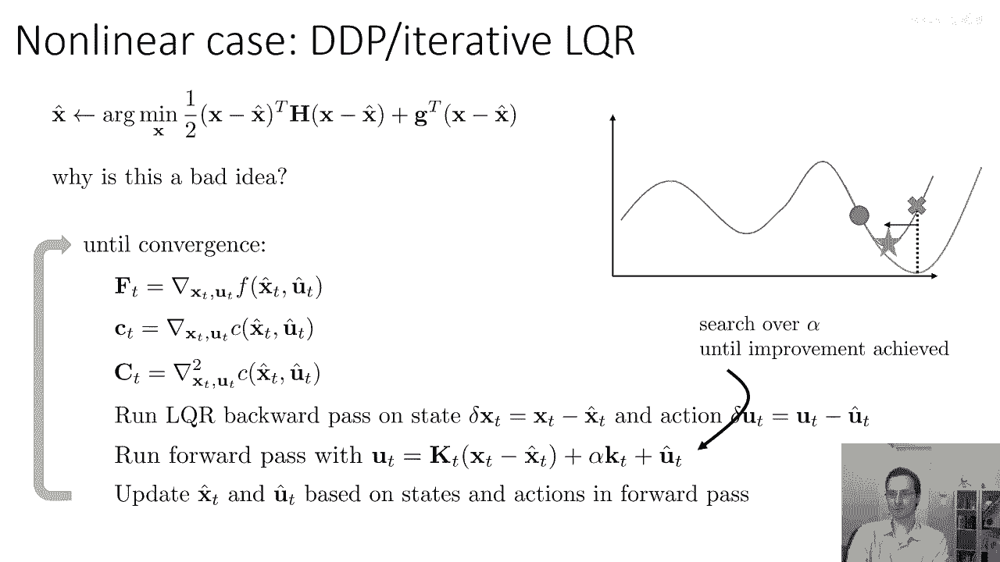