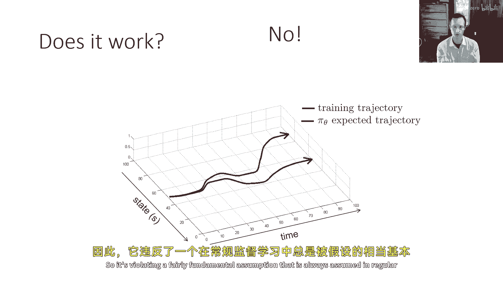
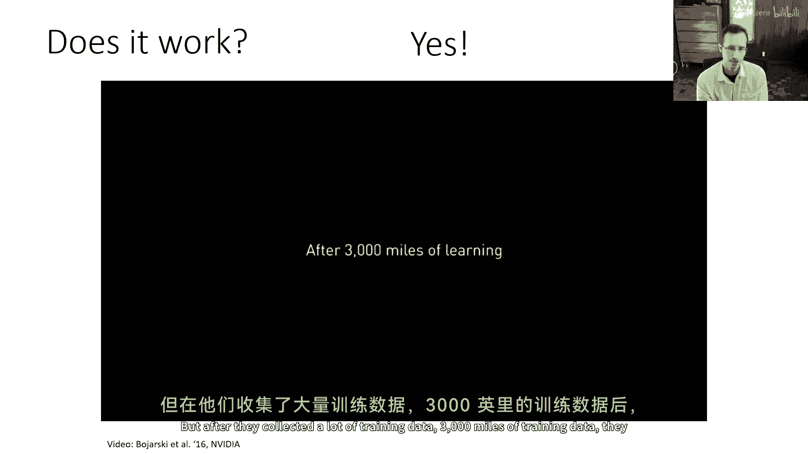
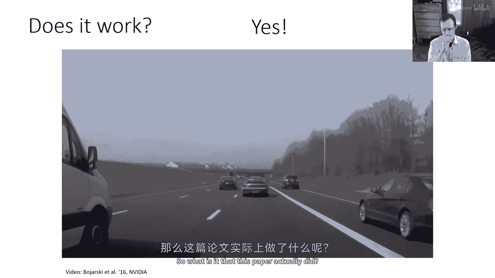
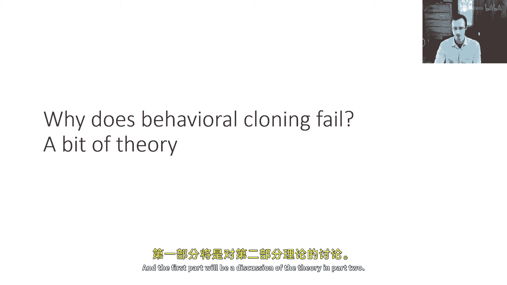

# 【深度强化学习 CS285 2023】伯克利—中英字幕 - P4：p4 CS 285： Lecture 2, Imitation Learning. Part 1 - 加加zero - BV1NjH4eYEyZ

"你好，欢迎参加计算机科学的第二堂课。"，"今天我们将讨论监督学习行为的方法。"，"那么让我们从一些术语和符号开始吧"，"所以我们在这堂课中将会见到很多术语"，"表示政策"。

"以便我们能够从数据中学习"，"我们不会讨论强化学习"，"目前我们还要讨论监督学习方法用于学习政策的问题"，"但是我们将从使用很多相同术语开始"，"在课程的其余部分"，所以通常来说。

如果你想要代表你的策略，你必须代表一个从代理观察到的任何事物到其行动的映射，现在，这不是一个那么奇怪的对象，对于熟悉监督学习的你们，嗯，你可以把这个看作是你如何代表，例如，一个图像分类器。

图像分类器从输入x映射到输出y，策略从观察o映射到输出a，但是除了原则上更改符号的名称之外，实际上并没有改变太多，所以，就像你可能训练一个图像分类器，该分类器看一张图片，并输出该图片的标签一样。

你也可以训练一个策略，该策略看一个观察，输出一个动作，我们将使用字母π来表示策略，并使用下标θ来表示该策略的参数，这可能是，例如，神经网络的权重，现在通常在控制问题中，在决策制定问题中。

事物存在于时间过程的上下文中，所以，在这个时间点，我可能会看看我的相机拍摄的图片，并决定做什么，然后，在下一个时间点，我可能会看到不同的照片，做出不同的决定，通常，我们会用下标小写的t来写输入和输出。

来表示时间步，对于大多数讨论，t代表时间，在这门课程中，我们将处理离散时间，这意味着t你可以把它看作是一个从零开始的整数，然后随着每个时间步进增加，但在一个真实的物理系统中。

t可能对应于一种连续的时间概念，例如，t等于零可能等于控制过程中的零毫秒，等于一可能等于两百毫秒，等于二可能等于四百毫秒，依此类推，现在，我们在一个实际的序列决策过程中，当然。

你选择的行动会影响你未来看到的观察，你的行动不是将成为图像标签，像它们那样，例如，在标准的图像分类任务中，但它们将是决策，对未来结果的决策，所以，而不是预测图片是否是老虎的图片，你可能预测一个行动选择。

如逃跑或忽视它，或做其他事情，但这实际上并没有改变政策的表示，如果你有一个离散动作空间，你仍然会以基本相同的方式表示政策，就像表示图像分类器一样，如果你的输入是图像，你也可以有连续的动作空间。

在这种情况下，输出可能不是离散的标签，也许它是连续分布的参数，在这里，一个非常常见的选择是表示分布作为高斯分布，这意味着政策将输出高斯的均值和协方差，但我们有许多其他选择可以作，所以。

总结一下我们的术语，我们将有观察，我们以字母o和下标t表示它，表示时间t的观察，我们的输出将是行动，我们以字母a和下标t表示它，我们的目标是学习政策，使它们能够在最一般的意义上成为给定o的分布。

我想在这里指出一点，因为这可能是一个来源的困惑，政策需要提供给我们采取行动的方式，在最一般的情况下，政策是分布，意味着它们为所有可能的行动分配概率，当然，政策可以是确定的。

意味着它为给定的观察指定一个行动，这是分布的一个特殊案例，它只是分配一个概率为一的事情，对其他所有可能的事情分配概率为零，所以，在大多数情况下，我们实际上会讨论随机政策，政策指定一个行动的分布。

但请记住，这是完全一般的，在意义上，确定政策只是这些分布的一个特殊案例，它是一个只分配一个概率为一，对其他所有可能的事情分配概率为零的分布，所以，在大多数情况下，我们实际上会讨论随机政策。

政策指定一个行动的分布，但请记住，这是完全一般的，在意义上，确定政策只是这些分布的一个特殊案例，在这里谈论分布是非常方便的，为同样的原因，我们倾向于谈论分布和监督学习，所以，非监督学习。

如果你正在分类图像，也许你仅仅真正想要为一个给定的图像预测一个标签，但你可能仍然学习到一个标签的分布，然后只是取最可能的输出，这使得训练这些事情变得更加方便，与决策和控制一样。

将这些政策作为概率分布进行训练往往更加方便，即使最终我们只想要最佳的单个行动，现在，我们还要引入一个术语，在这里，我们将开始讨论，序列决策的一些特性之一是状态概念，状态将以字母s表示，并且以下标t表示。

一般来说，状态与观察理解是不同的东西，这种区别对于某些类型的强化学习算法来说非常重要，对于今天的讲座来说，它并不是那么重要，因为对于模仿学习，我们往往不需要做出这种区别，尽管在这里，它也很重要。

当我们试图理解一些这些模仿学习方法的理论基础时，"嗯，而且"，"有时当我们学习政策时，我们会将政策写成对给定空间的分布。"，"我更倾向于给予，而不是接受"，"哦，我会尽力指出这正在发生的时候"。

"并且为什么"，"但是，要理解这两个对象之间的差异"，"让我们谈谈状态和观察之间的差异"，"然后我们再回来讨论这个问题"，"通常我们会提到那些依赖于完整状态的政策"，"作为全面观察的政策"。

与基于观察的政策不同，这可能只有部分信息，那么我的意思是什么，假设你在观察一张猎豹的照片，正在追逐羚羊，你需要在这个情况下做出一些决定，现在照片由像素组成，所以有相机的记录。

你知道在那些像素下面实际正在发生的是物理事件，你知道，也许猎豹有一个位置和速度，羚羊也是如此，但输入技术上只是像素数组的一个，这就是观察，状态产生了那个观察，状态是对世界的一个简洁而完整的物理描述。

如果你知道位置和速度，也许还包括猎豹和羚羊的心理状态，你就可以推断出他们接下来要做什么，观察有时包含你需要推断状态的所有必要信息，但是不一定如此，例如，也许前面有一辆车在行驶，但你看不到猎豹。

猎豹仍然在那里，状态并没有因为看不见而改变，但是观察可能已经改变，所以总的来说，可能无法完美地从当前观察中推断出当前状态，而反过来，从t到o，根据状态的定义，总是可能的。

因为状态总是编码你需要产生观察的所有信息，所以如果我们这样想，如果你想象这是一次模拟，st可能是计算机内存中整个状态的编码，模拟器的完整状态，而观察只是基于此状态在计算机屏幕上渲染出的图像。

所以从观察回到状态可能不是可能的，如果有些东西看不见，现在如果我们想要使这个稍微精确一些，如果我们可以，我们可以用概率图模型的语言来描述它，在概率图模型的语言中，我们可以绘制一个图表。

代表状态、观察和动作之间的关系，对于嗯，那些学过覆盖了，Bayes网络课程的人，这些图表对你们来说可能会很熟悉，大致来说，在这些图中，边缘表示条件独立关系，所以如果有一条边缘。

那么这个变量就不独立于它的父母，在某些情况下，这些东西可以编码依赖性，我不会深入讨论如何理解概率图模型，如果你没有覆盖这个部分，这对你来说可能不完全有意义，但是。

我希望对这些变量之间的关系的 verbal 解释仍然有意义，所以策略πθ是，至少对于部分可观察的情况，我们之间的关系o和a，所以它给出了在给定o的条件下a的分布，这就是图中的这条边缘，状态是什么。

决定你如何过渡到下一个状态，所以状态和动作一起提供了一个对下一个状态的概率分布，P(s_t+1|s_t，a_t)，有时被称为过渡概率或动态，你可以把它想成基本上是底层世界的物理。

所以状态和动作一起提供了一个对下一个状态的概率分布，P(s_t+1|s_t，a_t)，有时被称为过渡概率或动态，你可以把它想成基本上是底层世界的物理，所以当我们写下运动方程和物理学方程时。

我们不会写下描述图像像素如何移动的方程，我们会写下关于刚体如何移动的方程，以及类似的东西，所以这是指，S 状态，猎豹的位置，猎豹的速度，所以猎豹可能会根据其当前速度过渡到不同的位置。

并且可能基于猎豹有多饿，并且它正在试图做什么，并且这一切都被状态捕获，然后嗯，关于状态的一点需要注意的是，这里的状态s3与状态s1是条件独立的，s1，如果你知道状态s2，所以让我再说一次。

因为那可能有点不清楚，如果你知道状态s2，你需要找出状态s3，那么s1不会给你任何额外的信息，这意味着给定s2，s3与s1是条件独立的，这就是所谓的马尔科夫性质，并且它是状态最基本定义的特征之一。

本质上，如果你现在知道状态，那么过去的状态对你来说并不重要，因为你知道世界上所有关于状态的信息，这实际上是有意义的，如果你回想起关于计算机模拟的那个比喻，如果你知道计算机的全部内存状态。

这就是你真正需要的全部，为了预测未来状态，因为计算机的过去记忆并不重要，计算机只会在做它的模拟事情，基于现在的记忆，计算机本身无法访问其过去的记忆，只有现在的记忆，所以，未来与过去独立是合理的。

给定现在，因此，这被称为马尔科夫性质，"而且，非常"，"马克夫性质本质上定义了状态是什么意味着"，"国家是了解所有必要信息以预测未来的地方"，"不了解过去"，那不意味着未来完全可预测。

"未来可能仍然随机"，"可能会有随机性"，"但是了解过去并不能帮助你解决那个随机性"，"好的"，"所以，就让我们完成这个吧"，嗯，现在讨论，通过观察操作的政策和状态操作的政策之间的区别应该很清楚。

给定ot和状态操作的政策，πt是πot加上给定st时πst的一些算法，给定st的πt是某些算法，尤其是我们后面将要描述的一些后来的强化学习算法，只能学习状态操作的政策，这意味着它们需要政策的输入。

以满足马尔科夫性质，以完全编码系统的整个状态，一些政策，一些算法可能不需要其他算法，将非常乐意在部分观察下运行，这些观察可能不足以推断出状态，我会每次呈现算法时都试图做出这种区分，但我会立即警告你。

现在，强化学习实践者和研究者有一个非常不好的习惯，经常混淆o和s，所以有时候人们会称o为s，他们会说，哦，这是我的状态，实际上，他们意味着，这是我的观察，有时候反过来，有时候我会对这个区别解释得很模糊。

有时候他们会在状态之间来回切换观察，所以这种混淆经常发生，如果一切都很好，这种混乱是良性的，因为嗯，它通常在这种类型的混乱中发生，通常发生在算法中，它并不重要，无论是状态还是观察。

所以然后混合一下是可以的，我会尽量不混合一起，但有时候我会陷入旧习惯，无论如何都会混合一起，在这种情况下，我会尽我最大的努力告诉你，但请注意，O被混合的很多，如果你想要完全严格，完全正确。

这张幻灯片解释了差异，"顺便说一下记号"，嗯，"在这门课上，我们使用标准的强化学习符号"，"其中，s表示状态，a表示动作。"，这种术语源自动态规划的研究。"这一发明在五十年代和六十年代被开创"。

主要位于美国的由像理查德这样的人，贝尔曼，"我认为这种标记法实际上在他作品中首先被使用"，尽管我可能关于那个有误，那些有更多控制或机器人背景的人，可能对不同的符号有熟悉度，这意味着完全相同的意思。

所以如果你见过符号x用来表示状态，比如机器人的配置，或者控制系统，并且符号u用来表示动作，不要担心，它意味着完全相同的意思，这种标记法在控制中更常见，很多都源于，嗯，最优控制和优化的研究。

其中很多实际上在苏联由像 pagan 的人开创的，就像单词 '行动' 以符号 'a' 开始一样，单词 '行动' ，在俄语中也以符号 'u' 开始，这就是要传播的词汇。

所以这就是我们有 'u x' 的原因，因为它在代数中广泛使用，好的，所以现在就是集合，让我们实际上谈谈模仿，今天的主要话题，嗯，我们今天讨论的主题，所以我们的目标将是学习分布在给定o上的政策。

并将此使用监督学习算法来实现，所以，由于获取关于人们逃离老虎的数据，这并不是一件你可以很容易做到的事情，我今天的讲座中将使用不同的例子，这是一种自动驾驶的例子。

所以我们的观察将是来自车辆仪表板上安装摄像头的图像，我们的行动将是转向命令，向左或向右转向，你可以想象通过让人类驾驶汽车来收集数据，嗯，记录他们的方向盘命令并记录他们的相机图像，并用此创建数据集。

所以每次时间步，你的相机都会记录一张图像，然后你记录方向盘的角度，然后你从这个中创建一个训练元组，一个输入o和一个输出a，你将其收集到一个训练集中，其中a是标签，o是输入，现在。

你可以用这种训练集与使用标记数据集相同的方式使用，假设，图像分类，然后，训练一个深度神经网络来预测给定o的分布，使用监督学习，这就是最基本模仿学习方法的本质，嗯，我们有时称这种算法为行为克隆。

因为我们试图克隆人类演示者的行为，所以这是非常基本的算法现在，从我告诉你的，你现在就可以实现一个基本的方法来学习策略，我们今天讲座剩下的部分将讨论，这种方法是否工作，它为什么工作。

以及我们如何更频繁地使它工作，我们是否可以开发出比直接更聪明的算法，使用监督学习，这将更一致地工作，好的，监督学习产生这个策略，就像监督学习可能会产生图像分类器一样，这个被称为行为克隆，现在。

这些方法已经存在了很长时间，非常长的时间，嗯，这是第一个，嗯，我们称之为大规模，更大或更大的基于控制的学习方法，实际上，这是一种模仿学习方法，被称为alvin，在1989年开发。

它代表神经网络中的自主陆地车辆，这就是我们今天所说的深度rl方法，用于基于控制的学习，它使用人类驾驶员的数据来训练神经网络，带有大量的隐藏单元，看一个3x3的图像需要5个隐藏单元，两个观察道路和输出。

嗯，驾驶车辆的命令，它可以在道路上驾驶，它可以跟随车道，并且可以做一些基本的事情，嗯，你知道，可能无法很好地处理交通法规，但它是很久以前自动驾驶系统的一个非常粗糙的轮廓，但是嗯，如果我们要精确地问。

使用这些行为克隆方法总体上是否保证工作，不幸的是，答案是否，我们将详细讨论导致这种情况的正式原因，但是给你一些直觉来开始，让我们这样想，我会画很多这样的图，在今天的讲座中，在这些图中，嗯。

一个轴代表状态，所以想象一下，状态是一维的，当然，在现实中，状态并不是真正一维的，但对于可视化，这就是它要表现的样子，而另一个轴是时间，现在在这种嗯，状态时间图。

你可以把这条黑色的弯曲线看作是一条训练轨迹，在现实中，当然，你会有许多训练轨迹，但现在让我们假设你只有一根，现在让我们想象一下，你在这条训练轨迹上进行训练，你获得你的政策，然后。

你将从相同的初始状态运行你的政策，好的，所以，红色曲线将代表该政策的执行，假设你做得非常好，所以你从 uh，Cs，189 学到了所有的课程，并确保你没有过拟合，也没有欠拟合，但是当然。

你的政策仍然会至少犯一些小错误，对，每个学习模型都不是完美的，它会犯微小的错误，甚至在与训练时看到的状态非常相似的状态下，而且问题在于，当它犯这些微小的错误时，它会进入与训练时我看到的不同的状态，所以。

如果训练数据涉及在道路上相当直行，在车道中间，这使得这个政策产生一些偏差，稍微偏移中心，现在开始看到一些陌生的东西，这与我之前看到的有所不同，当它看到一些稍微不同的东西时。

它更可能犯一些稍微大一些的错误，这些错误的增加量可能在开始时非常小，但每个额外的错误都将把你置于一个越来越陌生的状态，这意味着错误的大小会增加，这意味着到最后，如果你有很长的轨迹。

你可能处于极其陌生的状态，因此你可能犯下极其大的错误，这种情况不会在监督学习和常规监督学习中出现，它不出现的原因实际上是我们在课堂上讨论过的，在监督学习中，我们假设了一个特定的情况，嗯。

你们中的一些人可能记得它，嗯，如果你认为你可能记得它，也许你可以暂停这个视频，花一点时间来思考这个问题，当你暂停时，我会告诉你答案，答案，当然在常规监督学习中，iid属性是关键。

我们假设每个训练点都不会影响其他训练点，这意味着你输出的标签，例如数字或一，对正确答案没有影响，例如数字二，但在这里当然不是这样，因为当你在这里选择一个动作时，实际上。

它实际上改变了你将在下一个时间步观察的观察，所以，它违反了一个相当基本的假设，这个假设总是在常规监督学习中被假设。

然而，在现实中，朴素的行为克隆方法实际上可以工作得很好，这是来自nvidia相当旧论文的一些结果，在那里，他们尝试了一种行为克隆方法用于自动驾驶，一种现代化的阿尔文版本，最初，他们遇到了很多麻烦。

他们的车给他们带来了很多坏转弯，撞到交通锥等物体，但是当他们收集了大量的训练数据后。

三万英里的训练数据，他们实际上可以得到能够跟随车道的汽车，相对熟练地，它能够绕过锥形物，它能够跟随道路，而且他们总是有一个安全驾驶员在里面，这并不是一种完全的自动驾驶系统，但是。

它确实看起来前一张幻灯片上的悲观景象在实践中可能并不实际，至少不是总是，那么，这篇论文实际上做了什么使它工作良好呢。

任何机器学习系统中都有很多复杂的决策，但我想告诉你一点关于其中一个决策的，嗯，这可能为我将要讨论的一些想法设定了基调，在讲座的其余部分是一篇论文中更深埋的图表，那表明，好的，所以他们有，嗯。

记录的转向角度，他们有一个相当典型的卷积神经网络，他们还有一些摄像头，但他们有这个中心摄像头，左摄像头和右摄像头，还有这个随机偏移和旋转，那个井怎么了，在那项工作中，政策的训练方式有一些细节。

细节是这个，所以，他们的车实际上有三颗摄像头，它装有一颗常规的前向摄像头，那就是实际上驾驶汽车的摄像头，然后他们也有一颗左向摄像头，他们从左向摄像头中获取图像。

他们并没有用人类在数据收集期间实际执行的转向命令来标记这些图像，而是用稍微向右偏转的修改后的转向命令来标记，想象一下这颗摄像头看到的是什么，摄像头看到的是什么，当汽车在道路上直线行驶时。

相机看到的图像类似于汽车将看到的图像，如果值得付出左边，然后他们合成性地给这个动作标记一个标签，以纠正并游回右边的动作，然后他们对面向右边的摄像头做同样的事情，他们给这个动作标记一个稍微偏向左边的标签。

相对于人类驾驶员实际上使用的动作，你可以想象这个如何可能纠正，因为我之前讨论过的一些问题，因为如果政策有一点错误，那么它可能会开得更远到左边，而不是它应该开的地方，现在。

它将看到类似于那个左向摄像头看到的东西，而现在那个状态并不那么陌生，因为它已经在那些左向摄像头中见过，现在，它在前向摄像头中被看到，但是，政策不知道它正在通过哪个摄像头看，它只知道它与那个图像相似。

在那之前被标记为向右转，所以它会纠正，好的，所以我为什么要告诉你这个，故事的道德是什么，那又告诉我们关于如何，我们实际上可以使得基于行为的克隆方法在实践中工作得非常好，嗯，故事的道德是。

通过基于行为的模仿学习，并不是，一般来说保证能够工作，我们将使这一点更加精确，我们将精确地描述，嗯，这个问题实际上有多糟糕，这与监督学习不同，所以对于监督学习，你可以推导出各种简单的复杂性和正确性界限。

当然，当深度神经网络出现在画面中，那些界限往往做出强假设，可能在实践中不 holds，但至少那是一个相对被广泛理解的领域，而这通常在行为克隆中不 holds，并且这主要是因为iid假设，事实是。

单个输出将在序列设置中影响未来输入，但是在经典的监督学习设置中，他们并不会，我们可以通过理论来解释这一点，我们今天会讨论这个问题，我们可以用几种方式来解决这个问题，首先。

我们可以聪明地收集和增强我们的数据，那篇来自nvidia的论文可能确实这样做了，使用与数据增强类似的技术，其中，而不是简单地直接使用人类驾驶员观察到的真实观察和他们的行动。

他们从这些左右侧向的摄像头中添加了一些额外的假观察，通过合成地修改动作来修复问题，我们还可以使用非常强大的模型，它们只做很少的错误，记住，问题最初是由于事实，我们在开始时犯了那些小的错误。

这些错误然后随着时间的推移积累，如果我们可以最小化错误，如果我们使用非常强大的模型，也许与第一个要点结合使用，那么我们也可以缓解这个问题，还有一些其他解决方案，可能稍微有点异国情调，但是。

在某些情况下可能会非常有用，例如，有时切换到更多的多任务学习形式，同时学习多个任务可以，或许令人惊讶，实际上可以使模仿学习更容易，然后，我们也可以改变算法，我们可以使用更复杂的算法，直接解决这个问题。

这个累积误差问题，我们将讨论一种名为dagger的这样一种算法，现在通常涉及到改变学习过程，以匕首为例，它实际上改变了数据收集的方式，但它可以为这些问题提供一种更原则性的解决方案。

而且你将在实际作业中实现这个算法，所以嗯，那就是我将嗯，在接下来的讲座中讨论其余部分。

