# 【深度强化学习 CS285 2023】伯克利—中英字幕 - P50：p50 CS 285： Lecture 12, Part 1： Model-Based RL with Policies - 加加zero - BV1NjH4eYEyZ

你好，欢迎参加计算机科学的第十二堂课，今天，我们将讨论基于模型的强化学习，以学习策略。

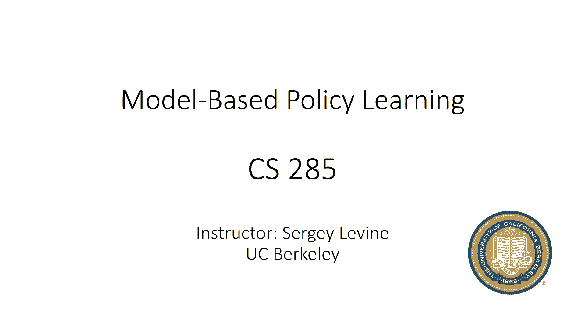

所以，在前一节课的结论中，我们最后得出的基于模型的RL算法是一种基于模型的RL方法，与模型预测控制相结合，所以我给这个基于模型的RL版本命名为，1。5，当然，这并不是它实际上的名字。

但我只是在使用它的那个名字，它的工作方式，你是否首先使用一些初始策略收集一些数据，比如随机策略，然后训练一个动力模型，然后通过此模型来选择动作，使用我们讨论过的各种规划方法之一，执行计划中的第一个动作。

然后观察结果状态，将该过渡添加到缓冲区，然后再次规划，所以每次时间步你都是通过模型重新规划，当然，正如我们讨论的，这有助于补偿模型错误，然后，每过几步，你就会重新训练模型，使用你收集到的新数据。

常常这和一些多倍的时间步长，所以你会在每几条轨迹后重新训练模型，但你也可以持续这样做，使用这样的方法的便利之处在于，他们可以基本上使用许多那些最优控制规划，或轨迹优化程序作为子程序，但它们有一些缺点。

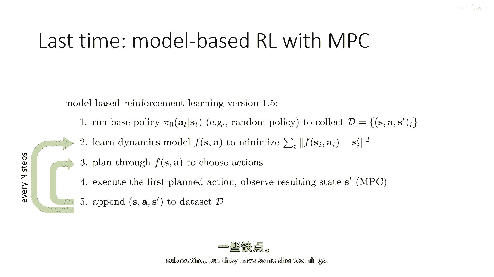

所以最大的缺点，当然，那是我们讨论过的大部分规划方法吗，尤其是最简单的方法，如随机射击和交叉进入方法，是开放环路方法，意味着他们将优化预期的奖励，给定一系列动作，如我们之前讨论的，开放环路控制是次优的。

所以嗯，如果你想考虑一个例子来说明为什么它是次优的，我上周给出的例子是这个数学问题的例子，所以如果我告诉你我要给你一个数学问题，一个非常简单的，只需要将一个数字添加到另一个数字中，然后你有选择。

你有两个时间步骤，在第一个时间步骤，你可以选择接受测试或回家，在第二个时间步骤，你需要看测试并产生答案，如果你产生正确的答案，你将获得两千美元，如果你回答错误，你将失去一万美元，如果你回家。

那么你将一无所得，如果你采取开放式策略，这意味着在那个甚至没有看到测试的第一次步骤上，你就必须承诺一个答案，你必须承诺两个行动，所以这种情况下的任何最优规划者实际上会选择不参加测试。

因为在没有看到考试的情况下随机猜测答案的概率非常低，预测控制实际上并没有解决这个问题，因为尽管预测控制在每个时间步都会重新规划，每个时间步，但它仍然在规划开环，所以如果它 ever 进入一个状态。

在那里它被呈现一个数学测试，它将产生正确的答案，但它不会选择进入那个状态，因为它没有意识到那会有机会重新规划，而这实际上是非常重要的，这是这个类控制算法相对简单的一部分，但是，这也是他们最大的缺点之一。

因此，为了克服这个问题，我们真的需要向封闭循环的情况移动，其中，而不是承诺一系列的行动，我们承诺一项政策，因此，在封闭循环的情况下，代理观察到一个状态，然后产生一项将在此后遵循的政策。

并且那个目标的距离原始强化学习问题要近得多，差异，当然，基于模型驱动的强化学习设置中，我们模型p(s，t)，再加上给定的s，d，a，t明确地，这可能会给我们提供解决这个问题的其他方法。

但目标与常规强化学习完全相同，它是产生一个政策，该政策将选择您可能发现自己在任何状态下的行动，这种方法，如果您，如果我们能够开发一个有效的闭环控制算法，将解决数学问题。

因为它将能够优化一个给出所有可能正确答案的政策，数学问题的观察状态，因此，它将意识到可以安全地接受测试并产生正确的答案，尽管它直到测试被观察后才知道答案，当然，实际上，有一个选择需要作出。

那就是π的形式，所以当我们谈论无模型强化学习时，在我们通常讨论π由高度表达的函数逼近器表示，如神经网络之前，这些给我们提供了全局策略，可以在任何地方产生良好的动作，至少是任何地方。

当我们讨论最优控制方法 last week 时，我们讨论了这些策略是如何训练的，我们还讨论了一些可以给出闭环控制器的方法，但这些方法只在局部上是好的，例如，"迭代LQR不仅产生一系列的动作"。

它将实际生成一个线性反馈控制器，"并且这个线性反馈控制器会在局部邻域给你好的行动"，"围绕你产生的开放环路计划"，"所以这就是一种介于开环和闭环之间的状态。"，"但它不是一个全球有效的闭环策略"。

所以这就只有效果的，"如果你稍微偏离你最初的计划"，"所以，在今天的讲座中"，我们将真正专注于我们可以使用的方法来训练全球政策，例如神经网络，但利用学习到的模式，从而获得基于政策的完整模型。

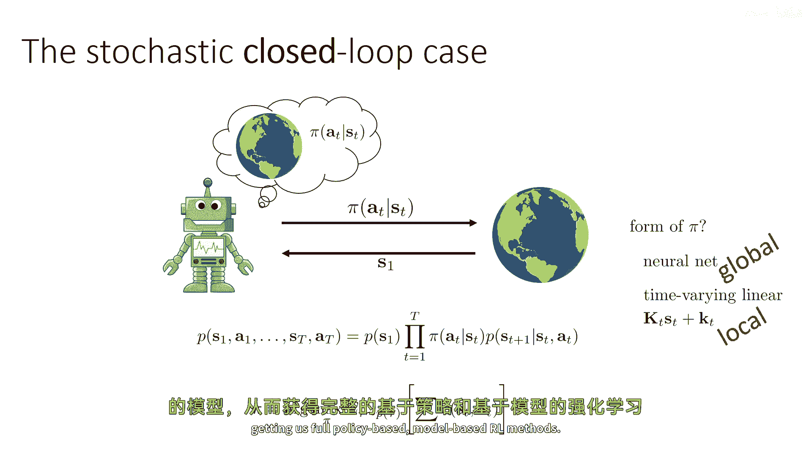

基于模型的强化学习方法，所以让我们从一个简单的稻草人例子开始，如果我们对强化学习一无所知，如果我们只是，嗯，你知道，错过了这门课程的第一部分，我们尝试设置这个问题，我们在这里学习了模型。

我们想要学习一种政策，以最大化奖励，我们只是想运用我们熟悉和热爱的深度学习工具。

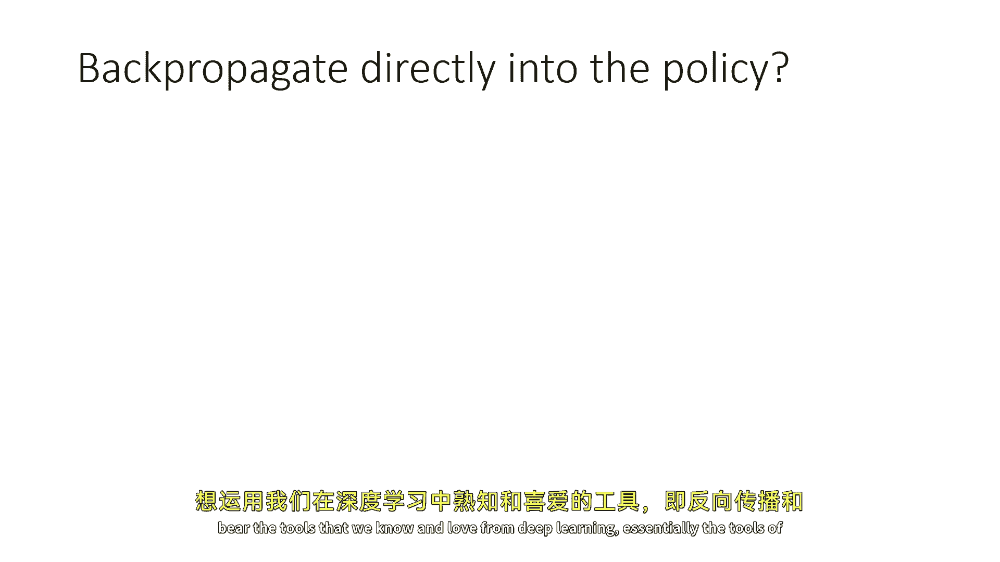

本质上是反向传播和连续优化的工具，我们如何做得好，我们可能会做，我们可能会设置一个计算图，我们在深度学习中有一个优化问题，那就是最大化总奖励，我们了解如何解决优化问题。

我们使用自动自动差异软件来实施它们，计算梯度，然后进行梯度下降或梯度上升，所以我们的目标是奖励的总和，所以让我们设置一个计算图，它允许我们计算给定策略的奖励总和，所以在这个计算图中。

基本上有三种类型的函数，有策略，它们看状态并产生动作，有动态，它们看状态和动作产生下一个状态，并且存在一些奖励，它们考虑状态和动作，产生标量值，所以这基本上是计算图，如果你假设奖励是一个已知的函数。

可能是你可以也计算导数的东西，并且f是一个学习模型，所以那是神经网络，并且pi是学习模型，那也是神经网络，这是一个完全有效的计算图，你可以设置起来，你实际上可以在pi torch中实现这个。

你可以实现一个损失函数，它是所有奖励之和的负数，你可以对它调用点梯度，我正在试图掩盖一些细节，关于随机性的所有细节，所以这仅适用于确定性系统，但对于随机系统，对于某些类型的随机性，嗯。

模型仍然可以做到这一点，例如，如果你有高斯模型，你可以使用被称为重参数化技巧的东西，我们在本课程中稍后会讨论这个，以设置像这样的计算图，即使你有高斯噪声添加到政策和模型中，但目前。

让我们只考虑确定性情况，所以这里的一切都可以实现，你可以对它调用点梯度，它会实际上给你强化学习目标的梯度，至少对于随机情况，所以问题来了，这会工作吗，如果你实际设置这个，你会能够优化πθ吗。

所以你会能够从每个奖励节点反向传播，到所有其他θ，那些πθ节点的参数，并实际上优化你的政策以产生更大的和更大的奖励，嗯，一般来说答案是不，所以让我来解释一下，我将这个基于模型的强化学习版本称为2。0。

让我来明确地说明，这个算法是什么，然后我会解释为什么一般来说这不太起作用，就像以前，你会开始运行一些基础政策来收集数据集，在数据集上训练动态模型，然后你会构建这个计算图，就像我在这里画的。

或者类似的东西，将动态传播到你的政策中，以优化政策参数，然后运行政策，将访问数据添加到数据集中，然后重新训练，好的，所以这是一个非常合理的方法来扩展基于模型的强化学习方法，我们已经从以前到现在看到了。

学会了政策而不是规划，那么这个问题在哪里，嗯。

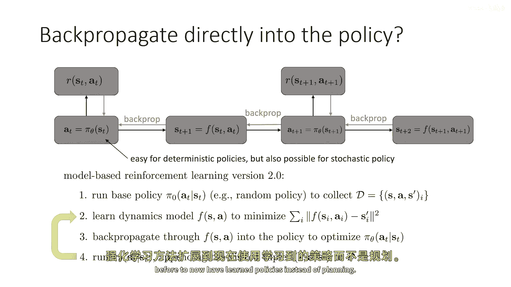

我鼓励你们现在暂停视频，思考可能存在的问题，好吧，我将鼓励每个你们现在暂停视频，思考可能存在的问题，这个食谱可能出错的原因是什么，作为一个提示，这个不工作的原因并不是因为它是错误的，它不一定不工作。

与许多具有类似时间结构的其他类型的神经网络一样，在深度学习的其他领域，如果简单地实现，往往会失败，所以这是一个小提示，也许考虑暂停视频，花一点时间思考，这个食谱可能存在的问题是什么，好的，所以问题在于。

嗯，基本上像这样，就像在，嗯，轨迹优化，当我们谈论射击方法时，我们讨论了早期在轨迹上的动作对未来很远处的影响如何累积，而末尾的动作影响相对较小，所以你对开始的动作有真正的大梯度，因此。

相对于政策参数的较小梯度，较大的梯度更为常见，与结尾处的较小梯度相比，对于熟悉数值优化的你们，到这个时候，我们可能会意识到，如果你处于一种情况，其中一些变量被巨大的梯度击中，一些变量被微小的梯度击中。

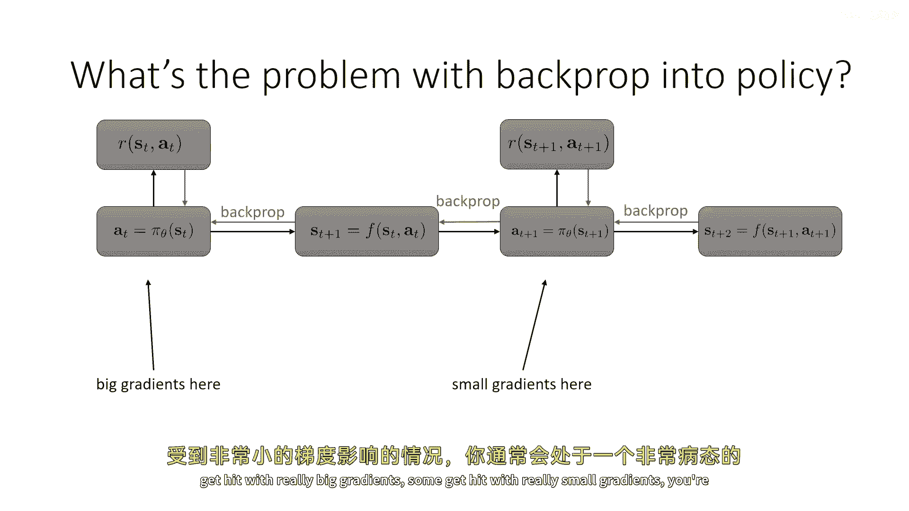

你通常处于一种条件极差的情况，而这里正是这种情况，嗯，从视觉上看，你可以这样想，那就是一个小的改变。

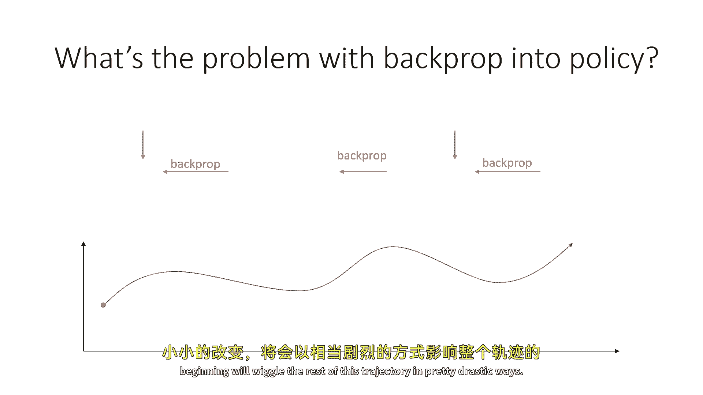

开始的行动将极大地摇晃这个轨迹的其他部分，而且问题类似于参数敏感性。

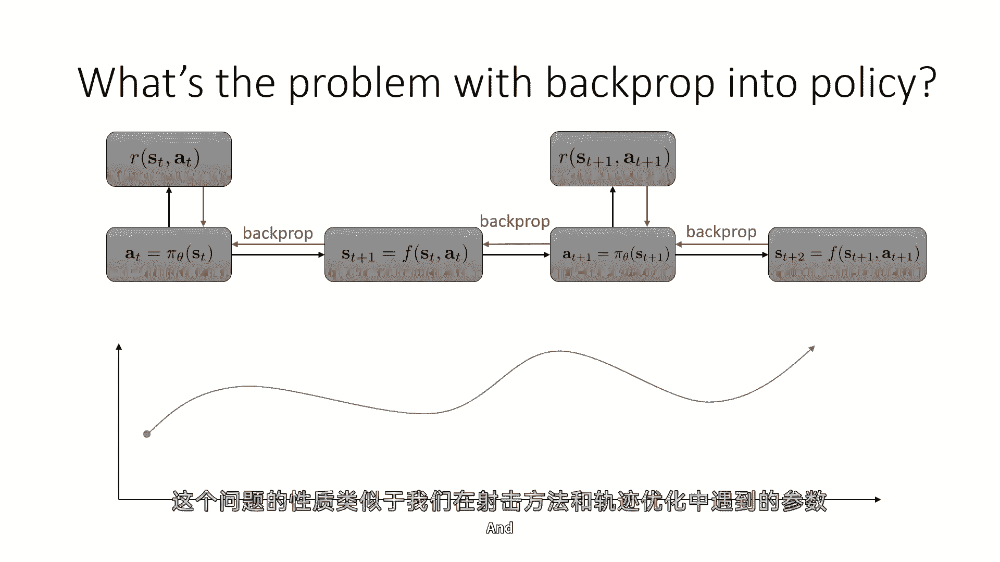

嗯。

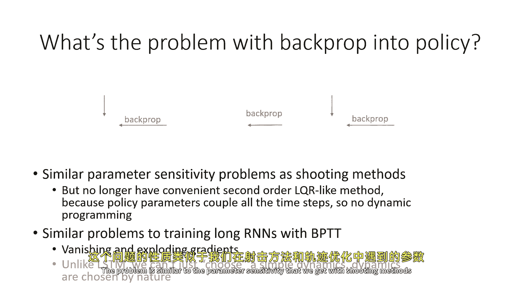

我们在额外优化中的射击方法中得到的，嗯，除了不再方便使用像lqr这样的第二阶方法之外，所以嗯，当我们学习轨迹优化和射击方法时，我们谈论了这个lqr方法，这仅仅看起来有点像牛顿的方法，实际上。

它计算出看起来像二阶导数的性质，实际上，它再次提供了一个行为更好的优化过程，对于熟悉数值优化的你们，现在可能会认出我在说什么，如果你有一个条件较差的问题，意味着矩阵的赫西安具有非常高的曲率。

你可能想要使用二阶方法，它将显著优于一阶方法，这基本上就是这里发生的事情，然而，使用二次技术进行轨迹优化和射击方法的方法非常方便，因为我们从未需要构建一个大型海森矩阵。

我们可以仅仅使用此动态规划程序来计算，使用lqr非常高效地计算本质上的海森矩阵向量积，当我们优化策略时，这个选项不再可用，因为策略参数始终将所有时间步耦合在一起，所以你不再有这个方便的优化程序。

可以从结尾开始，并反向工作，对于这种问题，实现二次优化器是可能的，而且他们比第一阶优化器工作得更好，但他们不再受益于问题中的方便时间结构，而且他们倾向于相当难以使用，他们在神经网络上尤其难以使用，因为。

第二，神经网络的第二阶优化器往往有些不稳定，而且难以设置，所以并非不可能，但从深度学习的角度来看，不一定非要工作得很好，实际上，这些问题与你遇到的非常相似，当你尝试简单地训练循环神经网络时。

通过时间反向传播，对于熟悉RNN训练的你们，我们可能会认出很多我所说的，如果我们简单地设置一个循环神经网络，没有使用像lstm或transformers这样的复杂架构。

那么我们会遇到梯度消失和爆炸的问题，因为后来的奖励的导数，相对于早期的策略参数涉及到许多许多雅可比矩阵的乘积，除非那些雅可比矩阵的特征值接近于一，那么梯度要么爆炸，要么消失，所以。

如果特征值倾向于大于一，如果他们倾向于小于一，他们会消失，这与你现在在训练循环神经网络时遇到的问题非常相似，到这个时候，当然，你可能会问，这些是否与我们在训练循环神经网络时遇到的问题相似。

我们可以使用类似的解决方案吗，例如，我们能否使用像lstm模型这样的东西，这里的问题是，在rnn中，你实际上可以选择动态，而 here 我们无法选择自己的动态，所以，我们必须真正训练f。

使其尽可能接近真实的动态，否则，我们就不会得到在实际系统中最终起作用的策略，所以，使用lstm，我们可以选择一种形式为，嗯，那些参与时间反向传播的函数，所以，例如，它们的导数子特征值接近一，可能。

它们的导数主要由一个几乎等于身份矩阵的矩阵主导，lstm为您提供的，但在做基于模型的rl时，这并不是一个真正的选项，因为你无法使用你想要的任何动态，你真的需要f来匹配真实动态，这可能具有高曲率。

并且他们可能，它可能具有，嗯，海森矩阵的特征值可能非常远离一，因为你无法选择f，所以你无法真正使用深度学习世界中开发的大多数解决方案，因为这些解决方案大多涉及到基本上改变函数，使它更容易求导。

所以我们实际上在这里遇到了一些麻烦，虽然，对于基于模型的rl的未来创新来说，使它们更容易通过这样的长期时间链推导梯度是完全可能的，在当前，通过学习动态和策略的学习链进行求导往往会表现得非常糟糕，因此。

基于模型的rl的梯度优化对于策略来说是一种非常棘手的提法，所以解决方案是什么。

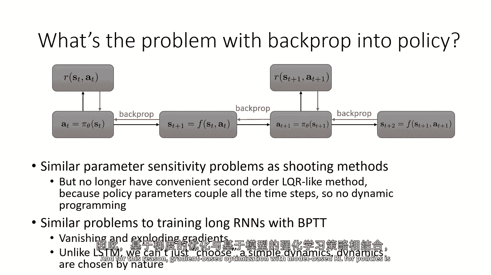

嗯，我们今天讲座中讨论的大部分实际上都与，可能令人惊讶地，使用具有生成合成样本的模型的无导数rl算法有关，这可能看起来很奇怪，就像基本上这意味着，如果你要学习一个模型，不实际利用模型已知或已知的导数。

相反，假装模型基本上是环境的模拟器，并使用它来模拟更多的数据以加速无导数rl，这可能看起来很奇怪，这就是我们现在有的最好选择，但实际上，这是我们能做的最好的事情，而且它实际上现在工作得非常好，在实际中。

我们可以，当然，在某种程度上混合模型免费训练和某些程度的规划，但仅使用模型来模拟经验对于模型免费rl可以非常有效，它实际上是一种基于模型的加速模型免费rl，所以，RL的基本方法将与我们之前讨论的相同。

将有政策梯度方法，仅使用模型来模拟经验对于模型免费rl可以非常有效，它是一种基于模型的加速模型免费rl，所以，RL的基本方法将与我们之前讨论的相同，将有政策梯度方法，演员-批评者方法，Q学习方法等。

但他们只会获得来自学习模型的额外数据。

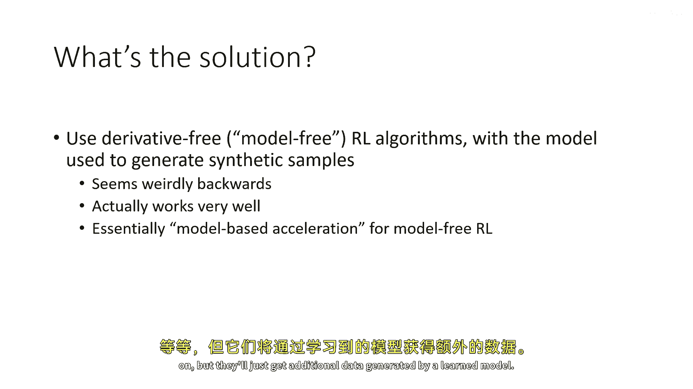