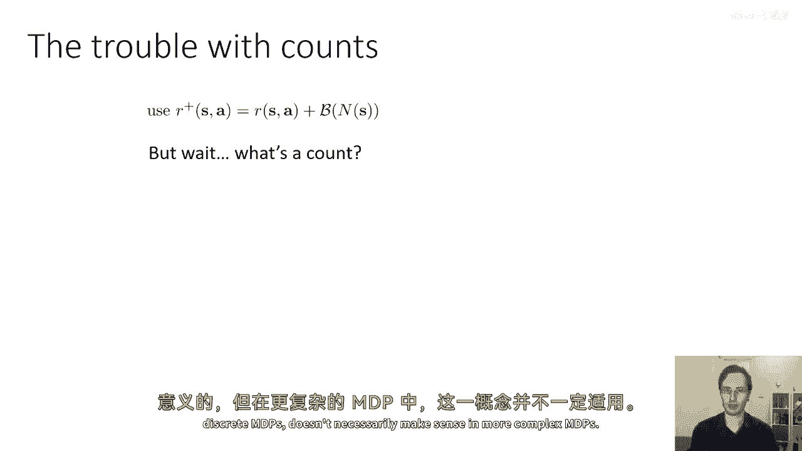
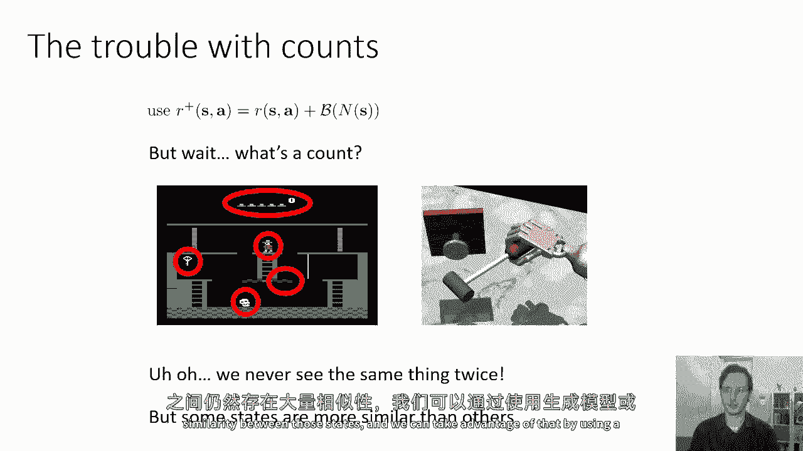
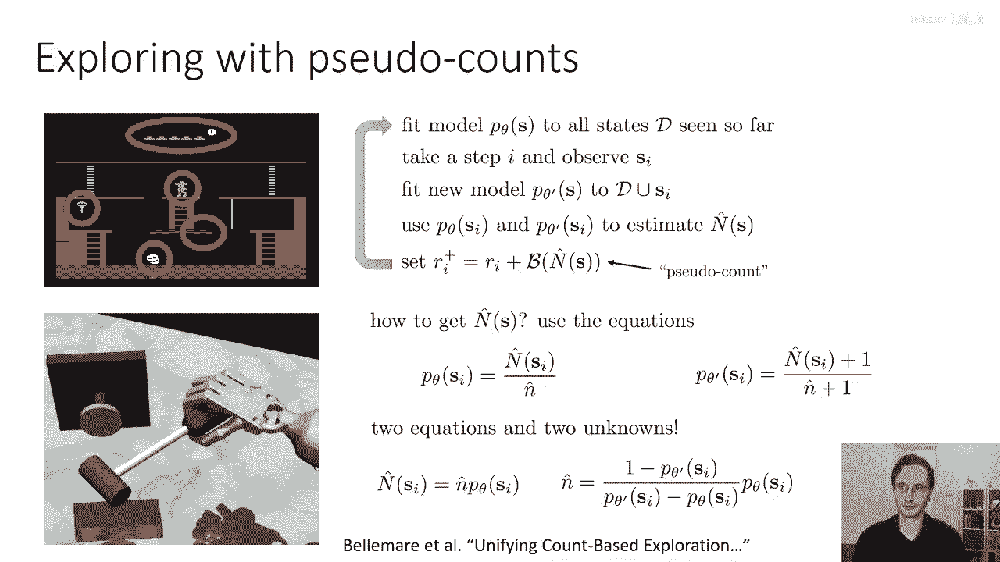
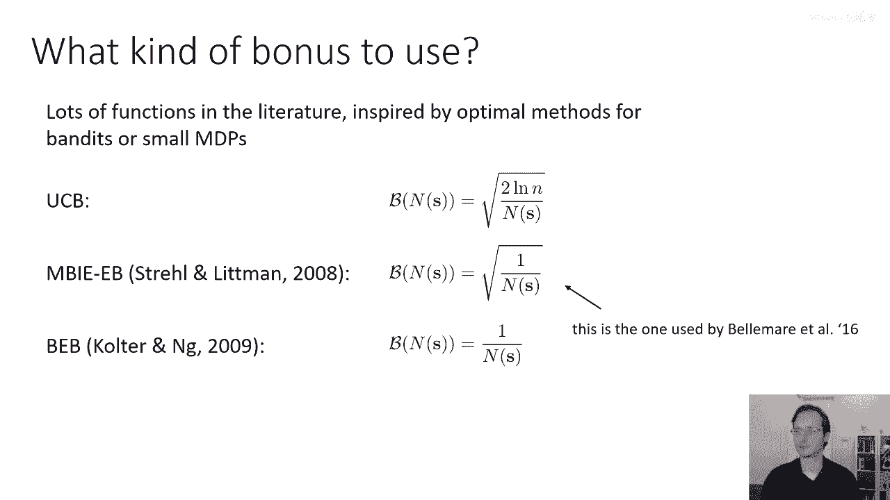
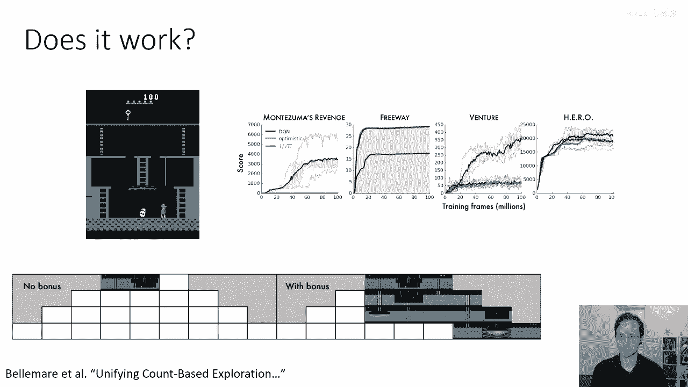
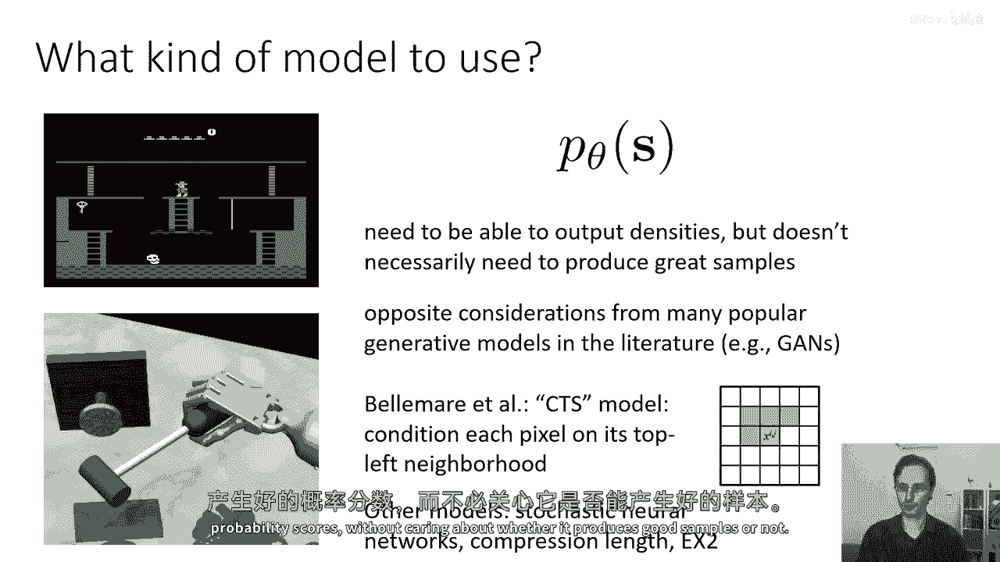

# 【深度强化学习 CS285 2023】伯克利—中英字幕 - P56：p56 CS 285： Lecture 13, Part 3 - 加加zero - BV1NjH4eYEyZ

好的，接下来，让我们谈谈一些我们可以在深度强化学习中使用的实际探索算法，所以，总结一下我们拥有的探索方法类别是乐观探索，这基本上意味着访问新的状态是一件好事，这需要估计某种状态的访问频率或新颖性。

就像我们在多臂强盗设置中必须计算我们采取每个动作的次数一样，这通常通过某种形式的探索奖励来实现，我们有基于汤普森采样的算法，要么是模型，要么是q函数，或者是策略。

就像我们之前学习过对多臂强盗参数的这种分布一样，然后它们根据样本进行采样并按照样本行动，我们还有信息增益风格的算法，它们考虑从访问新状态中获得的信息，然后实际上选择导致大量信息增益的过渡。

所以让我们从乐观探索的方法开始，在多臂强盗世界中，我们看到了一种我们可以用来平衡探索和利用的规则，是根据每个动作的平均预期值的arg max来选择动作，基于我们之前看到的经验估计。

加上根号2乘以logt除以a，在这里，重要的是分母，所以你基本上是根据某种函数来分配奖励，这个函数的倒数是你拉过那个臂的次数，这实际上是一种探索奖励，在强化学习中，我们的直觉是，我们将构建一种探索奖励。

嗯，这不仅仅是为了不同的动作，实际上也为不同的状态，而且，许多不同的功能都可以用于这个探索奖励，只要它们随着n of a的增加而减少，不要害怕它实际上是一个平方根。

或者是在numerator中有一个2次logt，重要的是，它是某种数量，随着n of a的增加而迅速减少，好的，我们可以用这个想法与MDPs吗，我们可以做一件事，嗯。

基本上将其扩展到MDP设置并创建被称为基于计数的探索，而不是计数你拉过某个臂的次数，那就是n of a，你将计数你访问某个状态动作元组的次数，s，逗，a，或者是你访问某个状态的次数n of s。

并用它来添加探索奖励到你的奖励，所以在多臂强盗的情况下，UCB估计是在估计奖励，在MDP情况下，带有探索奖励的估计也将估计奖励，这意味着我们将定义一个新的奖励函数，R加上，这就是原始的奖励。

加上这个基于n of s的奖励函数，所以这意味着我们将有一个新的奖励函数，并且奖励函数只是一个随着s的n减少的功能，所以也许它是1除以s的n的平方根。

然后我们将简单地使用我们的加法而不是r作为我们的奖励函数，对于任何关心使用它的rl算法，当然，在这种情况下，我们的加法将随着策略的变化而变化，所以也许我们每个episode都将更新我们的加法，嗯，所以。

我们需要确保我们的rl算法不会太困惑，因为事实是我们的奖励一直在变化，但是除此之外，这种方法是完全合理的，将ucb的想法扩展到mdp设置中，所以它是任何rl算法的简单添加，它非常模块化，嗯。

但你确实需要调整这个奖励的权重，因为你知道，如果你做，嗯，一亿除以n个s，这与如果你做会大大不同，你知道零点，零零一除以n个s，所以你需要决定奖金相对于奖励的重要性，当然。

你需要找出如何实际进行计数的方法，所以让我们谈谈第二个问题，计数的问题在哪里，计数的问题在于计数的概念，虽然在小的离散MDP中它有意义，但在更复杂的MDP中它不一定有意义。

所以让我们从蒙太古的复仇中清楚地看看这个框架，如果我发现自己看到了同样的确切图像十次，那么那个图像的计数应该是十，但如果图像中只有一件事在变化，那么如果，例如，这里的这个人只是站在相同的地方。

但是头骨在每个位置都会移动，因为头骨现在已经处于完全不同的状态，如果这个人正在移动，头骨也在移动，他们再次在同一精确的组合位置出现的可能性有多大，所以也许他们会处于非常相似的状态。

但他们可能不会再次在同一位置，总的来说，如果你有许多不同的变化因素，你将得到组合上无数的状态，这意味着再次使用相同精确状态的概率变得非常低，所以所有这些移动元素都会导致问题，那么那些连续的空间呢。

情况甚至更加严重，所以如果你想象之前那个机器人手的例子，现在，空间是连续的，所以没有任何两个状态会是相同的，所以问题在于这些更大的rl问题，我们基本上从未见过相同的事情两次，这使得计数变得有些无用。

那么我们如何将这个计数扩展到这个复杂的，嗯，设定在你要么有非常多的状态，甚至是连续的状态，嗯，我们想要利用的概念是，一些状态比其他状态更相似，即使我们从未访问过相同的确切状态两次。

但这些状态之间仍然有很多相似性，我们可以利用这一点，使用生成模型或密度估计器。

所以这是想法，我们将拟合一个密度模型到p theta的s或p theta的s，逗号a，取决于我们是想要状态计数还是状态动作计数，一个密度模型可以是一些简单的，比如高斯，它也可以是非常复杂的。

我们将讨论密度模型的特定选择 later，但现在我们只需要它是能够回答问题的东西，这个状态的密度或可能性是多少，如果你学习了一个密度模型，例如，一个非常表达的模型，比如神经网络。

p theta的s可能会很高，即使对于你从未见过的完全新的状态，如果他们非常相似于你之前见过的状态，也许你从未见过这个人和头骨在精确这个位置，但你见过这个人在那个位置，你也见过头骨在那个位置。

只是它们没有在一起，所以那个状态可能会有一个比如果发生一些非常奇怪的事情，如，例如你突然拿起钥匙，你知道如果在之前的任何状态中，钥匙总是存在，现在突然它消失了，那会有一个非常低的密度。

所以我们可以问的问题就是，我们是否可以 somehow使用p theta的s作为一个种类的计数，它不是计数，因为它并没有真正告诉你你访问了多少次特定的状态，但它看起来有点像计数，因为在某种程度上。

你知道，如果你取s的p，然后乘以你已经见过的所有状态的总数，那就是那个状态的一种密度，所以如果你有一个小的mdp，嗯，在实际计数中，嗯是可以做到的，那么一个状态的概率就是计数。

在那个状态上除以你已经见过的所有状态的总数，所以它是n除以m，所以它与计数相关的概率，以及你访问的总状态数，这意味着在你看到状态s后，你的新概率是旧的计数加一除以旧的n加一，所以这里是问题。

你可以让p(θ|s)和p(θ'|s)遵守这些方程式吗，所以而不是跟踪计数，我们跟踪p(s)的，但我们会在看到s时更新θ来获取新的θ'，意味着我们的密度模型会更新，其参数也会改变。

所以当我们看p theta of s和p theta prime of s如何改变时，并恢复一些也遵守这些方程的东西，基本上看起来像是一个计数，它不是一个计数，但它看起来像是一个计数。

并且它像是一个计数，所以它可以被用作一个计数，所以这是基于一篇叫做统一基于计数的探索的论文，由mel del mar撰写，嗯，del mar，想法是这个，我们将拟合一个模型p theta of s。

到为止在我们的数据集d中看到的所有状态，然后我们将步进i并观察新的州si，然后我们将拟合一个新的模型p theta prime of s到d，其中新的状态被添加到它中。

然后我们将使用p theta si和b theta prime of s，i来估计一个伪计数，我将其称为n hat of s，然后我们将我们的加号设置为r plus一些由n hat of s决定的奖励。

所以这n head of s是一个伪计数，然后我们就重复这个过程，那么如何得到伪计数，嗯，我们将使用前一个幻灯片的方程，所以前一个幻灯片的方程描述了计数如何与概率相关，所以我们会说我们想要我们的伪计数。

也要以同样的方式与概率相关，所以我们知道p theta of s和p theta prime of s，因为这是我们通过更新密度模型得到的。

我们不知道n hat of s也不知道little n hat，然而，我们有两个方程和两个未知数，因此，实际上我们可以解决这个方程组，并恢复s的n帽子和和的n帽子，因此，我们有两个方程和两个未知数。

如果我们做一些代数，这就是解决方案的形状，s的n帽子等于小n帽子乘以s的p theta，这基本上是显而易见的陈述，如果你操纵代数，你可以解出n帽子。

并找到它等于1除以s的p theta prime除以p theta prime减去p theta，然后整个东西乘以s的p theta，它是一个有点模糊的表达式，但它很容易解决。

你基本上取那个表达式为s的n帽子，将那个表达式替换为s的n帽子在顶部两个方程中，这样你就可以得到两个都表达为小n帽子的方程，然后你解出小n帽子，并得到底部的解决方案，所以现在每次步骤你看到。

你只是使用这些方程来确定s的大n帽子，并使用它来计算你的奖金，现在，你的奖金将意识到状态之间的相似性，嗯。

现在，有一个，现在，有一些技术问题需要解决，我们必须解决应该使用哪种奖金和使用哪种密度模型，现在，文章中有许多奖金函数被使用，它们基本上都受到了已知在bandits或小MDPs中被证明最优的方法的启发。

例如，经典的UCB奖金将是两倍对数小n除以大n，然后，你将整个东西的平方根，在这篇论文中，由斯特伦·利特曼提出的奖金，是仅仅使用平方根1除以s的n，这更简单，另一个是使用1除以s的n，它们都很好。

它们都可能工作，这是贝尔马尔在所有中使用的奖金，但你可以选择你喜欢的任何一个，嗯，这个算法工作得好吗，这里是评估。

嗯，这是用在伪计数论文中的，所以，在这篇论文中，他们正在比较不同的方法，重要的曲线是绿色曲线和黑色曲线，所以，黑色曲线基本上是你现在实现的Q学习方式，在这篇论文中，他们正在比较不同的方法。

需要注意的重要曲线是绿色曲线和黑色曲线，所以，黑色曲线基本上是你现在实现的Q学习方式，并且绿色的曲线是他们的方法，带有一个n的平方根的奖励，在这里，你可以看到，在一些游戏中，它几乎没有什么区别。

比如英雄，在一些游戏中，它产生了一些影响，而在一些游戏中，如蒙泰祖马的复仇，它产生了巨大的影响，在那里，没有它几乎就没有进步，底部的图片展示了你访问的房间，因此，正如我之前在蒙泰祖马的复仇中提到的。

房间被安排成一种金字塔形状，你从金字塔的顶部开始，你可以看到，没有奖励，你将只访问两个房间，有奖励时，你将访问两个房间，所以，这种方法在做一些相当明智的事情。

对于s的p theta，你应该使用哪种模型，嗯，嗯，对于这个模型，有一些选择需要作出，这些选择与我们通常考虑的权衡有些不同，对于密度建模和生成建模，通常当我们想要训练一个生成模型，如GAN或VAE时。

我们关心的是能够从该模型中采样，但对于伪计数，你实际上只需要一个会产生密度分数的模型，你实际上不需要从它中采样，而且你甚至不需要那些分数被归一化，所以只要状态密度越高，数字就越大，你就满意了。

所以这意味着交易，这些密度模型的偏置有时与习惯不同，来自生成模型世界的，实际上，它们往往与许多文献中流行的生成模型的考虑相反，比如GANs，可以产生伟大的样本，但不产生密度。

贝尔马尔实际上使用的特定模型有些奇特，所以它是一个时间序列模型，实际上，它是一个非常简单的模型，它仅仅模型了每个像素条件下其上部和左邻像素的概率，所以你可以认为它是一种有向图模型，其中。

每个像素的上部和左邻像素都有指向该像素的边，它指向那个像素，它有些奇怪，但它非常简单，并且产生了这些分数，它不是一个好的密度模型，并且有许多更好的选择，但那是他们在论文中使用的一个，嗯。

所以其他论文已经使用了随机神经网络，压缩长度和被称为ex two的东西，我会稍后覆盖，但一般来说，你可以使用任何密度模型你想要的，只要它，它能产生好的概率得分，而不关心。

