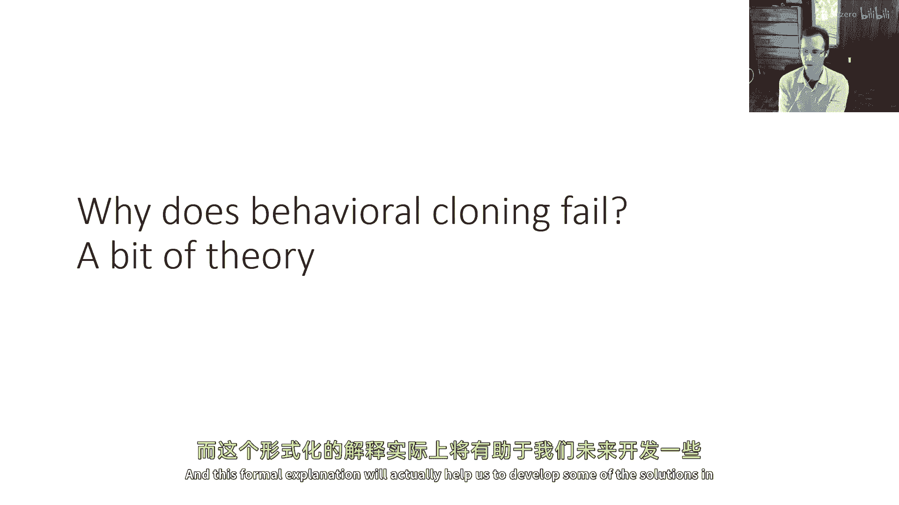
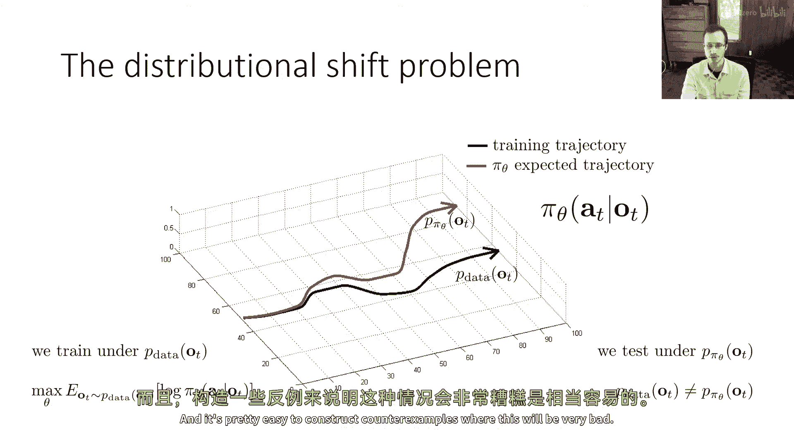
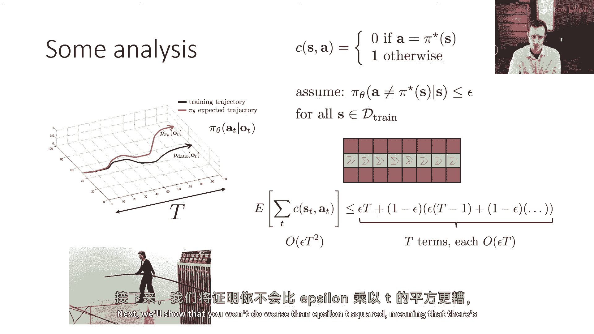
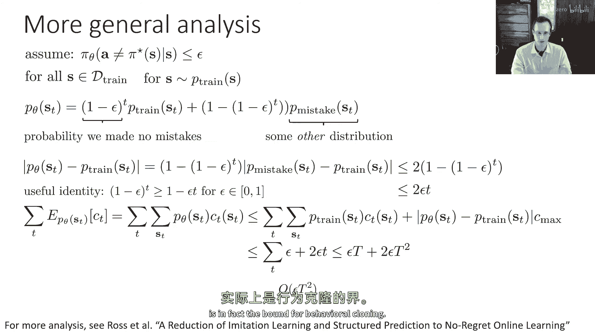
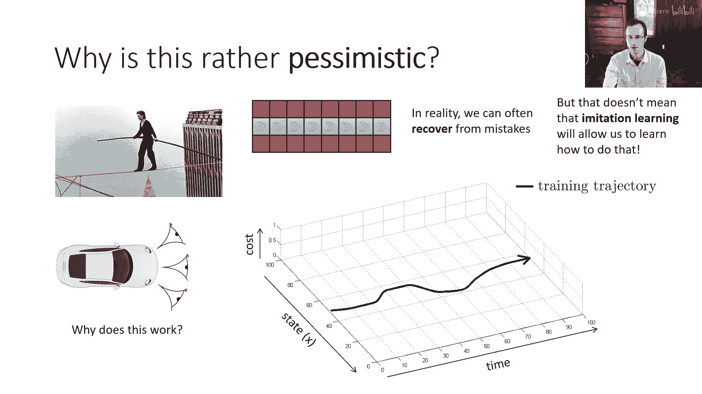
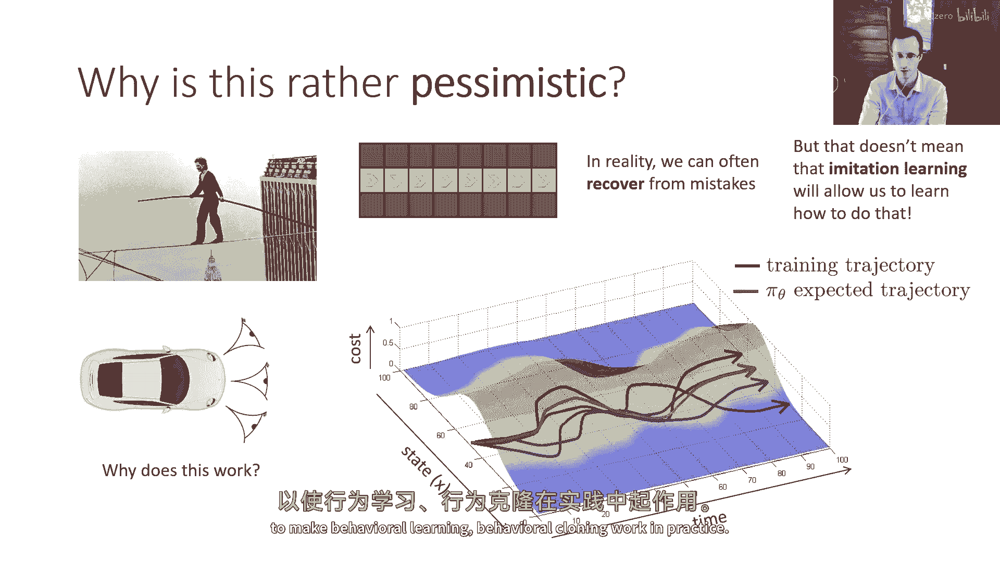
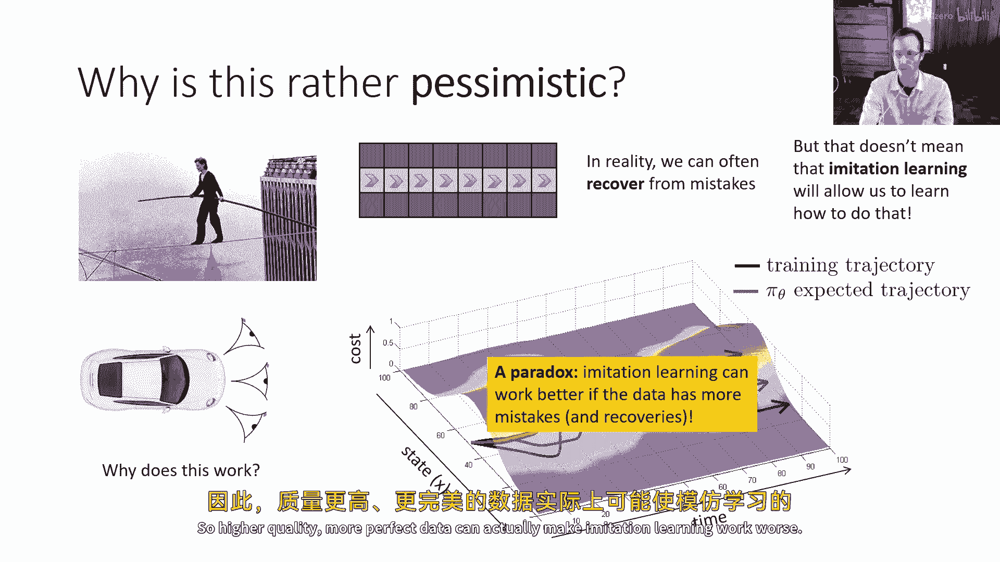
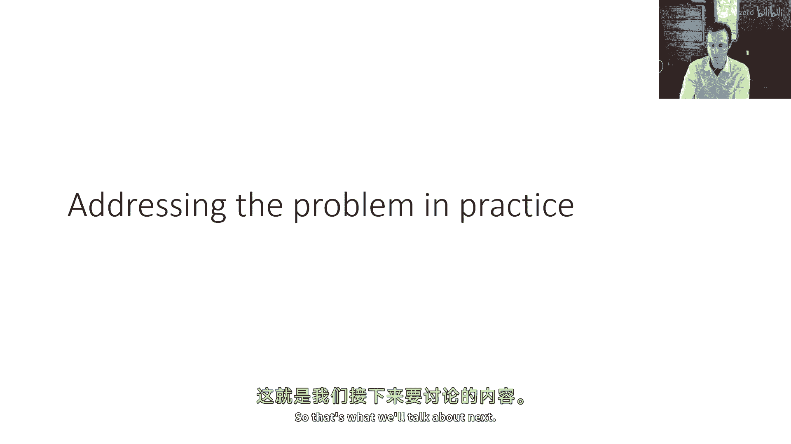

# 【深度强化学习 CS285 2023】伯克利—中英字幕 - P5：p5 CS 285： Lecture 2, Imitation Learning. Part 2 - 加加zero - BV1NjH4eYEyZ

这堂讲座的第二部分可能会是最具数学挑战性的，因为我们要讨论一些正式解释背后的原因，为什么行为克隆通常不会产生好的结果，这个正式解释实际上将帮助我们在未来开发一些解决方案。

好的，所以让我们回到这个直观的图像，嗯，我曾经用这个图像来论证为什么行为克隆做得不好，是因为即使你学习了一个非常好的策略，如果这个策略犯了一个小错误，它会把你置于一个与训练时遇到的情况略有不同的情况。

与它被训练过的情况不同，在那里它更可能犯一个大错误，这将进一步将其置于一个甚至更不熟悉的情况，从那里错误可能会累积起来，所以为了试图使这更精确，让我们开始引入一些符号，我们有一个策略πθat给定ot。

嗯，并且该策略使用来自特定分布的训练集进行训练，并且这种分布是由一个人产生的，嗯，提供像人驾驶汽车一样的演示，例如，所以我将使用p data ot来表示产生训练集的分布，现在。

p data ot可能是一个非常复杂的分布，我们真的不太关心那个，我们只在这个阶段关心，是它是从人类驾驶汽车产生的任何观察分布，然后，我将使用不同的象征来表示政策本身在观察值上的分布。

看到它正在驾驶汽车，这将用p pi theta ot和当然来表示，因为政策并不像人一样驾驶，p pi theta ot并不等于p theta ot，所以如果我们想要理解这些东西有多不同，嗯。

让我们首先讨论如何训练pi theta得很好，pi theta在p theta ot下被训练，这意味着我们可以，如果我们在使用一些标准的训练目标，如监督学习，嗯，最大似然或经验风险最小化。

基本上我们可以将目标写为以下形式，它正在最大化人类行动的对数概率，给定观察和观察是从p数据ot采样的，所以，在p数据ot下的平均值，现在我们从监督学习理论知道，如果我们以这种方式训练我们的策略。

并且我们不过拟合也不欠拟合，那么我们预期在分布p数据ot下的行动对数概率将很高，我们预期好的行动具有高的概率，当然，问题是政策的性能，它不是由分配给好行动的对数概率决定的，在专家的观察分布下。

但在测试分布下，这是p pi theta，所以，p pi theta下好行动的对数概率可能非常不同，因为p theta和p pi theta不是相同的，这通常被称为分布漂移，嗯。

这意味着政策被测试的分布，已经从它被训练的分布中偏移，现在正好是由于政策的错误导致的这种偏移，但这是正式的u陈述，因为我们不，我们通常可以预期它会是正确的。

在这些反例中，这将非常糟糕，所以在我构造那个反例之前，让我来设置，稍微更精确地设置一些事情，嗯，这将使房子更加简洁，所以首先我们必须定义我们确切想要什么，比如决定我们的政策是好是坏是由什么决定的。

所以它被训练以最大化训练行动的可能性，但显然这不就是我们想要所有的，我们想要一些其他的概念，好，就像它实际上需要驾驶汽车一样，而，那么，什么是一个好的或坏的学习政策，嗯，这是我们做出的选择。

这是一个设计选择，嗯，它可能不应该是训练动作的可能性，因为政策可以分配非常高的概率给人类驾驶员所采取的行动，他们实际上看到的状态种类，但是，然后在稍微不同的状态中采取完全错误的行动，因此。

我们可能需要一种更好的善度量，我们可以用它来分析我们的政策，一种我们可以使用的度量是定义一个成本，成本是状态和行动的函数，我们将说成本为零，如果行动与人类驾驶员的行动相同。

所以让我们假设人类驾驶员有一个确定的政策，扩展到随机政策并不难，但这会使许多符号变得极其复杂，所以我们将说人类驾驶员有一个确定的政策，π星，如果行动与他们将做的行动相匹配，那么成本为零，否则为1。

这是一个非常方便的成本定义方式，因为你可以说，每当你学习的政策犯错误时，你将支付1的成本，所以总成本基本上就是你要犯的错误的数量，请注意，我开始混淆了s和o，不要害怕那个。

所以这里的所有分析都将以s为基础，将这个扩展到部分观察的设置需要一些复杂的工作，因此，这是那些马克夫性质非常有用的情况下之一，是可能的，这将使编写一切变得更加复杂，因此。

我们将在这一部分透明地从s切换到o，我们不必担心它，我警告过你会这样做，好的，所以现在我们的目标是最小化预期的成本，这意味着我们的政策可能会犯的错误的预期数量，"但预期在何种分布下"，"很好"。

我们关心的是政策所犯的错误数量，"当它实际上驾驶汽车时"，我们真的不在意它会犯多少错误，当它看人类的图像时，"因为那不是它被使用的方式"，所以我们关心的是在参数p pi theta下，预期的成本。

"在州分布的情况下"，"这项政策实际上将看到"，那就是一个非常，非常重要的区别，因为我们正训练政策以将高概率分配给p数据下的动作，但我们真正关心的是在p下最小化错误数量，派西塔，好的。

所以这就是一个非常重要的区别，所以在分析行为克隆的好坏时，我们真正试图做的是我们说，如果我们成功地完成了我们的监督学习，对于这个在p pi theta下的成本期望值，我们可以说什么。

所以当我们运行策略时，我们会成功最小化错误数量吗。

是或否，好的，所以让我们稍微处理一下这个问题，这就是我们的图片，我们的总时间长度是资本t，所以这些轨迹的长度是多少，这是我们的成本，我们将做一些假设，这基本上相当于说，让我们假设监督学习有效，所以。

我们的假设是，嗯，我们将从简单的开始，我们将说，任何动作的概率，嗯，被分配给非专家动作的，小于或等于epsilon，如果状态S，是训练状态之一，所以这基本上就是说在训练状态下，你犯错误的概率很小。

它将是一个微小的数字epsilon，嗯，一般来说，我们可以扩展这个来说，对于从训练分布中采样的任何状态，概率都很小，所以它不一定必须是你看到过的状态，但现在为了简单起见，让我们说它就是你看到过的状态。

现在让我们构建一个非常简单的问题，其中，基于这个假设，如果你假设你犯错误的概率是epsilon，对于任何你看到过的状态，且是无限的，对于你没有看到的状态，情况将会非常糟糕，我将称这个为例子为走钢丝的人。

所以想象你有一个问题，在每个状态中都有一个非常特定的好动作，那就是保持在钢丝上，如果你做出了错误的动作，如果你犯错误，那么你就会从钢丝绳上掉下来，现在从钢丝绳上掉下来并不一定是坏事。

从你伤害自己的角度来看，假设有安全网或者类似的东西，那是坏事，因为你会发现自己处于专家从未见过的状态，所以专家在写作时附有示范，专家从未从钢丝绳上掉下来，掉下来的坏处是你在一个陌生的地方。

所以把它想象成一个离散的环境，嗯，在一个网格上，所以灰色方块代表在钢丝上的方块，红色的是您从演示中掉下来的地方，总是稳步向右走，所以行动总是向右走，如果您犯了一个错误，如果您向上或向下走。

那么您就会从钢丝上掉下来，您对此非常关心，不是因为您会受伤，但是，由于你不会知道在那种情况下应该怎么做，所以，你在轨迹上平均会犯多少错误，如果你的犯错误概率是，嗯。

在每个紧绳状态上都小于或等于epsilon，所以我们想做的是，我们想要写下总成本的一个界限，所以，在第一步，你犯错误的概率是epsilon，如果你犯错误，你会从紧绳上掉下来，剩余的所有时间步都是错误的。

一般来说，因为你不知道在第一个时间步应该怎么做，你平均至少会犯epsilon乘以资本t的错误，现在，以概率一减去epsilon，你没有犯错误，所以，然后你移动到第二个正方形的第二个时间步。

在第二个正方形中，你又有epsilon的概率犯错误，在这种情况下，你会从绳索上掉下来，并剩下t减去一的时间步，在绳索上挣扎并犯资本t减去一的错误，因为那里有剩余的时间步数，然后。

以一减去epsilon的概率，你继续到第三步，等等，所以你有这个系列，你将所有这些项相加，有capital t项，并且每个capital t项都是order of epsilon t的。

因为如果你假设epsilon是一个较小的数字，一减去epsilon是微不足道的，所以所有这些项的order，一减去epsilon接近于一个微不足道的数字，所以这些术语的顺序大约是epsilon乘以大T。

在这些术语中，大T的存在，这意味着错误数量大约是epsilon，大T的平方，就像epsilon乘以大T的平方除以二，加上对一减去epsilon的修正项，但这基本上是对于小epsilon值的那个顺序。

现在，这告诉我们关于行为克隆什么，它告诉我们实际上非常糟糕，因为如果你走一个非常长的细线，"这个二次的增长"，"错误数量真的会让你陷入麻烦"，我们真正想要的是错误数量的线性增加，所以。

长时间下去是合理的，"你积累的错误越多"，"但是如果速率超过线性"，"然后，遥远的视野正在把我们带入许多麻烦。"，"好的"，所以我们得到epsilon的平方t的平方，"现在，这是一个反例"。

这表明在最坏的情况下，你将获得epsilon t的平方，实际上，在大多数情况下，epsilon capital t的平方实际上是界限，所以你不会做得比epsilon t的平方更差，嗯。

这并不是理解行为克隆不好的必要条件，但我们实际上可以确定它有多坏，这只是一个不是很好的界限，我们实际上将要推导出这一点，因为为了那个，我们将使用的分析类型，嗯，可以在强化学习的许多其他主题中都非常有用。

所以我喜欢去通过它，只是为了给这些动态系统如何被分析的感觉，好的，我们已经证明了在最坏的情况下，你将获得epsilon t的平方，接下来，我们将证明你不会做得比epsilon t的平方更差。

这意味着在通常情况下，有epsilon t的平方的界限，在这里，我们将进行更一般的分析，所以，而不是说所有的状态都实际上来自你的训练集，我们将说我们的状态是从p_train采样的。

对于从p_train采样的任何状态，你的错误小于或等于epsilon，实际上，只要假设错误的预期值小于或等于epsilon就足够了，或等于epsilon，这更现实，当然。

因为通常你训练是为了预期的损失值，并且与dag有关，与dagger我们将在后面讨论，它是本讲座的结束算法，它将使这个问题消失，因为它将使p_train和p_pi_theta相同，但现在它们不同。

这将是一个问题，我们将证明预期的错误次数在最坏的情况下是epsilon t的平方，然后，当然，当它们相等时，使用dagger，将是epsilon t，嗯，所以，dagger的部分，别担心，暂时。

在最坏的情况下，预期的错误次数将是epsilon t的平方，当然，当它们相等时，使用dagger，将是epsilon t，嗯，所以，那将是dagger的部分，不要害怕它，暂时，那将在讲座的结尾出现，嗯。

但如果p_train不等于p_theta，嗯，那么会发生什么，如果我们想要找出成本的预期值，可以做什么，如果我们想要找出成本的预期值，可以做什么，我们可以将时间步t上的州分布描述为两个术语的和。

并且其中一个术语将很容易分析，而另一个术语将非常复杂，所以我们只会使用对该术语的界限，所以可以说在时间步t上，有一些概率你完全没有犯错误，这意味着有一些概率你仍然在钢丝上，你做了一切正确。

如果每一步犯错误的概率是epsilon，并且你开始时处于分布的状态，这意味着你开始时是从p_train样本中抽取的状态，那么在t个时间步中你没有犯错误的概率，就是1减去epsilon的t次方的小t。

所以我们可以说p_theta s t等于1减去epsilon的t次方，乘以p_train st，因为那是你没有犯错误的概率，如果你没有犯错误，那么你仍然处于p_train分布。

加上1减去那个1减去1减去epsilon的t次方乘以另一个分布，所以它只是在说，你的分布中有一部分，对于所有可能性，你没有做任何事情错误，然后其他所有部分和做任何事情错误的权重。

是1减去epsilon的t，那里的分布是p_train，好的，所以现在你可以做出这种分解，p_mistake是非常复杂的，对吧，所以嗯，我们实际上不理解p_mistake是什么。

它是p_theta与p_train分离的部分，所以我们不会对p_mistake做出任何假设，除了那个，它只构成你分布的1减去1减去epsilon的t部分，当然，如果epsilon非常，非常小。

那么和则由第一个术语主导，如果epsilon非常小，那么1减去epsilon几乎等于1，所以大部分都在p_train中，但当然，t越大，那个指数就越伤人，好的，这就是我们有的，现在我要做的。

是我将分布p_theta s st与分布p_crane st联系起来，现在当我看到绝对值符号时，嗯，我通常指的是，总变分距离，嗯，总变分距离只是所有状态的和，嗯，绝对值之差。

它可以被视为一个非常简单的分布差异概念，分布，但现在我们只做在一个状态，所以给定任何状态，绝对值p theta s t减去p train st，嗯，这很容易计算。

如果你只是替换上述方程中的p theta st，你会看到有一个p train项会取消，所以你得到一个1减去epsilon到t的p train减去p train um。

所以您可以将其取出为1减去1减去epsilon到t，现在您最终得到以下等式，您得到1减去1减去epsilon到t乘以，绝对值p mistake减去p train，嗯，好的，现在这还是一种神秘的等式。

我们不知道它的值，但我们知道所有可能性都必须在0和1之间，所以最大的，嗯，两个概率之间的差异，嗯可以，嗯，最多是1对吧，因为嗯，最坏的情况是p mistake是1和p train是0，或反过来。

并且最大的总变异偏离者，意味着如果您对所有状态进行求和，嗯，并尝试评估他们之间的绝对值差异，它将是2，因为最坏的情况是在一个状态中一个概率是1，另一个是0，然后在另一个状态中它是反过来的，一个是0。

另一个是1，所以最可能的，嗯，两个分布之间的差异，当您对所有状态进行求和时是2，这意味着整个东西都被2乘以，1减去1减去epsilon到t，所以我们已经证明了。

p theta st和p train st之间的总变异偏离是2乘以，1减去1减去epsilon到t，这些指数有点难处理，但对于epsilon在0和1之间的值，有一个非常方便的身份。

即1减去epsilon到t大于，等于或等于一减去epsilon乘以t um，所以那是真的，对于任何介于零和一之间的epsilon，它就是一个代数恒等式，所以如果我们将那个代入上面的不等式，嗯。

我们可以进一步将这个限制为两个epsilon t，那就是一个代数的便利，所以我们可以消除这些指数，它给我们提供了一个稍微宽松的限制，但它更容易思考，所以，我们现在展示的是，θ参数下的p值总变异性距离。

"SP火车的起始站由两个 epsilon t 的距离所边界"，"并且记住"，"总变异距离就是所有所有s的和"，"他们概率差的绝对值"，"好的"，"那么现在让我们谈谈我们真正关心的数量"，"什么是"，嗯。

"我们可以得到什么样的约束"，"基于这个，我们对所有时间步长的期望成本进行求和"，"很好"，"嗯"，"弄清这一点将替换等式中的期望值"，"所以，期望值就是所有可能状态的概率之和乘以该状态的值。"。

"它的成本"，"而且我要做的就是我要替换嗯"，"θp与θp减去火车p加上火车p"，所以我可以减去p列车，在两种情况下，我都可以添加p train，这样做完全没问题，然后。

我会在p theta减去p train的部分周围加上绝对值符号，因为如果你有一些量，你取其绝对值，你只能使它更大，因为如果它是正的，它保持不变，如果它是负的，它变成更大的值，这就给我们带来了这个边界。

所以在这个边界内，我做的事情是，是，我替换了t上的绝对值p theta的和，S t减去p train st乘以c t与总变分距离乘以c max，在任何状态下，成本的最大值。

所以我有一个部分是p train乘以成本，然后我有另一个部分是总变分距离乘以，在任何状态下的最大成本，所以，只是为了重复如何产生这个步骤，首先。

你替换p theta st为p theta d加上p train减去b train，加上p train的项变为该约束的第一个项，然后，我被留下p theta减去p train，我可以取这个的绝对值。

我可以对所有状态进行求和，这就给了我总变分距离，为了考虑到在每个状态我都有不同的成本，我只会替换那个成本为最大成本，我可以将这个最大成本取出求和，这就给了我一个有效的上界，现在。

我将使用我对总变分分布的界限，对于p_theta和p_train之间的差异，那就是2εt，当然，我知道我在p_train上的成本，我的预期成本是ε，因为这是我初始的假设，所以第一个术语成为第一个术语。

对s和t的p_train求和，乘以c是ε，第二个术语是2εt，在任何时间步长t，最大成本c_max和c_max的乘积是1，当然，这是一个可能的情况，因此，在任何状态下，我最大可以获得的成本是1。

因为我可以在任何状态下犯一个接近的最小错误，所以，这是我的界限，现在请注意，这是对t的求和，所以我有t项，每一项都是εt的量级，这意味着这将有一个线性项和一个二次项，这意味着总体的阶次是εt的平方。

所以我实际上证明了什么，我在前面的幻灯片中已经展示了，在最坏的情况下你将得到epsilon t的平方，这就是步行者的例子类型，我还展示了epsilon t的平方实际上是一个界限。

这意味着你将不会做得比epsilon t的平方更差，所以这就是行为克隆的结果，行为克隆在最坏的情况下是epsilon t的平方，而且epsilon t的平方实际上是行为克隆的界限。

好的，所以这就是分析和它很好，理解这个分析，我们在课堂上会详细讨论这个问题，但是，我想对这个问题说的一点是，这个分析相当悲观，当然，我们从之前的驾驶视频中看到，在实际应用中，行为克隆是可以工作的，那么。

为什么这个分析相当悲观呢，悲观可以从步行者的例子中看到，步行者的例子有点病理性，在意义上，尽管它是一个有效的决策问题，但是，即使是一个微小的错误也会立即把你置于不可恢复的情况，实际上，这是非常糟糕的。

所以实际上我们 often 可以从错误中恢复，嗯，并且，但是问题在于，所以使让naive行为克隆工作的许多方法，基本上试图利用你可以从错误中恢复的事实，并且 somehow 修改问题。

以使模仿和学习更容易学习如何做这一点，所以，为什么，例如，那个嗯，左右摄像头技巧工作得好吗，也许左右摄像头技巧真的在教政策如何从错误中恢复，通过显示它看到左图时的情况，以及它应该在那里做什么。

并告诉它看到右图时应该做什么，它告诉它不仅你可以从错误中恢复，但这是适合做那事的动作。

总的来说，你可以想象如果这些累积的错误越来越多，如果你不是以相对狭窄的轨迹进行训练，而是以非常优化的轨迹进行训练，如果你不是以许多轨迹，而是以我会犯错误的轨迹进行训练，我会犯一些错误。

然后从那些错误中恢复过来，这样，训练分布就会稍微宽一些，这样，无论你犯多大的错误，你都还在分布中，那么你的策略可能实际上会学习如何纠正这些错误，仍然能做得很好，而且，这就是人们常常使用的一种想法。

有些近似地用于使行为学习，行为克隆的工作实践。

嗯，所以，这里的悖论是，模仿学习实际上效果更好，如果数据有更多的错误，因此有更多的恢复，所以质量更高，更完美的数据实际上可以使模仿学习更复杂。

