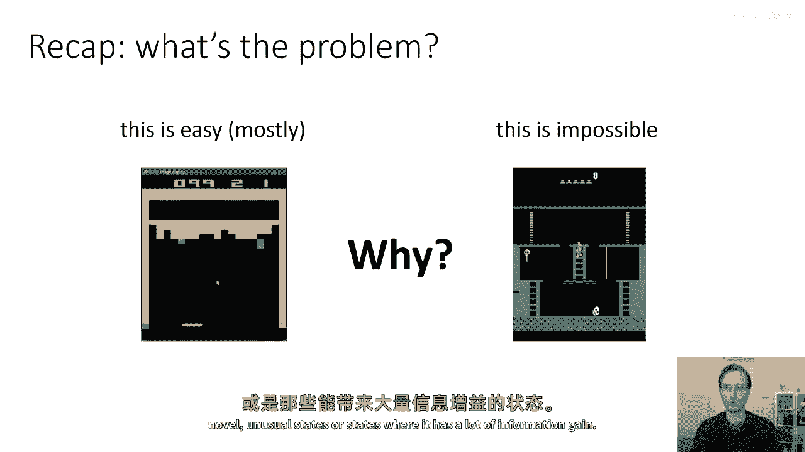
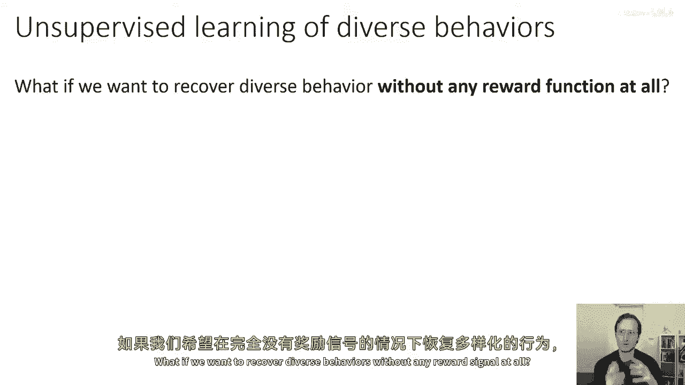
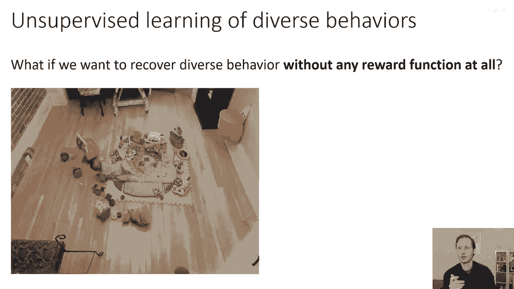
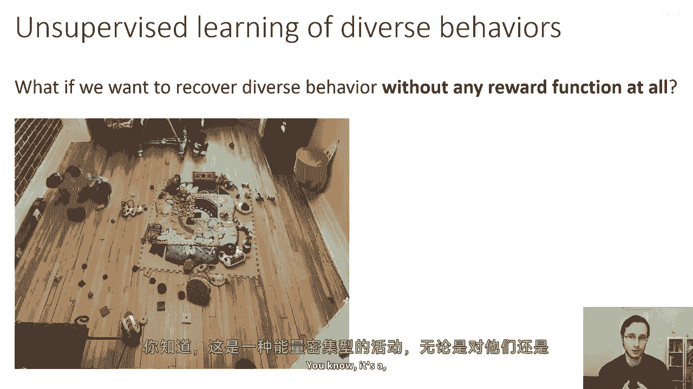
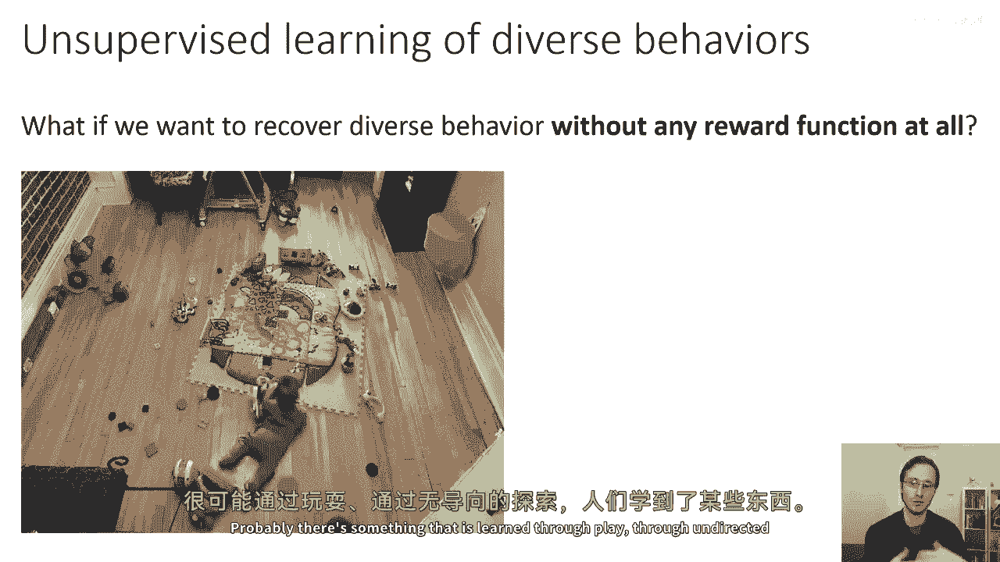
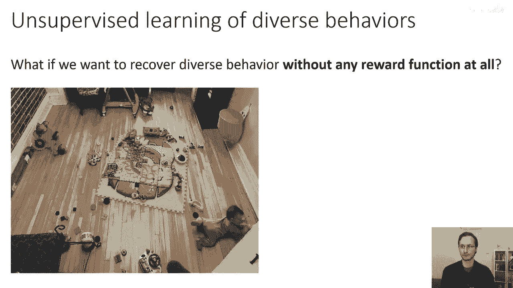
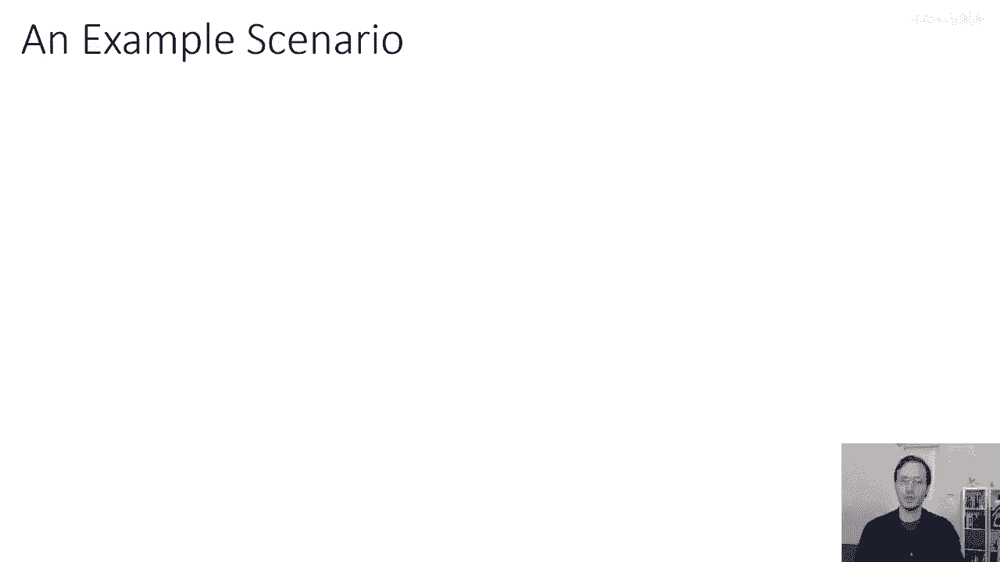
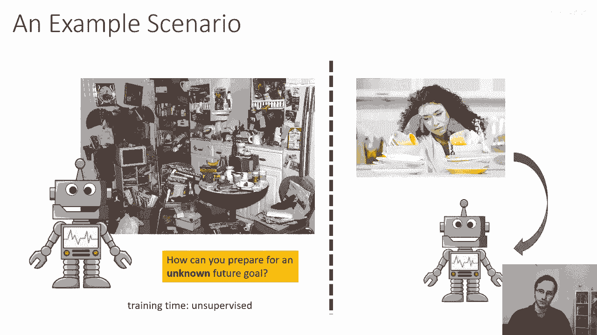
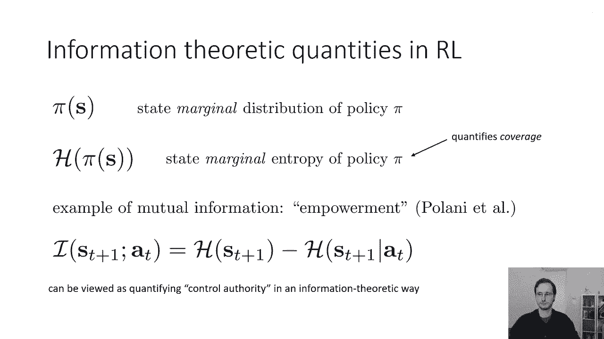

# 【深度强化学习 CS285 2023】伯克利—中英字幕 - P60：p60 CS 285： Lecture 14, Part 1 - 加加zero - BV1NjH4eYEyZ

好的，所以，周一，我们将有一个关于探索核心主题的较长讲座，在今天的讲座中，我们将做一些不同的事情，实际上，我将讨论一个关于探索的不同视角，这与周一的视角相当不同，也有点不寻常。

这不是大多数人关于探索问题的思考方式，但我认为它提供了一个不同的观点，可能会让我们思考探索的真正含义，所以，这个讲座更多地是关于最新的研究焦点的讲座，嗯，部分是为了让你思考最终的项目主题。

部分是为了让你思考我们如何以不同的方式考虑探索问题，从它通常被考虑的方式，而且这堂课可能会稍微短一些，稍微，嗯，更快地通过，好的，所以嗯，什么，回顾一下周一的内容，探索问题主要涉及到，嗯。

探索问题可以用这两个动画来概括，所以，在第三份作业中，你使用了Q学习算法来学习各种雅达利游戏，并且，其中一些可能工作得很好，但是，有些游戏很容易学习。

而另一些似乎无法学习，我们在周一将学习这是为什么，部分原因是因为这些游戏有高度延迟的奖励，所以，中介奖励信号并不像你应该做的事情那样真正相关，这就是周一的讲座所讲的内容，我们通常认为探索是这个问题。

在那里，你需要权衡探索，开发，并找出一种方式激励你的rl代理访问新的，不寻常的状态或信息收益很大的状态。

但是，我们可以以不同的方式思考探索问题，如果我们不仅仅考虑延迟奖励或稀疏奖励，但我们考虑一个奖励完全缺失的设置，如果我们想要恢复没有任何奖励信号的多样行为怎么办。

所以嗯，你可以从一种更人工智能的角度想象，或者嗯，从科学的角度来看，你可以说，人类儿童，例如，似乎能够，你知道，在环境中花费大量的时间玩耍，他们显然不是在随机行动，他们显然从这种行动中得到了一些东西。

你知道这是一种能耗密集的活动。

对他们和他们的父母来说都是如此，所以人们做这件事一定有原因，可能存在一些是通过学习获得的东西，通过无定向的探索进行玩耍。

这不仅仅是随机的，有一些关于目标被设定的概念，一些关于目标完成的概念，和一些显然非常有用的知识体，那就是通过这种活动从大脑中提取的。

所以为什么我们可能想要没有任何奖励函数的学习呢，也许我们可以在没有明确奖励监督的情况下获得各种不同的技能，创建这些技能的目录，然后使用它们来完成新的目标，当我们被赋予这些目标时。

也许我们可以使用一些我们可以使用的子技能，可能使用层次强化学习方案，也许我们可以探索可能的行为空间，以构建大型数据集，一个可以随后用于获取其他任务的大缓冲区，所以，这是一种完全不同的思考探索的方式。

通常，探索被看作是这个问题，其中，你只需要寻找在这里有奖励的状态，我们正在考虑相反，作为后来可以重新利用的技能获取问题，如果你想要一种更实际的例子。

你可以想象你的家中有一个机器人，然后你买了那个机器人，"你把它放在你的厨房里"，"然后您打开它"，"并且机器人的任务是在这个环境中找出它能做什么"，"这可能会有所帮助"，"这样当你晚上回家时"。

"你说"，"很好"，"现在我需要你帮我洗碗"，"无论机器人是什么"，"在这个无监督阶段进行实践"，它可以被重新利用得非常，非常高效地找出如何清洁你的盘子。

所以如果你能准备为一个未知的未来目标，那么当这个目标被赋予给你，你可以相当快地完成它，好的，所以在今天的讲座中，我们将覆盖一些可能会帮助我们开始思考这个问题的概念，这个问题这是一个大的开放研究领域。

没有固定的已知和完美的解决方案，但是，我可能会讨论的一些概念，可能会帮助你开始思考如何将正式的数学工具和强化学习算法应用到，这种问题上，所以我们首先会讨论一些来自信息论的定义和概念。

其中许多人可能已经熟悉，但是，对于这些概念的复习对于每个人都很重要，以便大家处于同一页面上，当我们谈论更复杂的算法时，嗯，你知道，接下来出现的算法，然后，我们将讨论如何无需奖励函数来学习。

以找出达到目标的策略，所以我们会有一个提出目标的算法，尝试达到它们，并在这个过程中获得更深入的世界理解，然后，我们将讨论状态分布，强化学习的匹配形式，在那里我们可以匹配所需的状态分布。

并在过程中进行无监督探索，我们将讨论有效状态的覆盖，基本宽度的新颖性是否是一个良好的探索目标本身，以及为什么可能，然后，我们将讨论我们如何超越仅仅覆盖状态，并实际上覆盖技能空间。

以及这些之间的区别是什么，但是，让我们从信息论的一些定义和概念开始，在我们深入探讨今天的讲座主要技术部分之前，所以，首先一些有用的身份，正如你们可能都知道，我们可以使用p(x)来表示分布，当然。

我们在今天的讲座中会见到很多，我们已经见过很多，你可以把p(x)看作是你拟合到一组点的东西，你可能在连续空间中得到密度，或者在离散空间中得到分布，H[p(x)]表示熵，我们已经见过这个。

熵定义为期望值对x对数概率的负值，直观上，熵度量分布的宽度，如果你有一个离散变量x，那么均匀分布具有最大的熵，而集中在一个特定值并其他地方为零的分布具有最小的熵，直观上，熵就像是这个分布的宽度，所以。

那些，嗯，我希望你们已经对这些都熟悉，我现在要讨论一个可能不是人人都熟悉的概念，但在今天的讲座中会出现很多次是互信息，x和y之间的互信息，我们以分号表示，如此，因为我们也可以有变量组之间的相互信息。

所以你可以拥有x与z和y之间的相互信息，在这种情况下，你将写x，z；y的i，这被定义为KL散度，并记住，KL散度是衡量两个分布差异的度量，它被定义为KL散度。

之间的x和y的联合分布与它们的边际产品的乘积，所以直观上，如果x和y彼此独立，那么他们的联合就只会是他们的边际产品的乘积，并且KL散度将会为零，随着x和y之间的依赖性越来越强。

他们的联合分布将与他们的边际分布的乘积越来越不同，在这种情况下，你会看到KL散度上升，现在我们可以写互信息为预期的，你知道，仅仅使用KL散度的定义作为在联合分布下预期的值，对于x和y的log比值。

即在联合分布和边际分布的乘积上，直觉上你可以这样想，如果这些绿色点代表我们分布的样本在这里，看着这张图片，你注意到这里有一个明显的趋势，y值明显依赖于x值，它们不完全由x值决定，但在关系中肯定有趋势。

在这里，y值似乎似乎不依赖于x值，所以在顶部的图片中，你有高互信息，本质上，如果我告诉你x，你可以做得相当好地猜测y，在底部，你有低的相互信息，如果我告诉你x，你猜y的能力不会提高。

比我没有告诉你它时还要差，现在，相互信息的一个重要方面是，它可以也被写成两个熵的差，所以你可以写相互信息为y的熵，减去给定x的y熵，这仅仅从一点代数跟随，所以你基本上可以从顶部的定义开始。

稍微调整一下那个方程，最后你会得到底部的方程，但这种表示互信息的方式也有一种非常吸引人的直观解释，你可以把互信息看作是从观察x中获得y熵减少的程度，这就是你从观察x中获得的信息增益。

这基本上就像我们在周一的前一节课中看到的信息增益计算，所以互信息告诉你x对y有多信息，因为它是对称的，它也告诉你y对x有多信息，好的，所以嗯，让我们嗯，将这融入到rl中一点，所以在我们的讨论中。

将有用的信息论量，在今天的讲座中，将是以下内容，我将使用pi of s来表示政策pi在先前讲座中的状态边缘分布，我也有时称为p theta of s，当我写h of pi of s时，意思是相同的。

这指的是政策pi的状态边缘熵，现在，这是一种有趣的量，因为它量化了我们的政策覆盖范围，如果你有一个非常随机的政策，访问所有可能的状态，你预期π的h(s)将很大。

这里是互信息如何在强化学习中出现的一个例子，我不会深入探讨这一点，但它是一个相当直观的概念，值得提起，所以，在强化学习中定义了一个非常经典的量，以互信息为基础的叫做能力，所以，很多都来自丹尼尔。

洛尼和同事们的工作，能力被定义为下一个状态和当前动作之间的相互信息，能力也有多种变体，也被定义为，下一个状态和当前动作之间的相互信息，给定当前状态以及其他变体，但让我们考虑简单的版本。

下一个状态和当前动作之间的相互信息，如果我们将其代入我们之前在幻灯片上的熵方程，我们知道我们也可以将其写为下一个状态的熵，减去下一个状态的条件熵，给定当前动作，这个被称为什么，花一点时间来考虑你知道的。

在英语中，' empowerment' 意味着你有多少权力，你有多能干，实现你希望的最终目标，这个方程式告诉我们关于' empowerment' 什么，花一点时间来思考它，可能在评论部分写一条评论。

所以我们可以这样思考这个方程式，它是说嗯，你希望下一个状态的熵很大，这意思是你想要有许多可能的下一个状态，但你希望熵很小，基于你当前的行动，所以这意味着嗯，如果你知道你采取了什么行动。

预测你落在哪个状态就容易，这意味着你对环境有很强的控制权，这意味着你有很强的能力确定地影响哪个状态，你将处于，另一方面，如果你不知道动作，你想要状态熵大，所以这意味着你有许多可用的行动。

不同的行动会导致非常不同的状态，如果你有这两件事，那么你应该得到的是一个代理，他们处于一个有许多可用行动的情况，所有这些都会领先到非常不同的状态，但我们将以可靠和可控的方式进行，所以如果你有一个房间。

也许你想站在那个房间的中间，因为从那里你可以确定地访问房间的所有部分，如果你只有这些东西中的一件，那么它们不能做这个工作，如果你只有关于下一个状态的熵，那现在并没有真正给你提供权力。

因为那里你想要将自己置于一个未来非常随机的情况中，也许这超出了你的控制，如果你只有下一个状态的负熵，给定当前的行动，这不量化，你想要有多个选项的概念，所以你可能会将自己置于一个非常确定的情况下。

也许你坐在井的底部，下一个状态极其可预测，无论你是否知道动作，这意味着给定当前动作的下一个状态也极其可预测，所以这将最小化第二个术语，但不会最大化第一个术语，但如果你有这两个术语，然后。

满足那个目标的唯一方法是将自己置于情况中，在你有许多可以导致许多不同未来状态的行动选项时，但你有很多控制选择行动后你将进入哪个状态的能力，这就是为什么这个量被称为赋权，而且我是为了要展示这个才想要讲的。

你知道我们今天的讲座不会详细讨论赋权，但我想要展示这个，只是为了让你大致了解如何用相互信息概念来量化，嗯，在强化学习中的有用概念，学习，所以。

