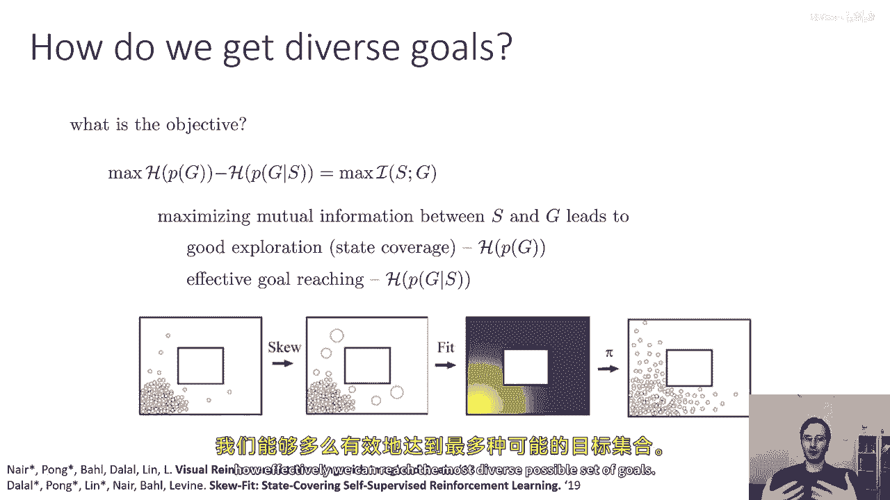
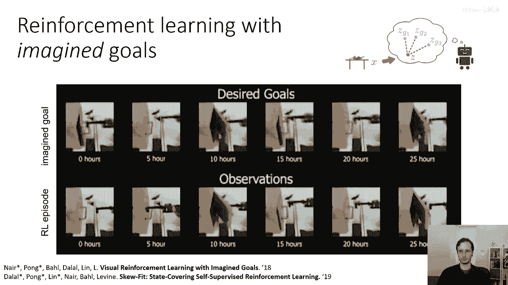

# 【深度强化学习 CS285 2023】伯克利—中英字幕 - P61：p61 CS 285： Lecture 14, Part 2 - 加加zero - BV1NjH4eYEyZ

好的，接下来，我将更深入地探讨的第一个算法，将解决这个问题，我们如何通过提出和达到目标来学习而无需奖励函数，正如我开始提到的，这门讲座主要是为了讨论一些前沿的研究主题。

也许可以提供一种不同的角度来思考探索，因此，我不会详细讨论算法，以至于可以实施它，但希望足够详细，让您能理解主要思想，但我会在底部提供参考文献，如果您想要获取所有细节，我鼓励您阅读这些论文，你知道。

把这看作是一种获取视角的方式，我们如何可以接近这个无监督探索问题，从数学上不如作为一个关于特定方法的具体教程，您实际上应该使用的方法，所以，我们再次面临的示例场景是这种情况，你有一个机器人。

你把它放在你的厨房里，它应该花一天时间练习各种技能，然后在晚上当你回家时，你会给它一个任务，也许你会要求它做家务，它应该利用它获得的经验来执行这个任务现在，嗯，在开始之前。

我们必须解决一个相对平凡的问题，以便我们可以开始，是我们如何实际，嗯，提出我们如何实际命令目标的方式，给机器人，一旦学习完成，所以，如果你想要一个现实的类比，也许你可以这样想。

也许你会向代理展示你想要它达到的情况，在rl parlance中，这相当于给它提供观察，或状态，构成任务的目标，所以你想要，你想要让代理学习一些东西，使它能够完成，你给它的任何目标。

并且目标将由一个状态指定，如果我们谈论图像，也许它是你想要达到的结果的图像，这并不是与自主代理最好交流的方式，但它允许我们明确地确定一些事情，问题将被赋予一个状态，代理应该达到那个状态，然后。

无监督学习阶段应该训练出一个策略，允许代理达到您想要命令的任何状态，然后，无监督学习阶段应该训练出一个策略，允许代理达到您想要命令的任何状态，一，现在，作为一个技术细节。

我们需要一种机制来比较不同的状态，如果那些状态非常复杂，比如图像，就像我们在周一探索讲座中看到的那样，我们需要对这些状态有一些相似性的概念，因为在一般情况下，在高维或连续的空间中，每个状态都将是唯一的。

一，这个问题有许多解决方法，但我们目前将采取的方法是，我们会说好吧，让我们只训练一种生成模型，我将使用的特定生成模型作为工作示例，叫做变分自编码器，我们将在下几周内讨论，但还有其他许多选择。

我们将假设这种生成模型有一些潜在的变量表示你的形象，所以如果你的图像是x，你也可以把它看作是一个状态s，然后，你的潜在变量模型将构建一些潜在变量对该状态的表示，我将其标记为z，所以。

z将是一种描述场景中发生了什么的紧凑向量，我们将假设那个向量是，你知道，至少有些良好的行为，意味着相似的，功能相似的状态将在那个潜在空间中靠近彼此，但是有许多方法可以得到这个效果，好的，嗯，然后，当然。

我们主要关心的是，我们希望我们的代理基本上有一个无监督的训练阶段，在我们甚至没有指定它应该完成的任何目标之前，它可以大致想象自己的目标，向自己提出这些目标，尝试达到它们，因此，获取一个目标。

在没有任何手动监督和没有奖励监督的情况下达到政策，所以直觉上，它要做的事情是，它将使用这个潜在空间，来提出可能尝试作为目标的z向量，尝试达到那些目标，并且，因此，改进其政策，好的。

那么让我们尝试勾勒出这样一个算法可能看起来的样子，我们将使用变分自编码器作为我们的生成模型，所以它有一个分布x给定z，这是当给定潜在代码时，图像的分布，你也可以把它想作是s给定z，所以我在这里使用x。

但是uh s意味着同样的事情，然后我们有我们的潜在变量分布p的c，当你训练一个变分自编码器时，几周后我们将学习到，您还需要一个推断网络，该网络将疾病映射回状态，所以如果您有一个像这样的生成模型。

您可能提出的一个目标之一是您可以直接从模型中采样它，所以您可以从潜在变量先验中采样潜在变量，所以从z的p中采样z_g，然后通过从d_theta中采样x_g来重建相应的图像，给定z_g的x_g。

这将给您一个想象的图像，再次，您不需要用这种类型的生成模型，可以设计一个能够提出目标的东西，然后，你可以使用政策尝试达到那个目标，所以，你的政策现在是一个条件政策，所以它将是我们行动的分布。

给定当前图像x和目标xg，当你使用此政策尝试达到目标时，政策可能成功，也可能失败，让我们假设它达到了某个状态，我们将那个状态称为x bar，理想情况下，我们希望x bar等于xg。

但是一般来说这可能不是，实际上，Xg甚至可能不是一个真实的图像，可能无法达到，所以你会得到一些其他图像，X杠，在编写那项政策的过程中，当然你会收集数据，你可以使用它来更新你的政策。

可能使用像Q学习算法这样的东西，就像你做的作业三那样，你也可以使用那个数据来更新你的生成模型，所以如果在试图达到那个目标的过程中，你看到了一些你没有见过的其他图像。

在将那个数据集成到更新你的生成模型之前，可能会给你一个更好的生成模型，能够提出更有趣的目标，然后你可以重复这个过程，所以这是一个基本的算法概述，它利用目标提议机制，一个无监督的目标提议机制。

和一个目标条件策略，这两个东西的相互作用使它产生目标，然后尝试与他们联系，好的，但是，这道食谱有一些小问题，因为生成模型正在被训练在你看到的数据上，所以它将生成看起来非常像你看到的数据的数据。

这意味着如果你的代理理解了如何做一件事，也许它理解了如何拿起一个杯子，现在，它有许多拿起那个杯子的数据，当它生成额外的关于其他目标的图像时，它将生成许多关于拿起同一个杯子的数据，可能不会关注其他事情。

这就是我们可以引入与讲座中讨论的概念的地方，周一，一些探索想法，让我们想象我们有这个两维导航场景，你想要做的是，你将要修改这个数据集，以一种方式偏移，以加重，很少见的状态。

非常类似于我们在周一讨论的新奇探索，如果你能做到这一点，如果你能在拟合生成模型之前升级很少见的状态，那么当你拟合生成模型时，它应该分配更高的概率给这个分布的尾部，以便当你提出新的目标时，它将稍微扩大。

扩大它，并访问边缘状态的更多地方，并希望扩大其可以到达的状态集，这就是我们想要使这种算法真正工作的直觉，那么，我们如何做得好，想法是，我们将修改步骤四。

而不是盲目地使用我们收集的所有数据来拟合我们的生成模型，我们将实际上，嗯，等待这些数据，所以，这就是这个步骤将 be 的，所以，我们通常用于拟合我们的生成模型的方法是最大似然估计。

找到能够最大化实际达到状态预期对数概率的生成模型，我标记这里为 x bar，相反，你可以想象有一个加权最大似然，嗯，学习过程，你训练你的生成模型，以赋予 x bar 看到的状态高概率。

但加权由 x bar 的权重函数 w 给出，直觉上，你想要这个权重函数权重，那些被看到很少的状态或图像，我们有什么可用的，可以告诉我们某件事被看到有多少，那么，我们正在使用生成模型来提出这些目标。

并且一个生成模型应该能够给我们一个密度分数，就像我们学习到的啊，计数和伪计数，所以我们可以做，我们可以分配一个权重，基于我们的当前模型p theta分配给状态x的概率密度。

所以我们会设置权重为p theta of x bar的某个幂次方alpha，其中alpha是一个负数，所以这实际上就是，嗯，一除以p theta of x bar的某个正幂次方。

或p theta of x bar的某个负幂次方，我们证明的一件事，我不会详细解释，这个证明的证明，但是，证明在这些论文中，有可能证明如果你使用负指数，那么p theta of x的熵会增加。

这意味着每次你围绕这个循环走，你会提出越来越宽的目标，如果你的熵总是增加，这意味着你最终会收敛到最大熵分布，这将是一个在所有可能有效状态上的均匀分布，现在。

在所有有效状态上的均匀分布并不等同于在所有x上的均匀分布，所以x可能代表完全随机的图像，只是静态的，可能实际上不是有效状态，所以你应该寻找在所有有效状态上的均匀分布，在所有有效图像上的均匀分布，好的。

现在，看看这个方程，嗯，你知道，你可能会注意到，这看起来非常像我们看到的，当我们有伪计数和基于计数的探索时，如果你记得基于计数的探索，我们的奖励有这种类型的形式，如one over n of s。

或一般形式的sqrt(one over n of s)，它们以n of s的某个负幂次方的形式出现，负一半，如果你有一个over sqrt或负一，如果你有一个over m，所以这看起来非常像那个。

通过将p theta of x bar提升到某个负幂次方，我们实际上在做一些非常类似于基于计数的探索的事情，除了不使用它作为奖励，我们使用它来训练我们的目标提议机制来提议多样化的目标，好的，所以嗯。

我们将要做的主要改变是，我们将使用此加权方案来拟合我们的生成模型，其中，权重是该状态之前的密度的某个负指数，现在我们可以问一个问题，这个整个程序的总体目标是什么，看起来我们制定了一个食谱。

但在机器学习中，我们喜欢将算法视为优化目标的过程，那么这个算法的目标是什么，我提到，目标分布的熵在每个围绕这个循环的步骤中都会增加，这意味着我们做的一件事是，我们正在最大化目标分布的熵。

这是一个好的事情，因为我们想要良好的覆盖范围，并且我们希望覆盖很多，许多不同的目标，所以目标变得更高，由于这种偏斜拟合程序导致的熵，你的策略在哪一部分做得好你的奖励函数。

你也可以把它写成给定s逗号g的pi，所以它是动作的概率，给定当前状态和给定目标，你的策略被训练以达到目标，G，这意味着随着政策的改善，最终的状态，我将其表示为s这里是越来越接近g。

这意味着给定你的最终状态，g的概率变得越来越确定，本质上如果你的政策很好，你可以提出这个问题，给定政策达到的最终状态s，目标是什么，它试图达到的目标G，如果政策很好，你可以简单地说好吧。

目标可能是实际达到的东西，因为它是个好政策，它将达到其目标，这意味着如果政策越好，预测g从s的难度就越小，这意味着给定s，g的条件熵p(g|s)更低，这意味着你也在最小化给定s的g条件熵。

现在当我们看看这个方程，我们应该注意到如果我们是max，在给定s的情况下，最大化g的h减去g的h，这意味着我们在最大化s和g之间的相互信息，并且最大化s和g之间的相互信息会导致良好的探索。

因为我们在目标的熵上最大化，所以，我们覆盖了所有可能的目标，并且有效地达到了目标，因为我们在状态给定目标时的熵最小化，所以，这也是一种方式，这个概念的相互信息如何导致一个优雅且非常简单的目标。

基本上量化了探索性能，在这种情况下，状态和目标之间的互信息量化了我们如何有效地达到最多样化的目标。

可能的目标集，好的，嗯，现在让我们看一段快速的机器人视频，嗯，这是我们几年前做的一篇实际研究论文，我们使用这样的目标做了什么，是把机器人放在门前，那就是那个钩形东西，那就是，嗯，机器人的抓取器。

但是我们没有告诉它需要开门，它只是应该找出土星和其他的，在顶部行你可以看到它建议给自己的目标，它生成的实际图像，在底部行你可以看到行为，在零小时它并没有做太多，它在门前摇晃，在十小时它开始触摸门把手。

偶尔能打开门，在二五小时后，它可靠地玩弄门并打开到不同的角度，当系统完全训练时，你可以给它一个不同角度的门开的图像。

