# 【深度强化学习 CS285 2023】伯克利—中英字幕 - P63：p63 CS 285： Lecture 14, Part 4 - 加加zero - BV1NjH4eYEyZ

好的，在今天讲座的最后一部分，我将讨论我们如何超越覆盖状态分布，并实际上学习多种技能，我的意思是什么，嗯，假设我们有一个给定s，z的政策π，其中z是任务索引，你知道，也许z是一个类别变量。

它可以取n个不同的值，"如果你想要那种对于不同技能有不同的政策的情况"，"实际上，这是这个案例的特例"，所以你可以想象你有n种不同的政策，它们代表了n种不同的技能，"也许洗碗就是其中之一"，"嗯。

而且"，"你可以通过说'好'来构造给定s，z的π。"，首先，看一下你的目标，然后确定你想要掌握的技能。"然后运行相应的策略"，"但是，一般来说，你可以将其写成一个条件分布"，"给定的s，z。

只需要记住"，这种你具有离散技能的情况，仅仅是这种情况的一个特殊案例，你可以想象，例如，在一个二维导航场景中，也许技能零向上移动，技能一向右移动等等等等，所以如果你有六种不同的技能。

你现在想要它们做六种不同的事情，达到多样化的目标并不等同于执行多样化的任务，因为不是所有的行为都可以被捕获为目标达到的行为，至少在原始的状态表示中不能，所以你可以想象，例如，天使达到了这个绿色圆圈，嗯。

这有点像这个绿色球，同时避免红色圆圈，现在没有条件于目标的策略可以做到这一点，条件于目标的策略可以去绿色球，但是，没有一种方法可以同时告诉它避免红色圆圈，所以。

所有可能技能的空间大于达到目标的所有技能空间，直觉是，不同的技能应该访问不同的状态空间区域，不仅仅是不同的个人状态，所以，这就是我们可以学习的方式，嗯，超越仅覆盖状态的技能。

我们可以有一种促进多样性的奖励函数，所以，我们可以，你知道，在任何RL问题中，我们定义我们的策略为arg max of，嗯，一些奖励函数，我们打算做的事情是，我们将奖励状态为给定z的州。

它们是其他z的州不太可能的，所以如果你正在运行策略为z等于零，你应该访问概率较低的州，对于z等于一和z等于二和等于三等，这将确保对于每个z你都做一些独特的事情，另一种表达方式是，如果你看政策访问的州。

你应该能够猜出它试图满足的z，一种方法是让奖励成为一个分类器，一个猜测你在哪个状态下做z的分类器，所以这个分类器预测z给定s的概率，并将奖励设置为log p of z给定s。

所以我们想要基本上使它容易猜出你在做什么技能，因此你应该做，你应该访问对其他技能概率较低的州，我们如何实例化它，我们可以将其视为这样，我们有我们通常的RL循环，我们有我们的策略在我们的环境中。

技能在开始时被赋予给策略，有一个判别器，这个分类器看状态，并试图预测当你达到这个状态时给你分配的技能，每次迭代，你都更新判别器以成为更好的判别器，你更新策略以更好地最大化log p of z给定s。

我们可以，嗯，想象这个算法将如何使用可视化，所以让我们假设我们只有兩個技能，綠色和藍色，最初它們是隨機的，它們做類似的事情，但僅僅通過隨機機會，它們訪問稍微不同的州，當我們然後在之間畫出一條決策邊界時。

可能我們的分類器會說，這是決策邊界，所有在這邊界左下方的州都是藍色，所有在這邊界右上方的州都是綠色，當我們然後更新策略與RL有這個分類器作為獎勵時，技能會移動一點，然後決策邊界會將他們分開得更加清晰。

然後他們會移動得更遠並解決，當然在實際中我們不是用兩個技能，而是用數十個技能，甚至可能是幾百個技能，所以然后他们将获得对空间的良好覆盖，而且他们实际上会做比仅仅达到单个状态更复杂的事情。

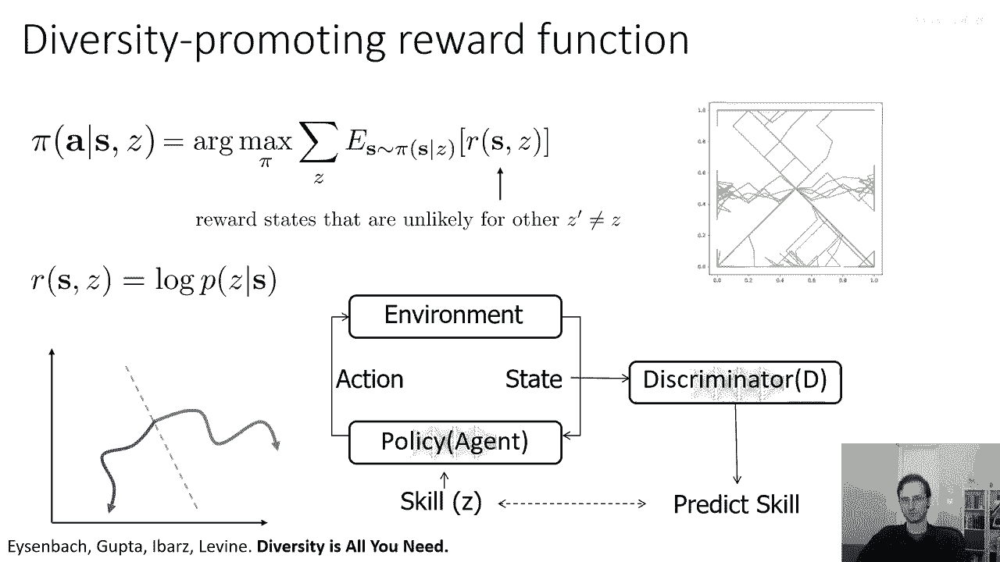

实际上，如果我们实际上在这个标准类型的基准环境中运行这个。

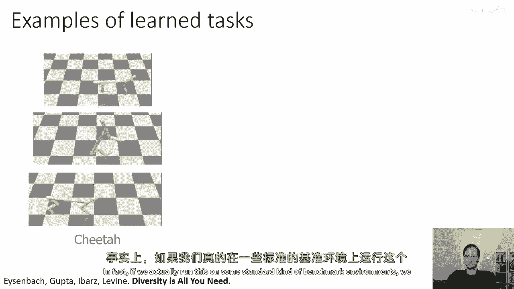

我们将得到非常有趣的行为，所以这就是当我们运行这个算法时发生的事情，在作业一中你们看到的小猎豹任务中。

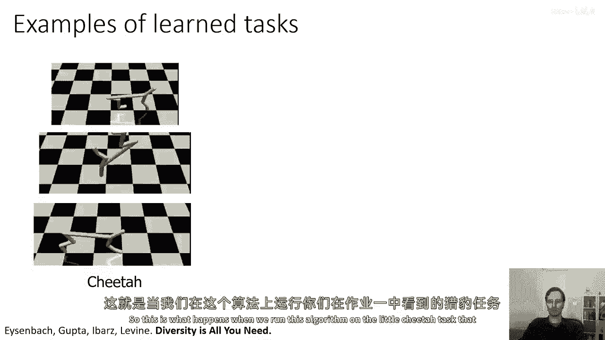

所以你可以看到一些技能涉及到向前跑。

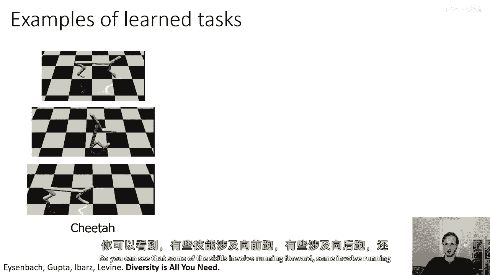

一些涉及到向后跑，还有一些涉及到做酷的翻转，当你看到这些不同的状态时，直觉上它们都是有意义的。

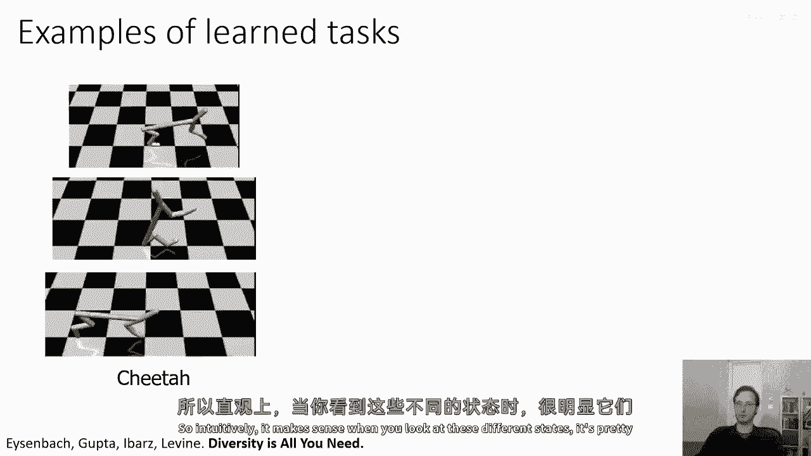

很明显，它们彼此都不同。

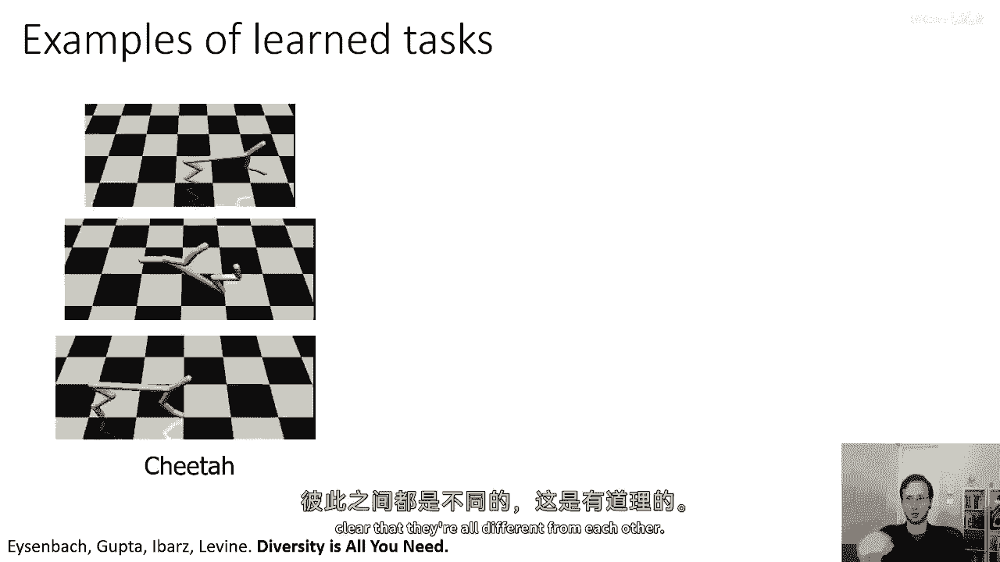

如果我告诉你后翻是技能号二，向前跑是技能号一。

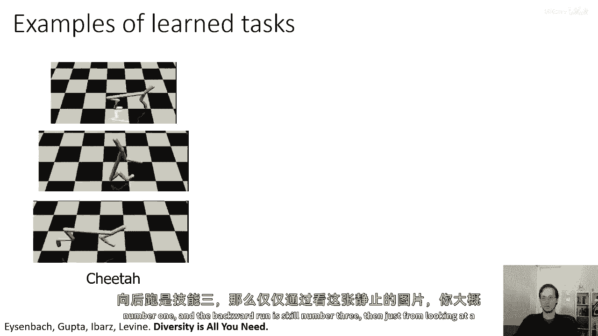

向后跑是技能号三，那么仅仅从看这个静止的照片，你可能能猜出它正在做什么，同样对于蚂蚁来说。

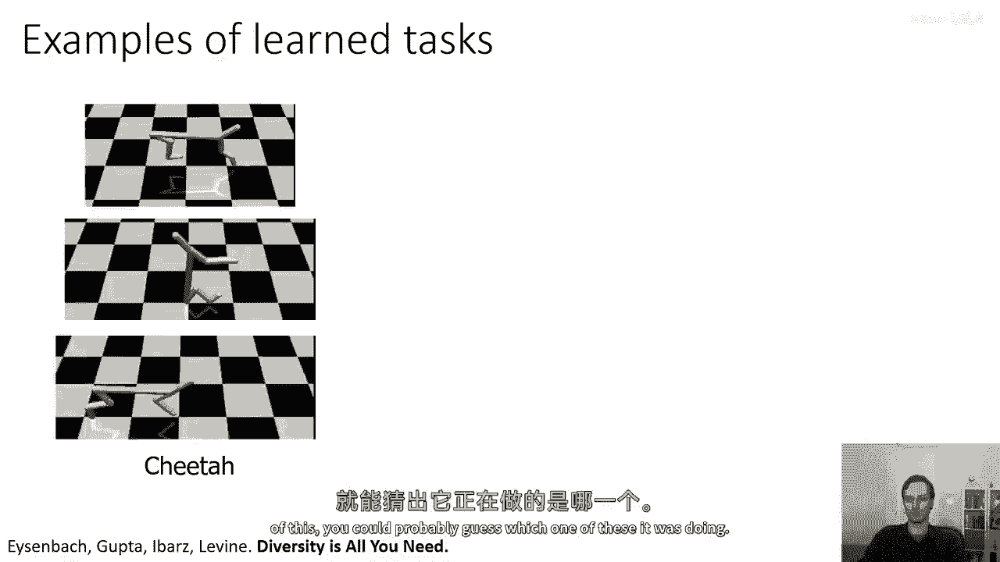

对于其他环境，如山地车。

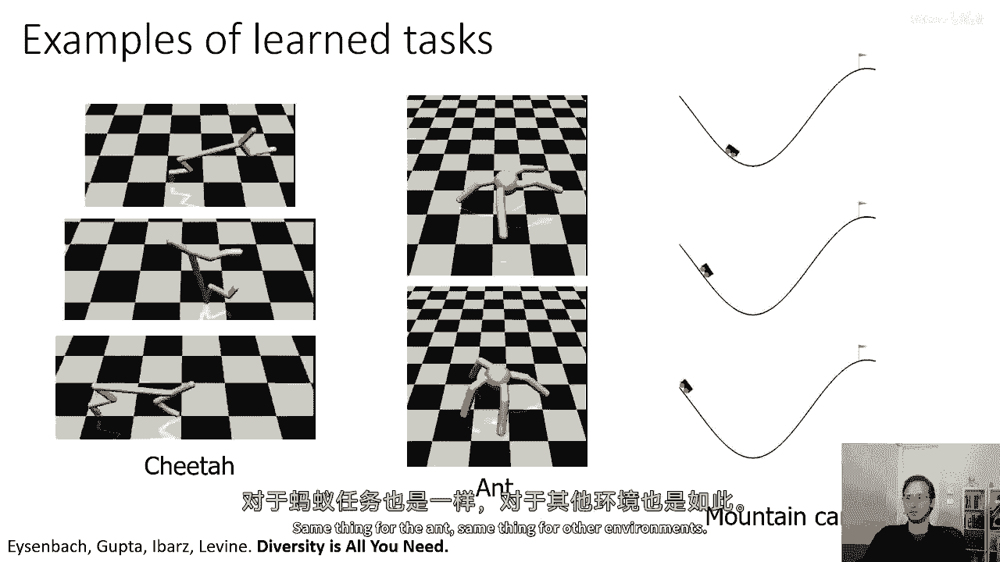

一些技能实际上只是执行并解决任务，所以这似乎是一种获取多样技能的可行方式。

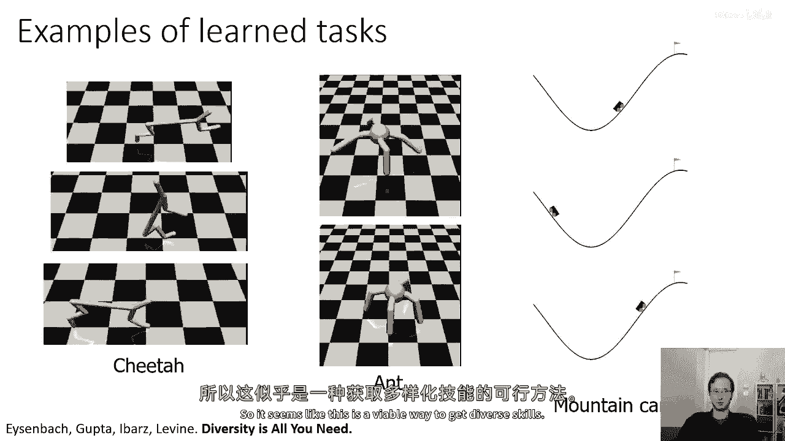

但我们也可以问。

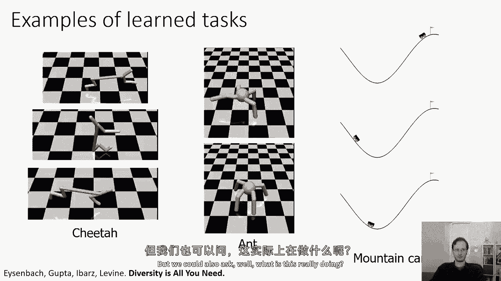

这实际上在做什么，所以又像以前我描述的其他方法一样，它似乎又是一种相当任意的食谱，但是否能证明它可以优化一个明确定义的目标。

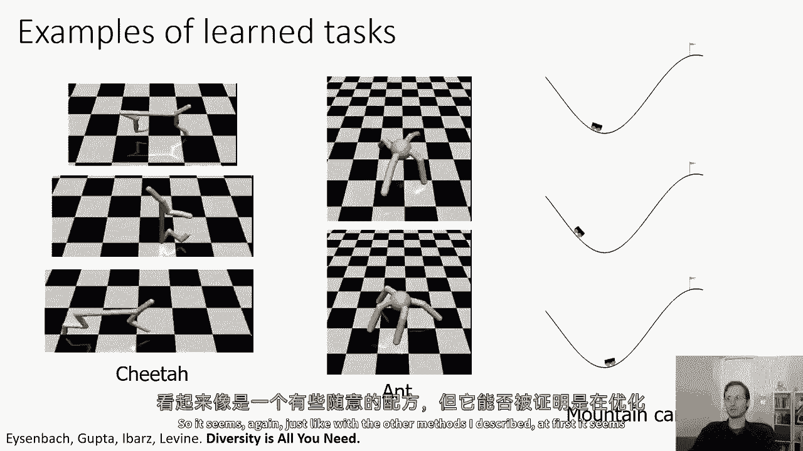

嗯，嗯，嗯，实际上，这种方法也与互信息有着非常密切的关系，嗯，如果你想要了解更多关于这个，在底部有两篇论文，多样性就是你需要的所有，和变分内在控制，所以如果你写下z和s之间的互信息，之间的技能与状态。

那，嗯，通常它会分解为h(z)减去h(z|s)，第一个术语你通过选择技能的均匀先验来最大化，所以实际上，如果你有n种技能，它们每一种都有同等的可能性被触发，所以你从n种技能中均匀选择。

所以这将很容易最大化第一个术语，然后你所要做的就是最小化第二个术语，并且第二个术语是通过最大化log p(z|s)来最小化的，如果z从状态很容易预测，那么，这意味着你正在达到，嗯，你正在取状态，嗯。

你正在取状态，其中z的熵非常低，这意味着你正在达到，你正在取状态，使得z的熵非常低，所以，仅仅擅长预测状态，"同时通过改变政策"，"通过改变分类器，实际上最小化了给定s的z的h"。

这意味着整个算法最大化了z和s之间的相互信息，"所以，让我们总结一下"，嗯，你知道，"让我来描述一些你们可能已经注意到的主题"，因此，我描述了三种不同的方法，他们都是，他们都是非常相关的。

而且所有这些方法基本上都以，某种形式的最大化你的结果和目标或任务的相互信息结束，所以您的结果可能是您的最终状态或任何状态，而目标或任务的某种概念可能是目标状态或技能z，在这些所有情况下。

我们看到最大化结果和任务之间的相互信息是进行有效学习的一种方式，和无监督强化学习，实际上，我们还看到，如果你在测试时不知道你将被赋予的任务，如果你。

如果你假设的最好情况是你将被分配到一个由对手选择的任务，那么这不仅是一件好事要做，实际上，这就是最优秀的事情要做，所以，我希望这次讨论，嗯，能给你带来一种稍微不同的对探索的理解。

我们如何思考在不受监督的全面设置中的探索，甚至开始应用一些强大的数学工具，这些工具可以给我们一个优化的概念。

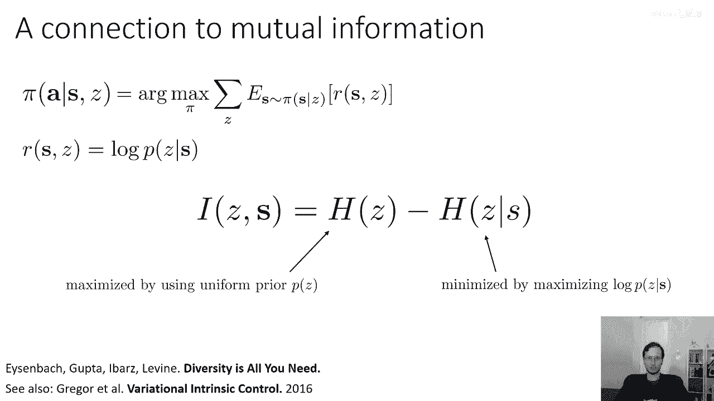