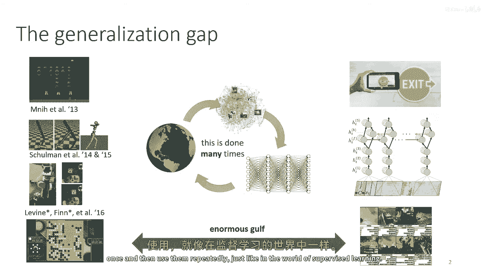
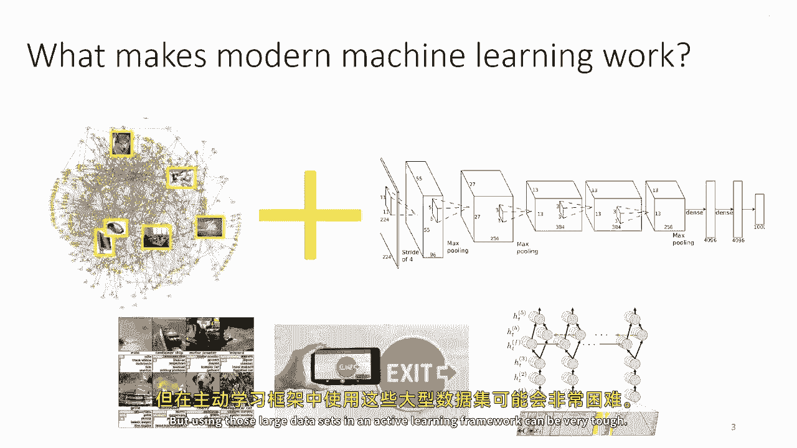
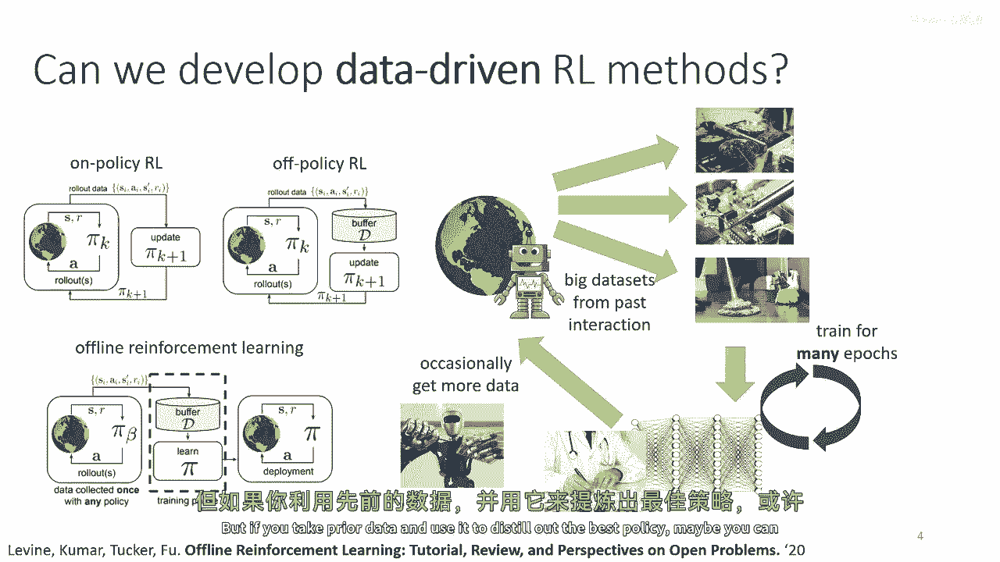
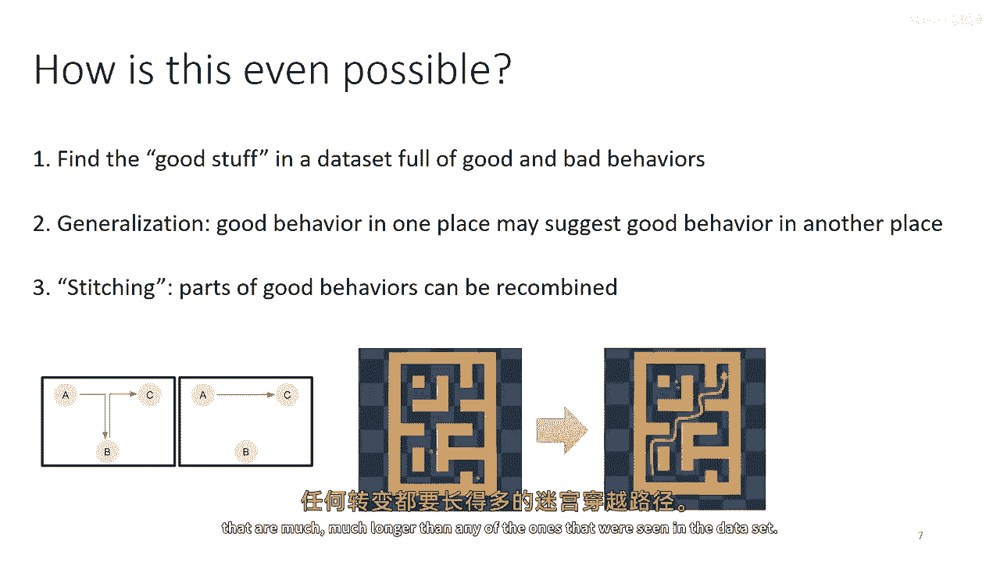
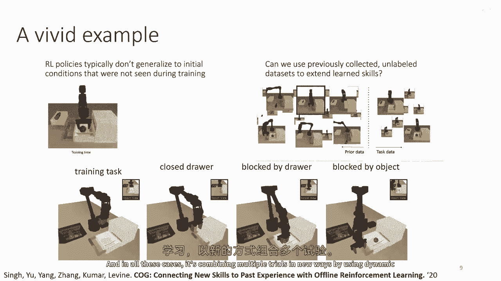
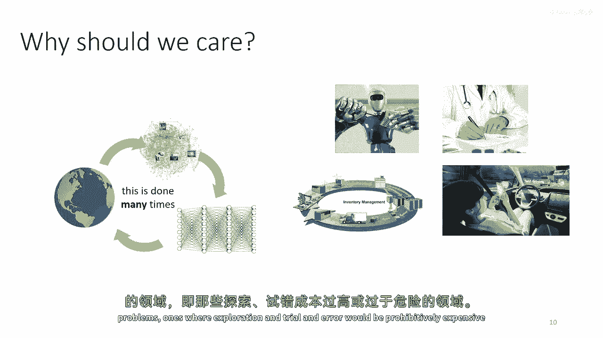
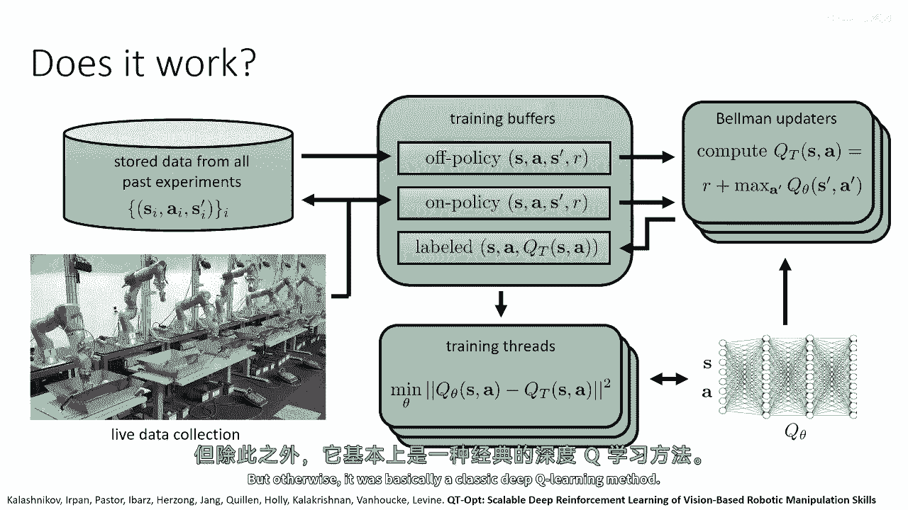
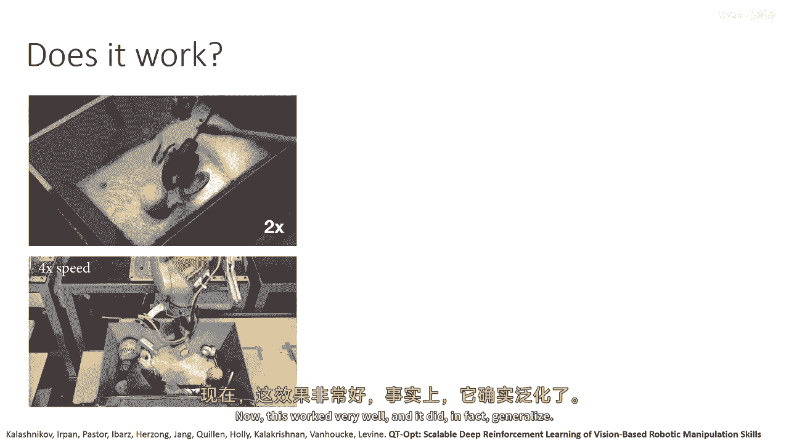
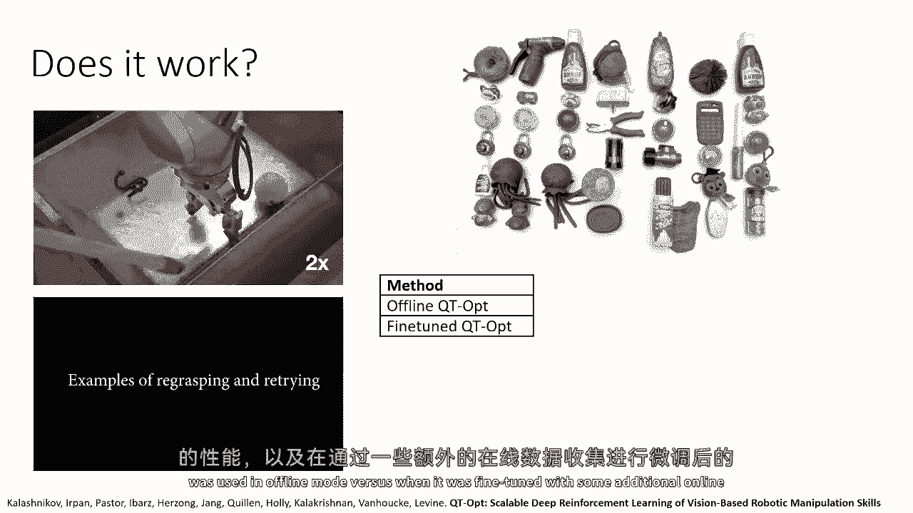
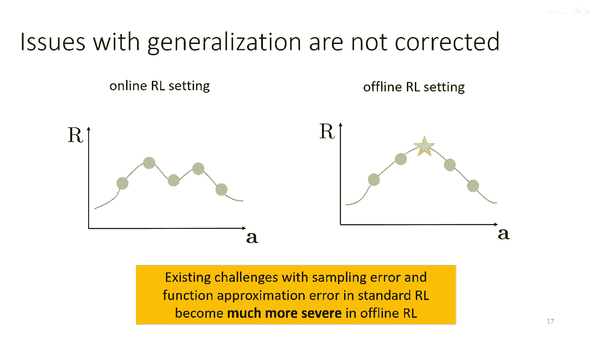

# 【深度强化学习 CS285 2023】伯克利—中英字幕 - P64：p64 CS 285： Lecture 15, Part 1： Offline Reinforcement Learning - 加加zero - BV1NjH4eYEyZ

 In today's lecture， we're going to discuss offline reinforcement learning。

 This lecture is going to cover quite a few fairly recent methods。

 so it will be both an overview of the fundamentals。

 and also just kind of a survey of various techniques。

 We'll talk about very classic techniques for offline RL， going back several decades。

 as well as some of the more recent ones。 But first， let's start with a little bit of motivation。

 to explain why we're covering this topic and what this is。

 So one bit of motivation that I find pretty interesting is。

 this observation that the kinds of situations where current。

 reinforcement learning methods of the sort that we learned about in previous lectures。

 work really well， they just look kind of different。

 than the settings where we've seen supervised deep learning techniques， be very effective。

 So as we all know， reinforcement learning is fundamentally， as we learned about it so far。

 an active and online process， whether you're doing on-policy or off-policy algorithms。

 they're all about iteratively interacting with the environment， collecting some data。

 using that to improve your policy， and then collecting some more data。

 And we know that deep reinforcement learning methods work well。

 across a range of different problem settings， including ones that are really difficult。

 But if we just look at the kind of domains where supervised methods work well。

 we see a really big gap。 And it's not so much a gap in terms of how complex the task is。

 but it's a gap in terms of generalization。 So if you look at， for example。

 state-of-the-art techniques for image recognition， you know。

 generally these techniques are tested on recognizing objects in images taken from the Internet。

 that could be all over the world in any situation and so on。

 Whereas the policies that we train with a DRL， they typically work best in more constrained closed world environments。

 So the AlphaGo system can beat the world champion at Go。

 but it doesn't have to worry about like somebody spilling coffee on the Go board， right？

 It deals with a closed world environment with known and well understood rules。

 or at least these systems deal with settings where the world is kind of contained within a particular kind of environment。

 Now， it's fairly easy for us to say that maybe the only difference between the stuff on the left。

 and the stuff on the right is just the variability of data。

 So if you were to take one of these DRL algorithms that we learned about in the previous lectures。

 and just scale it up so that it's trained with a huge amount of data for many different situations。

 maybe it will generalize just as effectively as a supervised techniques。 And in fact。

 we're going to analyze that with some examples in a few moments。

 But the big challenge of doing this in a classic kind of on-policy framework。

 or even off-policy algorithms that iteratively collect more data and use a replay buffer。

 is that we're essentially asking the algorithm to collect these very large data sets in the loop actively。

 So if you imagine that you need an image net-sized data set to generalize effectively。

 then for an on-policy algorithm， you're essentially asking for an image net-sized data set every iteration。

 and even for an off-policy algorithm， you're asking for an image net-sized data set for every training run。

 And that can quickly get extremely unwieldy。 Ideally。

 with data sets that are as large and as complicated as the ones that we need for supervised techniques。

 the ones that require millions of samples or maybe billions of sentences for a state of the R language models。

 ideally would collect those only once and then use them repeatedly just like in the world of supervised learning。

 And this is really key because if we really ask ourselves a very basic question。

 what is it that makes modern machine learning work？ At a very high level。

 we really need large data sets and large high-capacity models to get effective generalization。

 So we can't really get the sort of generalization that we've seen in supervised learning land with our RL methods。

 if we don't have these two ingredients。 And using large models is not too difficult。

 you just need a big enough data center。 But using those large data sets in an active learning framework can be very tough。

 So the basic principle behind offline reinforcement learning is to essentially develop reinforcement learning methods。

 that can reuse previously collected data sets to essentially create a kind of a data-driven RL framework。

 So far in the course we learned about on-policy RL。

 On-policy RL is when you have a policy that interacts with a world， collect some data。

 use the data to update， throw that data out and then interact with the world some more。

 So for example， policy gradients are a classic example of this， every iteration。

 they collect some trials， they use those trials to improve the policy and then they discard them and collect some more。

 We learned about off-policy RL techniques like Q-learning。

 which you can kind of think of as a buffered version of on-policy RL。 So for off-policy methods。

 they buffer all their data into the replay buffer and then they replay from that buffer。

 which is great for improving data efficiency， but the off-policy RL methods that we learned about so far in the course。

 actually do require additional online collection， meaning that after you update the policy you do need to use that policy to collect some more data。

 perhaps with some exploration scheme like epsilon greedy。

 It might not be completely obvious why this is the case and we'll actually analyze this shortly。

 We'll actually discuss what happens if you simply run an off-policy RL algorithm but then stop collecting more data。

 So the main topic for today's lecture will be to figure out how to devise off-line RL algorithms。

 And these are also sometimes called batch reinforcement learning algorithms and also less often fully off-policy reinforcement learning algorithms。

 Basically the difference between these and the other two is that in off-line reinforcement learning。

 you don't actually get this active interaction， you just get a buffer。

 So you assume that somebody else collected that buffer for you by running some other policy。

 which we refer to as a behavior policy。 It's called pi beta。

 By the way it's very important to distinguish the behavior policy from the expert policy that we had in imitation learning。

 So in off-line reinforcement learning we don't assume that pi beta is any sort of expert。

 Pi beta could even be fully random。 It's just a mechanism that was used to collect a data set。

 And then that data set will be used during a training phase to train up the best policy we can get。

 And then that policy is deployed but once it's deployed there's no more training。

 So in a sense this is just like every other machine learning discipline where you're given a data set。

 you train the best model you can on that data set and then you go and use that model。

 And there's no active or online phase， there's no exploration。

 And we could imagine different ways that such offline our own methods could actually be utilized in reality。

 For example， you might imagine that you have a robot that is tasked with doing a wide variety of chores around the house。

 and repairing electronics and sweeping the floor and cooking。

 And maybe over the course of its lifetime it gathers a large and very diverse data set of everything that is done before。

 And then when you want it to learn a new skill， maybe you will load up all of that past data。

 use it to train up the best skill you can get。 And that's your offline training phase。

 And that already gives you a good initialization。 And then of course in reality there's no reason to do things fully offline。

 So you could then deploy it and collect more data and further refine with some online reinforcement learning。

 But the key thing here is that you're not relying entirely on that online phase。

 you're actually getting a lot of basic functionality from the offline data。

 This seems like actually a very reasonable model of how people would do things too。

 If I were to try to explain to you some new tasks that you're supposed to be doing。

 you would probably draw on your past experience and everything you know about the world to get an initial guess for how to do it。

 And that guess might actually be very good。 But then you could still refine your skill with some practice。

 with some trial and error。 And developing these kinds of methods could potentially open the door to a wide range of RL applications。

 that are very difficult to do with fully online active settings。 You know。

 obviously including things like robotics， but also domains where it's very difficult to imagine。

 applying RL methods with active exploration。 Like for example medical diagnosis。

 Can you have a policy that learns to recommend prescriptions and tests for a patient？

 It would be ridiculous to explore actively。 You know。

 we already had our experience with active exploration for drug prescription in our exploration lectures last week。

 Didn't go so well。 But if you take prior data and use it to distill out the best policy。

 maybe you can do quite well。

 Scheduling scientific experiments， controlling power grids， logistics networks and so on。

 There are a lot of applications where we would like to use learning based control。

 We would like to use reinforcement learning。 But it's very difficult to imagine doing online exploration。

 Okay， so let's get into more of the details。 What does the term offline RL really mean？ Well。

 so these are the pictures we had in the previous slide。

 But formally we're going to say that we have a dataset D。

 And just like in our discussion of Q learning from before。

 the dataset is really a dataset of transitions。 State， action， next state and reward。

 Now these transitions are likely to be arranged into trajectories， meaning that， you know。

 for the first transition， the S prime is actually the S for the second transition。

 So very likely it's arranged in trajectories。 But the algorithms that we're going to discuss usually don't assume that with the exception of important sample policy gradients。

 But most dynamic programming algorithms， most algorithms that are based on Q functions。

 just assume that your dataset is arranged into transitions。

 We will have states and we will often refer to state distributions。

 We've used different notation in this class at different points。

 mostly because I want to make sure that you guys are familiar。

 with all the notation that's used in the literature。

 But we will use the symbol D with a superscript corresponding to a policy to denote a state marginal state distribution induced by that policy。

 We will use pi beta to denote the unknown policy that collected our dataset。 So in reality。

 you usually don't know what pi beta is。 So someone gave you a dataset。

 maybe you're doing autonomous driving， and your dataset consists of all sorts of human driving。

 So you can assume that there are some kind of drivers， bad drivers， mediocre drivers。

 You don't actually know what their policy is， but for the purpose of mathematical analysis。

 you can assume that there exists some policy pi beta。 You just don't necessarily know it。

 There's some kind of transition function。 There's some kind of reward。 That's just like before。

 And as I said， the behavior policy is generally not known。

 The RL objective is just like before is to maximize the expected sum of discounted rewards。

 There are several types of offline RL problems that we could define。 One sort of auxiliary problem。

 which is not the full offline RL problem， but it's closely related。

 is what's called off policy evaluation。 And we'll discuss this a little bit。

 The main focus of the lecture is on off policy RL。

 but we'll discuss off policy evaluation a little because it forms kind of a common building block。

 And off policy evaluation basically refers to this problem。 Given a data set D。

 estimate the return of some policy。 Now， it could be the behavior policy。 That's actually very easy。

 but there's a little typo on the slide。 There should actually be J of pi。

 So it's estimate the return of some policy that you're given using a data set D。

 Estimating J of pi beta is actually pretty easy。 But you could use the same data set to estimate the value of some other policy that was not the one that collected the data。

 And that's a lot harder。 And that's called off policy evaluation。 Offline reinforcement learning。

 which is also sometimes called batch RL， and sometimes fully off policy RL， is given the data set D。

 learned the best possible policy。 Now， as we saw in previous lectures。

 oftentimes learning a policy requires evaluating a policy。 So in actor critic methods， for example。

 we would evaluate our current actor， and then we would improve it。

 So some sort of off policy evaluation is often in the inner loop of an off-line RL method。

 But I will discuss a little bit later how， in some sense， the general off policy evaluation problem。

 the problem of evaluating any policy， can actually be a little bit harder than learning the best possible policy。

 The intuition for why is that when you're learning the best possible policy。

 you don't actually have to evaluate some other policies that might never arise in the course of learning。

 Now， there's a subtlety with this statement， and I intentionally wrote it in a slightly cryptic way。

 given D learned the best possible policy by theta。

 That is not necessarily the best possible policy in the MDP。

 It's the best possible policy that you can learn using your data set。 And it's， I think。

 pretty easy to see why， given certain data sets， the optimal policy may simply never be learnable。

 So， for example， if you have a very large MDP with some really good states。

 like maybe Montezuma's Revenge， when you win the game， there's a really high reward。

 but all of your data is in the first room of Montezuma's Revenge。 Well。

 there's no way you could possibly use that data to learn a true optimal policy。

 because large parts of your MDP are just never seen in the data。

 So we have to be a little bit careful with what best possible policy means， and， you know。

 the formal statement is not here on the slide。 It's actually pretty complicated。

 but the informal intuition is you want to learn the best policy that is supported by your data。

 The best possible policy for which the evidence that it is good is present in your data set。 Okay。

 so now one question that some of you might ask is， how is this even possible？ Like。

 can we even hope to learn good policies by using only data sets without ever interacting with the world？

 Some of you might be wondering the opposite， it's like， why is this difficult？

 And actually both of those questions are a little bit non-trivial。

 So there are a few different perspectives on what we should expect offline reinforcement learning algorithms to do。

 One perspective is we should expect them to find the good stuff in a data set full of good and bad behaviors。

 And they can definitely do that， although that is a fairly naive view of what good offline or all methods should do。

 So by finding the good stuff， what I mean is， you know。

 if I give you a data set of human drivers driving a vehicle。

 and some of them are good and some of them are mediocre and some of them are bad。

 if you were to run imitation learning on that， you would kind of get the average human driver if your imitation learning algorithm succeeds。

 If your imitation algorithm fails， you might just get this accumulating errors that we talked about in the beginning of the course。

 but assuming that doesn't happen， you know， what imitation learning is trying to do is give you the average driver in the data set。

 But if you run offline RL， in principle it should get you the behavior of the best driver。

 which should be bad。 But this， of course， begs the question。

 is offline RL always going to be only as good as the best behavior in the data set？

 And the answer is in general no。 In general， it is possible to do better than the best behavior in the data set。

 And this might be a little non-obvious， but hopefully the intuition that will come next will convince you of this。

 So the basic idea is that you're going to have generalization。

 which means that good behavior in one place may suggest good behavior in another place。 So if。

 for example， you have some human drivers and one of them really knows how to do a really fast merge onto a highway。

 and another one really knows how to transit through an intersection very efficiently。

 but neither of them is good at both。 Well， you can sort of distill the best parts of each of them。

 and you can even generalize to a degree to situations where you haven't seen them acting。

 You can imagine a shallagornum as combining good behaviors in different places to attain behaviors that were never actually seen in the data set。

 So one really simple example of this is the stitching example。

 So if in your data set you've seen some transitions that go from A to B。

 and you've seen other transitions that go from B to C。

 then you can figure out that it's possible to go from A to C。

 and figuring the set requires reinforcement learning。

 But it actually goes a little bit further than that。 So of course。

 you could take the stitching intuition and you could scale it up massively。

 So imagine that you have a maze navigation task where you see transitions between different pairs of starting goal states in a maze。

 and from that you can figure out how to get between any two points in the maze。

 even pairs of points between which you've never seen a transition。

 And you can of course stitch these together to get transitions through the maze that are much。

 much longer than any of the ones that were seen in the data set。

 Alright， let's get into this a little bit more。 So the kind of the bad intuition。

 in my opinion the bad intuition for what all fly and RL methods do。

 is that they do something that is a bit like imitation learning。

 So you have some data that goes between a star and a goal。

 and you're going to basically imitate that data。 It can be shown that all fly and RL is theoretically actually better than imitation learning even in this setting。

 So it's not really the main point。 A better intuition is that an offline RL method can kind of get order from chaos。

 So let's say that your data set consists of these trajectories。

 Now clearly they are very sub-optimal， and most of them don't go anywhere near the goal。

 But if you take kind of the best bits of both with a little bit of generalization thrown in。

 you can get a much better behavior than any of the behavior you saw in the data set。

 And the stitching that we discussed on the previous slide is of course of one instance of this。

 But it's merely the clearest example of a more general trend。

 So you could imagine sort of microscopic level stitching。

 where you have many trajectories that are all kind of a little bit sub-optimal in every place。

 But if you have enough of them and you recombine the best parts of all of them。

 you can get a highly optimal behavior。 So you could take a bunch of human behaviors for driving。

 for instance， that are each sub-optimal in slightly different ways。

 and get a super human behavior that is essentially the best part of the system。

 And essentially the best of the best human in every single situation。

 So if we have algorithms that can properly perform dynamic programming。

 we can take this idea much further and really get near optimal policies from highly sub-optimal data。

 Okay， here's a vivid example， or what I think is a vivid example from some past work in my group。

 that I think kind of shows this point a little bit more concretely。

 Let's say that you have a robotic arm， and that robotic arm is supposed to pick up an object from an open drawer。

 So the training data for it， the experience that it has is picking up the object from an open drawer。

 And now maybe a test time， the drawer is closed， right？ So， you know。

 generally if your RL policy is trained with an open drawer。

 it's not going to have any way to know what to do when the drawer is closed at test time。 So。

 what if in addition to the drawer grasping， you also have a bunch of experience of picking up and moving objects。

 opening drawers， closing drawers， basically all sorts of other skills that you could do in this environment。

 But they're all separate from the skill of picking up the object from the open drawer。

 So all this prior data contains a variety of skills。

 but none of it contains the picking up from the open drawer。 Well。

 if you just take all this prior data and you put it into the same data set as the object grasping skill with the open drawer。

 then this same stitching property that I discussed before will actually allow you to acquire a policy that can pick up the object in different situations。

 So， of course， you can pick up the object when the drawer is open。

 but you could also handle a situation where the drawer starts out closed because you've seen prior data that involves opening drawers and via dynamic programming via techniques like Q-learning。

 You can actually connect it up to the skill of picking up the object from the open drawer。 So。

 in this case， none of the prior data has that full sequence。

 None of it has the robot opening the drawer and picking up the ball。

 but it has some opening and it has some picking and the RL algorithm can figure out how to put them together。

 Another example is close the top drawer， open the bottom drawer， and then pick up the ball。

 So there it goes， close the top， open the bottom， pick up the ball。

 Another example is pick up the object and move it out of the way， then open the drawer。

 then pick up the ball。 In all these cases， it's combining multiple trials in new ways by using dynamic programming。

 by using Q-learning。

 All right， so why should we care about this？ Well。

 if we can get this kind of offline RL recipe to work。

 we don't have to collect image and size data sets every time we want to train a policy。

 We can apply RL to domains that don't conventionally look like reinforcement learning problems。

 ones where exploration and trial and error would be prohibitively expensive or dangerous。

 And we can hopefully move towards a much greater level of generalization。 So。

 now that I've kind of discussed the why， why offline RL is good。

 let me tell you some of the bad news。 Let me tell you what goes wrong if we try to do offline RL naively using the kinds of techniques that we've learned about before。

 So， back in 2018， when I was working on robotic grasping at Google。

 we had a little experiment that we did， or actually a very large experiment。

 where we tried to implement an effective offline reinforcement learning algorithm with online fine tuning and scale it up to see if we can get policies that generalize。

 you know， our goal was to get policies that generalize the generalization。 And so。

 the goal was to get policies that generalize as effectively as these supervised model train on things like ImageNet。

 So， we collected a very large data set of robotic grasping with a combination of scripted policies as well as learned policies。

 And we had kind of a hybrid system that would use all prior stored data as essentially offline data and then it would also do some online collection and it was massively parallel and massively scaled up。

 But at its core， this system implemented an algorithm that was very much like the Q learning approach that we talked about before。

 it's for continuous action， so it used the optimization based target value calculation。

 But otherwise， it was basically a classic deep Q learning method。

 Now， this worked very well and it did in fact generalize。

 But what I want to tell you about in this lecture， you know。

 other than using this as an opportunity to show you some cool robot videos。

 is to compare the performance of the system when it was used in offline mode versus when it was fine tuned with some additional online data collection。

 And this will hopefully help illustrate some of the challenges with offline reinforcement learning。

 So offline mode here actually used pretty good offline data。

 so it was data from past RL runs that was just reloaded and then used to train up better policies。

 Whereas with fine tuning， we had some additional online data collection。

 The offline data set consisted of 580，000 trials， grasp items。

 these were collected over several months。 The fine tuned version further augmented it with about 28。

000 trials of additional online fine tuning。 So it's a lot of trials。

 but the amount of additional online data is compared to a very small。

 so probably whatever difference you see is not due to the difference in the data set size。

 It's due to something about the difference between offline versus online training。 And by the way。

 the online training here is still off policy， so it's still using replay buffers。

 It's still recycling all of that offline data。 It's just collecting additional data with the latest policy。

 So the success rate for the offline method was 87%。

 which means that 87% of the time it could successfully grasp the objects in front of it。

 Whereas the fine tuned method had a success rate of 96%。 Now you might say。

 well these are both pretty good， but if you look at the failure rate。

 it becomes a little more obvious that the failure rate for the fully offline method is more than three times larger than the fine tuned method。

 So more than threefold increase in the failure rate， just from emitting those 28。

000 online transitions。 So something here is going on。 The system worked pretty well。

 we were pretty happy with it， but it seems a little frustrating that just taking that data and using it as an offline data set doesn't yield the same kind of success rate as if you then did a little bit of online fine tuning。

 So to get a little bit of intuition for what might be going on here， here's a little experiment。

 a very controlled experiment that tries to get at the spawn。

 So this was an experiment that was conducted using the half cheetah benchmark task。

 which hopefully all of you are familiar with from your homework。 And in this case。

 data was collected using basically from the replay buffer of an RL training run。

 This was a training run with soft vector critic with SAC。

 and that training run was allowed to go up until the policy reached some kind of mediocre performance。

 I think the reward was several thousand， maybe around five to six thousand。

 And then that entire replay buffer was used as an offline data set to train a policy。

 And it was trained with basically a classic actor critic algorithm with Q functions。

 much like the one that we learned about a few weeks ago。

 And the different curves here show different data set sizes ranging from one thousand to one million transitions。

 And you can see that all of them do very badly。 So the data set average here is several thousand。

 So if you were to just imitate the data set， you would get a reward of several thousand。

 If you just run off policy actor critic on it， the rewards are generally in the range of negative seven fifty to negative two fifty。

 And they're not getting better。 In fact， they actually get worse right from the start。

 The initial policy performance is at zero and it gets worse。

 So something really terrible is going on here。 Interestingly enough。

 if we look at the actual Q values that are learned by the SAC critic algorithm for each data set size。

 the Y axis here is a log scale。 So the estimated Q values are extremely large。 For example。

 for that red curve， the one that has a million data points。

 it's estimated it's going to get a reward of ten to the seventh power。

 And it actually gets minus two fifty。 So that's really weird。

 Our Q function thinks it's going to get huge values。

 but then if we actually train the corresponding actor and run the actor。

 we get really horrible values。 So that's strange and it's not an accident。

 The fundamental problem in offline ARL is really you can think of it as a problem of counterfactual queries。

 Let's say that we have autonomous driving example from before and our training data has a human driver driving the car decently well。

 The human driver is not optimal。 Remember， we're not assuming that they're an expert。

 but there are certain things that human drivers just don't do。

 So they're not going to randomly swerve off the road in the middle of nowhere。

 They might do some things that are unsafe。 They might occasionally go into the opposing lane or something。

 or they might occasionally make a turn on a red light。

 but they're not going to view the crazy stuff。 So their coverage of possible behaviors is incomplete。

 There are some things that you just don't do。 During training， when we're updating the policy。

 what we're really doing is we're asking for all the actions available to us in this state that we're using。

 In this state that we've seen before， which action is best。

 And that implicitly requires comparing the action that was taken in the data set to the other actions that were available。

 So it requires asking， is this other action that it didn't take？ Is it good or is it bad？

 How can we know that if we didn't see it in the data？ Well， for some actions。

 we might know if they're good or bad because of generalization。

 so we might have seen similar actions in other similar states。

 But because our data set doesn't have perfect coverage。

 there are certain behaviors that are unlike anything that we've seen but that are available to us。

 Online RL algorithms don't have to worry about this because they can simply try that action and see what happens。

 So a regular online algorithm， even if it's an off-policy algorithm。

 it might decide erroneously that the action of swerving off the road is a good one。

 And if I go and try it， and then it might learn that it's bad and not do it again。

 that's exactly why we don't want to deploy these algorithms in the real world in safety。

 But offline RL algorithms have to somehow account for these unseen actions， ideally in a safe way。

 So they need to basically understand that just because you didn't see that it's bad doesn't mean that it could be good。

 They need to somehow figure out that actions that are completely unfamiliar should not be assigned high values or should not be attempted because there is not enough confidence that they are good。

 We refer to these actions as out-of-distribution actions in the sense that Pi beta induces some distribution over actions and some actions are inside of that distribution and some are outside of it。

 Now it's important not to confuse out-of-distribution actions without of sample actions。

 Your Q function could be quite capable of accurately estimating the value of actions that it never saw before if those actions come from the same distribution。

 And this is actually a really important point because if you didn't do this then you wouldn't get generalization and you wouldn't be able to build effective algorithms。

 This is actually a mistake that some early research on offline RL made where they didn't account for the difference between out-of-sample and out-distribution。

 But it's a really important distinction。 So it's really out of distribution that we're worried about。

 And at the same time you still have to make use of generalization to come up with behaviors that are better than the best thing that you saw in the data。

 So this is a subtle and delicate trade-off to strike。

 You have to be better than the best thing in the data。 You have to recombine the best parts。

 You have to generalize。 But at the same time you have to avoid assuming that an out-of-distribution action could be good when in fact you simply do not have enough evidence to determine its value。

 Okay， so that's kind of the intuition。 But let's talk about some of the math behind this problem。

 So this problem is often referred to in statistics as distribution shift。

 Distribution shift means that you have one particular distribution you use in training and then you need to perform well under a different distribution。

 And because those distributions don't match you end up performing very poorly。

 So whenever we train something with supervised learning we typically use a training set。

 And the training set comes from some training distribution。

 So let's say that you are learning a function f theta of x and you're regressing onto ground truth values y。

 And your x has come from a distribution p of x and your y's come from a ground truth distribution p of y given x。

 So you would sample a training set from your training distribution and minimize the error on that。

 And this is what's referred to as empirical risk minimization。

 So your sampled training set is giving you an empirical estimate of the risk。

 And that's what you're minimizing。 And as long as you don't overfit。

 minimizing the empirical risk will also minimize the actual risk which is what I have written down here。

 So this equation is actually not the empirical risk。 This equation is the actual。

 the real risk under the full distribution。 But a training set approximates us with samples from p of x。

 So then we could ask some basic questions like for example。

 given some test point x star is f theta of x star correct。

 That might seem like the most basic question you could ask in a supervised learning problem。

 And it's actually a surprisingly subtle question。 So as long as you didn't overfit。

 you know that the expected value of your error under the training distribution is low。 In general。

 the expected value of your error under some other distribution p bar of x is not low if p bar of x is not equal to p of x。

 I mean， the easiest way to think about it is to imagine that p of x is an interval on x from like 0 to 1 and p bar of x is from like 1 to 2。

 If you've just never seen any y values in that interval。

 there's no reason to expect to get correct answers。 Now， what if x star is sampled from p of x？

 Well， the thing is even then you're actually not guaranteed to have low error because you could have low error in expectation under p of x and still have high error on some individual points that are within the support of p of x。

 So even that is not guaranteed。 Now， if you are a deep learning practitioner。

 at this point you might be saying， "Well， yeah， this is true。

 There's like a bunch of kind of dusty boring statistics。"。

 But usually we're not worried about this because neural networks generalize really well。

 And maybe neural networks generalize so well that even though in principle they shouldn't be handling distributional shift。

 in practice they'll learn a really good function and it will just succeed anyway。

 And this is actually sometimes the case。 Like， you know。

 you could say that an image recognition system trained on image net might be tested on new images that didn't come from Flickr or wherever image net was collected。

 And the other might still work， right？ So if you learn a general enough function。

 maybe it'll just generalize。 But there's a little bit of a problem if these x star test points are not just chosen arbitrarily。

 but if they're actually explicitly chosen， so as to maximize the value of f theta x。

 So x star is not arbitrary。 It's actually specifically chosen with f theta in mind。

 It actually knows which function is going to be tested on and it maximizes the value of that function。

 Now we can get into really big trouble no matter how good our function approximator is。

 So imagine this green curve is the true function and the blue curve is our fit。

 So the blue curve is f theta of x。 The blue curve is actually very good in most places。

 But if we choose the point x that maximizes the blue curve will get exactly that point that has the largest error in the positive direction。

 And this should actually come as no surprise to us because in a sense the process of creating adversarial examples looks very much like this problem。

 So these examples are created by optimizing an image so as to maximize the probability of some desired class or minimize the probability of the true class。

 So when you maximize with this or optimize with respect to inputs into a neural net。

 you can fool that neural net into doing just about anything。

 So what does all of this have to do with reinforcement learning？ Well。

 let's go back to the classic Q learning framework that we talked about。

 We discussed how Q learning is an off policy algorithm。

 So it's a very natural choice as a starting point for offline RL。

 Although I'll discuss how it's not the only starting point。

 And in Q learning you have to compute target values。

 And when you compute target values you take the reward at that transition plus the maximum over the next time step actions and plug those actions into your Q function estimate。

 And， you know， as we discussed before when we talked about Q learning and actor critic。

 you can equivalently write this as the expected value of the Q function under some policy。

 where if you're doing classic Q learning， pi new is just the greedy arg max policy。

 And these are the target values why that we're regressing onto。

 So the objective when training the Q function is to minimize the error between Q and the target values why。

 And if we're doing offline RL we're doing this minimization under some distribution and the distribution is the one that produced our data set which is the behavior policy。

 pi beta。 So we're minimizing the difference between Q and why under the behavior policy。

 Just like on the previous slide we talked about how we had a training distribution P of X。

 Now our training distribution is pi beta S a。 Which means that we expect good accuracy we expect Q values to be accurate in expectation under pi beta。

 And we're evaluating them in our target values in expectation under pi new。

 So that means that if pi beta is equal to pi new， then we would expect our target values to be correct。

 But of course that's not ever going to happen because the whole point of running offline RL is to find a better policy to get pi new to be better than pi beta。

 And even worse pi new is selected to maximize the expected Q value。

 That's what we essentially do when we take the argmax policy and that's what we do when we train an actor and act a critic。

 Which is just like this problem on the previous slide。

 Put another way pi new is explicitly trying to find an adversarial example to fool the Q function into outputting a large value。

 And that's why when we actually look at the Q values we see massive overestimation。

 Because the policy can always find some action that fools the Q function if the Q function is not allowed to collect more data and update its training distribution。

 So that's the fundamental problem in offline RL methods that are based on value functions。

 Is that you're maximizing the value function， the value function is trained under some distribution and when you maximize it you're going to query it with a different distribution which means you can always fool it to output erroneously large values。

 And there are all sorts of issues with generalization that are basically corrected by online data collection in the online setting but not correctly offline setting。

 So if you imagine that these are your actions and you're fitting their Q value in the online setting。

 maybe you concluded this action is the best but then you go and try this action to find that it's not the best and then you update your function。

 In the offline setting you don't get to do that。 So if you extrapolate erroneously。

 if you generalize erroneously you're basically stuck with that。

 So that means that you get this really nasty out of distribution action problem and it also means that existing challenges with sampling error and function approximation error that occur in standard RL just become much more severe in the offline RL setting because you don't have this feedback effect where you collect more data and fix up your mistakes。

 [BLANK_AUDIO]。

