# 【深度强化学习 CS285 2023】伯克利—中英字幕 - P66：p66 CS 285： Lecture 15, Part 3： Offline Reinforcement Learning - 加加zero - BV1NjH4eYEyZ

 The second class of， uh， classic batch RL methods that I want to cover are methods that use linear fitted value functions。

 Now， these days we typically don't use linear fitted value functions。

 we would usually use deep neural nets to fit our value functions。 Um。

 but it's still pre-valuable to understand how these methods work。

 Because a lot of the analysis tools， uh， that we might use to try to understand deep RL methods could be based on linear functional approximation。

 And also because some of these techniques， uh， basically in the linear case。

 they will give us closed form solutions that look like solutions to least squares problems。

 And these closed form solutions can give us a hint from develop more effective， uh。

 deep RL methods in the future。 So， uh， you know， since this is a graduate class and the point is to really give you guys an in-depth view of reinforcement learning。

 I want to go over the linear fitted value function methods。 Uh。

 these are kind of the- the first class of value based methods for batch RL。 Uh。

 and although the ideas that we'll talk about for practical modern。

 deep offline RL methods are quite distinct from these。

 I think this still gives us good perspective and a good toolkit that we might use in the future。

 especially if you're interested in algorithms development。 So。

 I'll just be upfront about it and say that if you want to use offline RL methods today。

 probably you wouldn't use the things that I'm going to talk about next。

 But if you want to develop new algorithms or do theoretical analysis。

 understanding this stuff can be really helpful。 Okay。 So， offline value estimation。 Uh。

 how have people thought about it before？ Well， classically。

 people have thought about the problem of offline value function estimation。

 as extending existing ideas for approximate dynamic programming and Q learning to the offline setting。

 and deriving tractable solutions with simple function approximators like linear function approximators。

 How are people thinking about it now？ Well， these days， mostly， uh。

 research in this area deals with deriving approximate solutions。

 with highly expressive function approximators like neural nets， and the primary challenge。

 in this case， turns out to be distributional shift。 So。

 there's a little bit of a disconnect because the more classic work doesn't really deal with distributional shift。

 The reason it doesn't deal with it is because they're assuming that your function approximator is pretty simple。

 So， given a good set of features and the effects， the bad effects of distributional shift are not too bad。

 Whereas the deep nets， the bad effects of distributional shift are very large because the deep nets are so much more powerful。

 So， the thing that makes these methods work better is also the thing that exacerbates the distributional shift challenge。

 So， what that means is that the techniques I'll talk about next do not address distributional shift in any meaningful way。

 They rather just direct directly address the problem of how to estimate the value function from batch data。

 And that means that if you apply those techniques with deep nets。

 they won't work for the reasons that I talked about in the first part of the lecture。 Okay。

 so I'll discuss these older methods next for completeness， and then in the。

 in the Wednesday lecture in lecture 16， we'll talk about modern techniques。

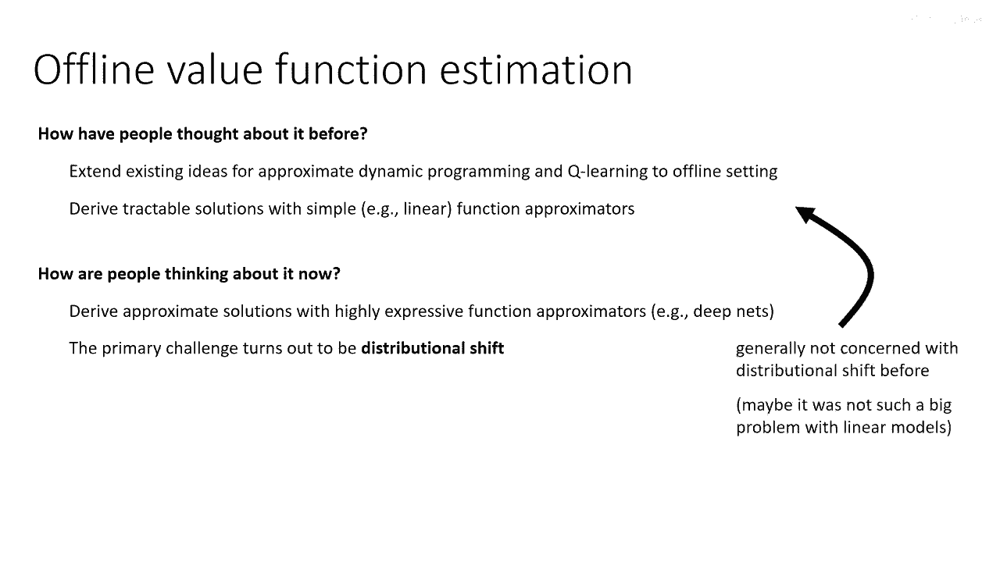

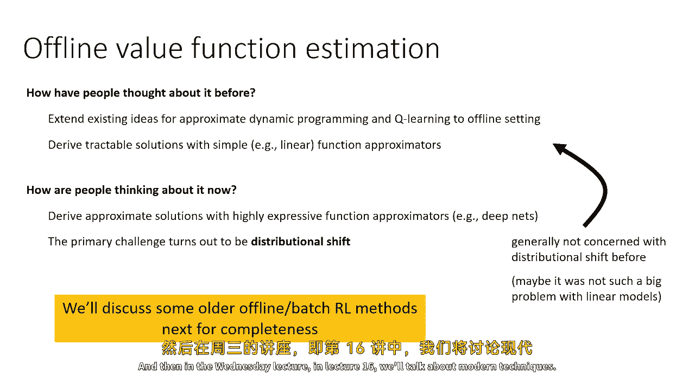

 Okay， so let's do a little warm-up。 Let's do a little warm-up and talk about linear models。

 This might seem like a little bit of a digression。

 but I'll actually connect it back to value-based methods shortly。

 So let's say that you have a feature matrix。 So this feature matrix is。

 its dimensionality is S by K， where this cardinality of S is the number of states。

 So we're talking about a discrete state MDP， and K is the number of features。

 So you can think of it as a vector-valued function， capital-5S。

 where for every state S it gives you a K-dimensional feature。

 But you can also think of it as a matrix with K columns。

 and each column has an entry for that feature for that corresponding state。

 So if you want to read off the feature vector for state one。

 you would just take the first row and you would transpose it。 Okay， so that's a feature matrix。

 So this feature matrix fully defines features at all the states in your MDP。

 And don't worry so much about the number of states being finite。

 This can be extended to infinite states using samples， so that's not really a problem。 Okay。

 can we do offline model-based RL in the feature space？ So what do we need to do model-based RL？

 Well， we need to estimate the reward in terms of our features。

 and we need to estimate the transitions in terms of our features。

 And then we need to recover the value function， and then we use that to improve the policy。

 So we're going to do everything with linear function approximation。

 which means that we're going to assume that it's generally okay to represent your reward as a linear function of the features。

 So there's some weight vector WR， and if you just multiply phi by WR。

 that'll be an approximation of the true reward。 Now remember。

 phi is a matrix that has a number of rows equal to the number of states。 R， the reward。

 is a vector whose length is the number of states。 WR is a weight vector with a number of entries equal to the number of features。

 So you would multiply every column in phi by its corresponding weight in WR and sum them together。

 and that should give you an estimate of the reward。 So WR looks like this。

 and if you imagine transposing that WR and multiplying that into the feature matrix。

 and then sum it up， you'll get a vector of length equal to the cardinality of S。

 and you want to solve some least square system to get this thing to be as close to R as possible。

 So here's the least square solution。 This is just from basic introductory statistics。

 If you write down the normal equations， this is what you get。

 So this is the least square solution for WR， phi transpose phi inverse times phi transpose times the vector of rewards。

 This is not a clever equation， this is literally just the standard normal equations for least squares。

 For now， we're just assuming that we have access to a vector of the rewards for all states。

 or state action tuples in general， we could extend this to state action tuples。

 but we'll talk about the sample base setting soon。

 The other thing we need is we need a transition model。

 So a transition model describes how the features right now become the features tomorrow。

 So just like we can turn phi into R by multiplying it by some weights WR。

 we can turn phi into a future phi by multiplying it by some transition probabilities， p phi。

 Now this is a little bit more subtle。 So first， let's talk about what we're targeting。

 What are we trying to approximate？ We're trying to approximate the effect on phi of the real transition matrix。

 So there's some real transition matrix， which is S by S。

 and that real transition matrix describes which states go to which other states。 Now。

 the transition matrix on states depends on the policy。

 which is why I have it written as p superscript pi。

 So different policies induce different state transitions。 So it's a policy specific thing。

 Everything here is policy specific。 So essentially we're doing policy evaluation。

 and then we'll do policy improvement in alternating phases。

 So the true transitions are obtained by taking the state to state transition matrix and multiplying it by phi。

 Because if you multiply the matrix phi by p pi， then you will get the features of the next states。

 the next states for your current policy。 And what you want to find is a matrix p phi that when you multiply phi by it will approximate this as closely as possible。

 So p phi is， you can think of it as a feature space transition matrix。 It's going to be k by k。

 And this is really important。 It's really important that p phi is k by k。

 Because essentially what you're doing is you're embedding your original MDP into this feature space。

 And typically k would be much smaller than the cardinality of S。

 So you can think of p pi phi as a k by k matrix just like w r was a k by one vector。

 So w r when multiplied into phi gave you a vector of rewards。

 p phi when multiplied into phi will give you a matrix of features at the next time step。

 And all of this is for a fixed policy point。 Now if you're wondering how you solve for p phi。

 it's the same normal equations as before。 So the same least squares formula can be applied to solve for p phi。

 It's just our targets now instead of being r are p pi phi。

 So p pi phi is what we want this to be equal to。 Same exact normal equations。

 The fact that our matrix value doesn't actually change anything。 So exactly the same logic applies。

 So we have a least square solution to w r and a least square solution to p phi。

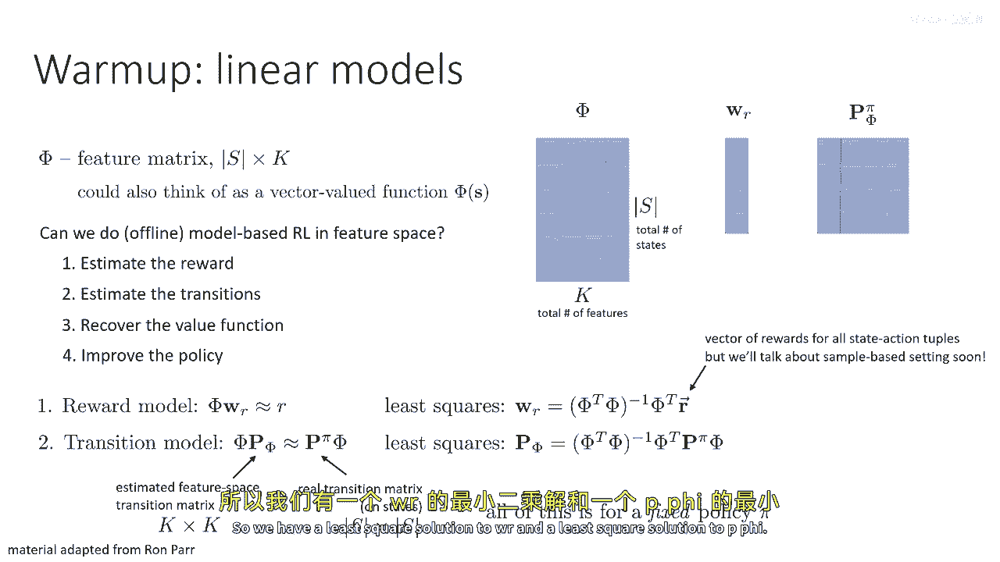

 So we've got our reward model and we've got our transition model。

 And now we're going to try to estimate our value function。

 Now let's say that our value function is also linear in phi。

 That means that the value function v pi phi can be written as the same matrix phi multiplied by w v。

 w v is just some vector of weights。 Just like w r is a vector of weights。

 w v is some vector of weights。 By the way， here's a little aside。

 This doesn't have anything to do with linear function approximation。

 but it's a useful formula to know。 If we want to solve for v pi in terms of p pi at r。

 there's actually a really neat solution。 So we can write our Bellman equation in vector form。

 You can probably think back to our theoretical analysis of Q learning from before。

 The same exact idea。 You can write everything in terms of vectors and matrices。

 So the vector value diversion of the Bellman equation is that v pi is equal to r plus gamma p pi times v pi。

 This is not policy improvement。 This is not doing the max。

 This is just evaluating the value function for a particular policy pi。

 Now some of you might have noticed that this is actually a linear equation。 V pi is a vector。

 By the way， what's the dimensionality of v pi？ Well。

 the dimensionality of v pi is the same as the dimensionality of r， which means it's s by 1。

 The dimensionality of p pi is s by s， so everything works out。 So we have s linear equations。

 We have s unknowns。 The s entries in v pi。 So we can actually solve them。

 So we can subtract gamma p pi v pi from both sides。

 And we get identity minus gamma p pi times v pi is equal to r。

 So then you just invert the matrix and you get v pi is equal to the identity minus gamma p pi inverse times r。

 It's not entirely trivial to show， but it is actually true that i minus gamma p pi is always invertible。

 which means that the solution always exists and it's always unique。 So that's pretty cool。

 You can recover the value function as a solution to a system of linear equations。

 Now you can apply the same idea in feature space。 So in feature space。

 you can write down a feature space Bellman equation。 And by the same logic。

 you get wv is equal to i minus gamma p pi inverse w r。 So you replaced r with w r。

 We replaced p pi by p pi and all the same stuff works out。 But then we could say。

 well hang on a minute。 So we spent all this time describing models。

 describing how you can fit the reward， how you can fit the transitions。

 And now we just did like a very model free thing。 Do we even need the model？ Well。

 let's see what happens when we actually substitute in the equations that we derived on the previous slide for w r and p pi。

 So we have these equations for w r that we obtain by basically applying least squares。

 And we have an equation for p pi that we obtain by doing least squares。

 So I substitute them into this equation for wv and we get kind of a monster。

 So I didn't do anything clever。 I just literally copy and paste to that equation。

 But after a bit of algebra， you can actually simplify this a little bit。

 So there's nothing clever about this algebra。 I'm not going to bore you by going through it。

 But I just applied a little bit of algebraic simplification。 I get this formula for wv。

 And this is called least squares temporal difference。

 So if someone says I'm doing LSTD least squares temporal difference learning。

 this is the formula they're referring to。 It's a formula that relates a transition matrix for a particular policy p pi and reward vector r。

 as well as the future matrices phi to the corresponding weights on the value function for pi。

 So this is actually a fairly famous formula in classic reinforcement learning。

 Now let's talk about doing all of this with samples。 By the way。

 just to recap a little bit what we just did， essentially we took this journey through the world of model based RL and arrived at actually a model free formula。

 for solving for the value function with linear features。

 But this model free formula has a few issues because it requires us to know p pi and it requires us to know r。

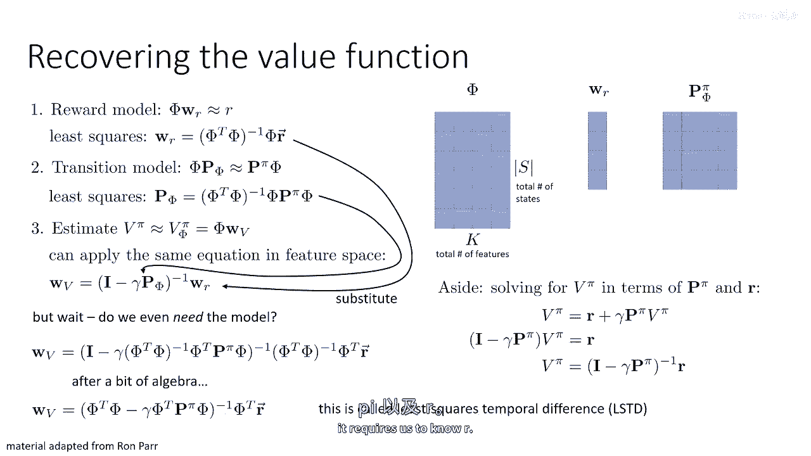

 So what we're going to do next is we're going to replace this all with samples。

 Because once we replace it with samples， we'll get a fully model free way to solve for the weights on the approximation to v pi。

 without requiring knowledge of p pi or r。 So our samples， just like before。

 consist of a bunch of transitions。 So that's our offline data set of transitions， S-A-R-S-prime。

 And what we're going to do is we're going to replace。

 notice how we just replaced the number of rows in our matrix phi， by the number of samples。

 So before we had one row for every state， now we have one row for every sample。

 And we're going to replace p pi phi with the features at the next time step。 Right。

 because we don't know what p pi is， but we do know what S-prime is。

 So we can just evaluate the feature function at S-prime and we can get what we call capital phi prime。

 And we can just substitute that in there。 And similarly， we can replace our reward vector。

 which had one entry for every state， with a reward vector that had one entry for every sample。

 So we just rewrite everything in terms of samples。

 And it turns out that everything still works exactly the same way。 This is sometimes。

 this trick of replacing the set of states with a set of samples is sometimes referred to as the empirical MDP。

 because it's the MDP that is induced by our empirical samples。

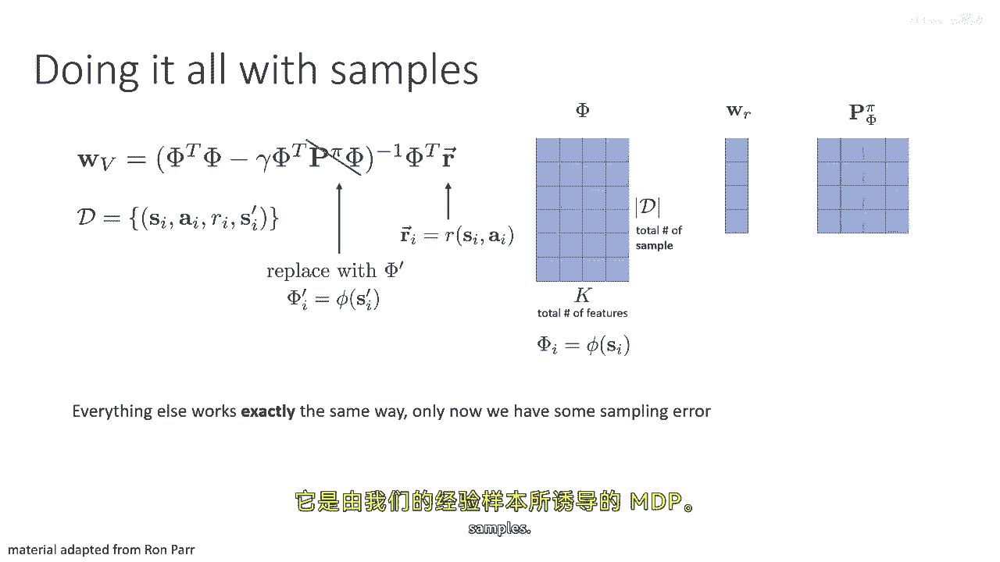

 Everything works exactly the same way， only now we're going to have some sampling error。

 So we can just use this to get a sample-wise estimate with the same exact equation。

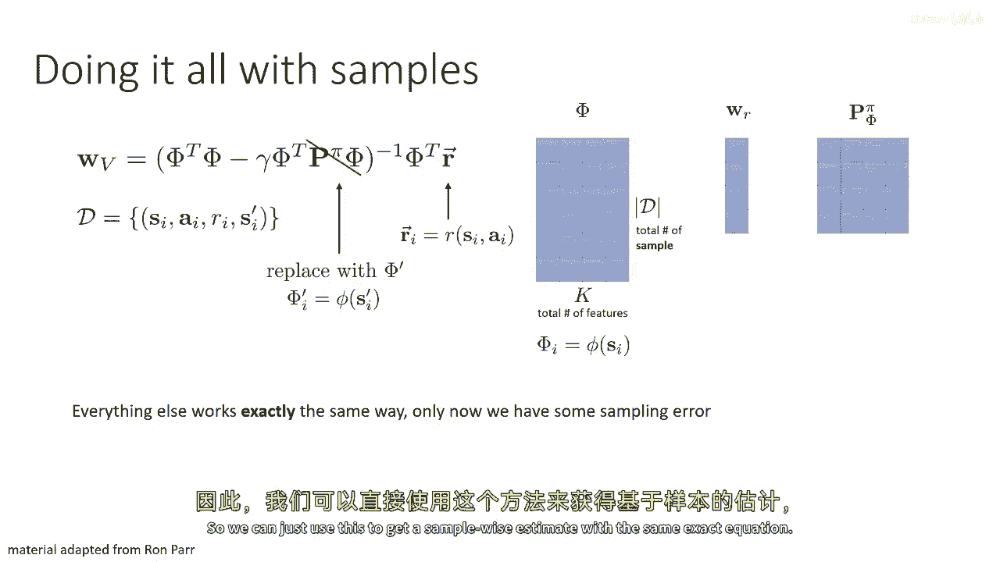

 So now let's turn this into a complete algorithm。 So before we said that we're going to estimate the reward。

 estimate the transitions， recover the value function and then improve the policy。

 But now we're going to do step one， two and three just with this LSTT equation。

 So instead of estimating the reward， estimating the transitions explicitly。

 we're just going to directly estimate the value function using our samples and then improve the policy。

 So the typical policy improvement step would be to recover your policy as the greedy policy under your value function and then repeat the process of estimating the value function。

 The way you estimate， you can estimate your value function is by using those LSTT equations。

 But the problem is that this actually requires samples from pi。 Notice that we said this is P pi。

 So that's actually a little bit of a problem。 So we can use all that stuff on the previous slide to estimate the value function of the policy that collected the data。

 But we can't actually use it to estimate the value function for some other policy because we need P pi and P pi actually depends on pi。

 But we're trying to evaluate some other policy that we're learning。

 not the one that collected the data。 So what we're going to do is exactly the same thing that we did when we talked about value iteration versus Q iteration。

 Instead of estimating the value function， we're going to estimate the Q function。

 So this trick is not going to work for off-line or off-line or off-value functions。

 but it will work for Q functions。

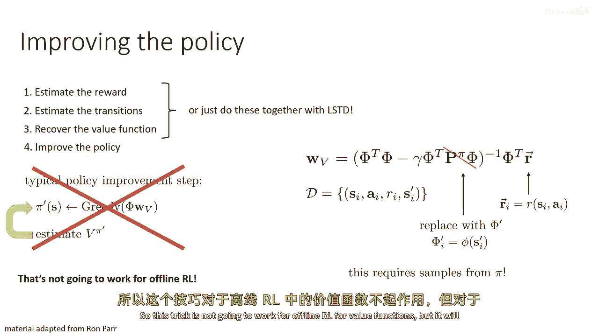

 And that's what gives us least squares policy iteration or LSPI。

 which is an actual off-line or off-line method that we can do with just previously collected data。

 And the main idea is to basically replace LSTD， least squares temporal difference with what we can call LSTD Q。

 which is just LST for Q functions。

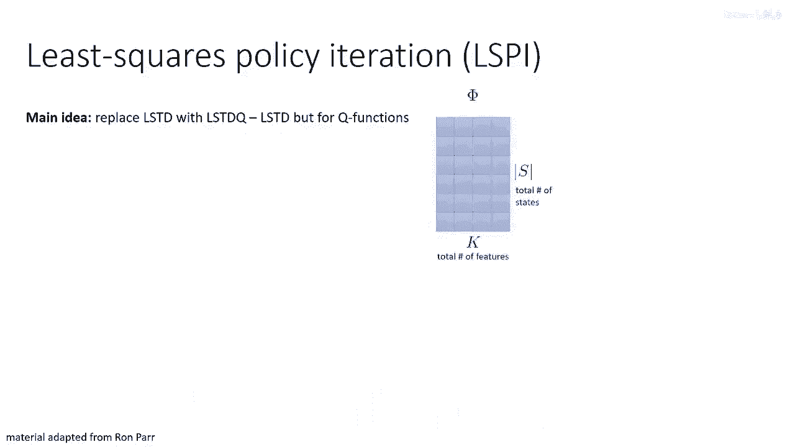

 So now， instead of having a feature matrix for a feature for every state。

 we have state action features。 So the number of rows in the full version。

 the non-sample based version is S times A， and we probably have more features because we need different features for different actions。

 There are a few ways of doing it。 If you have a small discrete action set。

 you could simply have A different copies of your features， one for every possible action。

 So everything else actually stays exactly the same。 So you can still derive the same WQ。 Again。

 I won't go through the massive algebra to do this， but it's exactly the same as it was before。

 So you have the same LSTD equations， but now you use state action features for everything and state action rewards。

 And you can do the same sample based substitution。 So you have your data set of state actions。

 rewards， and next states。 You can compute the reward as a big vector for an entry for every sample。

 You can still compute phi prime， but notice now there's a little subtlety。

 Phi prime is the next feature that you get from taking the action in the data set。

 But then because we're featureizing states and actions。

 we give it the next state in the data set S prime。

 but the action that the policy would have taken at S prime。 Now。

 we don't have to actually evaluate the following state。

 We don't have to know what the dynamics will do for pi of S prime。

 but we need to featureize the action from the policy。

 And this is very similar to the principle that we had in an incubatoration。

 So we're going to featureize S prime and pi of S prime， and that'll give us phi prime。

 So a very important property here is that phi doesn't change as the policy changes。

 but phi prime does change。 For phi prime， we always featureize the same S prime。

 the one we have in the data set， but a different action。

 because that action depends on our policy pi。 So phi prime is actually the only thing in here that depends on pi。

 So you would encode the action of pi， not the action in the data。 So then LSPI proceeds like this。

 Compute WQ for your current policy， let's call it pi K。 And then compute a new policy。

 pi K plus one， which is greedy with respect to WQ。 Right。

 because with WQ you can get a full Q function and therefore you can compute a full policy。

 And then you set your phi prime to be the new feature。

 phi prime feature matrix that you would get with this new policy， pi K plus one。 Okay。

 so this is now a complete algorithm for doing offline RL。

 You would actually evaluate this WQ by just computing the right-hand side of this equation。

 recover pi K plus one， and then set the phi prime to be the corresponding feature matrix。

 Alright， so what's the problem with all this？ Well。

 the issue with actually doing all this in practice is the distributional shift problem that we had before。

 So this linear approach， you know， you can of course redrive this for nonlinear systems and do some kind of iterative thing。

 but it doesn't address the distributional shift problem。

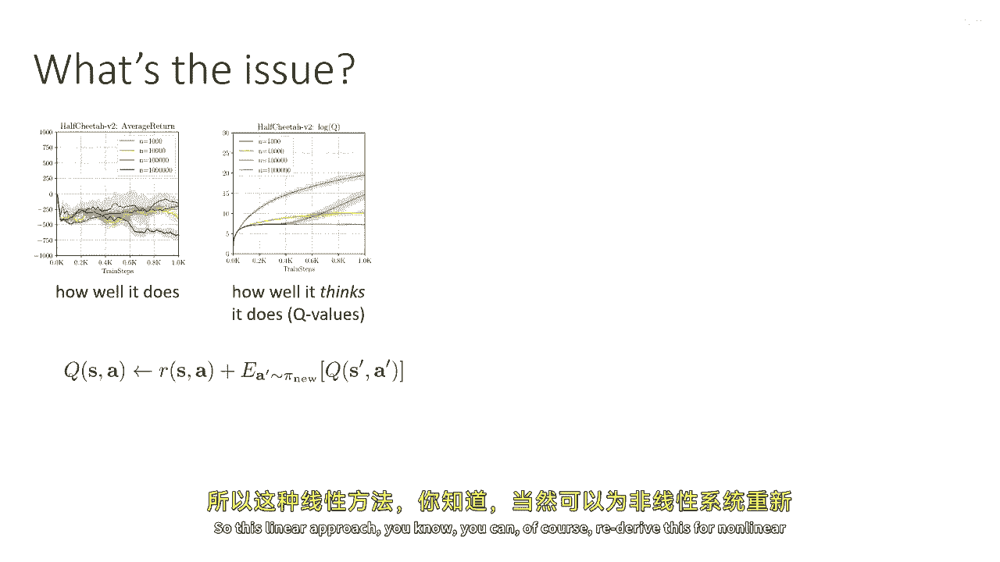

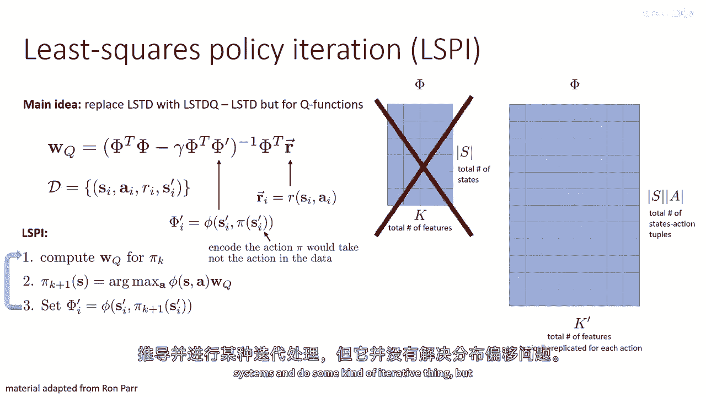

 It doesn't address the distributional shift problem because it's just doing empirical risk minimization at some level。

 violin squares on your training set。

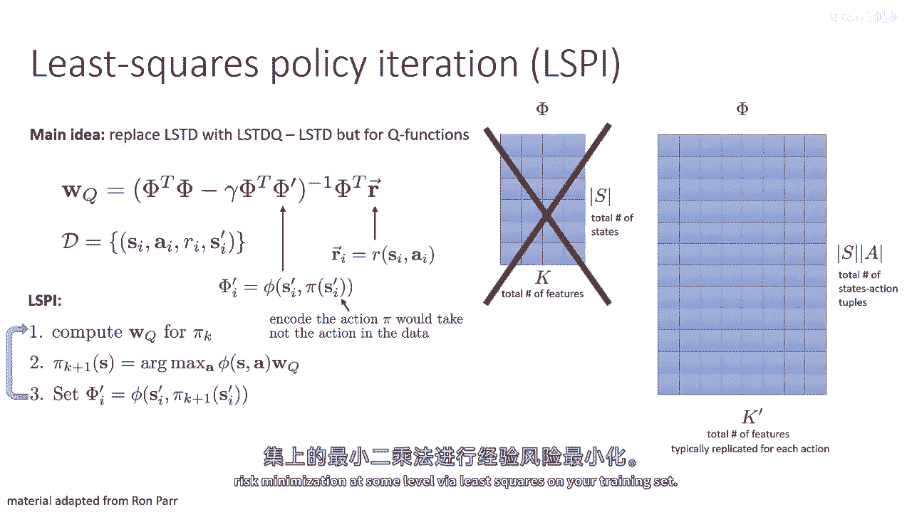

 And that means that all those issues that we talked about before。

 where you're essentially doing this adversarial example discovery by maximizing your policy would still afflict you。

 Where does it afflict you？ Well， it afflicts you in step two， where you take the argmax。

 So， in general， all approximate dynamic programming methods， fitted value iteration， Q iteration。

 etc。 They'll all suffer from this action distributional shift and we have to fix it。

 So it's good to understand these linear methods because they provide a useful tool for analysis。

 They provide good perspective on how we arrived at the techniques that we have today。

 But they don't by themselves really give us a great tool for doing offline RL in the deep RL setting in practice。

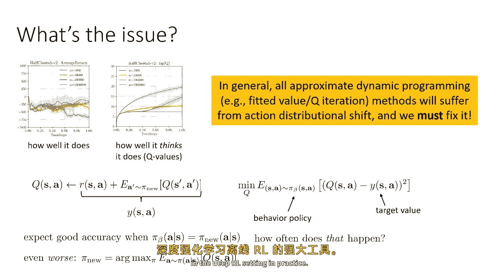

 And how to do that properly is what we'll cover in the next lecture。

