# 【深度强化学习 CS285 2023】伯克利—中英字幕 - P70：p70 CS 285： Lecture 16, Part 4： Offline Reinforcement Learning 2 - 加加zero - BV1NjH4eYEyZ

今天的讲座最后部分，我将以简短的总结结束我对离线强化学习的讨论，一些关于应用和开放问题的讨论，所以，我要在这里讨论的第一个问题是，作为总结的一部分，可能是你们已经思考的一些事情，那就是。

我讲了很多可以使我们的算法离线的算法，你应该实际使用吗，这里是一个大致的草图，一种大概的准则，当然，这并不是关于任何事情的最终结论，而且你的结果可能会有所不同，但是。

如果我试图尝试解决一些新的离线强化学习问题，这里是我会使用的决策树，如果你只想进行离线训练，这意味着你不会进行在线训练，精细调整保守的Q学习是一个不错的选择，因为它只有一个超参数。

并且它被广泛理解和测试，并且在许多不同的研究论文中已经进行了广泛的验证，表明保守Q学习在纯离线模式下工作得很好，隐含Q学习也是一个好选择，因为它也适用于离线和在线模式，因此更灵活，但它有更多的超参数。

如果你想仅在离线训练，然后在线微调，那么优势加权演员批评者是一个好选择，它在这个特定领域中被广泛使用并经过良好测试，保守Q学习实际上不是一个好选择，因为虽然保守Q学习在离线模式下工作非常出色。

它调优的效果并不好，因为它倾向于过于保守，隐式Q学习是离线训练的好选择，然后通过实验进行在线调优，这似乎工作得很好，而且实际上它似乎比优势加权演员批评者性能更好，尽管它并没有存在太久。

而且它并不是很广泛，嗯，未被验证，如果你有在您领域训练模型的好方法，然后，你可以选择基于离线强化学习的模型方法，但现在这取决于特定的领域，所以，基本上取决于您有的特定动态，可能很容易训练出一个好模型。

或者可能非常困难，但如果您对能够训练出一个好模型有信心，组合是一个不错的选择，它是当前最佳性能的一种基于模型的离线强化学习方法，它与SQL具有类似的属性，但它受益于模型，所以。

你可以把combo看作是基本上的SQL，但是，有了模型，但是，在你的领域总是很难训练出一个好模型，所以你首先需要检查你是否实际上可以获取到好模型，轨迹变换器可能是一个不错的选择。

因为它有非常强大和有效的模型，缺点是，训练和评估它极其计算密集，而且，因为它不是学习一个策略，在地平线上还有一些限制，所以，如果你有非常长的时间范围，一种更动态的方法，像动态规划受益的算法可能仍然更好。

所以这是大致的样子，我现在建议的规则之一是，离线强化学习是一个发展非常快速的领域，而且到明年一些可能会改变，也许新的方法会出现，或者对当前方法有更深入的理解，但这是大致的样子，嗯，你知道。

截至我录制这次讲座的时间，那是在2021年晚些时候，现在嗯，下一个，我想讨论的是一些应用的讨论，和一些讨论为什么，离线rl可以是一个非常强大的框架，用于获取强化学习，在真实世界中真正工作。

现在通常你通过模拟来做强化学习，在这种情况下，基本上你不必担心这个，如果你有幸拥有一个好的训练器，在线强化学习是完全可以的，但如果你想要直接在真实世界中进行强化学习，如果你想要使用在线强化学习。

这可能是你的过程可能会看起来像，第一步是你可能会对任务进行仪器化，以便你可以运行强化学习，所以你可能需要一些安全机制，你知道你是在做机器人还是算法交易。

你需要一些东西来确保你的策略探索不要做出疯狂的事情，你可能需要投入一些工作到自主收集中，所以尤其是在机器人学中，你知道，也许你可以尝试一个任务，然后你需要再试一次，所以你需要在试验之间重置。

你需要小心设计离线强化学习的奖励，你可以只是在数据集中标记奖励，你可以，例如，你知道可以众包，但是，对于在线rl，你真的需要一个自动化的奖励函数，这意味着你需要编写一些代码或者训练一些模型来做到这一点。

然后，你需要等待很长时间让rl运行，而且，这个过程可能会相当手动，因为你可能需要一种安全监控，然后，你需要在算法中做一些小的更改来改进它，然后，你需要再次做所有这些事情，所以，迭代过程非常慢。

因为每次你更改一些东西，你都需要重新运行整个过程，当你完成时，你将所有这些都扔进垃圾中，以开始下一个任务，所以，如果你训练了一个机器人来，你知道，制作一杯咖啡，现在，你想要制作一杯茶，通常。

你会将这些所有都扔掉，重新开始与离线rl，你将收集你的原始数据集，这可能来自各种不同的来源，它可以是人类数据脚本控制器，它可以来自一些基础政策，甚至可能是所有这些的上述组合。

你可能仍然需要设计一个奖励函数，但你也可以让人类只是标记奖励，因为你只需要在训练数据上需要奖励，然后，你用离线rl训练你的政策，然后，你可能在算法中做一些小的更改，但如果你更改了算法。

你不需要重新收集你的数据，所以，这个过程变得轻量级得多，你可能选择收集更多的数据并将其添加到一个增长的数据集中，但再次，你不需要重新从 scratch 收集数据，所以，任何你收集的。

你都添加到你的数据集中，你追加它，你聚合它，然后，你现在只是重复使用它，为了全面披露，你需要定期运行你的政策在线，主要是要看看它做得如何，但这比在线训练要轻得多，然后，如果你有另一个项目想在未来做。

在类似的领域，你可以保留你的数据集并再次使用它，所以，如果你真的需要做真实的世界rl训练，如果你没有模拟器，离线过程可能会更加实际，我将以几个我从自己研究中的例子来说明这一点，嗯，从一些。

从我自己的研究中，与谷歌的同事一起。

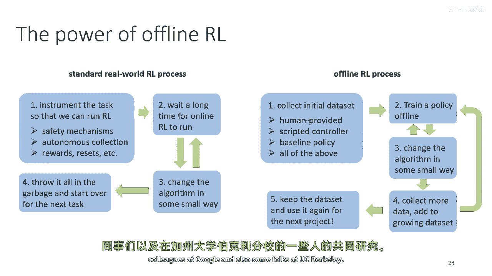

还有伯克利加州大学的一些人，所以这是有趣的视频，讲座的研究部分，这并不是真的，你知道，你需要知道的关键材料，它更，只是一些例子和一些有趣的视频，希望能让你娱乐，嗯，正如我在周一的讲座中提到的，嗯。

在2018年，我们进行了一项大规模的现实世界强化学习项目，最近在2021年，我们扩展了这个系统，这也是在谷歌完成的一些工作，以处理多个任务，多任务部分并不重要，但只是想让你了解涉及的内容。

有十二项不同的任务，数千种不同的对象和几个月的数据收集，所以这是一个真正的手动努力，以，收集大量的数据，使用许多机器人，但我们做了那个之后，我们提出了一个假设，这个特定的假设对于这个讲座并不重要。

但只是想让你对这个过程有一个感觉，所以我们的假设是，我们能否学习这些任务，这些十二项任务，而不实际使用任何奖励。

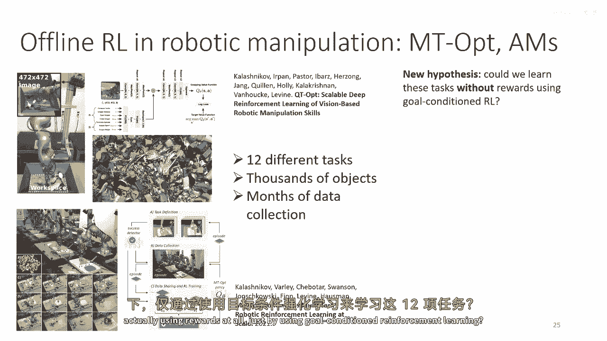

只使用目标条件强化学习，所以这里的想法是，而不是给机器人提供它正在执行的任务的真实奖励函数，我们只给它一个目标图像，并自动分配奖励，基于它达到的最终状态与目标图像的相似性，好的，这只是一个假设，我们有。

这是一个机器人中心的假设，它并不是真正关于离线RL的，然后我们做的是，而不是收集所有数据，我们只是重用我们已经有的这些十二项任务的相同数据，但训练了一个政策，而不是真实奖励函数。

我们实际上可以评估我们的假设，没有任何新的数据收集，这就是目标条件政策，目标是在右下角显示，你可以看到机器人做得相当好，这些抓取任务相当简单，这里是目标图像，只是有一个物体。

它理解这意味着它必须去捡起来，嗯，但是，我们也可以做一些，嗯，重新排列任务，所以那接下来就要来了。

所以在这些重新排列任务中，目标图像中有胡萝卜躺在盘子上，然后机器人理解，这意味着他需要捡起胡萝卜并将其移动到盘子上。

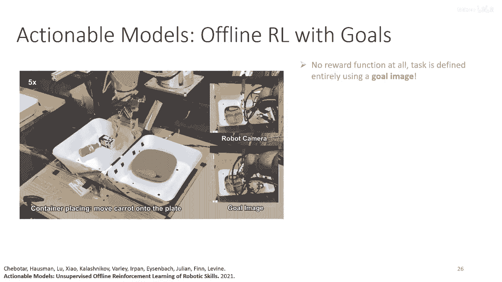

所以这里没有任何奖励函数，所有任务都完全使用目标图像来定义，一个井。

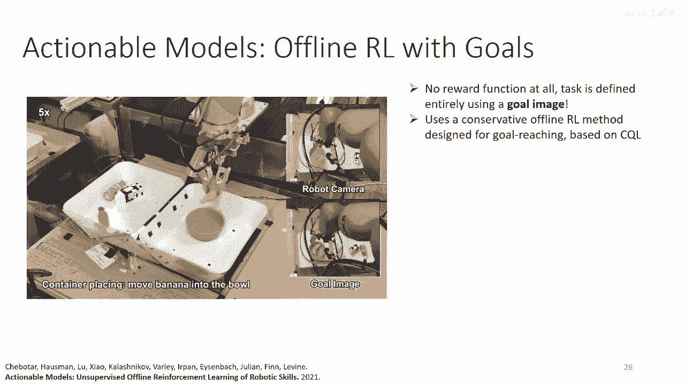

没有手工设计的奖励函数，我的意思是有一个自动化的奖励函数来达到目标，方法与保守Q学习非常相似。

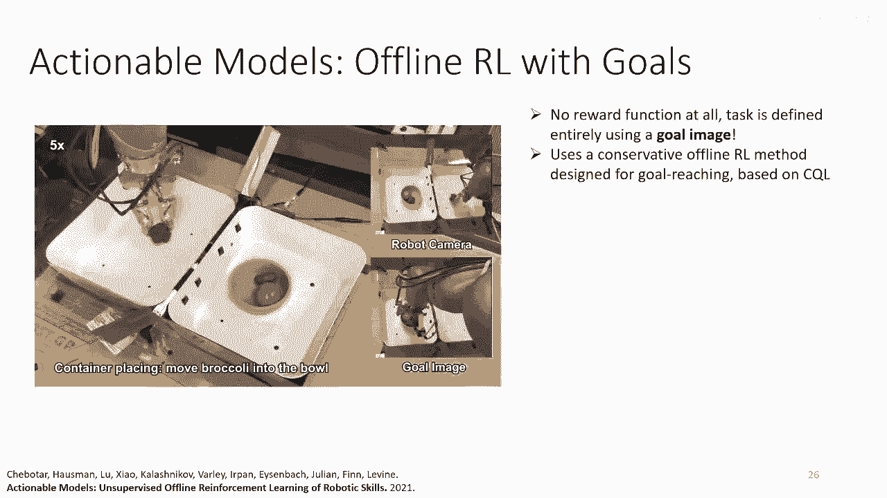

只是适应于目标达到，与这个有关的一个有趣的事情是。

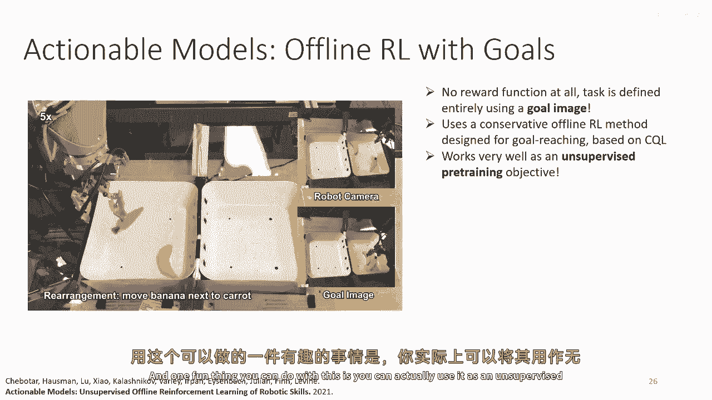

你可以实际上使用它作为无监督预训练目标，所以，就像你可能在NLP中预训练语言模型一样，然后对它进行微调以完成任务，你可以在大数据集上预训练这个目标条件东西，然后，使用任务奖励对它进行微调。

这导致了一些相当显著的改进，所以这挺不错的，在这种情况下，你可以在没有收集任何新数据的情况下验证一个新的假设，即目标条件强化学习，但你可以直接在现实世界中测试它，这是另一个机器人的例子。

所以在2020年和格雷戈里·卡恩，谁当时在这里的伯克利是博士生，收集了大约40小时的无人驾驶数据集，使用小型地面机器人，嗯，在2020年初，在2020年底，肖德鲁夫使用了相同的数据。

另一个博士生使用相同的数据构建了一个目标条件导航系统，这个系统可以做一些事情，如送信或送比萨，他不需要收集任何新数据来做到这一点。

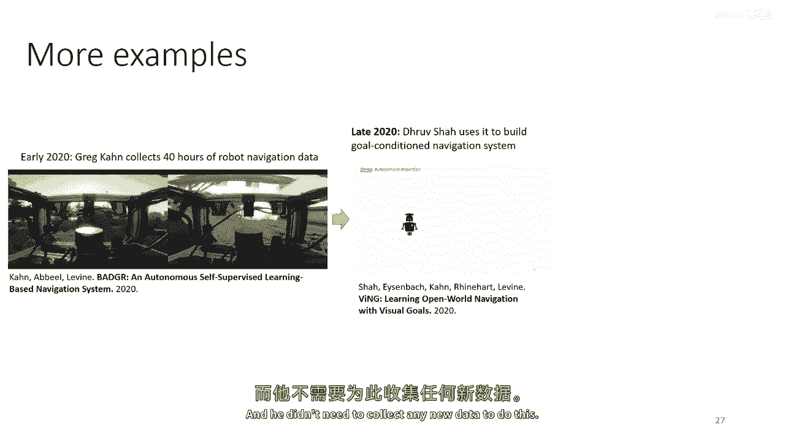

他可以简单地重用相同的数据与离线强化学习，在2020年初，一。

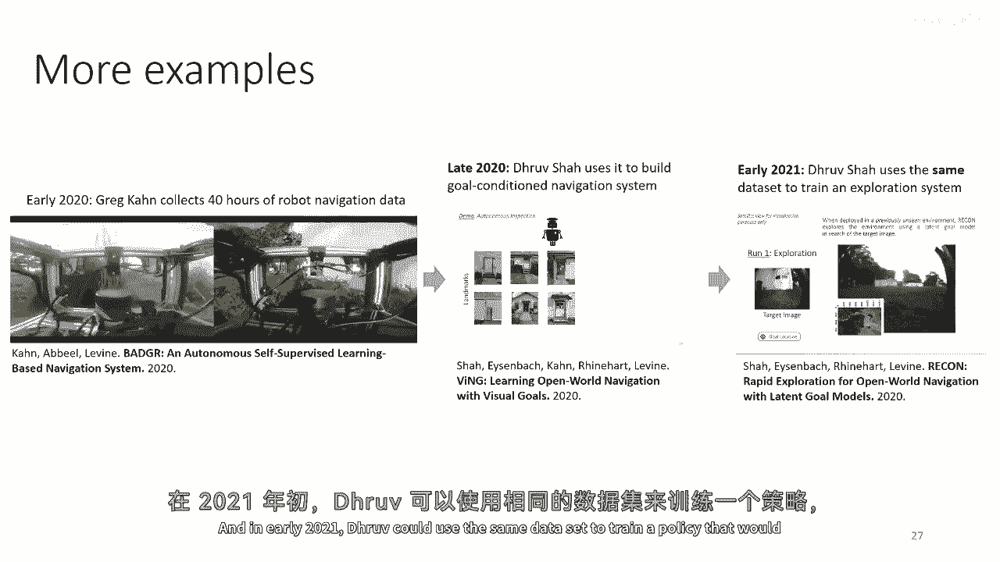

Droove可以使用相同的数据集来训练一个策略，这个策略将学习在环境中搜索特定的目标，并且本工作中使用的技术与在本讲座中覆盖的算法有所不同，但在基本原理上，离线强化学习。

能让你在真实世界中快速测试这些假设，但是，如果没有额外的真实世界数据收集。

在我看来，基本上展示了，使用此方法快速测试新算法思想的一种优势。

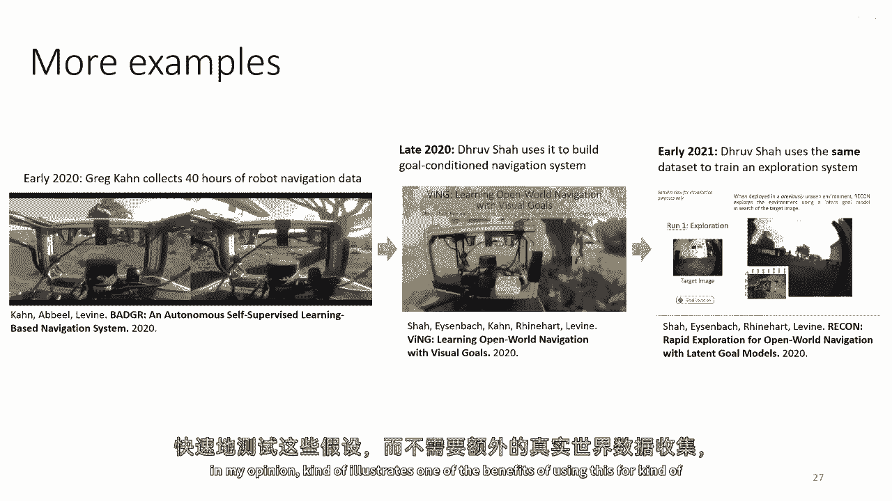

你知道，即在坚持使用真实数据的同时。

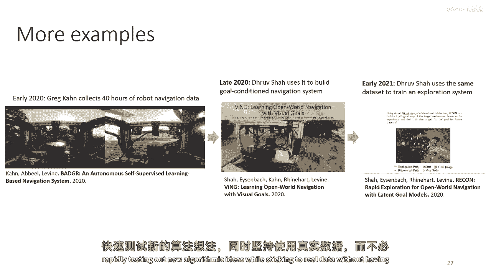

能够快速测试新的想法，无需完全依赖模拟，现在可以了，让我们谈谈一些收获，一些结论，并且可能还有一些未来的方向，所以离线强化学习的梦想是你可以收集一个数据集，使用任何策略或策略的组合。

然后你可以在这个数据集上运行离线强化学习来学习策略，然后可以直接在现实世界中部署以进行医疗诊断，对于算法交易，对于物流，驾驶，你有什么，然后有当前的强化学习算法，那里还有差距，所以这里有一些事情，嗯。

这是，你知道，部分地，这是为了你们 guys 来思考项目想法的，也来思考开放问题，一个开放问题是工作流程，所以如果你在做监督学习，嗯，你有一个训练验证测试分割，所以你对如果你在你的训练集上训练你的策略。

并且在验证集上表现良好，那么它可能在现实世界中表现良好，所以知道，在监督学习中，你通常甚至不需要在你的真实环境中部署你的策略，你可以从你的验证集或测试集中得到一个相当好的理解，仅仅从你的验证集或测试集。

在离线强化学习中，这是什么样的等效物，这些天在离线强化学习中，如果你想知道你的策略在真实世界中的表现如何，如果你，如果你想理解它在真实世界中的表现如何，你将实际上部署它并运行它，训练是离线的。

但评估仍然是在线的，这可能是昂贵的，甚至是危险的，有人在这方面做了工作，我们实际上，嗯一些，一些我的学生有一篇关于这个的论文，叫做离线无模型自由机器人强化学习的工作流程。

但是对这个的理解仍然有很大的差距，还有许多理论是缺失的，我们对应该如何进行还有很大的基本理解，我们应该在没有在线评价的情况下结构化我们的侧边工作流程，这需要大量的工作，像离线政策评估这样的经典技术。

Opie也达到了这个阶段，但op方法本身需要超参数调整，这反过来也往往需要在线评估，所以这是一个大的开放问题，在离线强化学习中，统计保证是一个重大问题，所以你知道，涉及到分布漂移的许多界限和结果。

但它们通常很宽松且不完整，然后，当然，在大规模应用中的可扩展方法，所以从原则上讲，离线强化学习可以应用于广泛的设置，在实践中，它仍然没有被广泛应用，我认为。

对真实世界应用中的限制和约束有更深入的理解真的很重要，以推动我们走向正确的方向，所以我已经讨论了一些在机器人中的例子，但除了机器人之外，还有很多事情，这些事物可以应用于。

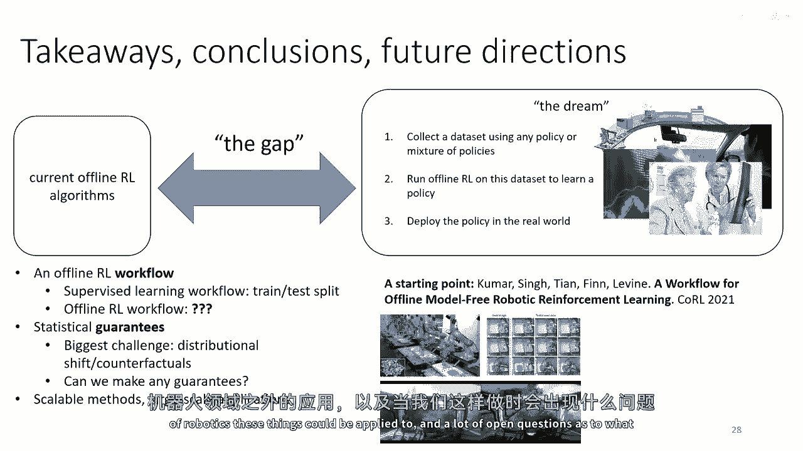