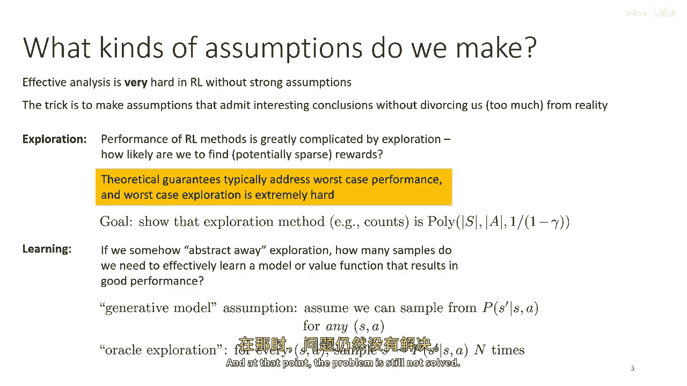
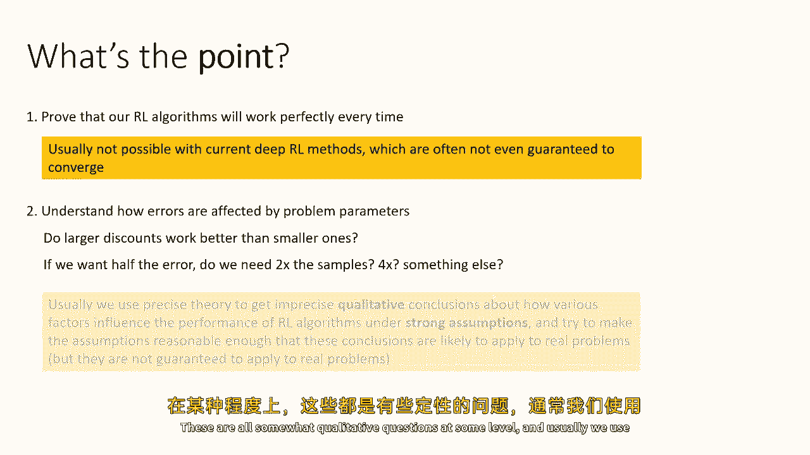
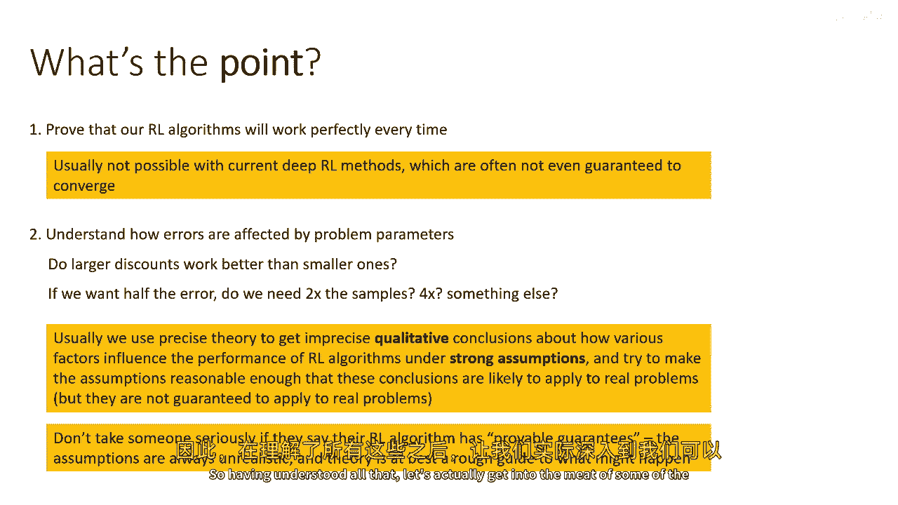
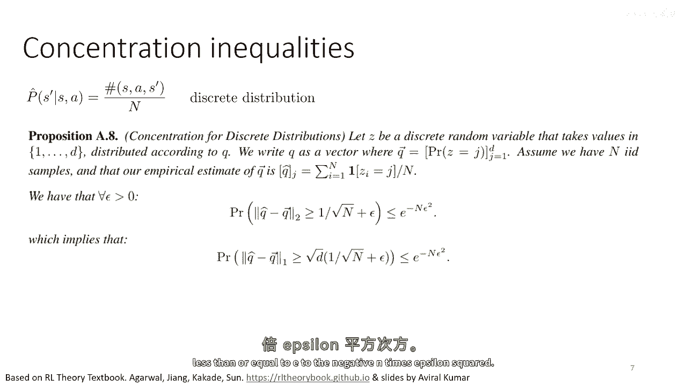
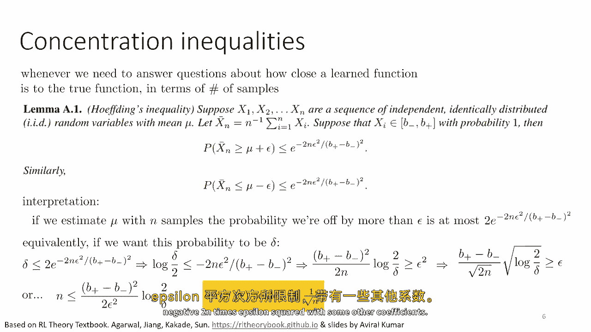
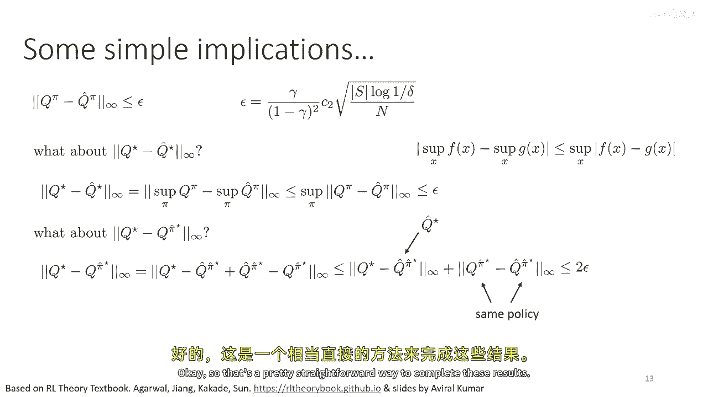

# 【深度强化学习 CS285 2023】伯克利—中英字幕 - P71：p71 CS 285： Lecture 17, Part 1： RL Theory - 加加zero - BV1NjH4eYEyZ

欢迎参加cs two eighty五的第十七堂讲座，今天我们要简要讨论强化学习理论，你知道这是这门课程中唯一的理论讲座，所以我不会深入探讨，我的目标主要是主要向你们传达一种感觉。

对于在强化学习算法中可以进行的理论分析种类，以及从这种分析中可能得出的结论，所以我们通常问什么问题，嗯，当我们在做强化学习理论时，那么，有很多不同的问题，但是，这里有一些常见的问题，如果你有一个算法。

一种某种形式的强化学习算法，并且它被提供n个样本，并且它使用，并且它使用那些n个样本，在每次k次迭代中，这个算法的结果有多好，'好'意味着什么，嗯，假设我们在做Q学习。

我们可能会问学习到的Q函数q hat k的值是多少，经过k次迭代，q hat k与真实最优的Q函数q star的差异是多少，我们能否，例如，证明q hat k与最优Q函数q star在某些范数下的差异。

不超过epsilon，通常这些算法有一些随机性在其中，例如随机性和我们如何生成样本，所以我们不能真正保证我们总是有一个差异，小于等于epsilon，所以通常我们会有一个保证，那就是它小于。

或者等于epsilon，至少有一些概率一减去delta，其中delta是一个较小的数字，所以通常我们想要证明如果这个我们有至少一些样本，其中样本的数量取决于epsilon和delta的一些函数。

并且通常我们想要一个行为良好的函数，例如，我们可能想要delta的log增加对数地，另一个我们可以问的问题，这是一个稍微不同的问题，在k处由q函数诱导的政策如何影响，迭代与最优政策在q值上的差异。

所以让我来解析一下这个符号，所以q pi k是真实的q函数，意味着由政策pi k诱导的真实总奖励，其中pi k是q hat k对应的政策，所以询问q pi k和q star之间的差异实际上等于询问。

政策在迭代k处的预期奖励与最佳预期奖励之间的差异，与您在k处可以获得的最佳预期奖励相比，所以这实际上是一种遗憾的度量，对，所以q pi k并不等于q hat k，因为你可以，例如。

有可能错误地过高估计q值，Q pi k是针对q hat uk对应的政策的真实q值，这通常是argmax策略，我们还可以问其他问题，另一种我们可以问的问题类型是，如果我使用特定的探索算法。

我的悔恨将会有多高，这稍微有些复杂，但通常你知道我们可能想要显示那个，例如，某种探索程序会给你悔恨，那就是对t的指数，所以这里我所有的实际上是界限，完整的，对一个上界置信区间探索方法的界限版本。

你可以看到它包含了一个与delta乘积的线性项，但是δ是一个非常小的数字，然后大部分糟糕的东西来自这个，嗯，第一个术语， which is um， which goes as the log of t。

但是当然，我们还可以问许多其他问题，所以这些只是几个例子，我们将主要关注，嗯，样本复杂性类型的问题今天，嗯，所以这些第一个几个，但是请记住，还有其他问题，现在当我们在做强化学习分析时。

我们通常需要做出相当强的假设，所以在最一般的设置中分析完整的深度强化学习方法，通常不可能，嗯，没有强假设，我们的分析效果非常困难，技巧在于做出允许有趣结论的假设，而不使我们与现实过于分离。

所以有一些例子，嗯，在探索中，嗯，你知道，强化学习方法的性能大大受到探索的影响，因为嗯，你学习得多好，你需要多少样本非常强大，这取决于你找到潜在稀疏奖励的可能性，一。

由于理论上的保证通常关注最坏情况下的性能，并且最坏情况下的探索极其困难，我们通常不想将探索的分析与样本复杂性的分析结合，一起与处理像近似误差或采样误差这样的东西的样本复杂性分析，所以在研究探索时。

我们想要显示某种探索方法是好的，通常对于探索也是好的，意味着它意味着它将学习到一个好的策略，一个与最优策略在时间上偏离一些epsilon的策略，那就是多项式的，通常在状态的数量上，动作的数量。

以及在一减去伽马除以一上，这就是时间步长，但是与研究探索分开，也可能研究学习，所以如果我们 somehow 抽象掉探索，如果我们 somehow 假装探索是，你知道效果很好。

我们需要多少样本才能有效地学习一个模型或价值函数，使其产生良好的性能，并且这是一个稍微不同的问题，因此，也许我们最好将探索和学习分开，因为如果我们总是一起分析探索和学习，往往探索的难度会被主导。

但最坏的情况探索极其悲观，你知道，典型的探索并不像最坏情况那样糟糕，如果，例如你有一个良好的奖励形状，所以在许多情况下我们可能想要抽象掉探索，基本上消除它，这样我们就可以研究学习的样本复杂性。

我们可以这样做，例如，基于生成模型假设，所以这种假设只是告诉你实际上你不必探索，你可以在任何MDP中采样你想要的任何状态动作，无论你想要多少，基本上对于任何状态动作元组，这当然不现实。

这不是真实强化学习算法做的事情，但是使用这种假设可以非常方便，因为它允许我们研究学习实际上有多难，如果我们假设探索是容易的，对，所以，实现这一目标的一种方法是基本上说。

"我们将对每个状态动作元组进行Oracle探索"，"我们将进行采样"，嗯，"P" 的中文翻译是 "P"，当s为n时，s'为s的n次方，所以我们就简单地像地毯式轰炸一样，"整个mdp"，"然后让我们"。

"到那时，问题仍然没有解决"。

我们还需要研究采样错误的影响，好的，所以我们有一些问题，我们有一些假设，但在我真正深入分析之前，嗯，我想讨论的一件事是这一切的目的是什么，所以你知道，我们可以说。

也许这一切分析的目的就是证明我们的rl算法会完美工作，每次，目前深度强化学习方法通常不可能做到这一点，当我们把所有的花哨功能都放进去，所有的贸易技巧，我们甚至不能得到算法，那些每次保证收敛的算法。

更不用说工作完美，另一个目标是也许理解错误如何受问题参数的影响，例如，更大的折扣比小的更好，一个大折扣是否更容易解决一个问题，还是一个小折扣更容易解决一个问题。

是一个大状态空间更容易解决一个问题还是一个小的，我们应该取更多的迭代还是更少的，如果我们想要一半的错误，我们是否需要两倍的集合，样本的数量，或者是否需要四倍于样本数量的数字或者别的什么。

这些问题在某种程度上都是定性的。

并且通常，我们使用精确的理论来获取不准确的结果，关于各种因素如何影响强化学习算法性能的定性结论，在强假设下，然后，我们试图使这些假设合理，足够使得这些结论有可能应用于实际问题。

但它们并不保证适用于实际问题，所以理解这一点非常重要，我认为有一种趋势，有时候人们会说好吧，我的理论结果证明我的算法每次工作都是可行的，或者我有一个可证明的，你知道，嗯，可证明的好RL方法。

这是胡说八道，我们从来没有一个可证明的好RL方法，而且任何告诉你如此说的人都不诚实，强化学习的理论，实际上，在大多数机器学习中，实际上是关于获取定性和 somewhat heuristics 的结论。

通过深入分析简化的特例，所以不要对某人太认真，如果他们说算法有可证明的保证，它从来没有，假设总是不现实的，而且理论最多是指导可能发生的粗略指南，这并不是机器学习的独特之处，当然在其他领域也是一样的。

例如，在物理学，你可以有一些理论来描述理想引擎的效率，现在，当前的物理理论不会让你分析汽油发动机的实际燃油效率，在现代汽车中，它太复杂了，什么，它会告诉你，是关于理想化系统版本限制和潜力的一些指导。

这就是我们在强化学习理论中做的事情，我们提供了关于理想化算法版本限制和潜力的定性指导，"我们实际上在使用"，当我们想出一个主意时，我们关注的是，"理论结果并不能保证"。

"该方法将完美地具有特定的样本复杂性"，我们关注的是当问题参数发生变化时，这种行为的变化如何。"随着状态空间的增大，它是否变得更加高效还是更低效？"，随着我们增加"，我们需要更多的迭代还是较少的迭代？

"，"折扣因子或期限"，"并且这些种类的定性问题"，嗯，实际上它们非常重要，它们可以指导我们选择参数和算法设计决策，通过理论分析，我们可以对这些事情得到一些定性的指导，所以理解了所有这些。

让我们实际上进入一些我们可以做的分析中的部分。

我们将从一些基本的样本复杂性分析开始，我在这次讲座中要介绍的很多，遵循alec agarwal的rl理论教科书，以及底部的幻灯片链接的其他人，以及averil kumar去年制作的一些讲座幻灯片。

所以我们将从神谕探索假设开始，意味着对于每个状态动作元组，我们可以采样下一个状态s'n次，我们开始的算法是一种非常基本的基于模型的算法，我现在使用基于模型的术语比较宽松，这实际上是，你知道。

一种非常理想化的算法，所以我们将要，我们将要做的是，我们将估计转换概率，P(s'给定s)仅由我们过渡到s'的次数来计算，从s到s'的过渡，好的，一种非常简单的表格估计策略，因此，在这里没有函数近似。

没有神经网络，我们只是在做表格估计，我们实际上是在计算我们最终落在特定状态s'的次数，这个，当然，只有当状态和动作都是离散的时候，这才 make sense，然后我们可以构建一个包含所有数字的表格。

然后接下来我们要做的就是我们首先会专注于政策评估，所以给定一些固定的政策 pi，让我们使用 p hat 估计 q 函数 q hat pi，所以这种理想化的算法接受一些政策。

然后它使用 p hat 精确地估计 q hat pi，q hat pi 不是精确的 q 函数，但它是在 p hat 下精确的 q 函数，因为p完全决定了mdp，然后我们会做类似的事情，你知道。

使用Q值迭代来估计q hat pi，所以第二步是精确的，但是使用不准确的模型p hat，这是一个非常简单的算法，我们的目标基本上就是要理解由p hat不完美引起的误差，因为p hat不是完美的事实。

现在让我们看，大概，这里我们正在做的事情，当然，这是一种相当简单的强化学习方法，这不是我们通常做强化学习的方式，而且，这项分析的主要目的是真的，理解样本误差在估计p hat时如何传播到q函数中。

为了更好地理解这一点，你知道，在监督学习理论中，有，我们有很多工具可以使用来解答问题，比如如果我试图估计一个像p hat的量，并且我有一些样本，我的估计有多准确，通过引入第二步，我们真正试图做的是。

我们试图将这些标准的监督学习结果，并试图通过rl机器将它们传递说，从监督学习中采样误差的界限，如何转化为q函数的采样误差界限，当那个q函数是某种形式的贝尔曼备份的结果时，所以这就是我将要呈现的分析风味。

所以我们要问的问题，q hat pi与q pi的差距有多近，意味着我们将估计我们的策略pi的q值，它与那个策略的真实q值的差距有多近，所以理想上我们想要显示的是在所有状态和动作上。

如果我们取q pi和q pi hat之间的无限范数的差异，那个无限范数应该被epsilon以一定的概率一减去delta所绑定，如果样本数量大于某个关于epsilon和delta的函数，希望这是一个。

这是一个很好的函数，一个行为良好的函数，它不是指数函数，也不是什么疯狂的东西，无穷范数就是最大值对吧，所以如果你看到我写无穷范数，它实际上意味着就是论据中两个东西的差异对于最坏情况的，状态动作元组。

使用无穷范数是很好的，因为它给我们提供了一个最坏性能的上限，现在我们可以问另一个问题，如果我们使用p hat学习这颗星，它的距离有多近，所以如果我们不僅僅評估給我們的策略，而是試圖實際運行，你知不知道。

Q值迭代可以實際找到在p hat下的最優秀q函數，它將多接近真實的最優秀q函數，所以q星和q hat星的差異在哪裡，我們理想上希望看到那個被一些epsilon綁定的。

所以q hat星是我們在學習模型下學習的最優秀q函數，這基本上就是我們使用這種方法做rl時發生的事情，正如我之前提到的，我们也可以问得到的政策有多好，这与之前不同，所以如果我们取政策π帽子。

这相当于q帽子星，然后我们取π帽子的真实q函数，这与q星意味着有多不同，我们通过运行得到的政策有多不优，嗯，在p帽子下的值函数迭代，然后那个最后一个问题实际上是衡量rl性能的一个关键问题。

因为那真的告诉我们在模型p hat下，政策的性能会比最佳政策差多少，比我们在任何地方都能得到的最佳政策差多少，好的，现在发现实际上第一个问题，政策评估问题给了我们一个工具，非常有效地回答其他两个问题。

所以我们将主要关注第一个问题，给定政策π，q hat π与q π的距离有多近，然后我们将看到如何利用那个工具，来回答其他两个问题，好的，在开始之前，嗯，让我们介绍一些监督学习理论中的标准工具。

所以所有这些分析都涉及到，样本数量如何影响估计某些量的误差，在监督学习中，我们有不等式，允许我们限制估计某些量的误差，使用一些样本数量，这些被称为集中不等式。

因为它们量化了我们对某些随机变量估计如何快速集中在真实值周围的程度，嗯，该变量的期望值，所以每当我们需要回答关于学习函数如何接近真实函数的问题，以样本数量为衡量标准，我们使用集中不等式，其中。

最基础的集中不等式之一，并且通常是如果你学习机器学习理论，首先会学到的，是霍廷的不等式，所以霍廷的不等式的完整陈述在这里，一，但是，它稍微有些模糊，但是，它有一个非常简单的解释，所以，让我描述整个陈述。

然后，我会提供一些关于它真正含义的直觉，所以，假设x1和x2到xn是一系列独立的，具有均值mu的同分布的随机变量，x1到xn怎么样，这些是你的样本，所以你有一些真实的分布，并且真实的分布有一个均值μ。

我们对那个分布实际上一无所知，我们就说它有一个均值μ，然后你从那个分布中抽取一些样本，让x bar n是样本的均值，所以x bar n是所有小x值之和除以n，所以它是平均值，现在。

这就是你对平均值的估计对吧，真实的平均值可能不匹配这个，如果你只生成了像两个样本这样的数据，将它们平均起来，这不能给出它们的真实平均值，你可能会引入一些误差，因为你的样本太少。

所以中心极限定理做的事情是，它量化了你随着n的增加将得到的误差量，所以假设啊，每个样本都在从b-b到b+的范围内，对吧，所以这就意味着啊，无论他们的平均值是多少，或者他们的分布是什么。

他们永远不会小于b减去，他们也永远不会大于b加上，然后我们有，嗯，以下两个结果，你的样本基于一个估计的平均值x bar n，大于或等于真实平均值加上epsilon的概率，那就是那就是，最多。

"e的负二次方除以b，加上或减去b的平方"，所以，这意味着你样本的概率是，"基于估计的平均值与真实平均值存在差异"，在正方向以ε为步长，不超过e的负二次方，"并除以b的平方加上b的平方减去的平方"。

"而且这实际上非常好"，这表示你犯错误的概率大于epsilon，"随着样本数量的增加，呈指数级下降"，"同样，你也有一个另一边的限制"，"你估计值小于mu减去epsilon的概率也同样小于"。

等于或等于epsilon，等于负二n的epsilon的平方除以b的平方加加b的平方减减，所以这描述了你的估计x bar n如何快速地围绕真实均值mu集中，因为当epsilon趋近于零时，嗯。

那么你的估计将接近mu，在这里我们看到你epsilon偏离的可能性，你估计偏离mu超过epsilon的可能性，现在這有幾個意義對吧，所以如果我們用n個樣本估計mu，我们离误差ε超过概率的最大值是。

这个不等式右边的东西，我们可以等价地重新解释为，如果你想要这个概率是δ，所以如果你想要离误差ε超过概率的最大值是δ，意味着你的错误小于ε的概率至少是1-δ，然后你可以简单地解出δ。

所以你可以说我想要δ小于或等于2e的平方，到负2和ε的平方除以b加上b的平方减去ε的平方，为什么有两个2是因为你可以离误差，要么在正方向上，要么在负方向上，然后你可以解出delta。

所以你可以两边取对数，然后你可以做一些代数，重新排列这些东西，所以在第一步中我做的是两边都除以二并取对数，然后在下一步中我做的是两边都除以b加或减b减，平方除以2n并两边取负，所以这改变了小于或等于。

大于或等于，然后你取平方根，你看到你需要b加减b减去除以，平方根的两n乘以对数平方根，二除以delta要大于等于epsilon，所以如果你想要一些误差epsilon的概率delta。

或者你想要顺序小于等于epsilon的概率一减去delta，那么您需要的样本数量将按平方根的n缩放，或者你也可以用函数来表示n在epsilon和delta中的术语，同样的。

只是做一些代数操作来将n放在一边，你可以看到，嗯，你知道，如果你有这些样本数量，那么你将至少有误差epsilon的概率不超过delta，所以从这个中你可以得到的结论之一，是错误与一除以平方根的n成正比。

这非常方便，所以希望这可以给你一些关于这些浓度不等式的工作原理的想法，你写下一些描述你离误差epsilon的概率的方程，然后你可以操纵那个方程来解决delta的概率，或者来解决样本数量。

在我们的强化学习分析中，很多情况下，我们关心的是估计类别变量的概率，所以p(s'给定s)是一个对类别变量的分布，不是一个实值变量，所以，霍夫林的不等式适用于估计连续值随机变量的平均值。

但在这里如果我们估计p hat，我们实际上关心的是我们估计类别变量概率分布的准确性，在这种情况下，一个类似的浓度不等式可以为此得出，让我们说z是一个离散随机变量，它取值在一，通过d，所以d是d的基数。

d是可能的值的数量，它们按照q分布，所以q是一个向量，所有元素都大于零，并且和等于1，在q中有d个值，所以如果你把它写成向量，其中第j个元素是，z取其jth值的概率，并假设你有n个独立同分布的样本。

并且empirical估计是由基本上计数你获得每个值的次数来确定的，就像我们上面估计p hat一样，那么你有一个浓度不等式，它看起来类似于霍夫林的不等式，嗯，但对于估计这些随机变量的概率。

所以我们真正关心的是第二个，所以第一个是一个你误差在两范式中的界限的概率，第二个与一范式错误有关，并且一范式错误是总变分距离，这是我们将要使用的，所以如果你看到最后一行的这个定理。

"你估计q事件概率的概率"，"减去在1范数中的真实概率q"，"总变异距离"，"他们总变异性偏离的概率大于"，"或者等于d乘以1除以根号n加上epsilon的平方，小于"。

或等于e的负n次方乘以epsilon的平方。

"好的"，"并注意它与霍夫廷的不平等性相似"，"因此，在霍夫林的不等式中"，我们还有概率被限制为e的负二n次方，有时候，ε的平方加上一些其他系数。

所以这里我们有一个负n的ε的平方，只是常数不同，我们大于或等于的东西是，嗯，不是ε，现在是这个根d除以根号n加上ε的东西，但我们可以做同样的事情，我们可以取这个量，我们可以解出δ，例如现在。

我们知道δ小于，等于或等于e的负n的平方，我们可以解出epsilon，然后我们得到epsilon小于或等于一除以根号，n乘以根号对数一除以delta，然后我们可以解出n。

然后我们得到n小于或等于一除以epsilon的平方，对数一除以delta，所以都一样，我们可以描述误差将如何作为样本数量的函数，或如何根据误差和概率确定样本数量，所以如果我们只做替换，替换。

表示p帽的符号s'的基数是uh，S大写s，S大写的基数，那就是状态数，所以如果我们直接将这个直接插入到这个不等式中，我们知道如果我们为每个状态动作元组使用n个样本，然后总方差差异。

p帽s'给定s'a的一范数，和给定s'a的真实p的s'，小于或等于状态数量的平方根，乘以n的平方根加上epsilon的概率为1减去delta，嗯，现在，这是当我们有每个a的n个样本时这种情况。

所以我们用于估计此模型的总样本数将是n乘以，状态数量，乘以动作数量，所以重要的是记住这里的一些常数，如果如果我做一点，嗯，对这个进行符号运算，基本上就是把s的平方根分配到，括号里，我得到这个。

大致我可以说这被一些常数乘以，状态数字的平方根乘以对delta的倒数的日志，除以n对吧，那就是那样，实际上它是1，加，嗯，对数一除以delta的平方根，但是只要我们不关心常数，只要你不关心delta。

我们可以把它写成一些c，这会使它稍微方便一些，所以然后我们有较少的术语在飞，所以现在我们已经把我们的集中不等式从麻烦中排除了，我们可以理解我们的学习模型有多准确，作为样本数量的函数。

让我们将p hat的错误与q hat pi的错误相关联，这就是我们真正进入rl中心部分的地方，所以到目前为止，我们的讨论都只涉及一般的机器学习理论，现在我们要进入真正特定的强化学习部分。

所以让我们尝试将模型p与q pi相关联，目前我们不会担心近似或任何其他事情，我只想写下一些方程，将它们与固定的pi相关联，我们实际上已经看到了这一点，当我们谈论离线rl时，但是，我就在这里重复一下。

以便于理解，所以，这就是贝尔曼方程，所以，q π 在某个状态，S 和动作 s a 等于奖励 rsa 加 gamma 乘以预期的价值，嗯，按照 s prime 分布。

根据给定 s a 的 p(s' | s， a) 和 v π(s') 和 v π(s) 的 v π(s')，s' 的 p(s' | s， a) 是，当然，是 q π 的预期值，嗯。

s' 下的 a' 在 π 下，并且我们可以扩展出期望，只需将其写成和，写成和会使其更容易转化为线性代数方程，然后我们可以符号地操纵它，所以如果我们用向量表示它，如果我们说q是一个向量，有s个元素。

R是一个向量，有s个元素，并且p是一个矩阵，我们可以写q pi等于r加上gamma p v pi，所以如果我们有，假设有两个状态和两个动作，Q π 是一个大向量，包含 n 个元素，所以它有两个乘以两个。

四个元素，如果你有两个状态和两个动作，R 也是一个大向量，包含四个元素，两个乘以两个，而且实际上这些元素的排列并不重要，所以你可以想象它是像 s1 a1 s1 a2 s2 这样排列的，a1，s2。

一个二，或者你可以想象它是反过来的，这不太重要，它就是一个长度，S a p 是一个矩阵，它描述一个状态动作元组的状态转换，所以 p 有行，所以对于条件栏右边的东西。

它因为有些状态在行动时给出每个状态的概率，所以有 s 列，所以列的数量是状态的数量，行的数量是可能的状态动作元组的数量，并且 v 是一个向量，其元素数量等于状态的数量，你可以看到所有的维度都对齐。

所以你可以乘以p乘以v乘以π，这就给你一个向量，它有a个元素，然后你可以将这个向量添加到r上，这将与q乘以π具有相同的维度，我们也可以将v写成一些矩阵capital π乘以q乘以π，记住。

v是对q函数动作的期望值，所以π在这里是一个现在具有s行和a列的矩阵，每个元素都是某个状态中某个动作的概率，所以嗯，这意味着q乘以π等于r加上gamma乘以times，一些矩阵p乘以π乘以q乘以π。

其中pπ就是你得到的，嗯，通过乘以嗯，大写的p乘以大写的π，好的，所以现在把这个排除掉，我们有qπ等于r加上γpπ，qπ，好的，所以pπ只是某种类型的，"我们能做的就是我们可以取这个伽马p pi"。

"将Q和π放在等式的左边"，因此，我们可以说q*π-γ*p*π，"π等于r"，"现在，你可以看到，你"，"您已经把所有涉及q pi的术语都收集在左边"，"所以你可以分发这个矩阵"，"乘以它们"，"并且。

你得到i减去gamma乘以p乘以pi乘以q乘以pi等于r"，"原来如此"，尽管证明这一点并不复杂，实际上，i减去gamma p pi总是可逆的。

所以你可以写q pi等于i减去gamma p pi的逆乘以r，现在我们已经将p与q pi相关联，所以我们可以写q pi作为p和p pi的特定函数的函数，它是一个非线性函数，但我们有这个关系。

然后我们可以使用它来描述p的错误如何影响q的错误，现在这对任何动态都是真实的，所以就像我们可以写q pi等于i减去gamma p pi的逆乘以r一样。

我们还可以写q等于i减去gamma乘以p hat pi的逆乘以r，因为记住q hat pi是通过解决学习到的mdp获得的，由p hat决定的，所以现在我们要引入一个小的引理，我们将要使用。

以理解p hat的错误和q hat的错误之间的关系，我们将实际引入两个引理，然后我们将它们放在一起并得到结论，所以第一个引理被称为模拟引理，模拟引理描述了一个q函数。

和真实mdp的q pi与q函数之间的差异，在学到的mdp中，q等于pi，这是模拟定理的陈述，它可能稍微模糊，但我很快就会解析这个，所以模拟定理说，q pi减去q hat pi等于gamma乘以。

I减去gamma p hat pi，逆时乘p减去p hat乘v pi，所以这部分是概率差异，这基本上是真模型和学到模型之间的差异，这是真值，所以你可以把这些看作是价值权重的差异，价值上的一种，你知道。

大致来说，嗯构成了它们的相对重要性，这就是这个评估操作符，这就是将奖励函数映射到q函数的东西，大致来说，我们做的事情是，我们在取我们的真实价值函数，我们正在转化为一种伪奖励，通过将其通过动力差异传递。

然后我们基本上在伪奖励上运行q迭代，好的，结果稍微不透明，但后来会很有用，所以首先我会证明模拟引理，这将给你一种对，我们在这些代数操作中使用的一些工具的 taste，然后我会证明另一个引理。

然后我会将它们结合起来，实际上量化q hat pi的错误，所以我们做这件事的方式实际上是相当机械的，我们有q pi减去q hat pi，我们将q hat pi替换为上面的方程，为什么。

请注意模拟定理的右侧不包含q hat pi，它包含v pi，所以我们将，你知道我们将从q pi中获取v pi，当然，它也包含p hat，所以我们需要找到某种方式将其放入其中，所以我们将做。

我们将q hat pi，并替换为这个方程，I减去gp hat pi的逆r，因为那包含p hat，然后让我们简单地消除q hat pi，对于q pi，我们将做，我们将在那里插入一个p hat。

因为记住我们需要在所有事物前面都有一个p hat，所以我们只会插入i减去gamma p hat pi的逆乘以，i减去gamma p hat pi right，因为那是一个矩阵是矩阵的逆乘以自己。

这是身份，所以我们可以总是将其放入，所以现在我们正在取得进步，我们有一个i减去gamma p hat pi的逆在 both terms 前面，并且我们有一个q pi在那里，所以希望这将有所进展。

所以嗯我现在将要做，我将取那个r在最后，我将替换r为i减去gamma p hat pi乘以q pi right，因为q pi等于i减去gamma p hat pi的逆r。

所以我可以同时乘以两边的i减去gamma p hat pi，这将将r转换为i减去gamma p hat pi q pi，所以现在我真的在取得进步，我有两个术语。

它们两者都有一个i减去gamma p hat pi的逆在前面，就像模拟定理，一个术语有一个p hat，另一个术语是一个p，所以嗯，当我将它们分组时。

我可以基本上因为它们两者都有一个i减去gamma p hat pi的逆，在前面，我获得i减去gamma p hat pi，然后在括号内我有i减去gamma p hat pi。

减去i减去gamma p hat pi，整个东西都被乘以q pi，身份会取消，因为那个第二个，并且它变成一个减去减去gamma p pi，我可以交换顺序，并得到p pi减去p hat pi。

那是被gamma乘的，所以我将γ取出来放在前面，这就剩下γ，我减去γp^(-1)π乘以pπ减去p^(-1)π，乘以qπ，记住，qπ就是pπ等于p乘以这个矩阵π，并且它是同一个矩阵π。

对于p和p^(-1)都是如此，所以这给了我这个方程，嗯，vπ就是capital π，乘以qπ，所以我可以取出capital π，替换为vπ，然后我就完成了证明引理，所以这是关于，代数操作的性质。

它并不深入见解，但它给了我们这个有用的引理，现在，这里有另一个有用的引理，这个比前一个更简单，给定pπ和任何向量，嗯，在RSA中，我们将有这个关系，如果我们应用到i-γp^(-1)π。

意味着这个评估操作到向量v，那个无穷范数的值小于等于，或等于v的无穷范数除以1-γ，意味着应用到i-γp^(-1)π的向量，无穷范数的值不会超过，由1-γ决定的向量的最大因子，直观上。

对应于奖励v的q函数，不会超过1-γ乘以v的无穷范数的最大值，顺便说一句，我们看到很多1-γ的术语在飞，只是为了明确这些来自哪里，通常当你有折扣奖励的和时，你会有像这样的和，你会有一个从t等于0。

到无穷的gamma到t乘以某个数字c的和，我意思是通常c会取决于t，但通常它会被某个量所限制，比如它会被最大的奖励所限制，所以你往往会得到有术语看起来像这样的和。

从t等于0到无穷的gamma到t乘以c的和，这是c乘以一个几何序列，这是等于c除以1-γ，对吧，所以当你有一个几何序列时，它最终等于1-γ，所以当你有一个几何序列时，它最终等于1-γ。

那就是一种标准的数学结果，这就是所有这些一减一除以一减伽马项的来源，一种解释是，这就是一种地平线项，所以如果我们有一个火地平线问题，并且伽马等于一，那么在c前面的乘数就只是地平线的值。

所以我们通常认为一除以一减伽马，作为一种无限地平线问题的有效地平线，你走多远才会基本上停止看到那些奖励的影响，这就是为什么我们最终会得到很多一除以一减伽马项在飞，每当你看到一个一除以一减伽马项。

想地平线，好的，所以让我们，让我们来证明引理，嗯，我们将使用w作为i减去伽马的缩写，P pi的逆v只是为了让我们的方程短，嗯，这意味着，v的无穷范数将等于i的无穷范数，减去伽马P pi的逆乘以w，嗯。

抱歉，这里有一个，这里有一个小的，嗯错误在这里，那应该实际上是，嗯，我减去伽马P pi乘以w没有宇宙，所以嗯，这个逆在这里，这是一个一个小错误，所以这是大于或等于，嗯，由三角形不等式。

i乘以w的无穷范数减去伽马乘以，P pi乘以w的无穷范数，这就是从三角形不等式来的，所以每当你有，嗯，两个向量的差的范数，那是大于或等于两个向量范数的差的，和，现在，嗯，我们可以做这样一件事。

我们可以取那个第二个项P pi乘以w，我们实际上知道P pi乘以w的无穷范数是大于或等于，嗯是大于或等于w的无穷范数的，嗯是等于或小于等于w，为什么这样，因为嗯 p pi 是一个随机矩阵，所以嗯。

当你取一些向量的线性组合，权重是，嗯大于或等于零，并且和等于或小于一，嗯，那么你不能增加那个向量的长度，所以这就是你为什么可以从那里取出 p pi 项，所以现在你有 w 的无穷范数。

减去伽马乘以w的无穷范数，所以那是一减去伽马乘以w的无穷范数，现在这是一个界限，当然它不一定等于那个，它只是大于或等于那个，嗯所以如果你把所有的东西都除以一减去伽马，那么你就得到无穷范数嗯。

v除以一减去伽马大于或等于w的无穷范数，记住w是i减去伽马p pi宇宙乘以v，这就是证明的完成，所以现在嗯，将这些部分拼接起来，我们已经有了我们的两个引理，在无穷范数下。

i减去gamma p pi的倒数v小于或等于v，在除以一减去gamma的无穷范数下，我们还有了模拟引理，所以现在我们将做什么，我们将将p减去p hat v pi插入到这个第二个引理中，代替v。

并将这个模拟引理插入到这个第二个引理中，代替v，这将告诉我们，q pi减去q hat pi的无穷范数的值，"左边式的无穷范数为"，"当然，模拟引理等于右侧的无穷范数"，"因为如果左边等于右边"，"然后。

它们的无穷范数相等"，"但是如果我们应用这个"，"嗯，这个左上角的方程，使用p减p帽子的v pi表示小v"，"那么这就小于或等于伽马"，这来自于事实，即整个东西都被伽马除以一减伽马。

"那来自顶部左方的方程"，"时间p减p的帽乘以v乘以π在无穷范数中"，好的，所以现在我们已经将q pi与q hat pi与p和p hat之间的差异相关联，但是那个差异是由这个v pi东西加权的。

所以我们可以说，嗯，如果你有一些，嗯，某种矩阵乘以一个向量，你知道他们的产品是小于或等于最大元素的产品的，所以你可以说这个小于或等于gamma除以一，最大值对s的负伽马，所以这是对，矩阵一范数行向量的。

v pi中元素之差乘以v pi中最大可能元素的，这是一个相当粗略的界限，这将非常宽松，但它是一个界限，现在我们已经将这个转化为一种形式，使用我们可以从我们的先前浓度不等式中实际获取的量，所以如果你记得。

我们的浓度不平等主要分析了，在s a上的one范数最大值，p和p hat之间的总变分距离um，我们能否限制v pi，嗯 v pi的无穷范数 well，基本上可以，因为v pi是所有奖励的和。

如果你有一个从t等于零到无穷的求和，你有gamma到t乘以求和reward rt well，让我们只替换所有最大的可能奖励，我们将其称为r max，然后我们可以使用相同的几何序列公式。

并得到一个数的界限为一除以一减去伽马乘以r max，所以值总是由一除以一减去伽马乘以r max所限制，我们将假设我们的最大值为一，这在这种分析中实际上是相当标准的，只是假设你的回报在零和一之间。

我们这样做的原因是因为，嗯，奖励对于加法和乘法因子是不变的，所以你可以假设你的回报的范围基本上没有失去一般化，只要你的奖励总是有限的，这样我们就能消除这个v pi infinity项。

然后我们就剩下这个方程，那q，Pi减去q hat pi小于或等于gamma除以一减去gamma的平方乘以，嗯，在p上最大化的总变分距离于a，所以现在我们可以使用之前那个浓度等式，嗯。

这允许我们将总变分距离与p联系起来，一，常数实际上将会有所不同，它将会是c two而不是仅仅的c，常数变化的原因是因为我们正在取所有事件状态的最大值，因此，我们需要应用并集界，嗯，记得那个嗯。

这些都是以概率一减去delta发生的事情，所以，如果你有不同的事件，每个都有概率一减去delta，然后，如果你想要限制最大值，你需要使用并集边界，但这实际上并没有改变任何值，我们关心它，主要是。

只改变了常数，所以这是我们被留下的最终结果，现在记住我在开始说的第一句话，我们做所有这些分析的目的是不是为了证明任何事情都会超级好，而是为了理解错误如何受到问题各参数的影响，所以您可以看到。

分析的一部分非常有吸引力，例如，样本越多，错误越低，特别是在特定情况下，值以1除以n的平方率集中，实际上这与监督学习相同，所以样本的影响，嗯，是一样的，但是有趣的是。

错误在1减去gamma的倒数的平方上增长，所以在分母中，我们实际上不关心gamma项，因为那将接近1，但分母将非常关心，这个边界的重要之处是分母被平方，所以你可以认为错误在地平线上以二次增长。

我们以前见过错误在地平线上以二次增长，所以这并不是我们新发现的事情，所以基本上这告诉我们，每次备份，嗯，在我们的时间范围内都会积累错误，而且实际上它以二次积累，现在，有些。

算法和一些拟合策略的错误并非二次，所以它并不总是二次，但对于我们分析的这个简单方案，它是二次的，好的，嗯，所以这应该给你一个关于这个分析如何工作的味道，这个分析的一些相对简单的影响。

我们证明了q pi减去q hat pi小于等于，或等于epsilon，epsilon由这个方程给出，关于q星和q hat星的差异，这有点不同，因为在q pi减去q hat pi中。

两个q函数对应于相同的策略，但使用不同的模型进行评估，我们现在在问，在p下的最优q函数与在p hat下的最优q函数之间的差异是什么，这些将对应于不同的策略，所以有一个非常有用，嗯，一个小的，嗯。

一个小的，嗯，身份，我们将使用它，如果你有两个函数f和g，你想要取绝对值，或者，一般来说，任何关于他们最大值差异的规范，在他们所取值上的最大值之间，这将小于或等于最大差的规范，听起来有道理。

因为如果你单独最大化f和g，那个差异只会小于如果你只是直接最大化他们的差异，关于最优q函数的事情是，它们，当然，q pi在所有策略上的最大值是什么，这就是最优q函数，它是具有最大q值的策略的q函数。

所以你可以替换q星号为一个关于qπ的至上极限，然后你可以替换q帽子星号为一个关于q帽子π的至上极限，然后我们应用这个方便的身份，然后我们看到这小于，或者等于关于π的至上极限的q函数差的差。

但我们从我们的主要结果知道qπ减去q帽子π小于，或者等于epsilon对于所有策略π，这意味着这整个东西也小于或等于epsilon，好的，所以这相当方便，我们直接将我们的结果用于关联最优的q函数。

但这实际上并没有告诉我们在我们找到的政策下p的性能如何，P hat将在真正的mdp中，所以那是另一个问题，q星和与pi hat星对应的真实q函数之间的差异是什么。

对应于我们在q hat星下通过做arg max动作得到的政策，嗯这里，它是，嗯，分析稍微有些复杂，所以我们要做的就是我们将这个差值，然后我们将减去和添加q hat pi hat star。

所以我们总是可以插入，你知道，减去x加上x，因为那等于零，所以我们将放入q star，减去q hat pi hat star，加上q hat pi hat star，减去嗯，Q π 等于星，然后。

我们将使用三角形不等式将这些分解，所以，这小于或等于 q 星减去 q hat π π 星，加上 q π hat 星，减去 q hat π π 星，所以，这个第二项。

基本上是学习到的策略的 true q 函数和 learned q 函数之间的差异，所以我们知道，那是由 epsilon 界限的，嗯，第一个项 q hat π π 星只是 q hat 星，正确，那就是。

那就是我们学习模型下最佳策略对应的q函数，然后在第二个术语中，它们是相同的策略，所以这意味着我们可以使用第二个术语的顶部左结果，我们可以使用q星减去q帽星结果的第一个术语。

并且两者都由epsilon所 bound，所以这意味着整个东西都由两个倍的epsilon所 bound，好的。

