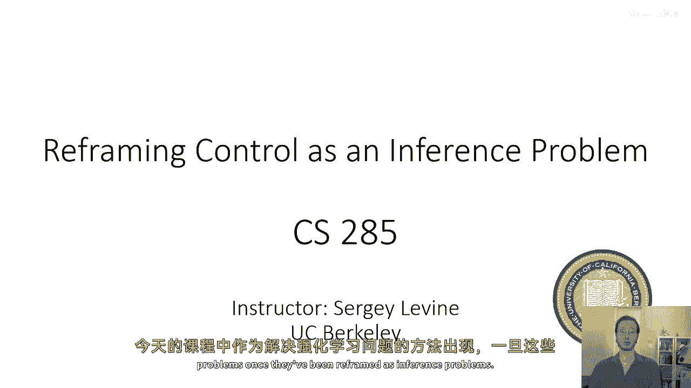
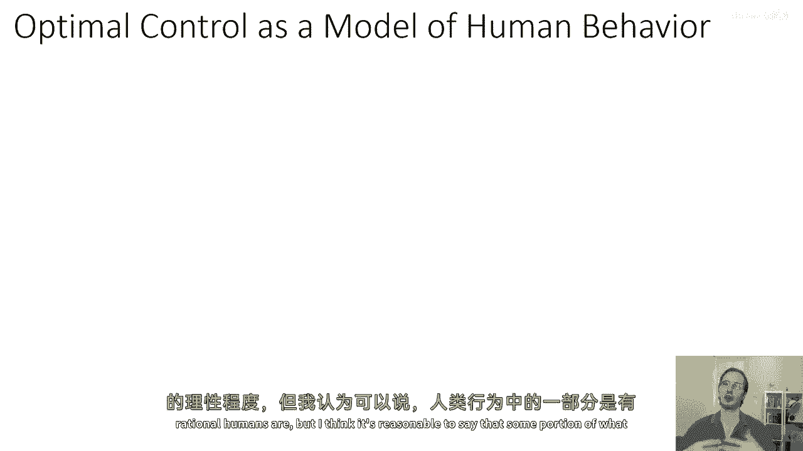
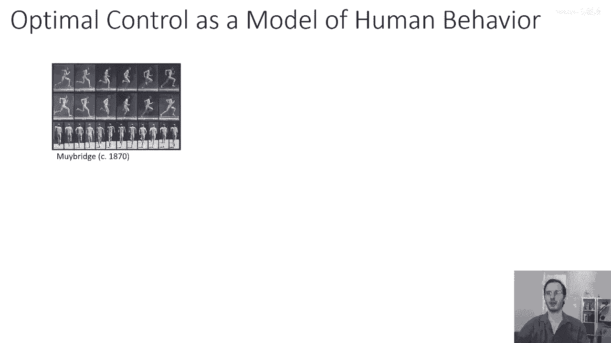
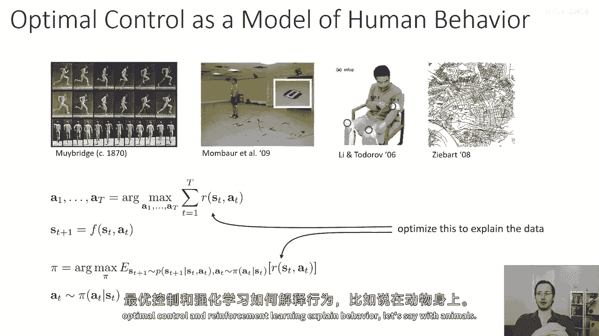
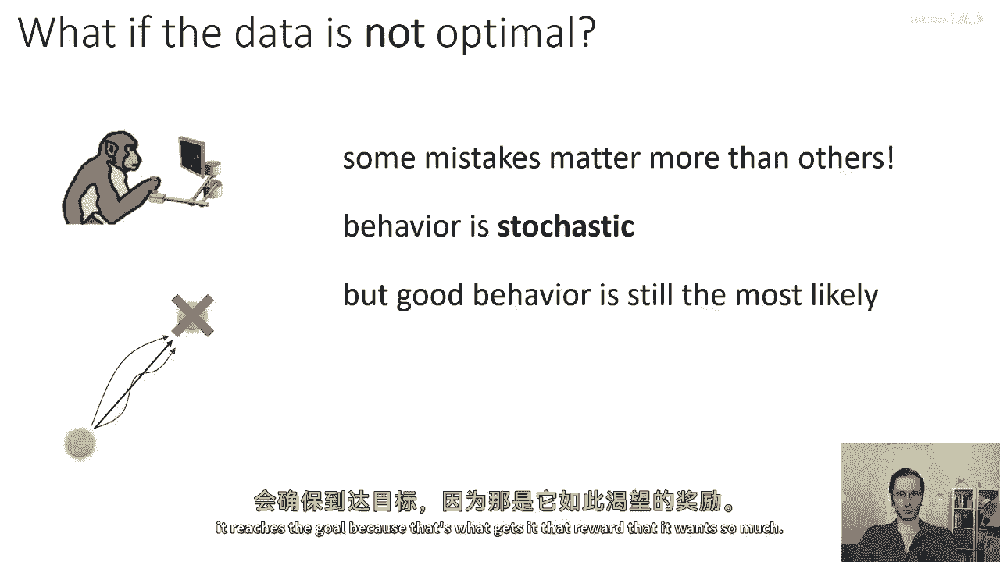
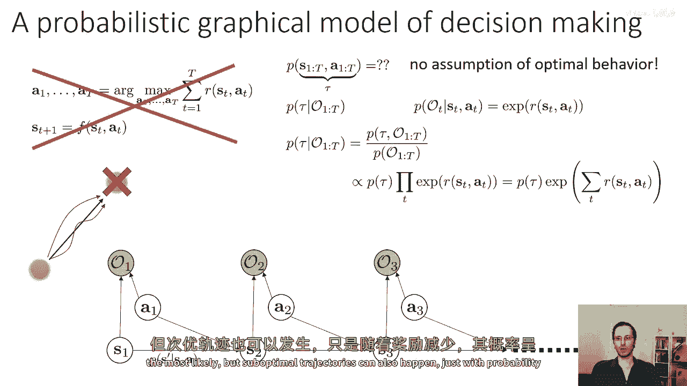
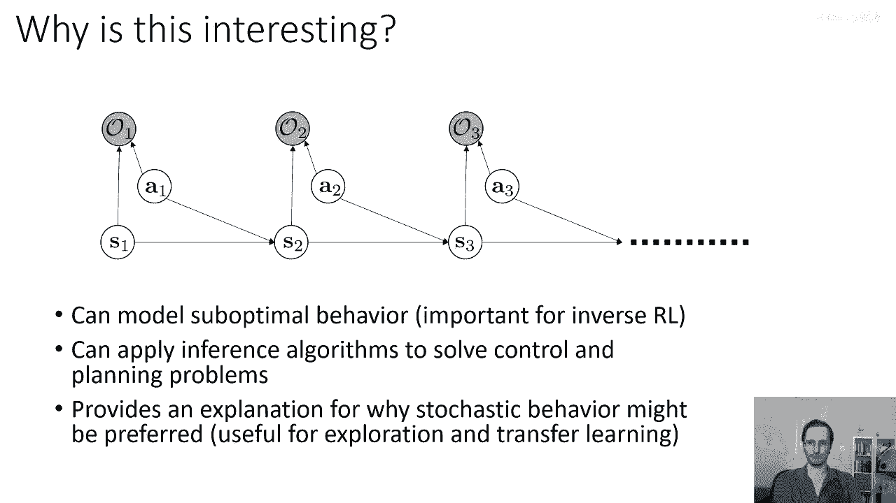
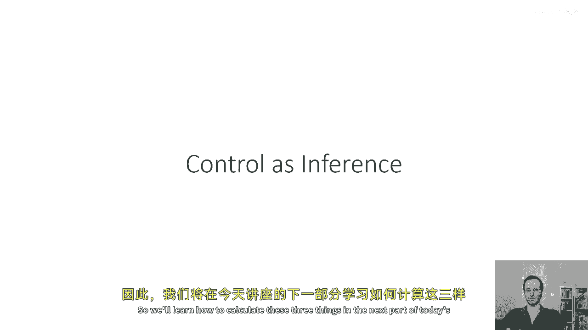

# 【深度强化学习 CS285 2023】伯克利—中英字幕 - P77：p77 CS 285： Lecture 19, Control as Inference, Part 1 - 加加zero - BV1NjH4eYEyZ

好的，嗯，欢迎参加今天的cs285课程第19讲，我们将讨论如何将控制问题重新定义为推断问题，并且我们将看到上周的变分推断课程中的一些想法，在今天的课堂上，它们将以解决强化学习问题的实际方法出现。

一旦它们被重新定义为推断问题，所以，在今天的课堂上。

我们将讨论以下问题，我们将讨论以下问题，强化学习和最优控制是否提供了一个合理的人类行为模型，我们是否可以找到比目前看到的传统最优性观念更好的解释，我们是否可以推导出最优控制，强化学习和规划作为概率推断。

如果是，我们在哪个模型中进行推断，这如何改变我们的强化学习算法，我们是否实际上基于这个基础衍生出更好的算法，然后在下一堂课中，我们将看到这些想法如何对于逆强化学习方法至关重要。

这些方法试图恢复观察到接近最优人类行为的奖励函数，所以今天的讲座目标将是理解推理和控制之间的关系，理解如何在这个框架中实例化特定的强化学习算法，并理解这可能实际上是一个好主意。

所以让我们从讨论我们如何可能建模人类行为开始，对，我们知道啊，你知道人类有时候做目标导向的事情，我们可以争论人类有多理性，但我认为可以说。

人类所做的一部分是目标导向的和有意图的，"嗯，而且"。

"你知道人们从很久以前就开始研究这个了"，你知道超过一百年，"研究如何最优地表现人类行为，从最基本的原始行为到最高级的复杂行为"，"就像我们走路和导航到地方的方式一样"，"我们如何追寻到高阶的概念。

直到触及最远的地方。"，"像我们如何规划一条在城市中导航的路线？"，"而且，如果我们是人类的理性智能生物，那么这么想是相当合理的。"，"然后。

我们应该从最低级别的运动控制到最高级别的认知技能来执行我们的任务。"，"以某种反映优化观念的方式"，确实，我们有一个与之相关的实用函数，我们在此接近最优，嗯，行为可以用明确的效用来表达，所以可以说。

我们有这个漂亮的框架，嗯，来思考我们讨论强化学习和最优控制时学到的最优决策，我们能用这个框架来尝试理解人类行为吗，我们可以做的事情之一，例如，如果我们可以说，让我们假设一个人或动物以最佳的方式行为。

那么他们是，我们可以根据哪个奖励函数，他们是最优的，这就是我们要讨论的，对于周三的逆向强化学习讲座，所以你可以在确定性设置中这样做，你在随机设置中可以做到这一点，嗯，在我们之前讨论的设置中。

你知道奖励函数，你想要恢复一个策略，现在，我们可能会认为正在看到一个人，我们正在看他们的策略，我们想要找到一个适合的奖励函数，来解释数据，来解释我们观察到的行为，所以，如果我们研究人类动物行为。

这是一个非常诱人的 idea，因为最优化原理提供了一个非常强大的工具，可以帮助我们理解某人可能为什么做某事，如果你能用一个简单且紧凑的目标函数来解释他们的行为，那么你就可以预测他们在其他情况下会做什么。

这当然非常直观，如果你知道某人想要什么，那么你就能更有效地预测他们将做什么，所以想象你自己扮演一个科学家的角色，你想要，嗯，思考如何，最优控制和强化学习解释了行为。

假设以动物为例，所以你会得到一个猴子，并且你会让这个猴子执行一些任务，你想要理解它的目标函数，所以一种你可能这样做的方法是你可能，嗯，选择一个任务，嗯，其中目标函数是已知的，也许猴子需要移动一个杠杆。

以便屏幕上的特定点现在匹配另一个点，然后猴子得到奖励，如果它这样做，现在，你可能会说，我知道奖励函数，所以如果最优行为是解释动物行为的好方法，那么我期待猴子的行为将与最优控制器相似，或强化学习算法。

那么让我们假设猴子要从这个橙色的圆圈移动到这个红色的十字，并且最优的轨迹是这个，然后研究者运行实验并发现猴子是一只相当聪明的猴子，像它通常都能到达红色十字，但它这样做的方式有很多种。

所以它并不总是走直线，也许有一天猴子感到有点懒，但它仍然到达目的地仍然得到奖励，那么发生了什么，是猴子只是聪明吗，嗯，有点傻，就像，你知道，也许一个真的很聪明的人可能会更准确，但是猴子并不准确。

只是发生了一些其他的事情，结果你发现，不出所料，猴子和人类通常不是完全最优的，我们通常都会犯错误，但是关键地，那些错误以这种方式出现，嗯，你知道，随着更多的练习，往往以对任务成功影响较小的方式出现。

所以直觉上，猴子可能选择间接路线到达目标的原因，是因为它感觉有点懒，它并没有真正注意，但是，它知道它达到目标的特定方式并不重要，"所以，这就是我们讨论过的当前强化学习算法中的一种。"。

"实际上并不在意"，他们没有懒惰的概念，"而且他们对理解某些事情不如其他事情重要没有概念。"，因此可以做得不那么完美，所以，有些错误比其它错误更重要，"并且，事实证明，适当地考虑这一点对于发展至关重要。

"，嗯，"解释人类和动物智能行为的模型"，"而且它还是一个工具，可以帮助我们构建更好的强化学习算法。"，然后构建逆向强化学习算法，人类的和动物的自然行为是，你知道，到第一阶近似。

随机意味着面对同样的情况两次，猴子现在不会再做同样的事情，我们可能会争论它是否真正随机，或者是否仅仅受到许多其他，外部和内部因素的影响，这些因素在实验中未被考虑，如，例如，也许猴子饿了。

也许它的手指痒痒的，也许它只是稍微有些疲倦，你知道，也许它分心了，并且不小心将操纵杆向左偏移了一点，但我们可以，从第一阶近似来看，将这些效果视为随机的，但良好的行为仍然是最可能的。

所以虽然猴子可能会容忍一些适度的错误，但它还是会确保达到目标，因为那就是它想要的，那它渴望的奖励。

那么我们需要一个关于接近最优行为的概率模型，而且我们已经有的模型实际上并不真正做这件事，它们并不真正告诉我们我们可能选择随机而不是最优的原因，实际上，对于最优控制和强化学习的确定性和随机性表述，实际上。

我们可以证明在所有完全可观察的设置中，存在确定的策略，这些策略是最优的，确实，对于任何状态动作边际线性的目标，这个陈述都是正确的，所以任何可以表示为状态动作下预期值的东西，一些与政策无关的奖励分布。

都会接受一个确定的策略作为解决方案，所以显然，这个框架不能解释随机行为作为理性的，所以我们需要一个种不同的概念的理性，当我们想要代表随机时，嗯，事件，我们经常依赖的一种非常强大的工具是概率图模型。

这就是我们在今天的讲座中要做的，实际上，我们将绘制一个概率图模型，使得在该模型中的推理结果接近最优行为，而且关键地，这种接近最优的行为并不总是与强化学习的解决方案相同，学习和最优控制，但它将非常相似。

它将看起来非常像之前幻灯片上看到的不理想的猴子行为，在所有其他条件相同的情况下，代理将尝试完成任务，但对于影响奖励影响较小的任务方面或更不重要的方面，代理更倾向于随机地做那些，好的，所以。

在思考如何为决策制定和控制绘制图形模型时，我们当然必须包括我们在mdp中看到的通常变量，即状态和动作，我们已经知道如何状态和动作，相互关联，目前我们将专注于完全观察的设置，因此。

我们也可以将这个图片添加观察值，但现在我们不会关心那个，只是为了避免符号的混乱，我们做的，然而，我们需要添加，如果一些额外的变量代表任务，代表，为什么代理可能选择采取一种行动或另一种行动，嗯。

到目前为止，我们已经有了转换概率，给定状态s和动作a，s'的概率P是多少，我们的目标是建模轨迹上联合分布，所以p(s1到t，a1到t)是多少，这就是我们的轨迹tau，那么我们可以将这个概率设置为多少。

如果我们只有mdp中的cpds，转换概率和初始状态分布，没有假设最优行为，所以我们必须添加其他东西来代表，你为什么可能会选择采取优于次优行动的行动，我们将这些最优性变量称为，我将它们标记为脚本。

如果这些最优性变量被观察到，如果你不知道，你知道猴子正在尝试完成这项任务，那么你会对它的行为做出不同的理解，我们现在要做一个稍微奇怪的建模选择，但是后来，我们将看到。

这个建模选择实际上导致了一个非常方便和优雅的数学公式，我们选择的建模方法是这些变量是二进制的，你可以把它们看作是基本上真或假的变量，说就是猴子在这个时间点上试图最优，如果猴子总是试图最优。

那么所有这些变量都被观察到，并且都被设置为真，因此，我们需要解决的推断问题是轨迹的概率是多少，给定从时间一到资本t的所有最优性变量都是真实的，或者我们可能会将这个推断条件设置为初始状态。

所以我们可以做p of tau给定一至t，或者p of tau给定o一至t，逗号 s 一个，并且我们选择的 p of ot 的分布形式是，给定 st 逗号 a t，t 是。

我们设置 ot 等于真的概率为，等于 st 逗号 a t 处的奖励的指数，现在，这也看起来像是某种任意的决定，我们稍后将看到，这个看似任意的决定实际上导致了一个非常方便和优雅的数学框架，但是。

目前我们只能接受它为事实，所以，让我们试试看，将这个设置为概率，并看看这个数学将带我们走向哪里，现在，我们需要满足一个技术条件才能使这个陈述成立，那就是我们需要所有的奖励都是负数的。

因为离散随机变量的概率必须小于一，在这种情况下，伯努利随机变量的概率必须小于一，任何正数的指数都将大于一，所以我们需要所有的奖励都是负数的，但幸运的是，最优行为对于奖励的加性因素是不变的。

所以如果奖励不是负数，你可以简单地构造一个与原始问题等价的决策问题，其奖励等于原来的奖励，减去可能的最大奖励，所以实际上设置它说奖励总是负数，仅仅意味着你减去最大值，这意味着所有其他剩余的奖励都是负数。

所以那不是实际上的限制，你可以这样做而不失去一般性，只要奖励是有界的，如果奖励是无界的，当然，这是不可能的，所以你可以获得无限的奖励，那么那行不通，但我也不知道如何处理无限的奖励，所以那也不是什么限制。

好的，所以现在我们已经定义了一个概率图模型，它有动态，它有奖励，看起来我们可以做贝叶斯规则风格的压缩并得到一些分布，并看看那个分布的方程是否实际上合理，"所以，我将插入条件概率的定义来写作"。

"给定o从一到t的tau，得到o从一到t的tau的p"，"由o的p分之一到t分割"，"然后，我可以将所有的uh cpds插入到这个里面"，"我就忽略分母"，"因为我只对轨迹的概率感兴趣"。

所以我会写这是与之成正比的，"它与之成正比的是我们所有cpds的乘积"，我将将其写作"τ"的概率"，这仅仅解释了动态和初始状态时间，所有这些伯努利随机变量从时间步一至t的概率乘积。

基本上意味着我们取tau的p的乘积，以及所有时间步的指数奖励的乘积，好的，这似乎相当合理，现在，我们知道指数的乘积，是指数和指数之和的指数，所以我们可以等价地写成一种方式。

可能稍微更有启发性地表达这个事物在做什么，"截至τ时刻，沿着该轨迹累积的奖励的总和乘以τ的指数"，"现在，这应该立即给我们一些相当吸引人的直觉，了解这个框架在做什么。"，例如，"想象一下。

动态是确定的"，这意味着τ的p值基本上只是一个指示变量，"如果τ是一条物理上一致的轨迹，那么结果为1，否则为0"，否则，"在那种特殊情况下"，我们将看到，最可能的轨迹是奖励最高的那一个。

"次优轨迹仍然具有非零的概率"，随着奖励的减少，其值呈指数级下降，这实际上似乎相当直观，它基本上意味着给猴子多个具有相同奖励的选择，它会在这些选择中随机选择，但如果有一个奖励远低于其他选择。

选择它的可能性会指数级降低，所以，它可能偏离直线轨迹到达目标的原因，是因为它从任何其他方式到达目标获得的奖励大约是一样的，也许因为它需要更长的时间，所以稍微低一些，因为它的折扣，它变得更饿。

但主要是一样的，而未能达到目标会导致一个得多得多的奖励，因此它不会那样做，所以这，直觉上似乎解释了我们在前一个幻灯片上看到的行为模式，我们基本上构建了一个概率模型，其中最优的轨迹是最可能的。

但次优的轨迹也可能发生，只是以概率指数级降低。

随着他们的奖励减少，好的，那么，这一切为什么有趣，我的意思是，你知道，如果我们想要建模猴子，当然，这对你来说可能很有趣，但如果你不太关心猴子，将次优行为近似视为最优行为，在某种宽松的优化观念下。

通常非常，对于理解次优代理的行为非常重要，也对模仿学习很重要，如果你想要理解人类试图向你展示的奖励函数，你需要考虑到他们不可能完全做到，而且这对于逆向强化学习来说非常重要，因为我们将在周三的讲座中讨论。

你也可以应用推断算法来解决基于这个框架的控制和规划问题，所以，因为我们绘制了一个概率图模型，其中推断对应于解决控制问题，这意味着我们可以带来，一系列的推断方法来实际解决控制和规划问题。

这就变成了一个相当强大的想法，最后，这解释了为什么随机行为可能会被偏好，即使确定行为是可能的，这就证明对于探索和学习迁移非常有用，探索和学习迁移中这是有用的，是因为，如果你以多种不同的方式执行任务。

那么你更有可能转移到新的环境中，在那里，任务现在需要稍微以不同的方式进行。

好的，所以，我们今天讲座的大部分内容，实际上，我们将讨论如何解决这个推断问题，我们将看到，将这个图形模型应用于精确和近似推断，导致算法与强化学习算法有许多相似之处，我们已经学习过。

那么在这个模型中如何进行推断，嗯，我们需要了解的有三种操作，我们需要的第一种操作是如何计算反向消息，所以，如果你已经学习了隐藏马尔科夫模型和/或常见滤波器，或者你听说过变量消除。

那么你可能已经对如何在这个模型中进行推断有一些想法，它是一个链状动态贝叶斯网，这意味着它应该非常易于通过消息传递进行推断，消息传递是，你知道，当然，变量消除的特定实例，所以。

我们在这样的图中想要计算两种类型的消息，非常像你在Hmm或评论过滤器中的行为，第一个消息是一个反向消息，反向消息告诉你现在成为最优的概率是多少，直到轨迹的结束，给定你在行动状态下的状态。

我们将这些反向消息称为beta，结果表明使用beta，你可以实际上恢复策略，所以策略是时间步t处的动作概率，给定时间步t处的状态，"考虑到从一点到大写字母T的整个轨迹是最优的证据"。

"这是在这个图形模型中的随机最优策略"，"结果发现，如果你能反向计算消息"，"你可以计算这个政策"，"第三种操作结果证明非常有用"，特别是在处理逆向强化学习时，就是要计算被称为前向消息的东西。

"向前的消息在某种程度上是向后消息的反向类比"，"一个向前的消息询问在特定状态st着陆的概率是多少"，"如果在时间步t-1时最优"，如果我们将反向消息和前进消息结合起来，实际上，我们可以恢复状态占用率。

这些并不是技术上必要来恢复最优策略的，但它们是进行逆强化学习的必要条件，所以。

