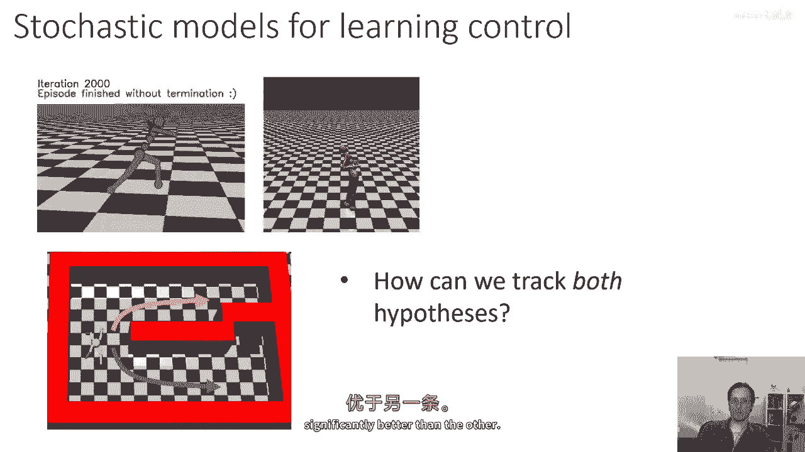
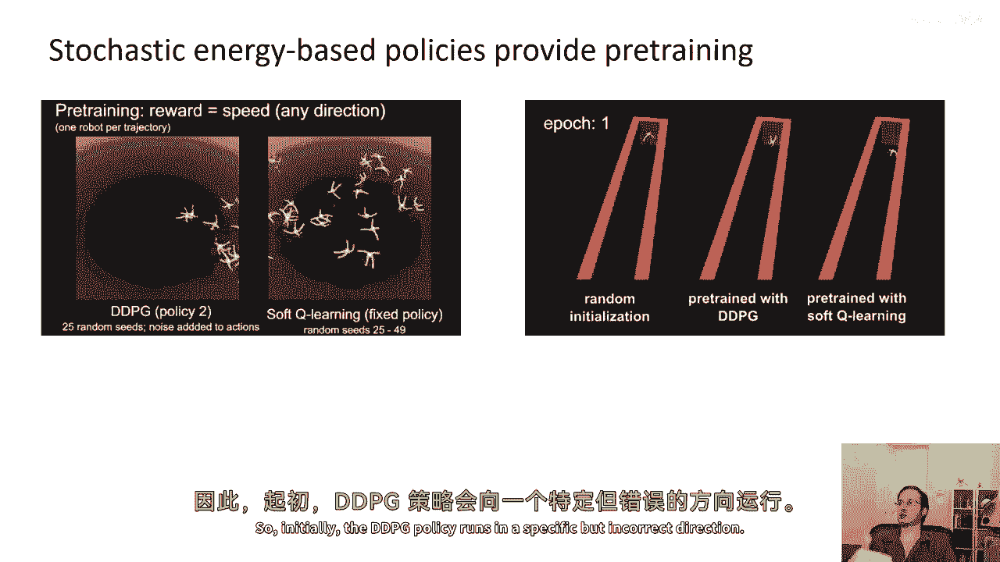
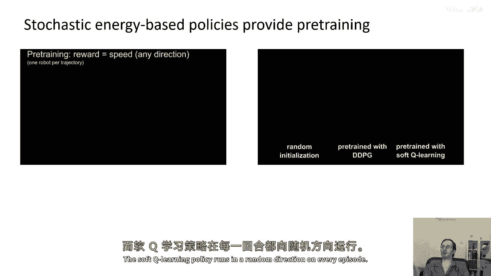
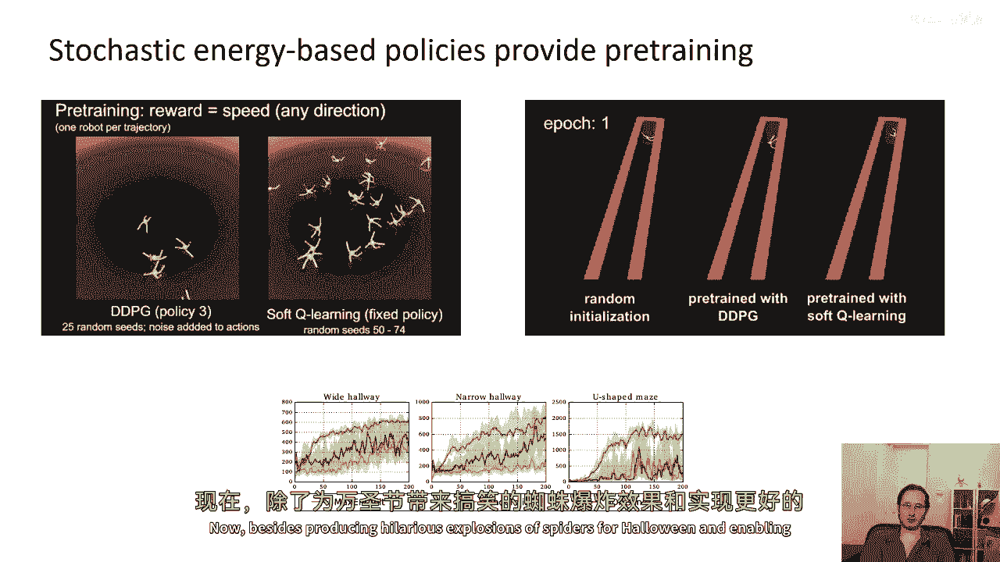
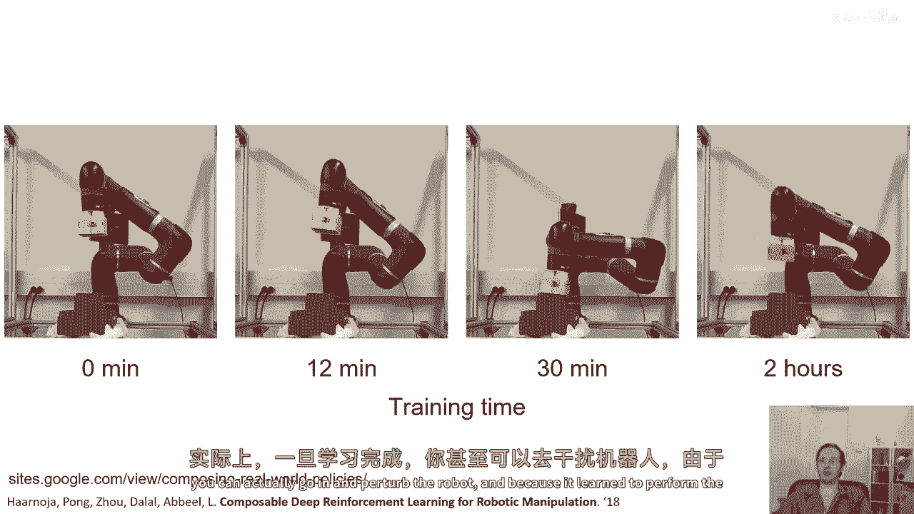
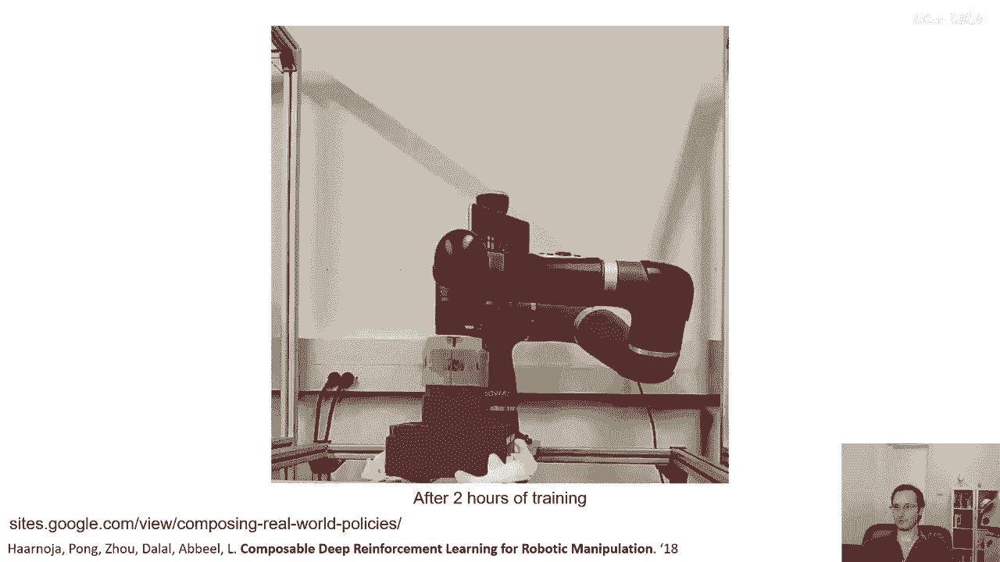
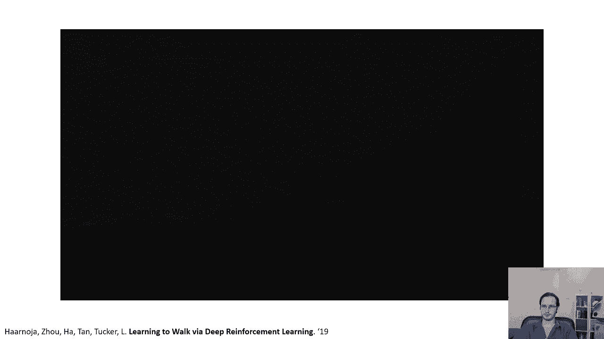
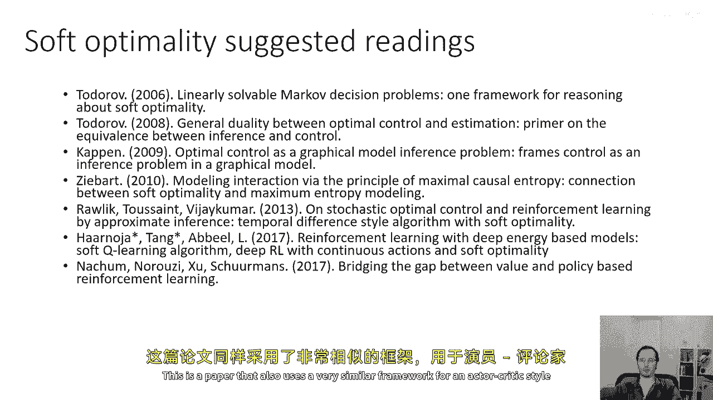

# 【深度强化学习 CS285 2023】伯克利—中英字幕 - P81：p81 CS 285： Lecture 19, Control as Inference, Part 5 - 加加zero - BV1NjH4eYEyZ

好的，在今天讲座的最后一部分，我将讨论一些以前的研究论文，这些实际上利用变分推断或软最优性框架，来实例化一些具有有趣特性的算法，所以首先我会谈论微调，探索和鲁棒性，假设我们运行一个，例如。

一个政策梯度算法来训练这个类人机器人行走，所以可以让他们走上去，看起来会很酷，非常有说服力，但如果我们运行同样的算法两次，我们可能会得到非常不同的门户，在第二次尝试中，类人机器人仍然行走。

但行走方式非常不同，实际上我们在深度RL中经常看到这种情况，运行同样的算法，多次并不总是导致两个相同的解决方案，直觉上，这个嗯，问题嗯，就是一种更复杂的，更一般的特定局部最优问题的版本。

这可能最好用简单的例子来说明，假设你有这个环境，在这个小机器人需要早期走到蓝色正方形指示的位置的环境中，当它开始学习，它可以选择探索上部通道或下部通道，两者都将它带到目标，所以它不知道哪一个更好。

但使用传统的强化学习算法，它可能会最终承诺两个通道中的一个，如果它随机选择错误的通道，那么我们就会陷入困境，它无法达到目的地，直觉上，如果你想解决这样的问题，你需要跟踪两个假设，基本上探索两个通道。

直到你发现一个明显优于另一个的通道。

这就是软Q学习实际上可以非常有效的地方，我所讨论的基于这篇由托马斯·卡诺亚和哈拉·塔格撰写的论文，嗯和强化学习与深度能基策略的论文，我们有我们的Q函数，它从状态和动作映射到，嗯，连续值，在训练的早期。

这个，代理在这里会看到，对于上部通道和下部通道的Q值都在增加，所以，你可以把这张图片看作是对q函数的一种粗糙的卡通示意图，在初始状态，它具有这两个峰值，一个对应于上部通道，一个对应于下部通道。

哪个峰值更高是相当任意的，它主要取决于每个通道上代理走多远，所以，如果它走得稍微更远一些上部通道，它会看起来稍微好一点，因为它离目标更近，所以，那个峰值可能只是稍微高一些，当它稍微高一些时。

代理将投入其探索和能量的过多比例，以探索上部通道，并且相应的峰将更高，如果我们选择根据这个变分推断框架来制定我们的策略，如果我们选择它等于指数q值的比例，我们将概率质量分配在两个峰上。

实际上探索两个通道，当然，如我之前所说，这个归一化值在这里只是价值函数，所以它有吸引人的解释作为优势的指数，因此这直接导致了软q学习程序，结果发现它具有这个好看吸引人的特性，我们将探索两种假设。

直到确定哪种是最好的，结果发现这种方法实际上对于预训练非常有用，因为如果你用它在未明确指定的任务中进行预训练，那么你将学习以各种不同的方式解决该任务，然后当环境发生变化，你需要专精你的技能时。

那么你只需要删除解决它的所有错误方法，而不是重新学习它，所以以例子来说明这一点，你知道，我正在10月31日第一记录这个，这是万圣节，所以这是一个非常合适的，我们在左边将会有蜘蛛的爆炸。

你可以在这里看到标准，在这种情况下，Ddpg确定性强化学习算法，有一个奖励函数说在任何方向上跑得很快在右边，你现在可以看到软q学习方法，当软q学习方法被给予在任何方向上运行时奖励很高的奖励。

它会尽可能多地向多个方向运行，因为那样会增加熵，而且还会产生一种非常适合万圣节的视频，具有这种恐怖的蜘蛛爆炸效果，你可能说，这有什么用，我们想要什么，嗯，乱跑的蚂蚁很好。

这有用的原因是如果你用这种方式预先训练策略，然后把它放在这样的环境中，比如走廊，它需要在特定的方向上进行微调才能运行，预先使用软Q学习训练的政策可以更快地进行微调，因此。

最初的DDPG政策在特定的但错误的方向上运行。

在每一集中，软Q学习政策都在随机方向上运行。

经过稍微的微调，软Q学习政策实际上需要学习不要在错误的方向上运行，并只保留正确的一个，而GPG政策需要学习如何不再在错误的方向上运行，然后重新学习如何在正确的方向上运行，这意味着它需要微调得多得多。

当然，我们在这里看到了这一点，蓝色线显示了来自软Q学习的微调，绿色线显示了现在来自确定性DDPG算法的微调，除了为万圣节产生令人爆笑的蜘蛛爆炸外。

并使微调更好，自我优化框架也可以简单地导致更性能，更有效的强化学习算法，实际上，今天最广泛使用的离线连续控制算法之一是被称为软演员批评者的东西，这是基于自我优化的原则。

软演员批评者是软Q学习的演员批评者的对应物，在软演员批评者中，有Q函数的更新，但它不是软最大，实际上，它正在尝试学习给定政策的Q函数，你可以认为这是在变分家族中的消息传递。

它看起来与常规演员批评者的Q函数更新完全相同，加上这个减去log pi的术语来考虑熵，然后，政策更新就像我之前展示的政策梯度目标一样，但使用这个Q函数，因为算法使用Q函数，它可以从离线数据学习，然后。

当然，每次更新Q函数，和更新政策时，它与世界交互并收集更多的数据来添加到其回放缓冲区，所以你可以认为这一步是，在RL的更新中，第一步，但在变分推断的术语中，它在对应于变分家族的图形模型中进行推断。

以进行消息传递，然后，政策的更新适应变分分布，以更好地近似原始图形模型的近似后验，所以算法的论证在某种程度上涉及到变分推断，但实际的实现实际上非常简单，它是一个基于Q函数的离线算法。

我们减去未来Q值的熵，这个算法证明非常有效，嗯，这是一个关于，一个uh，大豆机器人学习乐高积木堆叠任务的视频，实际上就是在真实世界中直接学习，这个实验有趣的地方不仅仅是它能够学习堆叠乐高块。

而是实际上一旦学习完成，你就可以实际进去干扰机器人。

因为它学会了以多种不同的方式完成任务，由于那个熵项，它实际上仍然相当 robust，所以你可以响应干扰，恢复并仍然堆叠乐高块。

所以它是非常，在这个任务中非常 robust，托马斯·哈诺伊还进行了一些非常有趣的实验，以使用此算法，以学习一些运动任务，所以这里这个机器人被称为米诺陶洛斯机器人。

它使用软演员批评在现实世界中直接学习行走，所以最初它只是随机移动，但在相当长的训练后，你可以实际上找出一个相当不错的前进门，所以这被加速了五倍，但现在我们将快进一点，到18分钟。

你可以看到它像是有一种逐渐爬行的方式，它能够向前移动，但是只有一点点，在36分钟，有时候它会跌倒，但有时候它会以相当快的速度向前移动，它像是在跳跃，有点像一只蟑螂。

然后在54分钟它有一种非常漂亮和可靠的步态，当然，门之前仍然有一定的坚固性，所以我们可以将其放在平坦的地面上，它可以大致展示我们所学到的，但我们也可以在它前面放一些障碍物，看看它如何反应，所以机器人。

当然，并没有在斜坡上进行训练，但是一旦将它放在斜坡上，它实际上反应得有些智能。

在这里它在下楼梯，"它不能完全走楼梯"，"但是它可以可靠地走下楼梯"，"而且，它还可以玩积木游戏"，但是，非常糟糕，好的，因此，讲座到此结束，"如果你对控制作为推断和软最优性的学习感兴趣"。

"我今天讨论的大部分材料都来源于之前的一项工作"，"被称为线性可解的马尔科夫决策问题"，所以，如果你对这个感兴趣，查看一下伊曼纽尔·托罗在这个主题上的一些工作。

伊曼纽尔·托沃的团队也在研究如何实现软最优性方面做出了开创性的工作，为控制人类运动的可能性提供了一种合理的解释，伯特·卡恩是另一个在这个领域做了大量基础工作的研究者，所以，如果你对这个感兴趣。

查看一下这篇论文，最优控制是一个图形模型推断问题，并且，当然，布莱恩·齐巴特是这一领域的先驱之一，特别是将这一原理应用于逆向强化学习的应用，我们周三会讨论很多这个问题。

关于这一主题的另一种有趣的论文是雷利克的这篇论文，那篇论文使用类似的数学工具来开发一种迭代的演员-批评者风格方法，当然，还有最近的论文，软Q学习，嗯。

这也是一篇使用与演员-批评者风格方法非常相似的框架的论文。

这篇论文还讨论了政策梯度和Q学习之间的关系，这是一篇描述现在被广泛使用的软医生批评论文的文章，基于软最优原则的离线策略强化学习方法，然后，如果你想要一种教程或综述概述。

我在2018年实际上写了一篇关于这个主题的教程。